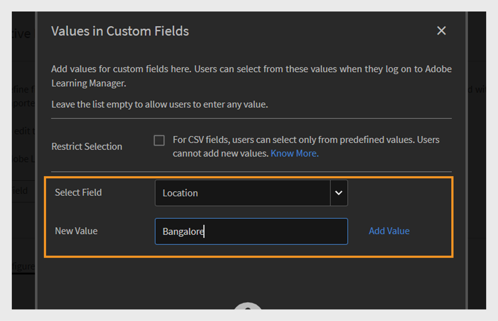

# Actieve velden

Actieve velden in Adobe Learning Manager zijn aangepaste gebruikerskenmerken waarmee beheerders gebruikers effectief kunnen ordenen en beheren. Hiermee kunt u extra informatie over de gebruiker vastleggen, zoals de afdeling, locatie of functie. Beheerders kunnen deze gegevens gebruiken om gebruikersgroepen te maken, leermateriaal te personaliseren en rapporten effectiever te filteren.

Gebruikerskenmerken zijn gegevens zoals de voornaam, achternaam en e-mailadres van een gebruiker. Met deze kenmerken kunnen beheerders:

* Gebruikers identificeren
* Groepsgebruikers
* Gebruikersmachtigingen en toegangsbeperkingen beheren

Door aangepaste kenmerken aan gebruikersprofielen toe te voegen, leggen actieve velden aanvullende informatie vast die relevant is voor uw organisatie.

>[!INFO]
>
>Bekijk deze opleiding van de Academie ALM om te leren, actieve gebieden toevoegen aan te passen en te vormen. [ &#x200B;](https://content.adobelearningmanageracademy.com/app/learner?accountId=98632#/course/7555741)  

## Actieve velden toevoegen

Actieve velden zijn van toepassing op zowel interne als externe studenten, zodat organisaties aangepaste gebruikerskenmerken voor alle gebruikers kunnen definiëren en beheren.

Actieve velden voor interne gebruikers toevoegen of beheren:

1. Selecteer **Gebruikers** op de beheerderhomepage.

2. Selecteer **Actieve Gebieden**.

3. Typ de actieve gebiedsnaam en selecteer dan **toevoegen**. Het proces voor het toevoegen van actieve velden voor externe studenten is hetzelfde als voor interne studenten.

   
   _Gebied om de naam van een nieuw douanekenmerk voor gebruikers in te gaan_

4. Selecteer **Opslaan**.

## Eigen waarden toevoegen aan actieve velden

Actieve velden kunnen vooraf gedefinieerde of aangepaste waarden bevatten die overeenkomen met de structuur van uw organisatie. Door aangepaste waarden toe te voegen, kunt u details vastleggen die specifiek zijn voor uw interne gebruikers, zoals afdelingsnamen, taakniveaus of regionale kantoren.

Aangepaste waarden toevoegen voor interne gebruikers:

1. Selecteer **de Waarden van de Mening** onder de **Actieve sectie van het Gebied**.
2. In de **Waarden in de dialoog van de Gebieden van de Douane**:

   * Selecteer een actief gebied van **Uitgezochte het drop-down Gebied**.
   * Typ de waarden van het actieve gebied op het **Nieuwe gebied van de Waarde**.

   
   _Dialoog om douanewaarden voor een specifiek actief gebied_ in te voeren

3. Selecteer **Gedaan** en selecteer dan **sparen** om veranderingen toe te passen.

## Actieve veldinstellingen configureren

Pas actieve velden aan om gebruikers te helpen bij het beheren en rapporteren van taken, en configureer de eigenschappen van actieve velden:

* **Groupable**: Deze optie staat u toe om studenten te groeperen die op actieve gebiedswaarden worden gebaseerd.
* **Te Rapporteren**: Deze optie staat u toe creeert een rapporterende gebruikersgroep die op de actieve gebiedswaarde wordt gebaseerd en laat de rapporteringsfilter voor het gebied in dashboardrapporten toe.
* **student-Configureerbaar**: Deze optie staat studenten toe om het gebied zelf te vormen.
* **Exportable**: Deze optie omvat het actieve gebied in uitgevoerde rapporten van de gebruikersgroep.
* **Multi-Value**: Deze optie steunt veelvoudige waarden voor het actieve gebied.

Actieve velden configureren:

1. Selecteer het **lusje van Montages** en navigeer dan aan de **sectie van de Vertoning van de Gebruiker**.

   
   _selecteer het lusje van Montages om de actieve gebieden aan te passen_

2. Selecteer zo nodig een of beide opties.toe:

   * **toon slechts niet-gevulde gebieden op studentenlogin:** wanneer geselecteerd, zullen de studenten slechts de actieve gebieden zien die zij nog niet hebben ingevuld. Ze worden dan gevraagd hun profiel te voltooien, zodat ze zeker weten dat de gebruikersgegevens accuraat en up-to-date zijn. Het weergeven van deze velden ondersteunt volledige studentprofielen en maakt gepersonaliseerde leerervaringen mogelijk.
   * **als ongecontroleerd, wordt de &quot;Voltooi Uw pagina van het Profiel&quot;niet getoond aan gebruikers:** wanneer deze optie gehandicapt is, zullen de studenten niet **zien Uw pagina van het Profiel** op login voltooien. Ze worden niet gevraagd profielgegevens bij te werken of in te vullen en hebben rechtstreeks toegang tot het platform.

   
   _interface van Montages om te controleren hoe en wanneer de actieve gebieden worden getoond_

3. Selecteer **sparen** om uw veranderingen toe te passen.

>[!NOTE]
>
>Het toewijzen van een nieuwe rol heeft geen invloed op aangepaste gebruikersgroepen. Dit is echter wel van invloed op automatisch gegenereerde gebruikersgroepen zoals Alle beheerders, Alle auteurs en vergelijkbare op rollen gebaseerde groepen.

## Actieve velden met meerdere waarden

Met meerdere waarden voor actieve velden kunt u meerdere waarden toewijzen aan één gebruikerskenmerk, zoals locaties, taaktitels of projectteams. Zo kunt u gedetailleerdere en flexibele gebruikersinformatie vastleggen.

U kunt maximaal drie actieve velden met meerdere waarden per account configureren. Deze zijn beschikbaar voor zowel interne als externe gebruikers. Nadat een veld is ingesteld op meerwaarden, kan deze instelling niet meer worden gewijzigd.

Meerdere waarden toewijzen aan een actief veld:

1. Selecteer **Gebruikers** en selecteer dan **Actieve Gebieden**.
2. In het **lusje van Montages**, uitgezochte **multi-gewaardeerd**.

_de interface van Montages om te controleren hoe en wanneer de actieve gebieden worden getoond_

U kunt meerdere waarden toevoegen via de CSV of via de gebruikersinterface. Als het veld met meerdere waarden eenmaal is gebruikt in een gebruikersgroep, kan het niet worden gewijzigd in een veld met enkele waarden.

## Actieve velden toevoegen door een CSV te uploaden

Voeg actieve velden toe bij het uploaden van gebruikers via CSV door overeenkomstige kopteksten op te nemen voor elk gedefinieerd veld. Beheerders kunnen gebruikers in bulk uploaden met een CSV-bestand. De CSV moet de nieuwe actieve velden bevatten die de te importeren gebruikers definiëren. Zorg ervoor dat de koptekstnamen in het bestand exact overeenkomen met de actieve velden die zijn ingesteld in het systeem, zodat de gegevens correct worden toegewezen. Upload het Csv- dossier van de **Gebruikers** sectie.

Bekijk dit [&#x200B; artikel &#x200B;](/help/migrated/administrators/feature-summary/add-users-user-groups.md) voor meer informatie over het toevoegen van gebruikers in bulk.

## Waarden beperken voor CSV-velden

De **optie van de Selectie van de Beperking** in **Waarden in de Gebieden van de Douane** controleert of de gebruikers die gegevens door Csv- dossiers invoeren slechts van vooraf bepaalde waarden voor douanevelden kunnen selecteren. Als deze optie is ingeschakeld, moeten gebruikers een keuze maken uit de lijst met waarden, zodat de consistentie van de gegevens wordt gegarandeerd en nieuwe of onverwachte items worden voorkomen. Als deze optie is uitgeschakeld, kunnen gebruikers elke waarde invoeren met meer flexibiliteit maar minder controle over de nauwkeurigheid van de gegevens.

_Checkbox om waardebeperking tijdens CSV toe te laten uploadt_

## Ontbrekende actieve velden beheren in CSV-import van gebruiker

In sommige gevallen geven beheerders er de voorkeur aan dat studenten bepaalde actieve velden handmatig invullen wanneer ze zich aanmelden bij Adobe Learning Manager. Dit wordt ondersteund voor gebruikers die zijn geïmporteerd via een CSV-bestand. Verwijs naar dit [&#x200B; artikel &#x200B;](/help/migrated/administrators/feature-summary/add-users-user-groups.md) voor hoe te om gebruikers in bulk toe te voegen. Gebruikers worden automatisch toegevoegd aan actieve velden of op rollen gebaseerde groepen op basis van Box FTP-veldwaarden. Ze kunnen niet worden toegevoegd aan Aangepaste groepen.

Als een CSV-bestand niet alle actieve velden bevat, moet de beheerder de ontbrekende waarden na het importeren handmatig invoeren.

Standaard moet elk actief veld worden toegewezen aan een overeenkomstig veld in de bron-CSV. Nochtans, als u geen specifiek actief gebied aan om het even welke kolom in CSV wilt in kaart brengen, kunt u de waarde **DontImportFromSource** van de drop-down lijst tijdens de de de invoerprocessen van de Doos en van FTP selecteren. Deze optie is beschikbaar wanneer u gebruikers importeert via FTP- of Box-connectoren. Verwijs naar dit [&#x200B; artikel &#x200B;](https://experienceleague.adobe.com/nl/docs/learning-manager/using/integration/connectors) voor meer informatie over de schakelaars.

