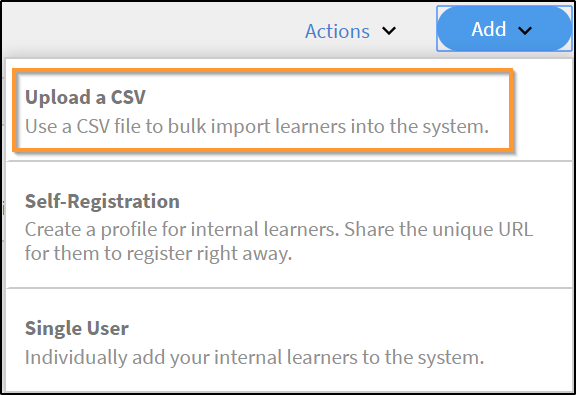

# Gebruikers toevoegen en gebruikersgroepen maken

Leer hoe u gebruikers of gebruikersgroepen in de Learning Manager-toepassing toevoegt.

<!---->

## Gebruikersgroepen beheren

>[!INFO]
>
>In deze training leert u hoe u een gebruikersgroep kunt maken op naam, e-mail-id&#39;s en meerdere automatisch gegenereerde gebruikersgroepen combineert.  

<!--[Launch training](https://learningmanager.adobe.com/app/learner?accountId=98632&sdid=QLD1P6BS&mv=display&mv2=display#/course/7555694)-->

<!--In this training, you will learn how to create a user group by names, email IDs, and combining multiple auto-generated user groups.-->

<!---->

Als u de training niet kunt starten, schrijft u naar <almacademy@adobe.com>.

## Overzicht {#overview}

In Adobe Learning Manager kunt u de volgende rollen aannemen:

* **Beheerder:** een beheerder bepaalt de trainingsstrategie voor de organisatie. Een beheerder kan studenten toevoegen, vereiste vaardigheden voor studenten zoeken, cursussen beheren en toewijzen, leerplannen, certificeringen en leerprogramma&#39;s maken en rapporten beheren voor de gehele organisatie.
* **Auteur:** auteurs zijn educatieve ontwerpers en contentcreators. Een auteur kan modules en cursussen toevoegen aan Learning Manager.
* **Manager:** managers beheren de leeractiviteiten van een team. Een manager kan teamleden aanwijzen om een cursus te volgen, verzoeken van teamleden goedkeuren en feedback geven op de prestaties van teamleden na voltooiing van de training. Managers kunnen ook rapporten bekijken zodat teamleden hun prestaties kunnen volgen.
* **Student:** studenten hebben toegang tot cursussen, leerprogramma&#39;s en certificeringen die aan hen zijn toegewezen. Studenten kunnen door alle beschikbare cursussen bladeren met behulp van een catalogus en zich inschrijven voor cursussen, leerprogramma&#39;s of certificeringen.

Als beheerder kunt u gebruikers op drie manieren toevoegen:

* Intern
* Extern
* Gebruikersgroepen

## Eén gebruiker toevoegen {#addasingleuser}

Voeg interne studenten aan de Adobe Learning Manager toe met behulp van één gebruikersoptie.

Als u de training niet kunt starten, schrijft u naar <almacademy@adobe.com>.

Gebruikers toevoegen:

1. Meld u aan als beheerder bij Learning Manager.
1. Klik op de startpagina op **[!UICONTROL Gebruikers toevoegen]**. Op deze pagina kunt u een of meerdere gebruikers toevoegen met behulp van een CSV-bestand. U kunt ook een zelfregistratielink maken voor interne werknemers of een extern studentenprofiel aanmaken.
1. Om één gebruiker toe te voegen, klikt u op **[!UICONTROL Toevoegen]** in de rechterbovenhoek en kiest u de optie **[!UICONTROL Enkele gebruiker]**.

1. Om één gebruiker toe te voegen, klikt u op **[!UICONTROL Toevoegen]** in de rechterbovenhoek en kiest u de optie **Enkele gebruiker**.

   
   *Eén interne gebruiker toevoegen*

1. In het dialoogvenster **[!UICONTROL Gebruiker toevoegen]** voert u de gegevens van de student in. Kies in het veld **[!UICONTROL Naam van manager]** de naam van een bestaande gebruiker in het systeem.

   
   *Gebruikersdialoogvenster toevoegen*

1. Klik op **[!UICONTROL Toevoegen]** om een nieuwe gebruiker aan Learning Manager toe te voegen. Nadat de gebruiker is toegevoegd, ontvangt hij/zij een verificatiemail.  De student activeert vervolgens zijn/haar account en kan Learning Manager dan beginnen te gebruiken. Deze workflow is handig als u een beperkt aantal studenten moet toevoegen aan uw LMS-account. Maar als u alle werknemers van een grote organisatie wilt inschrijven, kunt u ze ook in een keer toevoegen. In het volgende gedeelte vindt u meer informatie.

## Gebruikers in bulk toevoegen {#addusersinbulk}

Doorgaans werken organisaties met een HRMS (HR Management System) met daarin alle werknemersrecords zoals benoeming, locatie, datum van indiensttreding of werknemershiërarchie. U kunt deze gegevens in CSV-indeling exporteren. Volg de onderstaande stappen om een CSV te importeren:

1. Klik op **[!UICONTROL Toevoegen]** in de rechterbovenhoek en kies de optie **[!UICONTROL Een CSV uploaden]**.

   
   *Een CSV uploaden om gebruikers in bulk toe te voegen*

1. De CSV die u uploadt bevat de velden, zoals hieronder weergegeven:

   
   *Structuur van de CSV*

   U moet een CSV-master bijhouden en alle toevoegingen en verwijderingen in de CSV-master uitvoeren. Het master-CSV-bestand bevat de volgende velden:

   * name &#42;
   * email &#42;
   * profile
   * manager

   (&#42;) Vereist veld.

1. Nadat u op de optie **[!UICONTROL Een CSV uploaden]** hebt geklikt, wordt het volgende dialoogvenster weergegeven.

   
   *Een CSV-dialoogvenster uploaden*

1. Kies de CSV of sleep het bestand ernaartoe. Nadat u het bestand hebt gekozen, wijst u de gegevensvelden toe aan die in het CSV-bestand. Klik op de toepasselijke keuzelijst en kies het juiste veld.

   
   *Velden toewijzen in CSV*

1. Klik op **[!UICONTROL Opslaan]** om de gebruikers te importeren. Er wordt een bevestigingsbericht weergegeven.

   
   *Bevestigingsbericht voor geslaagde upload van de CSV*

1. De nieuwe gebruikers zijn nu toegevoegd aan uw Adobe Learning Manager-account. Om de nieuwe gebruikers te selecteren, vinkt u het vakje naast de namen aan.

   
   *Nieuwe gebruikers toegevoegd*

>[!NOTE]
>
>Zie voor meer informatie de veelgestelde vragen over [Gebruikers in bulk toevoegen](../add-users-in-bulk.md).

Nadat u de gebruikers hebt geselecteerd, kunt u het volgende doen:

## Een gebruiker registreren {#registerauser}

Selecteer de gebruiker en klik op **[!UICONTROL Acties]** in de rechterbovenhoek. Klik vervolgens op **[!UICONTROL Registreren]**.

De geselecteerde gebruikers ontvangen een welkomstmail. Als de gebruikers een bestaande Adobe ID hebben, kunnen ze op deze link klikken.  Als ze geen bestaande Adobe ID hebben, kunnen ze op de welkomstkoppeling klikken om een Adobe ID te maken en deze koppelen aan hun Learning Manager-account.

## Een rol toewijzen {#assignarole}

Nadat u studenten aan het Adobe Learning Manager-account hebt toegevoegd, kunt u hun rollen wijzigen door op Acties te klikken in de rechterbovenhoek van de pagina. Kies de optie **[!UICONTROL Rol toewijzen]**. Hier kunt u bepalen of u de student auteurs- of beheerderstoegang wilt geven. Nadat u een rol hebt toegewezen, heeft deze student auteurstoegang tot het account en kan hij modules toevoegen en cursussen maken.

*Een rol toewijzen aan een gebruiker*

## Een rol verwijderen {#removearole}

U kunt ook auteurs- en beheerderstoegang voor gebruikers verwijderen.  Selecteer een of meer studenten, klik op **[!UICONTROL Acties]** en selecteer **[!UICONTROL Rol verwijderen]**. Kies bijvoorbeeld een optie **[!UICONTROL Auteur verwijderen]** en wordt de auteurstoegang voor deze student ingetrokken.

>[!NOTE]
>
>Het is niet mogelijk handmatig een beheerdersrol aan iemand in het systeem toe te wijzen.  Ze krijgen automatisch toegang tot het beheerdersdashboard wanneer een of meer werknemers onder hen worden toegevoegd.

## Een gebruiker verwijderen {#deleteauser}

Om een gebruiker te verwijderen klikt u op **[!UICONTROL Acties]** en kiest u **[!UICONTROL Gebruiker verwijderen]**. Klik in het bevestigingsvenster op **[!UICONTROL Ja]** om de verwijdering te bevestigen.

*Bevestigingsbericht om een gebruiker te verwijderen*

## Een gebruiker bewerken {#editauser}

Kies een gebruiker in de gebruikerslijst en klik erop.  Klik op de **[!UICONTROL Bewerken]** ( ). Maak de benodigde wijzigingen in het dialoogvenster **[!UICONTROL Gebruiker bewerken]** en klik op **[!UICONTROL Opslaan]** om de wijzigingen op te slaan.

*Dialoogvenster Gebruiker bewerken*

## Actieve velden

### Gebruikerskenmerken beheren

In deze training leert u hoe u actieve velden kunt toevoegen, aanpassen en configureren.

Als u de training niet kunt starten, schrijft u naar <almacademy@adobe.com>.

Adobe Learning Manager behoudt de hoofdlettergevoeligheid van het gebruikerskenmerk en de waarde ervan. **Bijvoorbeeld** is de hoofdlettergevoeligheid van een gebruikerskenmerk &#39;locatie&#39; en wordt de waarde ervan als &#39;PARIS&#39; op dezelfde manier behouden en weergegeven. In het geval van problemen kan de beheerder nu de kenmerknaam en -waarden bewerken om eventuele hoofdlettergevoeligheidsfouten te corrigeren.

De beheerder kan dit doen door naar **[!UICONTROL Admin-app]** > **[!UICONTROL Gebruikers]** > **[!UICONTROL Gebruikersgroepen]** en op de groepsnaam te klikken.

Een beheerder kan via de gebruikersinterface toegestane kenmerkwaarden voor een student toevoegen en bijwerken.

Typen actieve velden:

* Te groeperen: groeperen van studenten op basis van de waarden
* Te rapporteren: rapportage van gebruikersgroepen gebeurt op basis van de actieve velden
* Te exporteren: de velden zijn zichtbaar in het geëxporteerde gebruikersgroeprapport.

## Een zelfregistratielink maken {#createaselfregistrationlink}

U kunt werknemers van uw organisatie ook in staat stellen zichzelf als student in te schrijven bij een Adobe Learning Manager-account zonder uw hulp als beheerder. De beheerder kan een koppeling voor zelfregistratie maken en deze delen met de medewerkers, die zich verder kunnen registreren bij Leermanager met hun Adobe-referenties.

Klik rechtsboven op de pagina op **[!UICONTROL Toevoegen]** en selecteert u **[!UICONTROL Zelfregistratie]**.

*Koppeling maken om zichzelf als student te registreren*

Het dialoogvenster **[!UICONTROL Zelfregistratieprofiel toevoegen]** wordt weergegeven.  Geef dit profiel een naam. Voeg vervolgens de naam van de manager toe.  Het is belangrijk om te weten dat de manager al een student moet zijn geregistreerd in Leermanager.

*Profiel toevoegen voor zelfregistratie*

Nadat u op **[!UICONTROL Opslaan]** hebt geklikt, wordt een URL gegenereerd die u met de studenten kunt delen. Zij kunnen op de URL klikken en zichzelf inschrijven.

## Externe studenten inschrijven {#enrollexternallearners}

In Adobe Learning Manager kunt u ook registratielinks maken voor externe partners of agentschappen met beperkte toegang tot uw account en leermateriaal aan hen verstrekken.

Er zijn enkele verschillen tussen interne en externe registraties.

<table>
 <tbody>
  <tr>
   <td>
    
<b>Interne gebruikers</b>
</td>
   <td>
    
<b>Externe gebruikers</b>
</td>
  </tr>
  <tr>
   <td>
    
Aanmelden met uw Adobe ID of SSO-gegevens
</td>
   <td>
    
Aanmelden met een e-mailadres
</td>
  </tr>
  <tr>
   <td>
    
Gamification is beschikbaar
</td>
   <td>
    
Gamification is niet beschikbaar
</td>
  </tr>
  <tr>
   <td>
    
Studentenhiërarchieën zijn beschikbaar
</td>
   <td>
    
Studentenhiërarchieën zijn niet beschikbaar
</td>
  </tr>
 </tbody>
</table>

Volg de onderstaande stappen om externe gebruikers in te schrijven:

1. Klik in het linkernavigatievenster op **[!UICONTROL Extern]**.

   

   *Externe gebruikers inschrijven*

1. Klik rechtsboven op de pagina op **[!UICONTROL Toevoegen]**.

1. Voeg in het dialoogvenster **Extern registratieprofiel toevoegen** de volgende details toe:

   * De profielnaam van de partnerorganisatie.
   * Het e-mailadres van de manager van de partnerorganisatie.
   * Plaatslimiet voor externe inschrijving voor deze partner.
   * Vervaldatum om een deadline in te stellen waarmee nieuwe registraties voor deze groep worden stopgezet. Na de vervaldatum hebben alleen bestaande geregistreerde gebruikers toegang tot deze training.

   

   *Dialoogvenster Extern registratieprofiel toevoegen*

   * In het dialoogvenster **[!UICONTROL Geavanceerde instellingen]** voert u de volgende gegevens in:

      * **[!UICONTROL Aanmeldingsvereiste]:** Geef een waarde op in dagen. Studenten worden verwijderd als ze zich gedurende de bovenstaande periode niet aanmelden.
      * **[!UICONTROL Toegestane domeinen]:** Een door komma&#39;s gescheiden lijst met e-maildomeinnamen op de whitelist.
      * **[!UICONTROL E-mailverificatie vereist]:** Selecteer deze optie om e-mailverificatie verplicht te maken voor een student.

   

   *Voer de details in het gedeelte Geavanceerde instellingen in*

1. Wanneer u op **[!UICONTROL Opslaan]** klikt, ziet u het volgende bevestigingsbericht. U moet de URL met uw externe partner delen.

   

## Een extern profiel inschakelen {#enableanexternalprofile}

Nadat een extern profiel is gemaakt, moet u de status ervan inschakelen.  Kies het gewenste profiel uit de lijst met externe profielen en zet de statusschakelaar op Aan.

*Een extern profiel inschakelen*

Hiermee wordt de link voor externe inschrijving geactiveerd. Er wordt automatisch een welkomstmail naar de partner gestuurd. U kunt de link ook kopiëren en delen door op het pictogram URL kopiëren () te klikken, of de welkomstmail nogmaals naar de partnerorganisatie sturen door op het e-mailpictogram () te klikken.

De partnermanager kan de verbinding met de werknemers delen die de opleiding in PrLearning Managerime moeten nemen. Wanneer ze op de link klikken, kunnen ze zichzelf inschrijven door enkele gegevens in te vullen om hun Learning Manager-profiel aan te maken. Deze gebruikers worden niet samen met de interne werknemers weergegeven op het tabblad Studenten. Hun namen staan op het tabblad **[!UICONTROL Externe studenten]**.

## Een extern profiel pauzeren {#pause}

Nadat u een externe gebruikersgroep aan Leermanager hebt toegevoegd, kunt u het registratieproces van externe gebruikers ook pauzeren. Wanneer u pauzeert, wordt het registratieproces van externe gebruikers geblokkeerd. Dit proces werkt echter alleen als de gebruikers zich nog niet hebben geregistreerd door de uitnodiging te accepteren.

Kies een groep of groepen, klik op **[!UICONTROL Acties]** in de rechterbovenhoek van de pagina en klik op **[!UICONTROL Pauzeren]** om de externe gebruikersgroepen te pauzeren.

## Een extern profiel hervatten {#resumeanexternalprofile}

U kunt de gepauzeerde status van een externe partner op elk moment intrekken en de normale services hervatten. Klikken **[!UICONTROL Handelingen]** in de rechterbovenhoek van de pagina en selecteer **[!UICONTROL Hervatten]**.

De volgende statussen zijn van toepassing voor externe gebruikers:

* **Inactief frame** - In deze status is de registratie van externe gebruikers verlopen. Beheerders stellen de vervaldatum voor de externe gebruikers in wanneer ze deze toevoegen via de workflow Gebruiker toevoegen.
* **Actief**: in deze status kunnen externe gebruikers zich bij de Learning Manager-toepassing registreren en zich bij de toepassing aanmelden.
* **Pauzeren**: in deze status is het registratieproces voor externe gebruikers geblokkeerd. Bestaande gebruikers kunnen zich echter nog steeds aanmelden.

## Gebruikte plaatsen controleren {#checkusedseats}

Klik in de lijst met externe profielen op **[!UICONTROL Gebruikte plaatsen]**. U kunt het aantal toegevoegde studenten van de partnerorganisatie bekijken.

*Gebruikte licenties controleren*

## Een gebruiker verwijderen {#Deleteauser-1}

Kies een gebruiker en klik rechtsboven op **[!UICONTROL Handelingen]** > **[!UICONTROL Gebruiker verwijderen]**.

## Profiel wijzigen {#changeprofile}

Als u een gebruiker naar een ander extern profiel wilt verplaatsen, kiest u een gebruiker en klikt u in de rechterbovenhoek op **[!UICONTROL Handelingen]** > **[!UICONTROL Profiel wijzigen]**. Kies een profiel uit de lijst met profielen en klik op **[!UICONTROL Wijzigen]**.

## Een rol toewijzen {#Assignarole-1}

Kies een gebruiker en klik rechtsboven op **[!UICONTROL Handelingen]** > **[!UICONTROL Rol toewijzen]** > **Merk`<role>`**. De gebruiker krijgt een nieuwe rol.

## Een rol verwijderen {#Removearole-1}

Kies een gebruiker en klik rechtsboven op **[!UICONTROL Handelingen]** > **[!UICONTROL Rol verwijderen]** > **Verwijderen`<role>`**. De geselecteerde rol wordt verwijderd uit de lijst met rollen die aan de gebruiker zijn toegewezen.

## Gebruikersgroepen maken {#createusergroups}

Een gebruikersgroep is een verzameling gebruikers die tot een categorie behoren. Met gebruikersgroepen kunnen beheerders studenten in hun organisatie op basis van hun kenmerken selecteren en vervolgens leermateriaal aan hen toewijzen. Met behulp van deze gebruikersgroepen kunnen beheerders ook aangepaste logo&#39;s en catalogi aan studenten toewijzen en aangepaste rapporten over hun voortgang weergeven.

Om toegang te krijgen tot gebruikersgroepen klikt u in het linkerdeelvenster op **[!UICONTROL Gebruikersgroepen]**.

*Gebruikersgroepen maken*

Er zijn twee soorten groepen in Adobe Learning Manager: Aangepast en Automatisch gegenereerd. Wanneer u studenten aan uw account toevoegt, worden bepaalde groepen automatisch aangemaakt op basis van gemeenschappelijke eigenschappen.

Klik op het tabblad **[!UICONTROL Automatisch gegenereerd]** om de automatisch gemaakte groepen weer te geven.

*Automatisch gegenereerde groepen weergeven*

U kunt zien dat er verschillende groepen zijn, zoals Alle interne gebruikers, Alle managers, en groepen op basis van de kostenplaats, afdeling en het team van de managers.

Naast de automatisch gegenereerde groepen kunt u ook aangepaste groepen maken. Als u een nieuwe aangepaste groep wilt toevoegen, klikt u rechtsboven op **[!UICONTROL Toevoegen]**.

1. Voer de naam en beschrijving voor de groep in.
1. Voer de naam of het profiel van een gebruiker in het zoekveld in en selecteer gebruikers om deze toe te voegen.

1. Klik op **[!UICONTROL Meer gebruikers toevoegen]**.

1. Klik op **[!UICONTROL Opslaan]** om de gebruikersgroep te maken.

Deze aangepaste groep is nu aangemaakt en aan het profiel toegevoegd.  De gebruikersgroepen die u maakt zijn dynamisch van aard. Als er nieuwe gebruikers met vergelijkbare kenmerken worden toegevoegd, worden ze automatisch aan de gebruikersgroep toegevoegd.

## Uitsluiting van gebruikersgroepen

Soms wilt u een kleine set gebruikers uitsluiten van een grote gebruikersgroep. Dit is vereist om deze specifieke groep gebruikers in te schrijven voor training via leerplannen of om de juiste zichtbaarheid van catalogi in te stellen. In deze versie van Leermanager kunt u studenten of gebruikersgroepen uitsluiten wanneer u een aangepaste gebruikersgroep maakt. In het dialoogvenster Gebruikersgroep toevoegen kunt u dit bereiken met de sectie Studenten uitsluiten.

*Gebruikersgroepen uitsluiten*

Als u bijvoorbeeld een leerplan wilt instellen, zodat alle gebruikers die tot de locatie = Californië behalve Store-5 (locatie Californië) behoren worden ingeschreven.

## Geavanceerde instellingen {#advancedsettings}

### Gegevensbronnen {#datasources}

U kunt deze functie gebruiken wanneer u de gebruikers of leergegevens uit de database van uw organisatie wilt importeren in of synchroniseren met de toepassing Leermanager. U kunt ook de frequentie van deze synchronisatie instellen.

Klikken **[!UICONTROL Gegevensbronnen]** in het linkerdeelvenster onder **[!UICONTROL Gedeeld]** sectie.

*Gegevensbronnen voor het importeren of synchroniseren van gebruikers*

Kies het type gegevensbron in het menu **[!UICONTROL Bron]** , selecteert u de updatefrequentie en klikt u op **[!UICONTROL Nu synchroniseren]** als u direct moet synchroniseren of klik op **[!UICONTROL Opslaan].** Gegevensbrontypen zijn SFDC, FTP, enzovoort voor interne gebruikers.

U kunt meerdere gegevensbronnen toevoegen.

### Actieve velden {#activefields}

Beheerders kunnen met deze functie meer actieve velden toevoegen in aanvulling op de velden die tijdens gebruikersregistratie zijn verstrekt.

Klikken **[!UICONTROL Actieve velden]** beschikbaar binnen de gebruikerspagina. Studenten kunnen alleen kiezen uit de waarden in aangepaste waarden.

*Actieve velden*

### Velden configureren {#configurefields}

**Interne gebruikers**

U kunt aangepaste waarden toevoegen voor gebruikersvelden voor interne gebruikers.

Ga als volgt te werk om aangepaste waarden toe te voegen:

1. Klikken  **[!UICONTROL Waarden wijzigen]** voor een interne gebruiker.

   
   *Waarden wijzigen voor interne gebruikers*

1. De **Waarden in veld Aangepast** wordt weergegeven.

   
   *Dialoogvenster Waarden in aangepaste velden*

1. Selecteer de waarde die u wilt toevoegen in het keuzemenu **[!UICONTROL Veld selecteren]**.
1. Voer nieuwe waarden in het veld **[!UICONTROL Nieuwe waarde]** in.
1. Klik op **[!UICONTROL Klaar]**.
1. Klik op **[!UICONTROL Opslaan]** in de rechterbovenhoek om de wijzigingen op te slaan.

**Externe gebruikers**

Voeg aangepaste waarden toe die vergelijkbaar zijn met die voor interne gebruikers.

*Waarden wijzigen voor externe gebruikers*

### Instellingen {#settings}

**Gebruikersweergave**

Als de optie **Alleen niet-ingevulde velden weergeven bij aanmeldnaam student** is ingeschakeld, ziet een gebruiker alleen de lege velden bij het aanmelden.

*Niet-gevulde velden weergeven*

Met deze optie kan een beheerder beslissen of hij/zij de velden wilt weergeven of verbergen zodra ze zijn ingevuld.

## Actieve velden in rapporten beperken {#restrictactivefields}

Learning Manager 27.7 introduceert twee nieuwe opties: **[!UICONTROL Te rapporteren]** en **[!UICONTROL Exportable]**, voor Actieve velden.

*Opties in actieve velden*

Voor CSV-velden en handmatig toegevoegde velden geldt dat als een actief veld is gemarkeerd als **[!UICONTROL Rapporteerbaar]**, het actieve veld kan worden gezocht in een filter in een dashboardrapport.

*Filters in een dashboardrapport*

Als een actief veld is gemarkeerd als **[!UICONTROL Exporteerbaar]**, wordt het actieve veld weergegeven in het Excel-bestand wanneer u een Excel-rapport downloadt.

Deze opties worden voor zowel interne als externe actieve velden weergegeven.

U kunt alleen een aangepast actief veld verwijderen.

## Gebruikersweergave

U kunt de volledige pagina &#39;Uw profiel voltooien&#39; verbergen voor de studenten. De pagina verschijnt niet als de student zich heeft aangemeld.

Het bestaande standaardgedrag verandert niet. Deze optionele mogelijkheid is nu beschikbaar voor beheerders.

Schakel de opties hieronder in:

*Gebruikersweergave, sectie*

## Ondersteuning voor handmatige CSV-velden via FTP- en Box-connectors {#import-connector}

Vaak willen gebruikers dat de actieve velden handmatig worden ingevuld wanneer een student zich aanmeldt bij Leermanager. Dit is nu mogelijk in Learning Manager wanneer de gebruiker een CSV handmatig importeert.

Het CSV-bestand mag niet alle actieve velden bevatten. Voor alle actieve velden die niet zijn bijgewerkt in de geüploade CSV, moet de gebruiker de gegevens voor dergelijke actieve velden invoeren.

Momenteel moeten alle actieve velden worden toegewezen aan een veld van de bron-CSV.

Soms wil een gebruiker een Actief veld niet toewijzen aan een veld dat is opgegeven in de CSV. In dergelijke gevallen kan de gebruiker het veld Actief toewijzen aan de waarde **[!UICONTROL DontImportFromSource]**. Selecteer deze waarde in de vervolgkeuzelijst wanneer u gebruikers importeert van FTP- en Box-connectoren.

## Aangepaste rollen {#customroles}

Voeg de gewenste velden aan uw gebruikersinformatie toe en klik op **[!UICONTROL Opslaan]**. Nadat u de velden hebt toegevoegd, kunt u ook de beschikbaarheid van de velden in de **[!UICONTROL Gebruikers bewerken]** in.

De velden met een vinkje komen uit de gegevensbron of CSV zoals te zien in het onderstaande voorbeeld. De beheerder kan deze velden bewerken door ze in of uit te schakelen.

**Waarden voor actieve velden in Leermanager**

De waarden voor actieve velden worden als volgt opgehaald:

1. De Learning Manager-toepassing importeert metagegevens uit gegevensbronnen die aan uw account gekoppeld zijn.
1. Metagegevens die zijn vastgelegd uit het handmatig geïmporteerde CSV-bestand.
1. Studenten vullen metagegevens in wanneer ze zich aanmelden.
1. Beheerder voert gegevens voor de gebruikers in.

>[!NOTE]
>
>De Learning Manager-toepassing maakt automatisch gebruikersgroepen van deze metadata.

**Aangepaste waarde toevoegen**

U kunt een aangepaste waarde toevoegen voor gebruikersvelden in de velden Interne en Externe gebruiker.

Ga als volgt te werk om aangepaste waarden toe te voegen:

Aangepaste velden kunnen worden toegevoegd en verwijderd. Ze zijn van toepassing op alle gebruikers. CSV-velden kunnen worden in- of uitgeschakeld. Ze worden alleen van kracht wanneer u CSV uploadt nadat u wijzigingen in de actieve velden heeft doorgevoerd. Alle interne actieve velden zijn van toepassing op alle typen interne gebruikers. Externe velden zijn alleen van toepassing op externe gebruikers. Als er een aangepast veld aanwezig is in CSV, wordt het bij de volgende upload automatisch naar een CSV-veld geconverteerd en ingeschakeld.

## Waarden voor CSV-velden {#valuesforcsvfields}

Als het selectievakje **[!UICONTROL Selectie beperken]** is ingeschakeld, kunnen gebruikers alleen kiezen uit vooraf gedefinieerde velden voor CSV-velden.

*Selectievakje Selectie beperken*

## Importlogboeken {#importlogs}

In deze ruimte kunt u de CSV-importgeschiedenis bekijken voor de gebruikers die de beheerder via bulkimport heeft toegevoegd. U kunt ook op **[!UICONTROL Toevoegen]** rechtsboven op de pagina om gebruikers toe te voegen met behulp van de CSV-uploadfunctie.

## Actieve velden met meerdere waarden

Met deze functie kunt u meer dan een veld hebben voor een actief veld. Binnen een account kunnen er maximaal drie actieve velden met meerdere waarden zijn. De actieve velden met meerdere waarden zijn zowel voor interne als externe gebruikers beschikbaar.

Zodra u een actief veld markeert met meerdere waarden, kunt u het niet terugzetten naar een enkele waarde. Dit is onomkeerbaar.

Een bestaand veld met een enkele waarde kan niet worden gemarkeerd als veld met meerdere waarden.

Volg de onderstaande stappen om een actief veld met meerdere waarden te maken:

1. Voeg een actief veld toe.

   
   *Een actief veld toevoegen*

1. Klik op Toevoegen.
1. Markeer op het tabblad Instellingen het nieuwe veld als een veld met meerdere waarden.

   
   *Markeren als meervoudig getaxeerd*

   Er is nog een selectievakje, **[!UICONTROL Student configureerbaar]**, die de student het veld op de profielpagina niet kan zien als hij of zij dit heeft uitgeschakeld.

1. Voeg de waarden toe met behulp van een CSV of door op Waarden wijzigen te klikken.

   
   *Waarden toevoegen*

1. Klik op [!UICONTROL **Klaar**].

>[!NOTE]
>
>Als de gebruikersgroep eenmaal is gemaakt en het veld is ingevuld, kunnen meerdere waarden niet worden omgezet in enkele waarden, en omgekeerd.

### Actief veld met meerdere waarden toevoegen via CSV

Volg onderstaande stappen:

1. Maak een CSV met de nieuwe actieve velden als kolommen (met een komma gescheiden enkele waarden).
1. Importeer de CSV.
1. Markeer de velden als multiwaardevol in het dialoogvenster Waarden in aangepaste velden.
1. Importeer de CSV nogmaals.

 De CSV moet een kolom hebben met dezelfde naam als het actieve veld dat is gemarkeerd met meerdere waarden.

De CSV bevat de velden:

* **[!UICONTROL Gebruiker]**: Gebruikersgroepen die zijn gemaakt als rollen.
* **[!UICONTROL Rollen]**: Actief veld met meerdere waarden.

Als de CSV opnieuw wordt geüpload met nieuwe waarden of verwijderde waarden, worden de actieve velden en groepen dienovereenkomstig geüpdatet.

### Rapporten

Alle rapporten omvatten de actieve velden met meerdere waarden, en hun waarden.

De beheerder kan automatisch aangemaakte actieve velden toevoegen, en gebruikersactiviteit en trainingsrapporten configureren.

Het studenttranscript-rapport bevat alle actieve velden en door een komma gescheiden waarden. De beheerder kan de gegevens dienovereenkomstig filteren.

## Veelgestelde vragen {#faq}

+++Hoe registreer je gebruikers in Learning Manager?

Nadat u een gebruiker hebt toegevoegd en een rol aan de gebruiker hebt toegewezen, kunt u de gebruiker registreren door de onderstaande stappen uit te voeren:

1. Selecteer de gebruiker of gebruikers en klik op **[!UICONTROL Handelingen]** in de rechterbovenhoek en klik op **[!UICONTROL Registreren]**.

1. Klik in het pop-upvenster op **[!UICONTROL Ja]**.

De geselecteerde gebruikers ontvangen een welkomstmail. Als de gebruikers een bestaand Adobe ID hebben, kunnen ze op deze link klikken.  Als ze geen bestaande Adobe ID hebben, kunnen ze op de welkomstkoppeling klikken om een Adobe ID te maken en deze koppelen aan hun Learning Manager-account.

Studenten moeten op een van deze koppelingen in de e-mail klikken omdat Leermanager daarmee het account van de student kan verifiëren.

+++

+++Hoe kan ik gebruikersgegevens bewerken?

Volg de onderstaande stappen om een gebruiker te bewerken:

1. Klik in de lijst met gebruikers op de gebruiker waarvoor u de gegevens wilt bewerken.
1. Klik op het potloodpictogram, zoals hieronder weergegeven.

Werk de velden bij in het dialoogvenster **Gebruiker bewerken**. Klik op **[!UICONTROL Opslaan]** om de wijzigingen op te slaan.

+++

+++Een externe gebruiker pauzeren en hervatten in Leerbeheer?

Kies in de lijst met externe gebruikers de gebruiker die u wilt verwijderen. Klik rechtsboven op **[!UICONTROL Handelingen]** > **[!UICONTROL Pauze]**.

Zie [Een extern profiel pauzeren](add-users-user-groups.md#pause) voor meer informatie.

Nadat u een profiel hebt gepauzeerd, wordt de status van het externe profiel als ***Gepauzeerd*** weergegeven.

+++

+++Hoe kan ik welkomstmail verzenden naar nieuw gemaakt extern profiel?

Wanneer u een externe gebruiker toevoegt, kunt u in het dialoogvenster **[!UICONTROL Extern registratieprofiel toevoegen]** voert u de e-mail van de externe manager in. Als u op Opslaan klikt, wordt er ook een welkomstmail naar het gespecificeerde e-mailadres verzonden. Als u de welkomstmail nog een keer wilt verzenden, klikt u op het pictogram met een envelop, zoals hieronder weergegeven:

+++

+++Hoe maak ik aangepaste gebruikersgroepen?

Klikken **[!UICONTROL Gebruikers]** > **[!UICONTROL Gebruikersgroepen]** en op de pagina Gebruikersgroepen klikt u op **[!UICONTROL Toevoegen]**. Voeg in het dialoogvenster Gebruikersgroep toevoegen de gebruikers zowel afzonderlijk als als als als team toe.

+++

+++Hoe schakel ik al gevulde actieve velden uit?

Als u wilt dat studenten alleen de actieve velden zien die niet door hen zijn ingevuld, volgt u de stappen hieronder:

1. Klikken **[!UICONTROL Gebruikers]** > **[!UICONTROL Actieve velden]**.

1. Klikken **[!UICONTROL Instellingen]** en de optie **[!UICONTROL Alleen niet-ingevulde velden weergeven bij aanmeldnaam student]**.

1. Klik op **[!UICONTROL Opslaan]**.

+++

+++Hoe kan ik voorkomen dat studenten willekeurige waarden in de actieve velden invoeren?

U kunt de selectie voor studenten beperken, zodat ze alleen de waarden kunnen selecteren die vooraf gedefinieerd zijn en geen willekeurige waarden kunnen invoeren. Volg onderstaande stappen:

1. Klikken **[!UICONTROL Gebruikers]** > **[!UICONTROL Actieve velden]**.
1. De optie **[!UICONTROL Selectie beperken]** inschakelen.
1. Klik op **[!UICONTROL Klaar]**.

+++

+++Hoe kan ik onderscheid maken tussen actieve CSV-velden en aangepaste actieve velden?

U kunt actieve csv-velden alleen in- of uitschakelen, maar niet verwijderen. Aangepaste actieve velden daarentegen kunt u niet in- of uitschakelen.

+++
