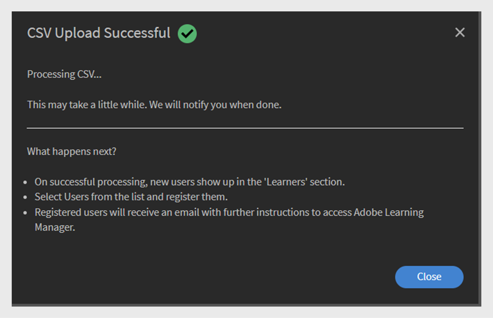
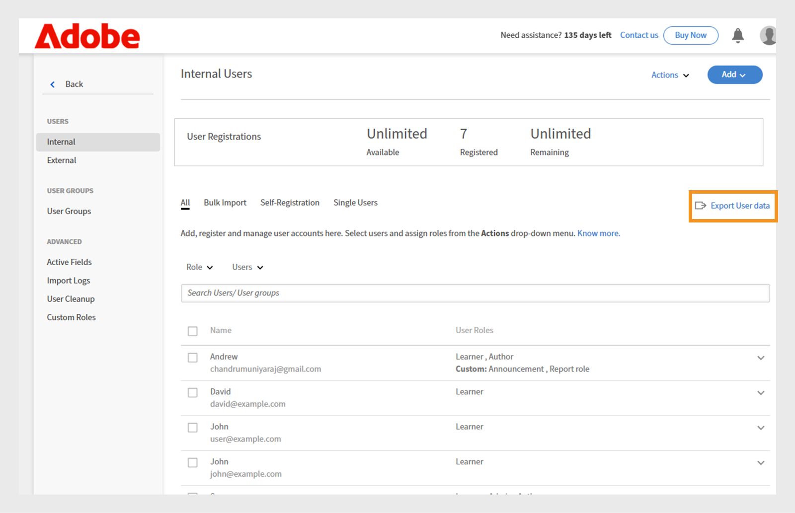

# Gebruikers toevoegen in Adobe Learning Manager

In Adobe Learning Manager zijn gebruikers studenten die het platform voor leren of training gebruiken. Er zijn twee soorten gebruikers: interne gebruikers en externe gebruikers.

Interne gebruikers zijn werknemers of teamleden van uw organisatie.

Externe gebruikers zijn studenten buiten uw bedrijf, zoals klanten, partners, leveranciers of klanten, die toegang hebben tot uw leerinhoud.

Met Adobe Learning Manager (ALM) kunnen beheerders zowel interne als externe gebruikers onboarden en beheren met behulp van verschillende methoden, waaronder handmatige invoer, CSV-upload, zelfregistratie en systeemintegraties.

## Interne gebruikers

Interne gebruikers in Adobe Learning Manager verwijzen naar werknemers of teamleden binnen uw organisatie. U kunt ze handmatig toevoegen, in bulk uploaden of importeren via systeemintegraties. Nadat u deze gebruikers hebt toegevoegd, kunt u ze in groepen indelen, cursussen toewijzen en de voortgang van het leren volgen.

Gebruikers in Adobe Learning Manager kunnen verschillende verantwoordelijkheden op zich nemen en verschillende taken beheren op basis van hun toegewezen rollen. Elke rol, inclusief beheerder, auteur, docent en integratiebeheerder, biedt een reeks specifieke mogelijkheden die zijn afgestemd op de ondersteuning van de verantwoordelijkheden van de gebruiker binnen het platform.

### Methoden om interne gebruikers toe te voegen

Beheerders kunnen op de volgende manieren interne gebruikers toevoegen:

* **voeg één enkele gebruiker** toe: voeg manueel één gebruiker tegelijkertijd toe.
* **profiel van de zelfregistratie**: sta studenten toe om zich als studenten in Adobe Learning Manager te registreren gebruikend een registratiekoppeling die door de beheerder wordt gecreeerd.
* **Bulk uploadt via CSV**: Upload een Csv- dossier om veelvoudige gebruikers meteen toe te voegen.

### Handmatig een interne gebruiker toevoegen

Beheerders kunnen handmatig een gebruiker toevoegen door hun naam, e-mail, unieke id en de naam van de manager op te geven. De unieke id in Adobe Learning Manager is een vereiste id die beheerders toewijzen bij het maken van een gebruiker. Deze moet uniek zijn voor elke gebruiker en als een consistente referentie in het hele systeem fungeren.

>[!INFO]
>
>Bekijk deze ALM Academy-training voor meer informatie over het toevoegen van enkele gebruikers in Adobe Learning Manager. [ &#x200B;](https://content.adobelearningmanageracademy.com/app/learner?accountId=98632#/course/7555534)  

Eén gebruiker toevoegen aan Adobe Learning Manager:

1. Meld u aan als beheerder.
2. Selecteer **Gebruikers**, dan kies **Intern**.
3. Selecteer **voeg** toe, dan kies **Enige Gebruiker**.

   
   _interface die van de Beheerder de optie toont om één enkele interne gebruiker manueel toe te voegen_
4. Op **voeg de herinnering van de Gebruiker** toe, typ de **Naam**, **E-mail** en **Profiel** (baantitel) van de gebruiker.

   
   _Gebieden om naam, e-mail, uniek herkenningsteken, en profiel voor een nieuwe gebruiker in te gaan_
5. Zoek naar de manager van de gebruiker en selecteer de naam in de lijst met managers.
6. Selecteer **toevoegen**.
De gebruiker ontvangt een welkomstmail met een aanmeldings-URL voor toegang.

### Zelfregistratie voor interne gebruikers toestaan

Zelfregistratie is een zelfserviceonboardingproces waarbij gebruikers een registratie-URL kunnen bezoeken, hun gegevens kunnen invoeren en zich automatisch kunnen inschrijven voor het platform. Deze methode minimaliseert de administratieve inspanning door gebruikers toe te staan om zich door verstrekte URL te registreren.

U kunt als volgt een zelfregistratie-URL voor een gebruiker maken:

1. Meld u aan als beheerder.
2. Selecteer **Gebruikers**, dan kies **Intern**.
3. Selecteer **voeg** toe, dan kies **Zelfregistratie.**

   
   _menu Dropdown voor het selecteren van de zelfregistratieoptie_
4. Op **voeg automatisch-Registratieprofiel** herinnering toe, typ het profiel in het **Naam van het Profiel** (de titel van de Taak van de gebruiker) gebied.
5. Selecteer de manager van de gebruiker door naar de manager in het **gebied van de Naam van de 0&rbrace; manager te zoeken.** De manager die aan het zelfregistratieprofiel wordt toegewezen, moet een geregistreerde gebruiker in Adobe Learning Manager zijn.

   
   _gebieden van de Input voor het plaatsen van de profielnaam en het toewijzen van een manager aan een zelfregistratieprofiel_
6. Selecteer een beeld gebruikend **voeg de optie van het Beeld** toe. Deze afbeelding is zichtbaar voor de studenten in de profielsectie.
7. Selecteer **Opslaan**.

   Adobe Learning Manager maakt een gebruikersprofiel en genereert een zelfregistratie-URL die met de gebruikers kan worden gedeeld om hun registratie te voltooien.

   
   _Bevestigingsbericht dat op succesvolle verwezenlijking van een zelfregistratie URL wijst_
8. Deel de URL met de gebruikers die zichzelf willen registreren.

   De URL kan voor registratie met meerdere gebruikers worden gedeeld. Bijvoorbeeld, kunt u een URL voor het **Geassocieerde van de Verkoop** profiel produceren en het met het team van de Verkoop delen zodat kunnen zij zich registreren.

_Zelf-registratie verbinding opent een sign-up pagina_

### De lijst met zelfregistratie-URL&#39;s weergeven

De lijst met zelfregistratie-URL&#39;s weergeven:

1. Selecteer **Gebruikers**, dan kies **Intern**.
2. Selecteer **Zelfregistratie**.

   Beheerders kunnen de lijst met zelfregistratie-URL&#39;s zien.

_mening die van de Lijst bestaande zelf-registratie URLs tonen beschikbaar voor interne gebruikers_

### Interne gebruikers in bulk uploaden

Beheerders kunnen meerdere gebruikers tegelijk toevoegen door een CSV-bestand met gebruikersgegevens zoals naam, e-mailadres en naam van de manager te uploaden. Deze bulkuploadfunctie bespaart tijd en moeite in vergelijking met het afzonderlijk toevoegen van gebruikers.

>[!INFO]
>
>Bekijk deze opleiding van de Academie ALM om te leren hoe te om gebruikers in bulk door een CSV toe te voegen.  [ &#x200B;](https://content.adobelearningmanageracademy.com/app/learner?accountId=98632#/course/7555555)  

Meerdere gebruikers toevoegen:

1. Meld u aan als beheerder.
2. Selecteer **Gebruikers**, dan kies **Intern**.
3. Selecteer **voeg** toe, dan kies **upload een CSV**.

   
   _Optie om een Csv- dossier voor bulkgebruikersimport_ te uploaden

4. Maak een CSV-bestand met de volgende velden:

   * Naam werknemer*
   * E-mailadres werknemer*
   * Werknemersprofiel/Aanwijzing
   * Id/e-mail van manager\
     (*) Vereiste velden.

5. Voordat u de e-mail-ID van een manager voor een medewerker toevoegt, moet u ervoor zorgen dat de manager al als medewerker is opgenomen in het CSV-bestand. Zie bijvoorbeeld de medewerker Howard Walters in de onderstaande afbeelding.

   
   _Beeld van steekproefCSV met alle gebieden_

6. Upload het CSV-bestand en wijs de gegevensvelden dienovereenkomstig toe.

   
   _CSV afbeeldingsinterface om spreadsheetkolommen met systeemgebieden te richten_
7. Selecteer **sparen** om de gebruikers in te voeren.

   Er verschijnt een bevestigingsbericht nadat het uploaden is voltooid.

   
   _Beeld toont de status van CSV uploadt als succesvol_

>[!NOTE]
>
>Houd een CSV bij voor alle toevoegingen en verwijderingen. Het bijwerken en opnieuw uploaden van een bestaand CSV-bestand wordt niet ondersteund.

Wanneer u een CSV-bestand uploadt om gebruikers toe te voegen, is het belangrijk dat u alle gerelateerde informatie in de juiste volgorde opneemt. Als u de e-mail-ID van een manager aan een medewerker toewijst, moeten de gegevens van de manager eerder in het CSV-bestand worden weergegeven. Dit zorgt ervoor dat de manager als een bestaande gebruiker wordt herkend voordat deze aan hun teamleden wordt gekoppeld. Als Howard Walters bijvoorbeeld een manager is, neemt u de volledige gebruikersgegevens op in de CSV voordat u de werknemers opsomt die aan hem rapporteren.

### Gebruikersregistratie beheren

Nadat u gebruikers afzonderlijk of in bulk hebt toegevoegd, moet u ze registreren om hun accounts te activeren. Zo hebben gebruikers toegang tot Adobe Learning Manager en kunnen ze het platform gaan gebruiken.

De gebruikers registreren:

1. Selecteer **Gebruikers** op de beheerderhomepage.
2. Schakel de selectievakjes in naast de namen van de gebruikers die u wilt registreren.
3. Selecteer **Acties**, dan kies **Register**.

   
   _knoop van het Register om geselecteerde gebruikers in Adobe Learning Manager te activeren_

4. Selecteer **Ja** om de gebruiker te activeren.

Er wordt een verificatiebericht verzonden naar de gebruiker. De gebruiker moet de koppeling in de e-mail selecteren om zijn of haar account te activeren en Adobe Learning Manager te gaan gebruiken.

### Het gebruikersrapport downloaden

Beheerders kunnen gebruikersgegevens exporteren en downloaden als een uitgebreid rapport. Door deze gegevens te exporteren kunnen beheerders de activiteiten van studenten volgen, de levenscyclus van accounts volgen, inactieve gebruikers identificeren en nauwkeurige records bijhouden voor nalevings-, controle- en rapportagedoeleinden.

Het gebruikersrapport downloaden:

1. Meld u als beheerder aan bij Adobe Learning Manager.
2. Selecteer **Gebruikers**, dan kies **Intern**.
3. Selecteer **de Gegevens van de Gebruiker van de Uitvoer**. U wordt op de hoogte gesteld wanneer het rapport gereed is.

   
   _de Interne gebruikerssecties toont de optie om het gebruikersrapport uit te voeren en te downloaden._
4. Selecteer de melding en download het gebruikersrapport.

Het rapport bevat de volgende informatie:

* Naam
* E-mail
* Status
* Datum toegevoegd (tijdzone UTC)
* Datum verwijderd (tijdzone UTC)
* Laatste aanmeldingsdatum (tijdzone UTC)
* Adobe ID
* userState
* profile
* Taal van interface
* Inhoudstaal
* Tijdzone
* Interne gebruiker-ID
* E-mailadres van manager

## Externe gebruikers

Met Adobe Learning Manager kunt u gebruikers buiten uw bedrijf, zoals klanten, partners, leveranciers of klanten, toevoegen om toegang te krijgen tot de leerinhoud. Nadat ze zijn toegevoegd, kunt u ze groeperen, cursussen toewijzen en de leervoortgang bijhouden.

Het toevoegen van externe gebruikers in Adobe Learning Manager omvat de volgende stappen:

* Een extern registratieprofiel maken
* Het registratieprofiel inschakelen
* De registratiekoppeling delen met externe gebruikers
* Het profiel onderbreken of hervatten indien nodig

Adobe Learning Manager ondersteunt de inschrijving van dergelijke gebruikers via externe registratieprofielen.

Ga als volgt te werk om een externe gebruiker te maken:

1. Meld u aan als beheerder.
2. Selecteer **Gebruikers**, dan kies **Extern**.
3. Selecteer **voeg** toe om een registratie voor een externe gebruiker tot stand te brengen.
4. In de **Add Externe dialoog van het Profiel van de Registratie**, verstrek het volgende:

   * **Naam van het Profiel:** Type de naam.
   * **Manager E-mail:** Type het e-mailadres van de manager.
   * **Plaatsgrens:** plaats het maximum toegestane aantal inschrijvingen.
   * **Verval:** bepaal de laatste datum voor nieuwe registraties. Nadat de koppeling is verlopen, werkt deze niet meer voor nieuwe gebruikersregistratie.

   
   _de doos van de Dialoog voor het ingaan van profielnaam, e-mail van de manager, zetelgrens, en afloop_

5. Selecteer een beeld gebruikend **voeg de optie van het Beeld** toe. Deze afbeelding is zichtbaar voor de studenten in de profielsectie.
6. Selecteer de **Geavanceerde sectie van Montages** om het uit te breiden en de vereiste details te typen:
   * **Login Vereiste:** Type het aantal dagen. Als studenten gedurende de hele periode inactief blijven, worden ze automatisch verwijderd.
   * **Toegestane Domeinen:** Type de komma-gescheiden lijst van toegestane e-maildomeinen. Alleen gebruikers met e-mailadressen van goedgekeurde domeinen kunnen zich aanmelden.
   * **Vereiste E-mailverificatie:** selecteer dit om e-mailverificatie tijdens registratie af te dwingen.

   
   _Geavanceerde het paneel van Montages om login vereisten, toegestane domeinen, en e-mailcontrole_ te plaatsen

7. Selecteer **Opslaan**.

Er wordt een registratie-URL gegenereerd.

### Het externe profiel inschakelen

Het externe profiel inschakelen:

1. Zoek het nieuwe profiel in de lijst met externe profielen.
2. Selecteer de **1&rbrace; knevelknoop van de Status &lbrace;om het toe te laten.**

De beheerder kan deze URL delen met de externe partner, zodat deze zich kan aanmelden en zich kan aanmelden bij Adobe Learning Manager.

_selecteer de knevel om het externe profiel_ toe te laten

### Registratie-URL van extern profiel kopiëren en delen

De registratie URL voor een extern profiel kan van de **Externe Gebruikers** sectie worden gekopieerd.

_Kopieer registratie URL van een extern profiel_

### Belangrijkste verschillen tussen interne en externe gebruikersregistraties

Er zijn een paar verschillen tussen interne en externe registraties:

| Interne gebruikers | Externe gebruikers |
|---|---|
| Aanmelden met Adobe ID- of SSO-referenties. | Kan zich aanmelden met een e-mail-ID. |
| Gamification is beschikbaar | Gamification is beschikbaar. De beheerder moet gamification voor externe studenten in de [&#x200B; montages van de Gamification &#x200B;](https://experienceleague.adobe.com/nl/docs/learning-manager/using/admin/gamification) toelaten. |

### Extern registratieprofiel pauzeren

In Adobe Learning Manager kunnen beheerders de externe gebruikersregistratie beheren door hun profielen te pauzeren. Dit is handig wanneer u nieuwe gebruikers tijdelijk wilt onderbreken om deel te nemen aan een specifiek extern registratieprofiel. Als u een profiel pauzeert, voorkomt u dat gebruikers die uitnodigingen hebben ontvangen maar zich nog niet hebben geregistreerd, het aanmeldingsproces voltooien. Deze handeling is niet van invloed op gebruikers die hun registratie al hebben voltooid.

Een extern profiel pauzeren:

1. Selecteer **Acties** in de hoger-juiste hoek van de **Externe Gebruikers** pagina.
2. Selecteer **Pauzeren** om het externe registratieprofiel te pauzeren.

Hierdoor worden nieuwe registraties geblokkeerd voor gebruikers die hun uitnodigingen niet hebben geaccepteerd. Deze handeling is alleen van toepassing op gebruikers die hun registratie nog niet hebben voltooid.

_Optie om een bestaand extern registratieprofiel van het menu van Acties te pauzeren_

### Extern registratieprofiel hervatten

Als een extern profiel eerder is gepauzeerd, kunnen beheerders het hervatten zodat nieuwe gebruikers hun registratie kunnen voltooien. Hiermee activeert u het registratieproces voor gebruikers die zijn uitgenodigd maar hun aanmelding niet hebben voltooid.

Een externe gebruiker hervatten:

1. Selecteer **Acties** in de hoger-juiste hoek van de pagina.
2. Selecteer **Hervatten** om de toegang van een gepauzeerde partner te hervatten.

_Optie om een eerder gepauzeerd extern registratieprofiel_ te hervatten

### Het externe profiel wijzigen

Beheerders kunnen studenten van het ene externe profiel opnieuw toewijzen aan een ander profiel.

Het externe profiel wijzigen:

1. Meld u als beheerder aan bij Adobe Learning Manager.
2. Selecteer **[!UICONTROL Gebruikers]** en selecteer dan **[!UICONTROL Extern]**.
3. Selecteer **[!UICONTROL Gebruikte Plaatsen]** in de lijst van externe profielen.

   
   _Externe profielsectie die het aantal gebruikte plaatsen tonen_

4. Selecteer de student en selecteer dan **[!UICONTROL Acties]**.

   
   _Externe profielpagina die de optie van het Profiel van de Verandering benadrukt om de studenten naar verschillend profiel te verplaatsen_

5. Selecteer **[!UICONTROL Profiel van de Verandering]**.
6. Zoek en selecteer het andere externe profiel.

   
   _snelle vertoningen van het Profiel van de Verandering de opties om het externe profiel_ te zoeken

De geselecteerde student gaat naar het geselecteerde externe profiel.

### Gebruik van externe licenties bewaken

Beheerders kunnen bijhouden hoeveel gebruikers aan elk extern profiel zijn toegevoegd in Adobe learning.

De gebruikte licenties controleren:

1. Selecteer **Gebruikte Plaatsen** in de lijst van externe profielen.

U kunt zien hoeveel studenten aan de partnerorganisatie zijn toegevoegd en of de studenten actief zijn.

## Gebruikers beheren

Beheerders kunnen gebruikersgegevens bewerken, gebruikers verwijderen, rollen toewijzen en rollen verwijderen. Zo weet u zeker dat elke gebruiker de juiste toegang en taken heeft.

>[!INFO]
>
>Bekijk deze opleiding van de Academie ALM om te leren hoe te om rollen toe te wijzen en te verwijderen, een welkome e e-mail te verzenden, en gebruikers te schrappen en te zuiveren. [![button]](https://content.adobelearningmanageracademy.com/app/learner?accountId=98632#/course/7555586)  

### Een gebruiker bewerken

Gebruik de **Edit optie van de Gebruiker** in Adobe Learning Manager om de het profielinformatie van een gebruiker, zoals naam, e-mailadres, uniek herkenningsteken, profiel en naam van de manager bij te werken. Beheerders kunnen deze wijzigingen aanbrengen om ervoor te zorgen dat de gebruikersgegevens accuraat en up-to-date blijven.

Een gebruiker bewerken:

1. Selecteer **Gebruikers** op de beheerderhomepage.
2. Selecteer de gebruiker u van de **lijst van Gebruikers** wilt uitgeven.
3. Selecteer **uitgeven Profiel**.

   
   _de optie van de Gebruiker van de Schrapping onder het menu van Acties om een gebruiker uit het platform_ te verwijderen

4. Selecteer **Ja** om de gebruiker te schrappen.

Er verschijnt een bevestigingsbericht wanneer de gebruiker is verwijderd.

## Een gebruiker een rol toewijzen

Gebruikersrollen in Adobe Learning Manager bepalen welke handelingen elke persoon in het systeem kan uitvoeren. Elke rol heeft specifieke machtigingen die zijn gebaseerd op de verantwoordelijkheden van de gebruiker.

Adobe Learning Manager ondersteunt de volgende gebruikersrollen:

* **Beheerder**: beheert gebruikers en gebruikersgroepen, wijst rollen toe, en vormt systeem-brede voorkeur zoals gegevensbronnen, toegestane domeinen, en vertoningsopties. Beheerders zijn ook verantwoordelijk voor het maken en ordenen van leerinhoud, het volgen van de voortgang van studenten, het genereren van rapporten en het instellen van integraties met externe systemen.
* **Auteur**: Creeert en beheert inhoud, met inbegrip van modules en cursussen.
* **Manager**: Beheert team het leren activiteiten, benoemt teamleden voor cursussen, keurt verzoeken goed, en verstrekt terugkoppelen.
* **Beheerder van de Integratie**: Beheert systeemintegraties en gegevensverbindingen tussen ALM en externe platforms.
* **de rollen van de Douane**: De beheerders kunnen douanerollen tot stand brengen om gebruikers te geven die toegang op hun verantwoordelijkheden wordt gebaseerd. Verwijs naar dit [&#x200B; artikel &#x200B;](/help/migrated/administrators/feature-summary/custom-role.md) voor meer informatie over de douanerollen.

Rollen toewijzen aan gebruikers:

1. Selecteer **Gebruikers** op de beheerderhomepage.
2. Selecteer de gebruiker die u een rol wilt toewijzen.
3. Selecteer **Acties** in de hoger-juiste hoek.
4. Selecteer **wijs Rol** toe.
5. Selecteer de gewenste rol.

   
   _wijs de opties van het het menuenvertoning van de Rol beschikbare rollen voor de geselecteerde gebruiker_ toe

6. Selecteer **Ja** op de bevestigingsdialoog.

## Een rol verwijderen

Als u een gebruikersrol verwijdert, worden de machtigingen ingetrokken die door die rol zijn verleend.

Rollen verwijderen uit gebruikers:

1. Selecteer **Gebruikers** op de beheerderhomepage.
2. Selecteer de gebruiker(s) waarvan u de rollen wilt verwijderen.
3. Selecteer **Acties** en selecteer dan **Rol** verwijderen.

   
   _Optie om toegewezen rollen uit een gebruiker onder het menu van Acties te verwijderen_

4. Selecteer **Ja** op de bevestigingsdialoog.

