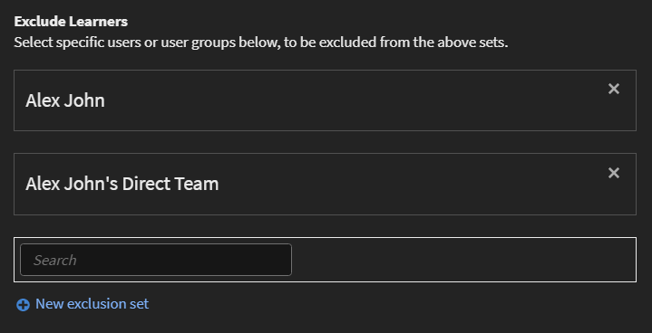

# Gebruikers toevoegen en gebruikersgroepen maken

Leer hoe u gebruikers of gebruikersgroepen toevoegt in de toepassing Leermanager.

<!---->

## Overzicht {#overview}

In Adobe Learning Manager kunt u de volgende rollen aannemen:

* **Beheerder:** Een beheerder definieert de trainingsstrategie voor de organisatie. Een beheerder kan studenten toevoegen, vereiste vaardigheden voor studenten zoeken, cursussen beheren en toewijzen, leerplannen, certificeringen en leerprogramma&#39;s maken en rapporten voor de hele organisatie beheren.
* **Auteur:** Auteurs zijn instructieontwerpers en makers van inhoud. Een auteur kan modules en cursussen toevoegen aan Leermanager.
* **Manager:** Een manager beheert de leeractiviteiten van een team. Een manager kan teamleden aanwijzen om een cursus te volgen, aanvragen van teamleden goedkeuren en feedback geven over de prestaties van hun teamleden na voltooiing van de training. Managers kunnen ook rapporten voor hun team bekijken om hun prestaties te volgen.
* **Student:** Studenten hebben toegang tot cursussen, leerprogramma&#39;s en certificeringen die aan hen zijn toegewezen. Studenten kunnen ook door alle beschikbare cursussen bladeren met een catalogus en zich inschrijven voor cursussen, leerprogramma&#39;s of certificeringen.

Als beheerder kunt u gebruikers op drie manieren toevoegen:

* Intern
* Extern
* Gebruikersgroepen

## Eén gebruiker toevoegen {#addasingleuser}

Gebruikers toevoegen:

1. Meld u als beheerder aan bij Adobe Learning Manager.
1. Klik op de startpagina op **[!UICONTROL Gebruikers toevoegen]**. Op deze pagina kunt u een of meer gebruikers tegelijk toevoegen met behulp van een CSV-bestand. U kunt ook een zelfregistratielink voor interne werknemers maken of een extern studentenprofiel maken.
1. Als u één gebruiker wilt toevoegen, klikt u op **[!UICONTROL Toevoegen]** in de rechterbovenhoek en kies de optie **[!UICONTROL Enkele gebruiker]**.

   
   *Eén interne gebruiker toevoegen*

1. Op de **[!UICONTROL Gebruiker toevoegen]** geeft u de gegevens van de student op. Voor het veld **[!UICONTROL Naam van manager]**, kiest u de naam van een bestaande gebruiker in het systeem.

   
   *Gebruikersdialoogvenster toevoegen*

1. Klik op **[!UICONTROL Toevoegen]**. Nadat de gebruiker is toegevoegd, ontvangt de gebruiker een verificatiebericht. De student activeert vervolgens het account en begint met het gebruik van Leerbeheer. Deze workflow is handig als u een beperkt aantal studenten moet toevoegen aan uw LMS-account. Maar als je alle medewerkers van een grote organisatie wilt inschrijven, kun je ze in één poging toevoegen. Zie de volgende sectie voor meer informatie.

## Gebruikers in bulk toevoegen {#addusersinbulk}

Meestal werken de meeste organisaties met een HRMS (HR Management System), dat alle werknemersrecords bijhoudt, zoals benoeming, locatie, datum van toetreding of werknemershiërarchie. U kunt deze gegevens in een CSV-indeling exporteren. Voer de onderstaande stappen uit om een CSV te importeren:

1. Klikken **[!UICONTROL Toevoegen]** in de rechterbovenhoek en kies de optie **[!UICONTROL Een CSV uploaden]**.

   
   *Een CSV uploaden om gebruikers in bulk toe te voegen*

1. De CSV die u uploadt, bestaat uit de velden, zoals hieronder weergegeven:

   
   *Structuur van de CSV*

   U moet een CSV-master bijhouden en alle toevoegingen en verwijderingen in de CSV-master uitvoeren. Het CSV-hoofdbestand bevat de volgende velden:

   * name &#42;
   * email &#42;
   * profiel
   * manager

   (&#42;) Vereist veld.

1. Nadat u op de optie **[!UICONTROL Een CSV uploaden]** verschijnt, wordt het volgende dialoogvenster weergegeven.

   
   *Een CSV-dialoogvenster uploaden*

1. Kies de CSV of sleep het bestand. Nadat u het bestand hebt gekozen, wijst u de gegevensvelden toe aan die in het CSV-bestand. Klik op de gewenste vervolgkeuzelijst en kies het juiste veld.

   
   *Velden toewijzen in CSV*

1. Als u de gebruikers wilt importeren, klikt u op **[!UICONTROL Opslaan]**. U kunt een bevestigingsbericht zien.

   
   *Bevestigingsbericht voor geslaagde upload van de CSV*

1. De nieuwe gebruikers worden nu toegevoegd aan uw Adobe Learning Manager-account. Als u de nieuwe gebruikers wilt selecteren, schakelt u het selectievakje naast de namen in, zodat iedereen geselecteerd is.

   
   *Nieuwe gebruikers toegevoegd*

>[!NOTE]
>
>Zie de veelgestelde vragen voor meer informatie. [Gebruikers in bulk toevoegen](../add-users-in-bulk.md).

Nadat u de gebruikers hebt geselecteerd, kunt u het volgende uitvoeren:

## Een gebruiker registreren {#registerauser}

Selecteer de gebruiker en klik op **[!UICONTROL Handelingen]** in de rechterbovenhoek en klik op **[!UICONTROL Registreren]**.

De geselecteerde gebruikers ontvangen een welkomstmail. Als de studenten een bestaande Adobe ID hebben, kunnen ze op deze koppeling klikken. Als ze geen bestaande Adobe ID hebben, kunnen ze op de welkomstkoppeling klikken om een Adobe ID te maken en deze koppelen aan hun Learning Manager-account.

## Een rol toewijzen {#assignarole}

Klik op Acties in de rechterbovenhoek van de pagina nadat u studenten aan het Adobe Leerbeheerdersaccount hebt toegevoegd om hun rollen te wijzigen. Kies de optie **[!UICONTROL Rol toewijzen]**. Hier kunt u bepalen of u Auteur- of Beheerderstoegang wilt geven aan de student. Nadat u een rol hebt toegewezen, heeft deze student auteurstoegang tot het account en kan hij modules toevoegen en cursussen maken.

*Een rol toewijzen aan een gebruiker*

## Een rol verwijderen {#removearole}

U kunt ook auteur- of beheerderstoegang voor de gebruikers verwijderen. Selecteer een of meer studenten, klik op **[!UICONTROL Handelingen]** en selecteert u **[!UICONTROL Rol verwijderen]**. Kies bijvoorbeeld een optie **[!UICONTROL Auteur verwijderen]** en wordt de auteurstoegang voor deze student ingetrokken.

>[!NOTE]
>
>U kunt niet handmatig een managerrol aan iemand in het systeem toewijzen. Ze krijgen automatisch toegang tot het Managerdashboard wanneer een of meer medewerkers onder hen worden toegevoegd.

## Een gebruiker verwijderen {#deleteauser}

Klik op **[!UICONTROL Handelingen]** en kiest u **[!UICONTROL Gebruiker verwijderen]**. Klik in het bevestigingsvenster op **[!UICONTROL Ja]** en de student wordt verwijderd.

*Bevestigingsbericht om een gebruiker te verwijderen*

## Een gebruiker bewerken {#editauser}

Kies een gebruiker in de lijst met gebruikers en klik op de gebruiker. Klik op de **[!UICONTROL Bewerken]** ( ). Op de **[!UICONTROL Gebruiker bewerken]** te klikken, de benodigde bewerkingen aan te brengen en de wijzigingen op te slaan, klikt u op **[!UICONTROL Opslaan]**.

*Dialoogvenster Gebruiker bewerken*

## Workflows voor actieve velden en actieve veldwaarden waarbij de hoofdlettergevoeligheid behouden blijft

In deze release behoudt Leermanager de hoofdlettergevoeligheid van het gebruikerskenmerk en de waarde ervan. **Bijvoorbeeld** is de hoofdlettergevoeligheid van een gebruikerskenmerk &#39;locatie&#39; en wordt de waarde ervan als &#39;PARIS&#39; op dezelfde manier behouden en weergegeven. In het geval van problemen kan de beheerder nu de kenmerknaam en -waarden bewerken om eventuele hoofdlettergevoeligheidsfouten te corrigeren.

De beheerder kan dit doen door naar **[!UICONTROL Admin-app]** > **[!UICONTROL Gebruikers]** > **[!UICONTROL Gebruikersgroepen]** en op de groepsnaam te klikken.

Beheerders kunnen via de gebruikersinterface toegestane kenmerkwaarden voor een student toevoegen en bijwerken.

Typen actieve velden:

* Groeperbaar: studenten worden gegroepeerd op basis van de waarden
* Te rapporteren: Gebruikersgroepen rapporteren wordt gemaakt op basis van de actieve velden
* Exporteerbaar: de velden worden weergegeven in geëxporteerde gebruikersgroeprapporten.

## Een zelfregistratielink maken {#createaselfregistrationlink}

U kunt medewerkers in uw organisatie ook in staat stellen zichzelf als studenten te registreren bij de Adobe Learning Manager-account, zonder hulp van u als beheerder. De beheerder kan een koppeling voor zelfregistratie maken en deze delen met de medewerkers, die zich verder kunnen registreren bij Leermanager met hun Adobe-referenties.

Klik rechtsboven op de pagina op **[!UICONTROL Toevoegen]** en kiest u **[!UICONTROL Zelfregistratie]**.

*Koppeling maken om zichzelf als student te registreren*

De **[!UICONTROL Zelfregistratieprofiel toevoegen]** wordt weergegeven. Geef dit profiel een naam. Voeg vervolgens de naam van de manager toe. Het is belangrijk om te weten dat de manager al een student moet zijn geregistreerd in Leermanager.

*Profiel toevoegen voor zelfregistratie*

Nadat u op **[!UICONTROL Opslaan]** Er wordt een URL gegenereerd die u met de studenten kunt delen, zodat ze op de URL kunnen klikken en zichzelf kunnen registreren.

## Externe studenten inschrijven {#enrollexternallearners}

In Adobe Learning Manager kunt u ook registratielinks maken voor externe partners of bureaus met beperkte toegang tot uw account en hen leermateriaal verschaffen.

Er zijn een paar verschillen tussen interne en externe registraties.

<table>
 <tbody>
  <tr>
   <td>
    
<b>Interne gebruikers</b>
</td>
   <td>
    
<b>Externe gebruikers</b>
</td>
  </tr>
  <tr>
   <td>
    
Meld u aan met uw Adobe ID- of SSO-gegevens.
</td>
   <td>
    
Meld u aan met een e-mail-id.
</td>
  </tr>
  <tr>
   <td>
    
Gamification is beschikbaar.
</td>
   <td>
    
Gamification is niet beschikbaar.
</td>
  </tr>
  <tr>
   <td>
    
Studentenhiërarchieën zijn beschikbaar.
</td>
   <td>
    
Studentenhiërarchieën zijn niet beschikbaar.
</td>
  </tr>
 </tbody>
</table>

Volg onderstaande stappen om externe gebruikers in te schrijven:

1. Klik in het linkerdeelvenster op **[!UICONTROL Extern]**.

   

   *Externe gebruikers inschrijven*

1. Klik rechtsboven op de pagina op **[!UICONTROL Toevoegen]**.
1. Op de **[!UICONTROL Extern registratieprofiel toevoegen]** voegt u de volgende details toe:

   * De profielnaam van de partnerorganisatie.
   * Het e-mailadres van de manager van de partnerorganisatie.
   * Plaatslimiet voor externe inschrijving voor deze partner.
   * Vervaldatum om een deadline in te stellen waarmee nieuwe registraties voor deze groep worden stopgezet. Na de vervaldatum hebben alleen de bestaande geregistreerde gebruikers toegang tot deze training.

   

   *Dialoogvenster Extern registratieprofiel toevoegen*

   * In het dialoogvenster **[!UICONTROL Geavanceerde instellingen]** voert u de volgende gegevens in:

      * **[!UICONTROL Aanmeldingsvereiste]:** Geef een waarde op in dagen. Studenten worden verwijderd als ze zich niet aanmelden voor de bovenstaande duur.
      * **[!UICONTROL Toegestane domeinen]:** Een door komma&#39;s gescheiden lijst met e-maildomeinnamen op de whitelist.
      * **[!UICONTROL E-mailverificatie vereist]:** Selecteer deze optie om e-mailverificatie verplicht te maken voor een student.

   

   *Voer de details in het gedeelte Geavanceerde instellingen in*

1. Nadat u op **[!UICONTROL Opslaan]** kunt u het volgende bevestigingsbericht zien. U moet de URL delen met uw externe partner.

   

## Een extern profiel inschakelen {#enableanexternalprofile}

Nadat u een extern profiel hebt gemaakt, moet u de status ervan inschakelen. Kies het gewenste profiel in de lijst met externe profielen en schakel de statusknop in.

*Een extern profiel inschakelen*

Hierdoor wordt de koppeling Externe inschrijving ingeschakeld. Er wordt automatisch een welkomstmail naar de partner verzonden. U kunt de koppeling ook kopiëren en delen door op het pictogram URL kopiëren () te klikken, of u kunt de welkomstmail opnieuw naar de partnerorganisatie sturen door op het e-mailpictogram () te klikken.

De partnermanager kan de verbinding met de werknemers delen die de opleiding in PrLearning Managerime moeten nemen. Wanneer ze op de koppeling klikken, kunnen ze zichzelf inschrijven nadat ze enkele details hebben ingevuld om hun profiel in Leermanager te maken. Deze gebruikers worden niet samen met de interne werknemers op het tabblad Studenten weergegeven. U kunt hun namen onder de **[!UICONTROL Externe studenten]** tabblad.

## Een extern profiel pauzeren {#pause}

Nadat u een externe gebruikersgroep aan Leermanager hebt toegevoegd, kunt u het registratieproces van externe gebruikers ook pauzeren. Wanneer u pauzeert, wordt het registratieproces van externe gebruikers geblokkeerd. Dit proces werkt echter alleen als de gebruikers zich nog niet hebben geregistreerd door de uitnodiging te accepteren.

Als u de externe gebruikersgroepen wilt pauzeren, kiest u een of meer groepen, klikt u op **[!UICONTROL Handelingen]** in de rechterbovenhoek van de pagina en klik op **[!UICONTROL Pauze]**.

## Een extern profiel hervatten {#resumeanexternalprofile}

U kunt op elk gewenst moment de gepauzeerde status van een externe partner intrekken en de normale services hervatten. Klikken **[!UICONTROL Handelingen]** in de rechterbovenhoek van de pagina en kies **[!UICONTROL Hervatten]**.

De volgende statussen zijn van toepassing op externe gebruikers:

* **Inactief frame** - In deze status is de registratie van externe gebruikers verlopen. Beheerders stellen de vervaldatum voor de externe gebruikers in terwijl ze deze toevoegen via de workflow Gebruiker toevoegen.
* **Actieve staat** - In deze status kunnen de externe gebruikers zich registreren bij de toepassing Learning Manager en zich aanmelden bij de toepassing.
* **Pauze** - In deze status is het registratieproces voor externe gebruikers geblokkeerd. De bestaande gebruikers kunnen zich echter blijven aanmelden.

## Gebruikte licenties controleren {#checkusedseats}

Klik in de lijst met externe profielen op **[!UICONTROL Gebruikte plaatsen]**. U kunt het aantal toegevoegde studenten in de partnerorganisatie bekijken.

*Gebruikte licenties controleren*

## Een gebruiker verwijderen {#Deleteauser-1}

Kies een gebruiker en klik rechtsboven op **[!UICONTROL Handelingen]** > **[!UICONTROL Gebruiker verwijderen]**.

## Profiel wijzigen {#changeprofile}

Als u een gebruiker naar een ander extern profiel wilt verplaatsen, kiest u een gebruiker en klikt u in de rechterbovenhoek op **[!UICONTROL Handelingen]** > **[!UICONTROL Profiel wijzigen]**. Kies een profiel in de lijst met profielen en klik op **[!UICONTROL Wijzigen]**.

## Een rol toewijzen {#Assignarole-1}

Kies een gebruiker en klik rechtsboven op **[!UICONTROL Handelingen]** > **[!UICONTROL Rol toewijzen]** > **Merk`<role>`**. De gebruiker krijgt een nieuwe rol.

## Een rol verwijderen {#Removearole-1}

Kies een gebruiker en klik rechtsboven op **[!UICONTROL Handelingen]** > **[!UICONTROL Rol verwijderen]** > **Verwijderen`<role>`**. De geselecteerde rol wordt verwijderd uit de lijst met rollen die aan de gebruiker zijn toegewezen.

## Gebruikersgroepen maken {#createusergroups}

Een gebruikersgroep is een set gebruikers die verwant zijn aan een categorie. Met gebruikersgroepen kunnen beheerders studenten in hun organisatie selecteren op basis van hun kenmerken en vervolgens leerinhoud aan hen toewijzen. Met deze gebruikersgroepen kunnen beheerders ook aangepaste logo&#39;s en catalogi aan studenten toewijzen en aangepaste rapporten over hun voortgang weergeven.

Klik in het linkernavigatievenster op **[!UICONTROL Gebruikersgroepen]**.

*Gebruikersgroepen maken*

Er zijn twee soorten groepen in Adobe Learning Manager: Aangepast en Automatisch gegenereerd. Wanneer u studenten aan uw account toevoegt, worden sommige groepen automatisch gemaakt op basis van hun gemeenschappelijke eigenschappen.

Klik op het tabblad om de automatisch gemaakte groepen weer te geven **[!UICONTROL Automatisch gegenereerd]**.

*Automatisch gegenereerde groepen weergeven*

U kunt zien dat er verschillende groepen zijn, zoals Alle interne gebruikers, Alle managers, groepen op basis van de kostenplaats, op basis van de afdeling en op basis van de teams van de managers.

Naast automatisch gegenereerde groepen kunt u aangepaste groepen maken. Als u een nieuwe aangepaste groep wilt toevoegen, klikt u rechtsboven op **[!UICONTROL Toevoegen]**.

1. Voer de naam en beschrijving voor de groep in.
1. Typ een gebruikersnaam of een profiel in het zoekveld terwijl u typt en selecteer een gebruiker in de vervolgkeuzelijst om gebruikers toe te voegen.
1. Klik op **[!UICONTROL Meer gebruikers toevoegen].**
1. Als u de gebruikersgroep wilt maken, klikt u op **[!UICONTROL Opslaan]**.

Deze aangepaste groep wordt nu gemaakt en toegevoegd aan het profiel. De gebruikersgroepen die u maakt, zijn dynamisch van aard. Als nieuwe gebruikers met vergelijkbare kenmerken worden toegevoegd, worden deze automatisch toegevoegd aan de gebruikersgroep.

## Uitsluiting van gebruikersgroepen

Soms wilt u een kleine set gebruikers uitsluiten van een grote gebruikersgroep. Dit is vereist om deze specifieke groep gebruikers in te schrijven voor training via leerplannen of om de juiste zichtbaarheid van catalogi in te stellen. In deze versie van Leermanager kunt u studenten of gebruikersgroepen uitsluiten wanneer u een aangepaste gebruikersgroep maakt. In het dialoogvenster Gebruikersgroep toevoegen kunt u dit bereiken met de sectie Studenten uitsluiten.

*Gebruikersgroepen uitsluiten*

Als u bijvoorbeeld een leerplan wilt instellen zodat alle gebruikers die tot locatie = Californië behoren, behalve Store-5 (in Californië), zich inschrijven.

## Geavanceerde instellingen {#advancedsettings}

## Gegevensbronnen {#datasources}

U kunt deze functie gebruiken wanneer u de gebruikers of leergegevens uit de database van uw organisatie wilt importeren in of synchroniseren met de toepassing Leermanager. U kunt ook de frequentie van deze synchronisatie instellen.

Klikken **[!UICONTROL Gegevensbronnen]** in het linkerdeelvenster onder **[!UICONTROL Gedeeld]** sectie.

*Gegevensbronnen voor het importeren of synchroniseren van gebruikers*

Kies het type gegevensbron in het menu **[!UICONTROL Bron]** , selecteert u de updatefrequentie en klikt u op **[!UICONTROL Nu synchroniseren]** als u direct moet synchroniseren of klik op **[!UICONTROL Opslaan].** Gegevensbrontypen zijn SFDC, FTP, enzovoort voor interne gebruikers.

U kunt meerdere gegevensbronnen toevoegen.

## Actieve velden {#activefields}

Met deze functie kunnen beheerders meer actieve velden toevoegen naast de velden die zijn opgegeven tijdens de gebruikersregistratie.

Klikken **Actieve velden** beschikbaar binnen de gebruikerspagina. Studenten kunnen alleen kiezen uit de waarden in aangepaste waarden.

*Actieve velden*

### Velden configureren {#configurefields}

**Interne gebruikers**

U kunt aangepaste waarden toevoegen voor gebruikersvelden voor interne gebruikers.

Ga als volgt te werk om aangepaste waarden toe te voegen:

1. Klikken  **[!UICONTROL Waarden wijzigen]** voor een interne gebruiker.

   
   *Waarden wijzigen voor interne gebruikers*

1. De **Waarden in veld Aangepast** wordt weergegeven.

   
   *Dialoogvenster Waarden in aangepaste velden*

1. Selecteer de waarde die u wilt toevoegen in het menu **[!UICONTROL Veld selecteren]** vervolgkeuzelijst.
1. Voer nieuwe waarden in in het dialoogvenster **[!UICONTROL Nieuwe waarde]** veld.
1. Klikken **[!UICONTROL Gereed]**.
1. Klik op Opslaan rechtsboven om **[!UICONTROL Opslaan]** wijzigingen.

**Externe gebruikers**

Voeg aangepaste waarden toe die vergelijkbaar zijn met die voor interne gebruikers.

*Waarden wijzigen voor externe gebruikers*

### Instellingen {#settings}

**Gebruikersweergave**

Als de optie **Alleen niet-ingevulde velden weergeven bij aanmeldnaam student** is ingeschakeld, ziet een gebruiker alleen de lege velden bij het aanmelden.

*Niet-gevulde velden weergeven*

Met deze optie kan een beheerder beslissen of hij/zij de velden wil weergeven of verbergen zodra deze zijn ingevuld.

## Actieve velden in rapporten beperken {#restrictactivefields}

Learning Manager 27.7 introduceert twee nieuwe opties: **[!UICONTROL Te rapporteren]** en **[!UICONTROL Exportable]**, voor Actieve velden.

*Opties in actieve velden*

Voor CSV-velden en handmatig toegevoegde velden als een actief veld is gemarkeerd als **[!UICONTROL Te rapporteren]** wordt het actieve veld doorzoekbaar in een filter in een dashboardrapport.

*Filters in een dashboardrapport*

Als een actief veld is gemarkeerd als **[!UICONTROL Exportable]** wordt het actieve veld in het Excel-bestand weergegeven wanneer een Excel-rapport wordt gedownload.

Deze opties worden weergegeven voor zowel interne als externe actieve velden.

U kunt alleen een aangepast actief veld verwijderen.

## Gebruikersweergave

U kunt de volledige pagina &#39;Uw profiel voltooien&#39; verbergen voor de studenten. De pagina verschijnt niet als de student zich heeft aangemeld.

Het bestaande standaardgedrag verandert niet. Dit is een optionele functie die nu beschikbaar is voor beheerders.

Schakel de onderstaande opties in:

*Gebruikersweergave, sectie*

## Ondersteuning voor handmatige CSV-velden via FTP- en Box-connectors {#import-connector}

Vaak willen gebruikers dat de actieve velden handmatig worden ingevuld wanneer een student zich aanmeldt bij Leermanager. Dit is nu mogelijk in Learning Manager wanneer de gebruiker een CSV handmatig importeert.

Het CSV-bestand mag niet alle actieve velden bevatten. Voor alle actieve velden die niet zijn bijgewerkt in de geüploade CSV, moet de gebruiker de gegevens voor dergelijke actieve velden invoeren.

Momenteel moeten alle actieve velden worden toegewezen aan een veld van de bron-CSV.

Soms wil een gebruiker een Actief veld niet toewijzen aan een veld dat is opgegeven in de CSV. In dergelijke gevallen kan de gebruiker het veld Actief toewijzen aan de waarde **[!UICONTROL DontImportFromSource]**. Selecteer deze waarde in de vervolgkeuzelijst wanneer u gebruikers importeert van FTP- en Box-connectoren.

## Aangepaste rollen {#customroles}

Voeg een willekeurig veld van uw keuze toe als onderdeel van uw gebruikersgegevens en klik op **[!UICONTROL Opslaan]**. Nadat u de velden hebt toegevoegd, kunt u ook de beschikbaarheid van de velden in de **[!UICONTROL Gebruikers bewerken]** in.

Nadat u de velden hebt toegevoegd, kunt u zien dat de met een vinkje gemarkeerde velden zijn ontleend aan de gegevensbron of CSV, zoals vermeld in de onderstaande afbeelding. De beheerder kan deze velden bewerken door ze in of uit te schakelen.

**Waarden voor actieve velden in Leermanager**

De waarden voor actieve velden worden als volgt opgehaald:

1. De toepassing Learning Manager importeert metagegevens uit gegevensbronnen die aan uw account zijn gekoppeld.
1. Metagegevens die zijn vastgelegd uit het handmatig geïmporteerde CSV-bestand.
1. Studenten vullen metagegevens in wanneer ze zich aanmelden
1. De beheerder voert gegevens in voor de gebruikers.

>[!NOTE]
>
>De toepassing Learning Manager maakt automatisch gebruikersgroepen op basis van deze metagegevens.

**Aangepaste waarde toevoegen**

U kunt aangepaste waarden toevoegen voor gebruikersvelden in de velden Interne en Externe gebruiker.

Ga als volgt te werk om aangepaste waarden toe te voegen:

U kunt aangepaste velden toevoegen en verwijderen. Deze zijn van toepassing op alle gebruikers. CSV-velden kunnen worden in- of uitgeschakeld. Ze treden alleen in werking wanneer u CSV uploadt nadat u wijzigingen hebt aangebracht in actieve velden. Alle interne actieve velden zijn van toepassing op alle typen interne gebruikers. Externe velden zijn alleen van toepassing op externe gebruikers. Als een aangepast veld aanwezig is in CSV, wordt het bij de volgende upload automatisch geconverteerd naar een CSV-veld en ingeschakeld.

## Waarden voor CSV-velden {#valuesforcsvfields}

Gebruikers kunnen alleen kiezen uit vooraf gedefinieerde velden voor CSV-velden als **[!UICONTROL Selectie beperken]** selectievakje is ingeschakeld.

*Selectievakje Selectie beperken*

## Logboeken importeren {#importlogs}

In deze ruimte kunt u de CSV-importgeschiedenis bekijken voor de gebruikers die de beheerder heeft toegevoegd met behulp van de bulkimportfunctie. U kunt ook op **Toevoegen** rechtsboven op de pagina om gebruikers toe te voegen met behulp van de CSV-uploadfunctie.

## Actieve velden met meerdere waarden

Met deze functie kunt u meer dan één veld voor een actief veld hebben. In een account kunnen er maximaal drie actieve velden met meerdere waarden zijn. De actieve velden met meerdere waarden zijn beschikbaar voor zowel externe als interne gebruikers.

Wanneer u een actief veld hebt gemarkeerd als een veld met meerdere waarden, kunt u het niet meer omzetten in een veld met één waarde. Dit is onomkeerbaar.

Een bestaand enkel waardeveld kan niet worden gemarkeerd als een veld met meerdere waarden.

Volg de onderstaande stappen om een actief veld met meerdere waarden te maken:

1. Een actief veld toevoegen.

   
   *Een actief veld toevoegen*

1. Klik op Toevoegen.
1. Markeer op het tabblad Instellingen het nieuwe veld als een veld met meerdere waarden.

   
   *Markeren als meervoudig getaxeerd*

   Er is nog een selectievakje, **[!UICONTROL Student configureerbaar]**, die de student het veld op de profielpagina niet kan zien als hij of zij dit heeft uitgeschakeld.

1. Voeg de waarden toe met behulp van een CSV of door op Waarden wijzigen te klikken.

   
   *Waarden toevoegen*

1. Klikken [!UICONTROL **Gereed**].

>[!NOTE]
>
>Als de gebruikersgroep eenmaal is gemaakt en het veld is ingevuld, kunnen meerdere waarden niet worden omgezet in enkele waarden, en omgekeerd.

### Multiwaardevol actief veld toevoegen via CSV

Volg de onderstaande stappen:

1. Maak een CSV met de nieuwe actieve velden als kolommen (gescheiden door komma&#39;s of enkele waarden).
1. Importeer de CSV.
1. Markeer de velden als multiwaardevol in het dialoogvenster Waarden in aangepaste velden.
1. Importeer de CSV opnieuw.

De CSV moet een kolom hebben met dezelfde naam als die van een actief veld dat is gemarkeerd als meervoudig.

De CSV bevat de velden:

* **[!UICONTROL Gebruiker]**: Gebruikersgroepen die zijn gemaakt als rollen.
* **[!UICONTROL Rollen]**: Actief veld met meerdere waarden.

Als de CSV opnieuw wordt geüpload met nieuwe waarden of verwijderde waarden, worden de actieve velden en groepen ook dienovereenkomstig bijgewerkt.

### Rapporten

Alle rapporten bevatten de actieve velden met meerdere waarden en de bijbehorende waarden.

De beheerder kan automatisch gegenereerde actieve velden toevoegen en gebruikersactiviteiten en trainingsrapporten configureren.

Het rapport Studenttranscript bevat alle actieve velden en door komma&#39;s gescheiden waarden. De beheerder kan de gegevens vervolgens dienovereenkomstig filteren.

## Veelgestelde vragen {#faq}

+++Hoe registreer je gebruikers in Learning Manager?

Nadat u een gebruiker hebt toegevoegd en een rol aan de gebruiker hebt toegewezen, kunt u de gebruiker registreren door de onderstaande stappen uit te voeren:

1. Selecteer de gebruiker of gebruikers en klik op **[!UICONTROL Handelingen]** in de rechterbovenhoek en klik op **[!UICONTROL Registreren]**.

1. Klik op **[!UICONTROL Ja]**.

De geselecteerde gebruikers ontvangen een welkomstmail. Als de studenten een bestaande Adobe ID hebben, kunnen ze op deze koppeling klikken. Als ze geen bestaande Adobe ID hebben, kunnen ze op de welkomstkoppeling klikken om een Adobe ID te maken en deze koppelen aan hun Learning Manager-account.

Studenten moeten op een van deze koppelingen in de e-mail klikken omdat Leermanager daarmee het account van de student kan verifiëren.

+++

+++Hoe kan ik gebruikersgegevens bewerken?

Volg de onderstaande stappen om een gebruiker te bewerken:

1. Klik in de lijst met gebruikers op de gebruiker voor wie u de gegevens wilt bewerken.
1. Klik op het pictogram Potlood, zoals hieronder weergegeven.

In het dialoogvenster **[!UICONTROL Gebruiker bewerken]** de velden overeenkomstig bij. Klik op **[!UICONTROL Opslaan]**.

+++

+++Een externe gebruiker pauzeren en hervatten in Leerbeheer?

Kies in de lijst Externe gebruikers de gebruiker die u wilt verwijderen. Klik rechtsboven op **[!UICONTROL Handelingen]** > **[!UICONTROL Pauze]**.

Zie voor meer informatie [Een extern profiel pauzeren](add-users-user-groups.md#pause).

Nadat u een profiel hebt gepauzeerd, geeft het externe profiel de status als ***Gepauzeerd***.

+++

+++Hoe kan ik welkomstmail verzenden naar nieuw gemaakt extern profiel?

Wanneer u een externe gebruiker toevoegt, kunt u in het dialoogvenster **[!UICONTROL Extern registratieprofiel toevoegen]** voert u de e-mail van de externe manager in. Wanneer u op Opslaan klikt, wordt ook een welkomstmail verzonden naar het e-mailadres dat u hebt opgegeven. Als u de welkomstmail opnieuw wilt verzenden, klikt u op het enveloppictogram, zoals hieronder weergegeven:

+++

+++Hoe maak ik aangepaste gebruikersgroepen?

Klikken **[!UICONTROL Gebruikers]** > **[!UICONTROL Gebruikersgroepen]** en op de pagina Gebruikersgroepen klikt u op **[!UICONTROL Toevoegen]**. Voeg in het dialoogvenster Gebruikersgroep toevoegen de gebruikers zowel individueel als als als team toe.

+++

+++Hoe schakel ik al gevulde actieve velden uit?

Als u wilt dat studenten alleen de actieve velden zien die niet door hen zijn ingevuld, voert u de onderstaande stappen uit:

1. Klikken **[!UICONTROL Gebruikers]** > **[!UICONTROL Actieve velden]**.

1. Klikken **[!UICONTROL Instellingen]** en de optie **[!UICONTROL Alleen niet-ingevulde velden weergeven bij aanmeldnaam student]**.

1. Klikken **[!UICONTROL Opslaan]**.

+++

+++Hoe kan ik voorkomen dat studenten willekeurige waarden in de actieve velden invoeren?

U kunt de selectie voor studenten beperken zodat ze alleen vooraf gedefinieerde waarden kunnen selecteren en geen willekeurige waarden kunnen invoeren. Volg de onderstaande stappen:

1. Klikken **[!UICONTROL Gebruikers]** > **[!UICONTROL Actieve velden]**.
1. In de sectie **[!UICONTROL Velden configureren]**, klik op **[!UICONTROL Waarden wijzigen]**.

1. De optie inschakelen **[!UICONTROL Selectie beperken]**.
1. Klikken **[!UICONTROL Gereed]**.

+++

+++Hoe kan ik onderscheid maken tussen actieve CSV-velden en aangepaste actieve velden?

U kunt alleen actieve CSV-velden in- of uitschakelen, maar u kunt deze niet verwijderen. Anderzijds kunt u aangepaste actieve velden niet in- of uitschakelen.

+++
