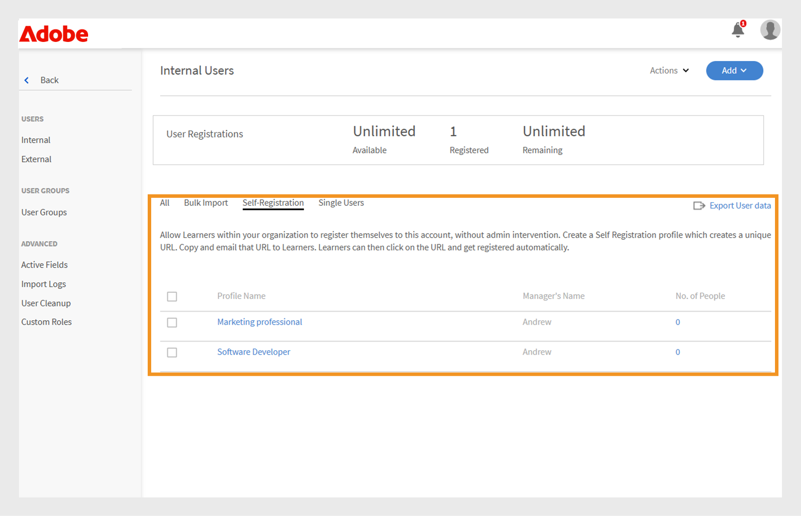
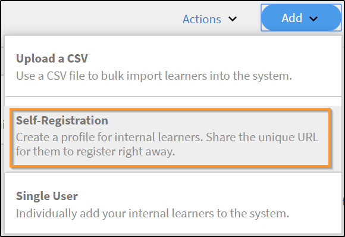
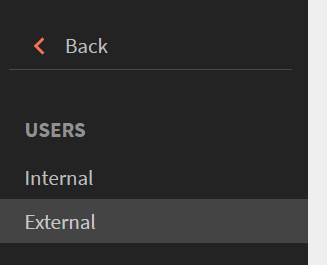
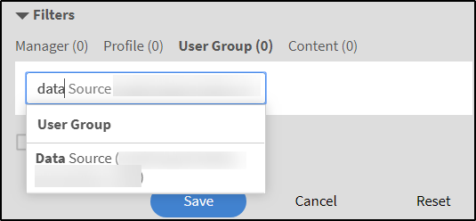

# Gebruikers toevoegen in Adobe Learning Manager

In Adobe Learning Manager zijn gebruikers studenten die het platform voor leren of training gebruiken. Er zijn twee soorten gebruikers: interne gebruikers en externe gebruikers.

Interne gebruikers zijn werknemers of teamleden van uw organisatie.

Externe gebruikers zijn studenten buiten uw bedrijf, zoals klanten, partners, leveranciers of klanten, die toegang hebben tot uw leerinhoud.

Met Adobe Learning Manager (ALM) kunnen beheerders zowel interne als externe gebruikers onboarden en beheren met behulp van verschillende methoden, waaronder handmatige invoer, CSV-upload, zelfregistratie en systeemintegraties.

## Interne gebruikers

Interne gebruikers in Adobe Learning Manager verwijzen naar werknemers of teamleden binnen uw organisatie. U kunt ze handmatig toevoegen, in bulk uploaden of importeren via systeemintegraties. Nadat u deze gebruikers hebt toegevoegd, kunt u ze in groepen indelen, cursussen toewijzen en de voortgang van het leren volgen.

Gebruikers in Adobe Learning Manager kunnen verschillende verantwoordelijkheden op zich nemen en verschillende taken beheren op basis van hun toegewezen rollen. Elke rol, inclusief beheerder, auteur, docent en integratiebeheerder, biedt een reeks specifieke mogelijkheden die zijn afgestemd op de ondersteuning van de verantwoordelijkheden van de gebruiker binnen het platform.

Adobe Learning Manager ondersteunt de volgende gebruikersrollen:

* **Beheerder**: beheert gebruikers en gebruikersgroepen, wijst rollen toe, en vormt systeem-brede voorkeur zoals gegevensbronnen, toegestane domeinen, en vertoningsopties. Beheerders zijn ook verantwoordelijk voor het maken en ordenen van leerinhoud, het volgen van de voortgang van studenten, het genereren van rapporten en het instellen van integraties met externe systemen.
* **Auteur**: Creeert en beheert inhoud, met inbegrip van modules en cursussen.
* **Manager**: Beheert team het leren activiteiten, benoemt teamleden voor cursussen, keurt verzoeken goed, en verstrekt terugkoppelen.
* **Admin van de Integratie**: Beheert systeemintegraties en gegevensverbindingen tussen ALM en externe platforms.
* **de rollen van de Douane**: De beheerders kunnen douanerollen tot stand brengen om gebruikers te geven die toegang op hun verantwoordelijkheden wordt gebaseerd. Raadpleeg dit artikel voor meer informatie over de aangepaste rollen.

### Methoden om interne gebruikers toe te voegen

Beheerders kunnen op de volgende manieren interne gebruikers toevoegen:

* **voeg één enkele gebruiker** toe: voeg manueel één gebruiker tegelijkertijd toe.
* **profiel van de zelfregistratie**: sta studenten toe om zich als studenten in Adobe Learning Manager te registreren gebruikend een registratiekoppeling die door de beheerder wordt gecreeerd.
* **Bulk uploadt via CSV**: Upload een Csv- dossier om veelvoudige gebruikers meteen toe te voegen.

### Handmatig een interne gebruiker toevoegen

Beheerders kunnen handmatig individuele gebruikers toevoegen door hun naam, e-mail-ID, unieke ID en de naam van de manager in te voeren. De unieke id in Adobe Learning Manager is een vereiste id die beheerders toewijzen bij het maken van een gebruiker. Deze moet uniek zijn voor elke gebruiker en als een consistente referentie in het hele systeem fungeren.

>[!INFO]
>
>Bekijk deze ALM Academy-training voor meer informatie over het toevoegen van enkele gebruikers in Adobe Learning Manager.   

Eén gebruiker toevoegen aan Adobe Learning Manager:

1. Meld u aan als beheerder.
2. Selecteer **Gebruikers** en selecteer dan **Intern**.
3. Selecteer **voeg** toe en selecteer dan **Enige Gebruiker**.

   
   _interface die van de Beheerder de optie toont om één enkele interne gebruiker manueel toe te voegen_
4. Op **voeg de herinnering van de Gebruiker** toe, typ de **Naam**, **E-mail** en **Profiel** (baantitel) van de gebruiker.

   
   _Gebieden om naam, e-mail, uniek herkenningsteken, en profiel voor een nieuwe gebruiker in te gaan_
5. Zoek naar de manager van de gebruiker en selecteer de naam in de lijst met managers.
6. Selecteer **toevoegen**.
De gebruiker ontvangt een welkomstmail met een aanmeldings-URL voor toegang.

### Zelfregistratie voor interne gebruikers toestaan

Zelfregistratie is een zelfserviceonboardingproces waarbij gebruikers een registratie-URL kunnen bezoeken, hun gegevens kunnen invoeren en zich automatisch kunnen inschrijven voor het platform. Deze methode minimaliseert de administratieve inspanning door gebruikers toe te staan om zich door verstrekte URL te registreren.

U kunt als volgt een zelfregistratie-URL voor een gebruiker maken:

1. Meld u aan als beheerder.
2. Selecteer **Gebruikers** en selecteer dan **Intern**.
3. Selecteer **voeg** in de hoger-juiste hoek toe en selecteer dan **Zelfregistratie.**

   
   _menu Dropdown voor het selecteren van de zelfregistratieoptie_
4. Op **voeg automatisch-Registratieprofiel** herinnering toe, typ het profiel in het **Naam van het Profiel** (de titel van de Taak van de gebruiker) gebied.
5. Selecteer de manager van de gebruiker door naar de manager in het **gebied van de Naam van de 0} manager te zoeken.** De manager die aan het zelfregistratieprofiel wordt toegewezen, moet een geregistreerde gebruiker in Adobe Learning Manager zijn.

   
   _gebieden van de Input voor het plaatsen van de baantitel en het toewijzen van een manager aan een zelfregistratieprofiel_
6. Selecteer een beeld gebruikend **voeg de optie van het Beeld** toe. Deze afbeelding is zichtbaar voor de studenten in de profielsectie.
7. Selecteer **Opslaan**.

   Adobe Learning Manager maakt een gebruikersprofiel en genereert een zelfregistratie-URL die met de gebruikers kan worden gedeeld om hun registratie te voltooien.

   
   _Bevestigingsbericht dat op succesvolle verwezenlijking van een zelfregistratie URL wijst_
8. Deel de URL met de gebruikers die zichzelf willen registreren.

   De URL kan voor registratie met meerdere gebruikers worden gedeeld. Bijvoorbeeld, kunt u een URL voor het **Geassocieerde van de Verkoop** profiel produceren en het met het team van de Verkoop delen zodat kunnen zij zich registreren.

_Zelf-registratie verbinding opent een sign-up pagina_

### De lijst met zelfregistratie-URL&#39;s weergeven

De lijst met zelfregistratie-URL&#39;s weergeven:

1. Selecteer **Gebruikers** en selecteer dan **Intern**.
2. Selecteer **Zelfregistratie**.

   Beheerders kunnen de lijst met zelfregistratie-URL&#39;s zien.

_mening die van de Lijst bestaande zelf-registratie URLs tonen beschikbaar voor interne gebruikers_

### Interne gebruikers in bulk uploaden

Met Adobe Learning Manager kunnen beheerders meerdere gebruikers tegelijk toevoegen door een CSV met de gebruikersgegevens te uploaden, zoals de naam, e-mail-ID en de naam van de manager. Deze bulkuploadfunctie bespaart tijd en moeite in vergelijking met het afzonderlijk toevoegen van gebruikers.

>[!INFO]
>
>Bekijk deze opleiding van de Academie ALM om te leren hoe te om gebruikers in bulk door een CSV toe te voegen.    

Meerdere gebruikers toevoegen:

1. Meld u aan als beheerder.
2. Selecteer **Gebruikers** en selecteer dan **Intern**.
3. Selecteer **voeg** in de hoger-juiste hoek toe en selecteer **upload een CSV**.

   
   _Optie om een Csv- dossier voor bulkgebruikersimport_ te uploaden

4. Maak een CSV-bestand met de volgende velden:

   * Naam werknemer*
   * E-mailadres werknemer*
   * Werknemersprofiel/Aanwijzing
   * Id/e-mail van manager\
     (*) Vereiste velden.

5. Voordat u de e-mail-ID van een manager voor een medewerker toevoegt, moet u ervoor zorgen dat de manager al als medewerker is opgenomen in het CSV-bestand. Zie bijvoorbeeld de medewerker Howard Walters in de onderstaande afbeelding.

   
   _Beeld van steekproefCSV met alle gebieden_

6. Upload het CSV-bestand en wijs de gegevensvelden dienovereenkomstig toe.

   
   _CSV afbeeldingsinterface om spreadsheetkolommen met systeemgebieden te richten_
7. Selecteer **sparen** om de gebruikers in te voeren.

   Er verschijnt een bevestigingsbericht nadat het uploaden is voltooid.

   
   _Beeld toont de status van CSV uploadt als succesvol_

>[!NOTE]
>
>Houd een CSV bij voor alle toevoegingen en verwijderingen. Het bijwerken en opnieuw uploaden van een bestaand CSV-bestand wordt niet ondersteund.

Wanneer u een CSV-bestand uploadt om gebruikers toe te voegen, is het belangrijk dat u alle gerelateerde informatie in de juiste volgorde opneemt. Als u de e-mail-ID van een manager aan een medewerker toewijst, moeten de gegevens van de manager eerder in het CSV-bestand worden weergegeven. Dit zorgt ervoor dat de manager als een bestaande gebruiker wordt herkend voordat deze aan hun teamleden wordt gekoppeld. Als Howard Walters bijvoorbeeld een manager is, neemt u de volledige gebruikersgegevens op in de CSV voordat u de werknemers opsomt die aan hem rapporteren.

### Gebruikersregistratie beheren

Nadat u gebruikers afzonderlijk of in bulk hebt toegevoegd, moet u ze registreren om hun accounts te activeren. Zo hebben gebruikers toegang tot Adobe Learning Manager en kunnen ze het platform gaan gebruiken.

De gebruikers registreren:

1. Selecteer **Gebruikers** op de beheerderhomepage.
2. Schakel de selectievakjes in naast de namen van de gebruikers die u wilt registreren.
3. Selecteer **Acties** en selecteer dan **Register**.

   
   _knoop van het Register om geselecteerde gebruikers in Adobe Learning Manager te activeren_

4. Selecteer **Ja** om de gebruiker te activeren.

Er wordt een verificatiebericht verzonden naar de gebruiker. De gebruiker moet de koppeling in de e-mail selecteren om zijn of haar account te activeren en Adobe Learning Manager te gaan gebruiken.

## Externe gebruikers

Met Adobe Learning Manager kunt u gebruikers buiten uw bedrijf, zoals klanten, partners, leveranciers of klanten, toevoegen om toegang te krijgen tot de leerinhoud. Nadat ze zijn toegevoegd, kunt u ze groeperen, cursussen toewijzen en de leervoortgang bijhouden.

Het toevoegen van externe gebruikers in Adobe Learning Manager omvat de volgende stappen:

* Een extern registratieprofiel maken
* Het registratieprofiel inschakelen
* De registratiekoppeling delen met externe gebruikers
* Het profiel onderbreken of hervatten indien nodig

Adobe Learning Manager ondersteunt de inschrijving van dergelijke gebruikers via externe registratieprofielen.

Ga als volgt te werk om een externe gebruiker te maken:

1. Meld u aan als beheerder.
2. Selecteer **Gebruikers** en selecteer dan **Extern**.
3. In de hoger-juiste hoek, voeg **toe** om een registratie voor een externe gebruiker tot stand te brengen.
4. In de **Add Externe dialoog van het Profiel van de Registratie**, verstrek het volgende:

   * **Naam van het Profiel:** Type de naam van de partnerorganisatie die tot Adobe Learning Manager wil toegang hebben
   * **E-mail van de Manager:** Type het e-mailadres van de manager van de gebruiker.
   * **Plaatsgrens:** plaats het maximum toegestane aantal inschrijvingen.
   * **Verval:** bepaal de laatste datum voor nieuwe registraties. Nadat de koppeling is verlopen, werkt deze niet meer voor nieuwe gebruikersregistratie.

   
   _de doos van de Dialoog voor het ingaan van profielnaam, manager e-mail, zetelgrens, en afloop_

5. Selecteer een beeld gebruikend **voeg de optie van het Beeld** toe. Deze afbeelding is zichtbaar voor de studenten in de profielsectie.
6. Selecteer de **Geavanceerde sectie van Montages** om het uit te breiden en de vereiste details te typen:
   * **Login Vereiste:** Type het aantal dagen. Als studenten gedurende de hele periode inactief blijven, worden ze automatisch verwijderd.
   * **Toegestane Domeinen:** Type de komma-gescheiden lijst van toegestane e-maildomeinen. Alleen gebruikers met e-mailadressen van goedgekeurde domeinen kunnen zich aanmelden.
   * **Vereiste E-mailverificatie:** selecteer dit om e-mailverificatie tijdens registratie af te dwingen.

   
   _Geavanceerde het paneel van Montages om login vereisten, toegestane domeinen, en e-mailcontrole_ te plaatsen

7. Selecteer **Opslaan**.

Er wordt een registratie-URL gegenereerd.

### Het externe profiel inschakelen

Het externe profiel inschakelen:

1. Zoek het nieuwe profiel in de lijst met externe profielen.

2. Selecteer de **1} knevelknoop van de Status {om het toe te laten.**

De beheerder kan deze URL delen met de externe partner, zodat deze zich kan aanmelden en zich kan aanmelden bij Adobe Learning Manager.

_selecteer de knevel om het externe profiel_ toe te laten

### Registratie-URL van extern profiel kopiëren en delen

De registratie URL voor een extern profiel kan van de **Externe Gebruikers** sectie worden gekopieerd.

_Kopieer registratie URL van een extern profiel_

### Belangrijkste verschillen tussen interne en externe gebruikersregistraties

Er zijn een paar verschillen tussen interne en externe registraties:

| Interne gebruikers | Externe gebruikers |
|---|---|
| Aanmelden met Adobe ID- of SSO-referenties. | Kan zich aanmelden met een e-mail-ID. |
| Gamification is beschikbaar | Gamification is beschikbaar. De beheerder moet gamification voor externe studenten in de [ montages van de Gamification ](https://experienceleague.adobe.com/en/docs/learning-manager/using/admin/gamification) toelaten. |

### Extern registratieprofiel pauzeren

In Adobe Learning Manager kunnen beheerders de externe gebruikersregistratie beheren door hun profielen te pauzeren. Dit is handig wanneer u nieuwe gebruikers tijdelijk wilt onderbreken om deel te nemen aan een bepaald extern gebruikersprofiel. Als u een profiel pauzeert, voorkomt u dat gebruikers die uitnodigingen hebben ontvangen maar zich nog niet hebben geregistreerd, het aanmeldingsproces voltooien. Deze handeling is niet van invloed op gebruikers die hun registratie al hebben voltooid.

Een extern profiel pauzeren:

1. Selecteer **Acties** in de hoger-juiste hoek van de **Externe Gebruikers** pagina.
2. Selecteer **Pauze** om het externe gebruikersprofiel te pauzeren.

Hierdoor wordt het registratieproces geblokkeerd voor gebruikers die hun uitnodigingen nog niet hebben geaccepteerd. Deze handeling is alleen van toepassing op gebruikers die hun registratie nog niet hebben voltooid.

_Optie om een bestaand extern gebruikersprofiel van het menu van Acties te pauzeren_

### Extern registratieprofiel hervatten

Als een extern profiel eerder is gepauzeerd, kunnen beheerders het hervatten zodat nieuwe gebruikers hun registratie kunnen voltooien. Hiermee activeert u het registratieproces voor gebruikers die zijn uitgenodigd maar hun aanmelding niet hebben voltooid.

Een externe gebruiker hervatten:

1. Selecteer **Acties** in de hoger-juiste hoek van de pagina.
2. Selecteer **Hervatten** om de toegang van een gepauzeerde partner te hervatten.

_Optie om een eerder gepauzeerd extern gebruikersprofiel_ te hervatten

### Gebruik van externe licenties bewaken

Beheerders kunnen bijhouden hoeveel gebruikers aan elk extern profiel zijn toegevoegd in Adobe learning.

De gebruikte licenties controleren:

1. Selecteer **Gebruikte Plaatsen** in de lijst van externe profielen.

U kunt zien hoeveel studenten aan de partnerorganisatie zijn toegevoegd en of de studenten actief zijn.

## Gebruikers beheren

Beheerders kunnen gebruikersgegevens bewerken, gebruikers verwijderen, rollen toewijzen en rollen verwijderen. Zo weet u zeker dat elke gebruiker de juiste toegang en taken heeft.

>[!INFO]
>
>Bekijk deze opleiding van de Academie ALM om te leren hoe te om rollen toe te wijzen en te verwijderen, een welkome e e-mail te verzenden, en gebruikers te schrappen en te zuiveren. [![button]](https://content.adobelearningmanageracademy.com/app/learner?accountId=98632#/course/7555586)  

### Een gebruiker bewerken

Gebruik de **Edit optie van de Gebruiker** in Adobe Learning Manager om de het profielinformatie van een gebruiker, zoals naam, e-mailadres, uniek herkenningsteken, profiel en naam van de manager bij te werken. Beheerders kunnen deze wijzigingen aanbrengen om ervoor te zorgen dat de gebruikersgegevens accuraat en up-to-date blijven.

Een gebruiker bewerken:

1. Selecteer **Gebruikers** op de beheerderhomepage.
2. Selecteer de gebruiker u van de **lijst van Gebruikers** wilt uitgeven.
3. Selecteer **uitgeven Profiel**.

   
   _de optie van de Gebruiker van de Schrapping onder het menu van Acties om een gebruiker uit het platform_ te verwijderen

4. Selecteer **Ja** om de gebruiker te schrappen.

Er verschijnt een bevestigingsbericht wanneer de gebruiker is verwijderd.

## Een gebruiker een rol toewijzen

Gebruikersrollen in Adobe Learning Manager bepalen welke handelingen elke persoon in het systeem kan uitvoeren. Elke rol heeft specifieke machtigingen die zijn gebaseerd op de verantwoordelijkheden van de gebruiker.

Rollen toewijzen aan gebruikers:

1. Selecteer **Gebruikers** op de beheerderhomepage.
2. Selecteer de gebruiker die u een rol wilt toewijzen.
3. Selecteer **Acties** in de hoger-juiste hoek.
4. Selecteer **wijs Rol** toe.
5. Selecteer de gewenste rol.

   
   _wijs de opties van het het menuenvertoning van de Rol beschikbare rollen voor de geselecteerde gebruiker_ toe

6. Selecteer **Ja** op de bevestigingsdialoog.

## Een rol verwijderen

Als u een gebruikersrol verwijdert, worden de machtigingen ingetrokken die door die rol zijn verleend.

Rollen verwijderen uit gebruikers:

1. Selecteer **Gebruikers** op de beheerderhomepage.
2. Selecteer de gebruiker(s) waarvan u de rollen wilt verwijderen.
3. Selecteer **Acties** en selecteer dan **Rol** verwijderen.

   
   _Optie om toegewezen rollen uit een gebruiker onder het menu van Acties te verwijderen_

4. Selecteer **Ja** op de bevestigingsdialoog.
<!--# Add users and create user groups

Learn how to add users or user groups in Learning Manager application.

<!---->

<!--## Overview {#overview}

In Adobe Learning Manager, you can assume the following roles:

* **Administrator:** An Administrator defines the training strategy for the organization. An Administrator can add learners, search required skills for learners, manage and assign courses, create learning plans, certifications, and learning programs, and manage reports for the entire organization.
* **Author:** Authors are Instructional Designers and content creators. An Author can add modules and courses to Learning Manager.
* **Manager:** A Manager manages the learning activities of a team. A Manager can nominate team members to take a course, approve requests from team members, and provide feedback on performance of their team members post-completion of training. Managers can also view reports for their team to track their performance.
* **Learner:** Learners can access courses, learning programs, and certifications assigned to them. Learners can also browse through all the available courses by using a catalog and enroll themselves for either courses, learning programs, or certifications.

As an Administrator, you can add users in three ways:

* Internal
* External
* User groups

## Add a single user {#addasingleuser}

Add internal learners to the Adobe Learning Manager using a single user option.

>[!INFO]
>
>In this training, you will learn how to add internal learners to the Adobe Learning Manager.    

If you're unable to launch the training, write to <almacademy@adobe.com>.

To add users,

1. Log into Adobe Learning Manager as an Administrator. 
1. On the home page, click **[!UICONTROL Add Users]**. On this page, you can add a single user or multiple users at a time using a CSV. You can also create a self-registration link for internal employees or create an external learner profile.
1. To add a single user, click **[!UICONTROL Add]** on the upper-right corner and choose the option **[!UICONTROL Single User]**.

1. To add a single user, click **[!UICONTROL Add]** on the upper-right corner and choose the option **Single User**.

   
   *Add a single internal user*

1. On the **[!UICONTROL Add User]** dialog, enter the details of the learner. For the field **[!UICONTROL Manager's Name]**, pick the name of an existing user in the system.

   
   *Add user dialog box*

1. To add the new user in Learning Manager, click **[!UICONTROL Add]**. After the user is added, the user receives a verification mail. The Learner then activates the account and starts using Learning Manager. This workflow is helpful if you need to add limited number of learners to your Learning Manager Account. But if you're planning to enroll all the employees of a large organization, you can add them in a singe attempt. For more information, see the next section.

## Add users in bulk {#addusersinbulk}

Typically, most organizations work with an HR Management System (HRMS), which maintains all employee records, such as, designation, location, date of joining, or employee hierarchy. You can export this data in a CSV format. To import a CSV, follow the steps below:

1. Click **[!UICONTROL Add]** on the upper-right corner, and choose the option **[!UICONTROL Upload a CSV]**.

   
   *Upload a CSV to add users in bulk*

1. The CSV that you upload consists of the fields, as shown below:

   
   *Structure of the CSV*

   You must maintain a master CSV and perform perform all additions and deletions on the master CSV. The master CSV contains the following fields:

   * name &#42;
   * email &#42;
   * profile
   * manager

   (&#42;) Required field.

1. After you click the option **[!UICONTROL Upload a CSV]**, the following dialog displays.

   
   *Upload a CSV dialog*

1. Choose the CSV or drag-and-drop the file. After you've chosen the file, map the data fields with the ones in the CSV file. Click the required drop-down and choose the right field.

   
   *Map fields in CSV*

1. To start importing the users, click **[!UICONTROL Save]**. You can see a confirmation message.

   
   *Confirmation message for successful upload of the CSV*

1. The new users are now added to your Adobe Learning Manager account. To select the new users, select the check-box next to the names so that everybody is selected. 

   
   *New users added*

>[!NOTE]
>
>For more information, see the FAQ, [Add users in bulk](../add-users-in-bulk.md).

>[!INFO]
>
>In this training, you will learn how to add users in bulk through a CSV.    

If you're unable to launch the training, write to <almacademy@adobe.com>.

## Register a user {#registerauser}

With the user selected, click **[!UICONTROL Actions]** on the upper-right corner and click **[!UICONTROL Register]**.

The selected users receive a Welcome email. If the learners have an existing Adobe ID, they can click this link. If they don't have an existing Adobe ID, they can go ahead and click the Welcome link to create an Adobe ID and link it to their Learning Manager account.

### Manage users

In this training, you will learn how to assign and remove roles, send a welcome email, and delete and purge users. 

If you're unable to launch the training, write to <almacademy@adobe.com>.

## Assign a role {#assignarole}

After adding learners to the Adobe Learning Manager account, if you want to change their roles, click Actions on the upper-right corner of the page. Choose the option **[!UICONTROL Assign Role]**. Here you can decide whether you want to give Author access or Admin access to the learner. After you have assigned a role, this learner has Author access to the account and can add modules and create courses. 

*Assign a role to a user*

## Remove a role {#removearole}

You can also remove Author or Admin access for the users. Select one or more learners, click **[!UICONTROL Actions]**, and select **[!UICONTROL Remove Role]**. Choose an option, for example, **[!UICONTROL Remove Author]**, and the author access gets revoked for this learner. 

>[!NOTE]
>
>You cannot manually assign a Manager role to someone in the system. They automatically get access to the Manager dashboard when one or more employees are added under them.

## Delete a user {#deleteauser}

To delete a user, click **[!UICONTROL Actions]**, and choose **[!UICONTROL Delete User]**. On the confirmation dialog, click **[!UICONTROL Yes]**, and the learner gets deleted.

*Confirmation message to delete a user*

## Edit a user {#editauser}

On the list of users, choose a user, and click the user. On the user details, click the **[!UICONTROL Edit]** ( ) button. On the **[!UICONTROL Edit User]** dialog, make the necessary edits and to save the changes, click **[!UICONTROL Save]**.

*Edit User dialog*

## Active fields

Active Fields in Adobe Learning Manager are customizable metadata fields used to store and manage user-specific information. These fields help define key attributes or characteristics associated with each user in the system.

### Manage user attributes

>[!INFO]
>
>In this training, you will learn how to add, customize, and configure Active Fields.    

If you're unable to launch the training, write to <almacademy@adobe.com>.

Adobe Learning Manager preserves the case sensitivity of the user attribute and its value. **For example**, the case sensitivity of a user attribute is 'location' and its value as 'PARIS' will be preserved and displayed in the same manner. In case of any issues, the Administrator can now edit the attribute name and values to correct any case sensitivity errors. 

The Administrator can do this by visiting **[!UICONTROL Admin app]** > **[!UICONTROL Users]** > **[!UICONTROL User groups]** and clicking on the group name.  

An Admin can add and update allowed attribute values for a learner through UI.

Types of active fields:

* Groupable: Learners would get grouped on the basis of the Values
* Reportable: Reporting user groups would be created based on the active fields
* Exportable: The fields will be seen in exported in user group report.

## Create a self-registration link {#createaselfregistrationlink}

You can also enable employees in your organization to register themselves as Learners to Adobe Learning Manager Account, without taking help from you as an administrator. The administrator can create a Self-Registration link and share with the employees, who can further register to Learning Manager using their Adobe credentials.

On the upper-right corner of the page, click **[!UICONTROL Add]**, and select **[!UICONTROL Self-Registration]**.

*Create link to self-register as learner*

The **[!UICONTROL Add Self-Registration Profile]** dialog appears. Give this profile a name. Then add the manager's name. It's important to know that the manager must already be registered learner in Learning Manager.

*Add profile for self-registration*

After you click **[!UICONTROL Save]**, a URL gets generated, which you can share with the learners, so that they can click the URL and self-register themselves.

## Enroll external learners {#enrollexternallearners}

In Adobe Learning Manager, you can also create Registration links for external partners or agencies with limited access to your account and provide them learning material.

There are a few differences between internal and external registrations.

<table>
 <tbody>
  <tr>
   <td>
    
<b>Internal users</b>
</td>
   <td>
    
<b>External users</b>
</td>
  </tr>
  <tr>
   <td>
    
Log in using Adobe ID or SSO credentials.
</td>
   <td>
    
Log in using any email ID.
</td>
  </tr>
  <tr>
   <td>
    
Gamification is available.
</td>
   <td>
    
Gamification is available. The admin must enable gamification for external learners in the Gamification settings.
</td>
  </tr>
  <tr>
   <td>
    
Learner hierarchies are available.
</td>
   <td>
    
Learner hierarchies are not available.
</td>
  </tr>
 </tbody>
</table>

To enroll external users, follow the steps below:

1. In the left navigation pane, click **[!UICONTROL External]**.

   
   
   *Enroll external users*

1. On the upper-right corner of the page, click **[!UICONTROL Add]**.

1. On the **Add External Registration Profile** dialog, add the following details:

   * The profile name of the partner organization.
   * The email address of the manager of the partner organization.
   * Seat limit for external enrollment for this partner.
   * Expiry date to set a deadline to stop allowing new registrations to this group. After the Expiry date, only the existing registered users can access this training.

   

   *Add External Registration Profile dialog*

   * In the **[!UICONTROL Advanced Settings]** section, enter the following:

     * **[!UICONTROL Login Requirement]:** Specify a value in days. Learners get deleted if they do not login for the above duration.
     * **[!UICONTROL Allowed Domains]:** A comma-separated list of whitelisted email domain names.
     * **[!UICONTROL Email Verification Required]:** Select this option to make email verification mandatory for a learner.

   

   *Enter the details in the Advanced Settings section* 

1. After you click **[!UICONTROL Save]**, you can see the following confirmation message. You must share the URL with your external partner.

   

## Enable an external profile {#enableanexternalprofile}

After an external profile has been created, you must enable its status. From the list of external profiles, choose the required profile, and toggle the status button.

*Enable an external profile*

This enables the External Enrollment link. A welcome email is automatically be sent to the partner. You can also copy the link and share with them by clicking the Copy URL icon (), or you can resend the welcome email to the partner organization by clicking the Mail icon ().

The partner manager can share the link with the employees who must take the training in PrLearning Managerime. When they click the link, they can self-enroll themselves after filling out some details to create their profile on Learning Manager. These users will not appear on the Learners tab along with the internal employees. You can see their names under the **[!UICONTROL External Learners]** tab.

## Pause an external profile {#pause}

After adding an external user group to Learning Manager, you can also pause the external users' registration process. When you pause, the external users' registration process is blocked. However, this process works only when the users haven't registered yet by accepting the invitation.

To pause the external user groups, choose a group or groups, click **[!UICONTROL Actions]** from the upper-right corner of the page, and click **[!UICONTROL Pause]**.

## Resume an external profile {#resumeanexternalprofile}

At any time, you can always revoke the paused state of an external partner and resume normal services. Click **[!UICONTROL Actions]** at the upper-right corner of the page and select **[!UICONTROL Resume]**.

The following states are applicable for external users:

* **Inactive state** - In this state, the external users' registration is expired. Administrators set the expiry date for the external users while adding them through the add user workflow.
* **Active state** - In this state, the external users can register to the Learning Manager application, and log in to the application.
* **Pause** - In this state, the registration process for external users is blocked. However, the existing users can continue to log in.

## Check used seats {#checkusedseats}

On the list of external profiles, click **[!UICONTROL Seats Used]**. You can view the number of learners in the partner organization who have been added.

*Check used seats*

## Delete a user {#Deleteauser-1}

Choose a user, and from the upper-right corner, click **[!UICONTROL Actions]** > **[!UICONTROL Delete User]**.

## Change profile {#changeprofile}

To move a user to another external profile, choose a user, from the upper-right corner, click **[!UICONTROL Actions]** > **[!UICONTROL Change Profile]**. From the list of profiles, choose a profile, and click **[!UICONTROL Change]**.

## Assign a role {#Assignarole-1}

Choose a user, and from the upper-right corner, click **[!UICONTROL Actions]** > **[!UICONTROL Assign Role]** > **Make `<role>`**. The user gets a new role.

## Remove a role {#Removearole-1}

Choose a user, and from the upper-right corner, click **[!UICONTROL Actions]** > **[!UICONTROL Remove Role]** > **Remove `<role>`**. The selected role gets removed from the list of roles that were assigned to the user.

>[!NOTE]
>
>Assigning a new role will not affect custom user groups. However, it will impact auto-generated user groups such as All Admins, All Authors, and similar role-based groups.

## Create user groups {#createusergroups}

A User Group is a set of users who are related to a category. User Groups help administrators to select learners in their organization based on their attributes, and then assign learning content to them. Also, these User Groups enable administrators to assign customized logos and catalogs to learners and show customized reports on their progress.

To access User Groups, on the left navigation pane, click **[!UICONTROL User Groups]**.

*Create user groups*

### Manage user groups

>[!INFO]
>
>In this training, you will learn how to create a user group by names, email IDs, and combining multiple auto-generated user groups.    

If you're unable to launch the training, write to <almacademy@adobe.com>.

There are two types of groups in Adobe Learning Manager, Custom and Auto-generated. When you add learners to your account, some groups are automatically created based on their common properties.

To see the automatically created groups, click the tab **[!UICONTROL Auto-generated]**.

*View Auto-generated groups*

You can see that there are different groups, like All Internal Users, All Managers, groups based on the Cost Center, based on the department, and based on the teams of the managers.

In addition to Auto-generated groups, you can create Custom groups. To add a new Custom Group, on the upper-right corner, click **[!UICONTROL Add]**. 

1. Enter the name, and description for the group.
1. Enter user name or profile in search-as-you-type field and select from the drop-down list, to add users.

1. To add more learners, click **[!UICONTROL Add More Users]**.

1. To create the user group, click **[!UICONTROL Save]**.

This Custom Group is now created and added to the profile. The User Groups that you create are dynamic in nature. If new users are added with similar attributes, they're automatically added to the User Group.

To view the list of groups a user belongs to, navigate to **[!UICONTROL User]** > **[!UICONTROL User Groups]**, search for the user's name, and select it. This will display all the groups the user is part of.

### Download the list of users in a user group

To download the list of users in a specific user group, navigate to **[!UICONTROL User]** > **[!UICONTROL User Groups]**, select the **[!UICONTROL Download icon]** next to the group. This will generate a CSV file containing the list of users in that group.

 

## Exclusion of user groups

At times you would want to exclude a small set of users from a large user group. This is required to enroll this specific set of users into training via Learning Plans or to setup the correct visibility of catalogs. In this release of Learning Manager, you can exclude learners or User Groups when you create a custom user group. In the Add User Group dialog, the Exclude Learners section enables you to achieve so.

*Exclude user groups*

For example, if you want to set up a Learning Plan so that all users belonging to location = California except Store-5 (located in California) get enrolled. 

## Advanced settings {#advancedsettings}

### Data Sources {#datasources}

You can use this feature when you want to import/sync the users or learning data from your organization's database in to the Learning Manager application. You can also set up the frequency of this sync. 

Click **[!UICONTROL Data Sources]** on the left pane under **[!UICONTROL Advanced]** section. 

*Data sources to iport or sync users*

Choose the data source type from the **[!UICONTROL Source]** drop-down, select the update frequency, and click **[!UICONTROL Sync now]** if you need to sync immediately or click **[!UICONTROL Save].** Data source types are SFDC, FTP, and so on for internal users. 

You can add multiple data sources. 

### Active Fields {#activefields}

This feature enables administrators to add more active fields in addition to what has been provided during user registration. 

Click **[!UICONTROL Active Fields]** available inside users page. Learners can only choose from the values given in custom values.

*Active fields*

### Configure Fields {#configurefields}

**Internal users**

You can add custom value for user fields for internal users.

To add  custom values, follow these steps:

1. Click  **[!UICONTROL Modify Values]** for an Internal user. 

   
   *Modify values for internal users*

1. The **Values in Custom field** dialog box appears.

   
   *Values in Custom Fields dialog box*

1. Select the value to add from the **[!UICONTROL Select Field]** drop-down menu.
1. Enter new values in the **[!UICONTROL New Value]** field.
1. Click **[!UICONTROL Done]**. 
1. Click Save on the top right corner to **[!UICONTROL Save]** changes.

**External users**

Add custom values similar to that for internal users.

*Modify values for external users*

### Settings {#settings}

**User Display**

If the option **Show only unfilled fields on Learner login** is enabled, a user only sees the blank fields upon login.

*Show unfilled fields*

Using this option, an Administrator can decide whether he/she wants to show the fields or hide them once these have been populated.

## Restrict Active Fields in reports {#restrictactivefields}

Learning Manager 27.7 introduces two new options- **[!UICONTROL Reportable]** and **[!UICONTROL Exportable]**, for Active Fields.

*Options in Active Fields*

For CSV fields and manually added fields, if an Active Field is marked as **[!UICONTROL Reportable]**, the Active Field becomes searchable in a filter inside a dashboard report.

*Filters in a dashboard report*

If an Active Field is marked as **[!UICONTROL Exportable]**, then the Active Field appears in the Excel file upon downloading any Excel report.

These options appear for both internal and external Active Fields.

You can only delete a custom Active Field.

## User Display

You can hide the entire 'Complete your profile' page from the learners. The page will not pop up once the learner logs in.

Note that the existing default behavior does not change. This is an optional capability now available to Administrators. 

Enable the options below:

*User Display section*

## Support for manual CSV fields by FTP and Box connectors {#import-connector}

Often, users want Active fields to be manually provided when a learner logs in to Learning Manager. This is possible in Learning Manager at present, when the user imports a CSV manually.

The CSV may not contain all the Active fields. For all the Active fields that are not updated in the uploaded CSV, the user needs to enter the data for such Active fields.

Presently, all Active fields must be mapped to some field from the source CSV.

It so happens that sometimes a user does not want to map an Active field to a field specified in the CSV. In such cases, the user can map the Active field to the value **[!UICONTROL DontImportFromSource]**. Select this value from the drop-down list, when importing users from FTP and Box connectors.

## Custom Roles {#customroles}

Add any field of your choice as part of your user information and click **[!UICONTROL Save]**. After adding the fields, you can also cross check the availabilities of the fields in the **[!UICONTROL Edit users]** dialog. 

After adding the fields, you can notice that the fields marked with tick mark are sourced from data source or CSV as mentioned in the below snapshot. Administrator can edit these sourced fields by enabling or disabling the fields. 

**Values for active fields in Learning Manager**

The values for active fields are fetched in the following ways: 

1. Learning Manager application imports metadata from data sources associated with your account. 
1. Metadata captured from the manually imported CSV file. 
1. Learners fill up metadata when they log in
1. Administrator enters data for the users. 

>[!NOTE]
>
>Learning Manager application creates user groups automatically, from these metadata. 

**Add custom value**

You can add custom value for user fields in the Internal and External user fields.

To add  custom values, follow these steps:

Custom fields can be added and deleted, they are applicable to all users. CSV fields can be enabled or disabled, they come into effect only when you upload CSV after making the modifications in Active fields. All internal active fields are applicable to all types of Internal users. External fields are applicable only to external users. If a custom field is present in CSV, on next upload it gets converted to a CSV field automatically and it is enabled. 

## Values for CSV fields {#valuesforcsvfields}

Users can only choose from predefined fields for CSV fields if the **[!UICONTROL Restrict Selection]** check-box is enabled.

*Restrict selection check-box*

## Import Logs {#importlogs}

In this space, you can view the CSV import history for the users the administrator has added using bulk import feature. You can also click **[!UICONTROL Add]** at the upper-right corner of the page to add users using CSV upload feature. 

## Multi-valued Active Fields

With this feature, you can have more than one field for an active field. In an account, there can be at most three multi-valued active fields. The multi-valued active fields are available for both external and internal users.

Once you mark an active field as multi-valued, you cannot convert it back to single valued. This is irreversible.

An existing single valued field cannot be marked as multi-valued field.

To create a multi-valued active field, follow the steps below:

1. Add an active field.

   
   *Add an active field*

1. Click Add.
1. In the Settings tab, mark the new field as multi-valued.

   
   *Mark as multi-valued*

   There is another checkbox, **[!UICONTROL Learner Configurable]**, which when disabled, the learner will not be able to see the field on the Profile page.

1. Add the values using a CSV or by clicking Modify Values.

   
   *Add values*

1. Click [!UICONTROL **Done**].

>[!NOTE]
>
>Once is the user group is created and the field is populated, multi values cannot be converted to single values, and vice versa.

### Add multi-valued active field via CSV

Follow the steps below:

1. Create a CSV with the new active fields as columns (comma-separated or single values).
1. Import the CSV.
1. Mark the fields as multi-valued in the Values in Custom Fields dialog.
1. Import the CSV again.

The CSV must have a column with the same name as that of an active field that was marked as multi-valued.

The CSV contains the fields:

* **[!UICONTROL User]**: User groups created as roles.
* **[!UICONTROL Roles]**: Multi-valued active field with values.

If the CSV is re-uploaded with new values or deleted values, the active fields and groups also get updated accordingly.

### Reports

All reports include the multi-valued active fields and their values.

The Administrator can add auto-generated active fields, and configure user activity and training reports.

The Learner Transcript report contains all the active fields and comma-separated values. The Administrator can then filter the data accordingly.

## User group report

Adobe Learning Manager's new User Group Report helps manage user groups by providing visibility into groups left unmanaged when admins left. Admins can access the reports under the **[!UICONTROL Users]** > **[!UICONTROL User Group]** section. It provides detailed information about each group, including:

* User group type
* Group name
* Description
* Created by (Name)
* Created by (Email)
* Created on (UTC Timezone)
* Number of Users

To download the report, follow these steps:

1. Log in as an **[!UICONTROL Admin]**.
2. Select **[!UICONTROL Users]** > **[!UICONTROL User Group]**.
3. Select **[!UICONTROL Actions]** > **[!UICONTROL Download User Group Report]**.

 
_Download the User Group report_

## Frequently Asked Questions {#faq}

+++How to register users in Learning Manager?

After adding a user and assigning a role to the user, you can register the user by performing the steps below:

1. With the user or users selected, click **[!UICONTROL Actions]** on the upper-right corner, and click **[!UICONTROL Register]**.

1. On the pop-up window, click **[!UICONTROL Yes]**.

The selected user(s) receive a Welcome email. If the learners have an existing Adobe ID, they can click this link. If they don't have an existing Adobe ID, they can go ahead and click the Welcome link to create an Adobe ID and link it to their Learning Manager account.

Clicking one of these links in the email is mandatory for the learners as it helps Learning Manager to verify the learner's account.

+++

+++How to edit user data?

To edit a user, follow the steps below:

1. In the list of users, click the user for who you want to edit the data.
1. Click the pencil icon, as shown below.

In the **Edit User** dialog, update the fields accordingly. To save the changes, click **[!UICONTROL Save]**.

+++

+++How to pause and resume an external user in Learning Manager?

In the list of External Users, choose the user that you want to delete. On the upper-right corner, click **[!UICONTROL Actions]** > **[!UICONTROL Pause]**.

For more information, see [Pause an external profile](add-users-user-groups.md#pause).

After you pause a profile, the external profile displays the status as ***Paused***.

+++

+++How to send welcome email to newly created external profile?

When adding an external user, in the **[!UICONTROL Add External Registration Profile]** dialog, enter the email of the external manager. When you click Save, a welcome email also gets sent to the email address that you had specified. If you want to send the welcome mail again, click the envelope icon, as shown below:

+++

+++How to create Custom User Groups?

Click **[!UICONTROL Users]** > **[!UICONTROL User Groups]** and on the User Groups page, click **[!UICONTROL Add]**. In the Add User Group dialog, add the users both individually and as a team.

+++

+++How to disable already filled active fields?

If you want learners to only see the active fields that are not filled by them, then follow the steps below:

1. Click **[!UICONTROL Users]** > **[!UICONTROL Active Fields]**.  

1. Click **[!UICONTROL Settings]** and enable the option **[!UICONTROL Show only unfilled fields on Learner login]**.

1. Click **[!UICONTROL Save]**.

+++

+++How to prevent learners from entering random values in the active fields.?

You can restrict the selection for learners so that they can only select the values that are pre-defined and not enter any random values. Follow the steps below:

1. Click **[!UICONTROL Users]** > **[!UICONTROL Active Fields]**.
1. Enable the option **[!UICONTROL Restrict Selection]**.
1. Click **[!UICONTROL Done]**.

+++

+++How do I differentiate CSV active fields and Custom Active fields?

You can only enable or disable CSV active fields, but cannot delete them. On the other hand, you cannot enable or disable custom active fields.

+++-->