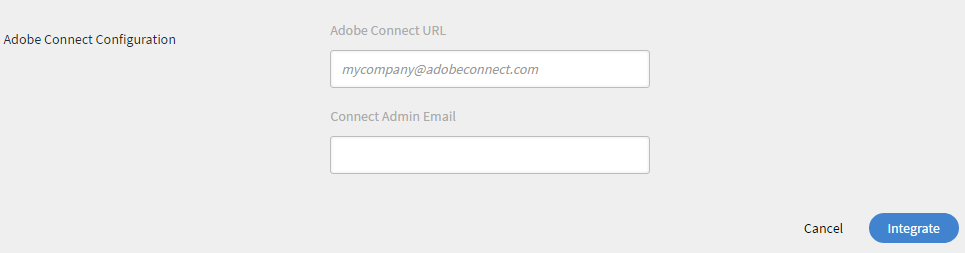

# Adobe Connect-integratie

Beheerders van een organisatie kunnen de instellingen van het Learning Manager-account configureren om Adobe Connect-integratie mogelijk te maken.

## Adobe Connect configureren {#configureadobeconnect}

1. Klik in Beheerdersaanmelding op **[!UICONTROL Instellingen]** in het linkerdeelvenster om de basisinformatie over uw bedrijf te bekijken. Klik **[!UICONTROL Adobe Connect]** op de linkerruit.

   

   *Uitgezochte Adobe Connect in de linkerruit*

1. Klik **[!UICONTROL vormen nu]** verbinding in **[!UICONTROL de sectie van de Configuratie van Adobe Connect]**.

   <!---->

1. Geef de Adobe Connect-domeinnaam van uw bedrijf en meld u aan met uw bedrijfsgegevens.

   

   *voeg domeinnaam en geloofsbrieven toe*

   Een voorbeeld van een Adobe Connect-URL: mycompany.adobeconnect.com\
   U moet de e-mail-ID van de beheerder van het Connect-account van de Adobe opgeven.

   Alleen door Adobe gehoste accounts worden ondersteund in Learning Manager. Voorbeeld; &#39;.adobeconnect.com&#39;.

1. Klik **[!UICONTROL integreren ].**

   Nadat de e-mail-ID is geverifieerd, geeft Learning Manager het bericht weer als Connect is geïntegreerd. U kunt uw virtuele klassikale cursussen automatisch bekijken met behulp van Adobe Connect.

   De Adobe Connect-accountbeheerder moet de algemene gebruiksvoorwaarden van Adobe Connect accepteren. Als deze niet worden geaccepteerd, mislukt uw aanmeldpoging mogelijk. Meld u na het aanmaken van het Adobe Connect-account eenmaal aan op het account. Bij de eerste aanmeldpoging verschijnt er een pagina met de Algemene voorwaarden.

   <!---->

## Sessie-informatie voor virtueel klaslokaal toevoegen {#addvirtualclassroomsessioninformation}

Als de auteur van een virtuele klassikale cursus de sessie-informatie niet heeft verstrekt, dan kan de beheerder de sessiedetails opnemen.

Klik op de naam van de VC-cursus in Beheerdersaanmelding. Klik **[!UICONTROL Instanties]** op de linkerruit en klik **[!UICONTROL Details van de Zitting]**.  Klik op het pictogram Bewerken in de rechterhoek van de pagina Sessiedetails om de sessiegegevens toe te voegen.

*voeg informatie van de virtuele klassikale zitting toe*

Met de integratie van Adobe Learning Maanger en Adobe Connect voor het maken van virtuele klassikale modules of sessies, moet uw Connect-account ondersteuning bieden voor vergaderzalen met een voldoende aantal ruimten en gelijktijdige gebruikers voor uw use case. Deze vergaderzalen worden gebruikt om virtuele klassikale modules van Learning Manager te hosten. Er wordt door Learning Manager dynamisch een nieuwe Connect vergaderzaal aangemaakt voor elke virtuele klasmodule of sessie binnen Learning Manager.

U moet Adobe Connect apart aanschaffen, los van Adobe Learning Manager.

## Aanwezigheid van studenten {#learnersattendance}

Als de host van de virtuele klassikale cursus de sessie niet bijwoont, dan wordt de aanwezigheid van de studenten die de sessie hebben bijgewoond niet automatisch geregistreerd. In dergelijke gevallen kan de beheerder de aanwezigheid handmatig vastleggen.

Klik op de virtuele klassikale cursus, klik op Aanwezigheid in het linkerdeelvenster van de volgende pagina en neem de aanwezigheid op.

## Ondersteuning voor Adobe Connect-seminars met grote doelgroepen

Adobe Learning Manager ondersteunt het selecteren van seminarruimten vanuit Adobe Connect tijdens het instellen van een sessie in een virtuele lesruimte in Connect. Voorheen kon de beheerder alleen het type vergaderruimte selecteren. Met deze functie kan beheerder met een geldige seminarlicentie eenmalige of grootschalige gebeurtenissen (maximaal 1500 deelnemers) plannen en beheren in ALM.

Verwijs naar dit [ artikel ](https://helpx.adobe.com/adobe-connect/using/creating-seminars.html) voor meer informatie over de seminarruimte.

### Ondersteuning voor toegang tot sessieanalytics

Docenten hebben toegang tot Session Analytics voor hun voltooide Adobe Connect-sessies via een nieuwe koppeling in het sessiedashboard.

_Uitgezochte zitting URL_

Met deze koppeling opent u het dashboard voor de sessieanalyse in Connect, dat gedetailleerde inzichten biedt in de betrokkenheid van de sessie.
Deze functie is alleen beschikbaar voor sessies die worden uitgevoerd via Adobe Connect. De sessieanalyse omvat:

* **[!UICONTROL Betrokkenheid]**: Overzicht van de algemene prestaties van de levende zitting
* **[!UICONTROL Interacties]**: Gedetailleerde verdeling van deelnemersactiviteit over verschillende pods
* **[!UICONTROL Activiteit van de Deelnemer]**: Samenvatting van deelnemersbetrokkenheid
* **[!UICONTROL Rapporten van de Download]**: Optie om rapporten voor pod-specifieke betrokkenheidsgegevens te downloaden

_dashboard van de Zitting_

Verwijs dit [ artikel ](https://helpx.adobe.com/in/adobe-connect/using/session-dashboard.html) voor meer informatie over de Analytics van de Zitting.
