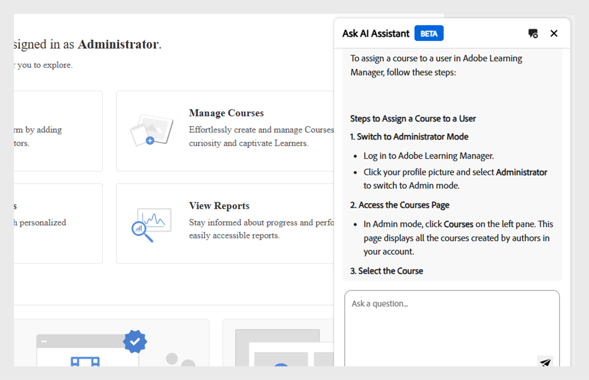

# Admin AI Assistant (Bèta) in Adobe Learning Manager

In complexe leerinstellingen kunnen beheerders moeite hebben om content te vinden of taken te voltooien vanwege gecompliceerde menu&#39;s en losgekoppelde workflows. Voor taken zoals het uitvoeren van rapporten of het benaderen van specifieke informatie moet u bijvoorbeeld mogelijk op meerdere schermen navigeren. Met de Admin AI Assistant (Beta) vind je de juiste informatie om taken efficiënt te begrijpen en voltooien.

Met de Admin AI Assistant (Bèta) in Adobe Learning Manager kunnen beheerders snel antwoorden vinden op veelgestelde vragen, systeemfuncties verkennen en begrijpen hoe belangrijke taken kunnen worden voltooid door deze in gewone taal te stellen. Of je nu nieuw bent in Adobe Learning Manager of op zoek bent naar snellere probleemoplossingen, de Admin AI Assistant (Beta) vereenvoudigt je workflow door rechtstreeks in het platform contextbewuste hulp te bieden.

De AI-mogelijkheden van de Adobe worden gebruikt om zoekopdrachten in natuurlijke talen mogelijk te maken voor alle leerinhoud en systeemworkflows.  De beheerders kunnen vragen zoals **stellen hoe te om gebruikers aan Adobe Learning Manager** toe te voegen of **hoe te om het Leren Wegen** toe te voegen. De Admin AI Medewerker van Adobe Learning Manager (Bèta) wordt uitsluitend opgeleid op openbaar beschikbare, Adobe-bezeten documentatie zoals, middelen die op **[!UICONTROL Experience League]** worden ontvangen. Het leert niet van of heeft geen toegang tot de inhoud van de klant, het interne trainingsmateriaal, of user-generated data.

Deze assistent vermindert de afhankelijkheid van handmatige navigatie, verkort de ontdekkingstijd en helpt actiegerichte inzichten snel aan het licht te brengen.

<!--## Key benefits

* Perform common administrator tasks faster with conversational guidance.
* Get instant answers without browsing through extensive menus.
* Gain real-time insights and step-by-step guidance for administrative workflows.-->

>[!IMPORTANT]
>
>Deze functie is alleen beschikbaar voor beheerders en wordt momenteel alleen ondersteund in het Engels.

## Privacy, beveiliging en governance

De Admin AI Assistant (Bèta) is ontworpen om scherpgestelde beveiliging en dataprivacy te behouden. Dit is wat je kunt verwachten:

* De Admin AI Assistant (Beta) gebruikt geen persoonlijke gegevens, waaronder trainingsdoeleinden.
* Er is geen toegang tot leergegevens of -inhoud die in Adobe Learning Manager is opgeslagen.
* De Admin AI Assistant (Bèta) heeft geen toegang tot of deelt geen PII&#39;s (Personele Identifeerbare Informatie) en deelt geen persoonlijke of gevoelige informatie.
* Vragen van gebruikers (zoals vragen of query&#39;s) worden niet gedeeld met andere klanten.

>[!IMPORTANT]
>
>De Admin AI Assistant (Beta) wordt in fasen geïmplementeerd, waarbij klanten een voorafgaande kennisgeving van twee weken ontvangen. Neem voor hulp contact op met uw Customer Success Manager (CSM).

## De Admin AI Assistant (Bèta) openen

Ga als volgt te werk om de Admin AI Assistant (Bèta) te starten:

1. Meld u aan als beheerder.
2. Selecteer het chatpictogram om de Admin AI Assistant (Bèta) te starten.

   
   _selecteer de praatjebel om Admin AI Medewerker (Bèta) te lanceren_

   >[!NOTE]
   >
   >Wanneer u de Admin AI Assistant (Beta) voor het eerst start, moet u uw toestemming geven voordat u deze kunt gebruiken. Het dialoogvenster voor toestemming wordt alleen weergegeven tijdens deze eerste keer dat u de toepassing start. Voor alle volgende keren starten, wordt u rechtstreeks naar de Admin AI Assistant (Bèta) geleid om uw vragen in te voeren.

3. Selecteer **[!UICONTROL begonnen worden]**. U kunt nu de Admin AI Assistant (Bèta) gebruiken.

   
   _Vraag om het gebruiksbeleid vóór eerste gebruik goed te keuren_

## De Admin AI Assistant (Bèta) gebruiken

De Admin AI Assistant (Bèta) gebruiken:

1. Typ uw herinnering en druk **[!UICONTROL binnengaan]**. Het antwoord wordt weergegeven in de Admin AI Assistant (Bèta).

   
   _een steekproefvraag en reactie van de Medewerker van Admin AI (Bèta)_

### Voorbeelden van vragen

Hieronder volgen enkele voorbeelden van aanwijzingen die beheerders kunnen gebruiken om de Admin AI Assistant (Bèta) effectief te gebruiken:

* **wijs een cursus aan een gebruiker** toe
   * **Vragen**: &quot;Hoe wijs ik een cursus aan een gebruiker toe?&quot;

  
  _Reactie voor herinnering hoe ik een cursus aan een gebruiker_ toewijs

* **Latest inschrijvingsrapport**
   * **Herinnering**: toon me het recentste inschrijvingsrapport.

  
  _Reactie voor de herinnering toont me het recentste inschrijvingsrapport_

* **schrap een gebruiker**
   * **Herinnering**: &quot;Hoe kan ik een gebruiker schrappen?&quot;

  
  _Reactie voor de herinnering hoe ik een gebruiker kan schrappen_

### Tips voor het effectief gebruiken van de Admin AI Assistant (Bèta)

* **ben specifiek met uw herinneringen**: Wanneer het stellen van een vraag, omvat duidelijke context en details. Stel bijvoorbeeld: &quot;Hoe kan ik een gebruiker toevoegen aan Adobe Learning Manager?&quot;, vraag dan: &quot;Hoe kan ik een cursus toewijzen aan een gebruiker in Adobe Learning Manager?&quot;
* **Gebruik duidelijke en beknopte taal**: Houd uw vragen ongecompliceerd en geconcentreerd. Zo kan de Admin AI Assistant (Beta) uw intentie begrijpen en een nauwkeuriger antwoord geven.
* **onderzoek verschillende mogelijkheden**: Vraag over een verscheidenheid van eigenschappen zoals inschrijvingsrapporten, studentenvooruitgang, inhoudstoewijzing, of certificatie het volgen om de volledige waaier van beschikbare steun te ontdekken.
* **geef terugkoppel**: Na het ontvangen van een reactie, laat ons weten of het nuttig was. Gebruik de duimen omhoog, duims neer, rapport, of commentaareigenschappen om uw terugkoppelen te delen. Uw feedback speelt een belangrijke rol bij het verbeteren van de assistent.

## Feedback geven op reacties van Admin AI Assistant (Bèta)

Uw feedback over de reacties die worden gegenereerd door de Admin AI Assistant (Beta) verbetert de nauwkeurigheid, relevantie en algehele prestaties.

### Een reactie leuk vinden of niet leuk vinden

* Selecteer **[!UICONTROL Duimt omhoog]** als de reactie nuttig en nauwkeurig was.
* Selecteer **[!UICONTROL duimen neer]** als de reactie onjuist of nutteloos was.

### Een reactie markeren

Ga als volgt te werk om een reactie te markeren:

1. Selecteer **[!UICONTROL Vlag]** aan het eind van de reactie.

   
   _Uitgezochte Rapport in Admin AI Hulpscherm_

2. Selecteer één of meerdere redenen, voeg commentaren indien nodig toe, en selecteer dan **[!UICONTROL voorleggen]**.

   
   _de Beheerders schatten de reactie gebruikend duimen omhoog of neer met facultatieve commentaren_

Adobe gebruikt deze feedback om de Admin AI Assistant (Bèta) in de loop der tijd te verbeteren.

## Veelgestelde vragen

+++Kan ik de Admin AI Assistant (Bèta) als student gebruiken?

Aantal Deze assistent is alleen beschikbaar voor beheerders.

+++

+++Is het beschikbaar in de mobiele app?

Op dit moment niet.

+++

+++Kan het beheeracties uitvoeren?

Aantal De Admin AI Assistant (Bèta) biedt alleen richtlijnen.

+++

+++Kan het meer talen ondersteunen?

Het Adobe Learning Manager-team evalueert de meertalige ondersteuning voor toekomstige updates.

+++
