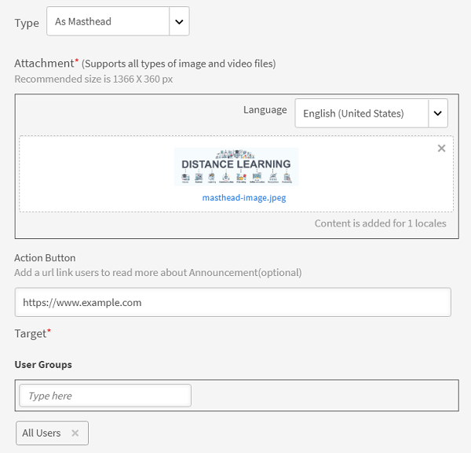

# Aankondigingen

Een aankondiging is een multimediabericht (tekst, afbeelding of video) dat door een beheerder wordt uitgezonden naar een gedefinieerde groep gebruikers.

De beheerder kan aankondigingen uitzenden naar studenten om hen te informeren over het optreden van een gebeurtenis of een activiteit. Aankondiging kan een combinatie zijn van tekst, afbeeldingen of video&#39;s. U kunt leerobjecten zoals cursussen, leerprogramma&#39;s en certificeringen aan een aankondiging koppelen.

Er zijn vier soorten aankondigingen:

* Melding
* Masthead
* Aanbeveling
* E-mail

## Melding {#notification}

1. Als beheerder klikt u op Aankondigingen in het linkerdeelvenster.
1. Klik op Toevoegen rechtsboven op de pagina.
1. Selecteer in de vervolgkeuzelijst Type de optie **Als melding**.
1. Voeg in het veld Bericht het bericht voor de aankondiging toe. U kunt hier ook een URL voor aankondigingen toevoegen. U moet echter wel de URL in het HTML-formulier toevoegen.

   Bijvoorbeeld:  `code <a href="http://www.w3schools.com" target="_blank">Visit W3Schools</a>.`

   Wanneer u het doel als leeg opgeeft en een gebruiker op de aankondigings-URL klikt, wordt de koppeling op een nieuw tabblad geopend. Als u het doel niet opgeeft, wordt de koppeling in dezelfde browser geopend.

1. Voeg desgewenst bijlagen, zoals afbeeldingen of videobestanden, toe voor de aankondiging.
1. Kies de doelgebruikersgroepen of de doelleerobjecten. U kunt er slechts één kiezen voor een aankondiging.

   Typ de naam van de gebruikersgroep in het tekstvak en kies een optie in de vervolgkeuzelijst. Kies de training door de objectnaam in het tekstvak te typen.

1. Klik in het dialoogvenster op Geavanceerde instellingen. U kunt de volgende handelingen uitvoeren:

   * Maak van deze aankondiging een sticky-aankondiging door het selectievakje Vaste aankondiging inschakelen in te schakelen.
   * Selecteer de levertijd voor de aankondiging.

1. Selecteren **[!UICONTROL Op een datum]** als u de aankondiging voor een latere datum wilt plannen en op het tekstgebied ernaast wilt klikken. Er verschijnt een kalenderpop-up waarin u de startdatum kunt kiezen. Kies de einddatum door dezelfde stappen uit te voeren.
1. Klikken **[!UICONTROL Opslaan]**.
1. Klik op het tabblad Concepten op het instellingenpictogram naast een aankondiging en klik op Verzenden.

Als de multimediabijlage groot is, kan het uploaden enige tijd duren. Nadat u op Opslaan hebt geklikt, ontvangt u een pop-up met een bericht terwijl uw upload wordt verwerkt. U ontvangt een melding nadat de bijlage is geüpload.

## Masthead {#masthead}

Wanneer u deze optie kiest, elk mediabestand dat u als masthead kiest op de startpagina van de student. De masthead fungeert als een oproep tot actie voor de studenten waarvoor de masthead is bedoeld.

*De masthead aanpassen*

1. Blader naar en kies een afbeelding die de masthead vertegenwoordigt. De aanbevolen grootte is 1280 x 360 px.
1. Kies de landinstelling waaraan u een masthead wilt toevoegen. Voor elke taal moet u een masthead-asset kiezen.
1. In het dialoogvenster **[!UICONTROL Knop Handeling]** , voegt u een URL toe zodat studenten die op de knop op de masthead klikken, naar de URL worden omgeleid. Dit is een optioneel veld.
1. Kies de doelgebruikersgroepen of de doelleerobjecten. U kunt er slechts één kiezen voor een aankondiging.

   Typ de naam van de gebruikersgroep in het tekstvak en kies een optie in de vervolgkeuzelijst. Kies de training door de objectnaam in het tekstvak te typen.

1. In het dialoogvenster **[!UICONTROL Geavanceerde instellingen]** hebt u de volgende opties:

   * Klikken **[!UICONTROL Meteen]** als je wilt dat de aankondiging meteen wordt gepubliceerd .
   * Klikken **[!UICONTROL Nooit]** als u niet wilt dat uw aankondiging verloopt.
   * Selecteer de **[!UICONTROL Starten]** en **[!UICONTROL Einde]** data voor de aankondiging.

   

   *Tijd instellen voor weergave van een masthead*

**Is er een limiet voor het aantal live Masthead-aankondigingen?**

Je ziet alleen de meest recente 10 Masthead-aankondigingen.

## Aanbeveling {#recommendation}

Wanneer u deze optie kiest, wordt elke gewenste training aanbevolen voor opgegeven gebruikersgroepen. De aanbevelingen worden aangestuurd door een Machine Learning-algoritme.

*Aanbevolen training selecteren om weer te geven aan een student*

1. Kies de training die u aan studenten wilt aanbevelen. U kunt maximaal tien trainingen toevoegen.

   Studenten zien alleen de uitgeschreven trainingen in de Aanbeveling van de organisatie. Afhankelijk van de zichtbaarheid van de catalogus heeft de student toegang om de training te zien.

1. Kies de doelgebruikersgroepen of de doelleerobjecten. U kunt er slechts één kiezen voor een aankondiging.

   Typ de naam van de gebruikersgroep in het tekstvak en kies een optie in de vervolgkeuzelijst. Kies de training door de objectnaam in het tekstvak te typen.

1. In het gedeelte Geavanceerde instellingen hebt u de volgende opties:

   * Klikken **[!UICONTROL Meteen]** als je wilt dat de aankondiging meteen wordt gepubliceerd .
   * Klikken **[!UICONTROL Nooit]** als u niet wilt dat uw aankondiging verloopt.
   * Selecteer de **[!UICONTROL Starten]** en **[!UICONTROL Einde]** data voor de aankondiging.

   <!---->

Wanneer u op **[!UICONTROL Opslaan]** kunt u de aankondiging direct publiceren of later publiceren. Tot dan is de aankondiging in een ontwerpstaat.

* Mastheads/Recommendations activeren geen meldingen.
* Mastheads/Recommendations komen niet voor in het aankondigingsrapport.

## Lijst met concepten, gepland en verzonden {#draftscheduledandsentlist}

In Beheerdersaanmelding kunt u alle aankondigingen weergeven op drie tabbladen, zoals Concepten, Gepland en Verzonden.

<!---->

### Concept {#draft}

Op het tabblad Concepten kunt u alle aankondigingen bekijken die door een beheerder zijn gemaakt maar nog niet zijn uitgezonden of nog niet zijn gepland voor uitzending.

Standaard zijn alle aankondigingen ingesteld op onmiddellijke uitzending. Als u instellingen > verzend optie kiest voor een niet-geplande aankondiging, wordt deze onmiddellijk uitgezonden. Om een aankondigingsuitzending te plannen, moet u de begin- en einddatum in Geavanceerde instellingen kiezen.

### Gepland {#scheduled}

Op het tabblad Gepland kunt u alle aankondigingen bekijken die gepland zijn voor uitzending op een latere datum.

### Verzonden {#sent}

Op het tabblad Verzonden kunt u alle aankondigingen bekijken die al zijn uitgezonden.

## Als e-mail

Gebruik deze optie om doelgerichte ad-hoc-e-mails te verzenden naar studenten van een geselecteerde gebruikersgroep of naar studenten die zijn ingeschreven voor een specifieke training.

*Doelgerichte ad-hoc-e-mails naar studenten sturen*

*Beheerder maakt een e-mailaankondiging*

1. Selecteren **[!UICONTROL Type als e-mail]**.
1. Voer het onderwerp van de e-mail en de berichttekst in.
1. In de sectie Doel kunt u:

   * Selecteer een gebruikersgroep OF
   * Selecteer een cursus. Als de cursus meerdere instanties heeft, kunt u de gewenste instantie selecteren.

1. Klikken **[!UICONTROL Opslaan]**.
