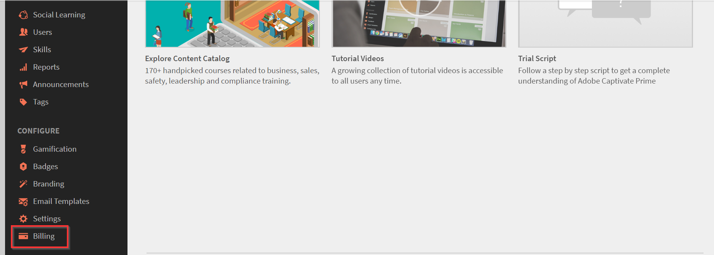

# Bestellingen en facturering van Leermanager beheren

Aankoop op basis van een creditcard is alleen beschikbaar in het dialoogvenster [Amerikaanse regio](http://learningmanager.adobe.com/).

Facturering voor Leermanager beheren, bestellingen plaatsen met een creditcard, zich abonneren met een inkooporder of met een maandabonnement voor actieve gebruikers.

Adobe Learning Manager heeft een flexibele, klantvriendelijke en een van de beste prijsmodellen om aan de behoeften van je organisatie te voldoen. Zie de klasse [Learning Manager](https://www.adobe.com/products/learningmanager.html) pagina.

Alleen de beheerders van uw organisatie kunnen facturering beheren.

Als u contact wilt opnemen met de Adobe voor meer informatie over het abonnement en de facturering van de Learning Manager, kunt u ons schrijven op [learningmanagersales@adobe.com](mailto:learningmanagersales@adobe.com).

## Bestellingen plaatsen met creditcards {#placeordersusingcreditcards}

U kunt een abonnement voor maximaal 3500 studenten kopen via een enkele creditcardbetalingsopdracht. De eerste bestelling in het account moet voor minimaal 10 studenten zijn.

1. Klik in de beheerdersapp op **[!UICONTROL Facturering]** in het linkernavigatievenster.

   

   *Facturering van Adobe Leermanager starten*

1. Op de **[!UICONTROL Factuurinformatie]** pagina, voegt u het aantal gebruikers toe in het deelvenster **[!UICONTROL Gebruikers toevoegen]** veld. Wanneer u een creditcard gebruikt voor vooraf betaalde abonnementen, kunt u het aantal gebruikers zien dat u voor het abonnement kunt toevoegen. Het aantal gebruikers dat u kunt toevoegen, mag niet groter zijn dan het aantal dat wordt vermeld in de sectie Resterende.1.

   

   *Aantal gebruikers toevoegen*

1. Nadat u het aantal gebruikers hebt opgegeven dat u wilt toevoegen, klikt u op Bestelling plaatsen rechtsboven op de pagina.

   

1. Bekijk de schatting die op het scherm wordt weergegeven.

   

   *Een bestelling plaatsen*

   De jaarlijkse abonnementskosten worden berekend op basis van het aantal gebruikers dat voor het abonnement is toegevoegd. Als er bijvoorbeeld vier gebruikers worden toegevoegd, wordt het jaarlijkse bedrag berekend met behulp van de expressie 4 usersX$4X$12, die $192 retourneert.

   Klikken **[!UICONTROL Doorgaan]**.

   *Bekijk de schatting*

1. Op de pagina Betalingsgegevens kunt u de geschatte prijs van de bestelling bekijken. De valuta wordt weergegeven op basis van de huidige landinstelling.

   

   *Betalingsgegevens weergeven*

   U kunt de landinstelling ook wijzigen door het land te kiezen in de vervolgkeuzelijst.

   

   *Het land van facturering selecteren*

1. Voer uw contactgegevens in, kies het type creditcard en geef de gegevens van de creditcard op. Nadat u de vereiste gegevens hebt ingevoerd, klikt u op **[!UICONTROL Volgorde voltooien]**.
1. Nadat u de bestelling hebt geplaatst, klikt u op de knop **[!UICONTROL Ordergeschiedenis]** op het tabblad **[!UICONTROL Facturering]** pagina.

   

   *Bestelgeschiedenis bekijken*

## Status van bestelling controleren {#checkorderstatus}

Alle bestellingen kunnen een van de volgende vier statussen hebben:

**Actief:** Een bestelling is actief en gebruikers zijn geregistreerd.

**Opgeschort:** Een bestelling wordt in de volgende gevallen opgeschort:

* Vertraging in ontvangst van betaling van de creditcard
* Vervaldatum creditcard.
* Voor elke terugkerende betalingscyclus wordt de betaling geweigerd.

**Geannuleerd gestart:** Een bestelling wordt in deze status geplaatst wanneer de beheerder van de leermanager het account deactiveert. De bestelling wordt na ontvangst van de annuleringsbevestiging van de bestelling naar een geannuleerde status verplaatst.

## Abonnementsgegevens bijwerken {#updatesubscriptiondetails}

1. Klik in de lijst met bestellingen op **[!UICONTROL Bewerken]**.

   

   *Abonnementsgegevens bijwerken*

1. Klik op de pagina Abonnementsgegevens op **[!UICONTROL Abonnement bewerken]**.
1. Kies het item dat u wilt bewerken:

   * Betalingsmethode: Gebruik deze optie om de betalingsgegevens, zoals de creditcard, bij te werken.
   * Adres: Gebruik deze optie om adresgegevens bij te werken.

## Abonnement annuleren {#cancelasubscription}

Een bestelling annuleren:

1. Klik op Facturering in het linkerdeelvenster van de beheerderspagina.
1. Kies in de rechterbovenhoek van de pagina Facturering de optie **[!UICONTROL Handelingen]** > **[!UICONTROL Account deactiveren]**.
1. Zodra de beheerder het account heeft gedeactiveerd, worden alle bestaande bestellingen in het account geannuleerd vanaf de volgende factureringsperiode.

Wanneer een account door de klant wordt gedeactiveerd, wordt de proefstatus 30 dagen ingeschakeld. De accounteigenaar ontvangt drie herinnerings-e-mails om het account opnieuw te activeren. Als de eigenaar het account niet opnieuw activeert, heeft geen van de gebruikers toegang tot de Learning Manager, behalve de eigenaar.

## Bestellingen plaatsen met inkooporder {#placeordersusingpurchaseorder}

U kunt kiezen voor het inkooporderproces als alternatieve betalingsmethode. Uw account moet altijd met Adobe zijn geregistreerd. Dit proces wordt in rekening gebracht op uw organisatieaccount. Er worden kosten in rekening gebracht op basis van de activiteiten van een student. Er worden alleen kosten in rekening gebracht voor activiteiten op leerobjectniveau. Een bestelling plaatsen met Inkooporder:

1. Een e-mail verzenden naar [learningmanagersales@adobe.com](mailto:learningmanagersales@adobe.com) en het aantal vereiste studenten vermelden.
1. Het team van Learning Manager stuurt u een activeringssleutel.
1. Voer op de Factureringspagina van de beheerdersapp de activeringssleutel in.
1. Klik op Activeren rechtsboven op de pagina.

## Accountstatus controleren {#checkaccountstatus}

Nadat een account is geactiveerd, kan het account zich in een van de volgende statussen bevinden:

* **Proefversie** - U kunt een Adobe Learning Manager-account maken en dit 30 dagen lang zonder betaling gebruiken. Er is geen limiet op het aantal studenten dat tijdens de proefperiode is geregistreerd.
* **Actief** - In deze status heeft het account actieve leerprogramma-abonnementen met maandelijkse betalingen volgens de abonnementsbestelling.
* **Inactief** - In de volgende gevallen wordt een account inactief:

   * Na de proefperiode als er geen actieve abonnementsbestellingen in het account staan.
   * De beheerder deactiveert het account, wat resulteert in het annuleren van alle bestaande bestellingen in een account vanaf de volgende factureringsperiode van het abonnement.
   * Voor actieve bestellingen in een account wordt betaling geweigerd, zelfs na herinneringen.

Als de status Inactief is, wordt uw account niet onmiddellijk geannuleerd. U ontvangt ten minste een paar herinneringen van het team van Leermanager waarin u wordt gevraagd de meest recente informatie te verstrekken over

uw creditcard als deze is verlopen. In de status Inactief kan alleen een beheerder zich aanmelden bij de Captivate

Learning Manager-account. Alle andere gebruikers hebben geen toegang tot het account.

* **Activering vereist** - Uw account krijgt deze status wanneer de beheerder van de leermanager ervoor kiest het account te deactiveren. Alle bestellingen van dit account worden geannuleerd. De betaling voor deze bestellingen wordt niet geïnd vanaf de volgende factureringsperiode. De status van het account blijft in deze status tot de dag van de laatste factureringscyclus. In deze status kunnen alle gebruikers de toepassing zonder enige invloed blijven gebruiken tot het einde van de laatste terugkerende betalingsdatum.

## Abonnement annuleren {#Cancelasubscription-1}

Als u een actief abonnement wilt annuleren, neemt u contact op met het ondersteuningsteam van de Learning Manager.

## Kosten voor beëindiging van account {#accountterminationfee}

Als u het abonnement wilt annuleren voordat de jaarlijkse termijn is voltooid, worden er kosten in rekening gebracht voor vervroegde beëindiging. De beëindigingsvergoeding is gelijk aan 50% van de lidmaatschapsprijs van de resterende verbintenisperiode.

## Monthly Active Users (MAU)-lidmaatschap {#monthlyactiveusersmauplan}

U kunt een MAU-lidmaatschap kiezen als uw voorkeursmethode voor facturering. Met deze optie wordt facturering gegenereerd op basis van het aantal maandelijkse actieve gebruikers. De maandelijkse, unieke actieve gebruikers worden cumulatief toegevoegd voor een periode van 12 maanden vanaf de maand van activering van het abonnement. Dit nummer wordt gebruikt voor facturering voor de periode.

Gebruik het volgende voorbeeld om te begrijpen hoe MAU wordt berekend.

Stel dat het aantal gebruikers per maand als volgt is:

* Maand 1 = 50
* Maand 2 = 500
* Maand 3 = 5000
* Maand 4 t/m 12 = 10

Totaal maandelijkse actieve gebruikers die worden gefactureerd = maand 1 + maand 2 + maand 3 + maand 4 tot 12 = 50 + 500 + 5000 + 90 = 5640.

De facturering voor de periode is voor 5640 gebruikers.

Aan het eind van de periode van 12 maanden, wordt het gebruiksaantal teruggesteld terug naar nul en een nieuwe periode voor het plan van MAU begint. U kunt meerdere activeringssleutels toevoegen om het gekochte aantal licenties te verhogen.

Elke gebruiker die de volgende acties uitvoert of voltooit als gevolg van acties van anderen, wordt beschouwd als een maandelijks actieve gebruiker voor die kalendermaand.

* Een cursus, leerprogramma of certificering volgen.
* Een taakhulp of cursusbijlagen volgen, downloaden.
* Persoonlijke notities gebruiken, downloaden of maken.
* Deelnemen aan Sociaal leren door boards, berichten of opmerkingen te maken.
* Voltooiingen behalen door goedkeuringen voor externe certificaatindiening of aanwezigheid voor klassikale/virtuele klassikale sessies.

## Gebruiksdetails weergeven {#viewusagedetails}

1. Als u het aantal actieve gebruikers per maand wilt weergeven, klikt u op **[!UICONTROL Gebruiksdetails weergeven]**.

   

   *Actieve gebruikers per maand weergeven*

1. Op de pagina die wordt weergegeven, kunt u het volgende weergeven:

   * **Algemeen gebruik:** U kunt het totale aantal actieve gebruikers controleren, gebruikers die in een maand leermanager volgen en het aantal gebruikers dat zich nog niet voor een cursus heeft aangemeld.

   * **Maandelijks gebruik:** U kunt per maand een tabel met unieke actieve gebruikers zien.

## Gebruiksrapport downloaden {#downloadusagereport}

U kunt ook de gegevens van het aantal actieve gebruikers per maand en jaar downloaden. Klik op **[!UICONTROL Gedetailleerd rapport downloaden]**.

Op de **Rapportaanvraag genereren** de vereiste maanden en het vereiste jaar in en klik op **[!UICONTROL Genereren]**.

*Rapport voor actief gebruik downloaden*

Als u het browservenster sluit, wordt het downloaden gestart wanneer u de volgende keer naar Leerbeheer gaat.

De rapporten worden opgeslagen in de map Downloads van uw browser.

## Abonnement annuleren

Als u een actief abonnement wilt annuleren, neemt u contact op met het ondersteuningsteam van de Learning Manager.

## Veelgestelde vragen {#frequentlyaskedquestions}

+++Hoe kan ik abonnementen toevoegen aan of verwijderen uit een account?

Als u abonnementen wilt toevoegen aan een account, voegt u het aantal gebruikers toe waarvoor u abonnementen wilt kopen. Klik vervolgens rechtsboven op **[!UICONTROL Bestelling plaatsen]**. Bekijk de schatting en klik op **[!UICONTROL Doorgaan]**. Voer uw accountgegevens en ook uw creditcardgegevens in. Klik vervolgens op **[!UICONTROL Volgorde voltooien]**.

Als u een actief abonnement wilt verwijderen, neemt u contact op met het ondersteuningsteam van de Learning Manager.
+++

+++Hoe wijzig ik een creditcard voor abonnementen?

In het dialoogvenster **[!UICONTROL Ordergeschiedenis]** tabblad, voor een actief account, klikt u op **[!UICONTROL Bewerken]**. Klik vervolgens op de pagina Abonnementsgegevens op **[!UICONTROL Abonnement bewerken]**. Voer uw nieuwe creditcardgegevens in en klik op **[!UICONTROL Betalingsmethode bijwerken]**.

*Creditcardgegevens weergeven*
+++

+++Hoe kan ik de factureringsgegevens van Learning Manager bijwerken?

Volg onderstaande stappen om de factureringsgegevens bij te werken:

1. Aanmelden als **Beheerder** en klik op **[!UICONTROL Facturering]**.
1. Klik in de lijst met bestellingen op **[!UICONTROL Bewerken]**.
1. Klik op de pagina Abonnementsgegevens op **[!UICONTROL Abonnement bewerken]**.

Kies het item dat u wilt bewerken:

1. **[!UICONTROL Betalingsmethode]:** Gebruik deze optie om de betalingsgegevens, zoals de creditcard, bij te werken.
1. **[!UICONTROL Adres]:** Gebruik deze optie om adresgegevens bij te werken.
+++

+++Kan ik een abonnement gedeeltelijk annuleren?

Nee, u kunt een abonnement niet gedeeltelijk annuleren. Als u het aantal licenties dat u hebt aangeschaft, moet verminderen, kunt u het abonnement aan het einde van de factureringscyclus annuleren en vervolgens het vereiste aantal licenties aanschaffen.
+++

+++Hoe krijg ik een factuur voor mijn creditcardbetalingen?

Contact [FastSpring](https://fastspring.com/) om een factuur voor uw betalingen te ontvangen, op een van de volgende manieren:

* Maak een serviceverzoek met FastSpring met behulp van de koppeling `https://questionacharge.com`.
* Verzend een e-mail naar FastSpring op `orders@fastspring.com` om de factuur verzoeken.
+++
