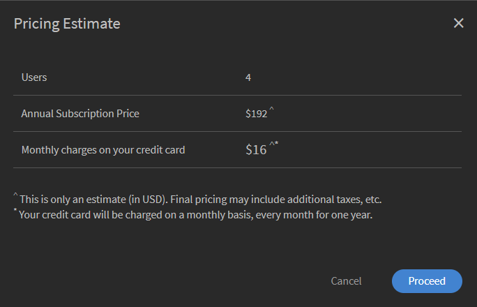
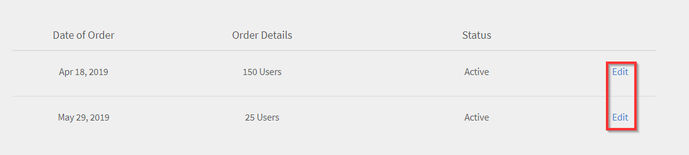
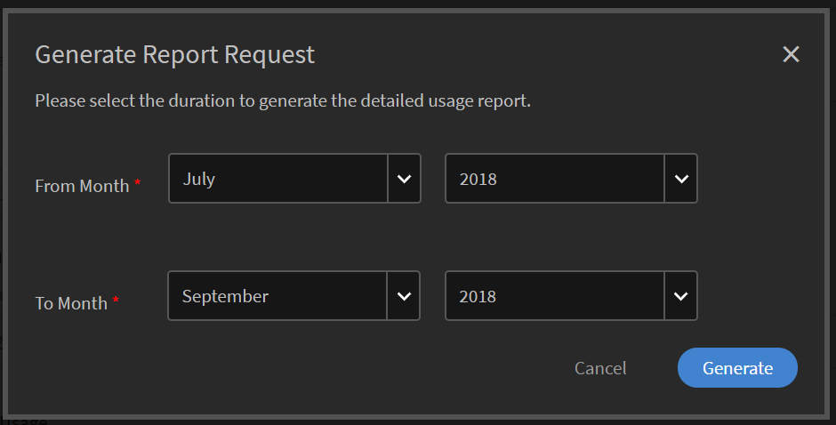

# Bestellingen en facturering van Learning Manager beheren

Aankopen met creditcard zijn alleen beschikbaar in de [regio VS](http://learningmanager.adobe.com/).

Facturering voor Learning Manager beheren, bestellingen plaatsen via creditcard, abonneren met een inkooporder of via MAU-plan (Monthly Active Users).

Adobe Learning Manager heeft flexibele, klantvriendelijke en zeer gunstig geprijsde modellen passend bij de behoeften van uw organisatie. Ga voor meer informatie naar de [Learning Manager](https://www.adobe.com/products/learningmanager.html)-pagina.

Alleen de beheerders van uw organisatie kunnen de facturering beheren.

Als u contact wilt opnemen met Adobe voor meer informatie over Learning Manager-abonnementen en -facturering, stuur dan een e-mail naar [learningmanagersales@adobe.com](mailto:learningmanagersales@adobe.com).

## Bestellingen plaatsen met een creditcard {#placeordersusingcreditcards}

U kunt via één creditcardbetaalopdracht abonnementen voor maximaal 3500 studenten aanschaffen. De eerste bestelling in het account moet voor minimaal 10 studenten zijn.

1. Klik op **[!UICONTROL Facturering]** in het linkerdeelvenster van de beheerdersapp.

   

   *Facturering van Adobe Leermanager starten*

1. Op de **[!UICONTROL Factuurinformatie]** pagina, voegt u het aantal gebruikers toe in het deelvenster **[!UICONTROL Gebruikers toevoegen]** veld. Wanneer u een creditcard gebruikt voor vooraf betaalde abonnementen, ziet u het aantal gebruikers dat u voor het abonnement kunt toevoegen. Het aantal gebruikers dat u kunt toevoegen, mag niet groter zijn dan het aantal dat wordt vermeld in de sectie Resterende.1.

   

   *Aantal gebruikers toevoegen*

1. Nadat u het aantal studenten hebt ingevoerd dat moet worden toegevoegd, klikt u op Bestelling plaatsen in de rechterbovenhoek van de pagina.

   

1. Controleer de schatting op het scherm.

   

   *Een bestelling plaatsen*

   De jaarlijkse abonnementsprijs wordt berekend op basis van het aantal gebruikers dat aan het abonnement is toegevoegd. Als er bijvoorbeeld vier gebruikers worden toegevoegd, wordt het jaarlijkse bedrag berekend met behulp van de formule 4 usersX$4X$12, met als resultaat $192.

   Klik op **[!UICONTROL Doorgaan]**.

   *Bekijk de schatting*

1. Op de pagina met betalingsgegevens kunt u de geschatte prijs van uw bestelling bekijken. De valuta wordt weergegeven op basis van de huidige landinstelling.

   

   *Betalingsgegevens weergeven*

   U kunt uw landinstelling wijzigen door het juiste land te kiezen in de vervolgkeuzelijst.

   

   *Het land van facturering selecteren*

1. Voer uw contactgegevens in, kies het type creditcard en geef uw creditcardgegevens op. Nadat u de vereiste gegevens hebt ingevoerd, klikt u op **[!UICONTROL Volgorde voltooien]**.
1. Nadat u de bestelling hebt geplaatst, klikt u op de knop **[!UICONTROL Ordergeschiedenis]** op het tabblad **[!UICONTROL Facturering]** pagina.

   

   *Bestelgeschiedenis bekijken*

## Bestelstatus bekijken {#checkorderstatus}

Alle bestellingen hebben een van de volgende vier statussen:

**Actief:** een bestelling is actief en gebruikers zijn geregistreerd.

**Opgeschort:** Een bestelling wordt in de volgende gevallen opgeschort:

* Vertraging in ontvangst van betaling met creditcard
* Creditcard verlopen.
* De betaling wordt bij elke terugkerende betaling geweigerd.

**Annulering geïnitieerd:** wanneer de Learning Manager-beheerder het account deactiveert, krijgt een bestelling deze status. Vervolgens krijgt de bestelling na ontvangst van de annuleringsbevestiging de status Geannuleerd.

## Abonnementsgegevens bijwerken {#updatesubscriptiondetails}

1. Klik in de lijst met bestellingen op **[!UICONTROL Wijzigen]**.

   

   *Abonnementsgegevens bijwerken*

1. Klik op de pagina met abonnementsgegevens op **[!UICONTROL Abonnement wijzigen]**.
1. Kies het item dat u wilt wijzigen:

   * Betalingsmethode: Gebruik deze optie om de betalingsgegevens, zoals de creditcard, bij te werken.
   * Adres: Gebruik deze optie om adresgegevens bij te werken.

## Een abonnement opzeggen {#cancelasubscription}

Ga als volgt te werk om een bestelling te annuleren:

1. Klik in het linkerdeelvenster van de beheerderspagina op Facturering.
1. Kies in de rechterbovenhoek van de pagina Facturering de optie **[!UICONTROL Handelingen]** > **[!UICONTROL Account deactiveren]**.
1. Zodra de beheerder het account heeft gedeactiveerd, worden alle bestaande orders in het account geannuleerd vanaf de volgende factureringsperiode.

Wanneer een account door de klant wordt gedeactiveerd, gaat het voor de daaropvolgende 30 dagen over op de proefstatus. De accounthouder ontvangt drie herinneringsmails om het account opnieuw te activeren. Als de accounthouder het account niet opnieuw activeert, krijgt geen van de gebruikers toegang tot Learning Manager, behalve de accounthouder.

## Bestellingen plaatsen met een inkooporder {#placeordersusingpurchaseorder}

U kunt kiezen voor het inkooporderproces als alternatieve betaalwijze. Uw account moet altijd met Adobe zijn geregistreerd. Voor dit proces worden kosten in rekening gebracht op het account van uw organisatie. Er worden kosten in rekening gebracht op basis van de activiteiten van een student. Er worden alleen kosten voor activiteiten op leerobjectniveau in rekening gebracht.  Doe het volgende om een bestelling te plaatsen met een inkooporder:

1. Stuur een e-mail naar [learningmanagersales@adobe.com](mailto:learningmanagersales@adobe.com) met vermelding van het aantal vereiste studenten.
1. Het Learning Manager-team stuurt u vervolgens een activeringssleutel.
1. Voer de activeringscode in op de Factureringspagina van de beheerdersapp.
1. Klik op Activeren rechtsbovenaan de pagina.

## Accountstatus controleren {#checkaccountstatus}

Nadat een account is geactiveerd, heeft het account een van de volgende statussen:

* **Proefversie** - U kunt een Adobe Learning Manager-account maken en dit 30 dagen lang zonder betaling gebruiken. Het aantal ingeschreven studenten is onbeperkt tijdens de proefperiode.
* **Actief** - In deze status heeft het account actieve leerprogramma-abonnementen met maandelijkse betalingen volgens de abonnementsbestelling.
* **Inactief** - In de volgende gevallen wordt een account inactief:

   * Na de proefperiode als er geen actieve abonnementsbestellingen in het account staan.
   * De beheerder deactiveert het account, wat resulteert in het annuleren van alle bestaande bestellingen in een account vanaf de volgende factureringsperiode van het abonnement.
   * Actieve bestellingen in een account worden niet betaald, zelfs niet na herinneringen.

Als de status Inactief is, wordt uw account niet onmiddellijk geannuleerd. U ontvangt ten minste een paar herinneringen van het team van Leermanager waarin u wordt gevraagd de meest recente informatie te verstrekken over

uw creditcard als deze is verlopen. In de status Inactief kan alleen een beheerder zich aanmelden bij de Captivate

Learning Manager-account. Alle andere gebruikers hebben geen toegang tot het account.

* **Activering vereist** - Uw account krijgt deze status wanneer de beheerder van de leermanager ervoor kiest het account te deactiveren. Alle bestellingen van dit account worden geannuleerd. Betaling voor deze bestellingen wordt vanaf de volgende factureringsperiode niet langer geïnd. Het account behoudt deze status tot de laatste factureringsdatum.  In deze status kunnen alle gebruikers de toepassing zonder enige verandering blijven gebruiken tot het einde van de laatste betalingsdatum.

## Een abonnement opzeggen {#Cancelasubscription-1}

Neem contact op met het Learning Manager-ondersteuningsteam om een actief abonnement op te zeggen.

## Kosten voor het opzeggen van een account {#accountterminationfee}

Als u het abonnement voor het einde van de jaarlijkse termijn wilt opzeggen, wordt u een bedrag in rekening gebracht voor vroegtijdig opzeggen. Dit bedrag staat gelijk aan 50% van de abonnementsprijs van de resterende verbintenisperiode.

## MAU-plan (Monthly Active Users, maandelijkse actieve gebruikers) {#monthlyactiveusersmauplan}

U kunt ervoor kiezen een MAU-plan als voorkeursmethode voor facturering in te stellen.  Deze optie factureert op basis van het aantal maandelijkse actieve gebruikers. De unieke maandelijkse actieve gebruikers gedurende 12 maanden vanaf de maand van activering worden opgeteld. Dit aantal wordt gebruikt voor de facturering van de betreffende periode.

Bekijk het volgende voorbeeld om te zien hoe MAU wordt berekend.

Stel dat het aantal gebruikers per maand als volgt is:

* Maand 1 = 50
* Maand 2 = 500
* Maand 3 = 5000
* Maand 4 tot 12 = 10

Totaal maandelijkse actieve gebruikers dat wordt gefactureerd = maand 1 + maand 2 + maand 3 + maand 4 tot 12 = 50 + 500 + 5000 + 90 = 5640.

Voor deze periode wordt er gefactureerd voor 5640 gebruikers.

Aan het einde van de periode van 12 maanden wordt het aantal weer op nul gezet en begint een nieuwe MAU-periode.  U kunt meerdere activeringssleutels toevoegen om het aantal gekochte licenties te verhogen.

Gebruikers die de volgende acties uitvoeren of voltooiingen behalen door acties van anderen, worden beschouwd als een maandelijkse actieve gebruiker voor die kalendermaand.

* Een cursus, leerprogramma-of certificering volgen.
* Een taakhulp of cursusbijlage volgen of downloaden.
* Persoonlijke opmerkingen gebruiken, downloaden of maken.
* Deelnemen aan Sociaal leren door boards, inhoud of opmerkingen te maken.
* Voltooiingen behalen door goedgekeurde ingezonden externe certificaten of aanwezigheid voor klassikale/virtuele klassikale sessies.

## Gebruiksdetails weergeven {#viewusagedetails}

1. Als u het aantal actieve gebruikers per maand wilt bekijken, klikt u op **[!UICONTROL Gebruiksdetails weergeven]**.

   

   *Actieve gebruikers per maand weergeven*

1. Op de pagina die wordt weergegeven, vindt u de volgende informatie:

   * **Algemeen gebruik:** U kunt het totale aantal actieve gebruikers controleren, gebruikers die in een maand leermanager volgen en het aantal gebruikers dat zich nog niet voor een cursus heeft aangemeld.

   * **Maandelijks gebruik:** U kunt per maand een tabel met unieke actieve gebruikers zien.

## Gebruiksrapport downloaden {#downloadusagereport}

U kunt de gegevens over het aantal actieve gebruikers per maand en jaar downloaden.  Klik op **[!UICONTROL Gedetailleerd rapport downloaden]** voor een download.

Voer in het dialoogvenster **Rapportaanvraag genereren** de vereiste maanden en het jaar in en klik op **[!UICONTROL Genereren]**.

*Rapport voor actief gebruik downloaden*

Als u het browservenster sluit, start de download wanneer u Learning Manager de volgende keer bezoekt.

De rapporten worden opgeslagen in de map Downloads van uw browser.

## Een abonnement opzeggen

Neem contact op met het Learning Manager-ondersteuningsteam om een actief abonnement op te zeggen.

## Veelgestelde vragen {#frequentlyaskedquestions}

+++Hoe kan ik abonnementen toevoegen aan of verwijderen uit een account?

Als u abonnementen aan een account wilt toevoegen, voegt u het aantal gebruikers toe waarvoor u abonnementen wilt kopen. Klik vervolgens in de rechterbovenhoek op **[!UICONTROL Bestelling plaatsen]**. Controleer de schatting en klik op **[!UICONTROL Doorgaan]**. Voer uw account- en creditcardgegevens in. Klik op **[!UICONTROL Bestelling voltooien]** om de abonnementen te kopen.

Als u een actief abonnement wilt verwijderen, neemt u contact op met het ondersteuningsteam van de Learning Manager.
+++

+++Hoe wijzig ik een creditcard voor abonnementen?

In het dialoogvenster **[!UICONTROL Ordergeschiedenis]** tabblad, voor een actief account, klikt u op **[!UICONTROL Bewerken]**. Klik op de pagina met abonnementsgegevens op **[!UICONTROL Abonnement bewerken]**. Voer uw nieuwe creditcardgegevens in en klik op **[!UICONTROL Betaalmethode bijwerken]**.

*Creditcardgegevens weergeven*
+++

+++Hoe kan ik de factureringsgegevens van Learning Manager bijwerken?

Volg de onderstaande stappen om de factureringsinformatie bij te werken:

1. Aanmelden als **Beheerder** en klik op **[!UICONTROL Facturering]**.
1. Klik in de lijst met bestellingen op **[!UICONTROL Wijzigen]**.
1. Klik op de pagina met abonnementsgegevens op **[!UICONTROL Abonnement wijzigen]**.

Kies het item dat u wilt wijzigen:

1. **[!UICONTROL Betalingsmethode]:** Gebruik deze optie om de betalingsgegevens, zoals de creditcard, bij te werken.
1. **[!UICONTROL Adres]:** Gebruik deze optie om adresgegevens bij te werken.
+++

+++Kan ik een abonnement gedeeltelijk annuleren?

Nee, u kunt een abonnement niet gedeeltelijk annuleren. Als u het aantal licenties dat u hebt aangeschaft, moet verminderen, kunt u het abonnement aan het einde van de factureringscyclus annuleren en vervolgens het vereiste aantal licenties aanschaffen.
+++

+++Hoe krijg ik een factuur voor mijn creditcardbetalingen?

Neem contact op met [FastSpring](https://fastspring.com) voor een factuur van uw betalingen. Dat kan op de volgende manieren:

* Maak een serviceverzoek met FastSpring met behulp van de koppeling `https://questionacharge.com`.
* Verzend een e-mail naar FastSpring op `orders@fastspring.com` om de factuur verzoeken.
+++
