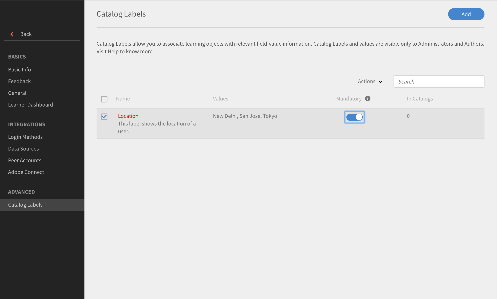

# Cataloguslabels

Met Cataloguslabels kunt u leerobjecten markeren met specifieke velden en een of meerdere waarden toepassen. Indien ingeschakeld kunnen beheerders en auteurs cataloguslabels en waarden instellen en koppelen aan leerobjecten.

Gebruik deze functie om gegevens eenvoudig te categoriseren. Als u leerobjecten bijvoorbeeld op basis van hun locatie, afdeling of vaardigheden wilt categoriseren, kunt u deze velden toepassen en gegevens filteren.

Volg deze stappen om cataloguslabels in te schakelen:

* Als beheerder opent u **[!UICONTROL Instellingen]** > **[!UICONTROL Algemeen]** > **[!UICONTROL Cataloguslabel tonen]**.
* Gebruik het selectievakje om het label in te schakelen.

## Cataloguslabels toevoegen {#addcataloglabels}

Doe het volgende om cataloguslabels toe te voegen:

1. Openen  **[!UICONTROL Instellingen]** > **[!UICONTROL Cataloguslabels]** onder de **[!UICONTROL Gedeeld]** gebruiken. De pagina [!UICONTROL Cataloguslabels] wordt geopend.

   

1. Klik op **[!UICONTROL Cataloguslabel toevoegen]** of **[!UICONTROL Toevoegen]** in de rechterbovenhoek. Het dialoogvenster **[!UICONTROL Cataloguslabels]** toevoegen verschijnt.
1. Voeg cataloguslabels en de bijbehorende waarden toe aan de velden. Een aangepast veld kan meerdere waarden hebben. Auteurs kunnen tijdens het maken van een cursus uit deze waarden kiezen.

   

1. Klik op **[!UICONTROL Opslaan]**.
1. Wanneer u het label opslaat, verschijnt het op de pagina Cataloguslabels. U kunt er desgewenst een verplichte waarde van maken.

   

## Labels op catalogi toepassen {#applylabelstocatalogs}

Nadat u cataloguslabels hebt gemaakt, kunt u deze als volgt op specifieke catalogi toepassen:

1. Open **[!UICONTROL Catalogi]** via het linkerdeelvenster. De pagina Catalogus wordt geopend met de lijst van catalogi.
1. Selecteer de catalogus en pas deze op het label toe.
1. Open Cataloguslabels via het linkerdeelvenster.
1. Klikken **[!UICONTROL Bewerken]** rechtsboven. De pagina toont de lijst met beschikbare cataloguslabels.
1. Klik op **[!UICONTROL Toevoegen aan catalogus]** om een label aan de catalogus toe te voegen.
1. Als u bestaande labels wilt verwijderen die aan een catalogus zijn toegevoegd, klikt u op **[!UICONTROL Verwijderen]**.

Wanneer het aangepaste veld aan de catalogus wordt toegevoegd, is het van toepassing op alle leerobjecten die deel uitmaken van de catalogus.
