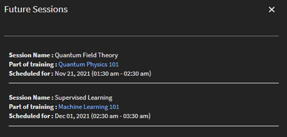

# Klaslokaal

## Overzicht

Beheerders kunnen nu een bibliotheek met klaslokalen instellen. Voor elke locatie in de lesruimte kunnen de beheerders de metagegevens instellen die de locatienaam, de plaatslimiet en aanvullende informatie zoals de URL van de locatie bevatten. Auteurs en beheerders kunnen deze vooraf geconfigureerde klassikale locaties vervolgens gebruiken voor door docenten geleide trainingsgebeurtenissen (klassikale modules).

U kunt de volgende twee manieren gebruiken om een locatie voor een lesruimte toe te voegen.

## Een lesruimte toevoegen via de gebruikersinterface

U kunt een locatie voor een lesruimte toevoegen via de gebruikersinterface:

1. Klik in de Admin-app (de gebruikersinterface voor beheerdersrollen) op **[!UICONTROL Instellingen]** > **[!UICONTROL Locaties van lesruimte]**.

1. Klik op de knop **[!UICONTROL Meer toevoegen]** knop.

1. In het dialoogvenster **[!UICONTROL Locatie van lesruimte]** voert u de volgende gegevens in:

   * Typ de **[!UICONTROL Locatienaam lesruimte]**. Gebruik een unieke naam. Anders wordt er een foutbericht weergegeven in Leermanager.
   * Typ de locatiebeschrijving in het dialoogvenster **[!UICONTROL Locatie-informatie]** veld. Dit veld is optioneel.
   * Typ de **[!UICONTROL Locatie-URL]**. Studenten kunnen deze informatie zien in de details van de lesruimte. De URL kan indien nodig ook een URL voor een toewijzingslocatie zijn. Dit is een optioneel veld.
   * Typ het aantal beschikbare plaatsen in het deelvenster **[!UICONTROL Zitlimiet]** veld. Dit geeft de capaciteit van de stoelen van de lesruimte aan. Deze waarde kan worden gewijzigd bij het maken van de trainingsgebeurtenis onder leiding van de instructeur.

   

   *Een locatie voor een lesruimte toevoegen*

Nadat u de locatie hebt toegevoegd, **[!UICONTROL Instellingen]** > **[!UICONTROL Locaties van lesruimte]** bevat een lijst met de vergaderruimten:

*Alle vergaderruimten weergeven*

De lijst heeft de volgende velden:

**[!UICONTROL Locatienaam]** - Naam van de locatie van de lesruimte.

**[!UICONTROL Toekomstige sessies]** - Aantal gebeurtenissen dat op de corresponderende locatie zal optreden. Klik op het nummer om de details in een dialoogvenster weer te geven.

*Bekijk toekomstige sessies*

Het dialoogvenster bevat de details van elke sessie, zoals de naam van de sessie, de naam van de training die de sessie bevat en het sessieschema. De weergegeven tijd wordt afgestemd op de systeemtijdzone van de student.

De **[!UICONTROL Toekomstige sessies]** veldweergaven **nul** als de lesruimte niet wordt gebruikt voor een sessie of als de lesruimte is gekoppeld aan eerdere sessies.

**Locatie-URL** - URL die u hebt opgegeven bij het maken van de locatie van de lesruimte.

**Locatie-informatie** - De lesruimtegegevens die u hebt opgegeven bij het maken van de lesruimte.

## Een lesruimte toevoegen met behulp van CSV

U kunt ook een of meer klassikale locaties toevoegen door een CSV-bestand te importeren dat de lesruimtegegevens bevat.

In **[!UICONTROL Admin-app]** > **[!UICONTROL Instellingen]** > **[!UICONTROL Locaties van lesruimte]**, klikt u op **[!UICONTROL CSV-importlocaties]** knop. Blader naar de locatie met het CSV-bestand en selecteer het bestand.

Het CSV-bestand gebruikt deze velden om gegevens op te slaan over een of meer locaties in de lesruimte:

* name
* info
* url
* seatLimit

U kunt de kopteksten aanpassen.

Het CSV-bestand moet verplicht alle kolommen in dezelfde volgorde bevatten als hier is opgegeven.

Nadat het systeem het CSV-bestand heeft geïmporteerd, worden de locaties toegevoegd aan de bibliotheek.

## Zoeken naar lesruimten

Een auteur of beheerder kan beginnen met het typen van de locatienaam om de relevante resultaten te zien die beginnen te verschijnen. Een auteur of beheerder kan vervolgens een locatie in de weergegeven resultaten selecteren. Als er geen locatie wordt weergegeven in de resultaten van de typekop, kan de gebruiker nog steeds de naam van de nieuwe locatie in de lesruimte toevoegen. Deze locatienaam die is gemaakt met de workflow voor het maken van de sessie, wordt niet toegevoegd aan de locatiebibliotheek die door de beheerder is gemaakt.

Wanneer een lesruimte wordt toegevoegd, geeft het leerplatform ook aan of de lesruimte al is geboekt voor de vermelde periode. Het biedt zelfs alternatieve tijdruimten als suggesties. Hierdoor kan de auteur de vergadertijd aanpassen als hij besluit dezelfde locatie in de lesruimte te gebruiken.

*Zoeken naar lesruimten*

## Beperken tot vooraf bepaalde lijst van docenten

Op dit moment kunnen gebruikers elke geregistreerde gebruiker toevoegen als docent bij het maken van een sessie in een lesruimte of virtuele lesruimte. Deze functionaliteit blijft ongewijzigd in deze release.

Beheerders hebben nu echter een extra optie om te bepalen wie als docent aan het leerplatform wordt toegewezen. Zo voorkomt u dat een nieuwe docent per ongeluk wordt toegevoegd wanneer u een sessie maakt.

## Beheerder

Een beheerder kan de **[!UICONTROL Beheer van docenten]** optie (beschikbaar onder **[!UICONTROL Admin-app]** > **[!UICONTROL Instellingen]** > **[!UICONTROL Algemeen]**) om ervoor te zorgen dat alleen gebruikers die vooraf bepaalde docenten zijn, kunnen worden toegevoegd als docent voor een sessie.

Beheerders kunnen een docent instellen door **[!UICONTROL BEHEREN]** > **[!UICONTROL Gebruikers]** om de pagina Gebruikersbeheer te openen, selecteert u een gebruiker en wijst u vervolgens de rol van docent toe aan de gebruiker (met **[!UICONTROL Handelingen]** > **[!UICONTROL Rol toewijzen]**).

## Auteur

Als de beheerder de optie **[!UICONTROL Beheer van docenten]** kan een auteur alleen zoeken naar en gebruikers met de rol van docent toevoegen aan de klassikale sessies, virtuele klassikale sessies, checklists en de modules voor het indienen van bestanden.

Bovendien kan een auteur:

* Voeg docenten toe aan en verwijder ze uit de bestaande sessies.
* Voeg docenten toe aan de bestaande sessies die al een of meer docenten hebben.

Daarom nadat een Beheerder toelaat **[!UICONTROL Beheer van docenten]** alleen de gebruikers met de rol Docent kunnen als docent worden toegevoegd.

>[!NOTE]
>
>Dit is niet van toepassing wanneer u sessies migreert met het CSV-bestand voor sessies. In dit geval kan een gebruiker die niet de rol van docent heeft, als docent worden toegevoegd.

## Bestaande sessie annuleren

Een auteur of beheerder kan een sessie annuleren en indien nodig opnieuw plannen.

Wanneer een gebruiker een sessie annuleert, stuurt het systeem een e-mail over de annulering van de vergadering naar alle ingeschreven studenten en docenten. Het e-mailbericht bevat de bijgewerkte sessiedetails.

Er is een sjabloon genaamd **[!UICONTROL Sessieannulering]** dat helpt bij het annuleren van een sessie.

Op de **[!UICONTROL Cursusinstantie]** pagina, bevat elke sessie die onder een cursusinstantie wordt weergegeven een optie om de sessie te annuleren.

*Een bestaande sessie annuleren*

Als u op de knop **[!UICONTROL Sessie annuleren]** verschijnt er een waarschuwingsbericht.

Als u in het dialoogvenster met het waarschuwingsbericht op **[!UICONTROL Doorgaan]**, annuleert het systeem de sessie.

Het systeem wist ook de volgende details na het annuleren van een sessie:

* Begindatum van de sessie
* Einddatum van de sessie
* Begintijd van de sessie
* Eindtijd van de sessie
* Docenten toegevoegd aan de sessie
* URL van virtuele lesruimte
* Locatie/locatie toegevoegd aan de sessie
* Wachtlijstlimiet toegevoegd door docent

## Beheerder

Op de **[!UICONTROL Cursusinstantie]** kan een beheerder een of meer sessies annuleren. Nadat de beheerder een sessie heeft geannuleerd, wist het systeem alle sessiedetails behalve de limiet van de licentie.

Bovendien kan een beheerder:

* Bekijk de ingeschreven studenten en wacht de studenten van een sessie.
* Verwijder studenten uit een cursus met een of meer geannuleerde sessies.
* Aanwezigheid markeren voor geannuleerde sessies
* Een cursus als voltooid markeren die een of meer geannuleerde sessies bevat.
* Plan een sessie die is geannuleerd opnieuw.
* Voeg een docent toe aan een geannuleerde sessie wanneer u deze opnieuw plant.

Merk op dat zelfs na annulering de studenten die voor de trainingsinstantie zijn ingeschreven zich blijven inschrijven. Hun inschrijvingsstatus - inclusief bevestigde inschrijving, wachtlijst en wachtrijgoedkeuring van de manager - verandert niet. Dit is handig omdat de beheerder de geannuleerde sessie in de toekomst kan instellen en opnieuw kan plannen.

## Auteur

Op de **[!UICONTROL Cursusinstantie]** kan een auteur een of meer sessies annuleren. Nadat de auteur een sessie heeft geannuleerd, wist het systeem alle sessiedetails behalve de limiet van de licentie.

Daarom kan een auteur de opdracht **[!UICONTROL Sessie annuleren]** koppelingen om een of meer klassikale sessies of virtuele klassikale sessies te annuleren die beschikbaar zijn in dezelfde of verschillende cursusinstanties.
