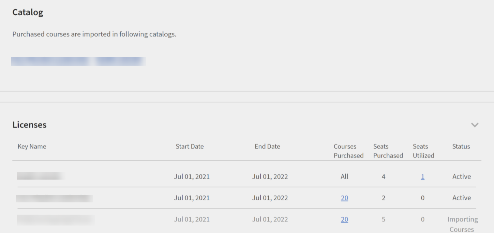
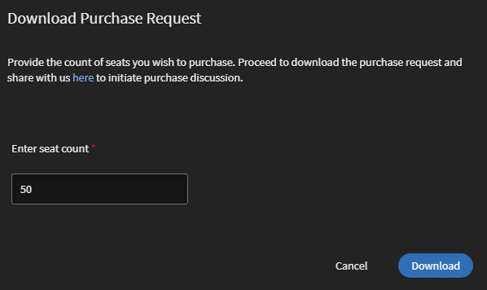

# Contentmarktplaats

Learning Manager biedt nu Content Marketplace waarmee je trainingen kunt verkennen en aanschaffen. Ontdek meer dan 70.000 cursussen die een breed scala aan onderwerpen bestrijken, en beschikbaar zijn in meerdere indelingen. Kies uit beheerde afspeellijsten die zijn afgestemd op een groot aantal verschillende rollen en voldoen aan uw leer- en upskaarbehoeften.

In de beheerdersapp is er een nieuwe optie **[!UICONTROL Content Marketplace]** en vind je in het linkerdeelvenster.

Gebruikers kunnen aankopen via beheerde afspeellijsten waarin verschillende onderwerpen worden behandeld, of ze kunnen de volledige catalogus aanschaffen.

Op de pagina ziet u twee tegels: Enterprise Training en Creative Cloud Training. De eerste tegel start de marktplaats, waarmee u cursussen voor uw studenten kunt aanschaffen. De laatste start de inhoudscatalogus.

Op de pagina Enterprise Training in de beheerdersapp kunt u gebruikers uitnodigen en het Express Interest-rapport downloaden, en ook de volledige catalogus of beheerde afspeellijst aanschaffen.

**Gebruikers uitnodigen**

Nodig gebruikers uit naar Content Marketplace om content te verkennen en interesse te wekken. Als beheerder kunt u alle studenten in het account uitnodigen of geselecteerde studenten uitnodigen. U moet studenten uitnodigen om toegang te verlenen.

Een student kan ook worden ingetrokken bij de optie Content Marketplace. Als u toegang wilt intrekken, klikt u op de knop **[!UICONTROL Toegang intrekken]** koppeling.  Gebruikers kunnen de pagina Contet marketplace niet meer zien in de Learner-app.

Deze optie is standaard geselecteerd voor alle nieuwe accounts. Voor bestaande accounts moet de beheerder de gebruikers uitnodigen om de markt te verkennen.

## Aanschaffen

U krijgt onbeperkte toegang tot de volledige bibliotheek met cursussen. Klik op de knop **[!UICONTROL Aanschaffen]** om een inkoopaanvraagformulier te downloaden.

*Voer het aantal licenties in dat u wilt kopen*

Geef het aantal licenties op waarvoor u de cursussen wilt aanschaffen. Download het inkoopaanvraagformulier en stuur het formulier naar het verkoopteam van Learning Manager.

Het team valideert vervolgens de informatie en genereert vervolgens een sleutel die u ontvangt. Dit is de activeringssleutel waarmee u uw gebruikers toegang geeft tot de inhoud die u aanbiedt.

Nadat de sleutel door het CSAM-team is gegenereerd, kan de beheerder de sleutel gebruiken om de cursussen te importeren en de cursussen te migreren naar de bestaande catalogus of de nieuwe catalogus.

Tijdens de migratie van cursussen wordt de status weergegeven als **[!UICONTROL Cursussen importeren]**. Zodra de migratie is voltooid, krijgt de beheerder een melding dat de migratie is voltooid en geslaagd.

De **[!UICONTROL Licenties]** geeft vervolgens alle licenties weer die voor het account zijn verkregen.

De beheerder kan de koppelingen van de aangeschafte catalogi bekijken op de pagina Overzicht van catalogus.

Nadat de cursussen aan de catalogus zijn toegevoegd, kan de beheerder de verschillende gebruikers of gebruikersgroepen toegang tot de trainingen verlenen.

*Toegang verlenen tot training voor gebruikers en gebruikersgroepen*

## Rapport voor interesse tonen

Wanneer een student op Express interesse voor Catalog in de Learner-app klikt, wordt de interesse vastgelegd in een Express Interest-rapport. De beheerder kan het rapport downloaden. Het rapport (csv) bevat de volgende velden:

* Naam van de catalogus
* Aantal gebruikers dat belangstelling toont
* E-mail van de gebruiker die belangstelling toont

## E-mailsjablonen

Ter ondersteuning van deze workflow kunt u drie e-mailsjablonen gebruiken:

1. **[!UICONTROL Content activeren voltooid]:** Dit wordt verzonden wanneer het kopen van inhoud met een sleutelnaam succesvol is. Alle trainingen die worden aangeschaft, zijn nu beschikbaar.
1. **[!UICONTROL Geautomatiseerde uploadfout van gebruiker]:** Dit wordt verzonden wanneer de automatische update van CSV in de account om een of andere reden mislukt.
1. **[!UICONTROL Gebruikers uitnodigen om inhoud te verkennen]:** Dit is een e-mail met een uitnodiging die naar studenten wordt gestuurd wanneer de beheerder cursussen heeft gekocht. De beheerder kan het rapport Express Interest bekijken om inzicht te krijgen in de algemene vereisten en de aankoopbeslissing te nemen.

1. Aangeschafte cursussen kunnen niet worden toegevoegd aan terugkerende certificaten.
1. Aangeschafte cursussen kunnen niet worden gedeeld met collega-accounts.
1. Aangeschafte cursussen kunnen worden gevolgd door alle gebruikers die er toegang toe hebben. Configureer de zichtbaarheid van de catalogus om de zichtbaarheid van aangeschafte cursussen te beperken tot beperkte gebruikers.
1. Aangeschafte cursussen kunnen niet meer worden gebruikt zodra de activeringssleutel is verlopen. Koop een andere sleutel aan/activeer deze om verbruik toe te staan.

## Inhoudshub in Inhoudsmarkt

Met de Content Hub kunnen beheerders en SME&#39;s (Subject Matter Experts) vereiste afspeellijsten in de Learner-app kort weergeven. Zodra de shortlist is weergegeven, kunnen beheerders het Aankoopaanvraagformulier downloaden en delen met de Adobe Sales Agent.

Een beheerder kan SME&#39;s uitnodigen om een shortlist te maken van de gewenste afspeellijst.

*Inhoudshub starten vanuit de marktplaats*

De inhoudshub is beschikbaar in de studentrol voor alle beheerders. Beheerders stellen SME&#39;s in staat om de afspeellijst die ze willen aanschaffen, te verkorten.

De pagina Inhoudshub is altijd zichtbaar voor beheerders in hun studentrol, omdat dit hen in staat stelt om gemakkelijk een lijst met afspeellijsten te maken. Beheerders kunnen deze pagina toegankelijk maken voor beperkte vakexperts in hun account om u te helpen de juiste afspeellijst in te korten. Bezoek de pagina Enterprise Training aan de beheerderszijde en onderneem stappen om toegang te verlenen.

*Bronnen weergeven in de inhoudshub*

Met Learning Manager kunnen beheerders ook een afspeellijst op de shortlist downloaden en deze delen met het Adobe Sales-team. Voordat u de snellijst downloadt, gaat u naar de inhoudshub en kiest u een afspeellijst door een afspeellijst toe te voegen aan uw bibliotheek.

Klik vervolgens als beheerder op **[!UICONTROL Content Marketplace]** > **[!UICONTROL Enterprise Training]** > **[!UICONTROL Sectie Aanschaffen]** > **[!UICONTROL Beheerde afspeellijsten]**. Klik op de knop **[!UICONTROL Aanschaffen]** om het aanvraagformulier Aanschaffen te downloaden met de gegevens van uw afspeellijst op de shortlist.

*Download het inkoopaanvraagformulier*

De cursussen en de Playlist die u in de Hub van de Inhoud ziet zijn het zelfde als wat u in de Marketplace van de Inhoud ziet. De Hub van de inhoud verstrekt eenvoudig een capaciteit voor Beheerders en beperkte SMEs aan kortere lijstplaylist gemakkelijk voor aankoop.
