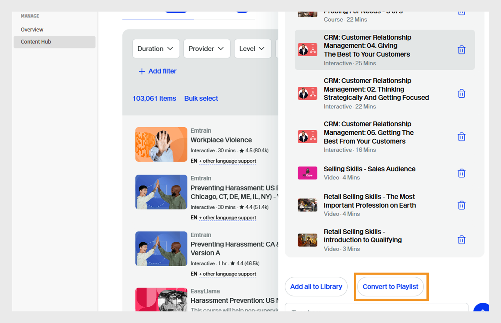
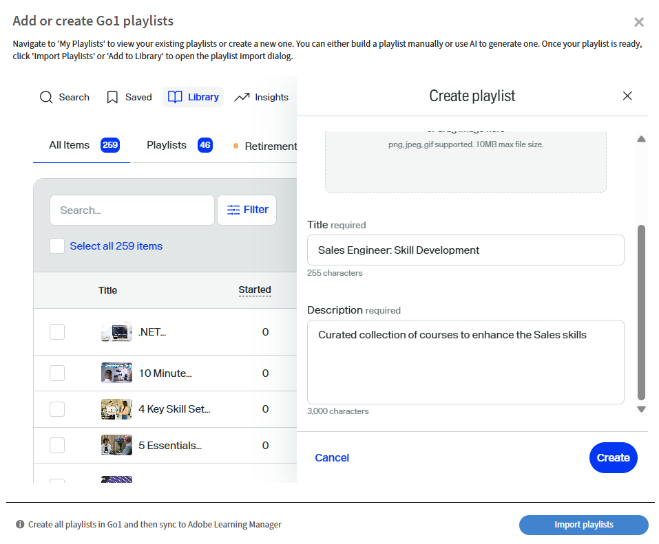

# Go1-cursussen naar een leerpad leiden

Beheerders moeten vaak cursussen beheren vanuit meerdere opslagplaatsen of catalogi, waardoor het moeilijk is om de beste opties te identificeren. Dit is vooral een uitdaging voor Go1, waar duizenden cursussen beschikbaar zijn. Om dit te vereenvoudigen, bieden we een door AI gedreven beheerfunctie rechtstreeks binnen de workflow voor het maken van leerpaden. Zo kunnen beheerders snel de meest relevante cursussen vinden en selecteren

Voeg Go1-cursussen rechtstreeks toe aan leerpaden en certificeringen. Maak leerpaden die een Go1-cursus bevatten, zodat studenten als onderdeel van hun training toegang hebben tot geselecteerde Go1-cursussen.

>[!INFO]
>
>U hebt een actieve Go1-licentie nodig om Go1-cursussen toe te voegen aan leerpaden of certificeringen. Bekijk dit [ artikel ](/help/migrated/administrators/feature-summary/content-marketplace.md) om meer over Go1 vergunningsdetails te leren.

## Een leerpad maken

Een leerpad maken met Go1-cursussen:

1. Meld u als beheerder aan bij Adobe Learning Manager.
2. Selecteer **[!UICONTROL het Leren Wegen]** in de linkernavigatieruit.
3. Selecteer **[!UICONTROL toevoegen]**.

   
   _selecteer toevoegen in de sectie van de Wegen van het Leren om nieuwe gestructureerde opleidingsprogramma&#39;s voor uw studenten te creëren en te organiseren_

4. Typ de vereiste details en selecteer **[!UICONTROL sparen]**. Bekijk dit [ artikel ](/help/migrated/administrators/feature-summary/learning-paths.md) voor meer informatie.
5. U kunt op de volgende manieren cursussen toevoegen aan een leerpad:

   * **[!UICONTROL voeg Cursussen of Leerpaden]** toe: Voeg bestaande cursussen of Leerpaden toe beschikbaar in Adobe Learning Manager.
   * **[!UICONTROL curate inhoud van Go1]**: Voeg cursussen van het Go1 platform toe.
6. Selecteer **[!UICONTROL Curate inhoud van Go1]**.

   
   _voeg Go1 cursussen aan uw Playlist van de Ontwikkeling van de Vaardigheid van de Motor van de Verkoop toe om het leren opties met beheerde derdeinhoud uit te breiden_
7. Beheerders kunnen op de volgende manieren een afspeellijst maken:

   * Gebruikend **[!UICONTROL Go1 AI Medewerker]**. De Medewerker van de mening [ Go1 AI ](/help/migrated/administrators/feature-summary/content-marketplace/curate-go1-playlist.md#go1-ai-assistant) voor meer informatie.
   * In de **[!UICONTROL Bibliotheek]**, uitgezocht **[!UICONTROL creeer playlist]** en kies van één van het volgende:
a. **[!UICONTROL met AI]**: Creeer een Playlist met behulp van AI. Bekijk deze [ sectie ](/help/migrated/administrators/feature-summary/content-marketplace/curate-go1-playlist.md#create-a-playlist-with-ai) voor meer informatie.
b. **[!UICONTROL door mezelf]**: Creeer een Playlist door cursussen aan het manueel toe te voegen. Bekijk deze [ sectie ](/help/migrated/administrators/feature-summary/content-marketplace//curate-go1-playlist.md#create-a-playlist-manually) voor meer informatie.

### Go1 AI Assistant

Adobe Learning Manager biedt AI-gestuurde ondersteuning om het beheer van cursussen gemakkelijker te maken voor beheerders. Met de AI-assistent op de pagina Inhoudshub kunnen beheerders vragen stellen, gepersonaliseerde aanbevelingen krijgen en onmiddellijk afspeellijsten maken. Bovendien is AI-ondersteuning geïntegreerd in de workflow voor het maken van leerpaden, zodat beheerders snel de meest relevante cursussen uit grote catalogi zoals Go1 kunnen identificeren. Deze mogelijkheden stroomlijnen het beheerproces, besparen tijd en zorgen ervoor dat studenten de beste inhoud ontvangen.

Een afspeellijst maken met AI:

1. Selecteer **[!UICONTROL Chat met AI]** optie op de Go1 Hub van de Inhoud.

   
   {het scherm dat van de Hub van 0} inhoud het Praatje met AI optie toont, waar de beheerders met de AI Medewerker kunnen in wisselwerking staan om vragen te stellen __

2. Typ de vraag en selecteer **[!UICONTROL verzenden]**.

   
   _AI Hulpscherm waar de beheerders hun vragen kunnen typen, cursusaanbevelingen krijgen, en onmiddellijk een playlist creëren die aan hun behoeften wordt aangepast_
3. Selecteer de vaardigheden en selecteer dan **[!UICONTROL compileren in één lijst]**.

   
   {het Hulpscherm van 0} AI tonend de relevante vaardigheden om in playlist te selecteren en te compileren __
4. Selecteer **[!UICONTROL Bekeerling aan Playlist]**.

   
   _AI Hulpscherm tonend de Omzetten in de optie van de Playlist om alle cursussen in playlist te compileren_

5. Selecteer **[!UICONTROL Playlist van de Mening]**.

   
   _AI Medewerker scherm tonend de optie van de Playlist van de Mening om playlist in het Leren Weg_ te publiceren en in te voeren

6. Selecteer **[!UICONTROL Publish]** om de Playlist tot stand te brengen. U kunt in Go1 aanvullende afspeellijsten maken en deze toevoegen aan een leerpad.
7. Selecteer **Ja** in de bevestigingsherinnering.
8. Selecteer de Playlist van **[!UICONTROL Uitgezochte playlist om vraag]** in te voeren.

   
   _selecteer en voer de Verbetering van de Vaardigheden van de Ingenieur van de Verkoop van de Bibliotheek Go1 in Adobe Learning Manager_ in

9. Selecteer **[!UICONTROL Playlists aan het Leren Weg]** en dan **[!UICONTROL Publish]** toevoegen.

De cursussen in de afspeellijst worden toegevoegd aan het leerpad. Beheerders kunnen vervolgens studenten inschrijven, die onmiddellijk kunnen beginnen met het volgen van de cursussen.

### Een afspeellijst maken met AI

Beheerders kunnen de beschrijving van de afspeellijst typen in de AI-prompt. De AI beheert de gerelateerde cursussen en maakt een afspeellijst op basis van de vereisten. AI genereert een afspeellijst door het leerdoel of de vraag van de gebruiker te interpreteren. Bij het maken van een afspeellijst kunnen beheerders ervoor kiezen om inhoud &#39;met AI&#39; te beheren, zodat het systeem grote taalmodellen kan gebruiken om de opgegeven leerdoelstellingen en inhoudsvoorkeuren zoals duur en type te begrijpen. De AI zoekt vervolgens in de inhoudsbibliotheek naar relevante leerobjecten die aan deze criteria voldoen.

1. Selecteer **[!UICONTROL playlist]** creëren en dan selecteren **[!UICONTROL met AI]**.

   
   _creeer beheerde Playlists met AI, die geautomatiseerde cursusaanbevelingen toelaat die aan studentenbehoeften worden aangepast_

2. Typ een korte beschrijving over uw Playlist in **[!UICONTROL ga uw het leren doel]** tekstgebied in. Bijvoorbeeld, _creeer een beheerde het leren Playlist voor verkoopingenieurs die op het verbeteren van productkennis, technische communicatie, klantenbetrokkenheid, en oplossing wordt geconcentreerd verkopen_.

   
   _Type uw het leren doel om een douanePlaylist te creëren, die Adobe Learning Manager helpt gerichte cursussen adviseren die aan de behoeften van uw studenten worden aangepast_

3. Selecteer **[!UICONTROL daarna]**. De vraag toont de vereiste vaardigheden, cursusduur en cursustype voor selectie.
4. Selecteer de vereiste vaardigheden.

   
   _kies de vaardigheden van de lijst om de cursussen voor de Ingenieur van de Verkoop te leiden_

5. Selecteer de cursusduur en typ voor uw afspeellijst.
   
   _Kies de duur en het type van cursussen om de cursussen voor de Ingenieur van de Verkoop te leiden_

6. Selecteer **[!UICONTROL Genereer playlist]**. De afspeellijst wordt gemaakt met 10 cursussen op 2 pagina&#39;s en beheerders kunnen deze gebruiken om een leerpad te maken.

   
   _herzie uw beheerde Versterking van de Vaardigheden van de Ingenieur van de Verkoop in Adobe Learning Manager_

7. Blader en voeg een beeld aan de Playlist door te selecteren **[!UICONTROL Uitgezochte Beeld]** toe.
8. Wijzig de titel met behulp van de beschikbare AI-opties:

   * **[!UICONTROL Verbeter het schrijven]**: Verfijn de bestaande titel om het duidelijker te maken.
   * **[!UICONTROL produceer titel]**: Creeer automatisch een nieuwe titel die op de inhoud of de context wordt gebaseerd.

   
   _Go1 het creatiescherm van de Playlist met AI opties om de titel van de Playlist te verbeteren_

9. Wijzig de beschrijving met behulp van de beschikbare AI-opties:
   * **[!UICONTROL verbetert het schrijven]**: Verfijn de bestaande beschrijving om het duidelijker te maken.
   * **[!UICONTROL produceer beschrijving]**: Creeer automatisch een nieuwe beschrijving die op de inhoud of de context wordt gebaseerd.
   * **[!UICONTROL Maak het korter]**: verkort de tekst of titel terwijl het hoofdidee behouden blijft.

   
   _Go1 het creatiescherm van de Playlist met AI opties om de beschrijving van de Playlist te verbeteren_

10. Selecteer **[!UICONTROL punt]** toevoegen om meer cursussen aan de Playlist toe te voegen.

11. Selecteer **[!UICONTROL Publish]** om de Playlist tot stand te brengen. U kunt in Go1 aanvullende afspeellijsten maken en deze toevoegen aan een leerpad.
12. Selecteer **Ja** in de bevestigingsherinnering.
13. Selecteer de Playlist van **[!UICONTROL Uitgezochte playlist om vraag]** in te voeren.

   
   _selecteer en voer de Verbetering van de Vaardigheden van de Ingenieur van de Verkoop van de Bibliotheek Go1 in Adobe Learning Manager_ in

14. Selecteer **[!UICONTROL Playlists aan het Leren Weg]** en dan **[!UICONTROL Publish]** toevoegen.

De cursussen in de afspeellijst worden toegevoegd aan het leerpad. Beheerders kunnen vervolgens studenten inschrijven, die onmiddellijk kunnen beginnen met het volgen van de cursussen.

>[!NOTE]
>
>Beheerders kunnen ook rechtstreeks van de pagina Inhoudshub afspeellijsten maken. De Hub van de inhoud van de mening  voor meer informatie.

## Handmatig een afspeellijst maken

Selecteer handmatig cursussen die het best aansluiten bij de vereisten van de studenten en beheer aanvullende relevante cursussen.

Handmatig een afspeellijst maken:

1. Selecteer **[!UICONTROL playlist]** en selecteer dan **[!UICONTROL door mijzelf]**.

   
   _creeer manueel een Playlist die beheerders volledige controle geeft om cursussen te leiden die op specifieke studentenbehoeften worden gebaseerd_

2. Blader en voeg een beeld aan de Playlist door te selecteren **[!UICONTROL Uitgezochte Beeld]** toe.
3. Typ de titel en beschrijving van uw afspeellijst.

   
   _voeg een titel en een beschrijving aan uw Playlist in Adobe Learning Manager toe om zijn doel duidelijk te bepalen en helpen studenten naar gerichte vaardigheidsontwikkeling leiden_

4. Selecteer **[!UICONTROL creeer]**.
5. Selecteer **[!UICONTROL punt]** toevoegen om de verwante cursussen toe te voegen.

   
   _voeg punten aan uw Playlist van de Ontwikkeling van de Vaardigheid van de Ingenieurs van de Verkoop in Adobe Learning Manager toe om gerichte cursussen te leiden_

6. Zoek en selecteer de gewenste cursussen.
7. Selecteer **[!UICONTROL Publish]**. De afspeellijst is gemaakt met verwante cursussen.
8. Selecteer **Ja** in de bevestigingsherinnering.
9. Selecteer de Playlist van **[!UICONTROL Uitgezochte playlist om vraag]** in te voeren.
10. Selecteer **[!UICONTROL Playlists aan het Leren Weg]** en dan **[!UICONTROL Publish]** toevoegen.

De cursussen in de afspeellijst worden toegevoegd aan het leerpad. Beheerders kunnen vervolgens studenten inschrijven, die onmiddellijk kunnen beginnen met het volgen van de cursussen.

## Go1-afspeellijsten beheren

Beheerders kunnen gemaakte Go1-afspeellijsten beheren door deze te dupliceren, te delen of te verwijderen.

### De afspeellijst dupliceren

De afspeellijst dupliceren:

1. Meld u als beheerder aan bij Adobe Learning Manager.
2. Selecteer **[!UICONTROL Marketplace van de Inhoud]**.
3. Selecteer **[!UICONTROL de Hub van de Inhoud]** en selecteer dan **[!UICONTROL Bibliotheek]**.
4. Selecteer de Playlist en selecteer dan **[!UICONTROL uitgeven]**.
   
   _Go1 playlist het scherm dat opties toont om de Playlist uit te geven_
5. Selecteer de ellips en selecteer dan **[!UICONTROL Dupliceren]**.
   
   _het beheersscherm van de Playlist, het benadrukken Duplicaat optie_

De geselecteerde afspeellijst wordt gedupliceerd en toegevoegd aan de Go1-inhoudsbibliotheek

### De afspeellijst verwijderen

De afspeellijst verwijderen:

1. Meld u als beheerder aan bij Adobe Learning Manager.
2. Selecteer **[!UICONTROL Marketplace van de Inhoud]**.
3. Selecteer **[!UICONTROL de Hub van de Inhoud]** en selecteer dan **[!UICONTROL Bibliotheek]**.
4. Selecteer de Playlist en selecteer dan **[!UICONTROL uitgeven]**.
   
   _Go1 het scherm dat van de Playlist opties toont om de Playlist uit te geven_
5. Selecteer de ellips en selecteer dan **[!UICONTROL playlist van de Schrapping]**.
   
   _het beheersscherm van de Playlist, benadrukkend de optie van de Playlist van de Schrapping_

De geselecteerde afspeellijst wordt verwijderd uit de Go1-bibliotheek.

## Cursuslimiet overschreden

Als beheerders Go1-cursussen aan een leerpad toevoegen, kunnen ze een fout zien als de nieuw toegevoegde cursussen nog niet zijn gesynchroniseerd met Adobe Learning Manager. Deze cursussen zijn binnen 48 tot 72 uur beschikbaar.

Als u nu de afspeellijst toevoegt, worden alleen de cursussen opgenomen die al zijn gesynchroniseerd.

Als u alle cursussen wilt opnemen, kunt u het beste wachten tot de synchronisatie is voltooid voordat u de afspeellijst aan een leerpad toevoegt.

## Go1-cursussen in certificeringen

Beheerders kunnen Go1-cursussen toevoegen aan certificeringsprogramma&#39;s in Adobe Learning Manager. Tijdens het maken van een certificering kunnen beheerders zoeken naar cursussen in de Go1-inhoudscatalogus en deze selecteren. Alle Go1-cursussen die zijn geïmporteerd via het Go1-abonnement zijn beschikbaar voor selectie binnen de certificeringsworkflow.

Certificeringen die Go1-cursussen bevatten, kunnen permanent of terugkerend worden geconfigureerd. In het geval van terugkerende certificeringen wordt het certificaat automatisch verlengd na het gedefinieerde tijdinterval, zodat studenten de Go1-cursussen kunnen hervatten en hun certificeringsstatus kunnen behouden.

Bekijk [ Certificeringen ](/help/migrated/administrators/feature-summary/certifications.md) voor meer informatie bij het creëren van certificaten.
