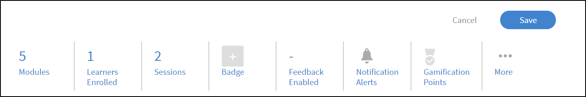
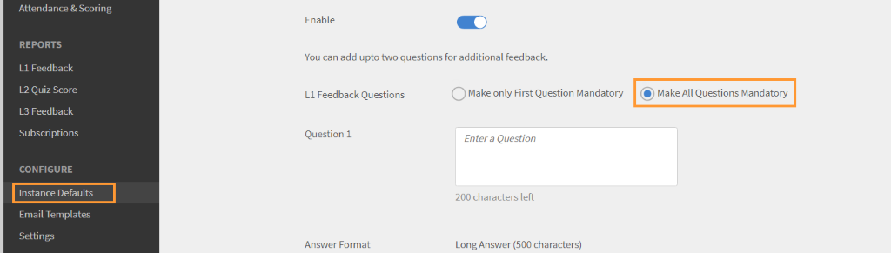
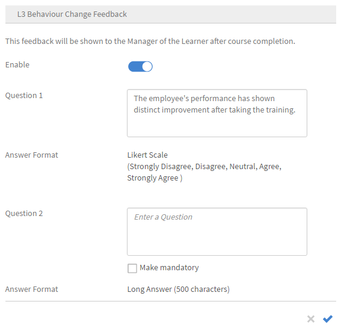
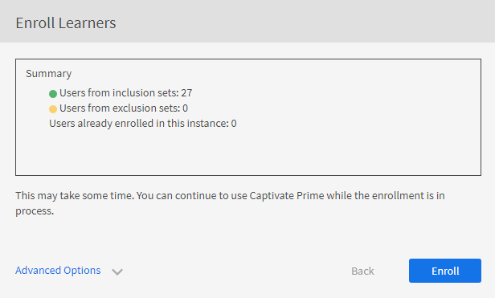

# Cursusinstanties en leerpaden maken

Dit document bestaat uit Help om cursusmodules, instanties en cursussen voor de beheerdersrol te maken.

Auteurs maken cursussen. Studenten kunnen de cursussen volgen en beheerders kunnen de prestaties van de studenten volgen op basis van gevolgde cursussen.

## Overzicht {#overview}

Auteurs maken cursussen. Studenten kunnen de cursussen dan volgen en beheerders kunnen de prestaties van de studenten volgen op basis van gevolgde cursussen. Beheerders kunnen de cursussen die door auteurs zijn gemaakt, zien en enkele activiteiten uitvoeren, zoals uitgelegd in deze sectie. Als beheerder kunt u unieke leerprogramma&#39;s maken met een vooraf gedefinieerde set cursussen voor studenten.

## Voorbeeld van een cursus maken {#createinstanceofacourse}

### Instanties beheren

>[!INFO]
>
>In deze training leert u hoe u instantiedetails en instantie-eigenschappen kunt bewerken.     

Schrijf naar <almacademy@adobe.com> als u de training niet kunt starten.

### Een instantie maken

Nadat een auteur een cursus heeft gemaakt, kunt u instanties van de cursus maken. Door Instanties van een cursus te maken, kunt u dezelfde cursus op verschillende tijdstippen aan uw cursisten aanbieden. Studenten kunnen een willekeurige instantie kiezen en zich inschrijven. U kunt elke instantie configureren met een eigen set badges, feedback en andere instellingen.

Als u een instantie wilt maken,

1. klikt u in de Administrator-webapp op **[!UICONTROL Cursussen]** aan de linkerkant.
1. Kies in de lijst met cursussen de gewenste cursus en klik op **[!UICONTROL Cursus weergeven]**.

   

   *Mening een cursus*

1. Klik op **[!UICONTROL Instanties]** aan de linkerkant van het venster om instanties te maken. Elke cursus heeft standaard een instantie. U kunt de standaardinstantie wijzigen of instanties toevoegen. U kunt deze cursusinstantie niet verwijderen.
1. Klik op **[!UICONTROL Nieuwe instantie toevoegen]** rechtsboven van de cursusinformatie om een instantie te maken. Er wordt een nieuwe instantie van de cursus weergegeven.
1. Voer de eigenschappen van de instantie in:

   * Op het **[!UICONTROL gebied van de Naam van de Instantie]**, ga de naam van de instantie in u met de cursus wilt associëren. Zorg ervoor dat u een unieke naam voor de instantie gebruikt.
   * Geef de voltooiingsdeadline voor de instantie op. Studenten moeten hun cursus vóór deze datum voltooien.
   * Klik **[!UICONTROL tonen Meer Opties]** om andere deadline opties te tonen.
   * **[!UICONTROL Deadline van de Inschrijving ]:** dit is de datum waardoor een student naar verwachting in een het leren voorwerp in het geval van zelf-inschrijving moet inschrijven.
   * **[!UICONTROL Deadline van de Uitschrijving ]:** u kunt verkiezen om uitschrijving door student zelf te beperken door een uitschrijvingsdeadline te hebben.
   * **[!UICONTROL Tijdzone ]:** Onderzoek en selecteer dan de **[!UICONTROL Tijdzone]** van dropdown.

   Een beheerder kan besluiten om voltooiingsdeadlines voor een leerprogramma in te stellen afhankelijk van vereisten. Het is echter raadzaam er een te hebben voor klassikale/virtuele klassikale trainingen.

   

   *Vastgestelde voltooiingsdeadline*

### Eigenschappen van de instantie weergeven {#viewpropertiesoftheinstance}

*eigenschappen van de Mening van de instantie*

1. **Modules:** Het aantal modules dat door de auteur van de cursus is gemaakt
1. **Ingeschreven studenten**: Het aantal studenten dat door de beheerder voor de cursus is ingeschreven.
1. **Sessies:** Het aantal virtuele klassikale en klassikale modules in de cursus.
1. **Feedback ingeschakeld:** Geeft aan of L1-, L2- en L3-feedback is ingeschakeld voor deze cursus.

>[!NOTE]
>
>De beheerder annuleert de sessies door naar Instanties > Sessies te gaan en Sessie annuleren te selecteren.

### Instantie archiveren {#retireaninstance}

Voer de onderstaande stappen uit om een instantie te archiveren:

1. Klik op de instantie, klik op het vervolgkeuzemenu en kies de optie **[!UICONTROL Instantie archiveren]**.

   

   *Retire een instantie*

1. Klik op het tabblad **[!UICONTROL Gearchiveerd]** op de pagina Instanties om naar alle gearchiveerde instanties te zoeken.

### Instantie herstellen {#restoreaninstance}

Voer de volgende stappen uit om een gearchiveerde instantie te herstellen naar een actieve status:

1. Klik op de instantie, klik op het vervolgkeuzemenu en kies de optie **[!UICONTROL Instantie opnieuw openen]**.

   

   *herstel een instantie*

1. De instantie wordt nu hersteld naar een actieve modus.

### Instantie verwijderen

Beheerders kunnen de instantie schrappen gebruikend **schrapt deze instantie** optie onmiddellijk na de verwezenlijking. U kunt geen instanties verwijderen als er een bijbehorende sessie is of als er studenten voor zijn ingeschreven.

*schrap een instantie*

>[!NOTE]
>
>U kunt de standaardinstantie niet verwijderen.

### E-mails op instantieniveau verzenden

E-mails op instantieniveau verzenden naar ingeschreven studenten:

1. Op de **[!UICONTROL pagina van Instanties]**, selecteer de opties op om het even welke instantie, en klik dan **[!UICONTROL E-mail Ingeschreven Studenten]**.

*E-mail studenten ingeschreven in de instantie*

1. Voor het **[!UICONTROL Create de dialoog van de Aankondiging]**, selecteer Type als E-mail. Geef het onderwerp op, typ het bericht en klik op **[!UICONTROL Opslaan]**. De training wordt automatisch geselecteerd.

   

   *Creeer aankondiging als e-mail*

1. Nadat u op **[!UICONTROL Opslaan]** hebt geklikt, ziet u een bevestigingsbericht voor het maken van de aankondiging. Als u de aankondiging wilt publiceren, klikt u op **[!UICONTROL Nu publiceren]**.

    wordt gecreeerd

## Studenten inschrijven voor cursussen

In deze training leert u studenten inschrijven, uitschrijven en opnieuw inschrijven.

Schrijf naar <almacademy@adobe.com> als u de training niet kunt starten.

### Studenten inschrijven in verschillende instanties

1. Selecteer een cursus in de lijst met cursussen.
1. Selecteer **[!UICONTROL Studenten]** in het linkerdeelvenster.
1. Selecteer **[!UICONTROL Inschrijven]**.

    in

   *Publish de cursus*

1. In het dialoogvenster [!UICONTROL **Studenten inschrijven**] kunt u:

   * Selecteer een instantie om een student in te schrijven in het vervolgkeuzemenu Instantie selecteren.
   * Selecteer de gebruiker of gebruikersgroepen of beide in het veld Inclusief studenten.
   * Selecteer in het veld Studenten uitsluiten de studenten die u van de instantie wilt uitsluiten.
   * Selecteer onder aan het dialoogvenster Ja als u een of meer studenten voor de geselecteerde instantie wilt inschrijven.

1. Selecteer **[!UICONTROL Doorgaan]**.

   

   *ga aan het inschrijven van studenten*

### Inschrijvingsrapport van een instantie weergeven

1. Selecteer een cursus in de lijst met cursussen.
1. Selecteer **[!UICONTROL Studenten]** in het linkerdeelvenster.
1. Selecteer **[!UICONTROL Acties]** > **[!UICONTROL Uitvoer]**.

Het Excel-bestand bevat werkbladen voor elke instantie. Een werkblad bestaat uit de volgende velden:

* Studenten
* E-mail
* Unieke ID van gebruiker
* Cursusnaam
* Unieke ID van LO
* Status
* Selectiecriteria
* Inschrijvingsdatum / Uitschrijvingsdatum (tijdzone UTC)
* Voltooiingsdatum (tijdzone UTC)
* Datum van de deadline (tijdzone UTC)
* Datum gestart (tijdzone UTC)
* Quizscore
* Naam van manager
* Adres
* userState
* Deskundigheidsgebied
* Opmerkingen
* Aantal bezoeken
* Bezoekdatums
* Tijdstempels (UTC-tijdzone)
* Tijd besteed (min)

>[!NOTE]
>
>Als u meerdere inschrijvingen inschakelt, worden er meerdere rijen toegevoegd aan het Studenttranscriptrapport voor elke cursus (één rij voor elke instantie).
>
>Als u een automatiseringsinstelling hebt ingesteld die slechts één rij per cursus verwacht, moet u de vereiste aanpassingen in de rapportautomatisering aanbrengen voordat u de functie voor meervoudige inschrijving inschakelt.

### Studenten voor een cursus beheren {#managelearnerslistforacourse}

1. Klik op de naam van de cursus op de cursusminiatuur.
1. Van de linkerruit, klik **[!UICONTROL Studenten]**.

*selecteer studenten in een cursus*

Op de pagina Studenten kunt u de volgende acties uitvoeren:

* Selecteer de student u wilt verwijderen, en klik [!UICONTROL **Acties**] > [!UICONTROL **verwijderen**].
* Selecteer de Student van wie aanwezigheid u wilt merken, en klik [!UICONTROL **Acties**] > [!UICONTROL **Voltooiing van het Teken**].

Om studenten toe te staan om een module terug te stellen en de module opnieuw te verbruiken, klik [!UICONTROL **Terugstellen**]. Klik op Ja in het pop-upvenster om de actie te bevestigen. Modules die zijn voltooid, kunnen niet opnieuw worden ingesteld. Alleen mislukte of onvolledige modules kunnen opnieuw worden ingesteld.

U kunt de lijst met studenten ook naar Excel-blad exporteren. Om de studentenlijst uit te voeren, klik [!UICONTROL **Acties**] > [!UICONTROL **Uitvoer**].

>[!NOTE]
>
>Als een cursus meerdere instanties heeft, wordt de lijst met studenten in Excel op elk tabblad afzonderlijk weergegeven. In de lijst met studenten staan naam, status en selectiecriteria van de student. De status van studenten kan **niet zijn begonnen**, of **lopend**, of **Voltooid**.

### Studenten exporteren met de status In afwachting van goedkeuring

Een beheerder, manager of aangepaste beheerder kan gegevens van studenten exporteren die de status In afwachting van goedkeuring voor inschrijving hebben. U kunt de gegevens exporteren via het tabblad **Cursus > Student** en op de vervolgkeuzelijst Actie klikken.

De optie is aanwezig als er geen student is ingeschreven of als een student niet in afwachting van goedkeuring is voor de door de manager goedgekeurde cursus. Er wordt dan een leeg rapport gegenereerd. U kunt ook exporteren wanneer studenten zich in de status In afwachting van goedkeuring, Ingeschreven, In afwachting en Uitgeschreven bevinden.

Het rapport bevat gegevens van actieve, verwijderde en geblokkeerde gebruikers als ze in afwachting van goedkeuring zijn. Het rapport bevat ook gegevens van interne en externe gebruikers die zich in de goedkeuringsstatus bevinden.

Als een student die eerder de status In afwachting van goedkeuring had, zich uitschrijft, zal zijn/haar record niet aanwezig zijn in het rapport. Ook als een student die eerder de status In afwachting van goedkeuring had, is ingeschreven voor de cursus door een beheerder/manager/aangepaste beheerder, dan is zijn/haar record aanwezig in het rapport.

## Wachtlijst

In de sectie Wachtlijst kunnen studenten op basis van hun inschrijvingsvolgorde voor klassikale cursussen worden weergegeven wanneer de plaatsen beperkt zijn. Beheerders kunnen dit beheren door studenten op de wachtlijst te selecteren en plaatsen toe te wijzen die de oorspronkelijke limiet overschrijden. Nadat de beheerder een licentie heeft toegewezen, wordt de student onmiddellijk ingeschreven voor de cursus.

## Aanwezigheid van studenten exporteren {#attendance}

U kunt voor elk klaslokaal en elke VC-cursus de lijst met studenten downloaden die deze cursus hebben bijgewoond, voor elke instantie.

Klik op de pagina Cursusdetails in het rechterdeelvenster op **[!UICONTROL Aanwezigheid en scores]**.

Klik in de rechterbovenhoek van de pagina op de vervolgkeuzelijst **[!UICONTROL Acties]**. Klik vervolgens op de optie **[!UICONTROL Studentenlijst exporteren (PDF)]**.

*lijst van studenten van de Uitvoer als PDF*

In de PDF kunt u dezelfde set studenten bekijken als een docent.

Wanneer u de PDF downloadt, kunt u de tijdzone (UTC) zien die is gebruikt bij het maken van de cursus.

## L1- en L3-feedback toevoegen {#addl1andl3feedback}

U kunt L1- en L3-feedbackopties toevoegen terwijl u de cursussen maakt:

1. Klik op Cursussen in het linkerdeelvenster nadat u zich als Administrator hebt aangemeld. De lijst van alle cursussen verschijnt rechts op de pagina.
1. Klik op de cursustegel waarvoor u L1- of L3-feedback wilt toevoegen.
1. Klik op standaardinstantie in het linkerdeelvenster.
1. Klik op de cirkel op de wisselknop naast L1- of L3-feedback om deze in te schakelen.
1. Voeg de L3-feedbackvraag in het tekstgebied onder L3-vraag toe.

### Verplichte L1-feedback {#mandatory-l1-feedback}

In L1-feedback kunt u alle vragen of de eerste vraag verplicht stellen.

*maak alle vragen of de eerste vraag verplicht in L1 terugkoppelen*

Nu kunt u de vragen maken, die nu verplicht worden.

*creeer de vragen*

Als de twee verplichte vragen om een bepaalde reden geen tekst hebben, worden de vragen niet weergegeven in het feedbackformulier.

>[!NOTE]
>
>Het is niet voldoende dat u deze instellingen inschakelt in de leerprogrammainstantie. U moet deze instellingen ook op cursusinstantieniveau inschakelen voor elke cursus in het leerprogramma.

In de pagina van de Gebreken van de Instantie, als u **[!UICONTROL toelaat maak Alle Vragen Verplicht]**, dan zullen alle nieuwe die instanties daarna worden gecreeerd deze montages erven.

*Bekijk de pagina van de Gebreken van de Instantie*

### L1-feedback op cursusniveau {#l1-feedback-course-level}

In eerdere versies van Learning Manager kon een beheerder L1-feedback voor het leerprogramma inschakelen.

In deze release van Learning Manager kan de beheerder L1-feedback sturen voor alle cursussen die deel uitmaken van het leerprogramma. De beheerder moet ervoor zorgen dat L1-feedback is ingeschakeld voor alle cursussen op cursusinstantieniveau.

1. Om L1 terug voor elke cursus toe te laten, in Admin app, klik **[!UICONTROL Leerprogramma&#39;s]** > **[!UICONTROL het Leren Programma van de Mening]**.

1. Klik **[!UICONTROL Instanties]** > **[!UICONTROL L1 toegelaten Terugkoppeling]**.

1. Laat de optie **[!UICONTROL toe toelaten voor Elke Cursus]**.

   

   *laat cursusfeedback* toe

   Alleen als u deze schakelknop op het niveau van het leerprogramma inschakelt, wordt de L1-feedback voor de cursussen in dit programma niet geactiveerd. Als u L1-feedback wilt inschakelen, gaat u naar elke cursus in het leerprogramma en schakelt u de L1-feedbackschakelaar in.

   

   *laat L1 terugkoppelen voor elke cursus* toe

   Als L1-feedback voor alle cursussen is ingeschakeld, maar in de leerprogrammainstantie is uitgeschakeld, wordt de L1-feedback niet geactiveerd voor de cursussen.

### Taalspecifieke quizrapporten

Quizrapporten helpen bij het evalueren van de prestaties van een student na voltooiing van een leerprogramma of cursus.

Learning Manager vergemakkelijkt momenteel het leren in 13 interfacetalen en 32 inhoudstalen. Hoewel deze optie gebruiksvriendelijk is en gemak biedt bij het ondersteunen van onze studenten wereldwijd, is het voor beheerders geen eenvoudige taak om rapporten op te halen over de pogingen die in verschillende landen zijn gedaan.

Quizrapporten geven gegevens in verschillende talen weer als de cursus in meerdere talen wordt aangeboden. Tot nu toe werden in rapporten die zijn gegenereerd door de beheerder onder elkaar reacties weergegeven, ongeacht de taal waarin de quiz is uitgevoerd. **bijvoorbeeld**, als een gebruiker een quiz in het Nederlands heeft genomen, zal Admin slechts die quizrapporten kunnen bekijken die door gebruikers in het Nederlands tegelijkertijd worden geprobeerd. De beheerder die Engels als interfacetaal heeft geselecteerd, kon geen rapporten voor alle gebruikers tegelijkertijd bekijken, ongeacht de taal waarin pogingen werden gedaan om de quiz te doen.

Dit is nu verholpen omdat de beheerder nu alle rapporten in de respectievelijke taal die de student heeft geprobeerd in één keer kan bekijken ongeacht de gekozen taalinstelling. De geprobeerde quiz wordt in verschillende talen toegevoegd als extra kolommen in het quizrapport.

### L1-feedback op accountniveau inschakelen {#l1-feedback-account-level}

*laat L1 terugkoppelen op accountniveau toe*

Een beheerder kan L1-feedback inschakelen voor nieuwe cursussen en leerprogramma&#39;s door deze instelling op accountniveau in te schakelen. Deze instelling heeft echter geen invloed op de bestaande cursussen en leerprogramma&#39;s

Indien ingeschakeld, wordt bij alle nieuwe trainingen en instanties de feedback standaard ingeschakeld. In het geval dat een auteur/beheerder de instantie opent, de instantie standaardinstellingen heeft en deze handmatig uitschakelt, dan wordt deze gehonoreerd.

Om L1 terug toe te laten, in Admin app, klik **[!UICONTROL Montages]** > **[!UICONTROL Terugkoppeling]**.

*Bekijk de pagina van de Montages van de Terugkoppeling*

Klik **[!UICONTROL uitgeven]** op de hoger-juiste hoek en knevel de optie om L1 terug toe te laten terugkoppelen.

Wanneer een auteur een cursus, op de pagina van de Instantie van Admin app creeert, **[!UICONTROL L1 terugkoppelt]** automatisch voor de nieuwe cursus wordt toegelaten.

<!---->

U kunt L1 ook onbruikbaar maken terugkoppelt door **[!UICONTROL in en uit te schakelen toelaten]** optie, zoals hieronder getoond:

*laat of maak L1 terug* onbruikbaar terug

### Beschrijvende vragen toevoegen voor L1- en L3-feedback {#descriptive}

Als onderdeel van de november-release van Learning Manager is er nu een optie om beschrijvende vragen toe te voegen. Beheerders kunnen deze vragen aan studenten toevoegen. Deze is in aanvulling op de standaard vragenreeks van Learning Manager. U kunt deze desgewenst ook verplicht maken door de optie onder de vraag te kiezen.

U kunt twee beschrijvende vragen toevoegen voor L1-feedback en één vraag voor L3-feedback.

Nadat u L1 feedback hebt ingeschakeld, ziet u de opties zoals weergegeven in de volgende afbeelding.

*voeg beschrijvende vragen voor L1 toe en L3 terugkoppelen*

Als de vragenlijst onmiddellijk na afloop van de cursus moet verschijnen, kiest u de bijpassende optie.

Hieronder vindt u ter referentie een voorbeeld van de L1-vragenlijst. Studenten kunnen de vragenlijst in de onderstaande indeling bekijken. Test-1 en Test-2 zijn de beschrijvende vragen.

*een voorbeeldcursus terugkoppelt vragen*

Nadat u L3-feedback hebt ingeschakeld, kunt u de opties bekijken zoals weergegeven in de onderstaande afbeelding:

*laat L3 terugkoppelen* toe

Vraag 2 is de beschrijvende vraag voor L3-feedback. U kunt deze verplicht maken door op de bijpassende optie onder de vraag te klikken.

Hieronder vindt u ter referentie een voorbeeld van de L3-vragenlijst. Studenten kunnen de vragenlijst in de onderstaande indeling bekijken.

*mening L3 terugkoppelt output*

### Vragenlijst voor L1- en L3-feedback instellen {#setupl1andl3feedbackquestionnaire}

U kunt de vragenlijst voor L1- en L3-feedback instellen evenals herinneringen op accountniveau.

1. Klik **[!UICONTROL Montages]** en dan **[!UICONTROL Terugkoppeling]** op de linkerruit nadat u login als Beheerder.\
   De de montagespagina van de terugkoppeling verschijnt met twee lusjes: **[!UICONTROL L1 Terugkoppeling]** en **[!UICONTROL L3 Terugkoppeling]**.\
   ]**lusje van de Terugkoppeling 0} L1 bestaat uit een lijst van gebrek**[!UICONTROL  L1 terugkoppelt ]**vragenlijst voor klassenruimte en zelf-afgepaste cursussen samen met herinneringsmontages.**[!UICONTROL  In **[!UICONTROL L3 Terugkoppeling]** tabel, kunt u L3 terugkoppelen standaardverklaring en herinneringsmontages bekijken.

1. Klik op Bewerken rechtsboven op de pagina om de bestaande vragenlijst aan te passen.\
   In **[!UICONTROL L1 terugkoppeling]** tabel, kunt u elke vraag toelaten/onbruikbaar maken door ja/neen knevelknoop te klikken.\
   In **[!UICONTROL L3 Terugkoppeling]** tabel, kunt u het gebrek wijzigen terugkoppelt verklaring.\
   Klik **[!UICONTROL voeg Nieuwe Herinnering]** bij de bodem van de pagina toe en kies wanneer om de herinneringen te verzenden.

1. Klik **[!UICONTROL sparen]** bij de hoger-juiste hoek van de pagina.

In L1-feedback ziet u twee sets vragenlijsten met een standaardvraag. De eerste set vragenlijsten heeft betrekking op cursussen op eigen tempo die ook kunnen worden gebruikt voor cursussen die op activiteiten zijn gebaseerd. Tweede set vragenlijsten kan worden gebruikt voor cursussen van het type klaslokaal en virtueel klaslokaal.

## L1- en L3-feedback weergeven {#viewl1andl3feedback}

U kunt de L1-feedback van studenten voor een cursus en de L3-feedback van de managers voor studenten weergeven.

1. Klik op een willekeurige tegel in de lijst Cursussen.
1. Klik op L1-feedback of L3-feedback in het linkerdeelvenster om de ontvangen feedback te bekijken.
1. Selecteer een instantie in de vervolgkeuzelijst om de feedback voor die specifieke instantie te bekijken.

## Discussieboard

Met de functie Discussieboard kunnen studenten de cursusdiscussies bekijken. Als beheerder kunt u opmerkingen naar wens verwijderen. Beheerders kunnen deze optie inschakelen onder cursusinstellingen.

## Cursusmoderatie {#coursemoderation}

Telkens wanneer een auteur modules toevoegt, bijwerkt of verwijdert en een cursus opnieuw publiceert, ontvangen alle beheerders hierover een melding. Als beheerder kunt u vervolgens de wijzigingen bekijken, de oude en nieuwe inhoud vergelijken door op de link te klikken, en de wijzigingen goedkeuren of afwijzen.

Om de Moderatie van de Cursus toe te laten, klik **[!UICONTROL Montages]** > **[!UICONTROL Algemeen]**. Selecteer het vakje **[!UICONTROL Cursusmoderatie]** om deze functie in te schakelen.

*laat cursusmoderatie* toe

Klik op de melding om te zien wat de auteur in de cursus heeft gewijzigd. Vervolgens moet u de aangebrachte wijzigingen goedkeuren of afwijzen. Als u deze goedkeurt, wordt de cursus opnieuw gepubliceerd. Als u de updates afwijst, wordt de vorige versie van de cursus behouden. In beide gevallen wordt de auteur een melding gestuurd.

*de verzoeken van de auteur om cursusupdates*

Als meerdere auteurs dezelfde cursus bijwerken, wordt de laatste of de laatst uitgevoerde wijziging in de beheerdersmelding weergegeven. U kunt dan de laatste wijzigingen goedkeuren of afwijzen.

## Gegevens controlelijst exporteren {#export-checklist-data}

Open in de lijst met cursussen een cursus waarin een controlelijst is opgenomen. U ziet een optie **[!UICONTROL Controlelijst]** in het linkerdeelvenster.

*de controlelijstgegevens van de Uitvoer*

Klik op de optie en voer op de cursuspagina het volgende uit:

1. Selecteer de instantie en de module.
1. Klik **[!UICONTROL Acties]** > **[!UICONTROL Uitvoer]**, en voer dan het rapport van de studentenchecklist uit.

Op de **[!UICONTROL pagina van de Controlelijst]**, kan een Docent het controlelijstrapport van de **[!UICONTROL drop-down lijst van Acties]** uitvoeren.

Het CSV-rapport bevat de volgende velden:

* Gebruikersnaam
* E-mailadres van gebruiker
* Naam en e-mailadres van manager
* Trainingsnaam
* Trainingsinstantie
* Naam en e-mailadres van docent
* Ingediend op
* Evaluatiestatus
* Vragen-met werkelijke tekst
* Gebruikersstatus
* Profiel
* Actief veld (actieve velden)

Wanneer u een rapport downloadt nadat u een statusfilter hebt geselecteerd, bevat het gedownloade rapport Studenttranscript de studentgegevens op basis van het toegepaste statusfilter. Dit toegevoegde filter wordt ook weergegeven voor een aangepaste beheerder en manager als zij op het punt staan om een Studenttranscript te genereren.

## Cursussen weergeven {#viewingcourses}

Als beheerder kunt u een lijst met alle beschikbare cursussen weergeven.   Klik **[!UICONTROL Cursussen]** op de linkerruit om de lijst van cursussen met onderzoek en filteropties te bekijken. U kunt ook het effectiviteitspercentage voor elke cursus bekijken op de cursusminiaturen.

>[!NOTE]
>
>U kunt een cursus archiveren nadat deze door studenten is gevolgd of wanneer u een bepaalde cursus na publicatie wilt uitstellen. U kunt een cursus alleen archiveren wanneer deze de status Gepubliceerd heeft. De lijst van alle gearchiveerde cursussen kan worden bekeken door het **[!UICONTROL Gearchiveerde]** lusje te klikken.

## Quizscores weergeven {#viewquizscores}

1. Klik op de naam van de cursus op de cursusminiatuur.
1. Klik op Quizscore in het linkerdeelvenster.

U kunt de quizscores van een bepaalde cursus bekijken op basis van de gebruikersnaam of op basis van elke vraag. Kies het bijbehorende tabblad Op gebruiker of Op vraag.

Kies het type instantie uit de vervolgkeuzelijst om de scores weer te geven op basis van elke instantie van de cursus.

## Standaardinstantie

Beheerders kunnen standaardBadges, gamificationmontages en herinneringen in **[!UICONTROL Standaardinstantie]** pagina plaatsen. Om de standaardinstantiemontages te wijzigen, uitgezocht **[!UICONTROL StandaardInstantie]** > **[!UICONTROL geef]** uit.

* **[!UICONTROL Badge]**: Selecteer de standaardbadges van het dropdown menu.
* **[!UICONTROL Gamification]**: Vorm gamificationmontages, met inbegrip van punten voor voltooiing, vroege voltooiing, en geschikte voltooiing. Beheerders kunnen instellingen op accountniveau selecteren of de gamificationpunten voor deze instantie aanpassen.
* **[!UICONTROL L1 Reactie Feedback]**: Laat vooraf bepaalde vragen voor student toe terugkoppelt op cursusvoltooiing, met opties om vragen verplicht te maken.
***[!UICONTROL Feedback voor wijziging van L3-gedrag]**: feedbackvragen inschakelen voor de manager van de student na voltooiing van de cursus.
***[!UICONTROL Instellingen voor herinneringen]**: stel herinneringen voor deadlines in en beheer deze, met opties voor escalatie.

### Escalatieniveau instellen {#escalation}

Als een beheerder de e-mailmeldingen wil verzenden, moet deze er expliciet voor kiezen om te escaleren naar:

* Manager
* Manager en Niveau manager overslaan

*plaats escalatieniveau*

## Voorbeeld van cursussen bekijken {#previewcourses}

De beheerder kan cursussen voorproef door de **[!UICONTROL Voorproef als student]** optie te klikken terwijl het bekijken van de cursusmodules.

1. Klik **[!UICONTROL Cursussen]** op de linkerruit nadat u login als beheerder.
1. Klik op een willekeurige cursustegel in de lijst met cursussen op de pagina.
1. Klik op Voorbeeld bekijken als student in het linkerdeelvenster. Klik vervolgens op de naam van de module op de pagina om een voorbeeld van de cursusmodule in de speler weer te geven.

## Cursuseffectiviteit {#courseeffectiveness}

De effectiviteit van de cursus wordt geëvalueerd om inzicht te krijgen in het nut van de cursus voor de student. Het is een combinatie van de resultaten van feedback van de student over de cursusinhoud, de quizresultaten van de cursus voor een student en feedback van de manager die een student evalueert op basis van de verworven kennis.

Beheerders kunnen de effectiviteitsscore van de cursus op de cursusminiaturen zien, zoals weergegeven op de onderstaande afbeelding. U ziet de score voor deze cursus als 100.

<!---->

De effectiviteitsscore van de cursus wordt bepaald aan de hand van de L1-, L2- en L3-feedbackwaarden. Klik op de waarde voor de effectiviteit van de cursus om deze uitgesplitst op feedback te bekijken. Er verschijnt een pop-up, zoals hieronder weergegeven.

*de cursusdoeltreffendheid van de mening voor L1, L2, en L3 terugkoppelen*

In dit voorbeeld heeft 1 van de 5 gebruikers alle drie de feedbacks ontvangen, vandaar dat de score 100/100 is. Deze tabel laat u zien dat als een van de drie feedbacks (L1, L2 en L3 ) niet wordt gegeven voor een cursus, dit een negatief effect heeft op de algehele effectiviteit. Klik op het omlaagwijzende pijltje in de rechterbenedenhoek van het pop-upvenster om te zien hoe de effectiviteit van de cursus wordt berekend.

*berekening van de cursuseffectiviteit*

Zoals te zien in het bovenstaande taartdiagram wordt er meer gewicht gegeven aan de L3-feedback van de manager.

## Zoeken naar cursussen en leerprogramma&#39;s {#searchingcoursesandlearningprograms}

Adobe Learning Manager maakt het u gemakkelijker om snel de gewenste cursussen of leerprogramma&#39;s te vinden. U kunt op twee manieren naar uw cursussen zoeken:

1. Met behulp van het zoekveld. Klik op het zoekpictogram in de rechterbovenhoek. Er verschijnt een zoekveld. Typ de naam van de cursus of eventuele trefwoorden die bij uw cursussen horen om uw cursussen/leerprogramma&#39;s te vinden. U kunt ook zoeken met vooraf gedefinieerde tags, zoals Captivate, C, Java en HTML. U kunt naar tags zoeken via het veld Zoeken, wat betekent dat de tags in het veld worden weergegeven terwijl u ze typt.
1. Door de lijst van cursussen/leerprogramma&#39;s met behulp van de filters te filteren. U kunt de cursussen filteren op status zoals Alle, Gepubliceerd, Concept en Gearchiveerd. In de modus Beheerders wordt het conceptfilter niet weergegeven.

U kunt zoeken op basis van competenties door op Competenties te klikken en ze te kiezen. Als beheerder kunt u de cursussen op vier manieren sorteren om de gewenste cursus beter te vinden. Klik op Sorteren op en kies alfabetische oplopende volgorde, alfabetische aflopende volgorde, datum waarop cursus is bijgewerkt of effectiviteit van cursussen.

<!---->

U kunt leerprogramma&#39;s op drie manieren sorteren: alfabetisch oplopend, alfabetisch aflopend en op basis van datum waarop deze is bijgewerkt.

## Studenten inschrijven {#enrollinglearners}

U kunt dezelfde stappen volgen om studenten in te schrijven voor cursussen, leerprogramma&#39;s en certificeringen. Managers kunnen ook studenten onder zich inschrijven via de volgende stappen.

Beheerder schrijft sommige studenten in voor verplichte cursussen volgens de vereisten van de organisatie:

1. Houd de muis boven gepubliceerde tegels van cursussen en klik op Studenten inschrijven.\
   U kunt ook op een gepubliceerde cursustegel klikken en op de studenten in het linkerdeelvenster klikken. Er verschijnt een pagina met een lijst van studenten. Klik op Inschrijven.\
   Het dialoogvenster Studenten inschrijven verschijnt.

1. Selecteer de instantie in de vervolgkeuzelijst Instantie. De vervolgkeuzelijst bevat alle instanties, inclusief actieve, gearchiveerde en verlopen instanties.

>[!NOTE]
>
>Admin kan om het even welke geregistreerde studenten van een cursus verwijderen door de drop-down pijl op de studentenpagina te klikken en door **[!UICONTROL Acties]** > **[!UICONTROL te klikken verwijdert]**.

*voeg commentaren toe terwijl het inschrijven van studenten*

*schrijf studenten* in

## Gebruikers

+++Inclusief studenten

Selecteer de gebruikersgroepen en individuele studenten (met behulp van e-mail-ID of naam) die u wilt opnemen. Voeg alle gebruikersgroepen toe in een doorsnede onder dezelfde set. Gebruik een nieuwe opnameset om een andere gebruikersgroep in unie toe te voegen.

+++

+++Studenten uitsluiten

Selecteer de gebruikersgroepen en individuele studenten (met behulp van e-mail-ID of naam) die u wilt uitsluiten. Voeg alle gebruikersgroepen toe in een doorsnede onder dezelfde set. Gebruik een nieuwe opnameset om een andere gebruikersgroep in unie toe te voegen.

+++

## E-mail-ID van gebruiker

+++E-mail-id

Kopieer en plak e-mail-ID&#39;s van studenten die u wilt inschrijven, gescheiden door puntkomma&#39;s, komma&#39;s of regeleindes. Gebruik de optie **[!UICONTROL E-mail-ID&#39;s valideren]** om de items te valideren. Alle ongeldige items worden rood gemarkeerd. Verwijder of corrigeer deze items en ga verder door op **[!UICONTROL Doorgaan]** te klikken.

*schrijf studenten* in

Het dialoogvenster Overzicht verschijnt met het aantal gebruikers uit de opnameset, de uitsluitingsset en de gebruikers die al voor de cursusinstantie zijn ingeschreven.

+++

### Opmerkingen toevoegen tijdens het inschrijven van studenten {#enroll-comments}

<!----->

Als beheerder of manager kunt u opmerkingen toevoegen terwijl u studenten voor een cursus inschrijft. U kunt aanvullende informatie geven over de groep gebruikers die zich inschrijven. Deze gegevens worden geëxporteerd in cursusrapporten.

De opmerking wordt **niet** getoond aan de student.

Wanneer een beheerder het cursusrapport van de student genereert, verschijnen alle opmerkingen, indien toegevoegd, in het rapport. Het dialoogvenster Overzicht verschijnt met het aantal gebruikers uit de opnameset, de uitsluitingsset en de gebruikers die al voor de cursusinstantie zijn ingeschreven.

Vouw in het dialoogvenster **[!UICONTROL Studenten inschrijven]** de optie **[!UICONTROL Geavanceerde opties]** uit. Op het **[!UICONTROL Extra gebied van de Commentaar]**, ga de vereiste commentaar in.

*voeg commentaren voor studenten toe*

## Naar ingeschreven gebruikers zoeken {#searchforusers}

Zoek naar ingeschreven gebruikers in de sectie Student van het leerobject met automatisch aangevulde zoeksuggesties. Met behulp van automatisch aangevulde zoeksuggesties, kunt u geleidelijk aan naar ingeschreven gebruikers zoeken op naam, e-mail-id en uuid.

*Analyse van het zoeken naar ingeschreven gebruikers*

Dit type zoekopdracht wordt ook wel typeahead zoeken, automatisch invullen, incrementeel zoeken, zoeken terwijl u typt, inline zoeken of onmiddellijke zoekfunctie genoemd.

Terwijl u een student of een gebruikersgroep in het zoekveld typt, worden een of meer overeenkomsten voor de zoekterm(en) gevonden en onmiddellijk weergegeven.

Dit is sneller en minder omslachtig dan meerdere zoekopdrachten achter elkaar uitvoeren.

Na een zoekopdracht worden studenten of gebruikersgroepen in alle instanties weergegeven. Voor elke student, toont de instantie waarin de student wordt ingeschreven in de **[!UICONTROL kolom van de Instantie]**.

*de onderzoeksresultaten van de Mening*

Met behulp van automatisch aangevulde zoeksuggesties kunt u:

* alle gebruikers die zijn ingeschreven weergeven, ongeacht instanties.
* alle gebruikersgroepen met één of meer ingeschreven gebruikers weergeven.

Na het uitvoeren van een zoekopdracht kunt u studenten niet op instanties filteren. De optie om een instantie te selecteren in de vervolgkeuzelijst **[!UICONTROL Instantie selecteren]** is uitgeschakeld.

Bovendien kunt u met de zoekresultaten een student of een gebruikersgroep kiezen en de volgende handelingen uitvoeren:

* Uitschrijven
* Voltooiing markeren
* Module opnieuw instellen

Tijdens het uitvoeren van een zoekopdracht is de optie Uitschrijven > Bulk in de vervolgkeuzelijst Acties uitgeschakeld voor de cursus/het leerprogramma.

## QR-code delen met studenten voor inschrijven, voltooien of beide {#shareqrcodewithlearnerstoenrollcompleteorboth}

Beheerders in Adobe Learning Manager kunnen de QR-codes met studenten delen zodat deze zich snel voor de cursus kunnen inschrijven. De drie verschillende QR-codes worden gebruikt om de &#39;inschrijving&#39;, &#39;voltooiing&#39; of &#39;inschrijving en voltooiing&#39; van een cursus te markeren.

Studenten kunnen gewoon de Adobe Learning Manager-apparaattoepassing gebruiken om de betreffende QR-code te scannen.

**Doe het volgende om de QR-code te downloaden**:

1. Klik **[!UICONTROL Cursussen]** van het Leren sectie in het linkernavigatievenster.
1. Selecteer een cursus > **[!UICONTROL cursus van de Mening]**.
1. Klik **[!UICONTROL Instanties]** > **[!UICONTROL Meer]** > **[!UICONTROL QR code]**.

   <!---->

1. Schakel de QR-code in en klik vervolgens op de downloadpictogrammen &#39;Inschrijven&#39;, &#39;Voltooien&#39; en &#39;Inschrijven en voltooien&#39; om een PDF te downloaden met de relevante QR-code. De admin kan de QR-code vervolgens met de studenten delen.

   

   *QR code van het Aandeel met parameters*

## Levenscyclus van cursus {#courselifecycle}

De levenscyclus van een cursus ziet er meestal als volgt uit:

**Ontwerp** - wanneer een auteur het creëren van een cursus voltooit en het bewaart. Op dit punt is de cursus nog niet beschikbaar voor studenten. U kunt een cursus op deze status verwijderen.

**Gepubliceerd** - wanneer een auteur voltooit het publiceren van een cursus. Studenten kunnen zich inschrijven voor een cursus met deze status.

**Gearchiveerd** - Na het publiceren van een cursus, kan een auteur het naar een gearchiveerde staat verplaatsen als hij niet de cursus in cursuscatalogus voor studenten wil verschijnen.  U kunt de cursus op dit punt opnieuw publiceren of verwijderen.

**Geschrapt** - een cursus onder geschrapte staat is wanneer het volledig uit de toepassing van Adobe Learning Manager wordt verwijderd. Auteurs kunnen alleen cursussen met conceptstatus verwijderen. U kunt cursussen ook uit gearchiveerde status verwijderen.

*Werkschema van een cursuslevenscyclus*

## Meldingsinstellingen {#notificationsettings}

Als beheerder kunt u de meldingsinstellingen aanpassen. Zie [Meldingen](user-notifications.md) voor meer informatie.

## Veelgestelde vragen {#frequentlyaskedquestions}

+++Module herstellen als beheerder?

Voor de pagina van Studenten voor een cursus, kies de student of de studenten of een groep, klik **[!UICONTROL Acties]** > **[!UICONTROL Modules van het Terugstellen]**.

*optie van de Mening om modules* terug te stellen

Nadat u op de optie hebt geklikt, wordt de status van modules van alle geselecteerde studenten opnieuw ingesteld. De modules die zijn voltooid, worden niet opnieuw ingesteld.

+++

+++Hoe voeg ik een cursus-URL toe zodat studenten rechtstreeks naar de cursus worden omgeleid?

Ga met de muis over een cursuskaart en klik op **[!UICONTROL URL kopiëren]**. Nadat u de URL hebt gekopieerd, hebben studenten rechtstreeks toegang tot de cursus met de URL.

+++

+++Een instantie opnieuw openen?

Als u een gearchiveerde instantie opnieuw wilt openen, klikt u op het vervolgkeuzemenu in de instantie en klikt u op **[!UICONTROL Instantie opnieuw openen]**.

+++
