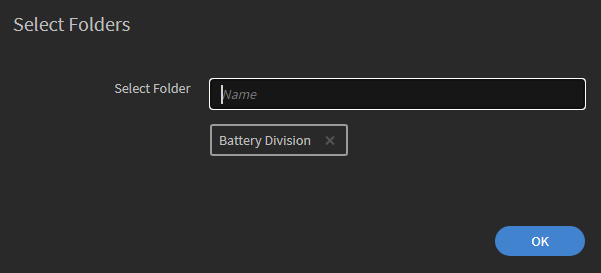
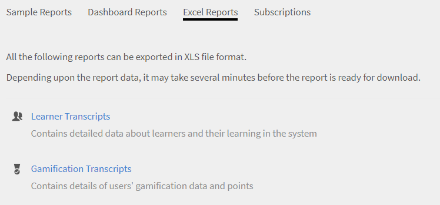

# Aangepaste rollen

Met deze functie kunt u aangepaste rollen definiëren en specifieke verantwoordelijkheden toewijzen aan een gebruikersset. Met deze functie kunt u verantwoordelijkheden toewijzen die buiten de bestaande rol van de persoon vallen.

U kunt een aangepaste rol maken om auteursmogelijkheden te bieden die beperkt zijn tot een bepaalde catalogus. U kunt ook een rol maken voor rapportagebeheer. Dergelijke rollen kunnen dan worden toegewezen aan personen die geacht worden deze specifieke verantwoordelijkheden op zich te nemen.

Beheerders kunnen aangepaste beheerders- en aangepaste auteursrollen maken met op maat gemaakte machtigingen voor elke rol. Hieronder ziet u een overzicht van de machtigingen die aan elke rol zijn gekoppeld:

**Toestemmingen van de Rol van de Auteur van 0}**

Aangepaste auteurs kunnen de volgende taken uitvoeren:

* Open de inhoudsbibliotheek om kerninhoud toe te voegen, te bewerken of te verwijderen.
* Maken, bewerken en verwijderen:
   * Cursussen
   * Taakhulpen
   * Certificeringen
   * Leerpaden
   * Leerplannen

Beheerders en auteurs, inclusief aangepaste beheerders en aangepaste auteurs, kunnen leerobjecten (LO&#39;s) delen met extern gedeelde catalogi. Beheerders en auteurs moeten kunnen zoeken naar extern gedeelde catalogi tijdens het maken van leerobjecten (LO&#39;s).

**de Toestemmingen van de Rol Admin van de Douane**

De aangepaste beheerdersrol repliceert een reeks beheerdersverantwoordelijkheden, waaronder toegang tot bevoegdheden op accountniveau. Aangepaste beheerders krijgen machtigingen voor het beheer van belangrijke functies met betrekking tot leeractiviteiten, zoals:

* Leerplannen
* Catalogi
* Rapporten
* Tags

Bovendien kunnen aangepaste beheerders:

* Beheer cursussen en taakhulpen, waaronder gebruikers inschrijven en verwijderen.
* Creëer, bewerk en verwijder certificeringen, leerpaden en leerplannen.
* Toegang tot rapportage- en inschrijvingsfuncties voor alle leerobjecten (LO&#39;s).

Beheerders kunnen nu door CSV gemaakte machtigingen bekijken in Adobe Learning Manager. Met dit filter filtert u aangepaste rollen op beheerder die is gemaakt en op beheerders die via een CSV zijn geïmporteerd. Nadat u een aangepaste rol hebt geselecteerd, kunt u de bijbehorende machtigingen zien.

_de douanerollen van de Filter_

## Een aangepaste rol maken {#create-role}

1. Meld u aan als beheerder. Open **[!UICONTROL Gebruikers]** > **[!UICONTROL Rol van de Douane]**.
2. Selecteer **[!UICONTROL creeer Rol]**. Het tabblad **[!UICONTROL Nieuwe rol maken]** wordt geopend.

   

   *creeer een douanerol*

3. Ga de naam in de **[!UICONTROL Naam van het gebied van de Rol]** in.
4. **[!UICONTROL de voorrechten van de Rekening]**: Deze voorrechten geven de roleigenaars toegang tot specifieke aspecten van de systeemconfiguratie en die op de volledige rekening handelen. Kies de toegangsrechten. De gebruiker krijgt volledige controle over de toegewezen rechten.

   Beheerders kunnen gedetailleerde machtigingen verlenen voor de sectie Gebruiker, waarin interne/externe gebruikers, gebruikersgroepen en geavanceerde gebruikers zijn opgenomen.

   >[!NOTE]
   >
   >   Bereik is niet van toepassing op deze rechten.

   

   *plaats het werkingsgebied*

5. **de voorrechten van de Eigenschap - de eigenschappen van de Kern**: Gebruikt om toegang tot specifieke eigenschappen voor het beheren van het leren activiteiten te verlenen. Met deze optie kan toestemming worden gegeven voor de volgende functies.

   Beheerders kunnen gedetailleerde machtigingen bieden, zoals alleen-lezen, machtigingen voor de catalogi maken, bewerken en verwijderen.

   * Catalogi
   * Rapporten
   * Tags

   

   *plaats werkingsgebied voor Catalogi, Rapporten, en Markeringen*

6. **de voorrechten van de Eigenschap - het Leren Objecten:** gebruik deze optie om toegang tot verwante eigenschappen te verlenen LOs. Beheerders kunnen gedetailleerde machtigingen bieden voor alle leerobjecten, inclusief cursussen, leerpaden, certificeringen en taakhulpen. Ze kunnen gebruikersmachtigingen toewijzen, zoals maken, bewerken, verwijderen of alleen-lezen toegang.

   * Certificeringen
   * Cursussen
   * Taakhulpen
   * Leerprogramma&#39;s

   U kunt ook specifieke besturingselementen voor de leerobjecten toekennen. De toestemming kan een van de volgende zijn:

   * Alleen-lezen
   * Creëer
   * Bewerken
   * Verwijderen
   * Inschrijving
   * Rapport

   U kunt de LO&#39;s ook volledig besturen.

   

   *Verleen specifieke toestemmingen*

7. **Reikwijdte voor eigenschapvoorrechten:** het werkingsgebied van de voorrechten van de Eigenschap die aan deze rol worden toegewezen kan tot een specifieke Groep van de Gebruiker of één of meerdere Catalogi worden beperkt.

   Catalogi: gebruik het keuzerondje om controle te geven over **[!UICONTROL Alle catalogi]** of gebruik de optie **[!UICONTROL Toegang instellen per catalogus]** om toegang te bieden tot specifieke catalogi. U kunt ook meerdere catalogi selecteren.

   Gebruikersgroepen: verleen toegang tot **[!UICONTROL Alle gebruikersgroepen]** of gebruik de optie **[!UICONTROL Toegang instellen per gebruikersgroep]** om toegang te verlenen tot specifieke gebruikersgroepen. Er kan slechts één enkele gebruikersgroep worden opgegeven.

   >[!NOTE]
   >
   >Als u Aankondiging, Gamification, E-mailsjablonen, Vaardigheden en Gebruikers onder Accountbevoegdheden hebt geselecteerd, wordt de toegang tot de gebruikersgroep standaard aan alle gebruikersgroepen verleend en is deze optie uitgeschakeld.

   Als u leerplannen hebt geselecteerd onder Accountbevoegdheden, wordt standaard toegang tot alle catalogi en gebruikersgroepen verstrekt en zijn deze opties onder Omvang uitgeschakeld.

   

   *bepaal werkingsgebied van voorrechten*

>[!NOTE]
>
>   In Learning Manager 27.6 kunt u een aangepaste rol voor meerdere catalogi instellen, waarbij aan elke catalogus verschillende machtigingen worden toegewezen.

Volg de onderstaande stappen om verschillende machtigingen aan de catalogi toe te wijzen:

1. Klik op de optie **[!UICONTROL Toegang instellen per catalogus]**.
1. Kies de catalogi om het machtigingenniveau voor elke catalogus zien. De machtigingen zijn als volgt:

   <table>
        <tbody>
        <tr>
          <td>
          
<b>Machtiging</b>
</td>
          <td>
          
<b>Beschrijving</b>
</td>
        </tr>
        <tr>
          <td>
          
Volledig beheer
</td>
          <td>
          
Geeft Volledig beheer over alle leerobjecten. Machtigingen zijn onder andere Toevoegen, Bewerken, Verwijderen, Lezen, Inschrijven en Rapporteren. 
</td>
        </tr>
        <tr>
          <td>
          
Rapport
</td>
          <td>
          
Geeft alleen toegang tot het tabblad Rapporten van het leerobject.
</td>
        </tr>
        <tr>
          <td>
          
Inschrijven
</td>
          <td>
          
Verleent machtigingen voor inschrijving voor het leerobject.
</td>
        </tr>
        <tr>
          <td>
          
Alleen lezen
</td>
          <td>
          
Verleent machtigingen waarmee leerobjecten in de catalogus alleen bekeken kunnen worden.
</td>
        </tr>
        </tbody>
      </table>

1. Schakel de machtigingen in of uit afhankelijk van uw vereisten.
1. Klik op **[!UICONTROL Opslaan]** om de wijzigingen op te slaan. Klik vervolgens op **[!UICONTROL Opslaan]** om de wijzigingen voor de aangepaste rol op te slaan.

Kijk bijvoorbeeld eens naar het volgende scenario.

De resulterende machtiging die een aangepaste gebruiker voor een leerobject zou hebben, is een doorsnede van de leerobject- en catalogusmachtiging.

Een aangepaste gebruiker heeft Volledige machtiging voor cursussen en enkel Alleen lezen-toegang voor catalogus A, maar Volledige machtiging voor catalogus B. Het resultaat is Alleen lezen-toegang voor de cursussen van catalogus A en Volledig beheer over de cursussen van catalogus B.

Een gebruiker met een aangepaste rol kan:

* alleen inhoud bekijken van de catalogi waartoe hij/zij toegang heeft.
* Toegang tot elk leerobject op basis van de machtigingen van de catalogus waar het leerobject deel van uitmaakt.

  Als beheerder kunt u:

* meer dan een catalogus voor een aangepaste rol kiezen.
* de machtigingen van een catalogus op elk moment wijzigen.
* de catalogi verwijderen uit een bereik waarvoor u niet langer machtigingen wilt verlenen.
* een impliciete Alleen lezen-machtiging voor een catalogus verlenen, wanneer u machtigingen voor de catalogus verleent.

  De onderstaande tabel illustreert hoe de machtigingen worden verleend.

  <table>
    <tbody>
     <tr>
      <td>
       
<strong> </strong>
</td>
      <td>
       
<strong>Machtiging op catalogusniveau</strong>
</td>
     </tr>
     <tr>
      <td>
       
<strong>Machtiging op leerobjectniveau</strong>

       
<strong>(Bijv.: Cursussen)</strong>
</td>
      <td>
       
Volledig beheer
</td>
      <td>
       
Inschrijven
</td>
      <td>
       
Rapport
</td>
      <td>
       
Alleen lezen
</td>
     </tr>
     <tr>
      <td>
       
Volledig beheer
</td>
      <td>
       
Volledig beheer
</td>
      <td>
       
Inschrijven
</td>
      <td>
       
Rapport
</td>
      <td>
       
Alleen lezen
</td>
     </tr>
     <tr>
      <td>
       
Inschrijven
</td>
      <td>
       
Inschrijven
</td>
      <td>
       
Inschrijven
</td>
      <td>
       
Alleen lezen
</td>
      <td>
       
Alleen lezen
</td>
     </tr>
     <tr>
      <td>
       
Bewerken en verwijderen
</td>
      <td>
       
Bewerken en verwijderen
</td>
      <td>
       
Alleen lezen
</td>
      <td>
       
Alleen lezen
</td>
      <td>
       
Alleen lezen
</td>
     </tr>
     <tr>
      <td>
       
Rapport
</td>
      <td>
       
Rapport
</td>
      <td>
       
Alleen lezen
</td>
      <td>
       
Rapport
</td>
      <td>
       
Alleen lezen
</td>
     </tr>
    </tbody>
   </table>

1. **Gebruikers:** gebruik deze optie om te bepalen welke gebruikers deze rol toegewezen krijgen. U kunt een of meer gebruikers kiezen met behulp van het zoekvak.

   **voeg gebruikers aan de upload CSV van de douanerol toe:** om gebruikers via geüploade CSV toe te voegen, voeg een kolom CustomRole aan het .csv dossier toe dat de Beheerder gebruikte om gebruikers in te voeren. Voer de rol van de gebruiker onder de kolom CustomRole in voor de gebruikers aan wie u een aangepaste rol wilt toewijzen. Om het Csv- dossier te uploaden, klik **[!UICONTROL toevoegen > upload een CSV]**.

   * U kunt geen gebruikersgroepen zoeken.
   * U kunt geen gebruikers zoeken die al een beheerderrol toegewezen gekregen hebben.
   * Het toewijzen van een nieuwe aangepaste rol aan een gebruiker heeft voorrang op de vorige aangepaste rol van de gebruiker.

   <!---->

   * Een aangepaste beheerder met de machtiging Instellingen kan het schema configureren voor synchronisatie of synchronisatie van gebruikers vanuit de gegevensbron, zelfs als deze geen toestemming hebben voor de gebruikersentiteit.
   * Als een aangepaste beheerder toestemming heeft voor de gebruikersentiteit, kan hij of zij zichzelf de rol van beheerder toewijzen en een standaardbeheerder worden.

## Rapport voor aangepaste rol

Beheerders kunnen een CSV-rapport downloaden van alle aangepaste rollen en hun machtigingen. Het rapport toont hoe elke rol is gemaakt, door een beheerder of via een CSV-bestand, en geeft een overzicht van de toegang die aan elke rol is verleend.

Ga als volgt te werk om het rapport te downloaden:

1. Login als **[!UICONTROL Admin]**.
2. Selecteer **[!UICONTROL Gebruikers]** > **[!UICONTROL de Rollen van de Douane]**.
3. Selecteer de **[!UICONTROL optie van de Download]** om het CSV- rapport te downloaden.

_Rapport van de Download van douanerollen_

Het rapport heeft twee CSV-bestanden: role.csv en user_role.csv. Het bestand role.csv bevat:

* Aangepaste rol
* Gebruikers-id&#39;s
* Bron van ontwerp.

Het bestand user_role.csv bevat de velden, de aangepaste rol, de aanmaakbron en gedetailleerde informatie voor catalogi, gebruikers, cursussen, leerpaden en meer.

## Audittrail voor aangepaste rollen

Beheerders kunnen het controlerapport voor de aangepaste rol downloaden om alle wijzigingen te volgen die zijn aangebracht in de aangepaste rollen, zoals het maken, wijzigen en verwijderen van aangepaste rollen en de bijbehorende functietoegang.

Verwijs dit artikel [ spoor van de Controle voor douanerollen ](/help/migrated/administrators/feature-summary/reports.md#audit-trail-for-custom-roles) voor meer informatie.

## Toegang tot mappen beperken voor aangepaste auteurs {#folder-custom-author}

Leerbeheer ondersteunt al de mogelijkheid om toegang te verlenen tot de inhoudsbibliotheek met behulp van aangepaste rollen. Alle aangepaste auteurs die al toegang hebben tot de inhoudsbibliotheek, blijven toegang tot alle inhoudsbestanden hebben, zelfs nadat de inhoudsmappen zijn geconfigureerd. Zo kunnen ze verder met hun bestaand gedrag. Beheerders hoeven geen wijzigingen aan te brengen voor het geval ze het huidige gedrag willen blijven gebruiken.

Als beheerders de toegang tot deze aangepaste auteurs willen beperken, moeten ze de bestaande aangepaste rol bewerken en configureren door alleen toegang te bieden tot specifieke inhoudsmappen.

*Toegang tot mappen beperken voor aangepaste auteurs*

Terwijl u een aangepaste auteur aanmaakt, kunt u nu inhoudsmappen aan de auteur toewijzen. Kies de optie **Geselecteerde Omslagen**.

Nadat u op de optie hebt geklikt, verschijnt een nieuw dialoogvenster waarin u de mappen aan de aangepaste auteur kunt toewijzen.

*selecteer de omslagen voor de douaneauteur*

Kies de omslagen en klik **[!UICONTROL OK]**.

## Dashboard met overzicht van leermateriaal voor aangepaste beheerder {#custom-admin-dashboard}

Aangepaste beheerders kunnen dezelfde weergave zien als de beheerder. Een aangepaste beheerder kan gegevens buiten dit bereik plaatsen. Dit is alleen van toepassing als de aangepaste beheerder een volledig bereik heeft. Om volledig werkingsgebied te verlenen, terwijl het creëren van een douane admin, laat de optie **[!UICONTROL Volledige Controle]** in het Rapport van de Rekening toe.

*creeer een douanerol*

Dientengevolge, zullen de opties, **[!UICONTROL Alle Catalogi]** en **[!UICONTROL Alle Gebruikersgroepen]** worden geselecteerd en de rest gehandicapt.

*bepaal werkingsgebied van voorrechten*

## Impliciete toestemmingen {#implicitpermissions}

Wanneer een gebruiker een rol krijgt toegewezen aan een specifieke entiteit, kunnen er gevallen zijn waarin hij/zij toegang moet hebben tot andere entiteiten om taken op de toegewezen entiteit te kunnen uitvoeren. Als een gebruiker bijvoorbeeld toegang tot Maken krijgt op cursusentiteit, hebben ze toegang nodig tot Vaardigheid- en Tag-entiteiten zodat ze deze kunnen koppelen aan de cursus die wordt gemaakt. Deze lijsten geven u informatie van dergelijke impliciete toestemmingen.

<table>
 <tbody>
  <tr>
   <th>Toegangstype</th>
   <th>Entiteitstoestemming verleend door de beheerder</th>
   <th>Impliciete entiteitstoestemming</th>
   <th>Impliciete toegang</th>
  </tr>
  <tr>
   <td>Beheer</td>
   <td>Gebruiker</td>
   <td>Groep</td>
   <td>Crud</td>
  </tr>
  <tr>
   <td>Inschrijven</td>
   <td>Alle IO’s (cursus, taakhulp, leerprogramma, certificering)</td>
   <td>Gebruiker  
     Leerplan</td>
   <td>Lees</td>
  </tr>
  <tr>
   <td>Creëer</td>
   <td>
    
Inhoudsgroep  
      Taakhulp 
</td>
   <td>Tag</td>
   <td>Lees</td>
  </tr>
  <tr>
   <td>Creëer</td>
   <td>Cursus</td>
   <td>Inhoudsgroep  
     Tag  
     Vaardigheid  
     Badge  
     Taakhulp</td>
   <td>Lees op alle</td>
  </tr>
  <tr>
   <td>Creëer</td>
   <td>Leerprogramma  
     Certificering </td>
   <td>Cursus  
     Tag  
     Vaardigheid  
     Badge</td>
   <td>Lees</td>
  </tr>
  <tr>
   <td>Creëer</td>
   <td>Leerplan</td>
   <td>Catalogus  
     Groep  
     Vaardigheid  
     Alle verliezen (cursus, taakhulp, leerprogramma, certificering)</td>
   <td>Lees</td>
  </tr>
  <tr>
   <td>Creëer</td>
   <td>Aankondiging</td>
   <td>Gebruiker  
     Groep  
     Alle verliezen (cursus, taakhulp, leerprogramma, certificering)</td>
   <td>Lees</td>
  </tr>
  <tr>
   <td>Creëer</td>
   <td>Gamification</td>
   <td>Branding</td>
   <td>Schrijven</td>
  </tr>
  <tr>
   <td>*</td>
   <td>Gebruiker</td>
   <td>Facturering</td>
   <td>Lees</td>
  </tr>
  <tr>
   <td>*</td>
   <td>Catalogus</td>
   <td>Groep  
     Alle verliezen (cursus, taakhulp, leerprogramma, certificering)</td>
   <td>Lees</td>
  </tr>
  <tr>
   <td>*</td>
   <td>Instelling</td>
   <td>Branding  
     Gebruiker</td>
   <td>Lees</td>
  </tr>
  <tr>
   <td>*</td>
   <td>Branding</td>
   <td>Instelling</td>
   <td>Lees</td>
  </tr>
  <tr>
   <td>*</td>
   <td>Facturering  
     Gamification</td>
   <td>Gebruiker</td>
   <td>Lees</td>
  </tr>
 </tbody>
</table>

## Toegang tot een aangepaste rol {#accessacustomrole}

Wanneer een beheerder een aangepaste rol toewijst, ontvangt u een e-mailbericht.

Opmerking: Als u al bent ingelogd bij Learning Manager onder een aangepaste rol, moet u zich opnieuw aanmelden bij Learning Manager om toegang te krijgen tot de nieuwe rol.

Klik in de rechterbovenhoek van Learning Manager op uw profielpictogram en selecteer de rol als u tussen rollen wilt schakelen.

## Bereik van leerprogramma’s op basis van rollen {#scopeconfigure}

In eerdere versies van Learning Manager kon elke Aangepaste rol met toestemming om leerprogramma&#39;s te maken de omvang van het leerprogramma voor alle typen gebruikersgroepen en Leerobjecten vaststellen.

De bereikinstelling werd eerst uitgeschakeld toen leerplantoegang werd verleend, waardoor de gebruiker standaard toegang had tot Alle catalogi en Alle gebruikersgroepen.

Alle leerprogramma&#39;s die door een beheerder zijn gemaakt, zijn standaard van toepassing op alle gebruikers. Gebruikers kunnen aan ieder leerobject worden toegewezen. Anderzijds hebben gebruikers met Aangepaste rollen toegang tot het volledige bereik, zoals Alle catalogi, Leerobjecten of Gebruikersgroepen. Dit hield in dat beheerders niet zoals verwacht Aangepaste rollen konden maken om gebruikers met een beperkt bereik toegang te geven tot leerprogramma&#39;s.

Met deze update van Learning Manager kunt u Aangepaste rollen maken voor Leerprogramma&#39;s om het bereik van gebruikers en Leerobjecten vast te stellen. Met andere woorden, u kunt leerprogramma&#39;s maken met een beperkt bereik op basis van door de beheerder ingestelde rollen.

Een beheerder kan nu het bereik definiëren of beperken en tegelijkertijd toegang verlenen voor het beheer van leerprogramma&#39;s.

Aangepaste beheerders kunnen leerprogramma&#39;s met een beperkt bereik maken op basis van het bereik van de configureerbare rol van de aangepaste beheerder. Zulke leerprogramma&#39;s zijn alleen toegankelijk voor normale beheerders en aangepaste beheerders met dezelfde rol. Bovendien kunnen de aangepaste beheerders geen andere Leerprogramma&#39;s in het account zien.

Bestaande aangepaste beheerders met toegang tot Leerprogramma&#39;s hebben altijd het volledige bereik (standaard). Ze hebben toegang tot alle leerprogramma&#39;s in het account, net als normale beheerders. Nieuwe aangepaste rollen die met het volledige bereik zijn gemaakt en nieuwe aangepaste beheerders die aan dergelijke rollen zijn toegevoegd, houden toegang tot alle leerprogramma&#39;s.

Leerprogramma&#39;s die zijn gemaakt door beheerders en aangepaste beheerders met volledige omvang, worden zoals gewoonlijk gemaakt en zijn niet beperkt door de omvang.

Geef in de sectie **Omvang van functiebevoegdheden** toegang tot Gebruikersgroepen en/of Catalogus voor de Aangepaste rol.

*toegang van de Verlening tot de Groepen van de Gebruiker en/of Catalogus voor de Rol van de Douane*

Een gebruiker toewijzen aan de aangepaste rol.

*wijs een gebruiker aan een Rol van de Douane toe*

De gebruiker meldt zich nu aan bij Learning Manager als aangepaste beheerder en voegt een Leerprogramma toe.

Als er een nieuwe student wordt toegevoegd, kan de aangepaste beheerder alleen een training selecteren uit de omvang van de catalogi van de configureerbare rol.

Dit leerplan is nu alleen van toepassing op de student als de gebruiker ook wordt toegevoegd aan de groep binnen de bereikgroep van het leerplan. Alle andere studenten worden vrijgesteld van dit leerprogramma.

## Student wordt toegevoegd aan de groep {#learnergetsaddedtothegroup}

<!---->

De aangepaste beheerder kan elke gebruikersgroep selecteren die gebruikers heeft binnen de omvang van de gebruikersgroep van de rol.

Wanneer een gebruiker wordt toegevoegd aan de opgegeven groep, worden alleen gebruikers toegewezen aan het Leerobject die al onderdeel zijn van de omvang van de gebruikersgroep van het leerprogramma, en tevens aan de opgegeven gebruikersgroep zijn toegevoegd.

## Wijziging van omvang {#changeinscope}

Wanneer de beheerder de omvang van de aangepaste rol wijzigt, heeft deze wijziging ook gevolgen voor de aangepaste beheerder. Wanneer de aangepaste beheerder een Leerprogramma kiest dat al binnen de omvang van een eerdere aangepaste rol valt, wordt het volgende bericht weergegeven:

*Bericht na werkingsgebiedveranderingen*

De aangepaste beheerder moet de eerdere omvang nu bijwerken of vernieuwen naar de nieuwe omvang.

Klik op **[!UICONTROL Omvang vernieuwen]** om de omvang bij te werken. Er verschijnt een waarschuwingsbericht.

*het bericht van de Waarschuwing na het vernieuwen van een werkingsgebied*

Klik op **[!UICONTROL Ja]** om de omvang bij te werken.

## Gamificationrapport toevoegen aan een aangepaste rol {#gamification-custom}

Een beheerder kan gamificationrapporten inschakelen voor een aangepaste gebruiker.

1. Voer op de pagina **[!UICONTROL Aangepaste rollen]** de naam van de aangepaste rol in.
1. In de **[!UICONTROL Privileges van de Eigenschap: De sectie van de Eigenschappen van de Kern]**, laat de optie **[!UICONTROL Volledige Controle]** voor de categorie **[!UICONTROL Rapporten]** toe.

1. Selecteer in de sectie **[!UICONTROL Gebruikers]** de gebruiker die wordt toegewezen aan de nieuwe aangepaste rol.
1. Klik op **[!UICONTROL Opslaan]**.

Wanneer een gebruiker zich als aangepaste beheerder aanmeldt en op **[!UICONTROL Rapporten]** in het linkerdeelvenster klikt, worden de transcripten als volgt weergegeven:

*Download de gamificationtranscripten*

Klik op **[!UICONTROL Gamificationtranscripten]**, kies een gebruiker en genereer het rapport.

Als een beheerder de niveaupunten wijzigt, worden in de rapporten de niveaus weergegeven op basis van de huidige punten.

Wanneer u gamification opnieuw instelt, wordt de datum voor het bereikte niveau niet opnieuw ingesteld.

## Veelgestelde vragen {#frequentlyaskedquestions}

+++Een aangepaste rol maken?

Een aangepaste rol is als een subset van een auteurs- of beheerdersrol. Sta een of enkele privileges toe, definieer het bereik en wijs de rol toe aan een gebruiker.

Klik **[!UICONTROL Gebruikers]** > **[!UICONTROL de Rollen van de Douane]**. Klik op de pagina Aangepaste rollen op **[!UICONTROL Rol maken]**. Voer de naam van de aangepaste rol in en stel de bevoegdheden voor de rol in. Zie [Een aangepaste rol maken](custom-role.md#create-role) voor meer informatie.
+++

