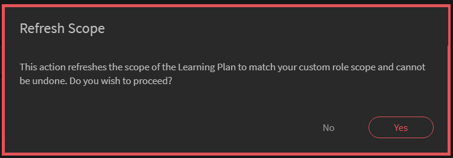

# Aangepaste rollen

Met deze functie kunt u aangepaste rollen definiëren en specifieke verantwoordelijkheden toewijzen aan een gebruikersset. Met deze functie kunt u verantwoordelijkheden toewijzen die buiten de bestaande rol van de persoon vallen.

U kunt een aangepaste rol maken om ontwerpmogelijkheden te bieden die beperkt zijn tot een bepaalde catalogus. U kunt ook een rol maken voor het beheren van rapporten. Dergelijke rollen kunnen vervolgens worden toegewezen aan personen die geacht worden deze specifieke verantwoordelijkheden op zich te nemen.

## Een aangepaste rol maken {#create-role}

1. Meld u aan als beheerder. Openen **[!UICONTROL Gebruikers]** > **[!UICONTROL Aangepaste rol]**.
1. Selecteren **[!UICONTROL Rol maken]**. De **[!UICONTROL Nieuwe rol maken]** wordt geopend.

   

   *Een aangepaste rol maken*

1. Voer de naam in het dialoogvenster **[!UICONTROL Naam van de rol]** veld.
1. **[!UICONTROL Accountbevoegdheden]**: Deze bevoegdheden geven de roleigenaars toegang tot specifieke aspecten van de systeemconfiguratie en die op het gehele account werken. Kies de toegangsrechten. De gebruiker krijgt volledige controle over de toegewezen machtigingen.

>[!NOTE]
>
>   Bereik is niet van toepassing op deze rechten.

*Bereik instellen*

1. **Functiebevoegdheden - Kernfuncties**: Wordt gebruikt om toegang te verlenen tot specifieke functies voor het beheer van leeractiviteiten. Met deze optie kunt u machtigingen voor de volgende functies geven.

   * Catalogi
   * Rapporten
   * Labels

   

   *Bereik instellen voor catalogi, rapporten en tags*

1. **Functiebevoegdheden - Leerobjecten:**  Gebruik deze optie om toegang te verlenen tot functies die gerelateerd zijn aan LO&#39;s. U kunt toegang verlenen tot de volgende LO&#39;s.

   * Certificeringen
   * Cursussen
   * Taakhulpen
   * Leerprogramma&#39;s

   U kunt ook specifieke besturingselementen voor de LO&#39;s toekennen. De machtiging kan een van de volgende zijn:

   * Volledig beheer
   * Bewerken en verwijderen
   * Inschrijving
   * Rapport

   

   *Specifieke machtigingen verlenen*

1. **Bereik voor functiebevoegdheden:** Het bereik van de functiebevoegdheden die aan deze rol zijn toegewezen, kan worden beperkt tot een specifieke gebruikersgroep of een of meer catalogi.

   Catalogi: gebruik het keuzerondje om controle te verschaffen over **[!UICONTROL Alle catalogi]** of gebruik de **[!UICONTROL Toegang per catalogus instellen]** om toegang tot specifieke catalogi te verlenen. U kunt ook meerdere catalogi selecteren.

   Gebruikersgroepen: toegang verlenen tot **[!UICONTROL Alle gebruikersgroepen]** of gebruik de **[!UICONTROL Toegang per gebruikersgroep instellen]** om toegang te verlenen tot specifieke gebruikersgroepen. Er kan slechts één gebruikersgroep worden opgegeven.

   >[!NOTE]
   >
   >Als u Aankondiging, Gamification, E-mailsjablonen, Vaardigheden en Gebruikers onder Accountbevoegdheden hebt geselecteerd, wordt de toegang tot de gebruikersgroep standaard aan alle gebruikersgroepen verleend en is deze optie uitgeschakeld.

   Als u leerplannen hebt geselecteerd onder Accountbevoegdheden, wordt standaard toegang tot alle catalogi en gebruikersgroepen geboden en zijn deze opties onder Bereik uitgeschakeld.

   

   *Omvang van rechten definiëren*

>[!NOTE]
>
>   In Learning Manager 27.6 kunt u een aangepaste rol maken die via meerdere catalogi moet worden behandeld, waarbij aan elke catalogus verschillende machtigingen worden toegekend.

Volg de onderstaande stappen om verschillende machtigingen voor de catalogi te verlenen:

1. Klik op de optie **[!UICONTROL Toegang per catalogus instellen]**.
1. Kies de catalogi en u kunt het machtigingsniveau voor elke catalogus zien. De machtigingen zijn als volgt:

   <table>
        <tbody>
        <tr>
          <td>
          
<b>Machtiging</b>
</td>
          <td>
          
<b>Beschrijving</b>
</td>
        </tr>
        <tr>
          <td>
          
Volledig beheer
</td>
          <td>
          
Hiermee krijgt u volledige controle over alle leerobjecten. Machtigingen omvatten Toevoegen, Bewerken, Verwijderen, Lezen, Inschrijven en Rapport. 
</td>
        </tr>
        <tr>
          <td>
          
Rapport
</td>
          <td>
          
Geeft alleen toegang tot het tabblad Rapporten van het leerobject.
</td>
        </tr>
        <tr>
          <td>
          
Inschrijven
</td>
          <td>
          
Geeft alleen machtigingen om u voor het leerobject in te schrijven.
</td>
        </tr>
        <tr>
          <td>
          
Alleen-lezen
</td>
          <td>
          
Geeft toestemming om alleen de leerobjecten in de catalogus weer te geven.
</td>
        </tr>
        </tbody>
      </table>

1. Schakel de machtigingen naar wens in of uit.
1. Klik op **[!UICONTROL OK]**. Klik vervolgens op **[!UICONTROL Opslaan]**.

Neem bijvoorbeeld het volgende scenario.

De resulterende machtiging die een aangepaste gebruiker op een leerobject zou hebben, is een doorsnede van de leerobjectmachtiging en catalogusmachtiging.

Een aangepaste gebruiker heeft Volledige machtiging voor cursussen en alleen Leestoegang voor catalogus A, maar Volledige machtiging voor catalogus B. De resultaten zijn Alleen-lezen toegang tot de cursussen van Catalogus A en Volledig beheer over de cursussen van Catalogus B.

Een gebruiker met een aangepaste rol kan:

* Alleen inhoud weergeven van de catalogi waartoe hij/zij toegang heeft.
* Open een leerobject op basis van de machtigingen van de catalogus waarin het leerobject is opgenomen.

Als beheerder kunt u:

* Kies meerdere catalogi voor een aangepaste rol.
* U kunt de machtigingen van een catalogus op elk gewenst moment wijzigen.
* Verwijder de catalogi uit een bereik waarvoor u geen machtigingen meer wilt verlenen.
* Toestemming voor alleen lezen impliciet verlenen aan een catalogus wanneer u machtigingen voor de catalogus verleent.

In de onderstaande tabel wordt aangegeven hoe machtigingen worden verleend.

<table>
    <tbody>
     <tr>
      <td>
       
<strong> </strong>
</td>
      <td>
       
<strong>Machtiging op catalogusniveau</strong>
</td>
     </tr>
     <tr>
      <td>
       
<strong>Machtiging op leerobjectniveau</strong>

       
<strong>(Voorbeeld: cursussen)</strong>
</td>
      <td>
       
Volledig beheer
</td>
      <td>
       
Inschrijven
</td>
      <td>
       
Rapport
</td>
      <td>
       
Alleen-lezen
</td>
     </tr>
     <tr>
      <td>
       
Volledig beheer
</td>
      <td>
       
Volledig beheer
</td>
      <td>
       
Inschrijven
</td>
      <td>
       
Rapport
</td>
      <td>
       
Alleen-lezen
</td>
     </tr>
     <tr>
      <td>
       
Inschrijven
</td>
      <td>
       
Inschrijven
</td>
      <td>
       
Inschrijven
</td>
      <td>
       
Alleen-lezen
</td>
      <td>
       
Alleen-lezen
</td>
     </tr>
     <tr>
      <td>
       
Bewerken en verwijderen
</td>
      <td>
       
Bewerken en verwijderen
</td>
      <td>
       
Alleen-lezen
</td>
      <td>
       
Alleen-lezen
</td>
      <td>
       
Alleen-lezen
</td>
     </tr>
     <tr>
      <td>
       
Rapport
</td>
      <td>
       
Rapport
</td>
      <td>
       
Alleen-lezen
</td>
      <td>
       
Rapport
</td>
      <td>
       
Alleen-lezen
</td>
     </tr>
    </tbody>
   </table>
1. **Gebruikers:** Gebruik deze optie om te bepalen aan welke gebruikers deze rol is toegewezen. U kunt een of meer gebruikers kiezen met behulp van het zoekvak.

**Gebruikers toevoegen aan CSV-upload met aangepaste rol:** Als u gebruikers via CSV-update wilt toevoegen, voegt u een kolom CustomRole toe aan het CSV-bestand dat de beheerder heeft gebruikt om gebruikers te importeren. Voer de rol van de gebruiker onder de kolom CustomRole in voor de gebruikers aan wie u een aangepaste rol wilt toewijzen. Klik op  **[!UICONTROL Toevoegen > Een CSV uploaden]**.

CustomRole columnNote:

* U kunt niet zoeken in gebruikersgroepen.
* U kunt niet zoeken naar gebruikers waaraan al een beheerdersrol is toegewezen.
* Het toewijzen van een nieuwe aangepaste rol aan een gebruiker heeft voorrang op de vorige aangepaste rol van de gebruiker.

<!---->

* Een aangepaste beheerder met de machtiging Instellingen kan het schema configureren voor synchronisatie of synchronisatie van gebruikers vanuit de gegevensbron, zelfs als deze geen toestemming hebben voor de gebruikersentiteit.
* Als een aangepaste beheerder machtigingen heeft voor de gebruikersentiteit, kunnen ze de beheerdersrol aan zichzelf toewijzen en een standaardbeheerder worden.

## Maptoegang voor aangepaste auteurs beperken {#folder-custom-author}

Leerbeheer ondersteunt al de mogelijkheid om toegang te verlenen tot de inhoudsbibliotheek met behulp van aangepaste rollen. Alle aangepaste auteurs die al toegang hebben tot de inhoudsbibliotheek, blijven toegang tot alle inhoudsbestanden hebben, zelfs nadat de inhoudsmappen zijn geconfigureerd. Dit is om het oude gedrag te behouden. Beheerders hoeven geen wijzigingen aan te brengen voor het geval ze het huidige gedrag willen blijven gebruiken.

Als beheerders de toegang tot deze aangepaste auteurs willen beperken, moeten ze de bestaande aangepaste rol bewerken en configureren door alleen toegang te bieden tot specifieke inhoudsmappen.

*Maptoegang voor aangepaste auteurs beperken*

Tijdens het maken van een aangepaste auteur kunt u nu inhoudsmappen aan de auteur toewijzen. Kies de optie **Geselecteerde mappen**.

Nadat u op de optie hebt geklikt, wordt een nieuw dialoogvenster geopend waarin u de mappen kunt toewijzen aan de aangepaste auteur.

*Selecteer de mappen voor de aangepaste auteur*

Kies de mappen en klik op **[!UICONTROL OK]**.

## Learning Summary Dashboard voor aangepaste beheerder {#custom-admin-dashboard}

Aangepaste beheerders kunnen dezelfde weergave zien als de beheerder. Een aangepaste beheerder kan gegevens buiten dit bereik plaatsen. Dit is alleen van toepassing als de aangepaste beheerder een volledig bereik heeft. Als u een volledig bereik wilt toekennen terwijl u een aangepaste beheerder maakt, schakelt u de optie **[!UICONTROL Volledig beheer]** in het rapport Accountoverzicht.

*Een aangepaste rol maken*

Als gevolg hiervan zijn de opties **[!UICONTROL Alle catalogi]** en **[!UICONTROL Alle gebruikersgroepen]** wordt geselecteerd en de rest wordt uitgeschakeld.

*Omvang van rechten definiëren*

## Impliciete machtigingen {#implicitpermissions}

Wanneer een gebruiker een rol krijgt toegewezen aan een specifieke entiteit, kunnen er gevallen zijn waarin hij/zij toegang moet hebben tot andere entiteiten om taken op de toegewezen entiteit te kunnen uitvoeren. Als een gebruiker bijvoorbeeld toegang tot Maken krijgt op cursusentiteit, hebben ze toegang nodig tot Vaardigheid- en Tag-entiteiten zodat ze deze kunnen koppelen aan de cursus die wordt gemaakt. Deze lijsten geven u informatie van dergelijke impliciete toestemmingen.

<table>
 <tbody>
  <tr>
   <th>Toegangstype</th>
   <th>Entiteitstoestemming verleend door de beheerder</th>
   <th>Impliciete entiteitstoestemming</th>
   <th>Impliciete toegang</th>
  </tr>
  <tr>
   <td>Beheren</td>
   <td>Gebruiker</td>
   <td>Groep</td>
   <td>Crud</td>
  </tr>
  <tr>
   <td>Inschrijven</td>
   <td>Alle verliezen (cursus, taakhulp, leerprogramma, certificering)</td>
   <td>Gebruiker 
     Leerplan</td>
   <td>Lezen</td>
  </tr>
  <tr>
   <td>Maken</td>
   <td>
    
Inhoudsgroep 
      Taakhulp 
</td>
   <td>Tag</td>
   <td>Lezen</td>
  </tr>
  <tr>
   <td>Maken</td>
   <td>Cursus</td>
   <td>Inhoudsgroep 
     Tag 
     Vaardigheid 
     Badge 
     Taakhulp</td>
   <td>Alles lezen</td>
  </tr>
  <tr>
   <td>Maken</td>
   <td>Leerprogramma 
     Certificering </td>
   <td>Cursus 
     Tag 
     Vaardigheid 
     Badge</td>
   <td>Lezen</td>
  </tr>
  <tr>
   <td>Maken</td>
   <td>Leerplan</td>
   <td>Catalogus 
     Groep 
     Vaardigheid 
     Alle verliezen (cursus, taakhulp, leerprogramma, certificering)</td>
   <td>Lezen</td>
  </tr>
  <tr>
   <td>Maken</td>
   <td>Aankondiging</td>
   <td>Gebruiker 
     Groep 
     Alle verliezen (cursus, taakhulp, leerprogramma, certificering)</td>
   <td>Lezen</td>
  </tr>
  <tr>
   <td>Maken</td>
   <td>Gamification</td>
   <td>Branding</td>
   <td>Schrijven</td>
  </tr>
  <tr>
   <td>*</td>
   <td>Gebruiker</td>
   <td>Facturering</td>
   <td>Lezen</td>
  </tr>
  <tr>
   <td>*</td>
   <td>Catalogus</td>
   <td>Groep 
     Alle verliezen (cursus, taakhulp, leerprogramma, certificering)</td>
   <td>Lezen</td>
  </tr>
  <tr>
   <td>*</td>
   <td>Instelling</td>
   <td>Branding 
     Gebruiker</td>
   <td>Lezen</td>
  </tr>
  <tr>
   <td>*</td>
   <td>Branding</td>
   <td>Instelling</td>
   <td>Lezen</td>
  </tr>
  <tr>
   <td>*</td>
   <td>Facturering 
     Gamification</td>
   <td>Gebruiker</td>
   <td>Lezen</td>
  </tr>
 </tbody>
</table>

## Een aangepaste rol openen {#accessacustomrole}

Wanneer een beheerder een aangepaste rol toewijst, ontvangt u een e-mailmelding.

Opmerking: als u al bent aangemeld bij de Learning Manager met een aangepaste rol, moet u zich opnieuw aanmelden bij de Learning Manager om toegang te krijgen tot de nieuwe rol.

Als u wilt schakelen tussen rollen, klikt u op het profielpictogram in de rechterbovenhoek van Leermanager en selecteert u de rol.

## Leerplannen met configureerbare rollen {#scopeconfigure}

In eerdere versies van Leermanager kon elke aangepaste rol met toestemming om leerplannen te maken, het leerplan voor alle typen gebruikersgroepen en leerobjecten omvatten.

De bereikinstelling werd eerst uitgeschakeld toen leerplantoegang werd verleend, waardoor de gebruiker standaard toegang had tot Alle catalogi en Alle gebruikersgroepen.

Alle leerplannen die door een beheerder zijn gemaakt, zijn standaard van toepassing op alle gebruikers. Gebruikers kunnen ook elk leerobject krijgen toegewezen. Aan de andere kant hebben gebruikers met aangepaste rollen toegang tot volledige bereiken, bijvoorbeeld alle catalogi, leerobjecten of gebruikersgroepen. Dit betekende dat beheerders geen aangepaste rollen konden maken zoals verwacht en gebruikers met een beperkt bereik toegang tot leerplannen mochten krijgen.

In deze update van Leermanager kunt u aangepaste rollen voor leerplannen maken waarmee gebruikers en leerobjecten bereikbaar zijn. Met andere woorden, leerplannen kunnen worden gemaakt met een beperkt bereik dat is afgeleid van het rolbereik van een aangepaste beheerder.

Een beheerder kan nu het bereik definiëren of beperken terwijl toegang tot leerplanmanagement wordt verleend.

Aangepaste beheerders kunnen leerplannen maken met een beperkt bereik, dat wordt bepaald door het bereik van de configureerbare rol van de aangepaste beheerder. Dergelijke leerplannen zijn alleen toegankelijk voor aangepaste beheerders met dezelfde rol, maar zijn ook toegankelijk voor gewone beheerders. Bovendien kunnen de aangepaste beheerders geen andere leerplannen in het account zien.

Bestaande aangepaste beheerders die toegang hebben tot leerplannen, hebben altijd het volledige bereik (per definitie). Ze hebben toegang tot alle leerplannen in het account, net als gewone beheerders. Nieuwe aangepaste rollen die zijn gemaakt met volledig bereik en nieuwe aangepaste beheerders die aan dergelijke rollen zijn toegevoegd, blijven toegang tot alle leerplannen hebben.

Leerplannen die door beheerders zijn gemaakt en aangepaste beheerders met een volledig bereik worden zoals gebruikelijk gemaakt en worden niet beperkt door het bereik.

In de sectie **Reikwijdte voor functiebevoegdheden**, verleent u toegang tot gebruikersgroepen en/of catalogus voor de aangepaste rol.

*Toegang verlenen tot gebruikersgroepen en/of catalogus voor de aangepaste rol*

Wijs een gebruiker aan de Aangepaste rol toe.

*Een gebruiker toewijzen aan een aangepaste rol*

De gebruiker meldt zich nu aan bij Learning Manager als aangepaste beheerder en voegt nu een leerplan toe.

Wanneer een nieuwe student wordt toegevoegd, kan de aangepaste beheerder alleen een training selecteren uit de catalogi met het bereik van de configureerbare rol.

Dit leerplan is nu alleen van toepassing op de student als de gebruiker ook wordt toegevoegd aan de groep binnen de bereikgroep van het leerplan. Alle andere studenten worden vrijgesteld van dit leerplan.

## Student wordt toegevoegd aan de groep {#learnergetsaddedtothegroup}

<!---->

De aangepaste beheerder kan elke gebruikersgroep selecteren waarvan gebruikers deel uitmaken van de gebruikersgroep met het bereik van de rol.

Wanneer een gebruiker aan de opgegeven groep wordt toegevoegd, wordt het leerobject alleen toegewezen aan gebruikers die al deel uitmaken van de bereikgroep van het leerplan en die aan de opgegeven gebruikersgroep zijn toegevoegd.

## Wijziging van het bereik {#changeinscope}

Wanneer de beheerder het bereik van de aangepaste rol wijzigt, wordt de wijziging ook trapsgewijs doorgevoerd in de aangepaste beheerder. Wanneer de aangepaste beheerder een leerplan kiest dat al onder een eerdere aangepaste rol viel, wordt een bericht weergegeven, zoals hieronder weergegeven:

*Bericht na bereikwijzigingen*

De aangepaste beheerder moet nu het eerdere bereik bijwerken of vernieuwen naar het nieuwe bereik.

Klikken **[!UICONTROL Bereik vernieuwen]** werkt het bereik bij. Er verschijnt een waarschuwingsbericht.

*Waarschuwingsbericht na vernieuwen van bereik*

Klikken **[!UICONTROL Ja]** werkt het bereik bij.

## gamificatierapport toevoegen aan een aangepaste rol {#gamification-custom}

Een beheerder kan gamificationrapporten inschakelen voor een aangepaste gebruiker.

1. In het dialoogvenster **[!UICONTROL Aangepaste rollen]** de naam van de aangepaste rol in.
1. In het dialoogvenster **[!UICONTROL Functieprivileges: kernfuncties]** de optie **[!UICONTROL Volledig beheer]** voor de categorie **[!UICONTROL Rapporten]**.

1. In de sectie **[!UICONTROL Gebruikers]** selecteert u de gebruiker aan wie de nieuwe aangepaste rol zal worden toegewezen.
1. Klikken **[!UICONTROL Opslaan]**.

Wanneer een gebruiker zich aanmeldt als aangepaste beheerder en op **[!UICONTROL Rapporten]** in het linkerdeelvenster worden de transcripties weergegeven, zoals hieronder wordt getoond:

*De gamificationtranscripten downloaden*

Klikken **[!UICONTROL Gamification-transcripten]**, kiest u een gebruiker en genereert u het rapport.

Als een beheerder de niveaupunten wijzigt, worden niveaus in de rapporten weergegeven op basis van de huidige punten.

Met opnieuw instellen van gamification wordt de bereikte niveau niet opnieuw ingesteld.

## Veelgestelde vragen {#frequentlyaskedquestions}

+++Een aangepaste rol maken?

Een aangepaste rol is vergelijkbaar met een subset van de rol Auteur of Beheerder. Sta één of meerdere voorrechten toe, bepaal het werkingsgebied, en wijs de rol aan een gebruiker toe.

Klikken **[!UICONTROL Gebruikers]** > **[!UICONTROL Aangepaste rollen]**. Klik op de pagina Aangepaste rollen op **[!UICONTROL Rol maken]**. Voer de naam van de aangepaste rol in en stel de bevoegdheden voor de rol in. Zie voor meer informatie [Een aangepaste rol maken](custom-role.md#create-role).
+++
