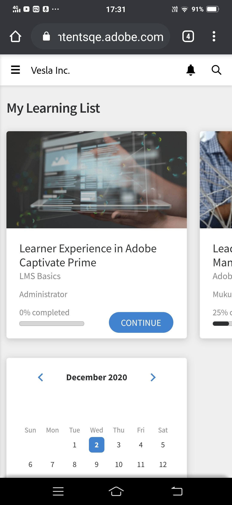

# De startpagina van studenten aanpassen

## Overzicht {#overview}

Een beheerder kan de startpagina van de student aanpassen en deze moderner, contentgestuurd en gepersonaliseerd maken voor een student.

De gepersonaliseerde benadering biedt een uitgebreide manier om een startpagina voor studenten te maken, die de beheerder van de organisatie op WYSIWYG-wijze kan configureren in de beheergebruikersinterface.

De ervaring wordt aangestuurd door gepersonaliseerde trainingsaanbevelingen van een AI-gedreven algoritme dat content van derden analyseert op branchevaardigheden, peer-activiteit en interessegebieden van studenten integreert met behulp van expliciete en impliciete data.

## De startpagina voor studenten configureren {#configurethelearnerhomepage}

Op de **Branding** > **Studentenstartpagina** een beheerder kan de startpagina-ervaring van een student aanpassen, zodat de student een volledig vernieuwde look and feel ziet wanneer hij/zij zich aanmeldt in de Learner-app.

Beheerders kunnen de gebruikersinterface (look and feel) instellen in de Admin-app (**Branding** > **Startpagina student** ).

Beheerders kunnen overschakelen op de immersive UI-widgetweergave, widgets/functies op basis daarvan aanpassen en vervolgens de meeslepende gebruikersinterface inschakelen.

De **Studentenstartpagina** scherm bevat de volgende secties:

## Immersive layout, optie {#immersivelayoutoption}

Schakel de optie in om de lay-out van een pagina met meeslepende beelden te bekijken **Immersive**. U kunt deze optie in- en uitschakelen in **Branding > Algemeen**.

In eerdere versies stonden de opties voor Studentenstartpagina in Instellingen.

Hier volgen de opties die u kunt instellen:

**Homepage-ervaring:** Schakel **Klassiek** of **Immersive**. Als u Immersive kiest, worden de volgende opties weergegeven:

* **Type training:** Kies **Industrie** of **Aangepast uitgelijnd**. Eigen trainingen worden intern gemaakt. Toonaangevende trainingen omvatten kant-en-klare inhoud van externe providers.

*Stel de ervaring van de startpagina in door Industry of Custom Align te selecteren*

De optie **Studenten in staat stellen interessegebieden te verkennen** is beschikbaar voor zowel Classic als Immersive Experience.

<table>
 <tbody>
  <tr>
   <td>
    
<b>Als u Aangepast kiest...</b>
</td>
   <td>
    
<b>Als u Industrie uitgelijnd kiest...</b> 
</td>
  </tr>
  <tr>
   <td>
    
U kunt maximaal één intern en extern actief veld kiezen.
</td>
   <td>
    
U kunt maximaal vijf en ten minste één veld kiezen. Standaard kunt u de optie <b>Profiel </b>is geselecteerd.
</td>
  </tr>
 </tbody>
</table>

Als er minder dan 1000 studenten zijn, wordt het gehele account beschouwd als één bereik. Dit geldt specifiek voor het type Aangepaste training. Als het account minder dan 1000 gebruikers heeft, wordt het volledige account als het bereik beschouwd.

>[!NOTE]
>
>Het selectievakje **Vaardigheden ontdekken** is verplaatst naar Instellingen > Algemeen.

Deze functie wordt ingeschakeld en grijs weergegeven als de optie Boeiende ervaring wordt gekozen. Dit selectievakje is alleen beschikbaar voor de klassieke ervaring.

*Selectie voor Klassieke ervaring*

De boeiende lay-out is de standaardindeling voor alle nieuwe accounts. De indeling wordt bestuurd door widgets die een beheerder kan in- of uitschakelen. Op basis van de positie van de widgets wordt hetzelfde weergegeven op de startpagina van de student.

Hier zijn de widgets die u kunt in-/uitschakelen.

Hiermee kunt u een voorbeeld van de gebruikersinterface van de student bekijken voordat de gebruikersinterface van de student live gaat.

Voor bestaande accounts is de optie **Immersive** zal **UIT**. Het is ingeschakeld voor een nieuw account met Social and Gamification ON.

*Voorbeeld van de gebruikersinterface van de student*

<table>
 <tbody>
  <tr>
   <td>
    
<b>Widget</b>
</td>
   <td>
    
<b>Beschrijving</b>
</td>
  </tr>
  <tr>
   <td>
    
Masthead
</td>
   <td>
    
<b>Wat is een Masthead en hoe pas ik de studenten Masthead aan? </b> 

    
Het is een welkomstbanner voor studenten. De banner kan een afbeelding of een video zijn. U kunt de masthead richten op specifieke gebruikersgroepen en een student bekijkt de Masthead zodra hij/zij op de startpagina komt. Een gebruikersgroep kan meerdere hero images of video's zien volgens het doelabonnement dat door de beheerder is ingesteld. 

    
Hieronder wordt beschreven hoe een beheerder een banner uploadt:

    <ol>
     <li>Klik in het linkerdeelvenster op <b>Aankondigingen</b>. </li>
     <li>Klik rechtsboven op de pagina op <b>Toevoegen</b>.</li>
     <li>Van de <b>Type </b>vervolgkeuzelijst, kiest u <b>As Masthead</b>.</li>
     <li>Schrijf een bericht dat in de masthead zal voorkomen.</li>
     <li>Upload een afbeelding of video.</li>
     <li>Kies een doelgroep. Selecteer een gebruikersgroep of training waarin de masthead wordt weergegeven.</li>
     <li>Sla de masthead-aankondiging op.</li>
    </ol></td>
  </tr>
  <tr>
   <td>
    
Mijn leerervaring
</td>
   <td>
    
Toont de leerobjecten die onlangs door de student zijn bezocht. 
</td>
  </tr>
  <tr>
   <td>
    
Kalender
</td>
   <td>
    
Hiermee worden per maand verschillende trainingen voor de klassikale en virtuele klassikale training voor de studenten weergegeven. De cursussen waarvoor de student zich kan inschrijven of waarvoor hij/zij al is ingeschreven, worden weergegeven, inclusief trainingen die door de manager zijn goedgekeurd. 
</td>
  </tr>
  <tr>
   <td>
    
Gamification
</td>
   <td>
    
Geeft het leaderboard weer op basis van leeractiviteiten.
</td>
  </tr>
  <tr>
   <td>
    
Sociaal leren
</td>
   <td>
    
Hiermee geeft u activiteiten en berichten weer van gebruikers die zich in hetzelfde gebruikersbereik als de student bevinden. 
</td>
  </tr>
  <tr>
   <td>
    
Aanbevolen door organisatie
</td>
   <td>
    
Als deze widget is ingeschakeld, raadt deze aan om trainingen uit te voeren voor specifieke gebruikersgroepen. Elke gebruikersgroep kan worden gericht op een of meer trainingen en het doelabonnement is gebaseerd op een tijdsperiode.  

    <ul>
     <li>
      
Ten eerste, de beheerder <a href="announcements.md#recommendation">maakt een aankondiging</a> van type <b>Als aanbeveling</b> en selecteert vervolgens de vereiste training en gebruikt groepen. Een student die tot een gebruikersgroep behoort, krijgt de aanbevolen training te zien.
</li>
     <li>
      
Ten tweede kan de beheerder ook beslissen of de aanbevelingen onmiddellijk of op een bepaalde datum in werking treden.
</li>
    </ul></td>
  </tr>
  <tr>
   <td>
    
Aanbeveling op basis van het betrokken gebied
</td>
   <td>
    
Geeft leerobjecten weer op basis van het gekozen interessegebied van de student. De aanbeveling wordt aangestuurd door een Machine Learning-algoritme.
</td>
  </tr>
  <tr>
   <td>
    
Bladeren op catalogus 
</td>
   <td>
    
Hiermee worden catalogi als tegels op de startpagina weergegeven. 
</td>
  </tr>
  <tr>
   <td>
    
Aanbeveling op basis van peer activity 
</td>
   <td>
    
Hiermee geeft u de training weer op basis van wat de collega's van een student afleggen. Dit wordt opnieuw aangestuurd door een Machine Learning-algoritme.
</td>
  </tr>
 </tbody>
</table>

Nadat u de wijzigingen hebt opgeslagen, geeft de startpagina van de student alle wijzigingen weer.

Wanneer de student zich via een browser aanmeldt bij de Learner-app, ziet hij of zij de volgende meeslepende lay-out:

<table>
 <tbody>
  <tr>
   <td>
    
<strong>Startpagina</strong>
</td>
   <td>
    
<strong>Mijn leerlijst</strong>
</td>
   <td>
    
<strong>Catalogus weergeven</strong>
</td>
  </tr>
 </tbody>
</table>

*Overweldigende lay-out weergeven voor verschillende secties op de startpagina*

## Klassieke lay-outoptie {#classiclayoutoption}

De gebruikersinterfacelay-out die tot nu toe altijd bestond, wordt nu klassieke lay-out genoemd. Als u deze optie kiest, keert de startpagina van de student terug naar de klassieke schermindeling.

*Een voorvertoning van de klassieke lay-out weergeven*

## Aanbevelingsinstellingen configureren {#configurerecommendationsettings}

Aan **Branding** > **Algemeen** kunt u aanbevelingsbereiken voor interne en externe studenten configureren en studenten in staat stellen vaardigheden te kiezen op de startpagina van de student.

Op de **Algemeen** hebt u de volgende opties:

<table>
 <tbody>
  <tr>
   <td>
    
Naam organisatie
</td>
   <td>
    
De naam van de organisatie waartoe de leerling behoort.
</td>
  </tr>
  <tr>
   <td>
    
Subdomein
</td>
   <td>
    
Het subdomein van de organisatie.
</td>
  </tr>
  <tr>
   <td>
    
Logostijlen
</td>
   <td>
    
Zo worden uw logo en bedrijfsnaam weergegeven in Leermanager. 
</td>
  </tr>
  <tr>
   <td>
    
Thema's
</td>
   <td>
    
Het thema dat wordt toegepast op Learning Manager.
</td>
  </tr>
  <tr>
   <td>
    
Aanpassen
</td>
   <td>
    
Met Adobe Learning Manager kunt u uw account aanpassen om uw gebruikers een rijkere ervaring te bieden. 
</td>
  </tr>
  <tr>
   <td>
    
Studentenstartpagina
</td>
   <td>
    
Kies <b>Klassiek </b>of <b>Immersive</b>. Als u Immersive (Immersief) kiest, worden er andere opties weergegeven.
</td>
  </tr>
  <tr>
   <td>
    
Type training 
</td>
   <td>
    
Kies <b>Aangepast </b>of <b>Branches uitgelijnd</b>. Als er minder dan 1000 studenten zijn, wordt het gehele account beschouwd als één bereik. De aanbeveling is gebaseerd op alle studenten. 
</td>
  </tr>
  <tr>
   <td>
    
Omvanginstelling aanbeveling 
</td>
   <td>
    
Kies een of meer actieve velden. Voor <b>Aangepast</b>kunt u maximaal één actief veld kiezen. Voor <b>Branches uitgelijnd</b>kunt u maximaal vijf actieve velden kiezen. 
</td>
  </tr>
  <tr>
   <td>
    
Studenten in staat stellen interessegebieden te verkennen
</td>
   <td>
    
Alleen voor Klassieke ervaring. Kies <b>Ja </b>of <b>Nee</b>. 
</td>
  </tr>
  <tr>
   <td>
    
Vraag gebruikers om interessegebieden te selecteren (vaardigheden)  
</td>
   <td>
    
Alleen voor meeslepende ervaringen. Kies <b>Ja</b> of <b>Nee</b>.  
</td>
  </tr>
 </tbody>
</table>
