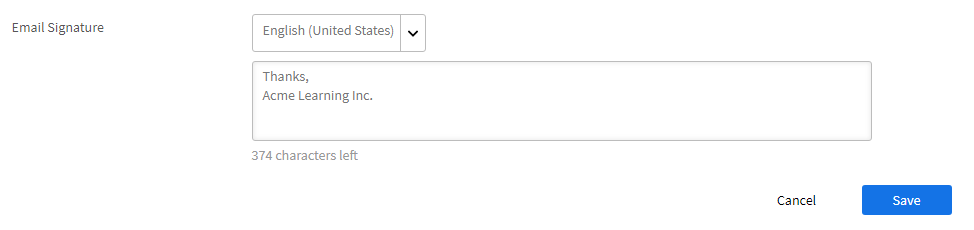

# E-mailsjablonen

De gebeurtenissen in uw trainingsactiviteit zorgen ervoor dat e-mails naar studenten worden verzonden. Als beheerder kunt u deze e-mailsjablonen eenvoudig in- en uitschakelen of wijzigen.

Learning Manager-toepassing verstuurt e-mailnotificaties naar meerdere gebruikersrollen gebaseerd op gebeurtenissen.

Als beheerder kunt u e-mailsjablonen aanpassen door inhoud toe te voegen of te wijzigen en meldingen naar gebruikers te sturen voor verschillende gebeurtenissen die door studenten, managers en auteurs worden geactiveerd.

Beheerders kunnen er ook voor kiezen om voor bepaalde gebeurtenissen geen e-mailmeldingen te sturen.

## Inleiding tot e-mailsjablonen

In deze training leert u hoe u afzonderlijke e-mailsjablonen kunt aanpassen en instellingen op cursusniveau en accountniveau voor e-mailsjablonen kunt aanpassen.

<!--In this training, you will learn how to create a user group by names, email IDs, and combining multiple auto-generated user groups.-->

Schrijf naar <almacademy@adobe.com> als u de training niet kunt starten.

## E-mailsjablonen configureren {#configureemailtemplates}

Als beheerder kunt u deze e-mailsjablonen eenvoudig in- en uitschakelen of wijzigen.

1. Om tot de malplaatjes toegang te hebben, klik **[!UICONTROL E-mailMalplaatjes]** op de linkerruit. Op deze pagina kunt u drie verschillende categorieën malplaatjes zien, **[!UICONTROL Algemeen]**, **[!UICONTROL Lerende Activiteit]**, en **[!UICONTROL Herinneringen en Updates]**. Er is een vierde lusje, **[!UICONTROL Montages]**, waar u de malplaatjes kunt vormen.

   

   *selecteer het Algemene lusje*

1. Klik op een willekeurig tabblad om de lijst met e-mailsjablonen weer te geven.

   

   *Mening de lijst van e-mailmalplaatjes*

   U kunt deze e-mailwaarschuwingen eenvoudig in- of uitschakelen door op de wisselknop te klikken.

1. Klik op de naam van de sjabloon om de inhoud van de sjabloon aan te passen. Hier ziet u dat u voor verschillende soorten gebruikers verschillende sjablonen heeft.

   

   *Mening het malplaatje van een e-mail*

1. Klik op de hoofdtekst van de e-mail om de inhoud van deze e-mailsjabloon aan te passen Breng nu de wijzigingen in de sjabloon aan. U kunt de tekst aanpassen. U kunt ook een van deze variabelen in uw e-mail gebruiken. De wijzigingen in de hoofdtekst kunnen alleen op deze e-mailsjabloon worden toegepast. Als u echter wijzigingen aanbrengt in de handtekening van deze e-mail, kan deze algemeen op alle sjablonen worden toegepast.

   Beweeg uw muis over elk pictogram om de namen te bekijken.

   

   *wijzig het e-mailmalplaatje*

   U kunt de standaardinhoud van het bericht herstellen door op de link **[!UICONTROL Origineel herstellen]** boven de sjabloon te klikken.

1. Klik op Opslaan om de wijzigingen die op deze sjabloon zijn toegepast te bevestigen. Gebruikers kunnen nu e-mailberichten ontvangen met de aangepaste e-mailsjabloon.

## Instellingen van een e-mailsjabloon aanpassen {#customizesettingsofanemailtemplate}

1. Klik op **[!UICONTROL Instellingen]** om de instellingenpagina te openen. U kunt nu uw e-mailsjablonen aanpassen.
1. Om de naam en e-mail-ID aan te passen waarvan de studenten e-mails ontvangen, geef de **[!UICONTROL Naam en het Adres van de Afzender &#x200B;] uit.**

   De Steun van de Adobe van het contact ***[&#128279;](https://helpx.adobe.com/contact/enterprise-support.other.html#learning-manager) om deze details te vormen of te veranderen.***

1. Pas uw e-mailbanner van de **[!UICONTROL optie E-mailbanner]** aan. Verander de kleur van de banner door **[!UICONTROL Achtergrond van de Banner te selecteren]**.

   U kunt een douanebeeld als banner gebruiken door de **[!UICONTROL optie van het Beeld van de Douane te selecteren]**. Klik op **[!UICONTROL Opslaan]** nadat u wijzigingen hebt aangebracht.

    

   *pas het beeld van een banner* aan

   De aangepaste afbeelding moet 1240x200px groot zijn en .JPG, .JPEG en .PNG ondersteunen.

1. Bewerk uw e-mailhandtekening door op **[!UICONTROL Bewerken]** te klikken. Breng de gewenste wijzigingen aan en sla deze op.

   

   *Pas uw e-mailhandtekening* aan

1. Bewerk uw rekening URL door op Edit op de optie **[!UICONTROL te klikken Account URL]**.

   De link van de account-URL wordt in alle e-mails weergegeven, vlak voor de handtekening. Voer de gewenste URL in en klik op **[!UICONTROL Opslaan]**. Alleen interne gebruikers kunnen deze URL zien.

   

   *pas account URL* aan

1. Vorm of de managers e-mails moeten ook ontvangen die naar hun directe rapporten gebruikend de controledoos onder **[!UICONTROL Facultatieve E-mail van de Manager]** optie worden verzonden.

## E-mail op rolniveau in- of uitschakelen

De beheerder kan e-mailsjablonen in- of uitschakelen op basis van de rol van de ontvanger, zoals student, manager of docent. Dit geeft beheerders meer controle over welke meldingen worden verzonden en helpt het type en de frequentie van communicatie te beheren.

E-mailsjablonen in- of uitschakelen

1. Meld u als beheerder aan bij Adobe Learning Manager.
2. Selecteer **[!UICONTROL E-mailMalplaatjes]** van de linkerruit.
3. Om e-mailmalplaatjes voor een bepaalde rol in bulk toe te laten of onbruikbaar te maken, selecteer de ellips (...) in de kolomrubriek, en laat alle toepasselijke rollen in **[!UICONTROL E-mailOntvangers]** toe.

   
   _verzend alle E-mailMalplaatjes op rolniveau_

4. Als u een specifieke e-mailsjabloon voor een rol wilt in- of uitschakelen, selecteert u de weglatingsteken (...) voor die sjabloon en schakelt u een rol in of uit.

   
   _verzend een E-mailmalplaatje op een rolniveau_

## De frequentie van overzichtsmails instellen {#setfrequencyofdigestemails}

Op de **[!UICONTROL pagina van E-mailmalplaatjes]** > **[!UICONTROL Montages]**, kan Admin de frequentie veranderen van Samenvatting E-mails die naar studenten moeten worden verzonden.

Klik in het deel **[!UICONTROL Instellingen overzichtsmail]** op **[!UICONTROL Bewerken]**.

In drop-down, kies of **[!UICONTROL Tweewekelijks]** of **[!UICONTROL Maandelijks]**.

* **[!UICONTROL Tweewekelijks &#x200B;]:** Als u de frequentie aan **[!UICONTROL Tweewekelijks]** plaatst, ontvangen de studenten één keer per twee weken e-mail.

* **[!UICONTROL Maandelijks &#x200B;]:** als u de frequentie aan **[!UICONTROL Maandelijks]** plaatst, ontvangen de studenten één keer per maand e-mail.

*De frequentie van overzichtsmails instellen*

Wanneer u deze optie toelaat, wordt de frequentie geplaatst aan **[!UICONTROL Tweewekelijkse]** voor bestaande/nieuwe actieve rekeningen door gebrek.

### DND-lijst van studenten

Studenten die op een DND-lijst staan, kunnen gebruikersinstellingen voor overzichtsmails niet zien. De optie blijft uitgeschakeld en studenten ontvangen geen mails.

## Voorbeeld van overzichtsmail naar studenten {#digest-email}

De volgende voorbeelden zijn een weergave van de e-mail die studenten ontvangen.

*Steekproef e-mail*

### Leeractiviteit

*E-mail van opleidingsactiviteit*

### Aanbevolen trainingen

*E-mail van geadviseerde opleiding*

### Leaderboard

*E-mail van leaderboard*

### Laatste berichten

*E-mail van recentste berichten*

### Rapport over e-mailtoegang downloaden

U kunt het rapport van de e-mailtoegang downloaden door de **[!UICONTROL knoop van de Download]** te klikken. Dit rapport bevat het aantal gebruikers dat de e-mail heeft ontvangen en het aantal gebruikers dat de koppelingen heeft geopend en erop heeft geklikt.

## E-maildomein aanpassen {#customizeemaildomain}

Om het e-maildomein en e-mail-ID aan te passen waarvan uw studenten berichten ontvangen, contacteer de [***Lerende steun van de Manager*** ](https://helpx.adobe.com/contact/enterprise-support.other.html#learning-manager) en verstrek de details van het domein u, en uw nieuwe e-mail-ID wilt toevoegen.

Uw verzoek wordt verwerkt en u ontvangt een bevestigingslink op het nieuwe e-mailadres dat u hebt opgegeven. Klik op de verificatielink in de e-mail om het verificatieproces te bevestigen en te voltooien.

## E-mail Niet storen instellen {#dnd}

Als beheerder kunt selecteren welke gebruikers e-mails van Learning Manager ontvangen.

U kunt dit uitvoeren door **[!UICONTROL te gebruiken storen]** optie niet onder de **[!UICONTROL Montages]** tabel. Voeg gebruikers toe door hun naam, e-mail-ID of unieke gebruikers-ID op de lijst te zetten.

Zoek een gebruiker om deze toe te voegen aan de lijst.

<!---->

## Geblokkeerde e-mails {#blockedemails}

Van de **Geblokkeerde drop-down lijst van E-mails** voor elke gebruiker om de types van e-mail te selecteren voor hen te blokkeren.

<!---->

Dit zijn de beschikbare opties:

* **Directe e-mail aan student:** Deze optie beperkt of staat e-mails toe die naar de student worden verzonden.
* **Escalatiemails naar Manager van Student**: hiermee worden e-mails naar de manager van de student toegestaan of beperkt.
* **Informatie over directe ondergeschikten**: hiermee worden inkomende escalatiemails naar de gebruikers over hun directe ondergeschikten toegestaan of beperkt.
* **Informatie over ondergeschikten op 2e niveau**: hiermee worden inkomende escalatiemails naar de gebruikers over hun ondergeschikten op 2e niveau beperkt of toegestaan.

Als u een gebruiker uit de lijst wilt verwijderen, kunt u de verwijderingsoptie gebruiken die voor elke gebruiker afzonderlijk beschikbaar is op het tabblad Gebruiker.

U kunt gebruikers aan de DND-lijst toevoegen met behulp van CSV&#39;s. Neem de waarden True/False/Blank op voor elk van de volgende kleuren:

* Directe e-mails blokkeren
* Gebruikersescalaties blokkeren
* Binnenkomende directe escalaties blokkeren
* Binnenkomende overgeslagen escalaties blokkeren

Typ true in het waardeveld om te voorkomen dat gebruikers e-mails ontvangen voor de geselecteerde optie. Als false (onwaar) als waarde wordt ingevoerd, wordt de blokkering van de gebruikers opgeheven. Als de kolom leeg wordt gelaten, worden er geen wijzigingen in de vorige selecties aangebracht.

## Flexibiliteit bij het aanpassen van de sjablonen

E-mailsjablonen in Learning Manager bevatten nu volledig bewerkbare secties, wat meer flexibiliteit biedt om e-mailcommunicatie aan te passen op basis van voorkeuren voor berichten en huisstijl.

De belangrijkste verbeteringen voor het aanpassen van e-mailsjablonen zijn:

### De aanhef van e-mails aanpassen op accountniveau

Selecteer **[!UICONTROL E-mailMalplaatjes]** > **[!UICONTROL Montages]**. Selecteer **[!UICONTROL Bewerken]** in de sectie **[!UICONTROL Aanhef e-mail]**.

 aan

*pas e-mailaanhef* aan

U kunt ook het volgende aanpassen:

* E-mailbanner en e-mailhandtekening op cursus- en instantieniveau.
* Bewerk de e-mailvoettekst. Het voettekstgebied bevat vooraf gedefinieerde variabelen voor de account-URL, de handtekening en eventuele vrije-vormtekst die de gebruiker toevoegt.

De sjablonen ondersteunen ook geavanceerde bewerkingsmogelijkheden, zodat de opmaak behouden blijft wanneer inhoud wordt gekopieerd en geplakt van en naar Microsoft Word.

## Inline-uitnodigingen {#inlineinvitations}

Gebruikers van Learning Manager ontvangen nu inline e-mailuitnodigingen. ICS-bijlagen worden niet meer gebruikt om uitnodigingen te verzenden. Eventuele wijzigingen in de uitnodiging worden automatisch weergegeven in uw kalender.

<!---->

## Veelgestelde vragen {#frequentlyaskedquestions}

+++Help in e-mailsjablonen uitschakelen

Op dit moment is het niet mogelijk om in Learning Manager de **Help** in e-mailsjablonen uit te schakelen.

+++

+++E-mailsjablonen wijzigen?

1. Meld u als beheerder bij uw Learning Manager-account aan.
1. Klik in het linkerdeelvenster op **[!UICONTROL E-mailsjablonen]** en selecteer de e-mailsjabloon die u wilt wijzigen.
1. Klik op de hoofdtekst van het sjabloon om de sjabloon aan te passen. U kunt variabelen in de tekst invoegen door op de toepasselijke pictogrammen te klikken, zoals te zien in de afbeelding. Beweeg de muis over elk pictogram om de namen te bekijken en er een toe te passen op de sjabloon.
1. Na het aanbrengen van veranderingen in het malplaatje, klik **[!UICONTROL sparen]**.

+++

+++Hoe maak ik uw eigen e-mailsjablonen?

Op dit moment is het niet mogelijk om eigen e-mailsjablonen te maken. U kunt wel bestaande sjablonen bewerken en wijzigen.

+++

+++Hoe schakel ik de e-mailsjablonen uit?

Selecteer de sjabloon die u wilt uitschakelen en klik op de cirkelvormige knop Ja/Nee om de e-mailsjabloon uit te schakelen.

+++

+++Hoe wijzig ik de naam en het adres van de afzender in de sjabloon?

Om de afzendernaam en e-mailadres te veranderen, de steun van Adobe Learning Manager van het contact [&#128279;](https://helpx.adobe.com/contact/enterprise-support.other.html#learning-manager).

+++
