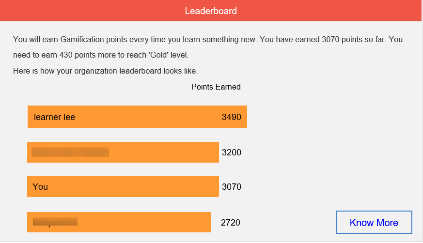

# E-mailsjablonen

De gebeurtenissen in uw trainingsactiviteit zorgen ervoor dat e-mails naar studenten worden verzonden. Als beheerder kunt u deze e-mailsjablonen eenvoudig in- en uitschakelen of wijzigen.

Learning Manager-toepassing verstuurt e-mailnotificaties naar meerdere gebruikersrollen gebaseerd op gebeurtenissen.

Als beheerder kunt u e-mailsjablonen aanpassen door inhoud toe te voegen of te wijzigen en meldingen naar gebruikers te sturen voor verschillende gebeurtenissen die door studenten, managers en auteurs worden geactiveerd.

Beheerders kunnen er ook voor kiezen om voor bepaalde gebeurtenissen geen e-mailmeldingen te sturen.

## E-mailsjablonen configureren {#configureemailtemplates}

Als beheerder kunt u deze e-mailsjablonen eenvoudig in- en uitschakelen of wijzigen.

1. Als u de sjablonen wilt openen, klikt u op **[!UICONTROL E-mailsjablonen]** in het linkerdeelvenster. Op deze pagina ziet u drie verschillende categorieën sjablonen: **[!UICONTROL Algemeen]**, **[!UICONTROL Leeractiviteit]**, en **[!UICONTROL Herinneringen en updates]**. Er is een vierde tabblad, **[!UICONTROL Instellingen]**, waar u de sjablonen kunt configureren.

   

   *Selecteer het tabblad Algemeen*

1. Klik op een willekeurig tabblad om de lijst met e-mailsjablonen weer te geven.

   

   *De lijst met e-mailsjablonen weergeven*

   U kunt deze e-mailwaarschuwingen eenvoudig in- of uitschakelen door op de wisselknop te klikken.

1. Klik op de naam van de sjabloon om de inhoud van de sjabloon aan te passen. Hier ziet u dat u voor verschillende soorten gebruikers verschillende sjablonen heeft.

   

   *De sjabloon van een e-mailbericht weergeven*

1. Klik op de hoofdtekst van de e-mail om de inhoud van deze e-mailsjabloon aan te passen Breng nu de wijzigingen in de sjabloon aan. U kunt de tekst aanpassen. U kunt ook een van deze variabelen in uw e-mail gebruiken. De wijzigingen in de hoofdtekst kunnen alleen op deze e-mailsjabloon worden toegepast. Als u echter wijzigingen aanbrengt in de handtekening van deze e-mail, kan deze algemeen op alle sjablonen worden toegepast.

   Beweeg uw muis over elk pictogram om de namen te bekijken.

   

   *De e-mailsjabloon wijzigen*

   U kunt de standaardinhoud van het bericht herstellen door op de link **[!UICONTROL Origineel herstellen]** boven de sjabloon te klikken.

1. Klik op Opslaan om de wijzigingen die op deze sjabloon zijn toegepast te bevestigen. Gebruikers kunnen nu e-mailberichten ontvangen met de aangepaste e-mailsjabloon.

## Instellingen van een e-mailsjabloon aanpassen {#customizesettingsofanemailtemplate}

1. Klik op **[!UICONTROL Instellingen]** om de instellingenpagina te openen. U kunt nu uw e-mailsjablonen aanpassen.
1. Bewerk de **[!UICONTROL Naam en adres van afzender].**

   Contact [***Ondersteuning voor Adoben***](https://helpx.adobe.com/contact/enterprise-support.other.html#learning-manager) om deze gegevens te configureren of te wijzigen.

1. Pas uw e-mailbanner aan vanuit de **[!UICONTROL E-mailbanner]** gebruiken. De kleur van de banner wijzigen door **[!UICONTROL Bannerachtergrond]**.

   U kunt een aangepaste afbeelding als banner gebruiken door het **[!UICONTROL Aangepaste afbeelding]** gebruiken. Klik op **[!UICONTROL Opslaan]** nadat u wijzigingen hebt aangebracht.

    

   *De afbeelding van een banner aanpassen*

   De aangepaste afbeelding moet 1240x200px groot zijn en .JPG, .JPEG en .PNG ondersteunen.

1. Bewerk uw e-mailhandtekening door op **[!UICONTROL Bewerken]** te klikken. Breng de gewenste wijzigingen aan en sla deze op.

   

   *Uw e-mailhandtekening aanpassen*

1. Bewerk de URL van uw account door op Bewerken te klikken **[!UICONTROL Account-URL]**.

   De link van de account-URL wordt in alle e-mails weergegeven, vlak voor de handtekening. Voer de gewenste URL in en klik op **[!UICONTROL Opslaan]**. Alleen interne gebruikers kunnen deze URL zien.

   

   *De account-URL aanpassen*

1. Configureer of managers ook e-mails moeten ontvangen die naar hun directe rapporten worden verzonden via het selectievakje onder **[!UICONTROL Optionele manager-e-mail]** gebruiken.

## De frequentie van overzichtsmails instellen {#setfrequencyofdigestemails}

Op de **[!UICONTROL E-mailsjablonen]** > **[!UICONTROL Instellingen]** kan de beheerder de frequentie wijzigen van de Digest-e-mails die naar studenten worden verzonden.

Klik in het deel **[!UICONTROL Instellingen overzichtsmail]** op **[!UICONTROL Bewerken]**.

Kies in de vervolgkeuzelijst een van de volgende opties: **[!UICONTROL Tweewekelijks]** of **[!UICONTROL Maandelijks]**.

* **[!UICONTROL Tweewekelijks]:** Als u de frequentie instelt op **[!UICONTROL Tweewekelijks]**, ontvangen de studenten de e-mail eenmaal per twee weken.

* **[!UICONTROL Maandelijks]:** Als u de frequentie instelt op **[!UICONTROL Maandelijks]**, ontvangen de studenten de e-mail eenmaal per maand.

*De frequentie van overzichtsmails instellen*

Wanneer u deze optie inschakelt, wordt de frequentie ingesteld op **[!UICONTROL Tweewekelijks]** voor bestaande/nieuwe actieve accounts standaard.

### DND-lijst van studenten

Studenten die op een DND-lijst staan, kunnen gebruikersinstellingen voor overzichtsmails niet zien. De optie blijft uitgeschakeld en studenten ontvangen geen mails.

## Voorbeeld van overzichtsmail naar studenten {#digest-email}

De volgende voorbeelden zijn een weergave van de e-mail die studenten ontvangen.

*Voorbeeldmail*

### Leeractiviteit

*E-mail van opleidingsactiviteit*

### Aanbevolen trainingen

*E-mail met aanbevolen training*

### Leaderboard

*E-mail van leaderboard*

### Laatste berichten

*E-mail met laatste berichten*

### Rapport over e-mailtoegang downloaden

U kunt het rapport voor e-mailtoegang downloaden door op de knop **[!UICONTROL Downloaden]** knop. Dit rapport bevat het aantal gebruikers dat de e-mail heeft ontvangen en het aantal gebruikers dat de koppelingen heeft geopend en erop heeft geklikt.

## E-maildomein aanpassen {#customizeemaildomain}

Neem contact op met de [***Ondersteuning voor Learning Manager***](https://helpx.adobe.com/contact/enterprise-support.other.html#learning-manager) en geef de gegevens op van het domein dat u wilt toevoegen en uw nieuwe e-mail-ID.

Uw verzoek wordt verwerkt en u ontvangt een bevestigingslink op het nieuwe e-mailadres dat u hebt opgegeven. Klik op de verificatielink in de e-mail om het verificatieproces te bevestigen en te voltooien.

## E-mail Niet storen instellen {#dnd}

Als beheerder kunt selecteren welke gebruikers e-mails van Learning Manager ontvangen.

U kunt dit uitvoeren door **[!UICONTROL Niet storen]** onder de optie **[!UICONTROL Instellingen]** tabblad. Voeg gebruikers toe door hun naam, e-mail-ID of unieke gebruikers-ID op de lijst te zetten.

Zoek een gebruiker om deze toe te voegen aan de lijst.

<!---->

## Geblokkeerde e-mails {#blockedemails}

Van de **Geblokkeerde e-mails** vervolgkeuzelijst voor elke gebruiker om de e-mailtypen te selecteren die voor hen moeten worden geblokkeerd.

<!---->

Dit zijn de beschikbare opties:

* **Directe e-mail naar student:** Hiermee worden e-mails naar de student beperkt of toegestaan.
* **Escalatiemails naar Manager van Student**: hiermee worden e-mails naar de manager van de student toegestaan of beperkt.
* **Informatie over directe ondergeschikten**: hiermee worden inkomende escalatiemails naar de gebruikers over hun directe ondergeschikten toegestaan of beperkt.
* **Informatie over ondergeschikten op 2e niveau**: hiermee worden inkomende escalatiemails naar de gebruikers over hun ondergeschikten op 2e niveau beperkt of toegestaan.

Als u een gebruiker uit de lijst wilt verwijderen, kunt u de verwijderingsoptie gebruiken die voor elke gebruiker afzonderlijk beschikbaar is op het tabblad Gebruiker.

U kunt gebruikers aan de DND-lijst toevoegen met behulp van CSV&#39;s. Neem de waarden True/False/Blank op voor elk van de volgende kleuren:

* Directe e-mails blokkeren
* Gebruikersescalaties blokkeren
* Binnenkomende directe escalaties blokkeren
* Binnenkomende overgeslagen escalaties blokkeren

Typ true in het waardeveld om te voorkomen dat gebruikers e-mails ontvangen voor de geselecteerde optie. Als false (onwaar) als waarde wordt ingevoerd, wordt de blokkering van de gebruikers opgeheven. Als de kolom leeg wordt gelaten, worden er geen wijzigingen in de vorige selecties aangebracht.

## Flexibiliteit bij het aanpassen van de sjablonen

E-mailsjablonen in Learning Manager bevatten nu volledig bewerkbare secties, wat meer flexibiliteit biedt om e-mailcommunicatie aan te passen op basis van voorkeuren voor berichten en huisstijl.

De belangrijkste verbeteringen voor het aanpassen van e-mailsjablonen zijn:

### De aanhef van e-mails aanpassen op accountniveau

Selecteren **[!UICONTROL E-mailsjablonen]** > **[!UICONTROL Instellingen]**. Selecteer **[!UICONTROL Bewerken]** in de sectie **[!UICONTROL Aanhef e-mail]**.

*E-mailaanhef aanpassen*

U kunt ook het volgende aanpassen:

* E-mailbanner en e-mailhandtekening op cursus- en instantieniveau.
* Bewerk de e-mailvoettekst. Het voettekstgebied bevat vooraf gedefinieerde variabelen voor de account-URL, de handtekening en eventuele vrije-vormtekst die de gebruiker toevoegt.

De sjablonen ondersteunen ook geavanceerde bewerkingsmogelijkheden, zodat de opmaak behouden blijft wanneer inhoud wordt gekopieerd en geplakt van en naar Microsoft Word.

## Inline-uitnodigingen {#inlineinvitations}

Gebruikers van Learning Manager ontvangen nu inline e-mailuitnodigingen. ICS-bijlagen worden niet meer gebruikt om uitnodigingen te verzenden. Eventuele wijzigingen in de uitnodiging worden automatisch weergegeven in uw kalender.

<!---->

## Veelgestelde vragen {#frequentlyaskedquestions}

+++Help in e-mailsjablonen uitschakelen

Op dit moment is het niet mogelijk om in Learning Manager de **Help** in e-mailsjablonen uit te schakelen.

+++

+++E-mailsjablonen wijzigen?

1. Meld u als beheerder bij uw Learning Manager-account aan.
1. Klik in het linkerdeelvenster op **[!UICONTROL E-mailsjablonen]** en selecteer de e-mailsjabloon die u wilt wijzigen.
1. Klik op de hoofdtekst van het sjabloon om de sjabloon aan te passen. U kunt variabelen in de tekst invoegen door op de toepasselijke pictogrammen te klikken, zoals te zien in de afbeelding. Beweeg de muis over elk pictogram om de namen te bekijken en er een toe te passen op de sjabloon.
1. Nadat u de sjabloon hebt gewijzigd, klikt u op **[!UICONTROL Opslaan]**.

+++

+++Hoe maak ik uw eigen e-mailsjablonen?

Op dit moment is het niet mogelijk om eigen e-mailsjablonen te maken. U kunt wel bestaande sjablonen bewerken en wijzigen.

+++

+++Hoe schakel ik de e-mailsjablonen uit?

Selecteer de sjabloon die u wilt uitschakelen en klik op de cirkelvormige knop Ja/Nee om de e-mailsjabloon uit te schakelen.

+++

+++Hoe wijzig ik de naam en het adres van de afzender in de sjabloon?

Als u de naam en het e-mailadres van de afzender wilt wijzigen, neemt u contact op met [Ondersteuning voor Adobe Learning Manager](https://helpx.adobe.com/contact/enterprise-support.other.html#learning-manager).

+++
