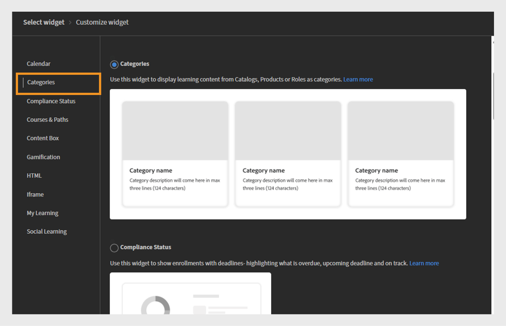

# Widgets toevoegen en configureren

## Agendawidget

De widget Kalender geeft uw geplande sessies en training weer. U kunt door de kalender bladeren om de trainingen te bekijken die voor de komende maanden zijn gepland. Zo kunt u trainingssessies per maand weergeven en naar links of rechts schuiven.

Een beheerder kan de kalenderwidget aan een pagina toevoegen om trainingsschema&#39;s weer te geven. Studenten kunnen met de kalender communiceren door door maanden te schuiven om de volgende sessies te zien. Ze kunnen sessies filteren om snel relevante training te vinden.

### Een kalenderwidget toevoegen

In een financieel bedrijf met afzonderlijke CSM-teams (Sales and Customer Success Manager) kunnen beheerders deze widget gebruiken om teamspecifieke trainingssessies te markeren. Bijvoorbeeld:

* Het Sales-team kan de komende sessies over productupdates, compatibiliteitstraining en workshops bekijken.
* Het CSM-team kan workshops over onboarding van klanten, training voor klantcommunicatie en programma&#39;s voor uitmuntende services bekijken.

De widget kalender configureren:

1. Meld u als beheerder aan bij Adobe Learning Manager.
2. Selecteer **[!UICONTROL Branding]** in de linkernavigatieruit.
3. Selecteer **[!UICONTROL de Pagina&#39;s van de Douane]**.
4. Selecteer de vereiste pagina en selecteer dan **[!UICONTROL het Ontwerp van de Pagina]**.
5. Selecteer **[!UICONTROL geef]** uit en selecteer dan de lay-out.
6. Selecteer **[!UICONTROL Widget]** toevoegen.
7. Selecteer **[!UICONTROL Kalender]** en selecteer dan **[!UICONTROL ga]** verder.

   
   _het selectiescherm dat van Widget de widget van de Kalender optie benadrukt om trainingszittingen in een kalender te tonen_

8. Typ a **[!UICONTROL titel van Widget]** en **[!UICONTROL beschrijving Widget]**.

   
   _het aanpassingsscherm van de widget van de Kalender, waar de beheerders de widgettitel, de beschrijving kunnen plaatsen, en catalogi_ selecteren

9. Selecteer een catalogus door te zoeken om zijn cursussen en het leren wegen binnen de **[!UICONTROL widget van de Kalender]** te tonen.
10. Selecteer **[!UICONTROL Widget]** toevoegen.

De kalenderwidget wordt toegevoegd aan de pagina. De beheerder kan andere widgets toevoegen en de pagina publiceren.

>[!NOTE]
>
>Als er geen catalogi zijn geselecteerd, worden sessies uit alle catalogi weergegeven.

## Categorieënwidget

De widget Categorieën geeft leerinhoud weer die als categorieën is ingedeeld op basis van catalogi, producten of rollen. Zo kunnen studenten gemakkelijk bladeren naar trainingen die zijn gegroepeerd op onderwerpen, afdelingen, vaardigheden of andere relevante classificaties.

Beheerders voegen de widget Categorieën aan een pagina toe om gecategoriseerde leeropties weer te geven. Studenten gebruiken de widget om training te verkennen door een categorie met interesses te selecteren, waarna gerelateerde cursussen of paden worden weergegeven.

De artikelen van de Catalogi van de mening [&#x200B; en &#x200B;](/help/migrated/administrators/feature-summary/catalogs.md) Recommendations [&#x200B; om meer over het vormen catalogi en aanbevelingen te leren.](/help/migrated/recommendations-adobe-learning-manager.md)

### Een categoriewidget toevoegen

In een bedrijf voor financiële dienstverlening hebben verschillende teams vaak toegang nodig tot rolspecifieke training. Met de widget Categorieën kunt u leerinhoud ordenen in duidelijke, klikbare tegels, waardoor verkoop- en CSM-teams gemakkelijker kunnen vinden wat ze nodig hebben.

De widget Categorieën configureren:

1. Meld u als beheerder aan bij Adobe Learning Manager.
2. Selecteer **[!UICONTROL Branding]** in de linkernavigatieruit.
3. Selecteer **[!UICONTROL de Pagina&#39;s van de Douane]**.
4. Selecteer de vereiste pagina en selecteer dan **[!UICONTROL het Ontwerp van de Pagina]**.
5. Selecteer **[!UICONTROL geef]** uit en selecteer dan de lay-out.
6. Selecteer **[!UICONTROL Widget]** toevoegen.
7. Selecteer **[!UICONTROL Categorieën]** en selecteer dan **[!UICONTROL ga]** verder.

   
   _het selectiescherm dat van Widget de optie van Categorieën benadrukt widget om het leren inhoud door catalogus, product, of rol voor gemakkelijke navigatie te organiseren_

8. Selecteer de details die op de categoriekaarten moeten worden weergegeven:

   * **[!UICONTROL Beeld van de Categorie]**
   * **[!UICONTROL Beschrijving van de Categorie]**

9. Typ a **[!UICONTROL titel van Widget]** en **[!UICONTROL beschrijving Widget]**.
10. Zoek naar en kies een catalogus van de **[!UICONTROL bron van de Categorie]**.

    
    _vorm de opties van Categorieën widget om widgettitel en beschrijving te plaatsen, en de categorielobron te selecteren_

11. Selecteer **[!UICONTROL Widget]** toevoegen.

De widget Categorieën wordt aan de pagina toegevoegd. Beheerders kunnen andere widgets toevoegen en de pagina publiceren.

## Compatibiliteitswidget

De widget compatibiliteitsstatus geeft de voortgang van een student weer in de richting van het voldoen aan de compatibiliteits- of certificeringsvereisten. Het toont de status van de verplichte training die aan de gebruiker is toegewezen, inclusief voltooide, in behandeling zijnde of achterstallige cursussen.

Beheerders voegen de widget compatibiliteitsstatus toe aan pagina&#39;s om inzicht te geven in de voortgang van de training op het gebied van naleving. Studenten gebruiken dit om snel te controleren welke verplichte cursussen ze hebben voltooid en welke nog steeds aandacht vereisen.

### Een compatibiliteitsstatuswidget toevoegen

In een bedrijf voor financiële dienstverlening moeten zowel het Sales-team als het Customer Success Manager (CSM)-team de nalevingstraining op tijd voltooien. Met de widget compatibiliteitsstatus kunnen studenten de komende deadlines en hun trainingsvoortgang gemakkelijker rechtstreeks vanaf hun teamspecifieke pagina&#39;s bijhouden.

De compatibiliteitswidget configureren:

1. Meld u als beheerder aan bij Adobe Learning Manager.
2. Selecteer **[!UICONTROL Branding]** in de linkernavigatieruit.
3. Selecteer **[!UICONTROL de Pagina&#39;s van de Douane]**.
4. Selecteer de vereiste pagina en selecteer dan **[!UICONTROL het Ontwerp van de Pagina]**.
5. Selecteer **[!UICONTROL geef]** uit en selecteer dan de lay-out.
6. Selecteer **[!UICONTROL Widget]** toevoegen.
7. Selecteer **[!UICONTROL Status van de Naleving]** en selecteer dan **[!UICONTROL ga]** verder.

   
   _het selectiescherm van de Widget die de widget van de Status van de Naleving benadrukt wordt gebruikt om studentinschrijvingen met deadlines en statusindicatoren te tonen_

8. Typ a **[!UICONTROL titel van Widget]** en **[!UICONTROL beschrijving Widget]**.

   
   _het widgetscherm van de Status van de Naleving, waar de beheerders de widgettitel en de beschrijving kunnen plaatsen om inschrijvingsdeadlines en status voor studenten te tonen_

9. Selecteer **[!UICONTROL toevoegen widget]**.

De compatibiliteitsstatuswidget wordt aan de pagina toegevoegd. Beheerders kunnen andere widgets toevoegen en de pagina publiceren.

## Widget Cursussen en paden

De widget Cursussen en paden geeft aanbevolen cursussen en leerpaden weer op maat van de rol, interesses of trainingsbehoeften van de student.

Beheerders voegen de widget Cursussen en paden toe aan pagina&#39;s om belangrijke leerinhoud voor specifieke doelgroepen te markeren. Studenten gebruiken de widget om door aanbevolen cursussen of paden te bladeren en kunnen zich rechtstreeks inschrijven voor de cursussen.

### Een widget cursussen en paden toevoegen

Een financieel bedrijf wil rollenspecifieke trainingspagina&#39;s maken voor zijn twee teams: Sales en Customer Success Managers (CSM). Met de widget Cursussen en paden kunt u de meest relevante leerprogramma&#39;s voor elk team weergeven.

De widget Cursussen en Paden configureren:

1. Meld u als beheerder aan bij Adobe Learning Manager.
2. Selecteer **[!UICONTROL Branding]** in de linkernavigatieruit.
3. Selecteer **[!UICONTROL de Pagina&#39;s van de Douane]**.
4. Selecteer de vereiste pagina en selecteer dan **[!UICONTROL het Ontwerp van de Pagina]**.
5. Selecteer **[!UICONTROL geef]** uit en selecteer dan de lay-out.
6. Selecteer **[!UICONTROL Widget]** toevoegen.
7. Selecteer **[!UICONTROL Cursussen &amp; Wegen]**.

   
   _het selectiescherm dat van Widget de Cursussen &amp; widget van Wegen voor het tonen van Cursussen, het Leren Wegen, Certificeringen, en de Hulpmiddelen van de Taak als interactieve kaarten voor studenten benadrukt_

8. Selecteer **[!UICONTROL Doorgaan]**.
9. De titel van de Widget van het type **[!UICONTROL en]** beschrijving van Widget **[!UICONTROL .]**
10. Selecteer de catalogi of kies handmatig maximaal 25 cursussen om weer te geven.

_Cursussen &amp; Widget van Wegen waar de beheerders de widgettitel, de beschrijving plaatsen, en selecteren Cursussen of Lerende Wegen om als interactieve kaarten_ te tonen
&#x200B;11. Selecteer **[!UICONTROL voeg widget]** toe.

De widget Cursussen en paden wordt aan de pagina toegevoegd. Beheerders kunnen andere widgets toevoegen en de pagina publiceren.

## Inhoudsvakwidget

Met de widget Inhoudsvak kunnen beheerders aangepaste inhoud zoals tekst, afbeeldingen, aankondigingen of koppelingen naar een pagina toevoegen. Het biedt een flexibele ruimte voor het rechtstreeks delen van belangrijke informatie, tips, updates of promotieberichten binnen de leeromgeving.

### Een inhoudsvakwidget toevoegen

Een financieel bedrijf wil rollenspecifieke trainingspagina&#39;s maken voor zijn twee teams: Sales en Customer Success Managers (CSM). De widget Inhoudsvak kan worden gebruikt om aangepaste secties toe te voegen met titels, beschrijvingen, afbeeldingen en actieknoppen die gerichte bronnen, updates en motivatieberichten delen.

De widget Inhoudsvak configureren:

1. Meld u als beheerder aan bij Adobe Learning Manager.
2. Selecteer **[!UICONTROL Branding]** in de linkernavigatieruit.
3. Selecteer **[!UICONTROL de Pagina&#39;s van de Douane]**.
4. Selecteer de vereiste pagina en selecteer dan **[!UICONTROL het Ontwerp van de Pagina]**.
5. Selecteer **[!UICONTROL geef]** uit en selecteer dan de lay-out.
6. Selecteer **[!UICONTROL Widget]** toevoegen.
7. Selecteer **[!UICONTROL Vak van de Inhoud]** en selecteer dan **[!UICONTROL ga]** verder.

   
   _het selectiescherm van de Widget die de widget van het Doos van de Inhoud voor het tonen van douanekopieën, tekst, en actieknopen benadrukt om studentenbetrokkenheid te verbeteren_

8. Typ de **[!UICONTROL Titel]** en **[!UICONTROL Beschrijving]**.
9. Typ de tekst in het **[!UICONTROL de knoopetiket van de Actie]** en verstrek een verbinding.
10. Selecteer een van de opties voor Achtergrondvulling:

    * **[!UICONTROL Kleur]**: Selecteer de kleur van de kleurenplukker of typ de kleurencode op het tekstgebied.
    * **[!UICONTROL Beeld]**: Doorblader en upload een beeld.

11. Pas de kaderhoogte aan gebruikend de **[!UICONTROL optie van de de kaderhoogte van de Inhoud]**.
12. Selecteer de opties voor tekstopmaak.

    
    _het aanpassingsscherm van de Widget van de Doos van de Inhoud, waar de beheerders een titel, een beschrijving, een etiket van de actieknoop, en verbinding kunnen ingaan_

13. Selecteer **[!UICONTROL toevoegen widgets]**.

De widget Inhoudsvak wordt aan de pagina toegevoegd. Beheerders kunnen andere widgets toevoegen en de pagina publiceren.

## Gamificatiewidget

Beheerders voegen de gamificationwidget toe aan aangepaste pagina&#39;s om de prestaties van studenten te tonen, zoals verdiende badges, geaccumuleerde punten en rangschikkingen op leaderboards. Studenten kunnen hun voortgang volgen en resultaten met collega&#39;s vergelijken, wat motivatie en duurzame deelname stimuleert.

### Een gamificationwidget toevoegen

Een financieel bedrijf wil de betrokkenheid en motivatie van studenten bij de twee belangrijkste teams stimuleren: Sales en Customer Success Managers (CSM). De gamificationwidget kan worden gebruikt om studenten te belonen met punten, badges en rankings op het leaderboard voor het voltooien van de training en het actief deelnemen aan de training.

Voor het Sales-team kan gamification zich richten op het belonen van prestaties die verband houden met verkoopvaardigheden, productkennis en training voor klantbetrokkenheid. Voor het CSM-team kan dit de nadruk leggen op certificeringen van de klantenservice, compatibiliteitstraining en vaardigheden op het gebied van clientbeheer.

De gamificationwidget configureren:

1. Meld u als beheerder aan bij Adobe Learning Manager.
2. Selecteer **[!UICONTROL Branding]** in de linkernavigatieruit.
3. Selecteer **[!UICONTROL de Pagina&#39;s van de Douane]**.
4. Selecteer de vereiste pagina en selecteer dan **[!UICONTROL het Ontwerp van de Pagina]**.
5. Selecteer **[!UICONTROL geef]** uit en selecteer dan de lay-out.
6. Selecteer **[!UICONTROL Widget]** toevoegen.
7. Selecteer **[!UICONTROL Gamification]** en selecteer dan **[!UICONTROL ga]** verder.

   
   _het selectiescherm dat van Widget de widget benadrukt Gamification wordt gebruikt om het leren activiteiten en prestaties op het leaderboard te tonen_

8. Typ de **[!UICONTROL titel van Widget]** en **[!UICONTROL beschrijving Widget]**.
9. Selecteer **[!UICONTROL toevoegen widgets]**.

De gamificationwidget wordt aan de pagina toegevoegd. Beheerders kunnen andere widgets toevoegen en de pagina publiceren.

## HTML-widget

Met de widget HTML kunnen beheerders aangepaste HTML-code rechtstreeks insluiten in een pagina. Zo kunt u op maat gemaakte inhoud toevoegen, tools van derden integreren of interactieve elementen opnemen die verder gaan dan de standaardwidgetfunctionaliteit. Het ondersteunt rijke aanpassingen via HTML, CSS en zelfs JavaScript, waardoor unieke ontwerpen en externe integraties mogelijk worden binnen het leerplatform.

### Een HTML-widget toevoegen

Een financieel bedrijf wil aangepaste, interactieve content aanbieden die is afgestemd op de twee belangrijkste teams: Sales en Customer Success Managers (CSM). De HTML-widget kan worden gebruikt om aangepaste, op HTML gebaseerde bronnen, zoals financiële dashboards, datavisualisaties, interactieve formulieren of tools voor marktanalyse, rechtstreeks in te sluiten in hun trainings- of teampagina&#39;s.

De HTML-widget configureren:

1. Meld u als beheerder aan bij Adobe Learning Manager.
2. Selecteer **[!UICONTROL Branding]** in de linkernavigatieruit.
3. Selecteer **[!UICONTROL de Pagina&#39;s van de Douane]**.
4. Selecteer de vereiste pagina en selecteer dan **[!UICONTROL het Ontwerp van de Pagina]**.
5. Selecteer **[!UICONTROL geef]** uit en selecteer dan de lay-out.
6. Selecteer **[!UICONTROL Widget]** toevoegen.
7. Selecteer **[!UICONTROL HTML]** en selecteer dan **[!UICONTROL ga]** verder.

   
   _het selectiescherm dat van Widget de widget van de HTML benadrukt voor het aanpassen van pagina&#39;s gebruikend HTML, CSS, en code JavaScript_

8. Typ uw **[!UICONTROL HTML]**, **[!UICONTROL CSS]**, en **[!UICONTROL JavaScript]** code in de respectieve gebieden.
9. Selecteer **[!UICONTROL toevoegen widget]**.

De HTML-widget wordt aan de pagina toegevoegd. Beheerders kunnen andere widgets toevoegen en de pagina publiceren.

## IFramwidget

De Iframe-widget geeft de inhoud van een externe URL rechtstreeks weer binnen een pagina op het leerplatform. Een externe website, tool of toepassing wordt in een frame ingesloten, zodat studenten die inhoud kunnen bekijken en ermee kunnen werken zonder het LMS te verlaten.

### Een iFrame-widget toevoegen

Een financieel bedrijf wil externe tools en resources naadloos insluiten in zijn interne trainings- en samenwerkingspagina&#39;s voor zijn Sales- en Customer Success Managers (CSM)-teams. De Iframe-widget kan worden gebruikt om financiële dashboards van derden, marktanalyseplatforms of clientbeheerportalen rechtstreeks in de LMS-interface weer te geven.

De Iframe-widget configureren:

1. Meld u als beheerder aan bij Adobe Learning Manager.
2. Selecteer **[!UICONTROL Branding]** in de linkernavigatieruit.
3. Selecteer **[!UICONTROL de Pagina&#39;s van de Douane]**.
4. Selecteer de vereiste pagina en selecteer dan **[!UICONTROL het Ontwerp van de Pagina]**.
5. Selecteer **[!UICONTROL geef]** uit en selecteer dan de lay-out.
6. Selecteer **[!UICONTROL Widget]** toevoegen.
7. Selecteer **[!UICONTROL Iframe]** en selecteer dan **[!UICONTROL ga]** verder.

   
   _het selectiescherm van Widget dat de widget Iframe voor het inbedden van externe toepassingen of Web-pagina&#39;s binnen een geselecteerde sectie benadrukt_

8. Typ URL in de **[!UICONTROL Pagina verbonden aan de knoop van de Actie]** optie.
9. Pas de hoogte aan Iframe gebruikend de **[!UICONTROL optie van de iframe hoogte]**.

   
   _Iframe widget aanpassingsscherm, waar de beheerders een pagina URL kunnen ingaan en iframe hoogte specificeren om externe inhoud in te bedden_

10. Selecteer **[!UICONTROL toevoegen widget]**.

De Iframe-widget wordt aan de pagina toegevoegd. Beheerders kunnen andere widgets toevoegen en de pagina publiceren.

Beheerders moeten het toegangstoken als een queryparameter opnemen in de iframe-URL om de juiste details op te halen. Als u bijvoorbeeld informatie van Adobe Learning Manager in een iframe wilt weergeven, moet de URL de volgende parameters bevatten:

* userId: De unieke id van de student
* accountId: De account-id die aan de student is gekoppeld
* token: het verificatietoken dat is vereist voor API-aanroepen
* landinstelling: de taal of locale voorkeur van de student

## Mijn leerwidget

De widget Mijn leerervaring biedt studenten een gepersonaliseerde weergave van alle cursussen, leerprogramma&#39;s en certificeringen die door hen zijn toegewezen of ingeschreven. Het ordent leerinhoud op type en deadline, zodat studenten hun voortgang gemakkelijk kunnen volgen en toegang hebben tot leermateriaal. Deze widget helpt studenten zich te blijven richten op hun vereiste training en de komende deadlines kort te zien.

### Een widget Mijn leerervaring toevoegen

Een financieel bedrijf wil gepersonaliseerde leerervaringen bieden die zijn afgestemd op de twee belangrijkste teams: Sales en Customer Success Managers (CSM). De widget Mijn leerervaring kan worden gebruikt om elk teamlid een geconsolideerde weergave te bieden van de toegewezen cursussen, lopende leerpaden en certificeringen.

De widget Mijn leerervaring configureren:

1. Meld u als beheerder aan bij Adobe Learning Manager.
2. Selecteer **[!UICONTROL Branding]** in de linkernavigatieruit.
3. Selecteer **[!UICONTROL de Pagina&#39;s van de Douane]**.
4. Selecteer de vereiste pagina en selecteer dan **[!UICONTROL het Ontwerp van de Pagina]**.
5. Selecteer **[!UICONTROL geef]** uit en selecteer dan de lay-out.
6. Selecteer **[!UICONTROL Widget]** toevoegen.
7. Selecteer **[!UICONTROL Mijn Leren]** en selecteer dan **[!UICONTROL ga]** verder.

   
   _het selectiescherm van Widget, dat Mijn het Leren widget benadrukt wordt gebruikt om de gepersonaliseerde lijst van de student van ingeschreven cursussen te tonen_

8. Typ de **[!UICONTROL titel van Widget]** en **[!UICONTROL beschrijving Widget]**.
9. Selecteer **[!UICONTROL toevoegen widget]**.

Mijn leerwidget wordt aan de pagina toegevoegd. Beheerders kunnen andere widgets toevoegen en de pagina publiceren.

## Widget Sociaal leren

Met de widget Sociaal leren kunnen studenten interactie aangaan, ideeën delen en samenwerken binnen het leerplatform. Het ondersteunt het posten van verschillende soorten inhoud, zoals tekst, video&#39;s, audio, screenshots, vragen en opiniepeilingen. Studenten kunnen berichten plaatsen, reageren, upvotes of downvotes geven, waardoor het delen van kennis en betrokkenheid van collega&#39;s worden bevorderd. Deze widget creëert een informele leerruimte die formele training aanvult door sociale interactie en permanente educatie aan te moedigen.

### Een widget Sociaal leren toevoegen

Een financieel bedrijf wil samenwerken en kennis delen tussen zijn twee grote teams: Sales en Customer Success Managers (CSM). De widget Sociaal leren kan worden gebruikt om interactieve ruimten te maken waar teamleden vragen plaatsen, best practices delen, nuttige inhoud uploaden en discussies voeren.

De widget Sociaal leren configureren:

1. Meld u als beheerder aan bij Adobe Learning Manager.
2. Selecteer **[!UICONTROL Branding]** in de linkernavigatieruit.
3. Selecteer **[!UICONTROL de Pagina&#39;s van de Douane]**.
4. Selecteer de vereiste pagina en selecteer dan **[!UICONTROL het Ontwerp van de Pagina]**.
5. Selecteer **[!UICONTROL geef]** uit en selecteer dan de lay-out.
6. Selecteer **[!UICONTROL Widget]** toevoegen.
7. Selecteer **[!UICONTROL Sociaal Leren]** en selecteer dan **[!UICONTROL ga]** verder.

   
   _het selectiescherm dat van Widget de Sociaal het Leren widget voor het tonen van berichten benadrukt om samenwerking en engagement aan te moedigen_

8. Typ de **[!UICONTROL titel van Widget]** en **[!UICONTROL beschrijving Widget]**.
9. Selecteer **[!UICONTROL toevoegen widget]**.

De widget Sociaal leren wordt aan de pagina toegevoegd. Beheerders kunnen andere widgets toevoegen en de pagina publiceren.

## Wat is er nieuw

Nadat u widgets op de pagina&#39;s hebt geconfigureerd, gebruikt u menu&#39;s om de pagina&#39;s samen te ordenen en te groeperen.
