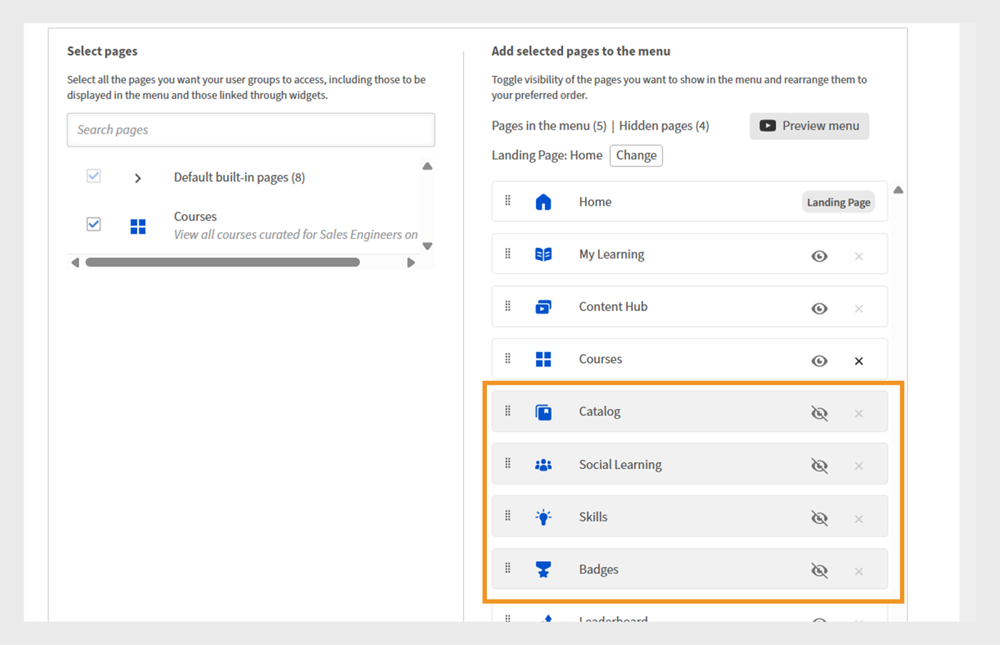

# Een menu maken

Als beheerder van een financieel bedrijf met twee hoofdteams, Sales en Customer Success Managers (CSM), moet u afzonderlijke menu&#39;s maken met hun respectievelijke pagina&#39;s. Zo kunnen studenten gemakkelijk cursussen vinden die relevant zijn voor hun rollen in hun eigen menu.

Door gebrek, kunnen de beheerders standaardmenu op de **[!UICONTROL pagina van het Menu]** zien, die niet kan worden geschrapt. Dit menu bevat alle ingebouwde pagina&#39;s die momenteel zichtbaar zijn in de Learner-app.

Een menu maken:

1. Meld u als beheerder aan bij Adobe Learning Manager.
2. Selecteer **[!UICONTROL Branding]** in de linkernavigatieruit.
3. Selecteer **[!UICONTROL Menu]** en selecteer dan **[!UICONTROL creeer]**.

   
   _het scherm van het Menu dat opties toont om, aangepaste menu&#39;s voor verschillende studentengroepen te bekijken te organiseren en te creëren_

4. Typ de **[!UICONTROL naam van het Menu]** (bijvoorbeeld, Opleiding van het Product) en selecteer de gebruikersgroep in **[!UICONTROL Zichtbaar aan]** optie.

   
   _creeer het menuscherm, waar de beheerders een menunaam voor intern gebruik kunnen ingaan en gebruikersgroepen specificeren om menuzicht te controleren_

5. Hieronder vindt u het type pagina&#39;s dat beschikbaar is in het menu:
   * **[!UICONTROL Ingebouwde pagina&#39;s]**: Dit zijn de standaardpagina&#39;s die met Adobe Learning Manager, zoals Huis, Mijn het Leren, en Catalogus komen. Beheerders kunnen de ingebouwde pagina&#39;s niet uit het menu verwijderen. Ze kunnen de pagina&#39;s verbergen in het menu.
   * **[!UICONTROL de pagina&#39;s van de Douane]**: Dit zijn beheerder-gecreeerde pagina&#39;s gebruikend de Bouwer van de Ervaring. Met aangepaste pagina&#39;s kunnen organisaties merkgebonden, rolspecifieke of op gebeurtenissen gebaseerde ervaringen ontwerpen door widgets, lay-outs en menu&#39;s toe te voegen die zijn afgestemd op verschillende studentengroepen.
6. Selecteer **[!UICONTROL Verandering]** naast **[!UICONTROL het Bestaan Pagina]** om de het landen pagina van de student bij te werken.

   
   _het configuratiescherm van het Menu die de optie tonen om pagina&#39;s te selecteren om de openingspagina van de interface van de Student te veranderen_

7. Kies de douanepagina van de **[!UICONTROL Uitgezochte pagina&#39;s]** optie. Beheerders moeten alleen gepubliceerde aangepaste pagina&#39;s kunnen selecteren, niet de pagina&#39;s in de conceptstatus.

   
   _het selectiescherm van de Pagina, dat de optie benadrukt om de douanepagina voor gebruikersgroepen te omvatten en de menuorde aan te passen_

8. Sleep om de pagina&#39;s in het menu opnieuw te rangschikken.
9. Selecteer **[!UICONTROL het menu van de Voorproef]** om het menu te bekijken alvorens het op te slaan.
10. Selecteer **[!UICONTROL Opslaan]**.

Het gemaakte menu is zichtbaar voor de geselecteerde studenten. Ze hebben toegang tot de aangepaste pagina&#39;s via hun gebruikersinterface voor studenten.

_Student UI die de douanepagina met uitgelichte opleidingsmodules en gemakkelijke navigatie van het zijbalkmenu toont_

## Een submenu maken

Beheerders kunnen een submenu maken in het menu en er aangepaste pagina&#39;s aan toevoegen. Submenu&#39;s hebben geen startpagina.

Een submenu maken:

1. Selecteer **[!UICONTROL creeer submenu]** in de **[!UICONTROL configuratie van het Menu]** pagina.

   
   _de configuratiepagina&#39;s van het Menu het benadrukken leiden submenuoptie tot stand brengen om submenu&#39;s voor de studenten_ te creëren

2. Selecteer de taal en typ de submenutitel.
3. Selecteer het pictogram dat naast het submenu moet worden weergegeven.
4. Selecteer **[!UICONTROL Nieuwe Taal]** toevoegen om zelfde submenu voor verschillende scènes tot stand te brengen. Als u bijvoorbeeld Engels en Frans toevoegt, zien studenten met de interfacetaal Engels geselecteerd het Engelse submenu, terwijl studenten met Frans geselecteerd het Franse submenu zien.

   
   _Submenu herinnering die opties toont om de submenutitel, taal, en pictogram voor vertoning in het menu te selecteren_

5. Selecteer **[!UICONTROL Doorgaan]**.
6. Sleep de pagina&#39;s onder het submenu.

## Verborgen pagina&#39;s instellen

Met de **[!UICONTROL optie Pagina&#39;s verbergen]** kunnen beheerders de gebruikersinterface van de student overzichtelijk houden door minder pagina&#39;s weer te geven. Beheerders kunnen pagina&#39;s verbergen in het menu, zodat studenten deze niet zien in de gebruikersinterface van de student, maar studenten kunnen deze pagina&#39;s wel op andere manieren bereiken. De pagina Catalogus kan bijvoorbeeld worden verborgen in het menu, maar worden geopend via de startpagina van de student.

_het configuratiescherm van het Menu die verborgen pagina&#39;s zoals Catalogus, Sociaal Leren, Vaardigheden, en Badges tonen_

>[!NOTE]
>
>Pagina&#39;s in een submenu kunnen niet rechtstreeks worden verborgen. Als u een pagina wilt verbergen, sleept u deze eerst uit het submenu en vervolgens verbergt u de pagina.

## Wat is er nieuw

Nadat u pagina&#39;s, widgets en menu&#39;s hebt ingesteld, verbetert u de algehele leerervaring door aanpassingen toe te voegen met behulp van JavaScript en CSS.

