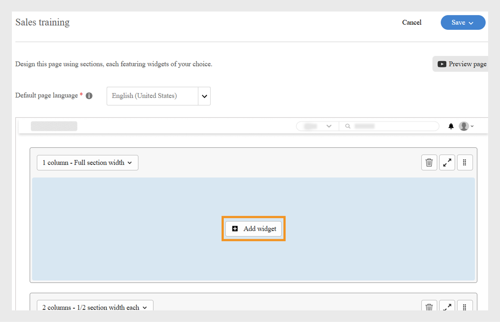
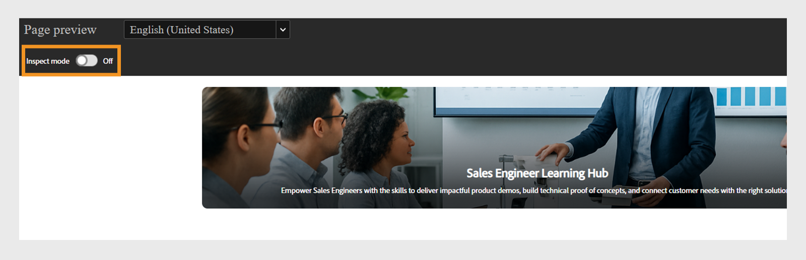

# Een aangepaste pagina maken in Experience Builder

Als beheerder van een bedrijf voor financiële dienstverlening beheert u twee teams: Verkoop en Klantsucces. Elk team heeft unieke leervereisten, maar beide hebben hetzelfde standaard leerportaal gebruikt. Dit heeft geleid tot verwarring, verwarring en een lage betrokkenheid van studenten.
Om deze uitdaging op te lossen zonder te investeren in een headless build of te wachten op een aangepaste ontwikkelaarsoplossing, kun je Experience Builder in Adobe Learning Manager gebruiken. Met pagina&#39;s, widgets en menu&#39;s kunt u in slechts een paar stappen en zonder codering branded, rolspecifieke portalen ontwerpen.

Een aangepaste pagina maken voor het Sales Engineering-team in Adobe Learning Manager:

1. Meld u als beheerder aan bij Adobe Learning Manager.
2. Selecteer **[!UICONTROL Branding]** in de linkernavigatieruit.
3. Selecteer **[!UICONTROL de Pagina&#39;s van de Douane]**.
4. Selecteer **[!UICONTROL creeer pagina]**.

   
   _het scherm van de Pagina&#39;s van de Douane die de Create paginaoptie tonen om nieuwe douane het leren ervaringen te ontwerpen_

5. Typ de **[!UICONTROL naam van de Pagina]** (bijvoorbeeld, de opleiding van de Verkoop voor het team van de Verkoop).
6. Typ de **[!UICONTROL beschrijving van de Pagina]**.

   
   _de opleidingspagina van de Verkoop opstelling in Adobe Learning Manager, die gebieden voor paginanaam, beschrijving, type, URL, en pictogramconfiguratie tonen voor het creëren van een gericht verkooptrainingsportaal_

7. Selecteer het paginatype uit het volgende:

   * **[!UICONTROL bouw gebruikend ALM widgets]**: de beheerder kan een pagina creëren gebruikend bestaande widgets van Adobe Learning Manager. Typ de aangepaste tekenreeks in het veld Pagina-URL. Deze tekenreeks wordt toegevoegd aan de URL van uw aangepaste pagina.
   * **[!UICONTROL Externe pagina]**: de beheerder kan een URL voor de externe pagina toevoegen. Als u het paginatype extern selecteert, typt u de externe pagina-URL in het tekstveld Pagina-URL.

8. Selecteer het **[!UICONTROL pictogram van de Verandering]** om het pictogram van de pagina te veranderen.
9. Selecteer **[!UICONTROL Nieuwe Taal]** toevoegen om de standaardtaal voor de pagina toe te voegen.
10. Selecteer **[!UICONTROL Opslaan]**.

De pagina is gemaakt en opgeslagen als concept in de sectie Aangepaste pagina&#39;s. Beheerders kunnen de opgemaakte pagina&#39;s bewerken en ontwerpen met behulp van de widgets.

De volgende stap bestaat uit het toevoegen van een lay-out aan de aangepaste pagina, waar u widgets kunt toevoegen en configureren.

## Paginalay-out in Experience Builder

Ontwerp uw pagina door de juiste sectie-indeling te selecteren in het vervolgkeuzemenu. De maximale breedte voor elke lay-out is 1212 pixels. Maak een keuze uit de volgende sectieopties op basis van het aantal widgets dat u wilt toevoegen en hun gewenste grootte:

* **[!UICONTROL 1 kolom - Volledige sectiebreedte]**: De inhoud overspant de volledige breedte van de sectie, die maximumruimte verstrekt.
* **[!UICONTROL 2 kolommen - 1/2 sectiebreedte elk]**: De sectie wordt gelijkmatig verdeeld in twee gelijk-breedtelekolommen.
* **[!UICONTROL 2 kolommen - 2/3 en 1/3 sectiebreedte]**: De belangrijkste inhoud neemt twee derde van de breedte in beslag, terwijl de zijinhoud één derde gebruikt.
* **[!UICONTROL 2 kolommen - 1/3 en 2/3 sectiebreedte]**: De zijinhoud neemt één derde, en de belangrijkste inhoud neemt twee derde van de sectie.
* **[!UICONTROL 3 kolommen - 1/3 sectiebreedte elk]**: De sectie verdeelt in drie gelijk-breedtekolommen.

>[!NOTE]
>
>Er kunnen maximaal tien widgets verticaal in alle lay-outs worden toegevoegd, behalve de 1 kolom - volledige sectiebreedte.

De lay-out voor de pagina Sales Training selecteren in Experience Builder:

1. Meld u als beheerder aan bij Adobe Learning Manager.
2. Selecteer **[!UICONTROL Branding]** in de linkernavigatieruit.
3. Selecteer **[!UICONTROL de Pagina&#39;s van de Douane]** en selecteer dan de vereiste pagina.
4. Selecteer **[!UICONTROL het Ontwerp van de Pagina]**.
5. Selecteer **[!UICONTROL Bewerken]**.

   
   _het ontwerp van de Pagina geeft het scherm voor een de opleiding van de Verkoop aangepaste pagina uit, die de Edit knoop voor toevoegt paginagedeelten, widgets, en lay-out_ benadrukken

6. Kies de opties van **[!UICONTROL Uitgezochte sectie lay-out]** dropdown.

   
   _de selectiedialoog van de lay-out van de Sectie staat beheerders toe om enige of multi-kolom widgetregelingen voor het ontwerp van de douanepagina te kiezen_

7. Selecteer **[!UICONTROL Doorgaan]**.

De toegevoegde lay-out heeft de volgende opties:

* **[!UICONTROL de rij van de Schrapping]**: Verwijder de rij uit de lay-out.
* **[!UICONTROL Passend het schermbreedte]**: Pas de lay-out aan zodat het automatisch resizes om uw scherm voor betere zicht te passen.
* **[!UICONTROL herordent]**: Verander de orde van lay-outs door hen te slepen en neer te zetten in de gewenste positie.

_lay-out van de Pagina tonend de lay-outopties om, de sectie_ opnieuw te rangschikken uit te breiden of te schrappen

De volgende stap is het toevoegen en configureren van widgets op de aangepaste pagina.

## Een widget toevoegen en configureren

Voeg de vereiste widgets toe aan de aangepaste pagina&#39;s voor verkooptraining op basis van de vereisten.

Een widget configureren op de aangepaste pagina Sales Training:

1. Selecteer **[!UICONTROL voeg widget]** in de lay-out toe.

   
   _het scherm van het paginaontwerp staat beheerders toe om widgets te selecteren en toe te voegen om hun cursuspagina&#39;s aan te passen_

2. Kies de **[!UICONTROL widget van de Doos van de Inhoud]** en selecteer dan **[!UICONTROL ga]** verder.

   
   _het selectiescherm van de Widget die de widget van het Doos van de Inhoud voor het tonen van douanekopieën, tekst, en actieknopen benadrukt om studentenbetrokkenheid te verbeteren_

3. Typ de **[!UICONTROL Titel]** en **[!UICONTROL Beschrijving]**.
4. Typ de tekst in het **[!UICONTROL de knoopetiket van de Actie]** en verstrek een verbinding.
5. Configureer de overige opties. Bekijk deze [&#x200B; sectie &#x200B;](/help/migrated/administrators/feature-summary/experience-builder/add-a-widget.md#content-box-widget) om meer over de **[!UICONTROL widget van de Doos van de Inhoud]** te leren.

   
   _Van de Doos van de inhoud widgets scherm die de opties tonen om widget_ te vormen

6. Typ de titel, de beschrijving, en het etiket van de actieknoop in het **[!UICONTROL widget van de Doos van de Inhoud]** configuratiescherm voor de ingenieurs van de Verkoop
7. Selecteer **[!UICONTROL toevoegen widget]**.
8. Selecteer **[!UICONTROL sparen]** en kies van de volgende opties:
a. **[!UICONTROL sparen als Ontwerp]**: De pagina zal als ontwerp worden bewaard. De beheerder kan de pagina later bewerken.
b. **[!UICONTROL sparen &amp; Publish]**: De pagina zal worden gepubliceerd, en de beheerder kan deze pagina aan het Menu toevoegen.

   
   _sparen opties staan beheerders toe om tussen het bewaren van een pagina als ontwerp voor het toekomstige uitgeven of het publiceren van het voor studenttoegang te kiezen_

De pagina kan worden opgeslagen als concept of worden gepubliceerd. Beheerders kunnen concepten bewerken voordat ze worden gepubliceerd en kunnen gepubliceerde pagina&#39;s ook bijwerken en opnieuw publiceren.

Volg dezelfde stappen om pagina&#39;s voor het Customer Success Manager-team te maken.

## Voorbeeld van de pagina bekijken

Een voorvertoning van de pagina&#39;s weergeven:

1. Meld u als beheerder aan bij Adobe Learning Manager.
2. Selecteer **[!UICONTROL Branding]** in de linkernavigatieruit.
3. Selecteer **[!UICONTROL de Pagina&#39;s van de Douane]**.
4. Selecteer de vereiste pagina en selecteer dan **[!UICONTROL het Ontwerp van de Pagina]**.
5. Selecteer **[!UICONTROL geef]** uit en selecteer dan **[!UICONTROL pagina van de Voorproef]** om de voorproef van het portaal te bekijken.

   
   _Voorproef van de pagina die een lay-out van de douanepagina met een banner toont, kenmerkte cursussen_

6. Selecteer Inspect-modus om de hoogte en breedte van de widget weer te geven.

   
   _het voorproefscherm van de pagina in de Bouwer van de Ervaring met gemarkeerde wijze van Inspect, toestaand beheerders om widgets_ te herzien en te inspecteren

## Een pagina maken in een andere taal

Beheerders kunnen meerdere landspecifieke aangepaste pagina&#39;s maken door tijdens het maken van de pagina de gewenste talen te selecteren in Nieuwe taal toevoegen. Als er meerdere talen worden toegevoegd, moeten de widgetgegevens voor elke taal afzonderlijk worden geconfigureerd op het corresponderende tabblad, naast het standaardtabblad voor de taal.

_de Beheerders kunnen widgetdetails voor extra talen, zoals Frans toevoegen, naast de standaardtaal_

## De levenscyclus van pagina&#39;s beheren

Beheerders kunnen de sectie Aangepaste pagina&#39;s gebruiken om de pagina&#39;s te bewerken, te verwijderen en te dupliceren.

### De pagina bewerken

De aangepaste pagina&#39;s bewerken:

1. Meld u als beheerder aan bij Adobe Learning Manager.
2. Selecteer Branding in het linkerdeelvenster.
3. Selecteer Aangepaste pagina&#39;s.
4. Selecteer de gewenste pagina en selecteer vervolgens Bewerken.
5. Selecteer Opslaan.

De pagina wordt met de wijzigingen bijgewerkt.

_geef de douanepagina uit, toestaand beheerders om de paginanaam, beschrijving, en type_ bij te werken

### De pagina verwijderen

De pagina verwijderen:

1. Meld u als beheerder aan bij Adobe Learning Manager.
2. Selecteer Branding in het linkerdeelvenster.
3. Selecteer Aangepaste pagina&#39;s.
4. Selecteer de gewenste pagina.
5. Selecteer Actie en selecteer vervolgens Verwijderen.

_het scherm van de Pagina&#39;s van de Douane tonend opties om douanepagina&#39;s te schrappen die voor product opleiding worden gecreeerd_

### De pagina dupliceren

De pagina dupliceren:

1. Meld u als beheerder aan bij Adobe Learning Manager.
2. Selecteer Branding in het linkerdeelvenster.
3. Selecteer Aangepaste pagina&#39;s.
4. Selecteer de gewenste pagina.
5. Selecteer Actie en selecteer vervolgens Dupliceren.

_het scherm van de Pagina&#39;s van de Douane tonend opties om de douanepagina&#39;s te dupliceren die voor product opleiding_ worden gecreeerd

## Wat is er nieuw

Nadat u de pagina hebt gemaakt, kunt u widgets op de aangepaste pagina&#39;s toevoegen en configureren volgens uw trainingsbehoeften.
