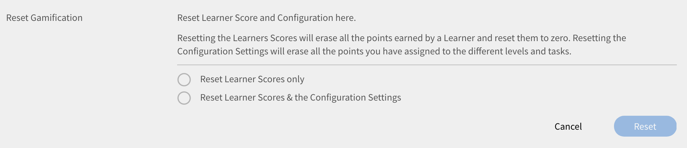
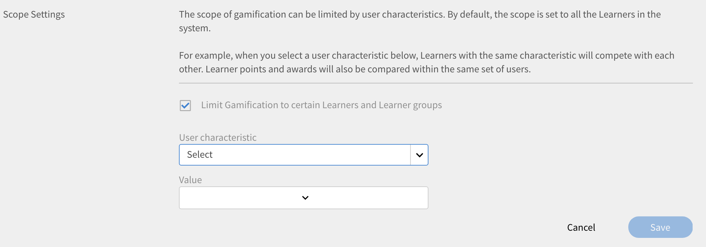

# Gamification

Gamification is het gebruik van gamedenken en gamemechanismen buiten de gamingcontext om gebruikers bij het leren te betrekken.

## Overzicht {#overview}

De Adobe Learning Manager beschikt over de functie Gamification, die is ontworpen om studenten te boeien en het leren te bevorderen via interactieve gamingselementen. Het stimuleert het gewenste gedrag van studenten via beloningen en stelt studenten in staat punten te verdienen en te concurreren met hun collega&#39;s. Deze functie verbetert de betrokkenheid en motivatie van gebruikers binnen het leerplatform.

Standaard zijn er enkele gamificationpunten en -gegevens beschikbaar om gebruikers het patroon bij te brengen. U kunt de punten naar wens aanpassen.

<!--A sample illustration is provided below that shows all the tasks and points.

-->

## Gamification-instellingen {#gamificationsettings}

Volg onderstaande stappen om de instellingen te openen:

1. Meld u aan als beheerder en klik in het linkerdeelvenster op **[!UICONTROL Gamification]**.
1. Als u een nieuw Learning Manager-account maakt, is gamification standaard uitgeschakeld. Klik rechtsboven op de pagina op **[!UICONTROL Inschakelen]** om gamification aan te zetten.

## Punten instellen {#setuppoints}

Aan de hand van onderstaande stappen kunnen beheerders gamificationpunten voor studenten instellen:

1. Klikken **[!UICONTROL Gamification]** nadat u zich als beheerder hebt aangemeld.\
   Er verschijnt een pagina met een lijst van bronzen, zilveren, gouden en platina niveaus en de vereiste punten om elk niveau te bereiken. Er wordt een lijst met taken en bijbehorende punten weergegeven.
1. Klik op het pictogram Bewerken naast elke taak om de punten in te stellen.
1. Wijzig hoe vaak taken voorkomen zoals het afronden van een bepaald aantal cursussen per maand, kwartaal of jaar.
1. Klik op **[!UICONTROL Opslaan]**.

*Punten instellen*

## Taken {#tasks}

Er zijn vijf gamificationtaken van studenten waarvoor de beheerder de punten kan instellen. Hieronder ziet u een illustratie van alle taken en punten van de studenten:

>[!NOTE]
>
>Gamificationpunten voor studenten binnen een bepaalde taak zijn niet cumulatief. Maar de punten worden cumulatief aan de studentenaccount toegevoegd als de studenten deze punten voor verschillende taken krijgen.

Bij het toewijzen van cursussen aan punten, moet de beheerder ervoor zorgen dat de studenten de punten geleidelijk aan krijgen.

**Voor snelle student**

Deze taak is van toepassing wanneer een student een bepaald aantal cursussen in een maand/kwartaal/jaar afrondt. Deze taak is bedoeld om snelle studenten aan te moedigen.

U ziet de volgende mogelijke scenario&#39;s:

1. Wanneer studenten in een maand/kwartaal/jaar twee cursussen afronden, krijgen ze 20 punten.
1. Wanneer studenten in een maand/kwartaal/jaar vier cursussen afronden , krijgen ze 100 punten.
1. Wanneer studenten acht cursussen voltooien, krijgen ze 300 punten.
1. Wanneer studenten tien cursussen voltooien, krijgen ze 500 punten.

>[!NOTE]
>
>De beheerder kan de tijdsperiode en het aantal cursussen dat vereist is om de bijbehorende punten te verdienen, aanpassen.

Binnen een taak worden punten niet cumulatief aan studenten toegekend. Stel dat een student een aantal cursussen afrondt en 20 punten krijgt. Wanneer studenten vier cursussen afronden, krijgen ze 100 punten, maar de bestaande 20 punten worden daarbij niet in aanmerking genomen.

**Voor zelfgestuurde student (a)**

Deze taak is van toepassing wanneer studenten zich voor het voorgeschreven aantal cursussen inschrijven en deze binnen een maand/kwartaal/jaar voltooien. In dit geval kan de beheerder deze taak inschakelen om punten toe te wijzen en deze aan te moedigen.

Mogelijke scenario&#39;s:

1. Wanneer studenten zich voor één cursus in een maand/kwartaal/jaar inschrijven, krijgen ze 50 punten.
1. Wanneer studenten zich voor twee cursussen in een maand/kwartaal/jaar inschrijven, krijgen ze 150 punten.

>[!NOTE]
>
>De beheerder kan de tijdsperiode en het aantal cursussen aanpassen.

**Voor zelfgestuurde student (b)**

Deze taak is van toepassing wanneer studenten zich inschrijven voor en meer cursussen afronden dan vereist in een maand/kwartaal/jaar. In dergelijke gevallen kan de beheerder deze taak inschakelen om punten toe te wijzen en hun aan te moedigen.

Mogelijke scenario&#39;s voor inschrijving van studenten voor cursussen naast de hun toegewezen cursussen:

1. Wanneer studenten zich voor één cursus per maand/kwartaal/jaar inschrijven, krijgen ze 20 punten.
1. Wanneer studenten zich voor twee cursussen in een maand/kwartaal/jaar inschrijven, krijgen ze 100 punten.
1. Wanneer studenten zich voor drie cursussen in een maand/kwartaal/jaar inschrijven, krijgen ze 300 punten.
1. Wanneer studenten zich voor vier cursussen in een maand/kwartaal/jaar inschrijven, krijgen ze 500 punten.

>[!NOTE]
>
>De beheerder kan de tijdsperiode en het aantal cursussen aanpassen. Het derde scenario kan bijvoorbeeld worden gewijzigd van drie naar vijf cursussen om 80 punten te verdienen.

**Voor bijscholing (a)**

Deze taak is van toepassing wanneer studenten een bepaald aantal competenties voltooien. De beheerder kan deze taak kiezen om de studenten aan te moedigen zoveel mogelijk competenties te verwerven.

Mogelijke scenario&#39;s voor bijscholing in competenties:

1. Wanneer de student één competentie behaalt, krijgen deze 100 punten.
1. Wanneer een student twee competenties behaalt, krijgen deze 300 punten.
1. Wanneer een student drie competenties behaalt, krijgen deze 600 punten.
1. Wanneer een student vier competenties behaalt, krijgen deze 900 punten.

>[!NOTE]
>
>De tijdsperiode is niet van toepassing op deze taak. De beheerder kan het aantal cursussen voor elk scenario aanpassen.

**Voor bijscholing (b)**

Deze taak is van toepassing telkens wanneer studenten elk hoger niveau binnen een competentie afronden.

Mogelijke scenario&#39;s voor bijscholing in niveaus binnen een bepaalde competentie:

1. Wanneer studenten één niveau bereiken, krijgen ze 100 punten.
1. Wanneer studenten twee niveaus bereiken, krijgen ze 200 punten.
1. Wanneer studenten drie niveaus bereiken, krijgen ze 500 punten.

>[!NOTE]
>
>De tijdsperiode is niet van toepassing op deze taak. Als studenten een hoger niveau bereiken en vervolgens een lager niveau van een competentie, krijgen ze alleen punten voor het hogere niveau.

**Ter referentie**

Deze taak is van toepassing op studenten die binnen N dagen na voltooiing terugkeren naar hun voltooide cursus.

Mogelijk scenario: wanneer een student binnen 30 dagen na voltooiing naar de voltooide cursus verwijst, ontvangt hij of zij 50 punten.

**Punten voor snelle voltooiing**

Deze taak is van toepassing op studenten wanneer zij binnen N dagen terugverwijzen naar een cursus met bladwijzer om de cursus te voltooien.

Mogelijk scenario:\
Wanneer een student een van de eerste 10 studenten wordt om de cursus te voltooien, krijgt hij/zij 100 punten.

**Punten voor tijdige voltooiing**

Deze taak is van toepassing op studenten wanneer zij een cursus voltooien binnen een bepaald aantal dagen na inschrijving voor de cursus.

Mogelijk scenario:\
Wanneer studenten een cursus voltooien binnen 10 dagen na het begin van de cursus, krijgen ze 100 punten.

**Uitgebreide student**

Deze taak is van toepassing op studenten die optioneel leermateriaal zoals voorbereidend werk, leermiddelen en taakhulpen per maand gebruiken.

Mogelijke scenario&#39;s:

1. Wanneer studenten één leerprogramma per maand afronden, krijgt hij/zij 20 punten.
1. Wanneer studenten twee leerprogramma&#39;s per maand afronden, krijgt hij/zij 40 punten.
1. Wanneer studenten drie leermateriaal per maand afronden, krijgt hij/zij 80 punten.

**Consistent leren**

Deze taak is van toepassing op studenten die gedurende een bepaald aantal dagen per week, maand of kwartaal deelnemen aan leeractiviteiten. De activiteiten omvatten het gebruik van leerinhoud, het downloaden van bronnen en taakhulpen.

Mogelijke scenario&#39;s:

1. Wanneer studenten één dag per week leeractiviteiten uitvoeren, krijgen ze 20 punten.
1. Wanneer studenten twee dagen per week deelnemen aan leeractiviteiten, krijgen ze 40 punten.
1. Wanneer studenten één dag per week deelnemen aan leeractiviteiten, krijgen ze 80 punten.

**Feedback**

Dit geldt voor studenten die feedback geven op cursussen.

Mogelijke scenario&#39;s:

1. Voor feedback over beoordelingen krijgen ze 20 punten.
1. Voor feedback over reacties krijgen ze 20 punten.
1. Voor feedback van managers krijgen ze 20 punten.

## Beheerdersacties {#administratoractions}

De beheerder kan een lijst met vertrouwelijke gebruikers maken, gamificationpunten opnieuw instellen en de gamificationfunctie voor studenten uitschakelen/inschakelen. Selecteer de **[!UICONTROL Instellingen]** op de gamificationpagina om de acties weer te geven zoals weergegeven in de onderstaande afbeelding.

*Gamificationopties voor een beheerder*

## Vertrouwelijkheidsinstellingen {#confidentialitysettings}

Indien nodig kunt u een aantal gebruikers in hoger management als vertrouwelijke gebruikers instellen. De gamificationactiviteiten van vertrouwelijke gebruikers zijn niet zichtbaar voor andere studenten op het leaderboard.

Vertrouwelijkheidsinstellingen kunnen voor zowel interne als externe gebruikers worden toegepast.

1. Klikken **[!UICONTROL Gamification]** > **[!UICONTROL Instellingen]** > **[!UICONTROL Vertrouwelijkheidsinstellingen]**.

*Vertrouwelijkheidsinstellingen weergeven*

1. Klik in de lijst met gebruikers op het selectievakje naast de gebruikersnaam en klik op Verbergen om de gebruiker een vertrouwelijke gebruiker te maken.

   >[!NOTE]
   >
   >U kunt de vertrouwelijke gebruikers in de lijst identificeren door het vinkje in vakje naast de gebruikersnaam.

1. Klik op het tabblad Vertrouwelijke gebruikers om de lijst met vertrouwelijke gebruikers te bekijken. Deze zijn standaard niet zichtbaar. Klik op het pijltje van de vervolgkeuzelijst om deze te bekijken.
1. Klik op het selectievakje naast de gebruikersnaam in de lijst met vertrouwelijke gebruikers en klik op Toevoegen om de gebruikers uit de lijst met vertrouwelijke gebruikers te verwijderen.

## Gamification opnieuw instellen {#resetgamification}

U kunt de gamificationpunten die een student heeft verdiend en ook de configuratie-instellingen opnieuw instellen. Als u ervoor kiest om de gebruikersscores opnieuw in te stellen, worden alle punten die door de gebruikers zijn verdiend, gewist en op nul teruggezet. Als u ervoor kiest om de gebruikersscores en configuratie-instellingen opnieuw in te stellen, worden alle standaardpunten die aan niveaus en taken zijn toegewezen op nul teruggezet.

De gamificationinstellingen opnieuw instellen kan worden toegepast op zowel interne als externe gebruikers.

Klik op Gamification opnieuw instellen en kies de gewenste optie om score en configuratie van de student opnieuw in te stellen. U kunt kiezen tussen Alleen Scores van de student opnieuw instellen en Scores van studenten en de Configuratie-instellingen opnieuw instellen. Klik op OK nadat u een selectie hebt gemaakt.

*De gamificationpunten opnieuw instellen*

## Gamification uitschakelen {#disablegamification}

Klikken [!UICONTROL **Gamification**] > **[!UICONTROL Instellingen]** > [!UICONTROL **Gamificationfunctie**]. Hiermee kunt u de gamificationfunctie en het leaderboard apart inschakelen voor uw studenten. Maak een keuze tussen Inschakelen voor interne studenten en Inschakelen voor externe studenten volgens de vereiste en klik op OK. Alle punten blijven behouden wanneer u de gamification weer inschakelt.

*gamification uitschakelen*

U kunt gamification voor zowel interne als externe gebruikers uitschakelen.

## Gamification op groepsniveau {#grouplevelgamification}

Beheerders kunnen de omvang van gamification definiëren door de omvangsinstellingen te wijzigen. U kunt gamification selectief inschakelen onder vergelijkbare profielgebruikers, groepen of locatie.

1. Klik in Beheerdersaanmelding op **[!UICONTROL Gamification]** in het linkerdeelvenster.
1. Openen **[!UICONTROL Gamifications]** > **[!UICONTROL Instellingen]** > **[!UICONTROL Bereik-instellingen]**. De [!UICONTROL Instellingen gamificationbereik] wordt weergegeven.

   

   *Het dialoogvenster Instellingen voor gamificationbereik weergeven*

1. Klik op de optie **[!UICONTROL Omvanginstellingen inschakelen]**.

1. Selecteer het gebruikerskenmerk in de vervolgkeuzelijst.

   <!---->

1. Selecteer de waarde die overeenkomt met gebruikerskenmerk dat u hebt gekozen. Als u bijvoorbeeld een gebruikerskenmerk als profiel hebt geselecteerd, moet u de waarde in de vervolgkeuzelijst selecteren. Ter referentie ziet u hieronder een voorbeeld van profielwaarden.

   <!---->

1. Klikken **[!UICONTROL Opslaan].**
