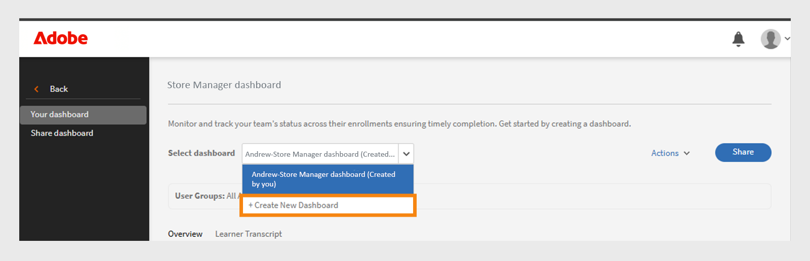

# Dashboard Groep succesvol

## Overzicht van het groepssuccesdashboard

Met het Group Success Dashboard (GSD) in Adobe Learning Manager kunnen beheerders en managers in real-time (60 minuten vertraging vanaf inschrijving, voortgang of voltooiing tot reflectie op het dashboard) de voortgang van de studenten in alle afdelingen of gebruikersgroepen volgen. Het ondersteunt het proactief volgen van cursusvoltooiing, inschrijving en openstaande acties, waardoor het makkelijker wordt om het leerproces voor teams te beheren. Bekijk dit [ artikel ](/help/migrated/administrators/feature-summary/add-users-user-groups.md) om meer over de groepen van de Gebruiker te leren.

## Belangrijke gebruiksscenario&#39;s

Het groepssuccesdashboard biedt het volgende:

* **vereenvoudigt het volgen van de studentenvooruitgang**: Het Dashboard van het Succes van de Groep verstrekt een gebruikersvriendelijk, in real time mening van studentengegevens, die de behoefte aan op Excel-Gebaseerde transcripten verminderen. Managers en beheerders kunnen snel de inschrijvingen van studenten en de cursusvoortgang bekijken om belangrijke scenario&#39;s zoals:

   * **de overzichtsbereidheid van het Overzicht van Prestaties**: De managers kunnen cursusvooruitgang voor teamleden vóór beoordelingscycli beoordelen.
   * **controle van de Naleving**: Identificeer studenten die geen verplichte opleiding hebben voltooid.
   * **team-vlakke het volgen**: Franchise, opslag, of regionale managers kunnen ervoor zorgen hun teams vereist het leren op tijd voltooien.

* **vergemakkelijkt teambeheer**: Het Dashboard van het Succes van de Groep is nuttig voor managers met kleine teams (onder 50 mensen), zoals opslagmanagers, franchise managers, dealermanagers of interne teams. Het biedt een teamweergave en stelt managers in staat om snel te controleren of hun team de vereiste cursussen heeft voltooid om bedrijfsdoelen te bereiken.

## Het groepssuccesdashboard gebruiken

Een beheerder kan de dashboards inschakelen en maken door er een naam aan te geven, gebruikersgroepen te selecteren en de cursussen of leerpaden te kiezen. De dashboards kunnen met andere beheerders of managers worden gedeeld.

### Het groepssuccesdashboard inschakelen

De beheerder moet het Groepssuccesdashboard voor het account inschakelen. Ga als volgt te werk om het groepssuccesdashboard in te schakelen:

1. Meld u aan als beheerder.
2. Selecteer **[!UICONTROL  Montages ] **en selecteer dan **[!UICONTROL Rapporten]**.
3. Selecteer de **[!UICONTROL knevel van het Dashboard zicht]**.
4. Typ de dashboardnaam (bijvoorbeeld, **[!UICONTROL Dashboard van de Manager van de Opslag]**).
   
   _Gebieden voor dashboardnaam, gebruikersgroep, en het leren padselectie_
5. Selecteer **[!UICONTROL Zichtbaarheid van het Overzicht]** om de overzichtssectie in het dashboard toe te laten. In deze sectie kunt u de voortgang van maximaal 50 studenten bekijken.
6. Voor de **[!UICONTROL sectie van het Transcriptie van de Student]**, selecteer de vereiste kolommen die u wilt bekijken.

   * Student
   * Paden en cursussen
   * Status
   * Inschrijvingsdatum
   * Laatste bezoekdatum
   * Voltooiingsdatum

Na het toelaten van deze eigenschap, kunnen de beheerders het Dashboard van het Succes van de Groep in de **[!UICONTROL sectie van Rapporten]** bekijken.

### Een groepssuccesdashboard maken

Beheerders kunnen maximaal 100 dashboards maken om de voortgang van de studenten te bekijken. Ga als volgt te werk om een dashboard te maken:

1. Login als beheerder en selecteer de **[!UICONTROL pagina van Rapporten]**.

   
   _selecteer Rapporten in de homepage van de Beheerder_

2. Selecteer het groepssuccesdashboard. De naam van het dashboard is **[!UICONTROL Dashboard van de Manager van de Opslag]**.

   
   _Uitgezochte Dashboard van de Manager van de Opslag_

   >[!NOTE]
   >
   >De naam die u instelt wanneer u het groepssuccesdashboard inschakelt, wordt weergegeven als dashboardnaam.

3. Selecteer **[!UICONTROL Nieuw Dashboard]** van het Uitgezochte dashboard drop-down creëren.

   
   _selecteer de optie om tot een GSD_ te leiden

4. Typ de naam van het dashboard.
5. Selecteer een gebruikersgroep voor weergave op het dashboard.
6. Zoek in de cursussen of leerpaden en selecteer deze in de resultaten.

   
   _selecteer gebruikersgroep en cursussen_

7. Selecteer **[!UICONTROL creëren dashboard]**.

Voor grotere teams, creeer een dashboard door de **Standaardcatalogus** en **Alle studenten** gebruikersgroep in het **[!UICONTROL Studenttranscript]** tabel te selecteren. Dit omvat alle cursussen en studenten in de **[!UICONTROL mening van het Transcript van de Student]**, makend het gemakkelijker om naar de vooruitgang van elke student te zoeken en te volgen.

### Het groepssuccesdashboard weergeven

Na het maken van een dashboard kan de beheerder het dashboard als volgt bekijken:

1. Meld u aan als beheerder.
2. Selecteer **[!UICONTROL Rapporten]** en dan **[!UICONTROL Dashboard van het Succes van de Groep]**.
De naam van het dashboard is Store Manager Dashboard.
3. In de **[!UICONTROL Uw dashboards]** sectie, selecteer het gecreeerd dashboard van de **[!UICONTROL Uitgezochte dashboard]** drop down.
4. Het dashboard bestaat uit:
   * **[!UICONTROL Overzicht]**: U kunt snel de vooruitgang van de studenten op individuele Cursussen of Leerpaden zien. U kunt de voortgang tot 50 cursussen of leerpaden en 50 studenten tegelijk bekijken. Als u de vooruitgang van een specifieke student wilt controleren, selecteer de **[!UICONTROL sectie van het Transcript van de Student]**.

   
   _het Leren status van studenten in het team van de opslagmanager_

   * **[!UICONTROL Studenttranscript]**: Bekijk de voortgang van de student door een specifieke student of cursus te selecteren. Zoek naar een student in het dashboard om de voortgang van het leren te controleren. Als u het dashboard hebt gemaakt met de standaardcatalogus en alle studenten hebt opgenomen, kunt u naar elke student zoeken om de voortgang ervan gemakkelijk te kunnen controleren.

   
   _Gedetailleerde mening van het studenttranscript met kolommen voor inschrijving en voltooiing_

>[!NOTE]
>
>Om het gedetailleerde Studenttranscript te downloaden, selecteer **[!UICONTROL ga naar Rapport]** in het **[!UICONTROL Leertranscript]** lusje.

### Het groepssuccesdashboard delen

Beheerders kunnen dashboards delen met andere beheerders of managers. Ga als volgt te werk om een dashboard te delen:

1. Selecteer **[!UICONTROL Rapporten]** en dan **[!UICONTROL Dashboard van het Succes van de Groep]**. De naam van het dashboard is **[!UICONTROL Dashboard van de Manager van de Opslag]**.
2. Selecteer **[!UICONTROL Deel]** in de **[!UICONTROL Uw dashboards]** optie.

   
   _Uitgezochte knoop van het Aandeel_

3. Zoek naar gebruikers of gebruikersgroepen op naam en selecteer deze.

   
   _dashboard van het Aandeel met gebruikers of gebruikersgroepen_

4. Selecteer **[!UICONTROL ga]** verder om het dashboard te delen.

U kunt de gedeelde dashboarddetails onder **[!UICONTROL Rapporten]** zien, **[!UICONTROL Dashboard van het Succes van de Groep]** (het Dashboard van de Manager van de Opslag) selecteren en dan **[!UICONTROL Gedeelde dashboards]** selecteren.

_Mening het gedeelde dashboard_

>[!NOTE]
>
>De manager of de aangepaste beheerder kan alleen de ingeschakelde catalogi op het groepssuccesdashboard zien die door de beheerder worden gedeeld.

### Beperkingen van het groepssuccesdashboard

Hieronder volgt de beperking van het groepssuccesdashboard:

* Terugkerende certificaten worden niet ondersteund in het dashboard.
* De **[!UICONTROL laatste toegangsdatum]** kolom in het **[!UICONTROL lusje van het Transcript van de Student]** toont momenteel gegevens voor het Leren Wegen en Certificeringen. Ondersteuning voor cursussen is gepland voor een toekomstige update.

## Studenten in meerdere gebruikersgroepen selecteren

Wanneer u meerdere gebruikersgroepen selecteert, gebruikt Adobe Learning Manager specifieke regels om te bepalen welke studenten moeten worden opgenomen:

* **Gebruikersgroepen met het zelfde Actieve gebied**: Als de gebruikersgroepen het zelfde gebied (bijvoorbeeld, Plaats) gebruiken, omvat het systeem alle studenten van beide groepen. De waarden worden gecombineerd. Bijvoorbeeld: **Plaats = Bangalore** en **Plaats = Chennai**. Het omvat studenten van beide locaties.
* **Gebruikersgroepen met verschillende Actieve gebieden**: Als de gebruikersgroepen verschillende gebieden (bijvoorbeeld, Plaats en Rol) gebruiken, omvat het systeem slechts studenten die aan alle voorwaarden voldoen. Bijvoorbeeld: **Plaats = Bangalore of Chennai** en **Rol = Manager**. Het omvat alleen studenten die de managerrol hebben en zich in Bangalore of Chennai bevinden.

**Samenvatting:**

* Zelfde actief veld: studenten worden gecombineerd (OF logica)
* Verschillende actieve velden: studenten moeten voldoen aan alle criteria (EN logica)

Deze aanpak helpt u de juiste studenten te targeten op basis van uw geselecteerde voorwaarden.
