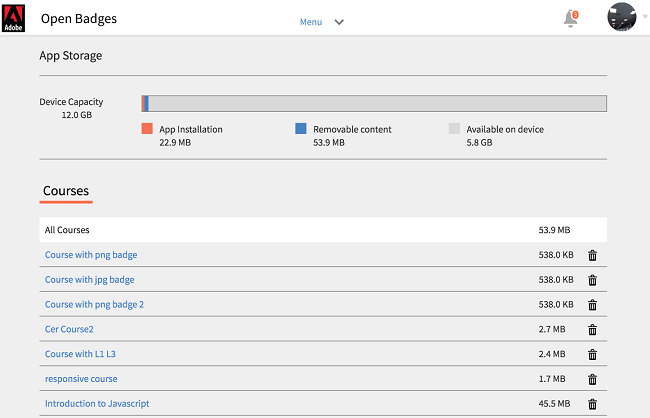

# Gebruikers van iPad- en Android-tablets

In de app Learning Manager op een iPad- of Google Nexus 9 Android-tablet ziet u het volgende nadat u zich als student hebt aangemeld: **Home** scherm:

*Het startscherm van de app*

Tik op de knop **Menu** en kiest u de gewenste optie.

<!---->

## De app offline openen {#accesstheappoffline}

U kunt de app Learning Manager offline openen op een Android-tablet van iPad en Google Nexus 9. Download en volg cursussen in offline modus en synchroniseer de inhoud weer met de online app wanneer u verbinding maakt met het netwerk.

1. Tikken **Menu** vervolgkeuzelijst bovenaan en tik op **Leren** gebruiken. Een lijst van alle beschikbare cursussen wordt weergegeven in tegels.
1. Tik op het downloadpictogram onder aan elke leerobjecttegel om de leerinhoud te downloaden.

   <!---->

1. Wanneer u online bent, verschijnt op een balk boven in de app een vraag om te controleren of u uw inhoud online wilt synchroniseren. Tik op de rode balk als uw antwoord ja is. Een groene balk geeft aan dat uw inhoud synchroon is met de online app.

<!--## Track device storage {#trackdevicestorage}

You can monitor your device storage periodically.

Tap the profile icon at the upper-right corner of the app and tap **Device Storage** menu option.

An app storage information dialog appears as shown below.

Using the app storage information, you can check the total space of device, app and the downloaded courses. This information enables you to download courses accordingly. To delete the downloaded courses in the device, tap X icon adjacent to each course name.-->
