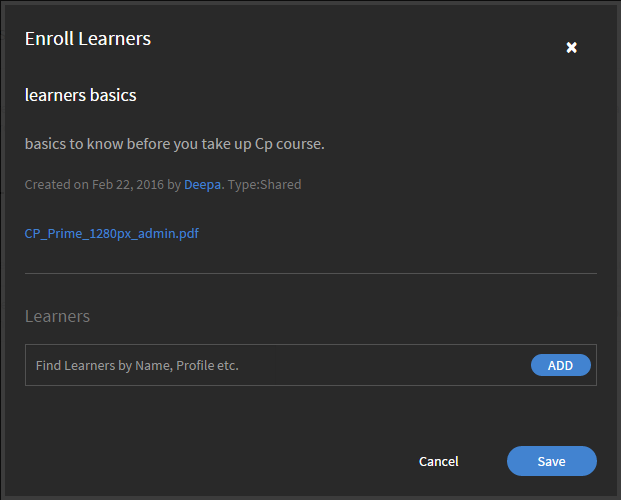

# Taakhulpen

Taakhulpen voor beheerders in Learning Manager.

Taakhulpen is een opslagplaats van trainingsinhoud die zonder enige inschrijvings- of voltooiingscriteria toegankelijk is voor studenten. Studenten kunnen deze taakhulpen gebruiken om een activiteit of taak in een organisatie uit te voeren.

Taakhulpen is een opslagplaats van trainingsinhoud die met of zonder cursusafname beschikbaar is in Learning Manager.

De beheerders van een organisatie kunnen de toewijzing van taakhulpen aan studenten beheren en deze ook intrekken of opnieuw publiceren.

## Taakhulpen intrekken / opnieuw publiceren {#withdrawrepublishjobaids}

Klik onder Beheerdersaanmelding op **[!UICONTROL Taakhulpen]** in het linkerdeelvenster om taakhulpen te openen.

U kunt een gepubliceerde taakhulp intrekken door op het instellingenpictogram naast de taakhulp te klikken en **[!UICONTROL Opzeggen]**.

*Taakhulpen beheren*

Bekijk ingetrokken taakhulpen door op het tabblad Ingetrokken te klikken. U kunt de ingetrokken taken opnieuw publiceren door op het instellingenpictogram te klikken en Publiceren te kiezen. Klik op Voorbeeld in de instellingen om een voorbeeld van de taakhulp in de speler te bekijken.

## Toewijzing van taakhulpen beheren {#managejobaidassignments}

1. Klik op het tabblad Gepubliceerd op het instellingenpictogram naast een taakhulp.

1. Klikken **[!UICONTROL Toewijzing beheren]**.

   De **[!UICONTROL Studenten inschrijven]** verschijnt.

   

   *Het dialoogvenster Studenten inschrijven weergeven*

1. In het dialoogvenster **[!UICONTROL Studenten]** , typt u de naam van de studenten en kiest u de studenten uit de vervolgkeuzelijst. U kunt ook naar de naam, het profiel en dergelijke van de studenten zoeken.
1. Klikken **[!UICONTROL Toevoegen].**
1. Klik op **[!UICONTROL Opslaan]**.

## Veelgestelde vragen {#frequentlyaskedquestions}

+++Hoe kan ik taakhulpenrapporten exporteren?

Klik in de rechterbovenhoek van het scherm op **[!UICONTROL Handelingen]** > **[!UICONTROL Rapport exporteren]**.

+++

+++Hoe kan ik taakhulpentoewijzingen beheren?

In **[!UICONTROL Gepubliceerd]** klikt u op het instellingenpictogram bij een taakhulp. Voeg een student toe en klik op **[!UICONTROL Toevoegen]**.

+++

+++Hoe kan ik een taakhulp intrekken?

In **[!UICONTROL Gepubliceerd]** klikt u op het instellingenpictogram bij een taakhulp. Klik op **[!UICONTROL Intrekken]**. De taakhulp is nu niet langer te zien in het tabblad Gepubliceerd. Klik op het tabblad Ingetrokken om de ingetrokken taakhulp te bekijken.

+++
