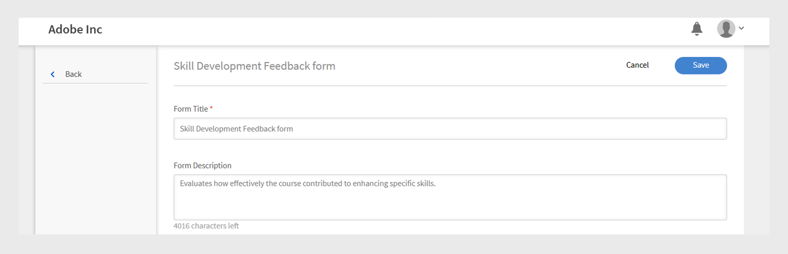
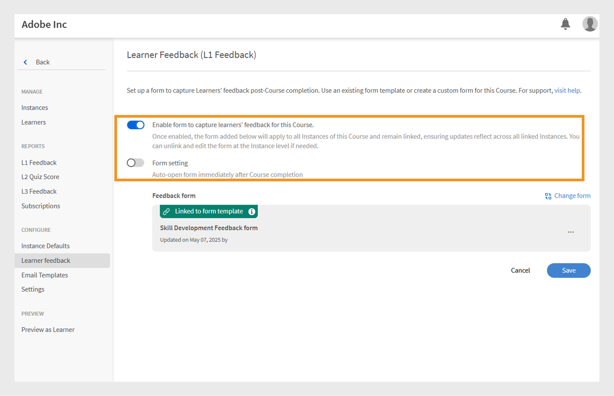

# L1-feedbackformulier

>[!IMPORTANT]
>
>De verbeterde functie L1-feedback wordt geïmplementeerd om klanten te selecteren. Als u deze eigenschap in uw rekening niet ziet, voegt de Mening [ L1 en L3 terug ](/help/migrated/administrators/feature-summary/courses.md#add-l1-and-l3-feedback) voor meer informatie over het bestaan terugkoppelt eigenschap toe.
>
>Neem contact op met het CSM-team (Customer Success Manager) om het nieuwe feedbacksysteem in te schakelen en meer te weten te komen over de tijdlijn van de migratie.

Met de feedbackfunctie van niveau 1 (L1) in Adobe Learning Manager kunnen studenten hun feedback delen nadat ze een cursus of leerpad hebben voltooid. Met deze feedback kunnen beheerders de cursuskwaliteit, de effectiviteit van de docent en de algemene leerervaring evalueren.

Beheerders kunnen nu meerdere herbruikbare feedbackformulieren maken en beheren en deze toewijzen aan specifieke cursussen en leerpaden.

De functie biedt meer flexibiliteit doordat beheerders:

* Herbruikbare feedbackformulieren maken
* Feedback voor verschillende cursussen of leerpaden aanpassen
* Wijs zo nodig aangepaste formulieren toe

Het **[!UICONTROL L1 Rapport van de Terugkoppeling]** en het **[!UICONTROL Rapport van de Terugkoppeling]** (het Rapport van de Douane) omvatten nu twee nieuwe kolommen: de Naam van de Vorm van de Terugkoppeling en de Versie van de Terugkoppeling. Deze kolommen bevatten informatie over de gebruikte feedbackformulieren.

## L1-feedbackformulier maken

Beheerders kunnen meerdere L1-feedbackformulieren op accountniveau maken en het juiste formulier toewijzen aan een cursus, leerpad of certificering.

Een L1-feedbackformulier maken:

1. Meld u als beheerder aan bij Adobe Learning Manager.
2. Selecteer **[!UICONTROL vormen van de Terugkoppeling]**.

   
   _homepage van de Beheerder tonend de optie van de Formulieren van de Terugkoppeling om feedbackvormen tot stand te brengen en te beheren_
3. Selecteer **[!UICONTROL voeg vorm]** toe.

   
   _het scherm van de Terugkoppeling vormen tonend voeg vormknoop toe om de vormen van de Terugkoppeling te creëren_
4. Kies de **[!UICONTROL taal van het Standaardmalplaatje]**, dan uitgezocht **[!UICONTROL sparen]**.

   
   _voeg een nieuwe malplaatjeherinnering toe die optie toont om de standaardtaal te selecteren_
5. Typ de titel en beschrijving van het formulier.

   
   _voeg de vormpagina van de Terugkoppeling toe tonend optietype de Titel van de Vorm en Beschrijving van de Vorm_
6. Van **[!UICONTROL voeg vraag]** menu toe, selecteer een vraagtype van het volgende:

   a. **[!UICONTROL Vrije Tekst]**: Staat studenten toe om antwoorden in hun eigen woorden te verstrekken.

   * Typ uw vraag op het **[!UICONTROL de tekstgebied van de Vraag]**.
   * Om de vraag verplicht te maken, selecteer de **[!UICONTROL Verplicht]** knevel.
     
     _voeg een Vrije vraag van de Tekst aan de feedbackvorm toe_

   b. **[!UICONTROL Numerieke Schaal/NPS]**: De studenten kunnen hun cursustevredenheid beoordelen of de kans om de cursus te adviseren gebruikend een numerieke schaal (typisch 1 tot 10).

   * Typ uw vraag op het **[!UICONTROL de tekstgebied van de Vraag]**.
   * Selecteer het beoordelingsbereik (1 tot en met 10).
   * Om de vraag verplicht te maken, selecteer de **[!UICONTROL Verplicht]** knevel.
     \
     _voeg een Numerieke/NPS vraag van de Schaal aan de feedbackvorm toe_

   c. **[!UICONTROL Vergelijkbare Schaal]**: de studenten kunnen specificeren hoeveel zij met een verklaring, van sterk afkeuren aan sterk akkoord gaan.

   * Typ uw vraag op het **[!UICONTROL de tekstgebied van de Vraag]**.
   * Om de vraag verplicht te maken, selecteer de **[!UICONTROL Verplicht]** knevel.
     
     _voeg een Likert vraag van de Schaal aan de feedbackvorm toe_

   d. **[!UICONTROL Score van de Effectiviteit van de Cursus]**: Een schaal om te meten hoe effectief een cursus studenten beïnvloedt, gebruikend een relatief classificatiesysteem.

   * Een vooraf gedefinieerde vraag met een Likert-schaal van 1 tot 10 wordt toegevoegd aan het feedbackformulier.
   * U kunt slechts één **[!UICONTROL vraag van de Score van de Effectiviteit van 0} Cursus toevoegen, en het kan niet worden uitgegeven]**
     
     _voeg de vraag van de Score van de Effectiviteit van de Cursus aan de feedbackvorm toe_
7. Selecteer **[!UICONTROL sparen]**. U kunt de gemaakte formulieren bekijken in de sectie Feedback-Forms.

### Voorbeeld van het feedbackformulier bekijken

U kunt een voorbeeld van het feedbackformulier bekijken door Voorvertoning in het Engels (Verenigde Staten) te selecteren. Als u het formulier in meerdere talen hebt gemaakt, kunt u het ook in elke taal bekijken. Bekijk deze [ sectie ](/help/migrated/administrators/feature-summary/l1-feedback-form.md#add-feedback-forms-in-other-languages) om te leren hoe te om terugkoppel vormen in andere talen toe te voegen.

_het scherm van de Formulieren van de Terugkoppeling tonend de optie van de Voorproef om de feedbackvorm in de standaardtaal_ te bekijken

### Feedbackformulieren toevoegen in andere talen

Maak vertalingen voor de vragen in het feedbackformulier in meerdere talen. U kunt echter alleen vragen toevoegen aan of verwijderen uit de standaardtaal (zoals Engels). Voor andere talen kunt u alleen de vragen vertalen die oorspronkelijk in de standaardtaal zijn toegevoegd. Het is niet mogelijk rechtstreeks vragen toe te voegen aan of te verwijderen uit de vertaalde versies.

1. Selecteer **[!UICONTROL voeg Nieuwe Taal]** in de feedbackvorm toe.

   
   _voeg een nieuwe taalversie aan toe terugkoppelt vorm_
2. Kies de gewenste taal en selecteer **[!UICONTROL sparen]**.
3. Navigeer naar het tabblad voor de taal die u hebt toegevoegd.
4. Selecteer **[!UICONTROL Vertaal]** naast elke vraag om uw vertaling toe te voegen.

   
   _het vormscherm dat van de Terugkoppeling de Vertaaloptie toont om de vragen in de respectieve talen te vertalen_

   >[!NOTE]
   >
   >De vraag over de score van de cursuseffectiviteit wordt automatisch vertaald.

5. Na het toevoegen van de vertalingen, uitgezocht **[!UICONTROL sparen]**.

## Een feedbackformulier instellen als standaard

Beheerders kunnen standaardfeedbackformulieren instellen voor cursussen op eigen tempo, in een lesruimte, in een virtuele lesruimte en in gemengde cursussen. Zodra dit is geconfigureerd, wordt dit standaardformulier automatisch aan de studenten getoond na voltooiing van een cursus. Dit standaardformulier wordt toegepast op alle cursussen, tenzij de beheerder ervoor kiest een ander feedbackformulier toe te wijzen voor specifieke cursussen.

_het scherm dat van de Terugkoppeling vormen optie toont om het gebrek te plaatsen terugkoppelt vorm_

## Feedbackinstellingen voor studenten configureren

Beheerders kunnen de volgende instellingen configureren in de sectie Feedback student:

* **[!UICONTROL laat vorm toe om de terugkoppeling van studenten voor deze Cursus te vangen]**: Laat deze optie toe om feedback van studenten voor de cursus te verzamelen. Wanneer deze optie is ingeschakeld, worden studenten gevraagd feedback te geven nadat de cursus is voltooid.
* **[!UICONTROL Formulier het plaatsen]**: Wanneer toegelaten, opent het feedbackformulier automatisch voor studenten onmiddellijk nadat zij de cursus voltooien, die het gemakkelijker maken om geschikte terugkoppelen te verzamelen.

_het scherm van de Terugkoppeling van de Student tonend de student terugkoppelt montages_

>[!NOTE]
>
>Cursusinstanties gebruiken het standaardfeedbackformulier vanaf cursusniveau. Wanneer u nieuwe instanties maakt, gebruiken deze ook het standaardformulier op cursusniveau in plaats van het accountniveau.

### Het standaardfeedbackformulier van een cursus wijzigen

Het standaardfeedbackformulier is van toepassing op alle cursussen. Als beheerder kunt u een nieuw formulier maken of een formulier kiezen in de bestaande lijst. Om de standaardfeedbackformulieren te wijzigen, moet feedback van studenten voor deze cursus zijn ingeschakeld.

Het standaardfeedbackformulier wijzigen:

1. Selecteer **[!UICONTROL Cursussen]** op de beheerderhomepage.
2. Selecteer om het even welke cursus op de **[!UICONTROL sectie van de Cursus]**.
3. Selecteer **[!UICONTROL Cursus van de Mening]**, dan selecteren **[!UICONTROL terugkoppelt de Student]**.

   
   _de schermen van de Terugkoppeling van de Student toont de Edit optie om de vorm_ te veranderen
4. Selecteer **[!UICONTROL uitgeven]** in de **[!UICONTROL terugkoppelt de student]** sectie,.
5. Selecteer **[!UICONTROL vorm van de Verandering]**.

   
   _de schermen van de Terugkoppeling van de Student tonen de de vormoptie van de Verandering om de feedbackvorm voor de cursus te veranderen_
6. Kies een andere terugkoppel vorm van het menu of selecteer **[!UICONTROL Begin met een lege vorm]** om nieuwe tot stand te brengen.

   
   _voeg een vormscherm toe dat de optie toont van het beschikbare malplaatje te selecteren of nieuwe vorm tot stand te brengen_
7. Selecteer **[!UICONTROL sparen]** om uw veranderingen toe te passen.

Als voor een cursus het standaardfeedbackformulier wordt gebruikt en het standaardformulier op accountniveau wordt bijgewerkt, wordt het nieuwe formulier automatisch weergegeven in al deze cursussen. Als een beheerder het formulier echter wijzigt of een nieuw formulier op cursusniveau toewijst, hebben toekomstige wijzigingen in het standaardformulier geen invloed op het feedbackformulier van die cursus.

De instantie gebruikt het feedbackformulier op cursusniveau als standaard. Als een beheerder het feedbackformulier op cursusniveau wijzigt, heeft dit geen invloed op het formulier dat al op instantieniveau is ingesteld. Voor elke nieuwe instantie die na de wijziging wordt gemaakt, wordt standaard het bijgewerkte feedbackformulier op cursusniveau gebruikt.

Volg dezelfde stappen om de standaardfeedbackformulieren voor een leerpad te wijzigen.

>[!NOTE]
>
>Als u het formulier niet wijzigt, gebruikt de cursus het standaardfeedbackformulier.

