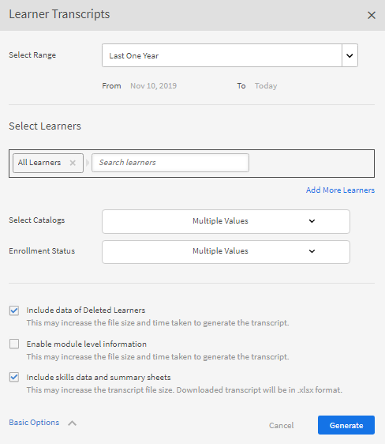
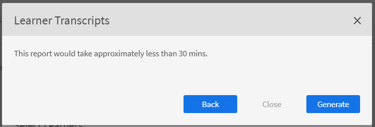

# Studenttranscripten

Download het studenttranscript en beheer rapporten met behulp van Learning Manager.

Adobe Learning Manager stelt de beheerders van een organisatie in staat om de transcripten van de studenten te genereren.

## Studenttranscripten genereren {#generatelearnertranscripts}

1. Klik op **[!UICONTROL Rapporten]** in het linkerdeelvenster in Beheerdersaanmelding.

   De beheerder gaat naar het tabblad Excel-rapporten op de pagina **[!UICONTROL Rapporten]**.

1. Klik op de koppeling **[!UICONTROL Studenttranscripten]**.

   De **[!UICONTROL Studenttranscript]** de geschiedenispagina toont met bericht - **Er zijn nog geen studenttranscripten gegenereerd** of een lijst met downloads die zijn geactiveerd na implementatie van de geschiedenispagina Transcripties voor eLearning.

   <!---->

   Het dialoogvenster Studenttranscripten verschijnt. Kies het datumbereik waarvoor het transcript moet worden gegenereerd.

   >[!NOTE]
   >
   >Standaard is de startdatum de registratiedatum van de student en is de einddatum altijd de huidige datum. U kunt alleen wijzigen vanaf welke begindatum u de gegevens nodig hebt.

1. Kies de namen van de studenten in het menu **[!UICONTROL Studenten selecteren]** en klik op **[!UICONTROL Genereren].**
1. U kunt kiezen voor één student of groepen studenten. Klik op **[!UICONTROL Meer studenten toevoegen]** om meer dan een student toe te voegen.

   

   *Meer studenten toevoegen*

1. U kunt specifieke catalogi kiezen door het selectievakje in te schakelen. Transcript wordt alleen gedownload voor de gespecificeerde catalogi. U kunt specifieke catalogi kiezen door de catalogus te selecteren in het menu **[!UICONTROL Catalogi selecteren]** vervolgkeuzelijst.

   

1. Bij het exporteren van Studenttranscripten is er een optie: **[!UICONTROL Inschrijvingsstatus]**. Dit dropdownmenu heeft de volgende opties:

   * Alle selecteren
   * Voltooid
   * In uitvoering
   * Niet gestart
   * Uitgeschreven

   

   *De catalogus selecteren*

1. U kunt ook transcripten downloaden voor studenten die uit een account zijn verwijderd.

   Als u Studenttranscripten van verwijderde gebruikers wilt downloaden, klikt u op de knop **[!UICONTROL Geavanceerde opties]** en schakelt u het selectievakje in **[!UICONTROL Inclusief gegevens van verwijderde studenten]**.

   

   *Studenttranscripten van verwijderde studenten downloaden*

1. U kunt informatie op moduleniveau in het Studenttranscript downloaden door de optie &quot;**[!UICONTROL Informatie op moduleniveau inschakelen]**&quot;. Als deze optie is ingeschakeld worden modulenamen en de tijd die aan elke module is besteed, als deel van het transcript opgehaald.
1. U kunt vaardigheidsgegevens en overzichtsbladen downloaden door de optie &quot;**[!UICONTROL Vaardigheidsgegevens en overzichtsbladen opnemen]**&quot;.

   Transcripten worden als CSV-bestanden gegenereerd en naar uw computer gedownload wanneer de vaardigheidsgegevens niet worden opgenomen. Als het selectievakje Vaardigheidsgegevens is ingeschakeld, worden transcripten als XLS-bestanden gegenereerd en gedownload.

## Studenttranscripten genereren met kopiëren en plakken

Studenttranscripten ophalen is een moeizaam proces, omdat dit enkel voor één afzonderlijke student of gebruikersgroep per keer kan. Met de kopiëren- en plakkenfunctie kunt u nu in één keer de lijst met e-mail-ID&#39;s van studenten kopiëren en plakken.

1. Aanmelden als een **[!UICONTROL Beheerder]** of **[!UICONTROL Manager]**.
1. Ga naar **[!UICONTROL Rapporten]** krachtens **[!UICONTROL Beheren]**, wordt de **[!UICONTROL Gebruikersactiviteit]** pagina.
1. Klikken **[!UICONTROL Aangepaste rapporten]** in het linkerdeelvenster en selecteer **[!UICONTROL Studenttranscripten]** in de lijst.
1. Op de **[!UICONTROL Studenttranscripten]** pagina, klikken **[!UICONTROL Nieuw genereren]** in de linkerbovenhoek.
1. Selecteer de gewenste datums door te klikken op **[!UICONTROL Datumbereik selecteren]** vervolgkeuzelijst. Klikken **[!UICONTROL E-mail-id&#39;s]** om de gekopieerde lijst met unieke e-mailadressen in te voeren.

   

   *E-mail-id&#39;s kopiëren en plakken*

1. Gebruik **[!UICONTROL E-mail-ID&#39;s valideren]** om te controleren of de ingevoerde id juist is.

   

   *E-mailadressen valideren*

   Als een ingevoerd e-mail-ID onjuist is, wordt dit in het rood gemarkeerd met een validatiebericht, zoals hierboven.

   **[!UICONTROL Genereren]** Knop is alleen beschikbaar als alle ingevoerde e-mailadressen correct zijn.

   

   *Studenttranscripten genereren*

1. Klikken **[!UICONTROL Genereren]** om Studenttranscripten te genereren voor alle vermelde e-mail-ID&#39;s. U ontvangt een bevestigingsbericht zoals hieronder waarin de rapportgeneratie wordt bevestigd.

   

   *Bevestigingsbericht van rapport dat wordt gegenereerd*

   Het genereren van studenttranscripten kan worden gecombineerd voor e-mail-id&#39;s die onder beide **[!UICONTROL Gebruikers]** en **[!UICONTROL E-mail-id&#39;s]** tabblad.

## Geschiedenis van studenttranscript downloaden {#ltdownload}

Op de **[!UICONTROL Studenttranscript]** downloadpagina om een rapport te genereren wanneer u op de knop **[!UICONTROL Nieuw genereren]** in, wordt het dialoogvenster Studenttranscripten weergegeven.

*Een rapport genereren van alle studenttranscripten*

Klik op **[!UICONTROL Geavanceerde Opties]** en vouw het venster uit.

Kies de gebruikers en de catalogus waartoe ze behoren. Nadat u op de knop **[!UICONTROL Genereren]** hebt geklikt, verschijnt een dialoogvenster met een schatting van de benodigde tijd voor het downloaden van het rapport. Klik op **[!UICONTROL Genereren]** om het rapport te genereren.

*Selecteer de knop Genereren*

Het transcript wordt op de achtergrond gegenereerd, zodat u uw taken in Learning Manager kunt voortzetten. Zodra het transcript is gegenereerd, kunt u het transcript uit de lijst downloaden.

Als beheerder kunt u alle transcripten bekijken die door iedereen in het systeem zijn gegenereerd.

*Geschiedenis van downloads weergeven*

De lijst met downloads geeft de volgende attributen weer:

* **Studenten:** De studenten/studentengroepen waarvan de transcripten moeten worden gedownload.
* **Extra gegevens opgenomen:** afhankelijk van de extra gegevens die de beheerder wil downloaden via de optie Geavanceerd in het modale venster Studenttranscript toevoegen.
* **Status:** Gedownload, in de wachtrij geplaatst of in uitvoering.
* **Van** en **Tot**: duur van het downloaden van de transcripten.
* **Toegepaste filters:** of u de filters voor inschrijfstatus hebt toegepast.
* **Genereert door:** De gebruikers-id van de gebruiker van de Learning Manager die om het downloaden heeft verzocht.
* **Status:** Gedownload, in de wachtrij geplaatst of in uitvoering.

U kunt de download op elk moment annuleren. Learning Manager verstuurt een in-app melding naar de gebruiker die het transcript van de student heeft geactiveerd, als de taak door de beheerder is geannuleerd.

*Downloadwachtrij voor studenttranscript*

U kunt **annuleren** de download op elk gewenst moment. Als een taak wordt geannuleerd, stuurt Leermanager een melding in de app naar de gebruiker die de taak heeft geannuleerd.

## Gegevens van verwijderde studenten {#dataofdeletedlearners}

U kunt de gegevens van verwijderde studenten opnemen in de lijst met studenttranscripten. Schakel in het dialoogvenster Studenttranscripten de optie **[!UICONTROL Inclusief gegevens van verwijderde studenten]**.

Nadat u de optie hebt ingeschakeld en op **[!UICONTROL Genereren]** hebt geklikt, staan de gegevens van verwijderde studenten op de downloadpagina Studenttranscript, zoals hieronder weergegeven:

*Gegevens van verwijderde studenten weergeven*

## Kolommen aanpassen {#customize-columns-lt}

Een beheerder kan de geëxporteerde kolommen in een studenttranscriptrapport aanpassen. Beheerders, aangepaste beheerders en managers kunnen de kolommen configureren voordat ze het rapport exporteren.

Op de **[!UICONTROL Studenttranscripten]** dialoogvenster, klikken **[!UICONTROL Geavanceerde opties]**. In het dialoogvenster **[!UICONTROL Exportindeling configureren]** de kolommen kiezen die u wilt exporteren.

*Te exporteren kolommen aanpassen*

Aanpassing is alleen toegestaan &#x200B;&#x200B;wanneer een gebruiker het studenttranscript in .csv-indeling downloadt. Als u downloadt in .xlsx-indeling, wordt er geen rekening gehouden met de selectie van kolomvoorkeuren en worden alle standaardkolommen geëxporteerd.

## Inhoud van het studenttranscriptbestand {#learnertranscriptfilecontent}

Een typisch studenttranscriptbestand bestaat uit zes Excel-bladen in één bestand. De studenttranscriptbladen geven een algemeen inzicht in gegevens, waaronder het aantal studenten per cursus, hun vaardigheden, het voltooiingspercentage op basis van de cursus of student en een dashboard Naleving. De volgende dashboards zijn beschikbaar in studenttranscripten:

**Studenttranscript**

Naast profielgegevens van de student staan in het Excel-blad van het studenttranscript details van gevolgde leerobjecten, zoals inschrijvingsdatum, startdatum, behaalde cijfers en behaalde quizscore. Als cursussen deel uitmaken van een leerprogramma, worden ze apart vermeld, los van de individuele gegevens over het cursusverbruik.

**1- Dashboard Leeractiviteit**

Op dit LO-specifieke dashboard ziet u het aantal studenten per cursus, leerprogramma of certificering. U kunt het voortgangsblad voor studenten voor een bepaald leerobject bekijken. Op dit blad staan gegevens zoals het aantal studenten dat de cursus of het leerprogramma heeft voltooid, studenten die nog bezig zijn en de vervaldatums voor studenten.

De voortgang van de gebruikers voor de specifieke cursus wordt berekend op basis van de invoervelden waar u de vervaldatum en drempels voor voortgangspercentages opgeeft. Als u bijvoorbeeld 7 dagen en 70% als de waarden in uw invoerveld opgeeft, wordt de cursusvoortgang voor cursussen die over 7 dagen moeten zijn afgerond en voor cursussen waarvoor meer dan 70% vooruitgang is geboekt, weergegeven. U kunt in dit blad ook de tijdperiode wijzigen. De gewijzigde gegevens worden vervolgens automatisch op dit dashboard weergegeven.

**2- Dashboard Leeractiviteit**

Dit dashboard toont gegevens voor een specifieke gebruiker. Via dit dashboard kunt u zien voor welke cursussen, leerprogramma&#39;s of certificeringen een bepaalde gebruiker zich heeft ingeschreven. De tabel toont ook gegevens over de leerobjecten die de gebruiker heeft voltooid, de lopende leerobjecten en aanstaande vervaldatums voor de gebruiker.

De voortgang van de gebruikers voor elke cursus wordt berekend op basis van de ingangen die u opgeeft. Dat wil zeggen, de vervaldatum en voortgangspercentages. Als u bijvoorbeeld 7 dagen en 70% als de waarden in uw invoerveld opgeeft, wordt de cursusvoortgang van de gebruiker voor verschillende cursussen die over 7 dagen moeten zijn afgerond en voor cursussen waarvoor meer dan 70% vooruitgang is geboekt, weergegeven.

**Vaardigheid**

Op het vaardighedenblad staan de vaardigheidsnaam, het vaardigheidsniveau, de vereiste studiepunten, de behaalde studiepunten, het voltooiingspercentage en andere profielgegevens. Hieronder ziet u ter referentie een voorbeeld van een vaardighedenblad in Excel.

*Voorbeeld van het Excel-vaardighedenblad*

**1- Dashboard Vaardigheden**

Op dit dashboard kunt u zien of uw organisatie over verschillende vaardigheden beschikt. U kunt voor een specifieke vaardigheid controleren hoeveel gebruikers in een organisatie geacht worden deze vaardigheid te hebben, tegenover het aantal gebruikers dat de vaardigheid daadwerkelijk heeft. Dit dashboard geeft ook aan welke gebruikers hun vaardigheden moeten opfrissen. Deze waarde wordt berekend op basis van wat u in het invoerveld invoert. Als u bijvoorbeeld 50 dagen invoert, toont het dashboard gegevens van gebruikers die over 50 dagen hun vaardigheden moeten opfrissen.

**2- Dashboard Vaardigheden**

Dit vaardighedendashboard is meer gebruikersspecifiek. U kunt hier filteren op een specifieke gebruiker of meerdere gebruikers en hun vaardigheidsniveau als een dashboard bekijken. Dit blad kan managers en beheerders helpen om de vaardigheidsniveaus van iedere student bij te houden ten opzichte van het niveau dat van hen wordt verwacht. Het dashboard Vaardigheden laat ook zien welke studenten hun kennis moeten opfrissen. De lijst met studenten die hun kennis moeten opfrissen, wordt berekend op basis van het aantal dagen dat u in het invoerveld opgeeft.

**Dashboard Naleving**

Het dashboard Naleving bestaat uit twee delen - nalevingsrapport per gebruiker en nalevingsrapport per training. Voor het gebruikersgebaseerde rapport aan de hand van het dashboard Naleving gebruikers volgen met aanstaande vervaldatums voor belangrijke nalevingsinitiatieven. Voor het trainingsgebaseerde rapport kunt u op leerprogramma of certificering filteren.

Filter voor beide nalevingsrapporten op de vervaldatum om de relevante gegevens te bekijken.

### Tijd- en datumkolommen in het transcript {#datetime}

De minuten van de waarden in de volgende kolommen worden afgrond tot op de dichtstbijzijnde minuut en de seconden worden afgerond op 00:

* Inschrijvingsdatum (tijdzone UTC)
* Datum gestart (tijdzone UTC)
* Voltooiingsdatum (tijdzone UTC)

*Tijd- en datumkolommen op het Excel-werkblad*

### Tijdsduur van de module en ID-kolommen in het transcript {#moduledurationandidcolumnsinthetranscript}

Het Studenttranscript geeft ook de kolommen weer: **[!UICONTROL Moduleduur]** en **[!UICONTROL ID]**.

*Moduleduur en id-kolommen in het transcript*

### ANDERE kolommen in het transcript {#ModuledurationandIDcolumnsinthetranscript-1}

| **Kolom** | **Beschrijving** |
|---|---|
| Na | Het aantal studenten dat de vaardigheid heeft behaald vóór de ingevoerde (waarde) aantal dagen en deze moet opfrissen |
| Vaardigheid | De namen van vaardigheden die zijn toegewezen aan studenten |
| Naam van manager | De naam van de manager van wie de vaardigheidsgegevens van zijn of haar ondergeschikten moeten worden getoond in de samenvattingstabel Vaardigheden |
| Rijlabels | De naam van de student met de toegewezen vaardigheden |
| Aantal vaardigheden dat elke gebruiker moet hebben | Aantal aan de student toegewezen vaardigheden |
| Aantal vaardigheden dat elke gebruiker heeft | Aantal vaardigheden behaald door de student |
| Aantal vaardigheden dat moet worden opgefrist | Aantal studenten dat vaardigheden moet opfrissen |
| Nalevingspercentage | Het vooruitgangspercentage van de toegewezen vaardigheid |
| Ingesloten pad | In deze rijen wordt de naam van het ingesloten leerprogramma weergegeven. |
| Ingesloten pad-ID | In deze rijen worden de id&#39;s van het ingesloten leerprogramma weergegeven |
| Taal ingesloten pad | Deze rijen tonen de taal waarin het leerprogramma is opgesteld. |
