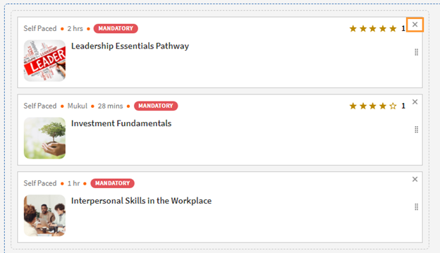

# Leerpaden

## Wat is een leerpad?

Vaak zijn beheerders geïnteresseerd in het ontwikkelen van een gedetailleerd studieprogramma dat diepgaande kennis van een bepaald onderwerp of een vakgebied biedt. Het kan ook een reeks trainingscursussen zijn die naar verwachting door de werknemers of klanten zullen worden voltooid. Dit vereist het bundelen van een reeks cursussen en programma&#39;s om een compleet trainingspakket te creëren.

Hier komt het leerpad in beeld. Een leerpad is een traject dat een student in de loop der tijd moet doorlopen om een onderwerp onder de knie te krijgen. Studenten hebben hun trainingservaring in eigen hand en kunnen op een meer effectieve manier kennis opdoen en behouden in hun eigen tempo.

Voor de onboarding van nieuwe werknemers geeft een organisatie bijvoorbeeld trainingen over beleid en procedures, cultuur, geschiedenis, enzovoort. In een leerpad worden de cursussen ingericht op de behoefte van de werknemers, zodat ze de cursussen kunnen volgen volgens het voor hen vastgestelde leerpad. kiest en u kunt gebruikers inschrijven voor dit pad zodat zij van cursus tot cursus kunnen doorgaan.

## Voordelen van een leerpad

Dankzij leerpaden kunt u gemakkelijk en probleemloos een trainingsprogramma aanbieden. Dit zijn enkele van de belangrijkste voordelen van een leerpad:

1. Wijs direct een vaardigheid en vaardigheidsniveau toe aan een leerpad. Je hoeft vaardigheidspunten niet aan elkaar te koppelen. Wanneer de student een leerpad heeft voltooid, bereikt hij/zij het vermelde vaardigheidsniveau.
1. Mogelijkheid om een bestaand leerpad in te sluiten in een nieuw leerpad. De insluitingsfunctie is alleen beschikbaar voor één insluitingsniveau. Een leerpad dat al een ingesloten pad bevat, kan dus niet worden ingesloten in een nieuw pad.
1. Mogelijkheid om vereisten, taakhulpen en hulpbronnen toe te voegen op leerpadniveau.
1. Mogelijkheid om onderdelen te maken. Elk onderdeel kan een titel hebben.
1. Mogelijkheid om onderdelen verplicht te stellen en voltooiingscriteria in te stellen.

## Een leerpad toevoegen in Leerbeheer

Klik in Learning Manager in de Admin-app op **[!UICONTROL Leerpad]** in het linkerdeelvenster.

In het dialoogvenster **[!UICONTROL Leerpad]** pagina, klikken **[!UICONTROL Toevoegen]**. Voer de gegevens in.

*Een nieuw leerpad toevoegen*

Nadat u het leerpad hebt gemaakt, selecteert u het nieuw gemaakte leerpad en voegt u de cursussen toe aan het pad.

U kunt vaardigheden toevoegen en een badge toewijzen aan het leerpad. Als u een vaardigheid wilt toevoegen, selecteert u de vereiste vaardigheid of vaardigheden in het menu **[!UICONTROL Kies een vaardigheid]** vervolgkeuzelijst. Selecteer ook het niveau voor de vaardigheid of vaardigheden.

Wijs een badge toe aan het leerpad. Kies een badge uit de lijst met beschikbare badges.

Kies het sequentietype voor de secties en trainingen zoals Besteld of Niet op volgorde op basis van uw voorkeur.

Als u Op volgorde kiest, verschijnen de cursussen in de volgorde waarin u ze hebt gemaakt. Kiest u Niet op volgorde, dan worden de cursussen niet op volgorde gezet. Studenten kunnen de cursussen in elke gewenste volgorde voltooien.

Klik op **[!UICONTROL Cursussen of leerpaden toevoegen]**.

Kies in het dialoogvenster dat verschijnt de training die u aan het leerpad wilt toevoegen.

*Training toevoegen aan het leerpad*

U kunt de cursussen verder sorteren op de toegewezen vaardigheden, de wijzigingsdatum en cursuseffectiviteit.

Klik na het selecteren van de cursussen of het leerpad op **[!UICONTROL Opslaan]**.

In het leerpad kunt u het volgende doen:

**Een sectie maken en configureren:** Er wordt een sectie gemaakt om meerdere trainingscursussen te groeperen die een gebied of een wezenlijk onderdeel van de training afronden. Elk onderdeel kan een titel hebben. Elke sectie kan ook als verplicht worden gemarkeerd met specifieke voltooiingsvereisten.

**Maak de cursussen verplicht in elke sectie:** Schakel het selectievakje Verplicht in of uit als u de trainingen in het leerpad verplicht wilt of niet wilt maken. Als u het selectievakje inschakelt, kunt u alle trainingen verplicht stellen of een deel van de trainingen verplicht stellen.

*Maak cursussen verplicht in elke sectie*

**Rangschik de volgorde:** U kunt de cursussen omhoog of omlaag verplaatsen en de volgorde ervan wijzigen.

*De volgorde van de training wijzigen*

**Een cursus verwijderen:** Klik op de cursuskaart op X en verwijder de cursus uit het leerpad.

*Een cursus verwijderen uit het leerpad*

Nadat u de wijzigingen hebt aangebracht, klikt u op Publiceren om het leerpad te publiceren.

## Genest leerpad

U kunt een leerpad in een leerpad opnemen, maar u kunt er maximaal één leerpad in nesten.

Voeg het leerpad in zoals u een cursus zou invoegen.

*Voeg een leerpad toe binnen een leerpad*

## Instellingen voor leerpaden

In het gedeelte Instellingen kunt u de vereisten en de taakhulpen toevoegen die een student moet volgen voordat hij/zij aan het leerpad begint. U kunt ook bronnen toevoegen die nuttig zijn voor de student.

*Instellingen van een leerpad wijzigen*

## Instanties

De leerpadinstanties geven de extra tegel **[!UICONTROL Leerpaden]** weer. De tegel geeft het aantal leerprogramma&#39;s weer dat aan een leerpad is toegevoegd.

In het dialoogvenster **Cursussen** naast elkaar ziet u de cursusinstanties die zichtbaar zijn voor de studenten die voor deze instantie zijn ingeschreven.

De **[!UICONTROL Studenten in staat stellen instanties te kiezen (flexibel leerpad)]** is alleen van toepassing op cursussen. Alle onderliggende leerpaden krijgen een optie om een leerprogrammainstantie toe te wijzen aan het leerpad. De toewijzing is standaard ingesteld op Standaardinstantie.

*Leerpadinstanties*

## Meldingen

Er zijn drie opties:

1. **[!UICONTROL Alle Niveaus Cursussen en Leerpaden (standaard geselecteerd)]:** De student ontvangt meldingen voor een onvolledige cursus, ongeacht het niveau in een leerpad.
1. **[!UICONTROL Leerpad hoofdmap]:** De student ontvangt meldingen voor onvolledige cursussen die horen bij een bovenliggend leerpad.
1. **[!UICONTROL Alleen leerpad en onderliggend niveau]:** De student ontvangt meldingen van onvolledige cursussen die het eerste onderliggende onderdeel van een bovenliggend leerpad vormen.

De meldingsherinneringen worden geactiveerd afhankelijk van de optie. Standaard kunt u de optie **[!UICONTROL Alle niveaus voor cursussen en leerpaden]** is ingeschakeld voor een instantie.

## Belangrijke opmerking

Houd er rekening mee dat de naam van de bestaande functie van leerprogramma&#39;s meteen na de release wordt gewijzigd in Leerpad. Als u het wilt blijven noemen als leerprogramma&#39;s, raden we u aan de functie &#39;Terminologieën&#39; te gebruiken om de vereiste terminologie toe te passen. Op deze manier kunt u het woord Leerprogramma blijven gebruiken.

Leerpaden bieden u een reeks mogelijkheden. Sommige zijn direct na de release beschikbaar. Beheerders/auteurs kunnen deze gebruiken. Uitgebreide mogelijkheden zoals &quot;secties&quot;, &quot;leerpad toevoegen in een ander pad&quot; enz. zijn uitgeschakeld en kunnen worden ingeschakeld door het onderstaande selectievakje in te schakelen.

Studenten kunnen leerprogramma&#39;s (nu leerpaden genoemd) blijven volgen en auteurs/beheerders kunnen deze ook blijven maken. Om gebruik te maken van de hierboven vermelde uitgebreide functies van het leerpad, dient de beheerder de instelling in te schakelen zoals hieronder vermeld. Als deze optie is ingeschakeld, worden alle nieuwe uitgebreide mogelijkheden van het leerpad beschikbaar.

De **[!UICONTROL Instellingen]** > **[!UICONTROL Algemeen]** Deze pagina heeft een nieuwe optie om leerpaden in te schakelen. Als deze optie is ingeschakeld, kunt u cursussen en leerprogramma&#39;s toevoegen aan een leerpad. U kunt de optie niet wijzigen als deze eenmaal is ingeschakeld.

## Andere padgerelateerde leergegevens

### De optie Leerpad is uitgeschakeld/niet geselecteerd in de beheerinstellingen

**Accounts die native web-apps gebruiken**

**Studenten**

* Standaard zullen studenten een wijziging in de terminologie opmerken van &quot;Leerprogramma&quot; naar Leerpad&quot;. Dit is om de interface intuïtiever te maken. Raadpleeg de onderstaande punten als u deze wijziging niet wilt aanbrengen.

* Deze wijziging wordt echter niet weerspiegeld in de gebruikersinterface als u de functie &#39;Aangepaste terminologie&#39; al hebt gebruikt om de terminologie &#39;Leerprogramma&#39;s&#39; te vervangen door aangepaste tekst.
* Als u de functie Eigen terminologie nog niet hebt gebruikt, maar nu de functie Leerprogramma&#39;s wilt behouden als terminologie, kunt u dit doen via de functie Eigen terminologie na de release.

* De algehele cosmetische look and feel van eerdere &#39;Leerprogramma&#39;s&#39; zullen worden aangepast aan een meer visueel rijke look and feel.

**Auteurs en beheerders**

* De terminologie binnen de beheerders-/auteursapps is dezelfde als die voor studenten.
* De gebruikersinterface voor auteurs en beheerders om de oude leerprogramma-objecten te maken, bij te werken, wordt nu bijgewerkt naar de nieuwe gebruikersinterface. De functionaliteit gaat niet verloren, alleen de gebruikersinterface om de bewerking uit te voeren wordt een stuk intuïtiever. Deze wijzigingen in de gebruikersinterface worden weergegeven in uw account, zelfs als u ervoor hebt gekozen &#39;Uitgebreide functies van leerpad&#39; niet in te schakelen zonder verlies van functionaliteit.

* Houd er rekening mee dat bestaande leerprogramma-objecten niet worden gewijzigd, dus dit heeft geen invloed op studenten (behalve het hierboven vermelde punt over de terminologie). Auteurs/beheerders kunnen een standaardgroep met de naam &#39;Sectie&#39; opmerken binnen hun bestaande objecten. Deze groep heeft geen materiële invloed op de functionaliteit. Auteurs/beheerders zullen ook toegevoegde functionaliteiten zien, zoals Vaardigheden, Taakhulpen enz. Maar aangezien u het nog niet hebt gebruikt, heeft dit geen invloed op de studentzijde totdat u het daadwerkelijk gaat gebruiken.

**Rapportage**

* Als u de optie Leerpad niet inschakelt, zijn er geen wijzigingen in de rapportstructuur van het Studenttranscript als gevolg van het leerpad. Maar zoals eerder meegedeeld (verwijs naar de tabel die in eerdere communicatie is gedeeld); er wordt direct na de release één nieuwe kolom toegevoegd aan uiterst rechts van het Studenttranscript.

**Accounts die gebruikmaken van een headless LMS**

**Studenten**

* Er zijn geen wijzigingen voor studenten in de headless-interface. API&#39;s die ook worden gebruikt om de rapporten te genereren, hebben geen directe wijzigingen.

**Auteurs en beheerders**

* Dezelfde wijzigingen als die van auteurs/beheerders zoals hierboven vermeld.

**Rapportage**

* Hier gelden dezelfde wijzigingen als die voor rapportage die hierboven zijn vermeld.

### De optie Leerpaden is ingeschakeld/geselecteerd in de beheerinstellingen

**Accounts die native web-apps gebruiken**

**Studenten**

* Hier gelden dezelfde wijzigingen als die voor studenten wanneer de optie is uitgeschakeld.
* Wanneer u de uitgebreide functionaliteit van leerpaden gaat gebruiken, zullen studenten profiteren van uitgebreidere paden met ingesloten paden en secties, vaardigheden en badges die worden verdiend op padvoltooiing, resources op padniveau en andere voordelen.

**Auteurs en beheerders**

* Hier gelden dezelfde wijzigingen als die voor auteurs en beheerders wanneer de optie is uitgeschakeld.

* Gebruikers krijgen meer functionaliteit bij het maken van uitgebreide paden. U kunt vaardigheidsniveaus definiëren die automatisch door een student worden bereikt wanneer het pad is voltooid (u hoeft zich niet te richten op de rekenkundige van studiepunten voor de niveaus). Hulpbronnen kunnen op padniveau worden toegevoegd (dit is vanaf nu niet mogelijk). Onderdelen kunnen worden gemaakt waarbij elk onderdeel de mogelijkheid heeft X- of Y-opties te hebben. Een leerpad kan in een ander leerpad worden ingesloten (er wordt één hiërarchieniveau ondersteund)

**Rapportage**

* Er worden een paar nieuwe kolommen toegevoegd aan de structuren Studenttranscript en Inhoudsrapport om de nieuwe functie voor het insluiten van paden in paden op te nemen. Dit kan van invloed zijn op de integratiecode die u mogelijk hebt geschreven om deze gegevens te exporteren naar uw aangepaste datawarehouse/DB buiten Learning Manager. Deze informatie staat in de tabel die in eerdere communicatie is verstrekt.

**Accounts die gebruikmaken van een headless LMS**

**Studenten**

* Er verandert niets voor uw studenten, tenzij u wijzigingen aanbrengt in uw headless LMS-implementatie, aangezien de API&#39;s waarop u uw headless-interface hebt gebouwd niet worden gewijzigd.
* Als u de uitgebreide functies van leerpaden gaat gebruiken door nieuwe leerpaden te maken, moet u echter wijzigingen aanbrengen in de headless LMS-implementatie om die in uw Learner-app weer te geven. Met de Prime-API&#39;s kunt u dat doen.

**Auteurs en beheerders**

* Dezelfde wijzigingen als die van auteurs/beheerders zoals hierboven vermeld.

**Rapportage**

* Hier gelden dezelfde wijzigingen als die voor rapportage die hierboven zijn vermeld.
