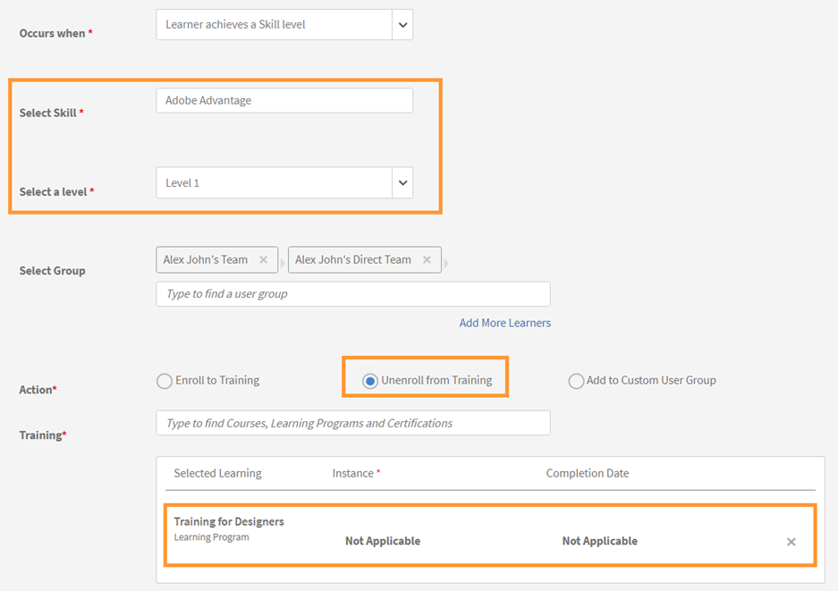
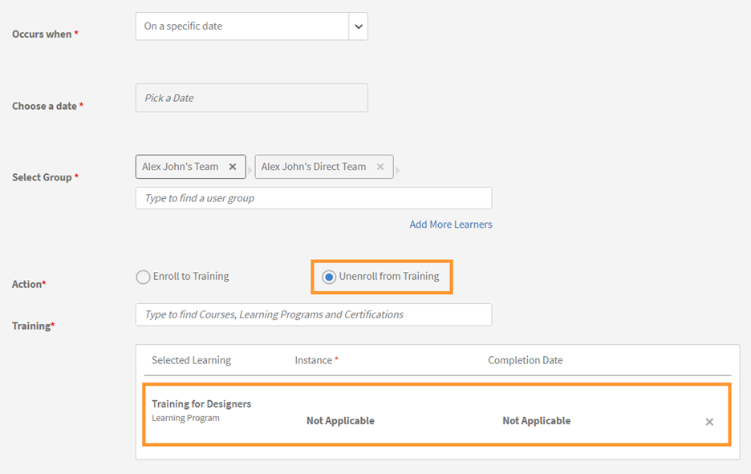

# Leerplannen

Leerplannen voor beheerders maken in Leerbeheer.

## Overzicht {#overview}

Een leerplan is een set regels die studenten inschrijven voor specifieke trainingen op basis van bepaalde criteria.

Een leerplan stelt een beheerder in staat om automatisch cursussen, leerprogramma&#39;s of certificeringen toe te wijzen op basis van het optreden van bepaalde gebeurtenissen, zoals het onboarden van een nieuwe werknemer of het wijzigen van de benoeming of locatie van de werknemers.

Wanneer een werknemer bijvoorbeeld lid wordt van een organisatie, wordt het programma voor de oriëntatie van nieuwe werknemers automatisch toegewezen aan de werknemer. En als een werknemer als manager wordt bevorderd, wordt een programma van de Oriëntatie van de Nieuwe Manager automatisch toegewezen aan de werknemer.

U kunt studenten automatisch inschrijven voor alle cursussen en leerprogramma&#39;s op basis van een vooraf gedefinieerde set gebeurtenissen. U kunt leerpaden naar de studenten maken door automatisch een vervolgleeractiviteit toe te wijzen nadat een student een vaardigheid, cursus of leerprogramma heeft voltooid.

## Leerplannen maken {#createlearningplans}

Als u een leerplan wilt maken, moet u zich aanmelden als beheerder.

1. Klik in het linkerdeelvenster op **[!UICONTROL Leerplannen]**. Als er bestaande gebeurtenissen zijn, worden deze weergegeven op de pagina. Als u de leerplanfunctie echter voor het eerst instelt, gaat u verder met de volgende stap.
1. Klik rechtsboven op de pagina op **[!UICONTROL Toevoegen]**. In het dialoogvenster **[!UICONTROL Leerplan toevoegen]** voert u de naam in van het leerplan dat een medewerker moet volgen.

   

1. In het dialoogvenster **[!UICONTROL Vindt plaats wanneer]** kiest u de gewenste gebeurtenis. De opties bepalen wanneer een student de cursus volgt. Selecteer na het type gebeurtenis de juiste training, cursussen, leerprogramma of certificering.

   **Opmerking:** Zowel beheerders als auteurs kunnen gebeurtenissen voor automatische inschrijving maken.

   De gebeurtenissen zijn:

   **1 - Nieuwe student toegevoegd:** Wanneer een nieuwe gebruiker of werknemer zich bij de organisatie aansluit.

   

   **2 - Student wordt toegevoegd aan een groep:** Wanneer een nieuwe gebruiker of werknemer zich bij een groep aansluit.  Typ en selecteer de gebruikersgroep in de vervolgkeuzelijst waarop deze gebeurtenis van toepassing is. U kunt meerdere groepen kiezen. U kunt deze gebeurtenis ook toewijzen aan alle bestaande leden van deze groepen door de optie te selecteren.

   

   Dit leerplan is specifiek ontworpen voor ***Aangepast - groep*** gebruikers. Typ de naam van de groep in het veld en kies met automatisch aangevulde zoeksuggesties de groep of groepen.

   **3 - Student voltooit een leerobject:** De gebeurtenis wordt geactiveerd wanneer een student een leerobject zoals een cursus, leerprogramma enzovoort voltooit. Selecteer het leerobject waarvoor deze gebeurtenis van toepassing is. Selecteer de voltooiingsstatus voor de gebeurtenis. U kunt ook de gebruikersgroep kiezen waartoe deze student behoort. Voer het aantal dagen in dat na het voltooien van het leerobject deze gebeurtenis wordt geactiveerd. Selecteer de optie als u deze gebeurtenis wilt toewijzen aan bestaande gebruikers die dit leerobject al hebben voltooid.

   

   **4 - Student bereikt een vaardigheidsniveau:** Voer de vaardigheidsnaam in en selecteer het vaardigheidsniveau. U kunt ook de gebruikersgroep kiezen waartoe deze student behoort. Het is optioneel. Voer het aantal dagen in waarna, na het bereiken van de vaardigheid, deze gebeurtenis wordt geactiveerd. Selecteer de optie als u deze gebeurtenis wilt toewijzen aan bestaande studenten die deze vaardigheid al hebben bereikt.

   

   Stel daarnaast het aantal dagen in waarna het leerplan aan de studenten moet worden toegewezen.

   

   **5 - Op een bepaalde datum:** Wanneer de gebeurtenissen op een bepaalde datum moeten plaatsvinden. Selecteer de datum waarop de gebeurtenis moet worden toegewezen. Selecteer de gebruikersgroepen waarvoor de gebeurtenis automatisch moet worden toegewezen. Selecteer de instanties die moeten worden toegewezen en voer eventueel in na hoeveel dagen de gebeurtenis moet worden geactiveerd.

   

1. Voor alle gebeurtenissen kunt u de instantie selecteren in het menu **[!UICONTROL Instantie]** vervolgkeuzelijst. U kunt ook instanties van de toegewezen leerfunctie selecteren voor elke gebeurtenis.

   

   In Learning Manager maakt een leerplan een eigen instantie, Auto. Wanneer u een groep kiest, bijvoorbeeld Alle studenten, worden alle studenten in het leerplan standaard ingeschreven voor de instantie Automatisch.

   Wanneer u het leerplan opslaat, verschijnt de instantie Automatisch als optie in het dialoogvenster **[!UICONTROL Instantie selecteren]** in de sectie Studenten van een cursus.

1. Klik op **[!UICONTROL Opslaan]**.

## Uitschrijven van training {#unenroll-training}

Bij het toevoegen van een leerplan kan een beheerder gebruikers uitschrijven van specifieke trainingen op basis van bepaalde triggers.

Klik in de Admin-app op **[!UICONTROL Leerplannen]** > **[!UICONTROL Toevoegen]**.

De volgende secties geven de triggers aan waar de optie **[!UICONTROL Uitschrijven van training]** is toegevoegd.

## Student wordt uit een groep verwijderd {#learnergetsremovedfromagroup}

1. Voeg een of meer gebruikersgroepen toe. Als er meerdere groepen zijn geselecteerd, wordt het lidmaatschap geactiveerd wanneer een student uit een van de genoemde groepen wordt verwijderd.
1. De handeling kiezen als **[!UICONTROL Uitschrijven van training]**.

   1. De beheerder kan kiezen uit welke trainingen de gebruiker wordt uitgeschreven wanneer deze uit de gebruikersgroep wordt verwijderd.
   1. De instantie- en voltooiingsdatum zijn in dit scenario niet van toepassing.

## Student voltooit een training {#learnercompletesatraining}

1. Voeg een of meer gebruikersgroepen toe. Als er meerdere groepen zijn geselecteerd, wordt het lidmaatschap geactiveerd wanneer een student de opgegeven training heeft voltooid.
1. De handeling kiezen als **[!UICONTROL Uitschrijven van training]**.

   1. De beheerder kan kiezen uit welke trainingen de gebruiker wordt uitgeschreven wanneer deze wordt toegevoegd aan de gebruikersgroep.
   1. Instantie en Voltooiingsdatum zijn in dit geval niet van toepassing.

## Student wordt toegevoegd aan een groep {#learnergetsaddedtoagroup}

1. Voeg een of meer gebruikersgroepen toe. Als er meerdere groepen zijn geselecteerd, wordt het lidmaatschap getriggerd wanneer een student wordt toegevoegd aan een van de genoemde groepen.
1. Kies de handeling Uitschrijven voor training.

   1. De beheerder kan kiezen uit welke trainingen de gebruiker wordt uitgeschreven wanneer deze wordt toegevoegd aan de gebruikersgroep.
   1. Instantie en Voltooiingsdatum zijn in dit geval niet van toepassing.

## Student bereikt vaardigheidsniveau {#learnerachievesaskilllevel}

1. Geef de vaardigheid op die u wilt bereiken.
1. Voeg een of meer gebruikersgroepen toe. Als er meerdere groepen zijn geselecteerd, wordt het lidmaatschap geactiveerd wanneer een student de geselecteerde vaardigheid bereikt.

## Op een specifieke datum {#onaspecificdate}

1. Kies de datum waarop studenten moeten worden uitgeschreven.
1. Voeg een of meer gebruikersgroepen toe. Als er meerdere groepen zijn geselecteerd, wordt het lidmaatschap getriggerd op de datum en worden de gebruikers, die deel uitmaken van de geselecteerde groepen, uitgeschreven.
1. Kies de handeling Uitschrijven voor training.

   1. De beheerder kan de trainingen kiezen waaruit de gebruiker wordt uitgeschreven wanneer deze op de opgegeven datum wordt uitgeschreven.
   1. Instantie en Voltooiingsdatum zijn in dit geval niet van toepassing.

## Een leerplan bewerken {#editalearningplan}

Na het maken van een leerplan kan de beheerder het leerplan op elk moment bewerken/bijwerken. Klik op de naam van het leerplan en wijzig de waarden in het dialoogvenster **[!UICONTROL Leerplan bewerken]** dat wordt weergegeven. Klikken **[!UICONTROL Opslaan]**.

## Leerplan inschakelen {#enablealearningplan}

Standaard zijn alle nieuwe leerplannen die u hebt gemaakt, uitgeschakeld. U moet een plan inschakelen waaraan een student moet worden toegewezen. Wanneer u het selectievakje inschakelt **[!UICONTROL Huidige studenten]**, wordt de gebeurtenis op zichzelf ingeschakeld.

Een leerplan inschakelen:

1. Kies in de lijst met leerplannen het plan dat u wilt inschakelen.

   

1. Klik rechtsboven op de pagina op **[!UICONTROL Handelingen]** > **[!UICONTROL Inschakelen]**. Dit maakt het leerplan mogelijk.

## Leerplan verwijderen {#deletealearningplan}

Een leerplan verwijderen:

1. Kies het plan dat u wilt verwijderen uit de lijst met leerplannen.
1. Klik rechtsboven op de pagina op **[!UICONTROL Handelingen]** > **[!UICONTROL Verwijderen]**.

## Een leerplan uitschakelen {#disablealearningplan}

Een leerplan uitschakelen

1. Klik op de tab **[!UICONTROL Ingeschakeld]**.
1. Kies in de lijst met leerplannen het plan dat u wilt uitschakelen.
1. Klik rechtsboven op de pagina op **[!UICONTROL Handelingen]** > **[!UICONTROL Uitschakelen]**. Hiermee wordt het plan verplaatst naar het **[!UICONTROL Uitgeschakeld]** tabblad.

## Een leerplan filteren {#filteralearningplan}

U kunt leerplannen filteren op basis van het type gebeurtenis dat tijdens het maken van een leerplan is gebruikt. Klikken **[!UICONTROL Type]** en kiest u een optie om leerplannen weer te geven die overeenkomen met de selectie.

## Veelgestelde vragen {#frequentlyaskedquestions}

1. Hoe stel ik Leermanager in om automatische inschrijvingen voor onboarding van nieuwe medewerkers te configureren?

   In het dialoogvenster **[!UICONTROL Vindt plaats wanneer]** vervolgkeuzelijst, kiest u de optie **[!UICONTROL Nieuwe student toegevoegd]**. Wijs vervolgens de leerobjecten, de instantie en de voltooiingsdatum voor de student toe. Zowel beheerders als auteurs kunnen gebeurtenissen voor automatische inschrijving maken. Schakel de gebeurtenis in nadat u deze hebt gemaakt.

1. Hoe stel ik een leerplan/automatische inschrijving in voor een klassikale en virtuele klassikale cursus?

   Het wordt aanbevolen de cursusinstantie met de vereiste sessiedetails in te stellen. Stel vervolgens een leerplan in en wijs dit toe aan de cursusinstantie die al is gemaakt.

1. Hoe bekijk ik de lijst met studenten die zijn ingeschreven voor een specifiek leerplan?

   Wanneer de instantie, Automatisch, wordt gemaakt, klikt u op **[!UICONTROL Cursus]** > **[!UICONTROL Studenten]** en kiest u de gewenste instantie in het menu **[!UICONTROL Instantie]** vervolgkeuzelijst.
