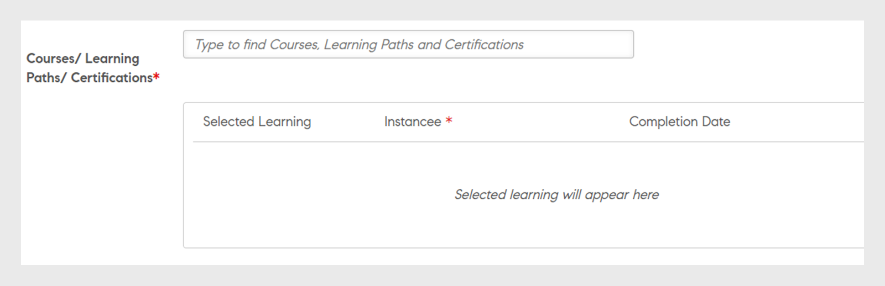
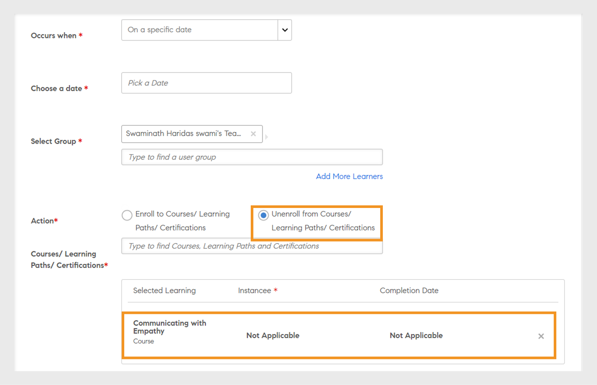

# Leerplannen

Leerplannen maken voor beheerders in Learning Manager.

## Overzicht {#overview}

Een leerplan is een set regels waarmee studenten worden ingeschreven voor specifieke trainingen gebaseerd op bepaalde criteria.

Een leerplan stelt een beheerder in staat om automatisch cursussen, leerprogramma&#39;s of certificeringen aan studenten toe te wijzen, gebaseerd op het optreden van bepaalde gebeurtenissen, zoals de onboarding van een nieuwe werknemer of het veranderen van de benoeming of locatie van werknemers.

Wanneer een werknemer bijvoorbeeld bij een organisatie komt werken, wordt het programma voor oriëntatie van nieuwe werknemers automatisch aan de werknemer toegewezen. Wordt een werknemer gepromoot tot manager, dan wordt er automatisch een programma voor oriëntatie van nieuwe managers aan de werknemer toegewezen.

U kunt studenten automatisch inschrijven voor alle cursussen en leerprogramma&#39;s op basis van een vooraf gedefinieerde set gebeurtenissen. U kunt leerpaden naar de studenten maken door automatisch een vervolgleeractiviteit toe te wijzen nadat een student een vaardigheid, cursus of leerprogramma heeft voltooid.

## Leerplannen maken {#createlearningplans}

U moet u aanmelden als beheerder om een leerplan te maken.

1. Klik op **[!UICONTROL Leerplannen]** in het linkerdeelvenster. Als er bestaande gebeurtenissen zijn, worden deze op de pagina vermeld. Stelt u echter de leerplanfunctie voor het eerst in, ga dan naar de volgende stap.
1. Klik rechtsboven op de pagina op **[!UICONTROL Toevoegen]**. Klik in het dialoogvenster **[!UICONTROL Leerplannen toevoegen]** de naam in van het leerplan dat een werknemer moet volgen.

   

1. Kies de gewenste gebeurtenis in de vervolgkeuzelijst **[!UICONTROL Treedt op wanneer]**. De opties bepalen wanneer een student de cursus volgt. Selecteer na het type gebeurtenis de juiste training, cursussen, leerprogramma of certificering.

   **Opmerking:** Zowel beheerders als auteurs kunnen gebeurtenissen voor automatische inschrijving maken.

   De gebeurtenissen zijn:

   **1 - Nieuwe student toegevoegd:** Wanneer een nieuwe gebruiker of werknemer zich bij de organisatie aansluit.

   

   **2 - Student wordt toegevoegd aan een groep:** Wanneer een nieuwe gebruiker of werknemer zich bij een groep aansluit.  Typ en selecteer de gebruikersgroep in de vervolgkeuzelijst waarop deze gebeurtenis van toepassing is. U kunt meerdere groepen kiezen. U kunt door het selecteren van de optie deze gebeurtenis ook toewijzen aan alle bestaande leden van deze groepen.

   

   Dit leerplan is specifiek ontworpen voor ***Aangepaste gebruikersgroepen***. Typ de naam van de groep in het veld en gebruik automatisch aangevulde zoeksuggesties om de groep of groepen te kiezen.

   **3 - Student voltooit een leerobject:** De gebeurtenis wordt geactiveerd wanneer een student een leerobject zoals een cursus, leerprogramma enzovoort voltooit. Selecteer het leerobject waarop deze gebeurtenis van toepassing is. Selecteer de voltooiingsstatus van de gebeurtenis. U kunt eventueel ook de gebruikersgroep kiezen waartoe deze student behoort. Voer het aantal dagen in waarna, na het voltooien van het leerobject, deze gebeurtenis getriggerd wordt. Selecteer de optie als u deze gebeurtenis wilt toewijzen aan bestaande gebruikers die dit leerobject al hebben voltooid.

   

   **4 - Student bereikt een vaardigheidsniveau:** Voer de vaardigheidsnaam in en selecteer het vaardigheidsniveau. U kunt ook de gebruikersgroep kiezen waartoe deze student behoort. Dit is optioneel. Voer het aantal dagen in waarna, na het bereiken van de vaardigheid, deze gebeurtenis wordt geactiveerd. Selecteer de optie als u deze gebeurtenis wilt toewijzen aan bestaande studenten die deze vaardigheid al hebben verworven.

   

   U kunt daarnaast het aantal dagen instellen waarna het leerplan aan de studenten moet worden toegewezen.

   

   **5 - Op een bepaalde datum:** Wanneer de gebeurtenissen op een bepaalde datum moeten plaatsvinden. Selecteer de datum waarop de gebeurtenis moet worden toegewezen. Selecteer de gebruikersgroepen waarvoor de gebeurtenis automatisch moet worden toegewezen. Selecteer de instanties die moeten worden toegewezen en voer eventueel in na hoeveel dagen de gebeurtenis moet worden geactiveerd.

   

1. U kunt voor alle gebeurtenissen de instantie selecteren in de vervolgkeuzelijst **[!UICONTROL Instantie]**. U kunt ook instanties van het toegewezen leermateriaal voor een gebeurtenis selecteren.

   

   In Learning Manager maakt een leerplan zijn eigen instantie, Automatisch. Wanneer u een groep kiest, bijvoorbeeld Alle studenten, worden alle studenten in het leerplan standaard in de instantie Automatisch ingeschreven.

   Wanneer u het leerplan opslaat, verschijnt de instantie Automatisch als optie in de vervolgkeuzelijst **[!UICONTROL Instantie selecteren]** in de sectie Studenten van een cursus.

1. Klik op **[!UICONTROL Opslaan]** om het leerplan op te slaan.

## Uitschrijven uit training {#unenroll-training}

Bij het toevoegen van een leerplan kan een Beheerder gebruikers uitschrijven uit bepaalde trainingen op basis van bepaalde triggers.

Klik in de Admin-app op **[!UICONTROL Leerplannen]** > **[!UICONTROL Toevoegen]**.

De volgende secties geven de triggers aan waar de optie **[!UICONTROL Uitschrijven van training]** is toegevoegd.

## Student wordt uit een groep verwijderd {#learnergetsremovedfromagroup}

1. Een of meer gebruikersgroepen toevoegen. Als er meerdere groepen zijn geselecteerd, wordt het lidmaatschap geactiveerd wanneer een student uit een van de genoemde groepen wordt verwijderd.
1. De handeling kiezen als **[!UICONTROL Uitschrijven van training]**.

   1. De beheerder kan kiezen uit welke trainingen de gebruiker wordt uitgeschreven wanneer deze uit de gebruikersgroep wordt verwijderd.
   1. De instantie- en voltooiingsdatum zijn in dit scenario niet van toepassing.

## Student voltooit een training {#learnercompletesatraining}

1. Een of meer gebruikersgroepen toevoegen. Als er meerdere groepen zijn geselecteerd, wordt het lidmaatschap geactiveerd wanneer een student de opgegeven training heeft voltooid.
1. De handeling kiezen als **[!UICONTROL Uitschrijven van training]**.

   1. De Beheerder kan de trainingen kiezen waar de gebruiker wordt uitgeschreven als hij/zij wordt toegevoegd aan een gebruikersgroep.
   1. In dit geval zijn de instantie- en voltooiingsdatum niet van toepassing.

## Student wordt toegevoegd aan een groep {#learnergetsaddedtoagroup}

1. Een of meer gebruikersgroepen toevoegen. Als er meerdere groepen zijn geselecteerd, wordt het lidmaatschap getriggerd wanneer een student wordt toegevoegd aan een van de genoemde groepen.
1. Kies de actie Uitschrijven uit training.

   1. De Beheerder kan de trainingen kiezen waar de gebruiker wordt uitgeschreven als hij/zij wordt toegevoegd aan een gebruikersgroep.
   1. In dit geval zijn de instantie- en voltooiingsdatum niet van toepassing.

## Student bereikt een vaardigheidsniveau {#learnerachievesaskilllevel}

1. Geef de vaardigheid op die u wilt bereiken.
1. Een of meer gebruikersgroepen toevoegen. Wanneer meerdere groepen zijn geselecteerd, wordt het plan in werking gesteld wanneer een student de geselecteerde vaardigheid behaald.

## Op een specifieke datum {#onaspecificdate}

1. De datum selecteren waarop studenten uitgeschreven dienen te worden.
1. Een of meer gebruikersgroepen toevoegen. Als er meerdere groepen zijn geselecteerd, wordt het lidmaatschap getriggerd op de datum en worden de gebruikers, die deel uitmaken van de geselecteerde groepen, uitgeschreven.
1. Kies de actie Uitschrijven uit training.

   1. De beheerder kan de trainingen kiezen waaruit de gebruiker wordt uitgeschreven wanneer deze op de opgegeven datum wordt uitgeschreven.
   1. In dit geval zijn de instantie- en voltooiingsdatum niet van toepassing.

## Leerplan bewerken {#editalearningplan}

Na het maken van een leerplan kan de beheerder het leerplan op elk moment bewerken/bijwerken. Klik op de naam van het leerplan en wijzig de waarden in het pop-upvenster **[!UICONTROL Leerplan bewerken]** om het te bewerken. Klik op **[!UICONTROL Opslaan]**.

## Leerplan inschakelen {#enablealearningplan}

Standaard zijn alle nieuwe leerplannen die u hebt gemaakt, uitgeschakeld. U moet een plan inschakelen waaraan een student moet worden toegewezen. Wanneer u het selectievakje inschakelt **[!UICONTROL Huidige studenten]**, wordt de gebeurtenis op zichzelf ingeschakeld.

Zo schakelt u een leerplan in:

1. Kies het plan dat u wilt inschakelen uit de lijst met leerplannen.

   

1. Klik rechtsboven op de pagina op **[!UICONTROL Handelingen]** > **[!UICONTROL Inschakelen]**. Het leerplan wordt ingeschakeld.

## Leerplan verwijderen {#deletealearningplan}

Zo verwijdert u een leerplan:

1. Kies het plan dat u wilt verwijderen uit de lijst met leerplannen.
1. Klik rechtsboven op de pagina op **[!UICONTROL Handelingen]** > **[!UICONTROL Verwijderen]**.

## Leerplan uitschakelen {#disablealearningplan}

Zo schakelt u een leerplan uit:

1. Klik op het tabblad **[!UICONTROL Ingeschakeld]**.
1. Kies het plan dat u wilt uitschakelen uit de lijst met leerplannen.
1. Klik rechtsboven op de pagina op **[!UICONTROL Handelingen]** > **[!UICONTROL Uitschakelen]**. Hiermee verplaatst u het plan naar het tabblad **[!UICONTROL Uitgeschakeld]**.

## Leerplan filteren {#filteralearningplan}

U kunt leerplannen filteren op basis van het type gebeurtenis dat is gebruikt om een leerplan te maken. Klik op **[!UICONTROL Type]** en kies een optie om leerplannen weer te geven die met de selectie overeenkomen.

## Veelgestelde vragen {#frequentlyaskedquestions}

1. Hoe stel ik Leermanager in om automatische inschrijvingen voor onboarding van nieuwe medewerkers te configureren?

   In het dialoogvenster **[!UICONTROL Vindt plaats wanneer]** vervolgkeuzelijst, kiest u de optie **[!UICONTROL Nieuwe student toegevoegd]**. Wijs vervolgens de leerobjecten, de instantie en de voltooiingsdatum voor de student toe. Zowel beheerders als auteurs kunnen gebeurtenissen voor automatische inschrijving maken. Schakel de gebeurtenis in nadat u deze hebt gemaakt.

1. Hoe stel ik een leerplan/automatische inschrijving in voor een klassikale en virtuele klassikale cursus?

   Het is raadzaam de cursusinstantie met de vereiste sessiedetails in te stellen. Stel vervolgens een leerplan in en wijs dit toe aan de cursusinstantie die al is gemaakt.

1. Hoe bekijk ik de lijst met studenten die zijn ingeschreven voor een specifiek leerplan?

   Wanneer de instantie, Automatisch, wordt gemaakt, klikt u op **[!UICONTROL Cursus]** > **[!UICONTROL Studenten]** en kiest u de gewenste instantie in het menu **[!UICONTROL Instantie]** vervolgkeuzelijst.
