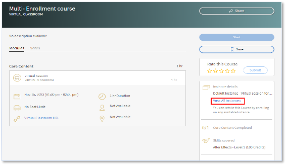

# Meervoudige inschrijvingen in Adobe Learning Manager

Elke cursus kan in Adobe Learning Manager verschillende instanties hebben. Een van uw primaire taken als accountbeheerder is het maken van verschillende exemplaren van VILT-sessies in verschillende tijdzones en het mogelijk maken van sessies voor specifieke gebruikersgroepen.

Vóór de release van juli 2023 kon een student zich maar voor een instantie inschrijven wanneer een beheerder een student inschreef. Als een student een cursus in verschillende instanties wilde volgen, moest de beheerder tal van cursussen maken, één voor elke instantie.

Met de functie Meervoudige inschrijvingen van Adobe Learning Manager kan een beheerder dergelijke scenario&#39;s vermijden.

## Instanties beheren

>[!INFO]
>
>In deze training leert u hoe u instantiedetails en instantie-eigenschappen kunt bewerken.     

Schrijf naar <almacademy@adobe.com> als u de training niet kunt starten.

## Wat is Meervoudige inschrijving?

Meervoudige inschrijvingen schrijft een student meerdere keren in een cursus in via verschillende beschikbare instanties.  Een student kan zich in meerdere cursusinstanties inschrijven, ongeacht de status waarvoor hij of zij zich heeft ingeschreven, die is voltooid of nog moet starten. Wanneer de auteur [!UICONTROL Meervoudige inschrijvingen] inschakelt, kan een student zich vervolgens voor meerdere instanties van de cursus inschrijven.

*Lanceer Meerdere Inschrijving van Montages*

De voortgang van elke instantie kan afzonderlijk worden bijgehouden en er kan een rapport worden geëxporteerd om de voortgang van elke instantie bij te houden.

## Belangrijke punten

* Meervoudige inschrijvingen is alleen van toepassing wanneer een cursus meerdere instanties heeft.
* Als de optie Meervoudige inschrijvingen is ingeschakeld en gebruikers voor meerdere instanties zijn ingeschreven, worden voor elke cursus nieuwe rijen gemaakt in het rapport Studenttranscript (één rij voor elke instantie en elke student)
* Als u een automatiseringsinstelling hebt ingesteld die slechts één rij per cursus verwacht, moet u de vereiste aanpassingen in de rapportautomatisering aanbrengen voordat u de functie Meervoudige inschrijvingen inschakelt.

## Hoe Meervoudige inschrijvingen wordt ingeschakeld

1. Meld u als auteur aan bij uw Adobe Learning Manager-account.
1. Selecteer de cursus waarvoor u studenten meerdere keren wilt inschrijven.
1. In het linkerpaneel, uitgezocht **[!UICONTROL Montages]** > **[!UICONTROL geef]** uit > **[!UICONTROL configuratie van de Instantie]** > **[!UICONTROL laat Veelvoudige Inschrijving]** toe.

*laat multi-Inschrijving* toe

>[!NOTE]
>
>Als auteur kunt u niet tegelijkertijd Instantie wisselen en Meerdere inschrijvingen inschakelen.

## Studentenweergave

Meervoudige inschrijvingen zijn handig wanneer een student zich wil inschrijven voor een klassikale of VC-cursus of een cursus opnieuw wil voltooien voordat deze naar een andere cursus gaat.

Voor studenten die zich niet hebben ingeschreven, zien ze, wanneer ze een cursus selecteren, het scherm onder de cursus met meerdere instanties. Vervolgens kunnen gebruikers elke instantie selecteren en zich inschrijven.

*Bekijk de instanties*

Nadat ze zich in één instantie hebben ingeschreven, kunnen ze zich in andere gevallen inschrijven door de optie Alle instanties weergeven in het rechterdeelvenster te selecteren.

*schrijf in een instantie* in

De voortgang van elke instantie kan als volgt, worden bijgehouden:

*vooruitgang van het spoor van elke instantie*

## Wijzigingen in meervoudige inschrijvingen in de beheerder

**Inschrijving:**

Tijdens het inschrijven van de studenten kunt u het volgende selectievakje inschakelen:

*&quot;Geselecteerde studenten zijn mogelijk al ingeschreven voor andere instanties van deze cursus. Geef deze student(en) ook de mogelijkheid zich in te schrijven voor de instantie...*

*optie van de Inschrijving voor Admins*

Als de student al voor één instantie is ingeschreven en u als beheerder probeert de student in te schrijven voor een andere cursusinstantie, selecteert u Ja.

## Rapportage

Voor een student die voor twee instanties van dezelfde cursus is ingeschreven, worden voor elke cursusinstantie twee rijen gemaakt. Het rapport geeft ook de voortgang van de instanties weer.
