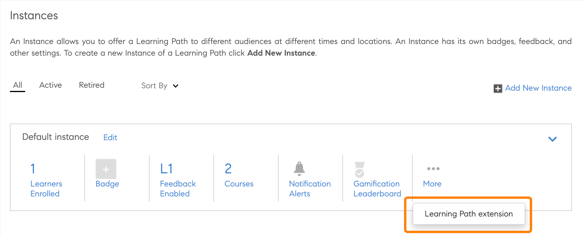

# Systeemeigen uitbreidbaarheid

U kunt aangepaste ervaringen instellen in de systeemeigen versie van Adobe Learning Manager, zodat u niet zonder koppen hoeft te werken voor minder ingewikkelde gebruikssituaties. U kunt ook aangepaste apps maken en deze op verschillende punten plaatsen in de systeemeigen versie van de workflows voor studenten, managers, auteurs en docenten.

Adobe Leermanager ondersteunt 15 aanroeppunten in de Admin-, Auteur-, Student-, Manager- en Docent-app.

## Een extensie maken

1. Als beheerder selecteert u **[!UICONTROL Systeemeigen extensies]** in het linkerdeelvenster.
1. Selecteer Een extensie toevoegen.
1. Typ de naam van de extensie in het dialoogvenster **[!UICONTROL Naam]** veld.
1. Typ de beschrijving van de extensie in het dialoogvenster **[!UICONTROL Beschrijving]** veld.
1. Selecteer een aanroepingspunt. Een aanroepingspunt is een willekeurige locatie in Adobe Learning Management waarop er een koppeling of knop kan worden toegevoegd in een aangepaste app. De volgende aanroepingspunten zijn beschikbaar:

   Selecteer in dit voorbeeld **[!UICONTROL Beheerder]**, **[!UICONTROL Auteur: Cursus]**, **[!UICONTROL Leerpad]** - **[!UICONTROL Instanties]** - **[!UICONTROL Instantierij]**.

   
   *Aanroepingspunt selecteren*

1. Typ het extensielabel dat wordt weergegeven in de gebruikersinterface van het dialoogvenster **[!UICONTROL Extensielabel]** veld.
1. Typ de URL waarop u de extensie wilt hosten in het **[!UICONTROL URL]** veld.
1. Geef in het vervolgkeuzemenu Openen in op of de extensie moet worden gestart in een modaal of op een nieuw tabblad.
1. Selecteer de grootte van het modale venster. De opties zijn beschikbaar als u *In-app* in de vorige stap.

   Om de toegankelijkheid in popup te handhaven, moet de extensie-app naar de gebeurtenis worden verzonden zodra ze zich op het laatste focuselement op hun website bevinden, waarna de gebruiker de TAB-sleutel selecteert. Dit is nodig om de focus in de pop-up te houden ter ondersteuning van toegankelijkheid.

   ```
   window.parent.postMessage({*}
   
   { type: 'ALM_EXTENSION_APP', eventType: 'trapFocusInModal' }
   
   ,{}'');
   ```

1. Stel het bereik van de extensie in. De volgende opties zijn beschikbaar:

   * **[!UICONTROL Alle cursussen, leerpaden en certificeringen]**: Deze extensie is ingeschakeld voor alle cursussen, leerpaden en certificeringen. Samen met beheerders kunnen auteurs deze functie uitschakelen voor bepaalde cursussen, leerpaden en certificeringen.
   * **[!UICONTROL Geselecteerde cursussen, leerpaden en certificeringen]**: Deze extensie is uitgeschakeld voor alle cursussen, leerpaden en certificeringen. Samen met beheerders kunnen auteurs deze functie inschakelen voor bepaalde cursussen, leerpaden en certificeringen.

1. Selecteer **[!UICONTROL Activeren]** om de extensie actief te maken. Zodra de extensie actief is, wordt deze op het opgegeven aanroepingspunt weergegeven volgens het bereik.
1. Selecteer **[!UICONTROL Opslaan]** in de rechterbovenhoek van de pagina om de extensie te maken.

## Open de extensie als beheerder

1. Als beheerder selecteert u **[!UICONTROL Leerpaden]** in de linkerwerkbalk.
1. Selecteer een cursus > **[!UICONTROL Leerpad weergeven]**.
1. Selecteer **[!UICONTROL Instanties]** in het linkerdeelvenster.
1. Selecteer **[!UICONTROL Meer]** onder Instanties. De extensie wordt weergegeven onder Instanties.

   
   *Selecteer de extensie*

   Wanneer u de extensie selecteert, wordt de extensie in het modale venster weergegeven.

## Toegang tot de extensie als auteur

1. Als beheerder selecteert u **[!UICONTROL Leerpaden]** in de linkerwerkbalk.
1. Selecteer een cursus > **[!UICONTROL Leerpad weergeven]**.
1. Selecteer **[!UICONTROL Instanties]** in het linkerdeelvenster.
1. Selecteer **[!UICONTROL Meer]** onder Instanties. De extensie wordt weergegeven onder Instanties.

   
   *Toegang tot extensie als auteur*

   Wanneer u de extensie selecteert, wordt de extensie in het modale venster weergegeven.

## Alle extensies weergeven

Als beheerder kunt u alle extensies weergeven op de pagina Native extensies. Selecteer Systeemeigen extensies in het linkerdeelvenster van de app om de lijst weer te geven.


*Alle extensies weergeven*

## Een extensie in- of uitschakelen

Als auteur kunt u op de pagina Instellingen van een cursus een extensie voor een cursus, certificering of leerpad in- of uitschakelen.


*Een extensie activeren*

## Een toegangssleutel delen

U moet de toegangssleutel delen als u een inschrijvingsextensie configureert.

Dit is belangrijk omdat als deze sleutel niet wordt gegenereerd en gedeeld, de verificatie voor de inschrijving mislukt en studenten zich niet kunnen inschrijven voor de cursussen.

De toegangstoets moet worden gedeeld om u in te schrijven voor een cursus of leerpad en certificaten.

Genereer de sleutel op het tabblad Instellingen.


*De toegangstoets delen*

## Extensierapport downloaden

U kunt dit rapport op twee manieren downloaden.

**Rapport voor extensieconfiguratie**

1. Selecteer op de pagina Systeemeigen extensies de optie **[!UICONTROL Rapport voor extensieconfiguratie]**.

   
   *Extensierapport downloaden*

   Het rapport wordt gegenereerd.

1. Selecteer OK.

   
   *Het rapport genereren*

   Het rapport bevat het volgende velden:

   * Extensienaam
   * Aanroepingspunt
   * Label
   * Openen in URL
   * Bereik
   * Activeren
   * Unieke ID van LO
   * Training-ID
   * Type training
   * Trainingsnaam

**Pagina Rapporten**

1. In **[!UICONTROL Rapporten]** > **[!UICONTROL Aangepaste rapporten]** selecteert u **[!UICONTROL Rapport voor extensieconfiguratie]**.

   
   *Download het rapport vanaf de pagina Rapporten*

De status moet binnen het bereik vallen **0 - 4294967295** tijdens het configureren van de inschrijvingsstatus.
