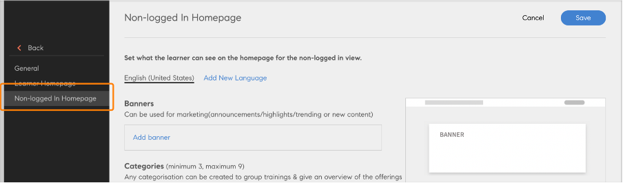
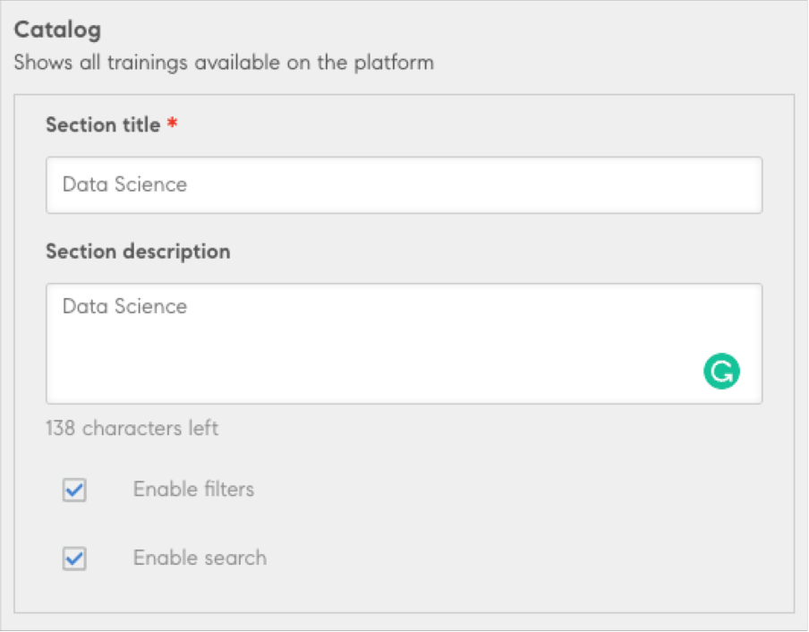

# Niet-aangemelde ervaring voor studenten

Adobe Leermanager (eigen portal) ondersteunt een niet-geregistreerde manier om toegang te krijgen tot de trainingssite. Als deze modus is ingeschakeld, kunnen studenten de trainingssite vinden en openen en verschillende beschikbare cursussen en inhoud uitchecken.

Met de niet-aangemelde ervaring kunnen studenten naar cursussen bladeren zonder in een portal te zijn aangemeld.

Voor het inschakelen van de niet-aangemelde startpagina moet de integratiebeheerder de [Training Data-connector](/help/migrated/integration-admin/feature-summary/connectors.md#training-data-access) inschakelen en configureren.

De training kan vervolgens uit de connector worden geëxporteerd.

>[!NOTE]
>
>Zorg ervoor dat de optie Native Learning Manager is geselecteerd.

De beheerder kan de startpagina aanpassen en configureren, die bedoeld is voor gebruikers die niet zijn aangemeld.

>[!IMPORTANT]
>
>Adobe Leermanager LeerAPI&#39;s stellen u in staat een aangepaste leerervaring voor uw gebruikers te maken. Het gebruik van deze API&#39;s vereist een geldig gebruikerstoken en moet alleen worden gebruikt voor workflows waarbij een volledig gelicentieerde/geregistreerde student aanwezig is. Ze mogen niet worden gebruikt, zoals bij het ophalen van gegevens, om niet-aangemelde gebruikers/gedeelde gebruikers of andere dergelijke gevallen te ondersteunen. Niet-aangemelde gebruiksgevallen vereisen een speciale afhandeling. Bereik uit aan het team van de Architectuur van de Oplossing, voor het geval u om het even welke vragen over het aangewezen gebruik van deze APIs hebt en ervoor zorgt dat een Architect van de Oplossing een oplossing heeft onderzocht alvorens u het opstelt.

## Opties voor de startpagina starten

Selecteer op de startpagina van Adobe Learning Manager de optie **Branding**. Selecteer vervolgens Niet-aangemelde startpagina in het linkerdeelvenster.

*Selecteer de optie Niet-aangemelde startpagina*

## Banner toevoegen

Voeg een banner toe voor elke marketingaankondiging of voor het trending onderwerp van de dag. Selecteren **banner toevoegen**.

*Een banner toevoegen*

Blader naar de locatie van de afbeelding die als banner moet worden gebruikt. Geef vervolgens een koppeling op als actieknop op de bannerafbeelding.

## Categorieën toevoegen

Dit onderdeel kan worden gebruikt om de catalogus te filteren op tags, vaardigheden en catalogus. Deze sectie bevat een kop en een beschrijving voor elke categorie. Na klikken komt de gebruiker bij de cataloguspagina met de toegepaste filters.

Selecteren **[!UICONTROL Categorie toevoegen]**. Voer vervolgens de gegevens voor de categorie in.

*Categorieën toevoegen*

Sla de categorie op. Vervolgens wordt de categorie aan de sectie toegevoegd.

## Catalogus toevoegen

Voeg een catalogus toe voor gebruikers die niet zijn aangemeld, zodat ze door alle trainingen op het platform kunnen bladeren.

*Een catalogus toevoegen*

Alle geëxporteerde trainingen zijn aanwezig.

## Niet-ondersteunde functies

* Taakhulpen worden niet geëxporteerd. Studenten kunnen ze echter zien nadat ze zich hebben aangemeld.
* Sorteren op in de component catalog.
* Standaardinstelling voor weergave gebruikt in de beheertoepassing (Instellingen > Algemeen > Lijstweergave).
* Sterrenclassificatie/effectiviteit.
* Instelling kaartpictogram.
* Instelling voor relevante vaardigheden en tags.
* Student-appweergave die per catalogus wordt weergegeven.
* Trainingsoverzicht-pagina&#39;s - Als u op de kaart klikt, wordt u naar  Aanmelden geleid, waarna een gebruiker wordt doorgeleid naar de pagina met trainingsoverzicht/instantie.
* Alle ingeschakelde catalogi zijn aanwezig. Studenten die geen toegang tot een catalogus hebben, kunnen de catalogus na aanmelding niet zien of gebruiken.
