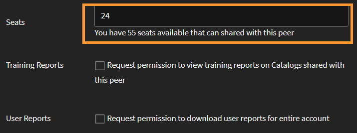

# Collega-accounts

Lees dit artikel voor informatie om collega-accounts in Learning Manager te maken en beheren.

Het is mogelijk gekochte plaatsen te delen in Learning Manager met behulp van de functie Collega-account. Een beheerder kan met behulp van collega-accounts in Learning Manager de gekochte plaatsen delen met de collega-accounts waaraan de beheerder is gekoppeld. De beheerder die het delen van plaatsen heeft gestart, kan ook de rapporten van de collega-accounts zien.

## Een collega-account toevoegen {#addapeeraccount}

1. Van het dashboard van de Beheerder, klik **[!UICONTROL Montages]** > **[!UICONTROL Collega Rekeningen]**.
1. Van de hoger-juiste hoek klik **[!UICONTROL toevoegen]**.

   

   *voeg peer rekening* toe

1. Op het **[!UICONTROL Subdomain van de Rekening]** gebied, specificeer subdomein waarmee u een peer rekening wilt vestigen.

   

   *voeg een subdomein toe*

>[!NOTE]
>
>Controleer de URL van het account om het subdomein van een ander account te zoeken. Het subdomein wordt vóór het hoofddomein weergegeven en helpt bij het identificeren van het specifieke account.
>
>Bijvoorbeeld:
>
>In URL [ https://www.learningmanager.com/accountname ](https://www.learningmanager.com/accountname), is subdomain **accountname**.
>
>In URL [ https://www.accountname.learningmanager.com ](https://www.accountname.learningmanager.com), is subdomain ook **accountnaam**.
>
>Het subdomein is uniek voor elke account en wordt gebruikt om toegang te krijgen tot de betreffende Learning Manager-instantie.

1. Voer de e-mail-ID in van de beheerder die het verzoek voor het collega-account accepteert of afwijst.
1. Geef het aantal plaatsen op dat u met uw collega wilt delen. Wanneer u plaatsen deelt met het collega-account, krijgt het collega-account de status Actief met de ontvangen plaatsen of met de eigen gekochte plaatsen van de collega.

   Als u een cijfer invoert dat hoger is dan de beschikbare plaatsen, geeft het systeem een waarschuwing weer.

1. Selecteer het vakje als u de inschrijvingsrapporten en gedeelde catalogusrapporten van uw collega&#39;s wilt bekijken.
1. Klik op Toevoegen om het collega-account toe te voegen.

   Als een beheerder plaatsen deelt met een collega, kan de collega deze niet met iemand anders delen. De collega kan echter afzonderlijk een aantal plaatsen kopen en deze delen.

## De plaatsen weergeven die worden gedeeld door collega-accounts

Beheerders kunnen het aantal plaatsen zien dat door de collega-accounts wordt gedeeld in de beheerdersinterface.

De plaatsen weergeven die worden gedeeld door het collega-account:

1. Meld u als beheerder aan bij Adobe Learning Manager.
2. Selecteer **[!UICONTROL Gebruikers]** en selecteer dan **[!UICONTROL Intern]**.

_sectie die van Gebruikers het aantal plaatsen tonen door de peer rekening wordt gedeeld_

## Rapporten gekoppeld aan collega-accounts weergeven {#viewreportsassociatedwithpeeraccounts}

Nadat u een collega-account heeft gemaakt, kunt u ook rapporten voor de collega-accounts uitzetten. Als u als beheerder het verzoek om een collega-account initieert, kunt u de rapporten voor het collega-account bekijken.

Als de collega ook de beheerdersrapporten wil bekijken, moet de collega een apart verzoek voor een collega-account naar de beheerder sturen.

Zie [Collegarapporten weergeven](reports.md#main-pars_header_894271250) voor informatie om de gedeelde catalogi voor het collega-account te genereren en bekijken.

## Collega-accounts verwijderen {#deletingpeeraccounts}

Als u plaatsen of aankopen niet langer met een account wilt delen, kunt u het collega-account verwijderen.

1. Klik in de Learning Manager-beheerdersapp op Instellingen > Collega-accounts.
1. Selecteer de collega-account of -accounts die u wilt verwijderen.
1. Voer een van de volgende handelingen uit:

   * Klik op Verwijderen rechtsboven op de pagina.
   * Klik op het pictogram Verwijderen naast het collega-account dat u wilt verwijderen.

   Nadat een collega-account is verwijderd, zijn de gereserveerde plaatsen niet langer beschikbaar. Als het collega-account alleen ontvangen plaatsen had en geen gekochte plaatsen, krijgt het account de status Inactief.

## Gebruikersrapport voor collega-accounts {#download-peer-account}

De beheerder kan het gebruikersrapport van het collega-account bekijken. De bovenliggende accountbeheerder kan verzoeken om toegang te krijgen tot het rapport. Zodra de beheerder van het collega-account dit accepteert, kan de bovenliggende beheerder het aantal geregistreerde gebruikers in het collega-account bekijken en het gebruikersrapport voor het collega-account downloaden.

1. Klik op de pagina Collega-accounts op **[!UICONTROL Toevoegen]**.
1. Laat de optie, **[!UICONTROL toestemming van het Verzoek om gebruikersrapporten voor volledige rekening]** te downloaden.

*gebruikersrapport van de Mening van een peer rekening*

Om de rapporten voor peer rekeningen te downloaden, klik **[!UICONTROL Download]**.

## Veelgestelde vragen {#frequentlyaskedquestions}

+++Hoe kan ik licenties van de ene account naar de andere delen?

Wanneer u een collega-account toevoegt, kunt u het aantal plaatsen opgeven dat u met een andere collega-account kunt delen.

*de plaatsen van het Aandeel van één rekening aan een andere*
+++
