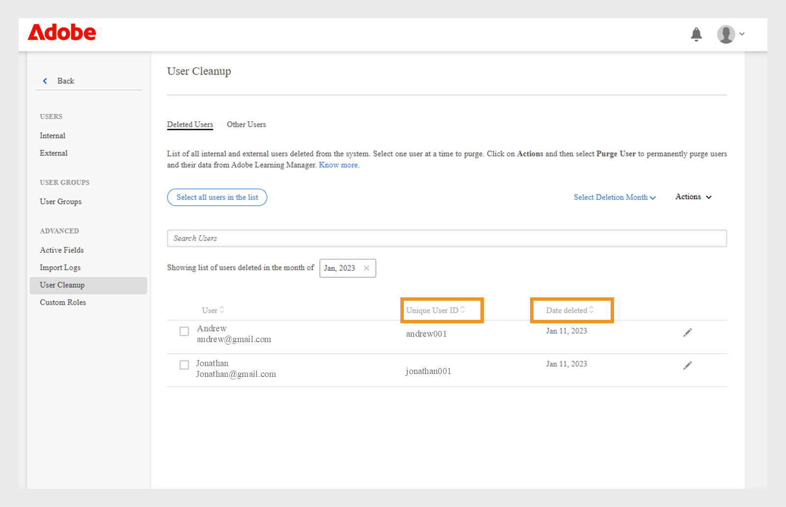

# Gebruikers leegmaken

Meer weten over het leegmaken van gebruikersgegevens in Learning Manager.

## Overzicht {#overview}

Gebruik de functie voor gebruikers leegmaken om persoonlijke identificeerbare informatie en leergegevens van de gebruiker uit Learning Manager te verwijderen. Let op: Gebruiker verwijderen en Gebruiker leegmaken zijn twee verschillende functies. Hoewel een verwijderde gebruiker kan worden hersteld, kunnen niet alle gebruikersgegevens en leerrecords die aan leeggemaakte gebruikers zijn gekoppeld, worden hersteld.

Gebruikers leegmaken kan resulteren in het volgende:

* Als een gebruiker wordt leeggemaakt, werken de koppelingen in importlogboeken niet om het downloaden van oude CSV&#39;s te voorkomen en de gebruikersgegevens opnieuw in het systeem te plaatsen.
* Als een auteur wordt leeggemaakt, wordt zijn naam vervangen door de naam van de beheerder die die gebruiker leeggemaakt heeft.
* Als de docenten worden leeggemaakt, worden ze uit de sessies verwijderd. De beheerder moet docenten voor dergelijke sessies vervangen/toevoegen.
* Als u een gebruiker in Learning Manager leegmaakt, wordt de gebruiker niet uit externe toepassingen (systemen van derden of andere door u geschreven toepassingen) verwijderd. Neem contact op met de eigenaar van de externe toepassing om de gebruikers uit dergelijke toepassingen te laten verwijderen.
* Als in de configuratie-instellingen van een connector naar een leeggemaakte gebruiker wordt verwezen, wordt de connector uitgeschakeld. De connector moet opnieuw worden geconfigureerd door de beheerder om te hervatten.

<!---### Manage users

In this training, you will learn how to assign and remove roles, send a welcome email, and delete and purge users. 

If you're unable to launch the training, write to <almacademy@adobe.com>.-->

## Gebruikers leegmaken

Volg deze stappen om gebruikers leeg te maken:

1. Als beheerder selecteert u **[!UICONTROL Gebruikers]** in het linkerdeelvenster. De pagina **[!UICONTROL Interne gebruikers]** wordt geopend.
1. Verwijder de gebruikers die u wilt leegmaken. Selecteer een of meer gebruikers met behulp van het selectievakje om deze te verwijderen. Open het **[!UICONTROL drop-down van de Actie]** en selecteer **[!UICONTROL Gebruiker van de Schrapping.]**
1. Selecteer in het linkerdeelvenster de optie **[!UICONTROL Gebruikers opschonen]**. De pagina **[!UICONTROL Gebruikers opschonen]** verschijnt met een lijst met verwijderde gebruikers. Gebruik de keuzerondjes om de leeg te maken gebruiker te selecteren. U kunt slechts één gebruiker tegelijk leegmaken.

   

   *selecteer een gebruiker om te zuiveren*

1. Open het **[!UICONTROL drop-down menu van Acties]** en selecteer **[!UICONTROL Leegmaken Gebruiker]**.

   

   *selecteer de optie van de Gebruiker van de Wrijving*

1. Er verschijnt een dialoogvenster dat waarin om bevestiging wordt gevraagd. Zodra de gebruiker is leeggemaakt, worden alle gebruikersgegevens en leerrecords van de geselecteerde gebruiker permanent verwijderd. Na leegmaken kan de actie niet meer ongedaan worden gemaakt. Om te bevestigen, klik **[!UICONTROL Wissen]**.

   

   *Bevestigingsbericht na het zuiveren van een gebruiker*

1. Zodra u deze actie bevestigt en op Leegmaken klikt, wordt het verzoek tot leegmaken geaccepteerd. U ontvangt een melding zodra de actie is voltooid. Er wordt ook een ID voor het verzoek verstrekt. U kunt het ID aan de CSM verstrekken om het verzoek te volgen.

>[!NOTE]
>
>Zodra de verwijderde gebruiker weer aan het systeem is toegevoegd, blijven de vorige rollen (bijvoorbeeld Beheerder, Manager, Auteur, Docent, Docent, enz.) niet behouden. Ze worden toegevoegd met de rol van student.

## Gebruikers in bulk leegmaken

U kunt de eerste 50 gebruikers selecteren en de gebruikers in één keer leegmaken. Zo kunnen beheerders 50 gebruikers tegelijk selecteren en deze samen leegmaken. Dit helpt beheerders wanneer ze gebruikers in bulk willen leegmaken. Het is het beste om de gebruikers te controleren die zijn geselecteerd voor leegmaken. Dit is belangrijk om ervoor te zorgen dat alleen de juiste groep gebruikers wordt leeggemaakt.

*Leeg gebruikers in bulk*

## Verwijderde gebruikers filteren voor leegmaken

Met Adobe Learning Manager kunnen beheerders gebruikers definitief verwijderen die al van het platform zijn verwijderd. Met dit proces, dat leegmaken wordt genoemd, kunnen organisaties een schone database voor studenten onderhouden, zich houden aan het beleid voor gegevensbehoud en ongeoorloofde toegang tot gebruikersgegevens voorkomen.
Dit is met name handig voor het onderhouden van datahygiëne en voor het verwijderen van oude, ongebruikte gebruikersgegevens uit het systeem.
Het leegmaken van gebruikers is essentieel om te voldoen aan de richtlijnen voor dataprivacy of om een ontsmette datastore te onderhouden door overbodige records te verwijderen.

### Verwijderde gebruikers filteren op maand

U kunt verwijderde gebruikers filteren door een specifieke maand te selecteren en deze vervolgens definitief te verwijderen.

De verwijderde gebruikers filteren met behulp van de maand van de verwijdering:

1. Selecteer **[!UICONTROL Gebruikers]** in de beheerderhomepage en selecteer dan **[!UICONTROL Opruiming van de Gebruiker]**.
2. Selecteer de **[!UICONTROL Uitgezochte de datumkiezer van de Maand van de Schrapping]** en selecteer de datum.

   
   _selecteer de maand toen de gebruikers werden geschrapt_

   De lijst met gebruikers die in de geselecteerde maand zijn verwijderd, wordt weergegeven.

   
   _Lijst van geschrapte die gebruikers voor geselecteerde maand_ worden getoond

### Verwijderde gebruikers sorteren op maand

U kunt de gefilterde gebruikers door hun **[!UICONTROL Unieke Gebruiker - identiteitskaart]** sorteren en **[!UICONTROL geschrapt Datum]**.

1. Sorteer de gebruikers in de lijst met verwijderde gebruikers op basis van hun gebruikers-id of verwijderingsdatum.

   
   _lijst van de Gebruiker die door Unieke Gebruiker - identiteitskaart_ wordt gefiltreerd

2. Selecteer een of meerdere gebruikers.
3. Selecteer **[!UICONTROL Acties]** en selecteer dan **[!UICONTROL Gebruiker leegmaken]**.
4. Selecteer Leegmaken in het bevestigingsbericht om de gebruikersrecords definitief uit Adobe Learning Manager te verwijderen.

   
   _Definitieve bevestiging alvorens gebruikers permanent te zuiveren_

>[!NOTE]
>
>Gebruikers leegmaken verwijdert hun gegevens definitief. Controleer uw selectie voordat u verdergaat.

+++Lees over de resultaten van de actie Gebruiker leegmaken

<table>
 <tbody>
  <tr>
   <th><strong>Leegmaken met Leermanager UI - Enterprise</strong></th>
   <th> </th>
  </tr>
  <tr>
   <td>Verwijder de geselecteerde gebruiker uit het aangevraagde Enterprise-account. </td>
   <td>Ja</td>
  </tr>
  <tr>
   <td>Verwijder alle gebruikers van alle proefaccounts waarvan de e-mail en de Adobe-ID overeenkomt met de e-mail van geselecteerde gebruikers.</td>
   <td>Ja</td>
  </tr>
  <tr>
   <td>Verwijder alle gebruikers van alle proefaccounts waarvan de e-mail en de Adobe-ID overeenkomt met de e-mail van geselecteerde gebruikers en hij/zij het proefaccount heeft aangemaakt.</td>
   <td>Nee</td>
  </tr>
  <tr>
   <td>Verwijder de e-mail van de gebruiker uit alle andere velden van het aanvragende Enterprise-account en alle proefaccounts.</td>
   <td>Ja</td>
  </tr>
  <tr>
   <td>Stel de initiatiefnemer op de hoogte van de verwijderingsbevestiging.</td>
   <td>Ja</td>
  </tr>
  <tr>
   <td><strong>Leegmaken met Learning Manager UI - Non-Enterprise</strong></td>
   <td> </td>
  </tr>
  <tr>
   <td>Verwijder de geselecteerde gebruiker uit het aangevraagde proefaccount.</td>
   <td>Ja</td>
  </tr>
  <tr>
   <td>Verwijder alle gebruikers van alle proefaccounts waarvan de e-mail en de Adobe-ID overeenkomt met de e-mail van geselecteerde gebruikers.</td>
   <td>Ja</td>
  </tr>
  <tr>
   <td>Verwijder alle gebruikers van alle proefaccounts waarvan de e-mail en de Adobe-ID overeenkomt met de e-mail van geselecteerde gebruikers en hij/zij het proefaccount heeft aangemaakt.</td>
   <td>Nee</td>
  </tr>
  <tr>
   <td>Verwijder de e-mail van de gebruiker uit alle andere velden van de Alle proefaccounts.</td>
   <td>Ja</td>
  </tr>
  <tr>
   <td>Stel de initiatiefnemer op de hoogte van de verwijderingsbevestiging.</td>
   <td>Ja</td>
  </tr>
  <tr>
   <td><strong>Andere gebruikers leegmaken - Enterprise (personen die geen interne of externe gebruikers van de Learning Manager zijn)</strong></td>
   <td> </td>
  </tr>
  <tr>
   <td>Verwijder de geselecteerde gebruiker uit alle andere velden van het aanvragende Enterprise-account en alle proefaccounts.</td>
   <td>Ja</td>
  </tr>
  <tr>
   <td>Gebruiker verwijderen van accounts.</td>
   <td>Nee</td>
  </tr>
  <tr>
   <td>Stel de initiatiefnemer op de hoogte van de verwijderingsbevestiging. </td>
   <td>Ja</td>
  </tr>
  <tr>
   <td><strong> zuivering </strong> <strong> andere gebruikers - niet-Onderneming (individuen die geen interne of externe gebruikers van de Leermanager zijn) </strong></td>
   <td> </td>
  </tr>
  <tr>
   <td>Verwijder de geselecteerde gebruiker uit alle andere velden van alle proefaccounts.</td>
   <td>Ja</td>
  </tr>
  <tr>
   <td>Gebruiker verwijderen van accounts.</td>
   <td>Nee</td>
  </tr>
  <tr>
   <td>Stel de initiatiefnemer op de hoogte van de verwijderingsbevestiging.</td>
   <td>Ja</td>
  </tr>
  <tr>
   <td><strong>Leegmaken met behulp van Adobe IMS-Enterprise</strong></td>
   <td> </td>
  </tr>
  <tr>
   <td>De Enterprise-beheerder op de hoogte stellen van het verzoek.</td>
   <td>Ja</td>
  </tr>
  <tr>
   <td>Controleer de e-mailvelden voor het verzenden van meldingen.</td>
   <td>Nee</td>
  </tr>
  <tr>
   <td><strong>Leegmaken met behulp van Adobe IMS- Non-enterprise</strong></td>
   <td> </td>
  </tr>
  <tr>
   <td>Verwijder alle gebruikers die het bijgeleverde Adobe-ID/e-mail hebben van alle proefaccounts.</td>
   <td>Ja</td>
  </tr>
  <tr>
   <td>Verwijder alle gebruikers van een proefaccount als het/de verstrekte e-mail of Adobe-ID van de persoon is die het account heeft aangemaakt.</td>
   <td>Ja</td>
  </tr>
  <tr>
   <td>Verwijder het geselecteerde e-mail-ID uit alle andere velden van alle proefaccounts.</td>
   <td>Ja</td>
  </tr>
 </tbody>
</table>

+++

## Veelgestelde vragen {#frequentlyaskedquestions}

+++Hoeveel dagen duurt het om een zuiveringsverzoek te voltooien?

De voltooiing van een aanvraag voor het leegmaken van gebruikers duurt maximaal 30 dagen.
+++

+++Kan je bulksgewijs leegmaken in Adobe Learning Manager?

Ja, u kunt leegmaken in bulk. Maar u kunt alleen 50 gebruikers leegmaken in bulk.
+++

+++Kan ik een leeggemaakte gebruiker herstellen?

Aantal Na leegmaken worden alle gebruikersgegevens permanent verwijderd en kunnen deze niet meer worden hersteld.

+++
