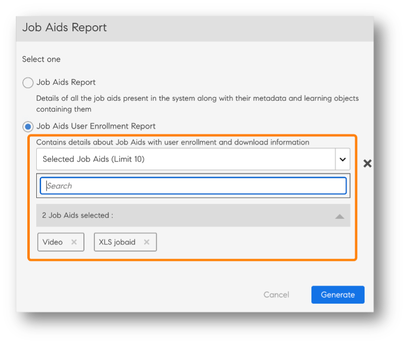
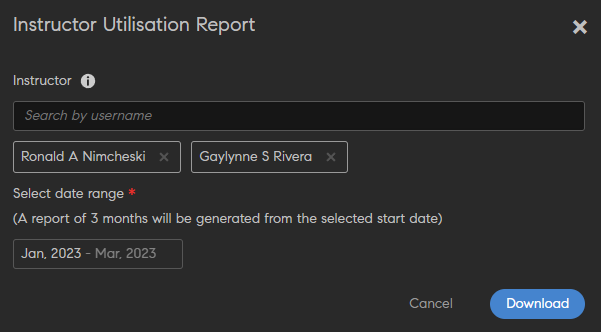

# Rapporten

Lees meer over de rapporten die in de Learning Manager-toepassing aan de beheerdersrol zijn gekoppeld.

Met Adobe Learning Manager kunt u meerdere rapporten aanmaken om leeractiviteiten te volgen, monitoren en beheren. De activiteiten van de studenten worden automatisch gevolgd en in de database vastgelegd. Manager- en beheerderrapporten worden vanuit de database gegenereerd.

## Overzicht {#overview}

Het proces voor het genereren van rapporten is vergelijkbaar voor beheerder en manager. Managers kunnen rapporten van hun ondergeschikten bekijken, terwijl beheerders alle organisatiebrede rapporten kunnen bekijken.

Rapporten worden in een dashboard verzameld. Een rapport moet in een dashboard bestaan. A **[!UICONTROL Standaarddashboard]** bestaat standaard op de pagina Rapporten. Elk rapport dat door u wordt toegevoegd, gaat naar dit standaarddashboard. Als u rapporten wilt toevoegen aan afzonderlijke dashboards, gebruikt u de vervolgkeuzepijl en kiest u **[!UICONTROL Rapport toevoegen]**. Raadpleeg de sectie Dashboards op deze pagina voor meer informatie over het maken van dashboards.

## Dashboard met overzicht van leermateriaal {#dashboards}

Zie een overzichtsrapport van alle leeractiviteiten in het platform. Op deze pagina ziet u de volgende overzichtsinformatie voor het geselecteerde team van de basisgebruiker en de externe profielen. U kunt ook een tijdbereik selecteren:

* Overzicht van leermateriaal in de vorm van inschrijvingen, weergaven en voltooiingen
* Topvaardigheden
* Overzicht van compliance

*Samenvattingsdiagrammen*

Als er interne managers op hoofdniveau zijn, worden deze achter elkaar weergegeven.

Alle externe profielen worden weergegeven na interne profielen (interne gebruikers op hoofdniveau).

Als een extern profiel een manager heeft, wordt de managerhiërarchie weergegeven in het dialoogvenster **[!UICONTROL Gegevens weergeven voor]** vervolgkeuzelijst. - De gebruiker wordt weergegeven in de managerhiërarchie op alle detailpagina (Overzicht van leermateriaal, compatibiliteit en vaardigheidsstatus)

Als dit niet het geval is, worden alle afzonderlijke gebruikersgegevens weergegeven in de lijst.

Voor meer gedetailleerde informatie over inschrijvingen van verschillende interne teams klikt u op **[!UICONTROL Informatie over leeroverzicht]**.

*Informatie over leeroverzicht*

Wanneer u op een inschrijving klikt, ziet u de studenten voor elke manager en ziet u de inschrijving voor welke leerobjecten. U kunt ook de gegevens over voortgang en voltooiing van elke student zien.

*Studenten aan een manager toewijzen*

Klik op een team en exporteer het rapport als csv-bestand. Een beheerder kan het rapport exporteren voor een gebruikersgroep of individuele gebruiker door de gebruikersgroep of individuele gebruiker te selecteren en vervolgens de gegevens te exporteren uit de vervolgkeuzelijst Handeling.

U kunt ook een staafdiagramweergave zien van vaardigheden die in uitvoering zijn en zijn bereikt. U kunt vaardigheden toevoegen/verwijderen die u in de grafiek wilt opnemen.

*Vaardigheidsstatus gestapeld staafdiagram*

In de uiteindelijke visualisatie kunt u de nalevingsstatus van de studenten controleren en passende maatregelen nemen.

Een beheerder kan ook gegevens van individuele trainingen bekijken in het Nalevingsdashboard.

De beheerder heeft bijvoorbeeld bepaald dat de naleving van drie trainingen moet worden gevolgd. Learning Manager creëert een overzicht van de naleving van deze drie trainingen.

Een beheerder kan nu op een willekeurige training klikken en de naleving van de geselecteerde training snel bekijken.

*Dashboard Naleving weergeven*

U kunt ook de nalevingsstatus van elk intern team zien.

Klik op de koppeling **[!UICONTROL Nalevingsstatus]** onderaan de visualisatie.

U kunt zien dat voor een team het aantal studenten in het team de leernaleving schendt of volgt.

*Compatibiliteitsstatus van een team*

## Training delen met managers

Learning Manager biedt het dashboard Naleving aan alle beheerders en managers. Managers vinden het zeer nuttig om naleving van hun teamleden voor een bepaalde opleiding te volgen. Tegelijkertijd willen beheerders dat alle managers compatibiliteitstrainingen toevoegen aan hun dashboard en deze bijhouden.

In Learning Manager wordt de **[!UICONTROL Delen met managers]** Met deze workflow kunnen beheerders training delen met managers, zodat ze kunnen worden toegevoegd aan het dashboard Naleving van een manager. Managers hoeven dus geen actie te ondernemen en kunnen meteen beginnen met het volgen van de naleving.

Een beheerder kan een reeks trainingscursussen delen met individuele managers of met een groep. Met deze deelstatus kan een manager gemakkelijk controleren of zijn/haar team voldoet aan de vereisten voor de opgegeven training.

De beheerder kan een standaardlijst met compatibiliteitstraining &#39;push&#39; geven die moet worden weergegeven op het dashboard Naleving van de manager.

### Training delen

1. In **[!UICONTROL Rapporten]** > **[!UICONTROL Leeroverzicht]**, schuift u omlaag en klikt u op de tab **[!UICONTROL Delen met managers]**.

   
   *Training delen met managers*

1. Als u training of meerdere trainingen wilt toevoegen, klikt u op **[!UICONTROL Meer delen]**.

1. In het dialoogvenster **[!UICONTROL Delen met managers]** de trainingen en de manager(s) te kiezen.

   
   *Selecteer training die u wilt delen met managers*

1. Klik op **[!UICONTROL Delen]**.

De training wordt nu gedeeld met de opgegeven manager.

### Training weergeven

Klik in de lijst met gedeelde trainingen op **[!UICONTROL Weergave]**. U kunt de training bekijken die is toegewezen aan een manager of sommige managers.

### Opleiding intrekken

1. Als u de training voor een manager wilt intrekken, klikt u op **[!UICONTROL Opzeggen]**.

1. Klikken **[!UICONTROL Doorgaan]**. Hiermee trekt u eerder gedeelde training van het dashboard Naleving van de manager in.

## Dashboard Gebruikersactiviteit {#useractivitydashboards}

Bekijk een overzicht van alle gebruikersactiviteiten op het platform in de loop van de tijd. Gebruikersgroepen configureren en filters toepassen.

Het dashboard Gebruikersactiviteit geeft de activiteit van de gebruikers in het account weer. De drie vermelde rapporten zijn:

* **Registered Users:** Dit rapport bevat informatie over het aantal gebruikers dat in de week van uw account is geregistreerd. Voor accounts met de licentie Maandelijkse actieve eenheden toont het rapport in plaats daarvan de MAE-eenheden.

* **Rapport gebruikersbezoeken:** Dit rapport bevat informatie over het aantal gebruikers dat dagelijks toegang krijgt tot het platform. Er is ook een maandrapport beschikbaar.

* **Rapport over bestede leertijd:** Dit rapport biedt dagelijks informatie over de bestede leertijd in het platform. Er is ook een maandrapport beschikbaar.

## Geregistreerde gebruikers {#registeredusers}

Learning Manager registreert het aantal gebruikers dat wekelijks in het systeem wordt geregistreerd. Beheerders kunnen dit rapport bekijken om het geregistreerde aantal gebruikers op die dag van de week te begrijpen. Geregistreerd aantal dat eenmaal is opgeslagen voor een week verandert niet. Vandaar dat het historische geregistreerde aantal niet gerelateerd is aan de huidige groep studenten in het systeem.

Dit rapport bevat informatie over het aantal gebruikers dat wekelijks in uw account wordt geregistreerd.

Voor accounts met de licentie Maandelijkse actieve eenheden toont het rapport in plaats daarvan de MAE-eenheden.

*Geregistreerd gebruikersrapport*

***Voor accounts met maandelijkse toegangseenheden:***

**Rapport met maandelijks actieve gebruikers**

Dit rapport toont het aantal studenten dat maandelijks op het leerplatform actief is. De gebruiker wordt geacht actief te zijn gedurende de maand als hij/zij een van de hier genoemde leeracties uitvoert. Ze worden op dezelfde manier als de maandelijkse actieve eenheden geteld.

Het maandelijks actieve aantal dat eenmaal is geteld en opgeslagen voor een maand verandert niet. Vandaar dat het getoonde historische aantal niet is gerelateerd aan de huidige groep studenten in het systeem.

## Gebruikersbezoeken {#uservisits}

Dit rapport toont het totale aantal studenten dat toegang heeft tot het systeem in een dag- of maandperiode. Ook surfen op het leerplatform zonder dat leermateriaal wordt gebruikt, wordt beschouwd als toegang tot het leerplatform. Dit helpt de beheerder om de totale groep van gebruikers die toegang hebben tot het systeem te begrijpen. Op de eerste van de maand registreert Learning Manager het totaal aantal gebruikers dat in de vorige maand toegang had tot het platform. Tevens wordt de informatie van de gebruikersgroep geregistreerd voor deze gebruikers.

Alleen de door de beheerder geconfigureerde gebruikersgroepen worden geregistreerd. Hierdoor kunnen de beheerders ook op gebruikersgroepen een filter toepassen voor historische maandgegevens. Merk op dat als de configuratie van de gebruikersgroepen gewijzigd wordt en Learning Manager heeft in de vorige maanden geen gegevens voor deze gebruikersgroep geregistreerd, dan kan Learning Manager de gegevens voor deze nieuw geconfigureerde gebruikersgroepen in de vorige maanden niet weergeven.

Dit rapport bevat gebruikers die toegang hebben tot het platform met behulp van alle indelingen, zoals web, mobiele app, aangepaste headless-oplossingen enz. De gebruiksgrafiek van de apparaat-app vermeldt specifiek alleen de gebruikers die toegang hebben tot het platform via de apparaat-app van Learning Manager. Dit helpt beheerders bij het identificeren van het gebruik van de mobiele app in hun account.

*Bezoek gebruikersrapport*

## Rapport met bestede leertijd {#learningtimespentreport}

Hier ziet u een twee-assige lijndiagram dat de totale leertijd voor alle studenten over een periode van 12 maanden laat zien. De tweede as vertegenwoordigt de mediane tijd die een persoon besteedt aan leren.

De tijd die wordt besteed aan verschillende leerobjecten, zoals leerprogramma&#39;s en certificeringen, wordt berekend voor het volgende:

* Zelfstandige cursus met statische en interactieve inhoud
* Activiteit cursussen met url.
* Weekendsessies met de weekendvlag ingeschakeld.
* VC-verbindingssessie waarbij de aanwezigheid automatisch wordt gemarkeerd.
* De tijd die wordt besteed aan verschillende leerobjecten, zoals leerprogramma&#39;s en certificeringen
* xAPI-statements voor een xAPI-activiteitscursus.

U kunt de grafiek verder exporteren als een Excel-spreadsheet.

Er is een filter beschikbaar om de configuratie van de gebruikersgroep te kiezen, wat zal helpen bij het weergeven van de gegevens met betrekking tot de verschillende gebruikersgroepen.

De geselecteerde datum- en gebruikersgroepfilter wordt toegepast op alle relevante grafieken in het dashboard.

>[!NOTE]
>
>Voor rapporten over **[!UICONTROL Gebruikersbezoeken]** en **[!UICONTROL Bestede leertijd]** zijn de weergegeven standaardgegevens (wanneer er geen gebruikersgroep is geconfigureerd) voor het gehele account.

## Dashboard met trainingsinhoud {#trainingcontentdashboard}

Het dashboard met trainingsinhoud biedt inzicht in de trainingen die beschikbaar zijn op het platform. U kunt populaire trainingen bekijken of alle beschikbare trainingen volgen.

## Trainingsrapport {#trainingsreport}

Dit rapport bevat informatie over de totale hoeveelheid trainingen die maandelijks op het platform (in gepubliceerde staat) beschikbaar zijn. Het geeft een indicatie van het aantal trainingen dat in de loop van de tijd wordt aangeboden.

*Trainingsrapport*

## Rapport over actieve trainingen {#activetrainingsreport}

Dit rapport bevat informatie over de trainingen die actief zijn in het geselecteerde tijdsbestek. Actieve trainingen zijn trainingen waarvoor wordt ingeschreven, die worden weergeven in de speler of die in de gegeven periode worden voltooid.

Voor actieve trainingen zijn gegevens van alle interne groepen van de hoofdgebruiker (met beheerdersrol) beschikbaar voor selectie wanneer er geen configuratie van de gebruikersgroep is uitgevoerd. Naast de gebruikersgroepen van de hoofdgebruiker kunt u indien nodig nog 10 andere gebruikersgroepen configureren.

*Rapport voor actieve training*

>[!NOTE]
>
>De gegevens worden niet zoals verwacht weergegeven **[!UICONTROL Alle gebruikers]** en **[!UICONTROL 12 maanden]** zijn geselecteerd, maar de gegevens worden weergegeven wanneer u **[!UICONTROL Alle interne gebruikersgroepen].**

<table>
 <tbody>
  <tr>
   <td>
    
<b>Referentie</b>
</td>
   <td>
    
<b>Metrische gegevens</b>
</td>
   <td>
    
<b>Beschrijving</b>
</td>
  </tr>
  <tr>
   <td>
    
1
</td>
   <td>
    
Startverhouding (%)
</td>
   <td>
    
Verhouding tussen het aantal studenten dat met de cursus is begonnen en het aantal inschrijvingen.
</td>
  </tr>
  <tr>
   <td>
    
2
</td>
   <td>
    
Voltooiingsverhouding (%)
</td>
   <td>
    
Verhouding tussen het totaal aantal gebruikers dat de cursus heeft voltooid en het totaal aantal gebruikers dat met de cursus is begonnen. 
</td>
  </tr>
  <tr>
   <td>
    
3
</td>
   <td>
    
Feedback student
</td>
   <td>
    
Gemiddelde van alle ontvangen L1-feedback-reacties op een schaal van 1 tot 10, afgerond op het dichtstbijzijnde gehele getal. 
</td>
  </tr>
  <tr>
   <td>
    
4
</td>
   <td>
    
Feedback manager
</td>
   <td>
    
Gemiddelde van alle ontvangen L3-feedbackreacties op een schaal van 1 tot 5, afgerond op het dichtstbijzijnde gehele getal. 
</td>
  </tr>
 </tbody>
</table>

Het trainingsrapport heeft twee extra kolommen:

1. Gemiddelde sterwaardering van een cursus.
1. Aantal studenten dat de cursus heeft beoordeeld.
1. Ingesloten pad
1. Ingesloten pad-ID
1. Ingesloten cursus-ID

>[!NOTE]
>
>De start- en voltooiingsverhouding, de feedback van de student en de manager worden niet beïnvloed door de toegepaste filters. De filters hebben alleen invloed op de inschrijving, de weergave en de voltooiing.

>[!NOTE]
>
>Voor beide rapporten (Trainingsinhoud, Gebruikersactiviteit) kunt u maximaal 10 gebruikersgroepen configureren. Het kan tot 24 uur duren voordat de verwerking is voltooid en de nieuw geconfigureerde filters beschikbaar zijn.

## Dashboard Rapporten {#dashboardreports}

Een dashboard is een verzameling rapporten. Rapporten kunnen naar keuze worden gegroepeerd in een dashboard.

## Voorbeeldrapporten {#samplereports}

Op het tabblad **[!UICONTROL Voorbeeldrapporten]** worden enkele indicatieve rapporten weergegeven die op voorbeeldgegevenspunten zijn gebaseerd. Bekijk deze rapporten om een idee te krijgen van de verschillende soorten rapporten boordevol informatie die u kunt genereren met behulp van uw accountgegevens.

## Dashboard Rapporten {#DashboardReports-1}

Klik op dit tabblad om alle boards te bekijken die u hebt gemaakt. Van de **[!UICONTROL Dashboard weergeven]** kunt u het standaardboard selecteren of een dashboard dat u hebt gemaakt.

## Een dashboard maken {#createadashboard}

1. Klik op Dashboard toevoegen aan de rechterkant van de pagina om uw eigen boards te maken.

   
   *Dashboards toevoegen*

1. Geef de naam en beschrijving van het dashboard op.
1. Als u het dashboard met een manager wilt delen, kiest u de **[!UICONTROL Delen met]** veld. U kunt alle normale selectiecriteria voor deze bewerking gebruiken.
1. Klikken **[!UICONTROL Opslaan].**

U kunt het recent gemaakte board bekijken op het tabblad **[!UICONTROL Dashboard Rapporten]**.

Als u rapporten aan uw board wilt toevoegen, klikt u op de vervolgkeuzelijst in de rechterbovenhoek van uw board en klikt u op **[!UICONTROL Rapport toevoegen]**. Het rapport dat u op deze manier maakt, wordt aan uw dashboard gekoppeld.

>[!NOTE]
>
>De rapporten die u maakt door op Toevoegen rechtsboven op de pagina Rapporten te klikken, worden aan uw standaarddashboard toegevoegd.

## Gedeelde dashboards {#shareddashboards}

Gedeelde boards zijn een verzameling rapporten die met u zijn gedeeld door andere gebruikers binnen uw organisatie. Alle rapporten die u aan een gedeeld board toevoegt, worden automatisch gedeeld met andere gebruikers die toegang hebben tot dat board.

U kunt het board op twee manieren delen:

* Door gebruikers in te voeren **[!UICONTROL Delen met]** veld met wie het dashboard wordt gedeeld.
* Kies Dashboard bewerken in de vervolgkeuzelijst en voer gebruikersgegevens in om het dashboard te delen.

>[!NOTE]
>
>Een manager kan de rapporten van zijn teamleden alleen bekijken vanaf een gedeeld dashboard.

## Downloads {#downloads}

Het geëxporteerde blad met dashboardrapporten bevat gedetailleerde informatie in plaats van een rapportsamenvatting. Het gedownloade rapport volgt de indeling van een studenttranscript.

## Rapporten maken {#report}

1. Klik op Rapporten in het linkerdeelvenster. De pagina Rapportoverzicht wordt geopend.

   >[!NOTE]
   >
   >Standaard verschijnen er ten minste drie voorbeeldrapporten op het tabblad voor voorbeeldboards. U kunt de voorbeeldrapporten alleen bekijken om een idee te krijgen hoe u ze maakt en aanpast.

1. Klik rechtsboven op de pagina op **[!UICONTROL Toevoegen]**.
1. In het dialoogvenster **[!UICONTROL Rapport toevoegen]** kunt in de keuzelijst Type een van de vooraf gedefinieerde rapporten of de optie **[!UICONTROL Aangepast]** kiezen. Als u een vooraf gedefinieerd rapport selecteert, ziet u dat het formulier vooraf is ingevuld. U kunt bepaalde velden wijzigen. Klik daarna op **[!UICONTROL Opslaan]**. Het rapport wordt dan aan uw standaarddashboard toegevoegd.

   
   *Rapport maken*

   In **[!UICONTROL Rapporttype]** kunt u een vooraf gedefinieerde set rapporten of aangepaste waarden kiezen. U kunt de volgende rapporten bekijken als onderdeel van een vooraf gedefinieerde set rapporten:

   * Toegewezen en bereikte vaardigheden
   * Ingeschreven en afgeronde cursussen
   * Effectiviteit van cursussen
   * Ingeschreven en voltooide leerprogramma&#39;s
   * Bestede leertijd per cursus
   * Bestede leertijd per kwartaal
   * Voltooiing certificering

1. Kies de **[!UICONTROL Y-as]** voor uw rapport uit de vervolgkeuzelijst. Voor een aantal van de geselecteerde criteria kunt u een of meer statussen kiezen bij de optie Statussen. Zo kunnen de statussen voor het primaire criterium voor de inschrijvingsstatistieken van een cursus Voltooid, Niet voltooid en Ingeschreven zijn. De gegevens van het primaire bereik worden in het rapport als staafdiagrammen weergegeven.

   
   *Assen voor rapporten*

1. Kies de criteria/het bereik van de secundaire **[!UICONTROL Y-as]** voor uw rapport in de vervolgkeuzelijst. Zo kunt u voor de inschrijvingsoptie van een leerprogramma een of meer statussen uit de vervolgkeuzelijst Statussen kiezen. De gegevens van het secundaire bereik worden in het rapport als lijndiagrammen weergegeven.
1. Kies de juiste criteria voor de X**-as** voor uw rapport in de vervolgkeuzelijst. Als de x-as als datum is gekozen, hebt u de optie om uw x-ascriterium op dag, maand, kwartaal en jaar te groeperen.
1. Kies in de sectie Tijdspanne de toepasselijke optie in de vervolgkeuzelijst. De beschikbare opties zijn:

   * Laatste maand
   * Kwartaal
   * Jaar
   * Kwartaal tot heden (laatste 90 dagen)
   * Jaar tot heden (laatste 365 dagen)
   * Datumbereik. Geef waarden op in de datumvelden **[!UICONTROL Van]** en **[!UICONTROL Tot]**.

   

1. **Sectie Filters**

   Filters verschijnen in het dialoogvenster Rapport toevoegen onderaan op basis van de rapporttypen die u hebt gekozen. Hieronder worden enkele van de voornaamste filters genoemd.

   * **Manager:** U kunt een van de managers kiezen op basis van hiërarchie. Voor sommige managers kunnen er ondergeschikte managers zijn met meerdere medewerkers die aan deze ondergeschikte managers moeten rapporteren.
   * **Profiel:** Kies de benoeming van uw werknemer. Dit is handig wanneer u rapporten van werknemers op basis van hun profiel/benoeming bekijkt. Bijvoorbeeld, computerwetenschapper, ingenieur.
   * **Gebruikersgroep:** Kies de gebruikersgroep waarop u de rapporten wilt filteren. Learning Manager haalt de gebruikersgroepen op die zijn gedefinieerd voor uw account vanuit de Gebruikers-functie.
   * **Inhoud:** U kunt uw rapport op een willekeurige cursus filteren door deze in de vervolgkeuzelijst te selecteren.

   Vouw deze sectie uit en kies de vereiste filters.

   
   *Filters kiezen*

1. Klikken **[!UICONTROL Opslaan]** om het maken van een rapport te voltooien.

   
   *Voorbeeldrapport*

## Een rapport bewerken {#editareport}

Klik in het rapport op de vervolgkeuzepijl en selecteer de optie **[!UICONTROL Rapport bewerken]**.

*Een rapport bewerken*

Breng de benodigde wijzigingen aan in het rapport. Klik op **[!UICONTROL Opslaan]** om de wijzigingen op te slaan.

## Een rapport naar een dashboard verplaatsen {#moveareporttoadashboard}

Kies deze optie om het huidige rapport naar een bestaand dashboard te verplaatsen. Om het rapport te verplaatsen klikt u op de optie **[!UICONTROL Naar dashboard verplaatsen]**.

*Een rapport naar een dashboard verplaatsen*

Kies het dashboard waarnaar u het rapport wilt verplaatsen en kies **[!UICONTROL Verplaatsen]**.

## Een kopie van een rapport maken {#createacopyofareport}

Selecteer de optie om een kopie van het rapport te maken **[!UICONTROL Een kopie maken]**.

*Een kopie van een rapport maken*

Kies het dashboard waarnaar u het rapport wilt kopiëren. Klik op **[!UICONTROL Kopiëren]** om het rapport te kopiëren.

## Een rapport verwijderen {#deleteareport}

Als u een rapport wilt verwijderen, kiest u de optie **[!UICONTROL Rapport verwijderen]**. Nadat u het rapport hebt verwijderd, kan het niet meer worden hersteld. Het proces is onomkeerbaar. Ga voorzichtig te werk bij het verwijderen van een rapport.

*Een rapport verwijderen*

## Een rapport downloaden {#downloadareport}

Als u het rapport wilt downloaden, kiest u de optie **[!UICONTROL Rapport downloaden]**.

*Een rapport downloaden*

## Het formaat van een rapport wijzigen {#resizeareport}

U kunt de grootte van uw rapporten veranderen in 1×1(medium) en 1×2(groot). Dit geeft u een overzichtelijkere weergave van uw rapporten. U kunt ook gemakkelijk pannen en zoomen in de rapporten.

## Filters {#filters}

Filters verschijnen in het dialoogvenster **[!UICONTROL Rapport toevoegen]** onderaan op basis van de rapporttypen die u hebt gekozen. Hieronder worden enkele van de voornaamste filters genoemd.

**Manager** U kunt een van de managers kiezen op basis van hiërarchie. Voor sommige managers kunnen er ondergeschikte managers zijn met meerdere medewerkers die aan deze ondergeschikte managers moeten rapporteren.

**Profiel** Kies de benoeming van uw werknemer. Dit is handig wanneer u rapporten van werknemers op basis van hun profiel/benoeming bekijkt. Bijvoorbeeld, computerwetenschapper, ingenieur.

**Gebruikersgroep** Kies de gebruikersgroep waarop u de rapporten wilt filteren. Learning Manager haalt de gebruikersgroepen op die zijn gedefinieerd voor uw account vanuit de Gebruikers-functie.

**Cursus** U kunt uw rapport op elke cursus filteren door deze in de vervolgkeuzelijst te kiezen.

*Een rapport filteren*

Boven de legenda voor het diagram staat een zoomvak. Plaats de cursor op het vak, klik en sleep de dwarsbalk over het gedeelte van het zoomvak waarop u wilt inzoomen.

U kunt de secundaire y-aswaarden als een lijn over de diagrambalken weergeven. In het bovenstaande voorbeeld ziet u de waarden voor Effectiviteit als een grijze lijn over het diagram.

## Gebruikersgroeprapporten {#user-group-reporting}

Volg hoe gebruikersgroepen zoals afdelingen, externe partners en rollen presteren in vergelijking met andere gebruikersgroepen of ten opzichte van andere leerdoelen.

### Gebruikersgroepen {#usergroups}

Als u rapporten wilt genereren op basis van gebruikersgroepen, kiest u **[!UICONTROL Gebruikersgroep]** op de x-as uit de lijst met vervolgkeuzemogelijkheden zoals weergegeven in de onderstaande schermafbeelding.

*Gebruikersgroeprapporten*

Als u een gebruikersgroep wilt kiezen, typt u de naam van de groep. U ziet de voorgestelde groepen die worden weergegeven afhankelijk van de ingevoerde naam. Zodra u een lijst met groepen ziet, kiest u de vereiste gebruikersgroep.

U kunt ook meerdere groepen kiezen met behulp van automatisch aangevulde zoeksuggesties.

Als u meerdere gebruikersgroepen hebt geselecteerd en dit rapport opslaat en genereert, wordt het rapport gegenereerd met alle gebruikersgroepen in een staafdiagram naast elkaar op de x-as.

Met dit gebruikersgroeprapport kunt u de prestaties van een afdeling/divisie/rol vergelijken met die van een andere om hun leerprestaties te evalueren.

### Aangepaste gebruikersgroepen/gebruikersattributen {#customusergroupsuserattributes}

U kunt ook aangepaste gebruikersgroepen aanmaken met de functie Gebruikers/Gebruikersgroepen toevoegen in Learning Manager. Nadat u gebruikersgroepen hebt gemaakt, kunt u rapporten genereren voor die aangepaste gebruikersgroepen met behulp van een lijst van attributen zoals locatie en branche.

Kies in de x-as de optie Gebruikerskenmerk en selecteer het kenmerk in het **selecteren** naast de afbeelding. Als u op basis van deze kenmerken een aangepast gebruikersgroeprapport wilt maken, moet u ook de juiste gebruikersgroep in het filter kiezen.

## Rapporttypen {#typesofreports}

Adobe Learning Manager ondersteunt vier belangrijke rapporttypen, zoals voltooiing, bestede tijd, vaardigheden en effectiviteit. U kunt de volgende rapporttypen gebruiken om meer dan 300 varianten te genereren:

* Statistieken levering cursus voor studenten
* Rapport over effectiviteit van cursussen
* Rapport gebaseerd op vaardigheden van student
* Inschrijvingstatistieken voor studenten van leerprogramma
* Bestede leertijd door studenten
* Aantal studenten
* Voltooiing certificering

## Rapporten weergeven {#viewingreports}

Op de pagina Rapporten kunt u alle rapporten bekijken. U kunt elk rapport minimaliseren door rechtsboven in het rapport op het minteken (-) te klikken. Klik op het plusteken (+) om uw rapport opnieuw weer te geven.

## Snelle weergave met verschillende datums {#quickviewwithdifferentdates}

U kunt het datumbereik/de waarde voor elk rapport en elke weergave snel wijzigen voor een andere datum zonder het rapport te wijzigen en op te slaan. Klik op het bewerkingspictogram (zoals weergegeven met een pijl in de onderstaande afbeelding) naast het datumbereik, zoals QTD, vorig jaar. Kies de nieuwe waarde in de vervolgkeuzelijst en klik op het vinkje om de wijziging te bevestigen. U kunt de wijziging annuleren door op het kruisje (x) te klikken.

>[!NOTE]
>
>De gebruikte datumwaarden om het rapport te bekijken, zijn tijdelijk. Deze weergave van het rapport wordt niet gedownload wanneer u de downloadoptie kiest. Deze weergave is slechts een tijdelijke weergave.

*Aantal studenten weergeven*

## Snelle weergave met verschillende managers {#quickviewwithdifferentmanagers}

Als er meerdere managers aan u rapporteren, kunt u de rapporten voor elke manager snel weergeven. Selecteer de naam van de manager in de vervolgkeuzelijst om een uniek rapport voor elke manager weer te geven.

>[!NOTE]
>
>De gebruikte managerwaarden om het rapport te bekijken, zijn tijdelijk. Deze weergave van het rapport wordt niet gedownload wanneer u de downloadoptie kiest. Deze weergave is slechts een tijdelijke weergave.

## Cursusrapporten weergeven {#viewcoursereports}

U kunt de specifieke rapporten van elke cursus bekijken door de onderstaande stappen te volgen:

1. Klikken **[!UICONTROL Cursusrapporten weergeven]** op het tabblad Mijn dashboards op de pagina Rapporten.\
   Er verschijnt een pop-upvenster. Er verschijnt een tekstinvoerveld waarin u de vereiste cursus kunt invoeren en de voorgestelde cursusnamen worden weergegeven in de vervolgkeuzelijst. Kies de cursus uit de getoonde lijst.

   

   *Cursusrapporten weergeven*

1. Selecteer de gewenste cursus in de vervolgkeuzelijst en klik op Weergeven.
1. U wordt omgeleid naar de pagina met quizscores voor de geselecteerde cursus om het cursusspecifieke rapport te bekijken.

**Bewerken/Verplaatsen naar dashboard/Kopie maken/Verwijderen/Formaat van rapport wijzigen**

Klik op het pijltje van de vervolgkeuzelijst rechtsboven in elk rapport om de opties Bewerken/Verplaatsen naar dashboard/Kopie maken/Verwijderen/Formaat van rapport wijzigen weer te geven.

*Bewerken/Verplaatsen naar board/Kopie maken/Verwijderen/Formaat van rapporten wijzigen*

**[!UICONTROL Bewerken]** Klik op Herstellen om terug te gaan naar de beginwaarden tijdens het wijzigen van gegevens. Klik op Opslaan na het wijzigen van de waarden.

**[!UICONTROL Verplaatsen naar dashboard]** U kunt het huidige rapport verplaatsen naar een ander dashboard, dat uit de lijst met dashboards wordt gekozen.

**[!UICONTROL Een kopie maken]** U kunt het rapport naar hetzelfde of een ander dashboard kopiëren. Dit wordt gekozen in de lijst met dashboards.

**[!UICONTROL Verwijderen]** Klik op Verwijderen om het rapport te verwijderen. Er verschijnt een waarschuwings-/bevestigingsbericht voordat u het rapport kunt wissen.

**[!UICONTROL Formaat wijzigen]** U kunt de grootte van uw rapporten wijzigen in 1×1(medium) en 2×2(groot).

## Rapporten voor collega-account genereren en weergeven {#generateandviewreportsforpeeraccount}

Als beheerder kunt u niet alleen rapporten voor uw account genereren, u kunt ook rapporten genereren collega-accounts die u hebt ingesteld en deze bekijken.

Wanneer u een collega-account met een andere gebruiker hebt opgezet, kunt u de rapporten voor dat collega-account bekijken op de pagina **[!UICONTROL Rapporten]**. Wanneer u een rapport maakt, vindt u het veld **[!UICONTROL Account selecteren]**. Selecteer in de vervolgkeuzelijst met alle collega-accounts waaraan u bent gekoppeld, het account waarvoor u de gedeelde rapporten wilt bekijken.

Als u tijdens het maken van een collega-account de optie Catalogus delen niet hebt geselecteerd, kunt u dat collega-account niet in deze lijst weergeven.

*Rapporten voor collega-account beheren*

1. Selecteer de x-as en y-as voor dit rapport. Selecteer vervolgens de datum voor dit rapport.
1. Let op het veld Filters, de knop Gedeelde catalogi is automatisch ingeschakeld. Dit is verplicht. Als Gedeelde catalogi niet is ingeschakeld, betekent dit dat u geen rapporten voor het collega-account kunt genereren of bekijken.
1. Selecteer in de vervolgkeuzelijst onder Gedeelde catalogi de gedeelde catalogus waarvoor u het rapport wilt bekijken.
1. Klik op [!UICONTROL **Opslaan**].

   
   *Gedeelde catalogus voor collega-account selecteren*

1. Nadat u op **[!UICONTROL Opslaan]** kunt u de grafische weergave van uw rapporten in uw standaarddashboard bekijken. Vanaf dit dashboard kunt u het rapport verder filteren op manager voor het specifieke collega-account.
1. Als er van uw kant wijzigingen zijn in de catalogus, worden de wijzigingen onmiddellijk weerspiegeld in de rapporten en het dashboard gegenereerd door de collega. Wanneer de collega echter de catalogus wijzigt, verschijnen de wijzigingen niet automatisch op uw dashboard.
1. Als u wilt dat uw dashboard automatisch wordt bijgewerkt, moet uw collega u een nieuw collega-aanvraag sturen.

   >[!NOTE]
   >
   >Managers kunnen geen collegarapporten bekijken.

## E-mailabonnementen {#emailsubscriptions}

U kunt uw favoriete rapporten als e-mail ontvangen door u hierop te abonneren.

In **[!UICONTROL Rapporten]** op de pagina  **[!UICONTROL Abonnement]** tabblad. De abonnementspagina voor rapporten verschijnt.

Als u de rapportnaam in de vervolgkeuzelijst wilt selecteren, typt u de rapportnaam in het veld Rapporten. Kies in de lijst hoe vaak u e-mail wilt ontvangen. U kunt het onderwerp van de e-mail toevoegen en een alternatief e-mailadres opgeven.

U kunt abonnementen bewerken en verwijderen.

## Excel-rapporten {#excelreports}

Via het tabblad **[!UICONTROL Excel-rapporten]** kunt u rapporten in XLS-indeling exporteren.

De volgende rapporttypen zijn beschikbaar om te downloaden.

* Cursusrapporten
* Studenttranscripten
* Aankondigingenrapport
* Taakhulpenrapport
* Audittrail van inhoud
* Audittrail van gebruiker
* Aanmeldings-/toegangsrapport
* Gamificationtranscripten

## Studenttranscripten {#learnertranscripts}

In de Studenttranscripten in Excel-rapporten worden de kolommen Punten vereist en Punten verdiend in decimale getallen weergegeven.

## Cursusrapporten {#coursereports}

Als beheerder kunt u rapporten voor cursussen downloaden. Volg deze stappen:

1. Openen **[!UICONTROL Rapporten]** > **[!UICONTROL Excel-rapporten]** > **[!UICONTROL Cursusrapporten]**.
1. Het dialoogvenster **[!UICONTROL Cursusrapporten]** verschijnt. Selecteer de cursus waarvoor u het rapport wilt ophalen en klik op **[!UICONTROL Weergeven]**.

   
   *Cursusrapporten*

1. U wordt omgeleid naar de cursuspagina. U kunt de quizscore per gebruiker en per vraag exporteren op basis van elke inschrijving door het specifieke inschrijvingstype te kiezen.
1. Selecteer **[!UICONTROL Quizscore exporteren]** om het rapport te exporteren. Het dialoogvenster **[!UICONTROL Rapportaanvraag genereren]** verschijnt. Klik op **[!UICONTROL OK]** om te bevestigen.

   
   *Rapportaanvraag genereren*

   >[!NOTE]
   >
   >Het geëxporteerde quizscorerapport bevat de scoregegevens voor elke poging als de optie voor meerdere pogingen voor de module is geconfigureerd.

## Studenttranscripten {#LearnerTranscripts-1}

Adobe Learning Manager stelt de beheerders van een organisatie in staat om de transcripten van de studenten te genereren. Het rapport Studenttranscript bevat het volgende:

1. Studenttranscript: dashboard Leeractiviteit
1. Vaardigheid: Dashboard Vaardigheid
1. Dashboard Naleving

In de Studenttranscripten in Excel-rapporten worden de kolommen Punten vereist en Punten verdiend in decimale getallen weergegeven.

Zie voor informatie over het genereren van studenttranscriptrapporten en meer informatie [Studenttranscripten](learner-transcripts.md).

## Aankondigingenrapporten {#announcementsreports}

Als beheerder kunt u een rapport genereren van alle aankondigingen die u verzendt. Het rapport bevat details over het volgende:

* Type aankondiging
* Naam van aankondiging
* Datum van aankondiging
* Status van aankondiging
* Naam van student

Volg een van deze stappen om een rapport te downloaden:

1. Openen **[!UICONTROL Rapporten]** > **[!UICONTROL Excel-rapporten]** > **[!UICONTROL Aankondigingenrapport]**. Het dialoogvenster **[!UICONTROL Rapportaanvraag genereren]** wordt geopend. Klik op OK.
1. [!UICONTROL **Aankondigingen**] > [!UICONTROL **Handelingen**] > [!UICONTROL **Rapport exporteren**].

   
   *Aankondigingsrapport*

1. U kunt een rapport voor een specifieke aankondiging extraheren door onder het instellingenpictogram op Rapport exporteren te klikken.

   
   *Rapport voor specifieke aankondigingen*

## Taakhulpenrapport {#jobaidsreport}

Taakhulpen zijn trainingsinhoud waartoe een studenten toegang hebben zonder dat zij zich moeten inschrijven voor een specifiek leerobject zoals een cursus of leerprogramma. Beheerders kunnen het Taakhulpenrapport extraheren en downloaden.

Het geëxtraheerde rapport bevat informatie over het volgende:

* Naam
* Type taakhulp
* Status van taakhulp (gepubliceerd of ingetrokken)
* Inschrijvingsdatum
* Voltooiingsdatum
* Downloaddatum
* Naam van student
* Naam van manager
* Gemaakt door

Voer een van de volgende handelingen uit om een rapport te downloaden:

* Openen  **[!UICONTROL Rapporten]** > **[!UICONTROL Excel-rapporten]** > **[!UICONTROL Taakhulpenrapporten]**. Het dialoogvenster **[!UICONTROL Rapportaanvraag genereren]** wordt geopend. Klik op **[!UICONTROL OK]**.
* Openen **[!UICONTROL Taakhulp]** > **[!UICONTROL Handelingen]** > **[!UICONTROL Rapport exporteren]**.

*Taakhulpenrapport*

* U kunt ook een rapport voor een specifieke taakhulp extraheren door onder het instellingenpictogram op **[!UICONTROL Rapport exporteren]** te klikken.

*Rapport voor specifieke taakhulp*

### Taakhulpenrapport

Nadat u **[!UICONTROL Taakhulpenrapport]** in de lijst ziet u twee opties :

*Taakhulpen inschrijvingsrapport voor VS downloaden*

**Alle taakhulpen**: Als het aantal taakhulpen in de account minder dan 10 miljoen is, bevat het gegenereerde rapport inschrijvingsgegevens van alle taakhulpen. Dit is de standaardselectie. Als het aantal rijen groter is dan 10 miljoen, wordt een fout weergegeven en moet u de vereiste taakhulpen handmatig selecteren.

**Geselecteerde taakhulpen**: Als u deze optie selecteert, kunt u de taakhulpen invoeren waarvoor u het rapport wilt genereren. U kunt maximaal 10 taakhulpen selecteren. Adobe Leermanager controleert of er meer dan 10 miljoen taakhulpen zijn.

*Een taakhulp selecteren*

**Taakhulpenrapport**

Als u deze optie selecteert, worden de details gedownload van alle taakhulpen die in het systeem aanwezig zijn, samen met de bijbehorende metadata en training.

Het gedownloade rapport bestaat uit de volgende velden:

* Naam van taakhulp
* Taal/talen
* Id
* Type
* Duur (minuten)
* Status
* Publicatiedatum (tijdzone UTC)
* Gemaakt, op naam
* Gemaakt, op e-mailadres
* Gemaakt, op unieke ID van gebruiker
* Catalogus(sen)
* Leerpad(en)
* Cursus(sen)
* Tag(s)
* Vaardigheid/vaardigheden

**Inschrijvingsrapport van gebruikers voor taakhulpen**

Het inschrijvingsrapport bevat details over inschrijving van gebruikers en andere informatie.

Het gedownloade rapport bestaat uit de volgende velden:

* Naam van taakhulp
* Type
* Status
* Datum ingeschreven (tijdzone UTC)
* Voltooiingsdatum (UTC-tijdzone)
* Downloaddatum (UTC-tijdzone)
* Naam van student
* E-mail
* Unieke ID van gebruiker
* Naam van manager
* E-mailadres van manager
* Unieke ID van managergebruiker
* Toegewezen op naam
* Toegewezen op e-mail
* Toegewezen op unieke ID van gebruiker
* Gemaakt op naam
* Gemaakt op e-mail
* Gemaakt op unieke ID van gebruiker
* Taakcode
* Nieuw veld
* Profiel

### Rapporten voor audittrail van inhoud {#contentaudittrailreports}

Gebruik de **[!UICONTROL Audittrail van inhoud]** rapportgenerator om een rapport te genereren van alle wijzigingen en bewerkingen die tijdens de levensduur van een cursus in het systeem zijn aangebracht. Het gegenereerde rapport bevat de volgende informatie.

* Object-ID
* Objectnaam
* Objecttype
* Wijzigingstype
* Beschrijving
* Verwezen object-ID
* Verwezen objectnaam
* Gewijzigd op gebruikersnaam
* Gewijzigd in gebruikers-ID
* Datum gewijzigd (UTC-tijdzone)

Informatie over metagegevens wordt niet in het gegenereerde rapport opgenomen.

Volg deze stappen om een rapport Audittrail van cursus te genereren.

1. Selecteren **[!UICONTROL Rapport]** > **[!UICONTROL Excel-rapporten]** > **[!UICONTROL Audittrail van cursus]**. Het dialoogvenster **[!UICONTROL Audittrail van inhoud]** verschijnt.

   
   *Audittrail van cursus*

1. Selecteer de cursus, het leerprogramma en de certificering waarvoor u het rapport wilt downloaden. Indien niet gespecificeerd, worden standaard alle rapporten gedownload.
1. Selecteer een datumbereik voor het rapport en klik op **[!UICONTROL Genereren]**.
1. Het rapport wordt gegenereerd en u ontvangt bericht wanneer het rapport Audittrail van inhoud klaar is. U kunt het rapport downloaden.

## Rapporten Audittrail van gebruiker {#useraudittrailreports}

Audittrail van gebruikers legt de levenscyclus van gebruikers, gebruikersgroepen en zelfregistratieprofielen vast. Toevoeging, verwijdering en wijziging in Manager van gebruiker worden allemaal vastgelegd. Maken en verwijderen van zelfregistratieprofielen wordt vastgelegd. U kunt ook pauzeren en de zelfregistratie hervatten.

U kunt Toevoegen, Inschakelen, Uitschakelen, Pauzeren of Hervatten voor Externe profielen. Voor zelfregistratie kunt u Toevoegen, Verwijderen, Pauzeren of Hervatten. CSV-uploads worden ook vastgelegd.

1. Selecteren  **[!UICONTROL Rapport > Excel-rapport > Handtekening]**. Het dialoogvenster Audittrail van gebruiker wordt weergegeven.
1. Het dialoogvenster Audittrail van gebruiker verschijnt. Selecteer het datumbereik in het pop-upmenu. U kunt een rapport voor de laatste week of laatste maand genereren, of een aangepaste datum selecteren.

   
   *Audittrail van gebruiker*

1. Klik op **[!UICONTROL Genereren]** om het rapport te genereren.

Er zijn twee filters in het dialoogvenster **[!UICONTROL Rapport Audittrail van gebruiker]**.

**Datumbereik, filter:** Kies het datumbereik waarvoor u het rapport wilt genereren. Er zijn drie opties:

* Laatste week
* Laatste maand
* Aangepaste datum

Selecteer het filter Studenten: zoek naar een gebruiker of een gebruikersgroep.

Het geëxporteerde rapport bevat gegevens van de gebruikers die aan beide opgegeven zoekcriteria voldoen.

*Audittrail van gebruiker*

>[!NOTE]
>
>Wanneer een vaardigheid wordt toegewezen of verwijderd, kan deze worden bijgehouden voor het controlerapport van de gebruiker voor zowel toegewezen als verwijderde vaardigheid.

## Gamificationrapporten {#gamification}

Beheerders kunnen gamificationtranscript in CSV-indeling downloaden. U kunt het rapport voor individuele gebruikers of gebruikersgroepen downloaden. Gebruikersnaam, e-mail van de gebruiker, UUID van de gebruiker, totaal aantal gescoorde gebruikerspunten, opsplitsing van verzamelde punten, naam van groepen waarin de gebruiker speelt, naam van de manager, en actieve veldwaarden worden allen opgehaald in het rapport. Beheerders kunnen dit rapport gebruiken om de ranglijsten van gebruikers op organisatieniveau of voor een specifieke groep te evalueren en te begrijpen.

1. Selecteer Rapport > Excel-rapport > Gamificationrapport.

   
   *Gamificationrapport*

1. Het dialoogvenster Gamificationtranscripten verschijnt. Selecteer studenten aan de hand van hun Naam, Profiel, Gebruikersgroepen, E-mail-ID of UUID.

   
   *Dialoogvenster Gamificationtranscripten*

1. Klikken  **[!UICONTROL Genereren]** om het rapport te genereren.

   Nadat u het rapport van een student hebt gegenereerd, moet u de huidige informatie en de informatie op een gereed niveau kunnen exporteren voor alle gebruikers (intern, extern of verwijderd) in het account. U kunt ook de datums controleren waarop een student de niveaus heeft behaald:

   * Datum brons behaald
   * Datum zilver behaald
   * Datum goud behaald
   * Datum platina behaald

   Deze kolommen bevatten de datums waarop het niveau voor het eerst werd behaald. De kolom **[!UICONTROL Huidig niveau]** geeft het huidige niveau van de student weer.

   Wanneer de beheerder de gamification herstelt, worden alle punten van de student overeenkomstig hersteld.

## Inschrijvings- en uitschrijvingsrapport {#enrollmentandunenrollmentreport}

Beheerders en managers kunnen een rapport extraheren van de studenten die zijn ingeschreven en uitgeschreven. Als beheerder kunt u alle studenten, beheerders of managers zien die zijn in- of uitgeschreven voor een instantie van een cursus, leerprogramma of certificering en het rapport exporteren. Als manager kunt u alleen een rapport van uw teamleden ophalen. Als manager kunt u de verwijderde studenten of uw eigen naam niet zien in de managertoepassing als ingeschreven of uitgeschreven student.

Ga als volgt te werk om een rapport te downloaden: Open de  **[!UICONTROL Cursus/Leerprogramma/Certificering]** > **[!UICONTROL Studenten]** > **[!UICONTROL Handeling]** > **[!UICONTROL Rapport exporteren]**.

*Uitschrijvingsrapport*

## Feedbackrapport {#feedback-report}

Als beheerder kunt u nu zowel feedback van de student (L1) als van de manager (L3) krijgen voor geselecteerde trainingen voor een bepaalde periode.

U kunt de gegevens vanuit de gebruikersinterface of via de PowerBI-connector exporteren voor een diepgaandere analyse.

L1- en L3-feedbackrapporten bieden een optie om een geconsolideerd feedbackrapport te downloaden voor de L1- en L3-reacties voor geselecteerde trainingen voor een **eenjarig** bereik of voor maximaal 10 geselecteerde trainingen voor elk datumbereik.

Meld u aan als beheerder en klik op **[!UICONTROL Rapporten]** > **[!UICONTROL Aangepaste rapporten]** en klikt u in de lijst met rapporten op **[!UICONTROL Feedbackrapport]**.

*Feedbackrapport downloaden*

Als u na het selecteren van de filters op downloaden klikt, ontvangt u een melding om het rapport in CSV-indeling te downloaden.

Het gedownloade rapport bevat gegevens zoals Naam en type van training, Instantienaam, Naam van student en e-mail, Type feedback: L1 of L3, Datum van de feedback die voor nieuwe gegevens is verzonden.

Voor bestaande gegevens voorafgaand aan deze functie-implementatie wordt de LO-voltooiingsdatum weergegeven, de datum van LO-voltooiing, de L1-feedbackvraag Zelf-geplaatste tekst en de klassekst in verschillende kolommen, de L1-feedbackreacties, de managernaam en e-mail, de L3-feedbackwaarde en de verzenddatum, de actieve velden.

U kunt de gegevens ook exporteren vanuit de gebruikersinterface of naar Power BI. Deze indeling ondersteunt alle trainingen voor elk datumbereik en biedt een grondiger analyse

## Trainingsrapport {#training-report}

Leermanager ondersteunt een trainingsrapport waarmee beheerders trainingsgegevens en de bijbehorende metagegevens kunnen downloaden, zoals auteur, gepubliceerde datum, vaardigheden, cataloguslabels, enz.

Klik in de Admin-app op **[!UICONTROL Rapporten]** > **[!UICONTROL Aangepaste rapporten]** > **[!UICONTROL Excel-rapporten]** > **[!UICONTROL trainingsrapport]**.

U kunt rapporten downloaden voor het volgende:

* Geselecteerde trainingen (maximaal 10) - Selecteert één of meerdere trainingen tegelijk (tot 10) van elke catalogus
* Trainingen in de geselecteerde catalogus (maximaal 5) - (selectie van catalogi is beschikbaar tot maximaal vijf catalogi).
* Alle trainingen - (alle trainingen in het account)

*Trainingsrapport downloaden*

In het gedeelte Geavanceerde opties zijn de volgende opties beschikbaar:

* Cursustoewijzingen toevoegen aan leerprogramma/certificering
* Informatie over moduleniveau toevoegen

Nadat u de filters hebt geselecteerd en op Downloaden hebt geklikt, ontvangt u een melding om het rapport in CSV-indeling te downloaden.

Het rapport zal de volgende velden bevatten:

*Catalogusnaam, trainingstype, trainings-id, unieke trainingsnaam, subtrainingen, modules, duur van training of module, indeling, status van training, vaardigheden, auteur, laatst gepubliceerde datum, laatst voltooide datum, aantal inschrijvingen voor docenten, aantal beginnende gebruikers, aantal voltooide trainingen, gemiddelde L1-score, gemiddelde L2-score, Avg L3-score, ontvangen L1-reacties, L2-reacties ontvangen; 3 ontvangen reacties, cataloguslabels en tags.*

*Aanvullende opties*

## Overzichtsrapport van de sessie

Het rapport Sessiesamenvatting bevat alle sessies die voor een student zijn gepland binnen een opgegeven datum.

Hiermee kan de beheerder alle virtuele sessiedetails en de gegevens van de lesruimtesessie exporteren die binnen het opgegeven datumbereik vallen. De beheerder kan het sessierapport ook exporteren voor specifieke trainingen of docenten.

Dit zal de Beheerder ook helpen om de sessies te begrijpen die op een maandelijkse basis worden gepland en het programma van instructeurs en reeds geleverde zittingen te identificeren.

Als beheerder klikt u op **[!UICONTROL Aangepaste rapporten]** > **[!UICONTROL Rapport Sessiesamenvatting]**.

Kies in het volgende dialoogvenster het datumbereik en de training of docent voor een overzicht.

*Rapport Sessiesamenvatting*

De gedownloade csv bevat de volgende velden:

* Startdatum en -tijd
* Einddatum en -tijd

* Modulenaam
* Duur sessie (in minuten)
* Aantal licenties
* Locatie
* Instantienaam

* Cursusnaam
* Cursus-id
* Naam docent
* E-mailadres docent
* Inschrijvingsaantal

* Type sessie
* Wachtlijstlimiet
* Aantal wachtlijsten
* E-mailadressen gebruikers wachtlijst

## Gebruiksrapport van docent

Dit rapport bevat de tijd (in minuten) die een docent dagelijks besteedt aan het lesgeven van toegewezen sessies. Het rapport kan worden gedownload voor een periode van drie maanden vanaf de geselecteerde startdatum.

Klik op **[!UICONTROL Rapporten]** > **[!UICONTROL Aangepaste rapporten]** > **[!UICONTROL Gebruiksrapport docent]**.

Selecteer een docent of meerdere docenten en het datumbereik.

*Rapport voor gebruik docent downloaden*

Het gedownloade rapport bevat de volgende velden:

* Naam van docent
* Docent-ID
* Competentieniveau
* Datums als kolommen. Als de docent wordt gebruikt om een datum, wordt het aantal sessies vermeld. Als de docent niet wordt gebruikt op een dag, is de waarde nul.

Het rapport bevat records voor drie maanden vanaf de geselecteerde maand.

Laat het veld Docent leeg om records van alle docenten op te halen.

Ook kan een aangepaste beheerder met toestemming voor het genereren van rapporten dit rapport ophalen.

## Rapport Audittrail van gebruiker

In dit rapport wordt informatie vastgelegd over de studenten die van instantie zijn veranderd, van instantie naar instantie, van tijd tot datum, enz.

Selecteer de studenten of een gebruikersgroep.

Klik op **[!UICONTROL Rapporten]** > **[!UICONTROL Aangepaste rapporten]** > **[!UICONTROL Rapport Audittrail gebruiker]**.

*Rapport Audittrail gebruiker downloaden*

## Rapport leerplan

Dit rapport bevat details van alle leerplannen in een account, zoals verwante gebruikersgroepen, status en triggerinformatie.

Het rapport bevat het volgende:

* Naam van het leerplan
* Type (treedt wanneer op)
* Training (voltooid)
* Vaardigheid (behaald)
* Datum (op datum)
* Actie
* Status, gemaakt door
* Datum gemaakt
* Datum laatst gewijzigd
* Gebruikersgroep (van toepassing op)
* Gebruikersgroep (toevoegen aan)
* Inschrijven na
* Type(n) leerelement(en)
* Leerelement(en)
* Instantie(s) van leerelement
* Leerelement
* Voltooiingsdatum
* Herinnering leerelement
* Scope-catalogus
* Scope-gebruikersgroep

## Veelgestelde vragen {#frequentlyaskedquestions}

+++Een aangepast dashboard delen met een manager?

Voer bij het maken van een dashboard de naam en beschrijving in. Voer de naam van de manager in het veld **[!UICONTROL Delen met]** in om met managers te delen.

*Een dashboard delen*
+++
