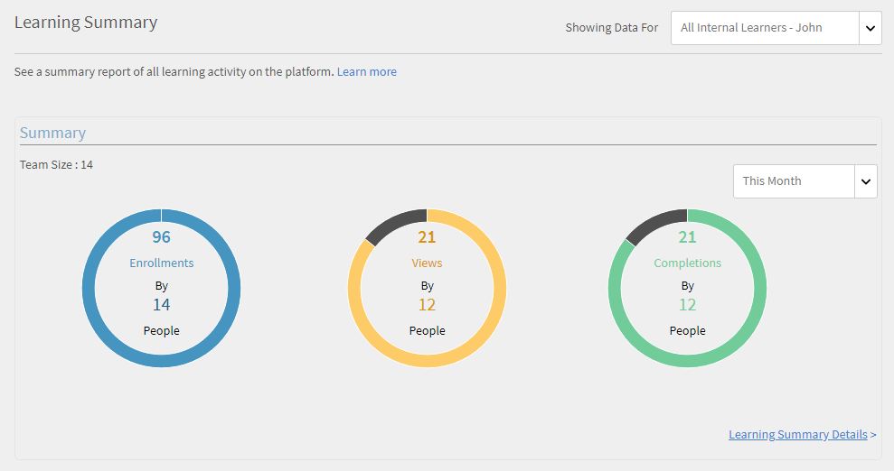
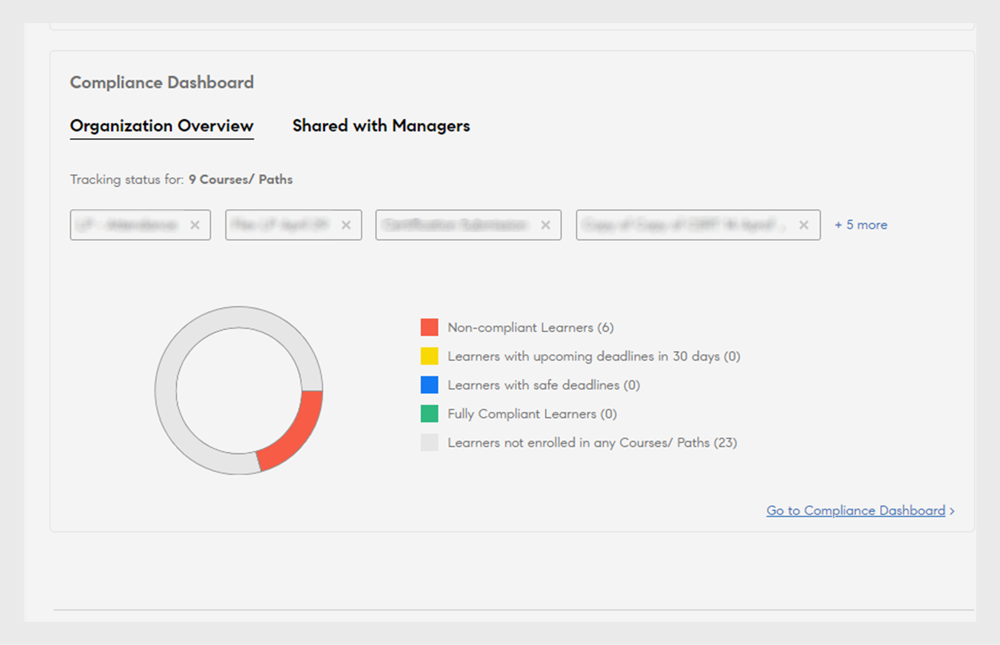
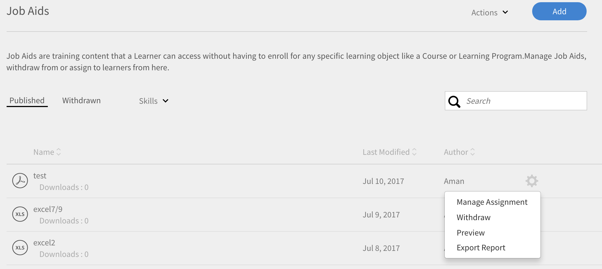

# Rapporten

Lees meer over de rapporten die in de Learning Manager-toepassing aan de beheerdersrol zijn gekoppeld.

Met Adobe Learning Manager kunt u meerdere rapporten aanmaken om leeractiviteiten te volgen, monitoren en beheren. De activiteiten van de studenten worden automatisch gevolgd en in de database vastgelegd. Manager- en beheerderrapporten worden vanuit de database gegenereerd.

## Overzicht {#overview}

Het proces voor het genereren van rapporten is vergelijkbaar voor beheerder en manager. Managers kunnen rapporten van hun ondergeschikten bekijken, terwijl beheerders alle organisatiebrede rapporten kunnen bekijken.

Rapporten worden in een dashboard verzameld. Een rapport moet in een dashboard bestaan. A **[!UICONTROL Standaarddashboard]** bestaat door gebrek in de rapportpagina. Elk rapport dat door u wordt toegevoegd, gaat naar dit standaarddashboard. Om rapporten aan individuele dashboards toe te voegen, gebruik de drop-down pijl en kies **[!UICONTROL Rapport]** toevoegen. Raadpleeg de sectie Dashboards op deze pagina voor meer informatie over het maken van dashboards.

## Rapporttypen {#typesofreports}

Adobe Learning Manager ondersteunt vier belangrijke rapporttypen, zoals voltooiing, bestede tijd, vaardigheden en effectiviteit. U kunt de volgende rapporttypen gebruiken om meer dan 300 varianten te genereren:

* Statistieken levering cursus voor studenten
* Rapport over effectiviteit van cursussen
* Rapport gebaseerd op vaardigheden van student
* Inschrijvingstatistieken voor studenten van leerprogramma
* Bestede leertijd door studenten
* Aantal studenten
* Voltooiing certificering

## Dashboard Gebruikersactiviteit {#useractivitydashboards}

Bekijk een overzicht van alle gebruikersactiviteiten op het platform in de loop van de tijd. Gebruikersgroepen configureren en filters toepassen.

Het dashboard Gebruikersactiviteit geeft de activiteit van de gebruikers in het account weer. De drie vermelde rapporten zijn:

* **Geregistreerde Gebruikers:** Dit rapport verstrekt informatie van het aantal gebruikers die in uw rekeningsweek over week worden geregistreerd. Voor accounts met de licentie Maandelijkse actieve eenheden toont het rapport in plaats daarvan de MAE-eenheden.

* **Rapport van Bebezoeken van de Gebruiker:** Dit rapport verstrekt informatie over het aantal gebruikers die tot het platform op een dagbasis toegang hebben. Er is ook een maandrapport beschikbaar.

* **het Leren Rapport van de Tijd van de Tijd:** Dit rapport verstrekt informatie over de het Leren Tijd bestede in het platform op een dagbasis. Er is ook een maandrapport beschikbaar.

### Geregistreerde gebruikers {#registeredusers}

Learning Manager registreert het aantal gebruikers dat wekelijks in het systeem wordt geregistreerd. Beheerders kunnen dit rapport bekijken om het geregistreerde aantal gebruikers op die dag van de week te begrijpen. Geregistreerd aantal dat eenmaal is opgeslagen voor een week verandert niet. Vandaar dat het historische geregistreerde aantal niet gerelateerd is aan de huidige groep studenten in het systeem.

Dit rapport bevat informatie over het aantal gebruikers dat wekelijks in uw account wordt geregistreerd.

Voor accounts met de licentie Maandelijkse actieve eenheden toont het rapport in plaats daarvan de MAE-eenheden.

*Geregistreerd Rapport van Gebruikers*

***Voor accounts met maandelijkse toegangseenheden:***

**Rapport met maandelijks actieve gebruikers**

Dit rapport toont het aantal studenten dat maandelijks op het leerplatform actief is. De gebruiker wordt geacht actief te zijn gedurende de maand als hij/zij een van de hier genoemde leeracties uitvoert. Ze worden op dezelfde manier als de maandelijkse actieve eenheden geteld.

Het maandelijks actieve aantal dat eenmaal is geteld en opgeslagen voor een maand verandert niet. Vandaar dat het getoonde historische aantal niet is gerelateerd aan de huidige groep studenten in het systeem.

### Gebruikersbezoeken {#uservisits}

Dit rapport toont het totale aantal studenten dat toegang heeft tot het systeem in een dag- of maandperiode. Ook surfen op het leerplatform zonder dat leermateriaal wordt gebruikt, wordt beschouwd als toegang tot het leerplatform. Dit helpt de beheerder om de totale groep van gebruikers die toegang hebben tot het systeem te begrijpen. Op de eerste van de maand registreert Learning Manager het totaal aantal gebruikers dat in de vorige maand toegang had tot het platform. Ook worden de gegevens van de gebruikersgroep voor deze gebruikers vastgelegd.

Alleen de gebruikersgroepen die door de beheerder zijn geconfigureerd, worden opgenomen. Hierdoor kunnen beheerders ook filters toepassen op gebruikersgroepen voor historische maandelijkse gegevens. Merk op dat de configuratie van gebruikersgroepen wordt gewijzigd en de Leermanager geen gegevens voor deze gebruikersgroep in vroegere maanden heeft geregistreerd, dan kan de Leermanager niet de gegevens voor deze nieuw gevormde gebruikersgroepen voor vorige maanden tonen.

Dit rapport bevat gebruikers die toegang hebben tot het platform met behulp van alle indelingen, zoals web, mobiele app, aangepaste headless-oplossingen enz. De gebruiksgrafiek van de apparaat-app vermeldt specifiek alleen de gebruikers die toegang hebben tot het platform via de apparaat-app van Learning Manager. Dit helpt beheerders bij het identificeren van het gebruik van de mobiele app in hun account.

*rapport van het Bezoek van de Gebruiker*

### Rapport met bestede leertijd {#learningtimespentreport}

Hier ziet u een twee-assige lijndiagram dat de totale leertijd voor alle studenten over een periode van 12 maanden laat zien. De tweede as vertegenwoordigt de mediane tijd die een persoon besteedt aan leren.

De tijd die wordt besteed aan verschillende leerobjecten, zoals leerprogramma&#39;s en certificeringen, wordt berekend voor het volgende:

* Zelfstandige cursus met statische en interactieve inhoud
* Activiteit cursussen met url.
* Weekendsessies met de weekendvlag ingeschakeld.
* VC-verbindingssessie waarbij de aanwezigheid automatisch wordt gemarkeerd.
* De tijd die wordt besteed aan verschillende leerobjecten, zoals leerprogramma&#39;s en certificeringen
* xAPI-statements voor een xAPI-activiteitscursus.

U kunt de grafiek verder exporteren als een Excel-spreadsheet.

Er is een filter beschikbaar om de configuratie van de gebruikersgroep te kiezen, wat zal helpen bij het weergeven van de gegevens met betrekking tot de verschillende gebruikersgroepen.

De geselecteerde datum- en gebruikersgroepfilter wordt toegepast op alle relevante grafieken in het dashboard.

>[!NOTE]
>
>Voor rapporten over **[!UICONTROL Gebruikersbezoeken]** en **[!UICONTROL Bestede leertijd]** zijn de weergegeven standaardgegevens (wanneer er geen gebruikersgroep is geconfigureerd) voor het gehele account.

## Dashboard met trainingsinhoud {#trainingcontentdashboard}

Het dashboard met trainingsinhoud biedt inzicht in de trainingen die beschikbaar zijn op het platform. U kunt populaire trainingen bekijken of alle beschikbare trainingen volgen.

### Trainingsrapport {#trainingsreport}

Dit rapport bevat informatie over de totale hoeveelheid trainingen die maandelijks op het platform (in gepubliceerde staat) beschikbaar zijn. Het geeft een indicatie van het aantal trainingen dat in de loop van de tijd wordt aangeboden.

*het rapport van de Opleiding*

### Rapport over actieve trainingen {#activetrainingsreport}

Dit rapport bevat informatie over de trainingen die actief zijn in het geselecteerde tijdsbestek. Actieve trainingen zijn trainingen waarvoor wordt ingeschreven, die worden weergeven in de speler of die in de gegeven periode worden voltooid.

Voor actieve trainingen zijn gegevens van alle interne groepen van de hoofdgebruiker (met beheerdersrol) beschikbaar voor selectie wanneer er geen configuratie van de gebruikersgroep is uitgevoerd. Naast de gebruikersgroepen van de hoofdgebruiker kunt u indien nodig nog 10 andere gebruikersgroepen configureren.

*Actief trainingsrapport*

>[!NOTE]
>
>De gegevens tonen niet zoals verwacht wanneer **[!UICONTROL Alle Gebruikers]** en **[!UICONTROL 12 maanden]** filters worden geselecteerd, maar de gegevensvertoningen wanneer u **[!UICONTROL Al interne gebruikersgroep &#x200B;] selecteert.**

<table>
 <tbody>
  <tr>
   <td>
    
<b>Referentie</b>
</td>
   <td>
    
<b>Metrische gegevens</b>
</td>
   <td>
    
<b>Beschrijving</b>
</td>
  </tr>
  <tr>
   <td>
    
1
</td>
   <td>
    
Startverhouding (%)
</td>
   <td>
    
Verhouding tussen het aantal studenten dat met de cursus is begonnen en het aantal inschrijvingen.
</td>
  </tr>
  <tr>
   <td>
    
2
</td>
   <td>
    
Voltooiingsverhouding (%)
</td>
   <td>
    
Verhouding tussen het totaal aantal gebruikers dat de cursus heeft voltooid en het totaal aantal gebruikers dat met de cursus is begonnen. 
</td>
  </tr>
  <tr>
   <td>
    
3
</td>
   <td>
    
Feedback student
</td>
   <td>
    
Gemiddelde van alle ontvangen L1-feedback-reacties op een schaal van 1 tot 10, afgerond op het dichtstbijzijnde gehele getal. 
</td>
  </tr>
  <tr>
   <td>
    
4
</td>
   <td>
    
Feedback manager
</td>
   <td>
    
Gemiddelde van alle ontvangen L3-feedbackreacties op een schaal van 1 tot 5, afgerond op het dichtstbijzijnde gehele getal. 
</td>
  </tr>
 </tbody>
</table>

Het trainingsrapport heeft twee extra kolommen:

1. Gemiddelde sterwaardering van een cursus.
1. Aantal studenten dat de cursus heeft beoordeeld.
1. Ingesloten pad
1. Ingesloten pad-ID
1. Ingesloten cursus-ID

>[!NOTE]
>
>De start- en voltooiingsverhouding, de feedback van de student en de manager worden niet beïnvloed door de toegepaste filters. De filters hebben alleen invloed op de inschrijving, de weergave en de voltooiing.

>[!NOTE]
>
>Voor beide rapporten (Trainingsinhoud, Gebruikersactiviteit) kunt u maximaal 10 gebruikersgroepen configureren. Het kan tot 24 uur duren voordat de verwerking is voltooid en de nieuw geconfigureerde filters beschikbaar zijn.

## Dashboard met overzicht van leermateriaal {#dashboards}

### Dashboard-rapporten genereren

>[!INFO]
>
>In deze training leert u hoe u dashboardrapporten kunt genereren op basis van de database.  [ &#x200B;](https://content.adobelearningmanageracademy.com/app/learner?accountId=98632#/course/8318854)   

Schrijf naar <almacademy@adobe.com> als u de training niet kunt starten.

Zie een overzichtsrapport van alle leeractiviteiten in het platform. Op deze pagina ziet u de volgende overzichtsinformatie voor het geselecteerde team van de basisgebruiker en de externe profielen. U kunt ook een tijdbereik selecteren:

* Overzicht van leermateriaal in de vorm van inschrijvingen, weergaven en voltooiingen
* Topvaardigheden
* Overzicht van compliance

*Samenvattingsgrafieken*

Als er interne managers op hoofdniveau zijn, worden deze achter elkaar weergegeven.

Alle externe profielen worden weergegeven na interne profielen (interne gebruikers op hoofdniveau).

Als een extern profiel een manager heeft, dan zal de managerhiërarchie in de **[!UICONTROL tonende Gegevens voor]** drop-down lijst worden getoond. De gebruiker wordt weergegeven in de beheerhiërarchie op de detailpagina (Overzicht van leermateriaal, compatibiliteit en vaardigheidsstatus)

Als dit niet het geval is, worden alle afzonderlijke gebruikersgegevens weergegeven in de lijst.

Om meer gedetailleerde details van inschrijvingen van diverse interne teams te zien, klik **[!UICONTROL het Leren Summiere Details]**.

*het Leren Summiere details*

Wanneer u op een inschrijving klikt, ziet u de studenten voor elke manager en ziet u de inschrijving voor welke leerobjecten. U kunt ook de gegevens over voortgang en voltooiing van elke student zien.

*studenten die aan een manager* worden toegewezen

Klik op een team en exporteer het rapport als csv-bestand. Admin kan het rapport voor om het even welke Gebruikersgroep of individuele gebruiker uitvoeren door de Gebruikersgroep of de individuele gebruiker te selecteren, en dan details van de **[!UICONTROL drop-down lijst van de Actie]** uit te voeren.

U kunt ook een staafdiagramweergave zien van vaardigheden die in uitvoering zijn en zijn bereikt. U kunt vaardigheden toevoegen/verwijderen die u in de grafiek wilt opnemen.

*de status gestapelde van de Vaardigheid staafgrafiek*

### Nalevingsdashboard

**Adobe Learning Manager** biedt een nalevingsdashboard aan alle beheerders en managers aan. Beheerders kunnen een compatibiliteitsdashboard maken en dit delen met managers. Managers kunnen het net gedeelde dashboard in hun app bekijken en eenvoudig bijhouden of hun teamleden zich aan een bepaalde training houden. Met het dashboard Naleving kunnen beheerders aangepaste compatibiliteitscursussen categoriseren in specifieke categorieën (bijvoorbeeld Verkoop, Marketing en Juridisch). De nalevingscategorieën van de douane worden aangedreven door **[!UICONTROL Etiketten van de Catalogus]**.

_dashboard-Beheerdermening van de Naleving_

De beheerders kunnen de nalevingsstatus voor het team van elke manager ook controleren door **[!UICONTROL te selecteren ga naar het dashboard van de Naleving]**. Beheerders kunnen een set trainingscursussen delen met individuele managers of met een groep. Hierdoor kunnen managers gemakkelijk controleren of hun teamgenoten aan de opgegeven training voldoen.

#### Workflow voor beheerders

##### Aangepaste compatibiliteitslabels maken

Een compatibiliteitsetiket is een type cataloguslabel dat cursussen/leerpaden/certificeringen categoriseert als een compatibiliteitstype.
Ga als volgt te werk om een label voor aangepaste compatibiliteit te maken:

1. In de app van de Beheerder, ga naar **[!UICONTROL Montages]** > **[!UICONTROL Algemeen]**.
1. Selecteer **[!UICONTROL het type van Naleving van de Douane]** optie om het etiket van de douaneverplichting toe te laten.

   
   _laat de Naleving van de Douane toe_

   >[!NOTE]
   >
   >Dit nieuwe cataloguslabel is geïntroduceerd om de cursussen, leerpaden en certificeringen te categoriseren als een compliancetype. Om het **[!UICONTROL type van Naleving van de Douane]** optie toe te laten, moet u **[!UICONTROL eerst toelaten tonen optie van het Etiket van de Catalogus]** in de zelfde pagina.

1. Ga naar **[!UICONTROL Montages]** > **[!UICONTROL het Etiket van de Catalogus]** en selecteer het **[!UICONTROL type van Naleving]**.
1. Typ de waarden (b.v. Juridisch, Verkoop) in het **[!UICONTROL de tekstvakje van de Waarde]** en selecteer **[!UICONTROL toevoegen Waarde]**.

   
   _voeg waarden voor de Naleving van de Douane toe_

1. Selecteer **[!UICONTROL Opslaan]**.

>[!NOTE]
>
>De auteur moet deze compatibiliteitslabels toevoegen tijdens het maken/bewerken van de cursussen in de app. Zie [&#x200B; nalevingsetiketten aan een cursus/het leren weg/de certificatie &#x200B;](/help/migrated/authors/feature-summary/courses.md#add-compliance-labels-to-courselearning-pathcertification) toevoegen.

##### Een dashboard voor compliance maken en delen

Ga als volgt te werk om een compatibiliteitsdashboard te maken en te delen:

1. Ga naar **[!UICONTROL Rapporten]** > **[!UICONTROL het Leren Samenvatting]**.
1. In de **[!UICONTROL sectie van het Dashboard van de Naleving]**, uitgezocht **[!UICONTROL Gedeeld met Managers]**.
1. Selecteer **[!UICONTROL dashboard van het Aandeel]** en selecteer de gecreeerd etiketten van het **[!UICONTROL Uitgezochte drop-down menu van het Etiket van de Naleving]**.

   
   _selecteer het type van Naleving_

1. Het type en selecteert de naam van de manager in het **[!UICONTROL Aandeel met]** tekstvakje.
1. Selecteer **[!UICONTROL Delen]** om het dashboard naar de geselecteerde manager te verzenden.

>[!NOTE]
>
>Als u het nieuwe dashboard deelt, wordt het bestaande dashboard in de app van de geselecteerde manager overschreven. Managers kunnen het net gedeelde dashboard bekijken door de beheerders.

#### Deel compliance-dashboard met beheerders en aangepaste beheerders

Beheerders kunnen het dashboard delen met andere beheerders en aangepaste beheerders, zodat ze direct toegang hebben tot alle dashboards voor naleving.

Ga als volgt te werk om het dashboard te delen met beheerders en aangepaste beheerders:

1. Login als **[!UICONTROL Admin]**.
2. Navigeer aan de **[!UICONTROL Rapporten]** > **[!UICONTROL het Leren Samenvatting]**.
3. Selecteer **[!UICONTROL Mening Admin]** op de **[!UICONTROL sectie van het Dashboard van de Naleving]**.
4. Selecteer de **[!UICONTROL knoop van het Dashboard van het Aandeel]**.

   
   _dashboard van het Aandeel - Admin_

5. Selecteer de nalevingsetiketten van het **[!UICONTROL Uitgezochte drop-down menu van de Naleving van de Douane]**. Met deze optie selecteert u alle cursussen waarvoor de compatibiliteitslabels zijn geselecteerd.
6. Selecteer de extra cursussen, leerpaden of certificeringen die u met beheerders wilt delen.

   
   _de nalevingsdashboard van het Aandeel_

7. Selecteer de gebruikers of de gebruikersgroepen u het dashboard wilt delen en **[!UICONTROL Delen]** selecteren.

##### Het dashboard Naleving weergeven - Aangepaste beheerders en andere beheerders

Alle aangepaste beheerders en andere beheerders van de geselecteerde gebruikersgroep kunnen het dashboard Naleving in hun app zien.

Ga als volgt te werk om het dashboard Compatibiliteit weer te geven:

1. Navigeer aan de **[!UICONTROL Rapporten]** > **[!UICONTROL het Leren Samenvatting]** > **[!UICONTROL Dashboard van de Naleving]**.
2. Selecteer **[!UICONTROL Uw Mening]** op de **[!UICONTROL sectie van het Dashboard van de Naleving]**.
3. Selecteer **[!UICONTROL ga naar de optie van het Dashboard van de Naleving]**, en u kunt het nieuwe nalevingsdashboard zien dat door admin wordt gedeeld.

   
   _Bekijk het nalevingsdashboard - Douane admin_

#### Delen met winkelmanagers

Beheerders kunnen het dashboard Naleving delen met winkelmanagers, zodat ze de voortgang van de naleving door hun studenten kunnen volgen.

Ga als volgt te werk om het dashboard te delen met winkelmanagers:

1. Login als **[!UICONTROL Admin]**.
2. Navigeer aan de **[!UICONTROL Rapporten]** > **[!UICONTROL het Leren Samenvatting]** > **[!UICONTROL Dashboard van de Naleving]**.
3. Selecteer **[!UICONTROL Mening van de Manager]** op de **[!UICONTROL sectie van het Dashboard van de Naleving]**.
4. Selecteer de **[!UICONTROL knoop van het Dashboard van het Aandeel]**.

   
   _Deel het nalevingsdashboard met Managers_

5. Selecteer de nalevingsetiketten van het **[!UICONTROL Uitgezochte drop-down menu van de Naleving van de Douane]**.
Met deze optie selecteert u alle cursussen waarvoor de compatibiliteitslabels zijn geselecteerd.
6. Selecteer de extra cursussen, leerpaden of certificeringen die u met beheerders wilt delen.
7. Selecteer de gebruikers of de gebruikersgroepen u het dashboard wilt delen en **[!UICONTROL Delen]** selecteren.

##### Het dashboard Naleving weergeven - Manager

Verwijs dit artikel [&#x200B; Bekijk het nalevingsdashboard &#x200B;](/help/migrated/managers/feature-summary/manager-dashboard.md#view-the-dashboard) voor meer informatie.

#### Het dashboard bewerken

Ga als volgt te werk om het dashboard Compatibiliteit te bewerken:

1. Login als **[!UICONTROL Admin]**.
2. Navigeer aan de **[!UICONTROL Rapporten]** > **[!UICONTROL het Leren Samenvatting]** > **[!UICONTROL Dashboard van de Naleving]**.
3. Selecteer **[!UICONTROL Mening Admin]** of **[!UICONTROL Mening van de Manager]** op de **[!UICONTROL sectie van het Dashboard van de Naleving]**. In deze sectie ziet u de dashboards voor compliance.
4. Selecteer **[!UICONTROL geef]** op het nalevingsdashboard uit u wilt uitgeven.

   
   _geef het nalevingsdashboard_ uit

5. Verander de vereiste details en selecteer **[!UICONTROL Aandeel]**.
6. Het compatibiliteitsdashboard wordt gedeeld met de geselecteerde managers.

#### Het dashboard intrekken - Beheer

Ga als volgt te werk om het dashboard Naleving in te trekken:

1. Login als **[!UICONTROL Admin]**.
2. Navigeer aan de **[!UICONTROL Rapporten]** > **[!UICONTROL het Leren Samenvatting]** > **[!UICONTROL Dashboard van de Naleving]**.
3. Selecteer **[!UICONTROL Mening Admin]** of **[!UICONTROL Mening van de Manager]** op de **[!UICONTROL sectie van het Dashboard van de Naleving]**. In deze sectie ziet u de dashboards voor compliance.
4. Selecteer **[!UICONTROL terugtrekken]** op het nalevingsdashboard u wilt verwijderen en selecteren **[!UICONTROL ga]** verder.
5. Hiermee verwijdert u het dashboard voor gedeelde naleving uit de app van de manager.

   
   _trek het nalevingsdashboard_ terug

#### Standaardcompatibiliteitswidget voor studenten instellen

Ga als volgt te werk om de standaardcompatibiliteitswidget voor studenten in te stellen:

1. Login als **[!UICONTROL Admin]**.
2. Navigeer aan de **[!UICONTROL Rapporten]** > **[!UICONTROL het Leren Samenvatting]** > **[!UICONTROL Dashboard van de Naleving]**.
3. Selecteer **[!UICONTROL de Mening van de Student]** op de **[!UICONTROL sectie van het Dashboard van de Naleving]**.
4. Selecteer **[!UICONTROL Verandering]** in de **[!UICONTROL sectie van de Mening van de Student]**.

   
   _plaats standaard nalevingswidget voor studenten_
5. Selecteer de nalevingsetiketten van **[!UICONTROL drop-down Naleving van de Douane]**. Met deze optie selecteert u alle cursussen waarvoor de compatibiliteitslabels zijn geselecteerd.
6. Selecteer **[!UICONTROL ga]** verder om de standaard nalevingswidget te plaatsen.

Studenten kunnen de geselecteerde cursussen of leerpaden op de compatibiliteitswidget op hun startpagina zien. Verwijs [&#x200B; widget van het dashboard van de Naleving &#x200B;](/help/migrated/learners/feature-summary/learner-home-page.md#compliance-dashboard-widget) voor meer informatie.

## Aangepaste rapporten

De beheerders kunnen specifieke rapporten produceren gebruikend het douanemalplaatje beschikbaar in de **[!UICONTROL sectie van Rapporten]**.

### Voorbeeldrapporten {#samplereports}

Op het tabblad **[!UICONTROL Voorbeeldrapporten]** worden enkele indicatieve rapporten weergegeven die op voorbeeldgegevenspunten zijn gebaseerd. Bekijk deze rapporten om een idee te krijgen van de verschillende soorten rapporten boordevol informatie die u kunt genereren met behulp van uw accountgegevens.

### Dashboardrapporten {#dashboardreports}

Een dashboard is een verzameling rapporten. Rapporten kunnen naar keuze worden gegroepeerd in een dashboard. Klik op dit tabblad om alle boards te bekijken die u hebt gemaakt. Van de **[!UICONTROL drop-down lijst van het Dashboard van de Mening]**, kunt u het standaardboard of een dashboard selecteren u creeerde.

### Excel-rapporten {#excelreports}

Via het tabblad **[!UICONTROL Excel-rapporten]** kunt u rapporten in XLS-indeling exporteren.

De volgende rapporttypen zijn beschikbaar om te downloaden.

* Cursusrapporten
* Studenttranscripten
* Aankondigingenrapport
* Taakhulpenrapport
* Audittrail van inhoud
* Audittrail van gebruiker
* Aanmeldings-/toegangsrapport
* Gamificationtranscripten
* Gamification Audittrail

### Cursusrapporten {#coursereports}

Als beheerder kunt u rapporten voor cursussen downloaden. Volg deze stappen:

1. Open **[!UICONTROL Rapporten]** > **[!UICONTROL de Rapporten van de Douane]** > **[!UICONTROL Rapporten van Excel]** > **[!UICONTROL Rapporten van de Cursus]**.
1. Het dialoogvenster **[!UICONTROL Cursusrapporten]** verschijnt. Selecteer de cursus waarvoor u het rapport wilt ophalen en klik op **[!UICONTROL Weergeven]**.

   
   *Cursusrapporten*

1. U wordt omgeleid naar de cursuspagina. U kunt de quizscore per gebruiker en per vraag exporteren op basis van elke inschrijving door het specifieke inschrijvingstype te kiezen.
1. Selecteer **[!UICONTROL Quizscore exporteren]** om het rapport te exporteren. Het dialoogvenster **[!UICONTROL Rapportaanvraag genereren]** verschijnt. Klik op **[!UICONTROL OK]** om te bevestigen.

   
   *Genererend het Verzoek van het Rapport*

   >[!NOTE]
   >
   >Het geëxporteerde quizscorerapport bevat de scoregegevens voor elke poging als de optie voor meerdere pogingen voor de module is geconfigureerd.

### Cursusrapporten genereren

>[!INFO]
>
>In deze training leert u hoe u cursusrapporten exporteert en e-mailabonnementen instelt voor deze rapporten.  [ &#x200B;](https://content.adobelearningmanageracademy.com/app/learner?accountId=98632#/course/8318904)   

Schrijf naar <almacademy@adobe.com> als u de training niet kunt starten.

### Studenttranscripten {#LearnerTranscripts-1}

Adobe Learning Manager stelt de beheerders van een organisatie in staat om de transcripten van de studenten te genereren.

Zie [&#x200B; Transcriptie van de Student &#x200B;](/help/migrated/administrators/feature-summary/reports/learner-transcripts.md) voor meer informatie.

### Aankondigingenrapporten {#announcementsreports}

Als beheerder kunt u een rapport genereren van alle aankondigingen die u verzendt. Het rapport bevat details over het volgende:

* Type aankondiging
* Naam van aankondiging
* Datum van aankondiging
* Status van aankondiging
* Naam van student

Volg een van deze stappen om een rapport te downloaden:

1. Open **[!UICONTROL Rapporten]** > **[!UICONTROL de Rapporten van de Douane]** > **[!UICONTROL Rapporten van Excel]** > **[!UICONTROL Rapport van aankondigingen]**. Het dialoogvenster **[!UICONTROL Rapportaanvraag genereren]** wordt geopend. Klik op OK.
1. [!UICONTROL **aankondigingen**] > [!UICONTROL **Acties**] > [!UICONTROL **Rapport van de Uitvoer**].

   
   *het rapport van aankondigingen*

1. U kunt een rapport voor een specifieke aankondiging halen door **[!UICONTROL Rapport van de Uitvoer]** onder het montagespictogram te klikken.

   
   *Rapport voor specifieke aankondigingen*

### Taakhulpenrapport {#jobaidsreport}

Taakhulpen zijn trainingsinhoud waartoe een studenten toegang hebben zonder dat zij zich moeten inschrijven voor een specifiek leerobject zoals een cursus of leerprogramma. Beheerders kunnen het Taakhulpenrapport extraheren en downloaden.

Het geëxtraheerde rapport bevat informatie over het volgende:

* Naam
* Type taakhulp
* Status van taakhulp (gepubliceerd of ingetrokken)
* Inschrijvingsdatum
* Voltooiingsdatum
* Downloaddatum
* Naam van student
* Naam van manager
* Gemaakt door

Voer een van de volgende handelingen uit om een rapport te downloaden:

* Open **[!UICONTROL Rapporten]** > **[!UICONTROL de Rapporten van de Douane]** > **[!UICONTROL Rapporten van Excel]** > **[!UICONTROL Rapporten van de Hulp van de Taak]**. Het dialoogvenster **[!UICONTROL Rapportaanvraag genereren]** wordt geopend. Klik op **[!UICONTROL OK]**.
* Open **[!UICONTROL Hulp van de Baan]** > **[!UICONTROL Acties]** > **[!UICONTROL Rapport van de Uitvoer]**.

*het rapport van de Hulp van de Baan*

* U kunt ook een rapport voor een specifieke taakhulp extraheren door onder het instellingenpictogram op **[!UICONTROL Rapport exporteren]** te klikken.

*Rapport voor specifieke Hulp van de Baan*

### Taakhulpenrapport

Nadat u **[!UICONTROL het Rapport van de Hulp van de Baan]** op de lijst selecteert, ziet u twee opties:

*het Rapport van de Inschrijving van de Taak van de Download USer*

**Alle Hulp van de Baan**: Als het aantal taakhulpen in de rekening minder dan 10 miljoen is, zal het geproduceerde rapport inschrijvingsinformatie van alle taakhulpen bevatten. Dit is de standaardselectie. Als het aantal rijen groter is dan 10 miljoen, wordt een fout weergegeven en moet u de vereiste taakhulpen handmatig selecteren.

**Geselecteerde Hulp van de Baan**: Als u deze optie selecteert, kunt u de taakhulpen ingaan waarvoor u het rapport wilt produceren. U kunt maximaal 10 taakhulpen selecteren. Adobe Learning Manager controleert of er meer dan 10 miljoen taakhulpen zijn.

*Selecteer een Taakhulp*

**het Rapport van de Hulp van de Baan**

Als u deze optie selecteert, worden de details gedownload van alle taakhulpen die in het systeem aanwezig zijn, samen met de bijbehorende metadata en training.

Het gedownloade rapport bestaat uit de volgende velden:

* Naam van taakhulp
* Taal/talen
* Id
* Type
* Duur (minuten)
* Status
* Publicatiedatum (tijdzone UTC)
* Gemaakt, op naam
* Gemaakt, op e-mailadres
* Gemaakt, op unieke ID van gebruiker
* Catalogus(sen)
* Leerpad(en)
* Cursus(sen)
* Tag(s)
* Vaardigheid/vaardigheden

**het Rapport van de Inschrijving van de Gebruiker van de Hulpmiddelen**

Het inschrijvingsrapport bevat details over inschrijving van gebruikers en andere informatie.

Het gedownloade rapport bestaat uit de volgende velden:

* Naam van taakhulp
* Type
* Status
* Datum ingeschreven (tijdzone UTC)
* Voltooiingsdatum (UTC-tijdzone)
* Downloaddatum (UTC-tijdzone)
* Naam van student
* E-mail
* Unieke ID van gebruiker
* Naam van manager
* E-mailadres van manager
* Unieke ID van managergebruiker
* Toegewezen op naam
* Toegewezen op e-mail
* Toegewezen op unieke ID van gebruiker
* Gemaakt op naam
* Gemaakt op e-mail
* Gemaakt op unieke ID van gebruiker
* Taakcode
* Nieuw veld
* Profiel

### Rapporten voor audittrail van inhoud {#contentaudittrailreports}

Gebruik de **[!UICONTROL rapportgenerator van het Trail van de Controle van de Inhoud]** om een rapport van alle veranderingen en geeft aan een cursus tijdens zijn leven in het systeem uit. Het gegenereerde rapport bevat de volgende informatie.

* Object-ID
* Objectnaam
* Objecttype
* Wijzigingstype
* Beschrijving
* Verwezen object-ID
* Verwezen objectnaam
* Gewijzigd op gebruikersnaam
* Gewijzigd in gebruikers-ID
* Datum gewijzigd (UTC-tijdzone)

In de **het type van Wijziging** kolom, zult u de volgende details krijgen:

| Wijzigingstype | Beschrijving |
| --- | --- |
| Creëer | Cursus gemaakt |
| Certificering toevoegen | Certificering toegevoegd aan catalogus |
| Certificering verwijderen | Certificering verwijderd uit catalogus |
| Inhoud toevoegen | Inhoud toegevoegd aan module |
| Cursus toevoegen | Cursus toegevoegd aan leerpad |
| Cursus verwijderen | Cursus verwijderd uit leerpad |
| Aangepast label toevoegen | Aangepast label toegevoegd aan catalogus |
| Eigen label verwijderen | Aangepast label verwijderd uit catalogus |
| Verwijderen | Catalogus verwijderd |
| Taakhulp toevoegen | Taakhulp toegevoegd aan catalogus |
| Taakhulp verwijderen | taakhulp uit catalogus verwijderd |
| Leerpad toevoegen | Leerpad toegevoegd aan catalogus |
| Leerpad verwijderen | Leerpad verwijderd uit catalogus |
| Inhoud module toevoegen | Module toegevoegd aan cursus (sectie Inhoud) |
| Module-inhoud verwijderen | Module verwijderd uit cursus(sectie Inhoud) |
| Gepubliceerd | Cursus of leerpad gepubliceerd en toegevoegd aan standaardcatalogus |
| Opnieuw gepubliceerd | Cursus opnieuw gepubliceerd |
| Bron toevoegen | Bron toegevoegd aan cursus |
| Bron verwijderen | Bron verwijderd uit cursus |
| Gearchiveerd | Cursus buiten gebruik gesteld |
| Gedeelde catalogus toevoegen | Catalogus die wordt gedeeld met catalogus |
| Gedeelde catalogus verwijderen | Delen van catalogus verwijderd uit catalogus |
| Update gedeelde catalogus | Status voor delen van catalogus: actief |
| Update | Cursus- of leerpad bijgewerkt |
| Gebruikersgroep toevoegen | Gebruikersgroep toegevoegd aan catalogus |
| Gebruikersgroep verwijderen | Gebruikersgroep verwijderd uit catalogus |

Informatie over metagegevens wordt niet in het gegenereerde rapport opgenomen.

Volg deze stappen om een rapport Audittrail van cursus te genereren.

1. Selecteer **[!UICONTROL Rapport]** > **[!UICONTROL de rapporten van Excel]** > **[!UICONTROL Trail van de Controle van de Cursus]**. Het dialoogvenster **[!UICONTROL Audittrail van inhoud]** verschijnt.

   
   *het controlespoor van de Cursus*

1. Selecteer de cursus, het leerprogramma en de certificering waarvoor u het rapport wilt downloaden. Indien niet gespecificeerd, worden standaard alle rapporten gedownload.
1. Selecteer een datumwaaier voor het rapport en klik **[!UICONTROL produceer]**.
1. Het rapport wordt gegenereerd en u ontvangt bericht wanneer het rapport Audittrail van inhoud klaar is. U kunt het rapport downloaden.

### Rapporten Audittrail van gebruiker {#useraudittrailreports}

Audittrail van gebruikers legt de levenscyclus van gebruikers, gebruikersgroepen en zelfregistratieprofielen vast. Toevoeging, verwijdering en wijziging in Manager van gebruiker worden allemaal vastgelegd. Maken en verwijderen van zelfregistratieprofielen wordt vastgelegd. U kunt ook pauzeren en de zelfregistratie hervatten.

U kunt Toevoegen, Inschakelen, Uitschakelen, Pauzeren of Hervatten voor Externe profielen. Voor zelfregistratie kunt u Toevoegen, Verwijderen, Pauzeren of Hervatten. CSV-uploads worden ook vastgelegd.

1. Selecteer **[!UICONTROL Rapport > het rapport van Excel > het Spoor van de Gebruiker]**. Het dialoogvenster Audittrail van gebruiker wordt weergegeven.
1. Het dialoogvenster Audittrail van gebruiker verschijnt. Selecteer het datumbereik in het pop-upmenu. U kunt een rapport voor de laatste week of laatste maand genereren, of een aangepaste datum selecteren.

   
   *het controlespoor van de Gebruiker*

1. Klik op **[!UICONTROL Genereren]** om het rapport te genereren.

Er zijn twee filters in het dialoogvenster **[!UICONTROL Rapport Audittrail van gebruiker]**.

**het groepsfilter van de Datum:** kies de datumwaaier waarvoor u het rapport wilt produceren. Er zijn drie opties:

* Laatste week
* Laatste maand
* Aangepaste datum

Selecteer het filter Studenten: zoek naar een gebruiker of een gebruikersgroep.

Het geëxporteerde rapport bevat gegevens van de gebruikers die aan beide opgegeven zoekcriteria voldoen.

*het controlespoor van de Gebruiker*

>[!NOTE]
>
>Wanneer een vaardigheid wordt toegewezen of verwijderd, kan deze worden bijgehouden voor het controlerapport van de gebruiker voor zowel toegewezen als verwijderde vaardigheid.

### Rapport over extensieconfiguratie

Dit rapport bevat informatie over de configuratiedetails van alle toegevoegde native extensies, inclusief hun activeringsstatus. Leer hoe te om uitbreidingsrapport te downloaden, zie [&#x200B; de uitbreidingsrapport van de Download &#x200B;](native-extensibility.md#download-extension-report).

### xAPI-activiteitsrapport

Deze rapporten bevatten de gegevens van alle xAPI-statements die zijn opgenomen en gegenereerd tijdens xAPI-activiteitsmodules.

Ga als volgt te werk om dit rapport te downloaden:

1. Selecteer **[!UICONTROL Rapport > het rapport van Excel > xAPI het Rapport van de Activiteit]**. Het dialoogvenster xAPI-activiteitsrapport wordt weergegeven.
1. Selecteer het datumbereik in het pop-upmenu. U kunt een rapport voor de laatste week of laatste maand genereren, of een aangepaste datum selecteren.
1. Selecteer de studenten en activiteit in het vervolgkeuzemenu.
1. Selecteer **[!UICONTROL produceer]** om het rapport te produceren.

### Gamificationrapporten {#gamification}

Beheerders kunnen gamificationtranscript in CSV-indeling downloaden. U kunt het rapport voor individuele gebruikers of gebruikersgroepen downloaden. Gebruikersnaam, e-mail van de gebruiker, UUID van de gebruiker, totaal aantal gescoorde gebruikerspunten, opsplitsing van verzamelde punten, naam van groepen waarin de gebruiker speelt, naam van de manager, en actieve veldwaarden worden allen opgehaald in het rapport. Beheerders kunnen dit rapport gebruiken om de ranglijsten van gebruikers op organisatieniveau of voor een specifieke groep te evalueren en te begrijpen.

1. Selecteer Rapport > Excel-rapport > Gamificationrapport.

   
   *het rapport van de Gamification*

1. Het dialoogvenster Gamificationtranscripten verschijnt. Selecteer studenten aan de hand van hun Naam, Profiel, Gebruikersgroepen, E-mail-ID of UUID.

   
   *de transcripten van de Gamification dialoog*

1. Klik **[!UICONTROL produceer]** om het rapport te produceren.

   Nadat u het rapport van een student hebt gegenereerd, moet u de huidige informatie en de informatie op een gereed niveau kunnen exporteren voor alle gebruikers (intern, extern of verwijderd) in het account. U kunt ook de datums controleren waarop een student de niveaus heeft behaald:

   * Datum brons behaald
   * Datum zilver behaald
   * Datum goud behaald
   * Datum platina behaald

   Deze kolommen bevatten de datums waarop het niveau voor het eerst werd behaald. Het kolom **[!UICONTROL Huidige Niveau]** toont het huidige niveau van de student.

   Wanneer de beheerder de gamification herstelt, worden alle punten van de student overeenkomstig hersteld.

### Rapport Gamification-audittrail {#gamification-audit-trail}

Dit rapport bevat de geschiedenis en de redenen voor de gamificationpunten van studenten die voor elke regel zijn verdiend.

### Rapport downloaden

1. Selecteer de URL van het Gamification-audittrail.
1. Voor het **Trail van de Controle van de Gamification** pop-up, selecteer de datumwaaier.
1. Selecteer **produceer**.

Het rapport wordt gedownload als een CSV-bestand. Het bestand bevat de volgende kolommen:

* Naam
* E-mail/UUID,
* Status
* Actie
* Punten,
* Saldo punten
* Regel/taak
* Regel-/taaksubtaak,
* Regel/taakdetails
* Type
* Naam
* InstantienaamDate bereikt (UTC-tijdzone)
* Regel/Begintijd taak
* Regel/Eindtijd van taak

### Inschrijvings- en uitschrijvingsrapport {#enrollmentandunenrollmentreport}

Beheerders en managers kunnen een rapport extraheren van de studenten die zijn ingeschreven en uitgeschreven. Als beheerder kunt u alle studenten, beheerders of managers zien die zijn in- of uitgeschreven voor een instantie van een cursus, leerprogramma of certificering en het rapport exporteren. Als manager kunt u alleen een rapport van uw teamleden ophalen. Als manager kunt u de verwijderde studenten of uw eigen naam niet zien in de managertoepassing als ingeschreven of uitgeschreven student.

Om een rapport te downloaden, volg deze stappen: Open de **[!UICONTROL Cursus/het Leren programma/Certificatie]** > **[!UICONTROL Studenten]** > **[!UICONTROL Actie]** > **[!UICONTROL rapport van de Uitvoer]**.

*het rapport van de Uitschrijving*

### Feedbackrapport {#feedback-report}

Als beheerder kunt u nu zowel feedback van de student (L1) als van de manager (L3) krijgen voor geselecteerde trainingen voor een bepaalde periode.

Zie [&#x200B; rapport van de Terugkoppeling &#x200B;](/help/migrated/administrators/feature-summary/reports/feedback-report.md) voor meer informatie.

### Trainingsrapport {#training-report}

Leermanager ondersteunt een trainingsrapport waarmee beheerders trainingsgegevens en de bijbehorende metagegevens kunnen downloaden, zoals auteur, gepubliceerde datum, vaardigheden, cataloguslabels, enz.

Op Admin app, klik **[!UICONTROL Rapporten]** > **[!UICONTROL de Rapporten van de Douane]** > **[!UICONTROL Rapporten van Excel]** > **[!UICONTROL Rapport van de Leeringen]**.

U kunt rapporten downloaden voor het volgende:

* Geselecteerde trainingen (maximaal 10) - Selecteert één of meerdere trainingen tegelijk (tot 10) van elke catalogus
* Trainingen in de geselecteerde catalogus (maximaal 5) - (selectie van catalogi is beschikbaar tot maximaal vijf catalogi).
* Alle trainingen - (alle trainingen in het account)

*het trainingsrapport van de Download*

In het gedeelte Geavanceerde opties zijn de volgende opties beschikbaar:

* Cursustoewijzingen toevoegen aan leerprogramma/certificering
* Informatie over moduleniveau toevoegen

Nadat u de filters hebt geselecteerd en op Downloaden hebt geklikt, ontvangt u een melding om het rapport in CSV-indeling te downloaden.

Het rapport zal de volgende velden bevatten:

*Catalogusnaam, Trainingstype, trainings-id, unieke trainingsnaam, subtrainingen, modules, duur van training of module, indeling, status van training, vaardigheden, auteur, laatst gepubliceerde datum, laatst voltooide datum, aantal inschrijvingen voor docenten, aantal start-ups, aantal voltooide trainingen, gemiddelde L1-score, gemiddelde L2-score, Avg L3-score, ontvangen L1-reacties, L2-reacties ontvangen, ontvangen L3-reacties, cataloguslabels en -tags.*

*Extra opties*

### Overzichtsrapport van de sessie {#session-summary-report}

Het rapport Sessiesamenvatting bevat alle sessies die voor een student zijn gepland binnen een opgegeven datum.

Hiermee kan de beheerder alle virtuele sessiedetails en de gegevens van de lesruimtesessie exporteren die binnen het opgegeven datumbereik vallen. De beheerder kan het sessierapport ook exporteren voor specifieke trainingen of docenten.

Dit zal de Beheerder ook helpen om de sessies te begrijpen die op een maandelijkse basis worden gepland en het programma van instructeurs en reeds geleverde zittingen te identificeren.

Als Beheerder, klik **[!UICONTROL de Rapporten van de Douane]** > **[!UICONTROL Samenvattingsrapport van de Zitting]**.

Kies in het volgende dialoogvenster het datumbereik en de training of docent voor een overzicht.

*Rapport van de Samenvatting van de Zitting*

De gedownloade csv bevat de volgende velden:

* Startdatum en -tijd
* Einddatum en -tijd

* Modulenaam
* Duur sessie (in minuten)
* Aantal licenties
* Locatie
* Instantienaam
* Cursusnaam
* Cursus-id
* Naam docent
* E-mailadres docent
* Inschrijvingsaantal
* Type sessie
* Wachtlijstlimiet
* Aantal wachtlijsten
* E-mailadressen gebruikers wachtlijst
* Informatie over locatie
* Regio locatie

### Gebruiksrapport van docent

Dit rapport bevat de tijd (in minuten) die een docent dagelijks besteedt aan het lesgeven van toegewezen sessies. Het rapport kan worden gedownload voor een periode van drie maanden vanaf de geselecteerde startdatum.

Om het rapport te downloaden, klik **[!UICONTROL Rapporten]** > **[!UICONTROL de Rapporten van de Douane]** > **[!UICONTROL Rapport van het Gebruik van de Instructeur]**.

Selecteer een docent of meerdere docenten en het datumbereik.

*Rapport van het Gebruik van de Instructeur van de Download*

Het gedownloade rapport bevat de volgende velden:

* Naam van docent
* Docent-ID
* Competentieniveau
* Datums als kolommen. Als de docent wordt gebruikt om een datum, wordt het aantal sessies vermeld. Als de docent niet wordt gebruikt op een dag, is de waarde nul.

Het rapport bevat records voor drie maanden vanaf de geselecteerde maand.

Laat het veld Docent leeg om records van alle docenten op te halen.

Ook kan een aangepaste beheerder met toestemming voor het genereren van rapporten dit rapport ophalen.

### Rapport Audittrail van gebruiker

In dit rapport wordt informatie vastgelegd over de studenten die van instantie zijn veranderd, van instantie naar instantie, van tijd tot datum, enz.

Selecteer de studenten of een gebruikersgroep.

Om het rapport te downloaden, klik **[!UICONTROL Rapporten]** > **[!UICONTROL de Rapporten van de Douane]** > **[!UICONTROL Rapport van het Spoor van de Controle van de Gebruiker]**.

*Rapport van het Trail van de Controle van de Gebruiker van de Download*

### Rapport leerplan

Dit rapport bevat details van alle leerplannen in een account, zoals verwante gebruikersgroepen, status en triggerinformatie.

Het rapport bevat het volgende:

* Naam van het leerplan
* Type (treedt wanneer op)
* Training (voltooid)
* Vaardigheid (behaald)
* Datum (op datum)
* Actie
* Status, gemaakt door
* Datum gemaakt
* Datum laatst gewijzigd
* Gebruikersgroep (van toepassing op)
* Gebruikersgroep (toevoegen aan)
* Inschrijven na
* Type(n) leerelement(en)
* Leerelement(en)
* Instantie(s) van leerelement
* Leerelement
* Voltooiingsdatum
* Herinnering leerelement
* Scope-catalogus
* Scope-gebruikersgroep

### Audittrail voor aangepaste rollen

Beheerders kunnen het controlerapport voor de aangepaste rol downloaden om alle wijzigingen bij te houden die zijn aangebracht in de aangepaste rollen, zoals het maken, wijzigen en verwijderen van aangepaste rollen en de bijbehorende functietoegang.

Ga als volgt te werk om het rapport te downloaden:

1. Meld u aan als beheerder.
2. Selecteer Rapporten > Aangepaste rapporten.
3. Selecteer Audittrail van aangepaste rol en kies het datumbereik
4. Selecteer Genereren om het rapport te downloaden.

Het rapport Audittrail van aangepaste rol bevat de volgende velden:

* Rol-ID
* Rolnaam
* Activiteitstype
* Wijzigingstype
* Beschrijving
* Verwezen objecttype
* Verwezen object-ID
* Verwezen objectnaam
* Verwezen object-e-mail
* Gewijzigd in gebruikersnaam
* Gewijzigd door UUID van gebruiker
* Gewijzigd in e-mailadres van gebruiker
* Gewijzigde datum (tijdzone UTC)
* Bron

## E-mailabonnementen {#emailsubscriptions}

U kunt uw favoriete rapporten als e-mail ontvangen door u hierop te abonneren.

### E-mailabonnementen instellen

>[!INFO]
>
>In deze training leert u hoe u e-mailabonnementen kunt instellen voor dashboardrapporten.  [ &#x200B;](https://content.adobelearningmanageracademy.com/app/learner?accountId=98632#/course/8318927)   

Schrijf naar <almacademy@adobe.com> als u de training niet kunt starten.

In **[!UICONTROL pagina van Rapporten]**, klik het **[!UICONTROL Abonnement]** lusje. De abonnementspagina voor rapporten verschijnt.

Als u de rapportnaam in de vervolgkeuzelijst wilt selecteren, typt u de rapportnaam in het veld Rapporten. Kies in de lijst hoe vaak u e-mail wilt ontvangen. U kunt het onderwerp van de e-mail toevoegen en een alternatief e-mailadres opgeven.

U kunt abonnementen bewerken en verwijderen.

## Historische verslagen

Historische rapporten in Adobe Learning Manager (ALM) verwijzen naar de rapporten die de historische gegevens en activiteiten binnen het leerplatform vastleggen. Deze rapporten bieden inzichten in eerdere studentactiviteiten, trainingsinhoud, prestaties van gebruikersgroepen en andere relevante gegevens. Met de historische rapporten kunnen beheerders de voortgang en effectiviteit van leerinitiatieven in de loop der tijd volgen, controleren en analyseren.

### Cursustoegangsrapporten

De cursustoegangsrapporten bevatten informatie over het reviseren van elke cursus.

Ga als volgt te werk om dit rapport te downloaden:

1. Ga naar **[!UICONTROL Rapporten]** > **[!UICONTROL de Rapporten van de Douane]** > **[!UICONTROL Historische Rapporten]**.
1. Selecteer **[!UICONTROL Rapport van de Toegang van de Cursus]**. Het dialoogvenster Rapportaanvraag genereren wordt geopend.
1. Selecteer het jaar en het kwartaal in de vervolgkeuzelijst.
1. Selecteer **[!UICONTROL produceer]**.

### Aanmeldings-/toegangsrapporten

De inlognaam-/toegangsrapporten bieden informatie over gebruikersaanmeldingen en -toegang. U kunt een rapport genereren met gegevens van drie maanden per keer.

Ga als volgt te werk om dit rapport te downloaden:

1. Ga naar **[!UICONTROL Rapporten]** > **[!UICONTROL de Rapporten van de Douane]** > **[!UICONTROL Historische Rapporten]**.
1. Selecteer **[!UICONTROL Login/Toegangsrapport]**. Het dialoogvenster Rapportaanvraag genereren wordt geopend.
1. Selecteer het jaar en het kwartaal in de vervolgkeuzelijst.
1. Selecteer **[!UICONTROL produceer]**.

## Een dashboard maken {#createadashboard}

1. Klik op Dashboard toevoegen aan de rechterkant van de pagina om uw eigen boards te maken.

   
   *voeg dashboards* toe

1. Geef de naam en beschrijving van het dashboard op.
1. Als u het dashboard met om het even welke Manager wilt delen, kies hen in **[!UICONTROL Aandeel met]** gebied. U kunt alle normale selectiecriteria voor deze bewerking gebruiken.
1. Klik **[!UICONTROL sparen &#x200B;].**

U kunt het recent gemaakte board bekijken op het tabblad **[!UICONTROL Dashboard Rapporten]**.

Om rapporten aan uw board toe te voegen, klik drop-down bij de hogere juiste hoek van uw boardvenster en klik **[!UICONTROL voeg Rapport]** toe. Het rapport dat u op deze manier maakt, wordt aan uw dashboard gekoppeld.

>[!NOTE]
>
>De rapporten die u maakt door op Toevoegen rechtsboven op de pagina Rapporten te klikken, worden aan uw standaarddashboard toegevoegd.

## Gedeelde dashboards {#shareddashboards}

Gedeelde boards zijn een verzameling rapporten die met u zijn gedeeld door andere gebruikers binnen uw organisatie. Alle rapporten die u aan een gedeeld board toevoegt, worden automatisch gedeeld met andere gebruikers die toegang hebben tot dat board.

U kunt het board op twee manieren delen:

* Door gebruikers in **[!UICONTROL te gaan deel met]** gebied met wie dashboard wordt gedeeld.
* Kies Dashboard bewerken in de vervolgkeuzelijst en voer gebruikersgegevens in om het dashboard te delen.

>[!NOTE]
>
>Een manager kan de rapporten van zijn teamleden alleen bekijken vanaf een gedeeld dashboard.

## Downloads {#downloads}

Het geëxporteerde blad met dashboardrapporten bevat gedetailleerde informatie in plaats van een rapportsamenvatting. Het gedownloade rapport volgt de indeling van een studenttranscript.

## Rapporten maken {#report}

1. Klik op Rapporten in het linkerdeelvenster. De pagina Rapportoverzicht wordt geopend.

   >[!NOTE]
   >
   >Standaard verschijnen er ten minste drie voorbeeldrapporten op het tabblad voor voorbeeldboards. U kunt de voorbeeldrapporten alleen bekijken om een idee te krijgen hoe u ze maakt en aanpast.

1. Klik rechtsboven op de pagina op **[!UICONTROL Toevoegen]**.
1. In het dialoogvenster **[!UICONTROL Rapport toevoegen]** kunt in de keuzelijst Type een van de vooraf gedefinieerde rapporten of de optie **[!UICONTROL Aangepast]** kiezen. Als u een vooraf gedefinieerd rapport selecteert, ziet u dat het formulier vooraf is ingevuld. U kunt bepaalde velden wijzigen. Klik daarna op **[!UICONTROL Opslaan]**. Het rapport wordt dan aan uw standaarddashboard toegevoegd.

   
   *creeer rapport*

   In **[!UICONTROL Rapporttype]** kunt u een vooraf gedefinieerde set rapporten of aangepaste waarden kiezen. U kunt de volgende rapporten bekijken als onderdeel van een vooraf gedefinieerde set rapporten:

   * Toegewezen en bereikte vaardigheden
   * Ingeschreven en afgeronde cursussen
   * Effectiviteit van cursussen
   * Ingeschreven en voltooide leerprogramma&#39;s
   * Bestede leertijd per cursus
   * Bestede leertijd per kwartaal
   * Voltooiing certificering

1. Kies de **[!UICONTROL Y-as]** voor uw rapport uit de vervolgkeuzelijst. Voor een aantal van de geselecteerde criteria kunt u een of meer statussen kiezen bij de optie Statussen. Zo kunnen de statussen voor het primaire criterium voor de inschrijvingsstatistieken van een cursus Voltooid, Niet voltooid en Ingeschreven zijn. De gegevens van het primaire bereik worden in het rapport als staafdiagrammen weergegeven.

   
   *Assen voor rapporten*

1. Kies de criteria/het bereik van de secundaire **[!UICONTROL Y-as]** voor uw rapport in de vervolgkeuzelijst. Zo kunt u voor de inschrijvingsoptie van een leerprogramma een of meer statussen uit de vervolgkeuzelijst Statussen kiezen. De gegevens van het secundaire bereik worden in het rapport als lijndiagrammen weergegeven.
1. Kies de juiste criteria voor de X&#x200B;**-as** voor uw rapport in de vervolgkeuzelijst. Als de x-as als datum is gekozen, hebt u de optie om uw x-ascriterium op dag, maand, kwartaal en jaar te groeperen.
1. Kies in de sectie Tijdspanne de toepasselijke optie in de vervolgkeuzelijst. De beschikbare opties zijn:

   * Laatste maand
   * Kwartaal
   * Jaar
   * Kwartaal tot heden (laatste 90 dagen)
   * Jaar tot heden (laatste 365 dagen)
   * Datumbereik. Geef waarden op in de datumvelden **[!UICONTROL Van]** en **[!UICONTROL Tot]**.

   

1. **Sectie Filters**

   Filters verschijnen in het dialoogvenster Rapport toevoegen onderaan op basis van de rapporttypen die u hebt gekozen. Hieronder worden enkele van de voornaamste filters genoemd.

   * **Manager:** U kunt een van de managers kiezen op basis van hiërarchie. Voor sommige managers kunnen er ondergeschikte managers zijn met meerdere medewerkers die aan deze ondergeschikte managers moeten rapporteren.
   * **Profiel:** Kies de benoeming van uw werknemer. Dit is handig wanneer u rapporten van werknemers op basis van hun profiel/benoeming bekijkt. Bijvoorbeeld, computerwetenschapper, ingenieur.
   * **Gebruikersgroep:** Kies de gebruikersgroep waarop u de rapporten wilt filteren. Learning Manager haalt de gebruikersgroepen op die zijn gedefinieerd voor uw account vanuit de Gebruikers-functie.
   * **Inhoud:** U kunt uw rapport op een willekeurige cursus filteren door deze in de vervolgkeuzelijst te selecteren.

   Vouw deze sectie uit en kies de vereiste filters.

   
   *kies filters*

1. Klik **[!UICONTROL sparen]** om het creëren van een rapport te voltooien.

   
   *het rapport van de Steekproef*

## Een rapport bewerken {#editareport}

Voor het rapport, klik de drop-down pijl, en selecteer de optie **[!UICONTROL uitgeven Rapport]**.

*geef een rapport* uit

Breng de benodigde wijzigingen aan in het rapport. Klik op **[!UICONTROL Opslaan]** om de wijzigingen op te slaan.

## Een rapport naar een dashboard verplaatsen {#moveareporttoadashboard}

Kies deze optie om het huidige rapport naar een bestaand dashboard te verplaatsen. Om het rapport te verplaatsen klikt u op de optie **[!UICONTROL Naar dashboard verplaatsen]**.

*Beweeg een rapport aan een dashboard*

Kies het dashboard waarnaar u het rapport wilt verplaatsen en kies **[!UICONTROL Verplaatsen]**.

## Een kopie van een rapport maken {#createacopyofareport}

Om een exemplaar van het rapport tot stand te brengen, selecteer de optie **[!UICONTROL creeer een Exemplaar]**.

*creeer een exemplaar van een rapport*

Kies het dashboard waarnaar u het rapport wilt kopiëren. Klik op **[!UICONTROL Kopiëren]** om het rapport te kopiëren.

## Een rapport verwijderen {#deleteareport}

Als u een rapport wilt verwijderen, kiest u de optie **[!UICONTROL Rapport verwijderen]**. Nadat u het rapport hebt verwijderd, kan het niet meer worden hersteld. Het proces is onomkeerbaar. Ga voorzichtig te werk bij het verwijderen van een rapport.

*schrap een rapport*

## Een rapport downloaden {#downloadareport}

Als u het rapport wilt downloaden, kiest u de optie **[!UICONTROL Rapport downloaden]**.

*Download een rapport*

## Het formaat van een rapport wijzigen {#resizeareport}

U kunt de grootte van uw rapporten veranderen in 1×1(medium) en 1×2(groot). Dit geeft u een overzichtelijkere weergave van uw rapporten. U kunt ook gemakkelijk pannen en zoomen in de rapporten.

## Filters {#filters}

Filters verschijnen in het dialoogvenster **[!UICONTROL Rapport toevoegen]** onderaan op basis van de rapporttypen die u hebt gekozen. Hieronder worden enkele van de voornaamste filters genoemd.

**Manager** U kunt een van de managers kiezen op basis van hiërarchie. Voor sommige managers kunnen er ondergeschikte managers zijn met meerdere medewerkers die aan deze ondergeschikte managers moeten rapporteren.

**Profiel** Kies de benoeming van uw werknemer. Dit is handig wanneer u rapporten van werknemers op basis van hun profiel/benoeming bekijkt. Bijvoorbeeld, computerwetenschapper, ingenieur.

**Gebruikersgroep** Kies de gebruikersgroep waarop u de rapporten wilt filteren. Learning Manager haalt de gebruikersgroepen op die zijn gedefinieerd voor uw account vanuit de Gebruikers-functie.

**Cursus** U kunt uw rapport filteren dat op om het even welke cursus wordt gebaseerd door hen van de drop-down te kiezen.

*Filter een rapport*

Boven de legenda voor het diagram staat een zoomvak. Plaats de cursor op het vak, klik en sleep de dwarsbalk over het gedeelte van het zoomvak waarop u wilt inzoomen.

U kunt de secundaire y-aswaarden als een lijn over de diagrambalken weergeven. In het bovenstaande voorbeeld ziet u de waarden voor Effectiviteit als een grijze lijn over het diagram.

## Gebruikersgroeprapporten {#user-group-reporting}

Volg hoe gebruikersgroepen zoals afdelingen, externe partners en rollen presteren in vergelijking met andere gebruikersgroepen of ten opzichte van andere leerdoelen.

### Gebruikersgroepen {#usergroups}

Om rapporten te produceren die op gebruikersgroepen worden gebaseerd, kies **[!UICONTROL Groep van de Gebruiker]** in de x-as van de lijst van drop-down opties zoals aangetoond in het hieronder scherm.

*de groepsrapporten van de Gebruiker*

Als u een gebruikersgroep wilt kiezen, typt u de naam van de groep. U ziet de voorgestelde groepen die worden weergegeven afhankelijk van de ingevoerde naam. Zodra u een lijst met groepen ziet, kiest u de vereiste gebruikersgroep.

U kunt ook meerdere groepen kiezen met behulp van automatisch aangevulde zoeksuggesties.

Als u meerdere gebruikersgroepen hebt geselecteerd en dit rapport opslaat en genereert, wordt het rapport gegenereerd met alle gebruikersgroepen in een staafdiagram naast elkaar op de x-as.

Met dit gebruikersgroeprapport kunt u de prestaties van een afdeling/divisie/rol vergelijken met die van een andere om hun leerprestaties te evalueren.

### Aangepaste gebruikersgroepen/gebruikersattributen {#customusergroupsuserattributes}

U kunt ook aangepaste gebruikersgroepen aanmaken met de functie Gebruikers/Gebruikersgroepen toevoegen in Learning Manager. Nadat u gebruikersgroepen hebt gemaakt, kunt u rapporten genereren voor die aangepaste gebruikersgroepen met behulp van een lijst van attributen zoals locatie en branche.

In x-as, kies de optie van het gebruikersattribuut en selecteer het attribuut van de **uitgezochte** drop-down naast het. Als u op basis van deze kenmerken een aangepast gebruikersgroeprapport wilt maken, moet u ook de juiste gebruikersgroep in het filter kiezen.

## Rapporten weergeven {#viewingreports}

Op de pagina Rapporten kunt u alle rapporten bekijken. U kunt elk rapport minimaliseren door rechtsboven in het rapport op het minteken (-) te klikken. Klik op het plusteken (+) om uw rapport opnieuw weer te geven.

## Snelle weergave met verschillende datums {#quickviewwithdifferentdates}

U kunt het datumbereik/de waarde voor elk rapport en elke weergave snel wijzigen voor een andere datum zonder het rapport te wijzigen en op te slaan. Klik op het bewerkingspictogram (zoals weergegeven met een pijl in de onderstaande afbeelding) naast het datumbereik, zoals QTD, vorig jaar. Kies de nieuwe waarde in de vervolgkeuzelijst en klik op het vinkje om de wijziging te bevestigen. U kunt de wijziging annuleren door op het kruisje (x) te klikken.

>[!NOTE]
>
>De gebruikte datumwaarden om het rapport te bekijken, zijn tijdelijk. Deze weergave van het rapport wordt niet gedownload wanneer u de downloadoptie kiest. Deze weergave is slechts een tijdelijke weergave.

*het aantal studenten van de Mening*

## Snelle weergave met verschillende managers {#quickviewwithdifferentmanagers}

Als er meerdere managers aan u rapporteren, kunt u de rapporten voor elke manager snel weergeven. Selecteer de naam van de manager in de vervolgkeuzelijst om een uniek rapport voor elke manager weer te geven.

>[!NOTE]
>
>De gebruikte managerwaarden om het rapport te bekijken, zijn tijdelijk. Deze weergave van het rapport wordt niet gedownload wanneer u de downloadoptie kiest. Deze weergave is slechts een tijdelijke weergave.

## Cursusrapporten weergeven {#viewcoursereports}

U kunt de specifieke rapporten van elke cursus bekijken door de onderstaande stappen te volgen:

1. Klik **[!UICONTROL de cursusrapporten van de Mening]** verbinding in Mijn lusje van Dashboards op de pagina van Rapporten.\
   Er verschijnt een pop-upvenster. Er verschijnt een tekstinvoerveld waarin u de vereiste cursus kunt invoeren en de voorgestelde cursusnamen worden weergegeven in de vervolgkeuzelijst. Kies de cursus uit de getoonde lijst.

   

   *de cursusrapporten van de Mening*

1. Selecteer de gewenste cursus in de vervolgkeuzelijst en klik op Weergeven.
1. U wordt omgeleid naar de pagina met quizscores voor de geselecteerde cursus om het cursusspecifieke rapport te bekijken.

**Bewerken/Verplaatsen naar dashboard/Kopie maken/Verwijderen/Formaat van rapport wijzigen**

Klik op het pijltje van de vervolgkeuzelijst rechtsboven in elk rapport om de opties Bewerken/Verplaatsen naar dashboard/Kopie maken/Verwijderen/Formaat van rapport wijzigen weer te geven.

*geef/Beweging aan board/creeer een Exemplaar/Schrapping/Resize rapporten* uit

**[!UICONTROL geef]** uit om terug naar aanvankelijke waarden te gaan terwijl het wijzigen van gegevens, klik het Terugstellen. Klik op Opslaan na het wijzigen van de waarden.

**[!UICONTROL Beweging aan Dashboard]** U kunt het huidige rapport naar een ander dashboard verplaatsen, dat van de lijst van dashboards wordt gekozen.

**[!UICONTROL creeer een Exemplaar]** u kunt het rapport aan zelfde of een ander dashboard kopiëren, dat van de lijst van dashboards wordt gekozen.

**[!UICONTROL Schrapping]** klik Schrapping om het rapport te verwijderen. Er verschijnt een waarschuwings-/bevestigingsbericht voordat u het rapport kunt wissen.

**[!UICONTROL Resize]** u kunt uw rapporten in 1×1 (middel) en 2×2 (grote) grootte resize.

## Rapporten voor collega-account genereren en weergeven {#generateandviewreportsforpeeraccount}

Als beheerder kunt u niet alleen rapporten voor uw account genereren, u kunt ook rapporten genereren collega-accounts die u hebt ingesteld en deze bekijken.

Wanneer u een collega-account met een andere gebruiker hebt opgezet, kunt u de rapporten voor dat collega-account bekijken op de pagina **[!UICONTROL Rapporten]**. Wanneer u een rapport maakt, vindt u het veld **[!UICONTROL Account selecteren]**. Selecteer in de vervolgkeuzelijst met alle collega-accounts waaraan u bent gekoppeld, het account waarvoor u de gedeelde rapporten wilt bekijken.

Als u tijdens het maken van een collega-account de optie Catalogus delen niet hebt geselecteerd, kunt u dat collega-account niet in deze lijst weergeven.

*beheer rapporten voor peer rekening*

1. Selecteer de x-as en y-as voor dit rapport. Selecteer vervolgens de datum voor dit rapport.
1. Let op het veld Filters, de knop Gedeelde catalogi is automatisch ingeschakeld. Dit is verplicht. Als Gedeelde catalogi niet is ingeschakeld, betekent dit dat u geen rapporten voor het collega-account kunt genereren of bekijken.
1. Selecteer in de vervolgkeuzelijst onder Gedeelde catalogi de gedeelde catalogus waarvoor u het rapport wilt bekijken.
1. Klik op [!UICONTROL **Opslaan**].

   
   *selecteer Gedeelde Catalogus voor peer rekening*

1. Nadat u **[!UICONTROL sparen]** klikt, kunt u de grafische vertegenwoordiging van uw rapporten in uw standaarddashboard bekijken. Vanaf dit dashboard kunt u het rapport verder filteren op manager voor het specifieke collega-account.
1. Als er van uw kant wijzigingen zijn in de catalogus, worden de wijzigingen onmiddellijk weerspiegeld in de rapporten en het dashboard gegenereerd door de collega. Wanneer de collega echter de catalogus wijzigt, verschijnen de wijzigingen niet automatisch op uw dashboard.
1. Als u wilt dat uw dashboard automatisch wordt bijgewerkt, moet uw collega u een nieuw collega-aanvraag sturen.

   >[!NOTE]
   >
   >Managers kunnen geen collegarapporten bekijken.

## Veelgestelde vragen {#frequentlyaskedquestions}

+++Hoe kan ik een aangepast dashboard delen met een manager?

Voer bij het maken van een dashboard de naam en beschrijving in. Voer de naam van de manager in het veld **[!UICONTROL Delen met]** in om met managers te delen.

*Deel een dashboard*
+++
