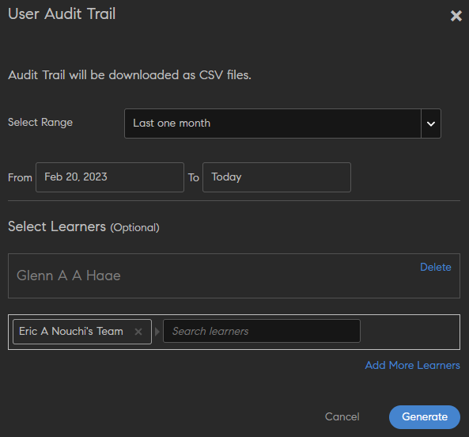
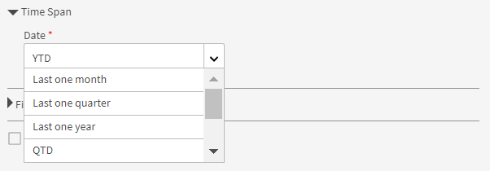

# Rapporten

Lees meer over de rapporten die in de Learning Manager-toepassing aan de beheerdersrol zijn gekoppeld.

Met Adobe Learning Manager kunt u meerdere rapporten aanmaken om leeractiviteiten te volgen, monitoren en beheren. De activiteiten van de studenten worden automatisch gevolgd en in de database vastgelegd. Manager- en beheerderrapporten worden vanuit de database gegenereerd.

## Overzicht {#overview}

Het proces voor het genereren van rapporten is vergelijkbaar voor beheerder en manager. Managers kunnen rapporten van hun ondergeschikten bekijken, terwijl beheerders alle organisatiebrede rapporten kunnen bekijken.

Rapporten worden in een dashboard verzameld. Een rapport moet in een dashboard bestaan. Er bestaat standaard een **[!UICONTROL standaarddashboard]** op de rapportpagina. Elk rapport dat door u wordt toegevoegd, gaat naar dit standaarddashboard. Als u rapporten aan afzonderlijke dashboards wilt toevoegen, gebruikt u de vervolgkeuzepijl en kiest u **[!UICONTROL Rapport]** toevoegen. Raadpleeg de sectie Dashboards op deze pagina voor meer informatie over het maken van dashboards.

## Rapporttypen {#typesofreports}

Adobe Learning Manager ondersteunt vier belangrijke rapporttypen, zoals voltooiing, bestede tijd, vaardigheden en effectiviteit. U kunt de volgende rapporttypen gebruiken om rapporten van meer dan 300 variaties te genereren:

* Statistieken levering cursus voor studenten
* Rapport over effectiviteit van cursussen
* Rapport gebaseerd op vaardigheden van student
* Inschrijvingstatistieken voor studenten van leerprogramma
* Bestede leertijd door studenten
* Aantal studenten
* Voltooiing certificering

## Dashboard Gebruikersactiviteit {#useractivitydashboards}

Bekijk een overzicht van alle gebruikersactiviteiten op het platform in de loop van de tijd. Gebruikersgroepen configureren en filters toepassen.

Het dashboard Gebruikersactiviteit geeft de activiteit van de gebruikers in het account weer. De drie rapporten die worden vermeld, zijn:

* **Geregistreerde gebruikers:** dit rapport biedt informatie over het aantal gebruikers dat zich elke week in uw account heeft geregistreerd. Voor accounts met de licentie Maandelijkse actieve eenheden toont het rapport in plaats daarvan de MAE-eenheden.

* **Rapport voor gebruikersbezoeken:** dit rapport biedt informatie over het aantal gebruikers dat dagelijks toegang heeft tot het platform. Er is ook een maandrapport beschikbaar.

* **Rapport over de bestede leertijd:** dit rapport biedt dagelijks informatie over de leertijd die is besteed in het platform. Er is ook een maandrapport beschikbaar.

### Geregistreerde gebruikers {#registeredusers}

Learning Manager registreert het aantal gebruikers dat wekelijks in het systeem wordt geregistreerd. Beheerders kunnen dit rapport bekijken om het geregistreerde aantal gebruikers op die dag van de week te begrijpen. Geregistreerd aantal dat eenmaal is opgeslagen voor een week verandert niet. Vandaar dat het historische geregistreerde aantal niet gerelateerd is aan de huidige groep studenten in het systeem.

Dit rapport bevat informatie over het aantal gebruikers dat wekelijks in uw account wordt geregistreerd.

Voor accounts met de licentie Maandelijkse actieve eenheden toont het rapport in plaats daarvan de MAE-eenheden.

*Rapport van geregistreerde gebruikers*

***Voor accounts met maandelijkse toegangseenheden:***

**Rapport met maandelijks actieve gebruikers**

Dit rapport toont het aantal studenten dat maandelijks op het leerplatform actief is. De gebruiker wordt geacht actief te zijn gedurende de maand als hij/zij een van de hier genoemde leeracties uitvoert. Ze worden op dezelfde manier als de maandelijkse actieve eenheden geteld.

Het maandelijks actieve aantal dat eenmaal is geteld en opgeslagen voor een maand verandert niet. Vandaar dat het getoonde historische aantal niet is gerelateerd aan de huidige groep studenten in het systeem.

### Gebruikersbezoeken {#uservisits}

Dit rapport toont het totale aantal studenten dat toegang heeft tot het systeem in een dag- of maandperiode. Ook surfen op het leerplatform zonder dat leermateriaal wordt gebruikt, wordt beschouwd als toegang tot het leerplatform. Dit helpt de beheerder om de totale groep van gebruikers die toegang hebben tot het systeem te begrijpen. Op de eerste van de maand registreert Learning Manager het totaal aantal gebruikers dat in de vorige maand toegang had tot het platform. Ook worden de gegevens van de gebruikersgroep voor deze gebruikers vastgelegd.

Alleen gebruikersgroepen die door de beheerder zijn geconfigureerd, worden geregistreerd. Dit stelt beheerders in staat om ook een filter toe te passen op gebruikersgroepen voor historische maandelijkse gegevens. Let op: wanneer de configuratie van gebruikersgroepen wordt gewijzigd en Learning Manager in eerdere maanden geen gegevens voor deze gebruikersgroep heeft vastgelegd, kan Learning Manager de gegevens voor deze nieuw geconfigureerde gebruikersgroepen voor de afgelopen maanden niet weergeven.

Dit rapport bevat gebruikers die toegang hebben tot het platform met behulp van alle indelingen, zoals web, mobiele app, aangepaste headless-oplossingen enz. De gebruiksgrafiek van de apparaat-app vermeldt specifiek alleen de gebruikers die toegang hebben tot het platform via de apparaat-app van Learning Manager. Dit helpt beheerders bij het identificeren van het gebruik van de mobiele app in hun account.

*Rapport gebruikersbezoek*

### Rapport met bestede leertijd {#learningtimespentreport}

Hier ziet u een twee-assige lijndiagram dat de totale leertijd voor alle studenten over een periode van 12 maanden laat zien. De tweede as vertegenwoordigt de mediane tijd die een persoon besteedt aan leren.

De tijd die wordt besteed aan verschillende leerobjecten, zoals leerprogramma&#39;s en certificeringen, wordt berekend voor het volgende:

* Zelfstandige cursus met statische en interactieve inhoud
* Activiteitscursussen met url.
* Weekendsessies met de weekendvlag ingeschakeld.
* VC-verbindingssessie waarbij de aanwezigheid automatisch wordt gemarkeerd.
* De tijd die wordt besteed aan verschillende leerobjecten, zoals leerprogramma&#39;s en certificeringen
* xAPI-instructies voor een xAPI-activiteitscursus.

U kunt de grafiek verder exporteren als een Excel-spreadsheet.

Er is een filter beschikbaar om de configuratie van de gebruikersgroep te kiezen, wat zal helpen bij het weergeven van de gegevens met betrekking tot de verschillende gebruikersgroepen.

De geselecteerde datum- en gebruikersgroepfilter wordt toegepast op alle relevante grafieken in het dashboard.

>[!NOTE]
>
>Voor rapporten over **[!UICONTROL Gebruikersbezoeken]** en **[!UICONTROL Bestede leertijd]** zijn de weergegeven standaardgegevens (wanneer er geen gebruikersgroep is geconfigureerd) voor het gehele account.

## Dashboard met trainingsinhoud {#trainingcontentdashboard}

Het dashboard met trainingsinhoud biedt inzicht in de trainingen die beschikbaar zijn op het platform. U kunt populaire trainingen bekijken of alle beschikbare trainingen volgen.

### Trainingsrapport {#trainingsreport}

Dit rapport bevat informatie over de totale hoeveelheid trainingen die maandelijks op het platform (in gepubliceerde staat) beschikbaar zijn. Het geeft een indicatie van het aantal trainingen dat in de loop van de tijd wordt aangeboden.

*Trainingsrapport*

### Rapport over actieve trainingen {#activetrainingsreport}

Dit rapport bevat informatie over de trainingen die actief zijn in het geselecteerde tijdsbestek. Actieve trainingen zijn trainingen waarvoor wordt ingeschreven, die worden weergeven in de speler of die in de gegeven periode worden voltooid.

Voor actieve trainingen zijn gegevens van alle interne groepen van de hoofdgebruiker (met beheerdersrol) beschikbaar voor selectie wanneer er geen configuratie van de gebruikersgroep is uitgevoerd. Naast de gebruikersgroepen van de hoofdgebruiker kunt u indien nodig nog 10 andere gebruikersgroepen configureren.

*Actief trainingsrapport*

>[!NOTE]
>
>De gegevens worden niet zoals verwacht weergegeven wanneer **[!UICONTROL alle gebruikers]** en **[!UICONTROL 12 maanden]** filters zijn geselecteerd, maar de gegevens worden weergegeven wanneer u Alle interne gebruikersgroep] selecteert **[!UICONTROL .**

<table>
 <tbody>
  <tr>
   <td>
    
<b>Referentie</b>
</td>
   <td>
    
<b>Metrische gegevens</b>
</td>
   <td>
    
<b>Beschrijving</b>
</td>
  </tr>
  <tr>
   <td>
    
1
</td>
   <td>
    
Startverhouding (%)
</td>
   <td>
    
Verhouding tussen het aantal studenten dat met de cursus is begonnen en het aantal inschrijvingen.
</td>
  </tr>
  <tr>
   <td>
    
2
</td>
   <td>
    
Voltooiingsverhouding (%)
</td>
   <td>
    
Verhouding tussen het totaal aantal gebruikers dat de cursus heeft voltooid en het totaal aantal gebruikers dat met de cursus is begonnen. 
</td>
  </tr>
  <tr>
   <td>
    
3
</td>
   <td>
    
Feedback student
</td>
   <td>
    
Gemiddelde van alle ontvangen L1-feedback-reacties op een schaal van 1 tot 10, afgerond op het dichtstbijzijnde gehele getal. 
</td>
  </tr>
  <tr>
   <td>
    
4
</td>
   <td>
    
Feedback manager
</td>
   <td>
    
Gemiddelde van alle ontvangen L3-feedbackreacties op een schaal van 1 tot 5, afgerond op het dichtstbijzijnde gehele getal. 
</td>
  </tr>
 </tbody>
</table>

Het trainingsrapport heeft twee extra kolommen:

1. Gemiddelde sterwaardering van een cursus.
1. Het aantal studenten dat de cursus heeft beoordeeld.
1. Ingesloten pad
1. Ingesloten pad-ID
1. Ingesloten cursus-ID

>[!NOTE]
>
>De start- en voltooiingsverhouding, de feedback van de student en de manager worden niet beïnvloed door de toegepaste filters. De filters hebben alleen invloed op de inschrijving, de weergave en de voltooiing.

>[!NOTE]
>
>Voor beide rapporten (Trainingsinhoud, Gebruikersactiviteit) kunt u maximaal 10 gebruikersgroepen configureren. Het kan tot 24 uur duren voordat de verwerking is voltooid en de nieuw geconfigureerde filters beschikbaar zijn.

## Dashboard met overzicht van leermateriaal {#dashboards}

### Dashboardrapporten genereren

>[!INFO]
>
>In deze training leert u hoe u dashboardrapporten genereert op basis van de database.    

Als u de training niet kunt starten, schrijf dan naar <almacademy@adobe.com>.

Hier vindt u een overzichtsrapport van alle leeractiviteiten in het platform. Op deze pagina vindt u de volgende samenvattingsinformatie voor het team en externe profielen van de geselecteerde rootgebruiker. U kunt ook een tijdbereik selecteren:

* Overzicht van leermateriaal in de vorm van inschrijvingen, weergaven en voltooiingen
* Topvaardigheden
* Overzicht van compatibiliteit

*Overzichtsgrafieken*

Als er interne beheerders op basisniveau zijn, worden deze achter elkaar weergegeven.

Alle externe profielen worden weergegeven na de interne profielen (gebruikers op intern basisniveau).

Als een extern profiel een manager heeft, wordt de managerhiërarchie weergegeven in de **[!UICONTROL vervolgkeuzelijst Gegevens weergeven voor]** . De gebruiker wordt weergegeven in de managerhiërarchie op alle pagina&#39;s met gegevens (overzicht van het leren, compatibiliteit en vaardigheidsstatus)

Zo niet, dan worden alle gegevens van alle individuele gebruikers weergegeven in de lijst.

Klik op **[!UICONTROL Details]** van het leeroverzicht voor gedetailleerde informatie over inschrijvingen van verschillende interne teams.

*Details van het leeroverzicht*

Wanneer u op een inschrijving klikt, ziet u de studenten voor elke manager en de inschrijving voor welke leerobjecten. U kunt ook de details van de voortgang en voltooiing van elke leerling bekijken.

*lerenden die aan een manager zijn toegewezen*

Klik op een team en exporteer het rapport als csv-bestand. Een beheerder kan het rapport voor elke gebruikersgroep of individuele gebruiker exporteren door de gebruikersgroep of individuele gebruiker te selecteren en vervolgens gegevens te exporteren uit de **[!UICONTROL vervolgkeuzelijst Actie]** .

U ziet ook een staafdiagramweergave van de vaardigheden die worden uitgevoerd en die zijn bereikt. U kunt vaardigheden toevoegen/verwijderen die u in de grafiek wilt opnemen.

*Gestapeld staafdiagram voor skillstatus*

### Nalevingsdashboard

**Adobe Learning Manager** biedt een nalevingsdashboard aan alle beheerders en managers. Beheerders kunnen een compatibiliteitsdashboard maken en dit delen met managers. Managers kunnen het nieuwe gedeelde dashboard in hun app bekijken en kunnen gemakkelijk bijhouden of de teamleden voldoen aan een bepaalde training. Met het nalevingsdashboard kunnen beheerders aangepaste nalevingscursussen in specifieke categorieën categoriseren (bijvoorbeeld Sales, Marketing en Juridisch). Aangepaste compatibiliteitscategorieën worden mogelijk gemaakt door **[!UICONTROL cataloguslabels]**.

_Compatibiliteitsdashboard - beheerdersweergave_

Beheerders kunnen ook de compatibiliteitsstatus voor het team van elke manager controleren door Ga naar nalevingsdashboard ]**te**[!UICONTROL  selecteren. Beheerders kunnen individueel of met een groep een reeks trainingen delen met managers. Dit helpt managers om eenvoudig bij te houden of hun teamgenoten voldoen aan de opgegeven training.

#### Workflow voor beheerders

##### Aangepaste nalevingslabels maken

Een compatibiliteitslabel is een type cataloguslabel dat cursussen,leerpaden/certificeringen categoriseert als een compatibiliteitstype.
Ga als volgt te werk om een aangepast compatibiliteitslabel te maken:

1. Ga in de app Beheerder naar **[!UICONTROL Instellingen]** > **[!UICONTROL Algemeen]**.
1. Selecteer **[!UICONTROL de optie Type]** aangepaste compatibiliteit om het label voor aangepaste compatibiliteit in te schakelen.

   
   _Aangepaste compatibiliteit inschakelen_

   >[!NOTE]
   >
   >Dit nieuwe cataloguslabel is geïntroduceerd om de cursussen, leerpaden en certificeringen te categoriseren als een compatibiliteitstype. Om de **[!UICONTROL optie Aangepaste compatibiliteitstype]** in te schakelen, moet u eerst de **[!UICONTROL optie Cataloguslabel]** tonen op dezelfde pagina inschakelen.

1. Ga naar **[!UICONTROL Instellingen]** > **[!UICONTROL cataloguslabel]** en selecteer het **[!UICONTROL type]** Compatibiliteit.
1. Typ de waarden (bijvoorbeeld Juridisch of Verkoop) in het **[!UICONTROL tekstvak Waarde]** en selecteer **[!UICONTROL Waarde]** toevoegen.

   
   _Waarden toevoegen voor aangepaste compatibiliteit_

1. Selecteer **[!UICONTROL Opslaan]**.

>[!NOTE]
>
>De auteur moet deze nalevingslabels toevoegen tijdens het maken/bewerken van de cursussen in de app. Zie [Compatibiliteitslabels toevoegen aan een cursus/leerpad/certificering](/help/migrated/authors/feature-summary/courses.md#add-compliance-labels-to-courselearning-pathcertification).

##### Een compatibiliteitsdashboard maken en delen

Ga als volgt te werk om een compatibiliteitsdashboard te maken en te delen:

1. Ga naar **[!UICONTROL Rapporten]** > **[!UICONTROL leeroverzicht]**.
1. Selecteer in het **[!UICONTROL gedeelte Nalevingsdashboard]** de optie **[!UICONTROL Delen met managers]**.
1. Selecteer **[!UICONTROL het dashboard]** Voor delen en selecteer de gemaakte labels in het **[!UICONTROL vervolgkeuzemenu Aangepaste compatibiliteit]** .

   
   _Selecteer het type Compatibiliteit_

1. Typ en selecteer de naam van de manager in het **[!UICONTROL tekstvak Delen met]** .
1. Selecteer **[!UICONTROL Delen]** om het dashboard naar de geselecteerde manager te verzenden.

>[!NOTE]
>
>Als u het nieuwe dashboard deelt, wordt het bestaande dashboard in de app van de geselecteerde manager overschreven. Beheerders kunnen het zojuist gedeelde dashboard bekijken.

<!--In the final visualization, you can check the compliance status of learners, and take appropriate action.

Also, an Admin can view individual training data in the **[!UICONTROL Compliance Dashboard]**.

For instance, the Administrator has identified three trainings to track compliance. Learning Manager provides the compliance snapshot for all three trainings at once.

Now an Admin can click on any training and quickly view the compliance for the selected training.

*View Compliance dashboard*

You can also see the compliance status for each internal team.

Click the link **[!UICONTROL Compliance Status Details]** on the bottom of the visualization. 

You can see that, for a team, the number of learners in the team are violating or honoring the learning compliance.

*Compliance status of a team*

### Share training with managers

Learning Manager offers compliance dashboard to all Administrators and Managers. Managers find it very useful to track compliance of their team members for a particular training. At the same time, Administrators would like all Managers to add compliance trainings to their dashboard and track it. 

In Learning Manager, the **[!UICONTROL Share with Managers]** workflow allows Administrators to share training with Managers, so that they can get added to a manager's Compliance Dashboard. Thus, Managers do not need to take any action and can start tracking compliance immediately. 

An Administrator can share a set of training courses with managers individually or with a group. This sharing can help a manager easily track the compliance of his/her team for the specified training.

The Administrator can "push" a default list of compliance training to be viewed in the manager's compliance dashboard.

### Share training

1. In **[!UICONTROL Reports]** > **[!UICONTROL Learning Summary]**, scroll down, and click the tab **[!UICONTROL Share with Managers]**. 

   
   *Share training with managers*

1. To add training or multiple training, click **[!UICONTROL Share more]**.   

1. In the **[!UICONTROL Share with Managers]** dialog, choose the training(s) and the manager(s).

   
   *Select training to share with managers*

1. Click **[!UICONTROL Share]**.

The training is now shared with the specified manager.

### View training

In the list of shared training, click **[!UICONTROL View]**. You can view the training that is assigned to a manager or some managers.

### Withdraw training

1. To withdraw training from a manager, click **[!UICONTROL Withdraw]**.  

1. Click **[!UICONTROL Proceed]**. This withdraws previously shared training from the Manager's compliance dashboard.-->

## Aangepaste rapporten

Beheerders kunnen specifieke rapporten genereren met behulp van de aangepaste sjabloon die beschikbaar is in de **[!UICONTROL sectie Rapporten]** .

### Voorbeeldrapporten {#samplereports}

Op het tabblad **[!UICONTROL Voorbeeldrapporten]** worden enkele indicatieve rapporten weergegeven die op voorbeeldgegevenspunten zijn gebaseerd. Bekijk deze rapporten om een idee te krijgen van de verschillende soorten rapporten boordevol informatie die u kunt genereren met behulp van uw accountgegevens.

### Dashboardrapporten {#dashboardreports}

Een dashboard is een verzameling rapporten. Rapporten kunnen naar keuze worden gegroepeerd in een dashboard. Klik op dit tabblad om alle tekenborden weer te geven die u hebt gemaakt. In de **[!UICONTROL vervolgkeuzelijst View Dashboard]** kunt u het standaardbord of een dashboard dat u hebt gemaakt selecteren.

### Excel-rapporten {#excelreports}

Via het tabblad **[!UICONTROL Excel-rapporten]** kunt u rapporten in XLS-indeling exporteren.

De volgende rapporttypen zijn beschikbaar om te downloaden.

* Cursusrapporten
* Studenttranscripten
* Aankondigingenrapport
* Taakhulpenrapport
* Audittrail van inhoud
* Audittrail van gebruiker
* Aanmeldings-/toegangsrapport
* Gamificationtranscripten
* Gamification Audittrail

### Studenttranscripten {#learnertranscripts}

In de Studenttranscripten in Excel-rapporten worden de kolommen Punten vereist en Punten verdiend in decimale getallen weergegeven.

### Cursusrapporten {#coursereports}

Als beheerder kunt u rapporten voor cursussen downloaden. Volg deze stappen:

1. Open **[!UICONTROL rapporten]** > **[!UICONTROL aangepaste rapporten]** > **[!UICONTROL Excel-rapporten]** > **[!UICONTROL cursusrapporten]**.
1. Het dialoogvenster **[!UICONTROL Cursusrapporten]** verschijnt. Selecteer de cursus waarvoor u het rapport wilt ophalen en klik op **[!UICONTROL Weergeven]**.

   
   *Cursusrapporten*

1. U wordt omgeleid naar de cursuspagina. Je kunt de quizscore exporteren per gebruiker en per vraag op basis van elke inschrijving door het specifieke type inschrijving te kiezen.
1. Selecteer **[!UICONTROL Quizscore exporteren]** om het rapport te exporteren. Het dialoogvenster **[!UICONTROL Rapportaanvraag genereren]** verschijnt. Klik op **[!UICONTROL OK]** om te bevestigen.

   
   *Aanvraag voor een rapport genereren*

   >[!NOTE]
   >
   >Het geëxporteerde quizscorerapport bevat de scoregegevens voor elke poging als de optie voor meerdere pogingen voor de module is geconfigureerd.

### Studenttranscripten {#LearnerTranscripts-1}

Adobe Learning Manager stelt de beheerders van een organisatie in staat om de transcripten van de studenten te genereren. Het rapport Studenttranscript bevat het volgende:

1. Studenttranscript: dashboard Leeractiviteit
1. Skill: Skill Dashboard
1. Dashboard Naleving

In de Studenttranscripten in Excel-rapporten worden de kolommen Punten vereist en Punten verdiend in decimale getallen weergegeven.

Zie [Transcripties voor studenten voor informatie over het genereren van het transcript van een leerder](learner-transcripts.md) en meer informatie.

### Aankondigingenrapporten {#announcementsreports}

Als beheerder kunt u een rapport genereren van alle aankondigingen die u verzendt. Het rapport bevat details over het volgende:

* Type aankondiging
* Naam van aankondiging
* Datum van aankondiging
* Status van aankondiging
* Naam van student

Volg een van deze stappen om een rapport te downloaden:

1. Open **[!UICONTROL Rapporten]** > **[!UICONTROL Aangepaste rapporten]** > **[!UICONTROL Excel-rapporten]** > **[!UICONTROL Rapport aankondigingen]**. Het dialoogvenster **[!UICONTROL Rapportaanvraag genereren]** wordt geopend. Klik op OK.
1. [!UICONTROL **Aankondigingen**] > [!UICONTROL **handelingen**] > [!UICONTROL **exportrapport**].

   
   *Rapport over aankondigingen*

1. U kunt een rapport extraheren voor een specifieke aankondiging door onder het instellingenpictogram op Rapport ]**exporteren te**[!UICONTROL  klikken.

   
   *Rapporteren voor specifieke aankondigingen*

### Taakhulpenrapport {#jobaidsreport}

Taakhulpen zijn trainingsinhoud waartoe een studenten toegang hebben zonder dat zij zich moeten inschrijven voor een specifiek leerobject zoals een cursus of leerprogramma. Beheerders kunnen het Taakhulpenrapport extraheren en downloaden.

Het geëxtraheerde rapport bevat informatie over het volgende:

* Naam
* Type taakhulp
* Status van taakhulp (gepubliceerd of ingetrokken)
* Inschrijvingsdatum
* Voltooiingsdatum
* Downloaddatum
* Naam van student
* Naam van manager
* Gemaakt door

Voer een van de volgende handelingen uit om een rapport te downloaden:

* Open  **[!UICONTROL rapporten]** > **[!UICONTROL aangepaste rapporten]** > **[!UICONTROL Excel-rapporten]** > **[!UICONTROL rapporten]** over banenhulp. Het dialoogvenster **[!UICONTROL Rapportaanvraag genereren]** wordt geopend. Klik op **[!UICONTROL OK]**.
* Open **[!UICONTROL Banenhulp]** > **[!UICONTROL acties]** > **[!UICONTROL exportverslag]**.

*Rapport jobhulpmiddelen*

* U kunt ook een rapport voor een specifieke taakhulp extraheren door onder het instellingenpictogram op **[!UICONTROL Rapport exporteren]** te klikken.

*Verslag voor specifieke banensteun*

### Taakhulpenrapport

Nadat u Rapport ]**taakhulpmiddelen hebt geselecteerd**[!UICONTROL  in de lijst, ziet u twee opties:

*taakhulpmiddelen downloaden Job Aids USer Enrollment Rapport*

**Alle hulpmiddelen voor** banen: als het aantal banenhulpmiddelen in de rekening minder dan 10 miljoen bedraagt, bevat het gegenereerde rapport informatie over inschrijvingsinformatie van alle functiehulpmiddelen. Dit wordt de standaardselectie. Als het aantal rijen groter is dan 10 miljoen, wordt er een foutmelding weergegeven en moet u de vereiste werkhulpmiddelen handmatig selecteren.

**Geselecteerde taakhulpmiddelen**: Als u deze optie selecteert, kunt u de job aids invoeren waarvoor u het rapport wilt genereren. U kunt maximaal 10 banensteun selecteren. Adobe Learning Manager controleert of het aantal hulp voor banen groter is dan 10 miljoen.

*Selecteer een job aid*

**Rapport jobhulpmiddelen**

Als u deze optie selecteert, worden de details gedownload van alle taakhulpen die in het systeem aanwezig zijn, samen met de bijbehorende metadata en training.

Het gedownloade rapport bestaat uit de volgende velden:

* Naam van taakhulp
* Taal/talen
* Id
* Type
* Duur (minuten)
* Status
* Publicatiedatum (tijdzone UTC)
* Gemaakt, op naam
* Gemaakt, op e-mailadres
* Gemaakt, op unieke ID van gebruiker
* Catalogus(sen)
* Leerpad(en)
* Cursus(sen)
* Tag(s)
* Vaardigheid/vaardigheden

**Rapport over het inschrijven van jobhulpmiddelen**

Het inschrijvingsrapport bevat details over inschrijving van gebruikers en andere informatie.

Het gedownloade rapport bestaat uit de volgende velden:

* Naam van taakhulp
* Type
* Status
* Datum ingeschreven (tijdzone UTC)
* Voltooide datum (UTC-tijdzone)
* Downloaddatum (UTC-tijdzone)
* Naam van student
* E-mail
* Unieke ID van gebruiker
* Naam van manager
* E-mailadres van manager
* Unieke ID van managergebruiker
* Toegewezen op naam
* Toegewezen op e-mail
* Toegewezen op unieke ID van gebruiker
* Gemaakt op naam
* Gemaakt op e-mail
* Gemaakt op unieke ID van gebruiker
* Taakcode
* Nieuw veld
* Profiel

### Rapporten voor audittrail van inhoud {#contentaudittrailreports}

Gebruik de generator voor het rapport van het **[!UICONTROL audittrail]** om een rapport te genereren met alle wijzigingen en bewerkingen die tijdens de levensduur van een cursus in het systeem zijn aangebracht. Het gegenereerde rapport bevat de volgende informatie.

* Object-ID
* Objectnaam
* Objecttype
* Wijzigingstype
* Beschrijving
* Verwezen object-ID
* Verwezen objectnaam
* Gewijzigd door gebruikersnaam
* Gewijzigd in gebruikers-ID
* Datum gewijzigd (UTC-tijdzone)

In de **kolom Type** wijziging worden de volgende gegevens weergegeven:

| Wijzigingstype | Beschrijving |
| --- | --- |
| Creëer | Gemaakte cursus |
| Certificering toevoegen | Certificering toegevoegd aan catalogus |
| Certificering verwijderen | Certificering verwijderd uit catalogus |
| Inhoud toevoegen | Inhoud toegevoegd aan module |
| Cursus toevoegen | Cursus toegevoegd aan leerpad |
| Cursus verwijderen | Cursus verwijderd uit leerpad |
| Aangepast label toevoegen | Aangepast label toegevoegd aan catalogus |
| Aangepast label verwijderen | Aangepast label verwijderd uit catalogus |
| Verwijderen | Catalogus verwijderd |
| Banensteun toevoegen | Banenhulp toegevoegd aan Catalogus |
| Werkhulp verwijderen | Werkhulp verwijderd uit catalogus |
| Leerpad toevoegen | Leerpad toegevoegd aan catalogus |
| Leerpad verwijderen | Leerpad verwijderd uit catalogus |
| Moduleinhoud toevoegen | Module toegevoegd aan Cursus (sectie Inhoud) |
| Moduleinhoud verwijderen | Module verwijderd uit cursus (sectie Inhoud) |
| Gepubliceerd | Een cursus- of leerpad die is gepubliceerd en toegevoegd aan de standaardcatalogus |
| Gepubliceerd | Cursus opnieuw gepubliceerd |
| Bron toevoegen | Bron toegevoegd aan Cursus |
| Bron verwijderen | Bron verwijderd uit Cursus |
| Gearchiveerd | Cursus teruggetrokken |
| Gedeelde catalogus toevoegen | Catalogus gedeeld met catalogus |
| Gedeelde catalogus verwijderen | Catalogus delen verwijderd uit catalogus |
| Update voor gedeelde catalogus | Status voor het delen van catalogi: actief |
| Update | Cursus of leerpad bijgewerkt |
| Gebruikersgroep toevoegen | Gebruikersgroep toegevoegd aan catalogus |
| Gebruikersgroepen verwijderen | Gebruikersgroep verwijderd uit catalogus |

Informatie over metagegevens wordt niet in het gegenereerde rapport opgenomen.

Volg deze stappen om een rapport Audittrail van cursus te genereren.

1. Selecteer **[!UICONTROL Rapporteren]** > **[!UICONTROL Excel-rapporten]** > **[!UICONTROL Cursus audittrail]**. Het dialoogvenster **[!UICONTROL Audittrail van inhoud]** verschijnt.

   
   *Audittrail van een cursus*

1. Selecteer de cursus, het leerprogramma en de certificering waarvoor u het rapport wilt downloaden. Indien niet gespecificeerd, worden standaard alle rapporten gedownload.
1. Selecteer een datumbereik voor het rapport en klik op **[!UICONTROL Genereren]**.
1. Het rapport wordt gegenereerd en u ontvangt bericht wanneer het rapport Audittrail van inhoud klaar is. U kunt het rapport downloaden.

### Rapporten Audittrail van gebruiker {#useraudittrailreports}

De audittrail van de gebruiker legt de levenscyclus van gebruikers, gebruikersgroepen en zelfregistratieprofielen vast. Toevoeging, verwijdering en wijziging in Manager van gebruiker worden allemaal vastgelegd. Maken en verwijderen van zelfregistratieprofielen wordt vastgelegd. U kunt ook pauzeren en de zelfregistratie hervatten.

U kunt Toevoegen, Inschakelen, Uitschakelen, Pauzeren of Hervatten voor Externe profielen. Voor zelfregistratie kunt u Toevoegen, Verwijderen, Pauzeren of Hervatten. CSV-uploads worden ook vastgelegd.

1. Selecteer  **[!UICONTROL Rapporteren > Excel-rapport > Gebruikerstrail]**. Het dialoogvenster Gebruikers audittrail wordt weergegeven.
1. Het dialoogvenster Audittrail van gebruiker verschijnt. Selecteer het datumbereik in het pop-upmenu. U kunt een rapport voor de laatste week of laatste maand genereren, of een aangepaste datum selecteren.

   
   *Audittrail van gebruikers*

1. Klik op **[!UICONTROL Genereren]** om het rapport te genereren.

Er zijn twee filters in het dialoogvenster **[!UICONTROL Rapport Audittrail van gebruiker]**.

**Filter Datumrage:** kies het datumbereik waarvoor u het rapport wilt genereren. Er zijn drie opties:

* Laatste week
* Laatste maand
* Aangepaste datum

Selecteer het filter Studenten: zoek naar een gebruiker of gebruikersgroep.

Het geëxporteerde rapport bevat gegevens van de gebruikers die aan beide opgegeven zoekcriteria voldoen.

*Audittrail van gebruikers*

>[!NOTE]
>
>Wanneer een vaardigheid wordt toegewezen of verwijderd, kan deze worden bijgehouden voor het controlerapport van de gebruiker voor zowel toegewezen als verwijderde vaardigheid.

### Rapport over extensieconfiguratie

Dit rapport biedt informatie over de configuratiedetails van alle toegevoegde native extensies, inclusief de activeringsstatus. Leer hoe u een extensierapport kunt downloaden, zie [Extensierapport downloaden](native-extensibility.md#download-extension-report).

### xAPI-activiteitsrapport

Dit rapport bevat de gegevens van alle xAPI-instructies die tijdens xAPI-activiteitsmodules zijn vastgelegd en gegenereerd.

Ga als volgt te werk om dit rapport te downloaden:

1. Selecteer  **[!UICONTROL Rapport > Excel-rapport > xAPI-activiteitenrapport]**. Het dialoogvenster xAPI-activiteitenrapport wordt weergegeven.
1. Selecteer het datumbereik in het pop-upmenu. U kunt een rapport voor de laatste week of laatste maand genereren, of een aangepaste datum selecteren.
1. Selecteer de leerlingen en de activiteit in de vervolgkeuzelijst.
1. Selecteer **[!UICONTROL Genereren]** om het rapport te genereren.

### Gamificationrapporten {#gamification}

Beheerders kunnen gamificationtranscript in CSV-indeling downloaden. U kunt het rapport voor afzonderlijke gebruikers of gebruikersgroepen downloaden. De gebruikersnaam, het e-mailadres van de gebruiker, de UUID van de gebruiker, het totaal aantal gescoorde punten, het opsplitsen van punten, de naam van de groepen waarin de gebruiker speelt, de naam van de manager en de actieve veldwaarden worden allemaal opgehaald in het rapport. Beheerders kunnen dit rapport gebruiken om de ranglijsten van gebruikers op organisatieniveau of voor een specifieke groep te evalueren en te begrijpen.

1. Selecteer Rapporteren > Excel-rapport > Gamification-rapport.

   
   *Gamification-rapport*

1. Het dialoogvenster Gamificationtranscripten verschijnt. Selecteer studenten aan de hand van hun Naam, Profiel, Gebruikersgroepen, E-mail-ID of UUID.

   
   *Dialoogvenster Gamification-transcripten*

1. Klik op  **[!UICONTROL Genereren]** om het rapport te genereren.

   Nadat u het rapport van een gebruiker hebt gegenereerd, moet u in staat zijn om de huidige en bereikte informatie voor alle gebruikers (intern, extern of verwijderd) in het account te exporteren. U kunt ook de datums controleren waarop een student de niveaus heeft behaald:

   * Datum brons behaald
   * Datum zilver behaald
   * Datum goud behaald
   * Datum platina behaald

   Deze kolommen bevatten de datums waarop het niveau voor het eerst werd behaald. In de kolom **[!UICONTROL Huidig niveau]** wordt het huidige niveau van de leerling weergegeven.

   Wanneer de beheerder de gamification herstelt, worden alle punten van de student overeenkomstig hersteld.

### Rapport van het audittrail met gamification {#gamification-audit-trail}

Dit rapport bevat de geschiedenis en de redenen voor de gamificationpunten van leerlingen die voor elke regel worden verdiend.

### Het rapport downloaden

1. Selecteer de URL van de gamification-audittrail.
1. Selecteer het datumbereik in het **pop-upvenster van de audittrail van de Gamification-audittrail** .
1. Selecteer **Genereren**.

Het rapport wordt gedownload als een CSV-bestand. Het bestand bevat de volgende kolommen:

* Naam
* E-mail/UUID,
* Status
* Actie
* Punten
* Saldo punten
* Regel/taak
* Regel/subtaak,
* Regel-/taakdetails
* Type
* Naam
* Instance NameDate Achieved (UTC-tijdzone)
* Regel/begintijd voor taken
* Eindtijd regel/taak

### Inschrijvings- en uitschrijvingsrapport {#enrollmentandunenrollmentreport}

Beheerders en beheerders kunnen een rapport extraheren van de studenten die zijn ingeschreven en niet zijn ingeschreven. Als beheerder kunt u alle studenten, beheerders of managers zien die zijn in- of uitgeschreven voor een instantie van een cursus, leerprogramma of certificering en het rapport exporteren. Terwijl u als manager alleen een rapport van uw teamleden kunt ophalen. Als manger kun je de verwijderde studenten of je eigen naam in de Manager-applicatie niet zien als een ingeschreven of niet-ingeschreven leerling.

Ga als volgt te werk om een rapport te downloaden: Open het  **[!UICONTROL rapport Cursus/Leerprogramma/Certificering]** > **[!UICONTROL Studenten]** > **[!UICONTROL Rapport Actie]** > **[!UICONTROL Exporteren]**.

*Rapport voor uit schrijven*

### Feedbackrapport {#feedback-report}

Als beheerder kunt u nu zowel feedback van de student (L1) als van de manager (L3) krijgen voor geselecteerde trainingen voor een bepaalde periode.

U kunt de gegevens exporteren vanuit de gebruikersinterface of via PowerBI-connector voor meer diepgaande analyse.

De L1- en L3-feedbackrapporten bieden de mogelijkheid om een geconsolideerd feedbackrapport te downloaden voor de L1- en L3-reacties voor geselecteerde trainingen voor een **jaar** of voor maximaal 10 geselecteerde trainingen voor elke periode.

Meld u aan als beheerder, klik op **[!UICONTROL Rapporten]** > **[!UICONTROL Aangepaste rapporten]** en klik in de lijst met rapporten op **[!UICONTROL Feedbackrapport]**.

*Feedbackrapport downloaden*

Als u op de download klikt nadat u de filters hebt geselecteerd, ontvangt u een melding dat u het rapport in CSV-indeling moet downloaden.

Het gedownloade rapport bevat gegevens zoals de naam en het type van de training, de instantienaam, de naam en het e-mailadres van de gebruiker, het type feedback: L1 of L3, de datums van de feedback die voor nieuwe gegevens is verzonden.

Voor de bestaande gegevens voorafgaand aan de implementatie van deze functie wordt de LO-voltooiingsdatum weergegeven, de LO-voltooiingsdatum, de L1-feedbackvraag Werkelijke tekst in eigen tempo en tekst in de klassenruimte in verschillende kolommen, de respectievelijke L1-feedbackreactie, de naam en het e-mailadres van de Manager, de L3-feedbackwaarde en de ingediende datum, Actieve velden.

U kunt de gegevens ook exporteren vanuit de gebruikersinterface of naar Power BI, dat alle trainingen ondersteunt voor elk datumbereik voor meer diepgaande analyse

### Trainingsrapport {#training-report}

Learning Manager ondersteunt trainingsrapport dat beheerders in staat stelt om trainingsgegevens en de bijbehorende metagegevens zoals auteur, gepubliceerde datum, vaardigheden, cataloguslabels, enz. te downloaden.

Klik in de beheerdersapp op **[!UICONTROL Rapporten]** > **[!UICONTROL aangepaste rapporten]** > **[!UICONTROL Excel-rapporten]** > **[!UICONTROL Trainingsrapport]**.

U kunt rapporten voor het volgende downloaden:

* Geselecteerde trainingen (maximaal 10) - Selecteert één of meerdere trainingen tegelijk (tot 10) van elke catalogus
* Trainingen in de geselecteerde catalogus (maximaal 5) - (selectie van catalogi is beschikbaar tot maximaal vijf catalogi).
* Alle trainingen - (alle trainingen in het account)

*Trainingsrapport downloaden*

In de sectie Geavanceerde opties zijn de volgende opties beschikbaar:

* Cursustoewijzingen toevoegen aan leerprogramma/certificering
* Informatie over moduleniveau toevoegen

Nadat u de filters hebt geselecteerd en op Downloaden hebt geklikt, ontvangt u een melding dat u het rapport in CSV-indeling moet downloaden.

Het rapport zal de volgende velden bevatten:

*Catalogusnaam, trainingstype, trainings-id, unieke id van training, trainingsnaam, subtraining, modules, training- of moduleduur, indeling, status van de training, vaardigheden, auteur, laatste gepubliceerde datum, laatste voltooide datum, aantal inschrijvingen van cursusleider, aantal gestarte aantallen voltooiing, Gemiddelde L2-score, Avg L3-score, L1-reacties ontvangen, L3-reacties ontvangen, L3-reacties ontvangen, cataloguslabels &amp; tags.*

*Aanvullende opties*

### Overzichtsrapport van de sessie {#session-summary-report}

Het sessieoverzichtsrapport bevat alle sessies die zijn gepland voor een leerling binnen een opgegeven datum.

Op deze manier kan de beheerder alle gegevens voor virtuele sessies en klaslokalen exporteren die onder het opgegeven datumbereik vallen. De beheerder kan het sessierapport ook exporteren met betrekking tot specifieke trainingen of instructeurs.

Hiermee krijgt de beheerder inzicht in de maandelijkse geplande sessies en kan hij of zij zien wat de planning en de reeds geleverde sessies zijn van docenten.

Klik als beheerder op **[!UICONTROL Aangepaste rapporten]** > **[!UICONTROL Rapport met sessiesamenvatting]**.

Kies in het volgende dialoogvenster het datumbereik en de training of docent voor een overzicht.

*Rapport met sessiesamenvatting*

De gedownloade csv bevat de volgende velden:

* Startdatum en -tijd
* Einddatum en -tijd

* Modulenaam
* Duur sessie (in minuten)
* Aantal licenties
* Locatie
* Instantienaam
* Cursusnaam
* Cursus-id
* Naam docent
* E-mailadres docent
* Inschrijvingsaantal
* Type sessie
* Wachtlijstlimiet
* Aantal wachtlijsten
* E-mailadressen gebruikers wachtlijst
* Informatie over locatie
* Regio locatie

### Gebruiksrapport van docent

Dit rapport bevat de tijd (in minuten) die een docent dagelijks besteedt aan het lesgeven van toegewezen sessies. Het rapport kan worden gedownload voor een periode van drie maanden vanaf de geselecteerde startdatum.

Als u het rapport wilt downloaden, klikt u op **[!UICONTROL Rapporten]** > **[!UICONTROL aangepaste rapporten]** > Rapport over ]**gebruik van**[!UICONTROL  cursusleider.

Selecteer een docent of meerdere docenten en het datumbereik.

*over het gebruik van cursusleider downloaden Rapport over het gebruik van cursusleider downloaden*

Het gedownloade rapport bevat de volgende velden:

* Naam van docent
* Docent-ID
* Competentieniveau
* Datums als kolommen. Als de docent wordt gebruikt om een datum, wordt het aantal sessies vermeld. Als de docent niet wordt gebruikt op een dag, is de waarde nul.

Het rapport bevat records voor drie maanden vanaf de geselecteerde maand.

Laat het veld Docent leeg om records van alle docenten op te halen.

Ook kan een aangepaste beheerder met toestemming voor het genereren van rapporten dit rapport ophalen.

### Rapport Audittrail van gebruiker

Dit rapport legt informatie vast over de studenten die zijn overgeschakeld van instanties, &#39;van instantie&#39; naar &#39;naar instantie&#39;, geschakeld op tijd, datum enzovoort.

Selecteer de studenten of een gebruikersgroep.

Als u het rapport wilt downloaden, klikt u op **[!UICONTROL Rapporten]** > **[!UICONTROL aangepaste rapporten]** > **[!UICONTROL rapport over]** gebruikerscontroletrail.

*Rapport van het gebruikers audittrail downloaden*

### Rapport leerplan

Dit rapport bevat details van alle leerplannen in een account, zoals verwante gebruikersgroepen, status en triggerinformatie.

Het rapport bevat het volgende:

* Naam van het leerplan
* Type (treedt wanneer op)
* Training (voltooid)
* Vaardigheid (behaald)
* Datum (op datum)
* Actie
* Status, gemaakt door
* Datum gemaakt
* Datum laatst gewijzigd
* Gebruikersgroep (van toepassing op)
* Gebruikersgroep (toevoegen aan)
* Inschrijven na
* Type(n) leerelement(en)
* Leerelement(en)
* Instantie(s) van leerelement
* Leerelement
* Voltooiingsdatum
* Herinnering leerelement
* Scope-catalogus
* Scope-gebruikersgroep

## E-mailabonnementen {#emailsubscriptions}

U kunt uw favoriete rapporten als e-mail ontvangen door u hierop te abonneren.

### E-mailabonnementen instellen

>[!INFO]
>
>In deze training leert u hoe u e-maillidmaatschappen instelt voor dashboardrapporten.    

Als u de training niet kunt starten, schrijf dan naar <almacademy@adobe.com>.

Klik **[!UICONTROL op de pagina Rapporten]** op het  **[!UICONTROL tabblad Lidmaatschap]** . De abonnementspagina voor rapporten verschijnt.

Als u de rapportnaam in de vervolgkeuzelijst wilt selecteren, typt u de naam van het rapport in het veld Rapporten. Kies in de lijst hoe vaak u e-mail wilt ontvangen. U kunt het onderwerp van de e-mail toevoegen en een alternatief e-mailadres opgeven.

U kunt abonnementen bewerken en verwijderen.

## Historische rapporten

Historische rapporten in Adobe Learning Manager (ALM) verwijzen naar de rapporten die de historische gegevens en activiteiten binnen het leerplatform vastleggen. Deze rapporten bieden inzicht in eerdere activiteiten van studenten, trainingsinhoud, prestaties van gebruikersgroepen en andere relevante gegevens. Met historische rapporten kunnen beheerders de voortgang en effectiviteit van leerinitiatieven in de loop van de tijd volgen, controleren en analyseren.

### Rapporten over toegang tot cursussen

De toegangsrapporten bieden informatie over het opnieuw bekijken van elke cursus.

Ga als volgt te werk om dit rapport te downloaden:

1. Ga naar **[!UICONTROL Rapporten]** > **[!UICONTROL aangepaste rapporten]** > **[!UICONTROL historische rapporten]**.
1. Selecteer **[!UICONTROL Rapport voor cursustoegang]**. Het dialoogvenster Aanvraag voor een rapport genereren wordt geopend.
1. Selecteer het jaar en kwartaal in de vervolgkeuzelijst.
1. Selecteer **[!UICONTROL Genereren]**.

### Aanmeldings-/toegangsrapporten

De rapporten voor aanmelding/toegang bieden informatie over gebruikersaanmeldingsgegevens en -toegang. U kunt een rapport genereren met gegevens van drie maanden tegelijk.

Ga als volgt te werk om dit rapport te downloaden:

1. Ga naar **[!UICONTROL Rapporten]** > **[!UICONTROL aangepaste rapporten]** > **[!UICONTROL historische rapporten]**.
1. Selecteer **[!UICONTROL het rapport]** Aanmelden/Toegang. Het dialoogvenster Aanvraag voor een rapport genereren wordt geopend.
1. Selecteer het jaar en kwartaal in de vervolgkeuzelijst.
1. Selecteer **[!UICONTROL Genereren]**.

## Een dashboard maken {#createadashboard}

1. Als u uw eigen borden wilt maken, klikt u op Dashboard toevoegen aan de rechterkant van de pagina.

   
   *Dashboards toevoegen*

1. Geef de naam en beschrijving van het dashboard op.
1. Als u het dashboard wilt delen met een Manager, kiest u deze in **[!UICONTROL het veld Delen met]** . U kunt alle normale selectiecriteria voor deze bewerking gebruiken.
1. Klik op **[!UICONTROL Opslaan].**

U kunt het recent gemaakte board bekijken op het tabblad **[!UICONTROL Dashboard Rapporten]**.

Als u rapporten aan uw bestuur wilt toevoegen, klikt u op de vervolgkeuzelijst in de rechterbovenhoek van het venster en klikt u op **[!UICONTROL Rapport]** toevoegen. Het rapport dat u op deze manier maakt, wordt aan uw dashboard gekoppeld.

>[!NOTE]
>
>De rapporten die u maakt door op Toevoegen in de rechterbovenhoek van de pagina Rapporten te klikken, worden toegevoegd aan uw standaarddashboard.

## Gedeelde dashboards {#shareddashboards}

Gedeelde boards zijn een verzameling rapporten die met u zijn gedeeld door andere gebruikers binnen uw organisatie. Alle rapporten die u aan een gedeeld board toevoegt, worden automatisch gedeeld met andere gebruikers die toegang hebben tot dat board.

Je kunt het bord op twee manieren delen:

* Door gebruikers in te voeren in **[!UICONTROL het veld Delen met]** waarmee het dashboard is gedeeld.
* Kies Dashboard bewerken in de vervolgkeuzelijst en voer gebruikersgegevens in om het dashboard te delen.

>[!NOTE]
>
>Een manager kan de rapporten van zijn teamleden alleen bekijken vanaf een gedeeld dashboard.

## Downloads {#downloads}

Het geëxporteerde werkblad met dashboardrapporten biedt gedetailleerde informatie in plaats van een rapportoverzicht. Het gedownloade rapport volgt de indeling van een studenttranscript.

## Rapporten maken {#report}

1. Klik op Rapporten in het linkerdeelvenster. De pagina Rapportoverzicht wordt geopend.

   >[!NOTE]
   >
   >Standaard verschijnen er ten minste drie voorbeeldrapporten op het tabblad voor voorbeeldboards. U kunt de voorbeeldrapporten alleen bekijken om een idee te krijgen hoe u ze maakt en aanpast.

1. Klik rechtsboven op de pagina op **[!UICONTROL Toevoegen]**.
1. In het dialoogvenster **[!UICONTROL Rapport toevoegen]** kunt in de keuzelijst Type een van de vooraf gedefinieerde rapporten of de optie **[!UICONTROL Aangepast]** kiezen. Als u een vooraf gedefinieerd rapport selecteert, ziet u dat het formulier vooraf is ingevuld. U kunt bepaalde velden wijzigen. Klik daarna op **[!UICONTROL Opslaan]**. Het rapport wordt dan aan uw standaarddashboard toegevoegd.

   
   *Rapport maken*

   In **[!UICONTROL Rapporttype]** kunt u een vooraf gedefinieerde set rapporten of aangepaste waarden kiezen. U kunt de volgende rapporten bekijken als onderdeel van een vooraf gedefinieerde set rapporten:

   * Toegewezen en bereikte vaardigheden
   * Ingeschreven en afgeronde cursussen
   * Effectiviteit van cursussen
   * Ingeschreven en voltooide leerprogramma&#39;s
   * Bestede leertijd per cursus
   * Bestede leertijd per kwartaal
   * Voltooiing certificering

1. Kies de **[!UICONTROL Y-as]** voor uw rapport uit de vervolgkeuzelijst. Voor een aantal van de geselecteerde criteria kunt u een of meer statussen kiezen bij de optie Statussen. Zo kunnen de statussen voor het primaire criterium voor de inschrijvingsstatistieken van een cursus Voltooid, Niet voltooid en Ingeschreven zijn. De gegevens van het primaire bereik worden in het rapport als staafdiagrammen weergegeven.

   
   *Assen voor rapporten*

1. Kies de criteria/het bereik van de secundaire **[!UICONTROL Y-as]** voor uw rapport in de vervolgkeuzelijst. Zo kunt u voor de inschrijvingsoptie van een leerprogramma een of meer statussen uit de vervolgkeuzelijst Statussen kiezen. De gegevens van het secundaire bereik worden in het rapport als lijndiagrammen weergegeven.
1. Kies de gewenste X**-as**-criteria voor uw rapport uit de vervolgkeuzelijstopties. Als de x-as als datum is gekozen, hebt u de optie om uw x-ascriterium op dag, maand, kwartaal en jaar te groeperen.
1. Kies in de sectie Tijdspanne de toepasselijke optie in de vervolgkeuzelijst. De beschikbare opties zijn:

   * Laatste maand
   * Kwartaal
   * Jaar
   * Kwartaal tot heden (laatste 90 dagen)
   * Jaar tot heden (laatste 365 dagen)
   * Datumbereik. Geef waarden op in de datumvelden **[!UICONTROL Van]** en **[!UICONTROL Tot]**.

   

1. **Sectie Filters**

   Filters verschijnen in het dialoogvenster Rapport toevoegen onderaan op basis van de rapporttypen die u hebt gekozen. Hieronder worden enkele van de voornaamste filters genoemd.

   * **Manager:** U kunt een van de managers kiezen op basis van hiërarchie. Voor sommige managers kunnen er ondergeschikte managers zijn met meerdere medewerkers die aan deze ondergeschikte managers moeten rapporteren.
   * **Profiel:** Kies de benoeming van uw werknemer. Dit is handig wanneer u rapporten van werknemers op basis van hun profiel/benoeming bekijkt. Bijvoorbeeld, computerwetenschapper, ingenieur.
   * **Gebruikersgroep:** Kies de gebruikersgroep waarop u de rapporten wilt filteren. Learning Manager haalt de gebruikersgroepen op die zijn gedefinieerd voor uw account vanuit de Gebruikers-functie.
   * **Inhoud:** U kunt uw rapport op een willekeurige cursus filteren door deze in de vervolgkeuzelijst te selecteren.

   Vouw deze sectie uit en kies de vereiste filters.

   
   *Filters kiezen*

1. Klik op **[!UICONTROL Opslaan]** om het maken van een rapport te voltooien.

   
   *Voorbeeldrapport*

## Een rapport bewerken {#editareport}

Klik in het rapport op de vervolgkeuzepijl en selecteer de optie **[!UICONTROL Rapport]** bewerken.

*Een rapport bewerken*

Breng de benodigde wijzigingen aan in het rapport. Klik op **[!UICONTROL Opslaan]** om de wijzigingen op te slaan.

## Een rapport naar een dashboard verplaatsen {#moveareporttoadashboard}

Kies deze optie om het huidige rapport naar een bestaand dashboard te verplaatsen. Om het rapport te verplaatsen klikt u op de optie **[!UICONTROL Naar dashboard verplaatsen]**.

*Een rapport naar een dashboard verplaatsen*

Kies het dashboard waarnaar u het rapport wilt verplaatsen en kies **[!UICONTROL Verplaatsen]**.

## Een kopie van een rapport maken {#createacopyofareport}

Als u een kopie van het rapport wilt maken, selecteert u de optie **[!UICONTROL Een kopie]** maken.

*Een kopie van een rapport maken*

Kies het dashboard waarnaar u het rapport wilt kopiëren. Klik op **[!UICONTROL Kopiëren]** om het rapport te kopiëren.

## Een rapport verwijderen {#deleteareport}

Als u een rapport wilt verwijderen, kiest u de optie **[!UICONTROL Rapport verwijderen]**. Nadat u het rapport hebt verwijderd, kan het niet meer worden hersteld. Het proces is onomkeerbaar. Ga voorzichtig te werk bij het verwijderen van een rapport.

*Een rapport verwijderen*

## Een rapport downloaden {#downloadareport}

Als u het rapport wilt downloaden, kiest u de optie **[!UICONTROL Rapport downloaden]**.

*Een rapport downloaden*

## Het formaat van een rapport wijzigen {#resizeareport}

U kunt de grootte van uw rapporten veranderen in 1×1(medium) en 1×2(groot). Dit geeft u een overzichtelijkere weergave van uw rapporten. U kunt ook gemakkelijk pannen en zoomen in de rapporten.

## Filters {#filters}

Filters verschijnen in het dialoogvenster **[!UICONTROL Rapport toevoegen]** onderaan op basis van de rapporttypen die u hebt gekozen. Hieronder worden enkele van de voornaamste filters genoemd.

**Manager** U kunt een van de managers kiezen op basis van hiërarchie. Voor sommige managers kunnen er ondergeschikte managers zijn met meerdere medewerkers die aan deze ondergeschikte managers moeten rapporteren.

**Profiel** Kies de benoeming van uw werknemer. Dit is handig wanneer u rapporten van werknemers op basis van hun profiel/benoeming bekijkt. Bijvoorbeeld, computerwetenschapper, ingenieur.

**Gebruikersgroep** Kies de gebruikersgroep waarop u de rapporten wilt filteren. Learning Manager haalt de gebruikersgroepen op die zijn gedefinieerd voor uw account vanuit de Gebruikers-functie.

**Cursus** U kunt uw rapport filteren op basis van elke cursus door deze te kiezen in de vervolgkeuzelijst.

*Een rapport filteren*

Boven de legenda voor het diagram staat een zoomvak. Plaats de cursor op het vak, klik en sleep de dwarsbalk over het gedeelte van het zoomvak waarop u wilt inzoomen.

U kunt de secundaire y-aswaarden als een lijn over de diagrambalken weergeven. In het bovenstaande voorbeeld ziet u de waarden voor Effectiviteit als een grijze lijn over het diagram.

## Gebruikersgroeprapporten {#user-group-reporting}

Volg hoe gebruikersgroepen zoals afdelingen, externe partners en rollen presteren in vergelijking met andere gebruikersgroepen of ten opzichte van andere leerdoelen.

### Gebruikersgroepen {#usergroups}

Als u rapporten wilt genereren op basis van gebruikersgroepen, kiest u **[!UICONTROL Gebruikersgroep]** in de x-as in de lijst met vervolgkeuzelijstopties, zoals hieronder weergegeven.

*Rapporten van gebruikersgroepen*

Als u een gebruikersgroep wilt kiezen, typt u de naam van de groep. U ziet de voorgestelde groepen die worden weergegeven afhankelijk van de ingevoerde naam. Zodra u een lijst met groepen ziet, kiest u de vereiste gebruikersgroep.

U kunt ook meerdere groepen kiezen met behulp van automatisch aangevulde zoeksuggesties.

Als u meerdere gebruikersgroepen hebt geselecteerd en dit rapport opslaat en genereert, wordt het rapport gegenereerd met alle gebruikersgroepen in een staafdiagram naast elkaar op de x-as.

Met dit gebruikersgroeprapport kunt u de prestaties van een afdeling/divisie/rol vergelijken met die van een andere om hun leerprestaties te evalueren.

### Aangepaste gebruikersgroepen/gebruikersattributen {#customusergroupsuserattributes}

U kunt ook aangepaste gebruikersgroepen aanmaken met de functie Gebruikers/Gebruikersgroepen toevoegen in Learning Manager. Nadat u gebruikersgroepen hebt gemaakt, kunt u rapporten genereren voor die aangepaste gebruikersgroepen met behulp van een lijst van attributen zoals locatie en branche.

Kies in de x-as de optie gebruikerskenmerk en selecteer het kenmerk in het **** vervolgkeuzemenu selecteren ernaast. Als u een aangepast gebruikersgroeprapport op basis van deze kenmerken wilt maken, moet u ook de juiste gebruikersgroep in het filter kiezen.

## Rapporten weergeven {#viewingreports}

Op de pagina Rapporten kunt u alle rapporten bekijken. U kunt elk rapport minimaliseren door rechtsboven in het rapport op het minteken (-) te klikken. Klik op het plusteken (+) om uw rapport opnieuw weer te geven.

## Snelle weergave met verschillende datums {#quickviewwithdifferentdates}

U kunt het datumbereik/de waarde voor elk rapport en elke weergave snel wijzigen voor een andere datum zonder het rapport te wijzigen en op te slaan. Klik op het bewerkpictogram (zoals weergegeven met een pijl in de onderstaande illustratie) naast het datumbereik, zoals QTD, dat het afgelopen jaar duurt. Kies de nieuwe waarde in de vervolgkeuzelijst en klik op het vinkje om de wijziging te bevestigen. U kunt de wijziging annuleren door op het kruisje (x) te klikken.

>[!NOTE]
>
>De gebruikte datumwaarden om het rapport te bekijken, zijn tijdelijk. Deze weergave van het rapport wordt niet gedownload wanneer u de downloadoptie kiest. Deze weergave is slechts een tijdelijke weergave.

*Aantal leerlingen weergeven*

## Snelle weergave met verschillende managers {#quickviewwithdifferentmanagers}

Als er meerdere managers aan u rapporteren, kunt u de rapporten voor elke manager snel weergeven. Selecteer de naam van de manager in de vervolgkeuzelijst om een uniek rapport voor elke manager weer te geven.

>[!NOTE]
>
>De gebruikte managerwaarden om het rapport te bekijken, zijn tijdelijk. Deze weergave van het rapport wordt niet gedownload wanneer u de downloadoptie kiest. Deze weergave is slechts een tijdelijke weergave.

## Cursusrapporten weergeven {#viewcoursereports}

### Cursusrapporten genereren

>[!INFO]
>
>In deze training leert u hoe u cursusrapporten kunt exporteren en e-maillidmaatschappen voor deze rapporten kunt instellen.    

Als u de training niet kunt starten, schrijf dan naar <almacademy@adobe.com>.

U kunt de specifieke rapporten van elke cursus bekijken door de onderstaande stappen te volgen:

1. Klik op **[!UICONTROL de koppeling Cursusrapporten]** weergeven op het tabblad Mijn dashboards op de pagina Rapporten.\
   Er verschijnt een pop-upvenster. Er verschijnt een tekstinvoerveld waarin je de vereiste cursus kunt invoeren en waar voorgestelde cursusnamen in de vervolgkeuzelijst worden weergegeven. Kies de cursus uit de getoonde lijst.

   

   *Cursusrapporten weergeven*

1. Selecteer de gewenste cursus in de vervolgkeuzelijst en klik op Weergeven.
1. U wordt omgeleid naar de pagina met quizscores voor de geselecteerde cursus om het cursusspecifieke rapport te bekijken.

**Bewerken/Verplaatsen naar dashboard/Kopie maken/Verwijderen/Formaat van rapport wijzigen**

Klik op het pijltje van de vervolgkeuzelijst rechtsboven in elk rapport om de opties Bewerken/Verplaatsen naar dashboard/Kopie maken/Verwijderen/Formaat van rapport wijzigen weer te geven.

*Bewerken/Verplaatsen naar bestuur/Een kopie maken/Rapporten verwijderen/De grootte van rapporten wijzigen*

**[!UICONTROL Bewerken Klik op Opnieuw]** instellen als u tijdens het wijzigen van de gegevens wilt terugkeren naar de oorspronkelijke waarden. Klik op Opslaan na het wijzigen van de waarden.

**[!UICONTROL Naar dashboard Verplaatsen naar dashboard]** U kunt het huidige rapport verplaatsen naar een ander dashboard, dat is gekozen in de lijst met dashboards.

**[!UICONTROL Een kopie]** maken U kunt het rapport kopiëren naar hetzelfde of een ander dashboard dat is gekozen in de lijst met dashboards.

**[!UICONTROL Verwijderen]** : Klik op Verwijderen om het rapport te verwijderen. Er verschijnt een waarschuwings-/bevestigingsbericht voordat u het rapport kunt wissen.

**[!UICONTROL Formaat wijzigen]** U kunt de grootte van uw rapporten wijzigen in de formaten 1×1 (normaal) en 2×2 (groot).

## Rapporten voor collega-account genereren en weergeven {#generateandviewreportsforpeeraccount}

Als beheerder kunt u niet alleen rapporten voor uw account genereren, u kunt ook rapporten genereren collega-accounts die u hebt ingesteld en deze bekijken.

Wanneer u een collega-account met een andere gebruiker hebt opgezet, kunt u de rapporten voor dat collega-account bekijken op de pagina **[!UICONTROL Rapporten]**. Wanneer u een rapport maakt, vindt u het veld **[!UICONTROL Account selecteren]**. Selecteer in de vervolgkeuzelijst met alle collega-accounts waaraan u bent gekoppeld, het account waarvoor u de gedeelde rapporten wilt bekijken.

Als bij het maken van een peer-account de optie Catalogus delen niet was geselecteerd, kunt u dat peer-account niet weergeven in deze lijst.

*Rapporten voor peer-accounts beheren*

1. Selecteer de x-as en y-as voor dit rapport. Selecteer vervolgens de datum voor dit rapport.
1. Let op het veld Filters, de knop Gedeelde catalogi is automatisch ingeschakeld. Dit is verplicht. Als Gedeelde catalogi niet is ingeschakeld, betekent dit dat u geen rapporten voor het collega-account kunt genereren of bekijken.
1. Selecteer in de vervolgkeuzelijst onder Gedeelde catalogi de gedeelde catalogus waarvoor u het rapport wilt bekijken.
1. Klik op [!UICONTROL **Opslaan**].

   
   *Gedeelde catalogus voor peer-account selecteren*

1. Nadat u op Opslaan ]**hebt geklikt**[!UICONTROL , kunt u de grafische weergave van uw rapporten bekijken in uw standaarddashboard. Vanaf dit dashboard kunt u het rapport verder filteren op manager voor het specifieke collega-account.
1. Als er van uw kant wijzigingen zijn in de catalogus, worden de wijzigingen onmiddellijk weerspiegeld in de rapporten en het dashboard gegenereerd door de collega. Wanneer de collega echter de catalogus wijzigt, verschijnen de wijzigingen niet automatisch op uw dashboard.
1. Als u wilt dat uw dashboard automatisch wordt bijgewerkt, moet uw collega u een nieuw collega-aanvraag sturen.

   >[!NOTE]
   >
   >Managers kunnen geen collegarapporten bekijken.

## Veelgestelde vragen {#frequentlyaskedquestions}

+++Hoe kan ik een aangepast dashboard delen met een manager?

Voer bij het maken van een dashboard de naam en beschrijving in. Voer de naam van de manager in het veld **[!UICONTROL Delen met]** in om met managers te delen.

*Een dashboard delen*
+++
