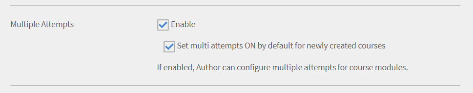

# Instellingen

Lees meer over de instellingen van het Learning Manager-account die u kunt configureren als beheerder.

U kunt uw profielinstellingen voor beheerder wijzigen en uw accountinstellingen bijwerken. Uw profielgegevens bekijken, profielfoto toevoegen/wijzigen en wijzigen **[!UICONTROL Over mij]** inhoud. Update uw bedrijfsinformatie, stel aanmeldingsmethoden voor gebruikers in en stel integratie via accountinstellingen in.

## Uw Adobe Learning Manager configureren

Deze training legt de basisbeginselen vast van instellingen op accountniveau.

Als u de training niet kunt starten, schrijft u naar <almacademy@adobe.com>.

## Accountinstellingen {#accountsettings}

Klik op **[!UICONTROL Instellingen]** in het linkerdeelvenster.

**Basisinformatie (Bedrijfsinformatie)**

Klikken **[!UICONTROL Wijzigen]** op de pagina en de instellingen voor land, tijdzone, landinstelling en boekjaar bewerken.

**Contact met beheerder configureren**

Als u de e-mailadressen van de ondersteuningsbeheerders voor uw organisatie wilt toevoegen of wijzigen, kunt u deze configureren door op **[!UICONTROL Algemeen]** in het linkerdeelvenster te klikken. Klikken **[!UICONTROL Wijzigen]** grenzend aan **[!UICONTROL E-mailadres voor ondersteuning]** en voeg de e-mail-ID toe. E-mail wordt naar deze beheerders verzonden wanneer de student klikt **[!UICONTROL Contact opnemen met beheerder]** in de voettekst van de pagina.

Voeg extra e-mail-ID&#39;s toe met een puntkomma als scheidingsteken.

**Aanmeldingsmethoden** - Beheerders kunnen de modus kiezen waarmee uw interne of externe gebruikers toegang hebben tot het account.

* **Interne gebruikers:** Voor interne gebruikers kunt u Adobe ID of Single Sign-On instellen als aanmeldingsmodus.
* **Externe gebruikers:** Voor externe gebruikers kunt u Adobe ID, Single Sign-On of Learning Manager ID instellen.

Indien u dat wenst, kunnen externe gebruikers zich bij dit account aanmelden nadat ze hun gebruikersnaam en wachtwoord voor de Learning Manager hebben gemaakt.

>[!NOTE]
>
>Als er meerdere externe profielen zijn ingesteld, kunnen alle profielen elk type aanmelding hebben. Als Adobe ID bijvoorbeeld als aanmeldingstype is ingesteld, kunnen alle profielen zich alleen met Adobe ID aanmelden. Een profiel kan geen eigen aanmeldingstype hebben.

U kunt de Learning Manager-toepassing openen met behulp van Adobe ID of eenmalige aanmelding. Eenmalige aanmelding is een mechanisme waarmee een gebruiker zich eenmalig kan authenticeren om meerdere keren toegang te krijgen tot meerdere toepassingen. Deze configuratie is niet verplicht voor de organisatie. Als uw organisatie een SAML 2.0 gebaseerde SSO-provider heeft, kunt u deze gebruiken om de Learning Manager-toepassing te configureren. De configuratie is vereist op organisatieniveau en op Learning Manager-niveau. Kiest u voor SSO, neem dan contact op met de Adobe-ondersteuning voor configuratie-instructies.

**Feedback**

Klik op **[!UICONTROL Feedback]** in het linkerdeelvenster om de vragenlijst in te stellen om na afloop van een cursus feedback van studenten te verzamelen. Raadpleeg [cursusfunctie Help-inhoud](courses.md) over het maken van L1- en L3-feedback.

**Meerdere pogingen**

Selecteren **[!UICONTROL Instellingen]** > **[!UICONTROL Algemeen]** > **[!UICONTROL Meerdere pogingen]**.

Als u het selectievakje Meerdere pogingen inschakelt, kunnen auteurs Meerdere pogingen instellen voor interactieve e-learningcursussen of -modules. Als u het tweede selectievakje inschakelt, kunnen beheerders de optie Oneindige pogingen standaard instellen voor nieuwe interactieve e-learningcursussen.

*Schakel het selectievakje Meerdere pogingen in*

**Cursusmoderatie**

Klik in het linkerdeelvenster op **[!UICONTROL Algemeen]** en selecteer de optie Cursusmoderatie om de functie Cursusmoderatie in te schakelen. Zie [Cursusmoderatie](courses.md#main-pars_header_1879001177) om meer te weten te komen over deze functie.

**Discussieboard**

Als u het selectievakje Discussiebord inschakelt, kunnen de studenten en docenten opmerkingen plaatsen voor cursussen via het tabblad Discussie op de pagina Cursussen in de Learner-app. Als de instellingen op cursusniveau echter aangeven dat deze functie niet is geselecteerd, hebben deze instellingen voorrang op de beheerdersinstellingen.

**Studentendashboard**

Klik op Studentendashboard in het linkerdeelvenster. Op deze pagina kunt u de widgets kiezen die u op de pagina Studenten wilt weergeven. Selecteer de widgets die u op de pagina Studenten wilt inschakelen. De widgets die niet zijn geselecteerd, verschijnen niet op de pagina Studenten.

**Adobe Connect**

Klik op **[!UICONTROL Adobe Connect]** in het linkerdeelvenster om het Adobe Connect-account te configureren voor het hosten van virtuele klassikale sessies. Raadpleeg voor meer informatie  [Adobe Connect](adobeconnect-integration.md) Help.

## Algemene instellingen {#general}

Schakel de volgende instellingen in of uit:

<table>
 <tbody>
  <tr>
   <th>
    
<b>Naam</b>

    </th>
   <th>
    
<b>Beschrijving</b>

   </th>
  </tr>
  <tr>
   <td>Cursuseffectiviteit weergeven</td>
   <td>Indien ingeschakeld kunnen studenten de huidige cursuseffectiviteit zien op de cursustegel. Deze functie is alleen beschikbaar voor cursussen. Sterrenclassificatie wordt niet ondersteund voor leerprogramma's of certificaten. Het is beschikbaar voor cursussen en leerprogramma's, maar niet voor certificeringen.</td>
  </tr>
  <tr>
   <td>Cursusmoderatie</td>
   <td>Indien ingeschakeld moeten alle wijzigingen aan cursussen door de beheerder worden goedgekeurd voordat de cursussen zichtbaar worden voor de studenten.</td>
  </tr>
  <tr>
   <td>Discussieboard</td>
   <td>Als u het selectievakje Discussiebord inschakelt, kunnen de studenten en docenten opmerkingen plaatsen voor cursussen via het tabblad Discussie op de pagina Cursussen in de Learner-app. Als de instellingen op cursusniveau echter aangeven dat deze functie niet is geselecteerd, hebben deze instellingen voorrang op de beheerdersinstellingen.</td>
  </tr>
  <tr>
   <td>Meerdere pogingen</td>
   <td>Indien ingeschakeld kan de auteur meerdere pogingen voor cursusmodules configureren.</td>
  </tr>
  <tr>
   <td>De optie Vaardigheden ontdekken</td>
   <td>Indien ingeschakeld kunnen studenten de vaardigheden van collega's en leidinggevenden ontdekken en zich abonneren op de gewenste vaardigheden.</td>
  </tr>
  <tr>
   <td>Zichtbaarheid van vaardigheden/tags</td>
   <td>Geef alle vaardigheden en tags weer aan studenten. U kunt alle vaardigheden en tags weergeven of alleen vaardigheden en tags weergeven die zijn toegewezen of die deel uitmaken van de catalogi die zichtbaar zijn voor de student.</td>
  </tr>
  <tr>
   <td>Unieke leerobject-ID's</td>
   <td>Indien ingeschakeld kan een beheerder of auteur een unieke ID toevoegen per leerobject.</td>
  </tr>
  <tr>
   <td>Filterpanelen weergeven</td>
   <td>
    
Bepaal met welke filterpanelen gebruikers hun zoekresultaten kunnen verfijnen in de Learner-toepassing. De volgende opties zijn beschikbaar:

    <ul>
     <li>Catalogi</li>
     <li>Type</li>
     <li>Indeling</li>
     <li>Duur</li>
     <li>Vaardigheden</li>
     <li>Vaardigheidsniveaus</li>
     <li>Tags</li>
    </ul>
    
Wanneer de student de Learner-app start, in de secties Mijn Leerervaring en Catalogus, kan de leerling de filters in zijn/haar respectievelijke panelen zien.

    
<b>Opmerking: </b>de filters <b>Indeling </b>en <b>Duur </b>zijn standaard uitgeschakeld en zijn niet onmiddellijk na de release zichtbaar voor de studenten. De beheerder moet ze inschakelen.  
</td>
  </tr>
  <tr>
   <td>Cataloguslijst weergeven</td>
   <td>Indien ingeschakeld zien studenten een lijst met alle beschikbare catalogi. Aan de hand hiervan kunnen studenten verfijnen hoe de leerobjecten worden weergegeven.</td>
  </tr>
  <tr>
   <td>Productterminologie</td>
   <td>Learning Manager heeft standaardterminologie die wordt gebruikt in het product. Wijzig de terminologie om aan de behoeften van uw organisatie te voldoen.</td>
  </tr>
  <tr>
   <td>Versie-update van module</td>
   <td>Configureer de standaardinstelling om inhoud bij te werken. De instelling kan voor alle inhoud op de cursuspagina worden gewijzigd.</td>
  </tr>
  <tr>
   <td>Gebruikers automatisch registreren</td>
   <td>Indien ingeschakeld worden nieuw geïmporteerde gebruikers automatisch geregistreerd.  Gebruikers moeten standaard handmatig worden geregistreerd voordat ze Learning Manager kunnen gebruiken.</td>
  </tr>
  <tr>
   <td>Interne gebruikers automatisch verwijderen</td>
   <td>Als dit ingeschakeld is, worden interne gebruikers automatisch verwijderd als ze het systeem gedurende het opgegeven aantal dagen niet gebruiken.  Deze functie is van toepassing op gebruikers die alleen de rol <b>Student</b> hebben.  Om de toegang te herstellen moeten gebruikers contact opnemen met de beheerder. </td>
  </tr>
  <tr>
   <td>Cataloguslabels weergeven</td>
   <td>Indien ingeschakeld kunnen beheerders en auteurs cataloguslabels en waarden instellen en deze koppelen aan leerobjecten.</td>
  </tr>
  <tr>
   <td>Studenten kunnen hun scores bekijken</td>
   <td>Indien ingeschakeld kunnen de studenten hun scores bekijken in het studententranscript</td>
  </tr>
  <tr>
   <td>Overzichtsmail</td>
   <td>
    
Een beheerder kan het sturen van een e-mail aan studenten in- of uitschakelen. De beheerder kan ook de frequentie van de verzonden e-mails regelen.

    <ul>
     <li>Overzichtsmail wordt standaard uitgeschakeld voor <b>actieve accounts</b>; de beheerder kan dit handmatig inschakelen.</li>
     <li>Voor <b>proefaccounts</b> blijft de optie voor overzichtsmail uitgeschakeld. De beheerder kan deze optie niet inschakelen.</li>
    </ul>
    
Als de functie is uitgeschakeld:

    <ul>
     <li>Wordt de optie <b>Overzichtsmail</b> uitgeschakeld.</li>
     <li>Kan een student de gebruikersinstellingen niet zien voor aanmelding voor overzichtsmail.</li>
    </ul>
    
 Als de functie is ingeschakeld, dan:

    <ul>
     <li>Kan de beheerder de optie Overzichtsmail inschakelen en wijzigen.</li>
     <li>Kan een student (niet in de DND-lijst) in de <b>profielinstellingen </b>van de Learner-app ervoor kiezen om zich aan of af te melden voor de overzichtsmail.</li>
    </ul></td>
  </tr>
  <tr>
   <td>Pictogrammen op trainingskaarten inschakelen </td>
   <td>Indien ingeschakeld, kunt u de pictogrammen op trainingskaarten zien in de Learner-app. </td>
  </tr>
  <tr>
   <td>Links in voettekst</td>
   <td>
    
Voeg links of e-mail-ID's toe die als voettekst worden weergegeven.  U kunt maximaal drie voettekstlinks toevoegen.

    
Om de links in de voettekst aan te passen, voert u de volgende stappen uit:

    <ol>
     <li>Klik op <b>Meer toevoegen</b>, voer de naam in, en voer de URL- of e-mail-ID in de opgegeven velden in.  Begin de URL met http:// of https://.</li>
     <li>Om de wijziging voor alle landinstellingen door te voeren, klikt u op <b>Repliceren</b>.  Zo krijgen alle talen de naam en URL.</li>
     <li>Klik op <b>Opslaan</b> om de wijzigingen op te slaan. U ziet een pop-upbericht waarin de wijziging wordt bevestigd.  Nadat u op OK hebt geklikt, worden de pas toegevoegde links in de voettekst ingevuld.</li>
    </ol>
    
Een alternatieve optie is:

    <ul>
     <li>Klik op de knop <b>Herstellen</b> pictogram om de standaardwaarden in het deelvenster <b>Help</b> en <b>Contact opnemen met beheerder</b> velden.</li>
     <li>Pas de link in de voettekst aan voor alle talen.  Klik op de keuzelijst <b>Taal</b>, selecteer de taal en voeg de <b>Naam</b> en <b>URL</b> toe in de opgegeven velden.  Nadat u de wijzigingen hebt opgeslagen, worden de bijgewerkte links in de voettekst weergegeven. </li>
    </ul></td>
  </tr>
  <tr>
   <td>Tijdzone van rapport </td>
   <td>
    
Stel een voorkeur op accountniveau in om het leertranscript te exporteren in de volgende tijdzones:

    <ul>
     <li>UTC (standaard)</li>
     <li>Tijdzonevoorkeur op accountniveau</li>
    </ul>
    
Het Studenttranscript dat met de Jobs API is gedownload, downloadt ook de gegevens in de geselecteerde tijdzone.

    
<b>Opmerking: </b>Onmiddellijk na de release wordt standaard geen wijziging verwacht in het Studenttranscript. Beheerders kunnen deze instelling configureren via Beheer &gt; Instellingen &gt; Algemeen &gt; Tijdzone rapporteren.
</td>
  </tr>
 </tbody>
</table>

<table border="0" cellpadding="0" cellspacing="0" width="1709">
 <tbody>
  <tr>
   <td height="20" width="147">Naam</td>
   <td>Beschrijving</td>
  </tr>
  <tr>
   <td height="20">Cursuseffectiviteit weergeven</td>
   <td>Indien ingeschakeld kunnen studenten de huidige cursuseffectiviteit bekijken op de cursustegel.</td>
  </tr>
  <tr>
   <td height="20">Cursusmoderatie</td>
   <td>Indien ingeschakeld moeten alle wijzigingen aan cursussen door de beheerder worden goedgekeurd voordat de cursussen zichtbaar worden voor de studenten.</td>
  </tr>
  <tr>
   <td height="20">Discussieboard</td>
   <td>Als u het selectievakje Discussiebord inschakelt, kunnen de studenten en docenten opmerkingen plaatsen voor cursussen via het tabblad Discussie op de pagina Cursussen in de Learner-app. Als de instellingen op cursusniveau echter aangeven dat deze functie niet is geselecteerd, hebben deze instellingen voorrang op de beheerdersinstellingen.</td>
  </tr>
  <tr>
   <td height="20">Meerdere pogingen</td>
   <td>Indien ingeschakeld kan de auteur meerdere pogingen voor cursusmodules configureren.</td>
  </tr>
  <tr>
   <td height="20">De optie Vaardigheden ontdekken</td>
   <td>Indien ingeschakeld kunnen studenten de vaardigheden van collega's en leidinggevenden ontdekken en zich abonneren op de gewenste vaardigheden.</td>
  </tr>
  <tr>
   <td height="20">Zichtbaarheid van vaardigheden/tags</td>
   <td>Geef alle vaardigheden en tags weer aan studenten. U kunt alle vaardigheden en tags weergeven of alleen vaardigheden en tags weergeven die zijn toegewezen of die deel uitmaken van de catalogi die zichtbaar zijn voor de student.</td>
  </tr>
  <tr>
   <td height="20">Unieke leerobject-ID's</td>
   <td>Indien ingeschakeld kan een beheerder of auteur een unieke ID toevoegen per leerobject.</td>
  </tr>
  <tr>
   <td rowspan="10" height="191">Filterpanelen weergeven</td>
   <td>Bepaal met welke filterpanelen gebruikers hun zoekresultaten kunnen verfijnen in de Learner-toepassing. De volgende opties zijn beschikbaar:</td>
  </tr>
  <tr>
   <td height="19">Catalogi</td>
  </tr>
  <tr>
   <td height="19">Type</td>
  </tr>
  <tr>
   <td height="19">Indeling</td>
  </tr>
  <tr>
   <td height="19">Duur</td>
  </tr>
  <tr>
   <td height="19">Vaardigheden</td>
  </tr>
  <tr>
   <td height="19">Vaardigheidsniveaus</td>
  </tr>
  <tr>
   <td height="19">Tags</td>
  </tr>
  <tr>
   <td height="19">Wanneer de student de Learner-app start, in de secties Mijn Leerervaring en Catalogus, kan de leerling de filters in zijn/haar respectievelijke panelen zien.</td>
  </tr>
  <tr>
   <td height="20">Opmerking: Filterindeling en Duur zijn standaard uitgeschakeld en worden niet onmiddellijk na de release weergegeven. De beheerder moet ze inschakelen. </td>
  </tr>
  <tr>
   <td height="20">Cataloguslijst weergeven</td>
   <td>Indien ingeschakeld zien studenten een lijst met alle beschikbare catalogi. Aan de hand hiervan kunnen studenten verfijnen hoe de leerobjecten worden weergegeven.</td>
  </tr>
  <tr>
   <td height="20">Productterminologie</td>
   <td>Learning Manager heeft standaardterminologie die wordt gebruikt in het product. Wijzig de terminologie om aan de behoeften van uw organisatie te voldoen.</td>
  </tr>
  <tr>
   <td height="20">Versie-update van module</td>
   <td>Configureer de standaardinstelling om inhoud bij te werken. De instelling kan voor alle inhoud op de cursuspagina worden gewijzigd.</td>
  </tr>
  <tr>
   <td height="20">Gebruikers automatisch registreren</td>
   <td>Indien ingeschakeld worden nieuw geïmporteerde gebruikers automatisch geregistreerd.  Gebruikers moeten standaard handmatig worden geregistreerd voordat ze Learning Manager kunnen gebruiken.</td>
  </tr>
  <tr>
   <td height="20">Interne gebruikers automatisch verwijderen</td>
   <td>Als dit ingeschakeld is, worden interne gebruikers automatisch verwijderd als ze het systeem gedurende het opgegeven aantal dagen niet gebruiken.  Deze functie is van toepassing op gebruikers die alleen de rol Student hebben. Om de toegang te herstellen moeten gebruikers contact opnemen met de beheerder.</td>
  </tr>
  <tr>
   <td height="20">Cataloguslabels weergeven</td>
   <td>Indien ingeschakeld kunnen beheerders en auteurs cataloguslabels en waarden instellen en deze koppelen aan leerobjecten.</td>
  </tr>
  <tr>
   <td height="20">Studenten kunnen hun scores bekijken</td>
   <td>Indien ingeschakeld kunnen de studenten hun scores bekijken in het studententranscript</td>
  </tr>
  <tr>
   <td rowspan="9" height="172">Overzichtsmail</td>
   <td>Een beheerder kan het sturen van een e-mail aan studenten in- of uitschakelen. De beheerder kan ook de frequentie van de verzonden e-mails regelen.</td>
  </tr>
  <tr>
   <td height="19">Voor actieve accounts worden digest-e-mails standaard uitgeschakeld, zodat de beheerder deze handmatig kan inschakelen.</td>
  </tr>
  <tr>
   <td height="19">Voor proefaccounts blijft de optie voor digest-e-mails uitgeschakeld en kan de beheerder deze optie niet inschakelen.</td>
  </tr>
  <tr>
   <td height="19">Als de functie is uitgeschakeld:</td>
  </tr>
  <tr>
   <td height="19">De optie E-mail overzicht wordt uitgeschakeld.</td>
  </tr>
  <tr>
   <td height="19">Kan een student de gebruikersinstellingen niet zien voor aanmelding voor overzichtsmail.</td>
  </tr>
  <tr>
   <td height="19"> Als de functie is ingeschakeld, dan:</td>
  </tr>
  <tr>
   <td height="19">Kan de beheerder de optie Overzichtsmail inschakelen en wijzigen.</td>
  </tr>
  <tr>
   <td height="20">Vanuit de profielinstellingen in de Learber-app kan een student (niet in de DND-lijst) ervoor kiezen om zich in of uit te schrijven voor de digest-e-mail.</td>
  </tr>
  <tr>
   <td height="20">Pictogrammen op trainingskaarten inschakelen</td>
   <td>Indien ingeschakeld, kunt u de pictogrammen op trainingskaarten zien in de Learner-app.</td>
  </tr>
  <tr>
   <td rowspan="8" height="153">Links in voettekst</td>
   <td>Voeg links of e-mail-ID's toe die als voettekst worden weergegeven.  U kunt maximaal drie voettekstlinks toevoegen.</td>
  </tr>
  <tr>
   <td height="19">Om de links in de voettekst aan te passen, voert u de volgende stappen uit:</td>
  </tr>
  <tr>
   <td height="19">1. Klik op Meer toevoegen, voer de naam en de URL- of e-mail-ID in de opgegeven velden in. Begin de URL met http:// of https://.</td>
  </tr>
  <tr>
   <td height="19">2. Klik op Repliceren om de wijziging voor alle landinstellingen te trapsgewijs door te voeren. Zo krijgen alle talen de naam en URL.</td>
  </tr>
  <tr>
   <td height="19">3. Klik op Opslaan om de wijzigingen op te slaan. U ziet een pop-upbericht waarin de wijziging wordt bevestigd.  Nadat u op OK hebt geklikt, worden de pas toegevoegde links in de voettekst ingevuld.</td>
  </tr>
  <tr>
   <td height="19">Een alternatieve optie is:</td>
  </tr>
  <tr>
   <td height="19">Klik op het pictogram Opnieuw instellen om de standaardwaarden in de velden Help en Contact opnemen met beheerder opnieuw in te stellen.</td>
  </tr>
  <tr>
   <td height="20">Pas de link in de voettekst aan voor alle talen.  Klik op de vervolgkeuzelijst Taal, selecteer de taal en voeg de Naam en URL toe in de opgegeven velden. Nadat u de wijzigingen hebt opgeslagen, worden de bijgewerkte links in de voettekst weergegeven.</td>
  </tr>
  <tr>
   <td rowspan="5" height="96">Tijdzone van rapport</td>
   <td> Stel een voorkeur op accountniveau in om het leertranscript te exporteren in de volgende tijdzones:</td>
  </tr>
  <tr>
   <td height="19">UTC (standaard)</td>
  </tr>
  <tr>
   <td height="19">Tijdzonevoorkeur op accountniveau</td>
  </tr>
  <tr>
   <td height="19">Het Studenttranscript dat met de Jobs API is gedownload, downloadt ook de gegevens in de geselecteerde tijdzone.</td>
  </tr>
  <tr>
   <td height="20">Opmerking: er wordt geen wijziging verwacht in het Studenttranscript direct na de release. Beheerders kunnen deze instelling configureren via Beheer &gt; Instellingen &gt; Algemeen &gt; Tijdzone rapporteren.</td>
  </tr>
  <tr>
   <td height="19">Badgr-integratie</td>
   <td>Als dit is ingeschakeld, kunnen de leerlingen hun badges uploaden naar de Badgr-website. In het kader van klantenvoorlichting willen organisaties hun klanten kunnen 'certificeren' en hun een mogelijkheid geven hun certificaten op social media te tonen. Hierdoor wordt de student gemotiveerd een training te nemen en de prestaties met anderen te delen. </td>
  </tr>
  <tr>
   <td height="135">
    
Waardering weergeven
</td>
   <td>
    <ul>
     <li>Als de optie <b>Cursuseffectiviteit</b> is ingeschakeld, kunnen studenten alleen de waarde van de cursuseffectiviteit zien.</li>
     <li>Als de optie <b>Waardering met sterren</b> is ingeschakeld, kunnen studenten alleen de gemiddelde sterrenwaardering weergeven en het aantal studenten dat de cursus heeft beoordeeld. </li>
    </ul>
    
Deze functie is alleen beschikbaar voor cursussen. Waardering met sterren wordt niet ondersteund voor leerprogramma's of certificaten.  <b>Opmerking: </b>Deze wijziging is alleen van invloed op de Learner-app. 

    
Wijzigingen in de instellingen (waardering met sterren/cursuseffectiviteit/waardering weergeven uitschakelen) hebben geen gevolgen voor alle andere apps (beheerder, auteur, manager, aangepaste beheerder, aangepaste auteur). 

    
Voor nieuwe accounts worden de <b>Classificaties tonen</b> sectie heeft de optie <b>Sterrenclassificatie</b> standaard ingeschakeld.

    
Voor bestaande accounts, als het account voorheen de optie <b>Cursuseffectiviteit</b> ingeschakeld, dan de <b>Classificaties tonen</b> sectie wordt ingeschakeld met de optie Cursuseffectiviteit geselecteerd. Als de optie <b>Cursuseffecten</b>s is uitgeschakeld, dan wordt de <b>Classificaties tonen</b> wordt ook uitgeschakeld. Wanneer u <b>Classificaties tonen</b> -sectie is ingeschakeld, de optie <b>Sterrenclassificatie</b> wordt standaard ingeschakeld.
</td>
  </tr>
 </tbody>
</table>

<table>
 <tbody>
  <tr>
   <td>
    
Leerpaden
</td>
   <td>
    
Als de optie <b>Uitgebreide functies van leerpad inschakelen</b> is ingeschakeld, kunnen beheerders leerpaden in leerpaden opnemen en die leerpaden met cursussen combineren. De optie is onomkeerbaar. 
</td>
  </tr>
  <tr>
   <td>
    
Instructeurbeheer 
</td>
   <td>
    
Schakel deze instelling in om de lijst met docenten die kunnen worden geselecteerd bij het aanmaken van sessies in klaslokalen/virtuele klaslokalen te beperken. Alleen gebruikers met de docentbevoegdheid kunnen worden toegewezen als docent aan een sessie. Deze beperking is niet van toepassing op migratieworkflows. 

  </td>
  <tr>
    <td>
      
Vaardigheden importeren

    </td>
    <td>
      
Indien ingeschakeld, kunt u een externe bron kiezen om Vaardigheden te importeren. De vaardigheden voor bestaande leermiddelen worden één keer tijdens de eerste run geïmporteerd in de dataopslag. Voor alle volgende importen van leermiddelen worden Vaardigheden alleen voor nieuw geïmporteerde items geïmporteerd in de opslagplaats voor vaardigheden.
      Als de optie eenmaal is ingeschakeld, is de handeling onomkeerbaar. U kunt een andere bron later niet uitschakelen of wijzigen.
      

    </td>
  </tr>
  </tr>
 </tbody>
</table>

>[!NOTE]
>
>Als de instelling voor het importeren van vaardigheden is ingeschakeld, kan de accountlay-out niet meer worden overgeschakeld op de klassieke weergave. Het overschakelen naar een Klassieke account wordt dus uitgeschakeld nadat de **Vaardigheidsimport** is ingeschakeld.

## Aanbeveling op basis van AI

Learning Manager bevat een gloednieuwe startpagina voor studenten, die modern is, meer contentgestuurd en gepersonaliseerd volgens de voorkeuren van de student. Met aanbevelingen op basis van AI wordt getracht de betrokkenheid van studenten te vergroten en gaten in de kennis vast te stellen en aan te pakken.

Het aanbevelingsalgoritme is zo ontworpen dat dit meerdere inputbronnen verwerkt, waaronder branchegegevens over functies, titels en beschrijvingen die Adobe van haar partners heeft gekregen. Deze gegevens worden vervolgens gebruikt om AI-algoritmen van de Adobe op te leiden, zodat Learning Manager een kaart kan maken die branchespecifieke vaardigheden koppelt aan taaktitels en/of aanwijzingen. Dit wordt dan een input voor het aanbevelingsalgoritme.

Learning Manager gebruikt vervolgens algoritmes van onderwerpmodellen om de trainingsinhoud in een account te analyseren en deze aan de vaardigheden toe te wijzen.

Learning Manager gebruikt ook activiteitsgegevens van collega&#39;s als signaal om het aanbevelingsalgoritme op een gepersonaliseerde manier te sturen. Hier worden activiteiten gebruikt zoals inschrijving, voltooiing en expliciete feedback van studenten.

Om aanbevelingen verder te personaliseren, gebruikt Learning Manager daarnaast nog expliciete en impliciete informatie die van afzonderlijke studenten wordt verzameld. Een student kan zijn of haar interessegebieden expliciet aangeven via inschrijvingen. Learning Manager ontvangt deze informatie ook impliciet op basis van de manier waarop de student de trainingen volgt.

Tot slot kan ook de beheerder het aanbevelingsalgoritme beïnvloeden door met behulp van studentenkenmerken aan te geven waar Learning Manager op moet letten bij het bepalen van groepen van gelijken en door trainingen voor specifieke gebruikersgroepen te markeren.

## Naam van leerobjecten wijzigen {#renaminglearningobjects}

Deze functie is alleen beschikbaar in het Engels.

Beheerders kunnen de naam van leerobjecten in Learning Manager nu wijzigen. De naam van het volgende kan worden gewijzigd.

Module\
Cursus\
Leerprogramma\
Certificering\
Leerplan\
Taakhulp\
Catalogus\
Vaardigheid\
Badge\
Aankondiging\
Mijn leermateriaal\
Leaderboard\
Effectiviteit\
Vereiste\
Voorbereidend werk\
Kerninhoud\
Testout\
Eigen tempo\
Gemengd\
Klaslokaal\
Virtueel klaslokaal\
Activiteit

U kunt dit als volgt doen.

1. Als beheerder klikt u op **[!UICONTROL Instellingen]** > **[!UICONTROL Algemeen]** > **[!UICONTROL Productterminologie]**. De optie voor productterminologie wordt geopend.

   

   *Productterminologie hernoemen*

1. U kunt wijzigingen aanbrengen door een aangepaste sjabloon voor productterminologie te uploaden door het CSV-voorbeeldbestand te downloaden. Als u het voorbeeld-CSV-bestand wilt downloaden, klikt u op de knop **[!UICONTROL Hier downloaden]** gebruiken.
1. Het gedownloade CSV-bestand bevat de naam van de objecten in kolom A. Kies in kolom B de naam die u aan het desbetreffende object wilt toewijzen. Houd er rekening mee dat u de enkelvouds- en meervoudsvorm van de naam moet scheiden door een (|).
1. U kunt ervoor kiezen een of meer rijen te wijzigen. U kunt de ongewijzigde rijen behouden of uit het CSV-bestand verwijderen voordat u ze uploadt.
1. Upload het gewijzigde CSV-bestand en klik op **[!UICONTROL Opslaan]**. Learning Manager wordt ververst om uw wijzigingen te bekrachtigen.
1. Als u de standaardterminologie wilt herstellen, klikt u op **[!UICONTROL Productterminologie herstellen]**.

   

   *Productterminologie herstellen*

## Profielinstellingen {#profilesettings}

1. Klik op de vervolgkeuzepijl in de rechterbovenhoek naast uw foto/account en kies **[!UICONTROL Profielinstellingen]**.
1. In het pop-upvenster kunt u een foto toevoegen/wijzigen door de muis erop te plaatsen en op **[!UICONTROL Bewerken]** in het profielfotogebied.
1. Toevoegen/wijzigen **[!UICONTROL Info]** inhoud door te klikken **[!UICONTROL Bewerken]** naast de afbeelding.
1. Klikken **[!UICONTROL Opslaan].**

## Inhoudsmap {#content-folder}

Learning Manager ondersteunt mappen met persoonlijke inhoud. Een beheerder kan mappen met persoonlijke inhoud configureren en specifieke aangepaste auteurs toegang bieden met behulp van Aangepaste rollen. De standaard auteurs (ook wel volledige auteurs genoemd) hebben echter nog steeds toegang tot alle inhoud in het account. Volledige auteurs hebben daarom toegang tot alle mappen en alle inhoud.

Inhoudsmappen kunnen door beheerders worden geconfigureerd. Alleen nadat ze zijn geconfigureerd worden inhoudsmappen zichtbaar voor de auteurs en krijgen ze de mogelijkheid om de inhoud in een of meerdere mappen te plaatsen.

Als u een inhoudsmap wilt toevoegen, klikt u in de beheerdersapp op **[!UICONTROL Instellingen]** > **[!UICONTROL Map Inhoud]**.

*Instellingen voor inhoudsmappen wijzigen*

### Map

Een map is een opslagplaats van inhoud, meer bepaald een subgroep van de hele inhoudsbibliotheek die in een account beschikbaar is en de volgende eigenschappen heeft:

* Alleen een beheerder kan een map maken, bewerken of verwijderen.
* Een beheerder kan de toegang tot mappen beheren als onderdeel van het definiëren van rollen alleen voor aangepaste beheerders.
* Inhoud **moet altijd aan minstens één map worden gekoppeld**. Om te beginnen wordt alle inhoud gekoppeld aan de openbare map. Die kan later worden gewijzigd.
* Inhoud kan op het moment van het maken aan meerdere mappen worden gekoppeld en kan worden gekopieerd.
* Alle mapnamen moeten binnen het account uniek zijn, anders zal er een fout optreden bij het benoemen van een map.

Mappen beheren alleen de zichtbaarheid van inhoud en maken er geen kopieën van. Daarom worden bewerkingen van de inhoud in alle gekoppelde mappen overgenomen.

### Openbare map

Een openbare map is altijd aanwezig in een account en alle inhoud maakt in het begin deel uit van die map. Later kunnen auteurs inhoud uit die map verplaatsen naar andere mappen. Een openbare map heeft de volgende kenmerken:

* Alle inhoud gekoppeld aan die map is standaard toegankelijk voor alle soorten auteurs.
* Alle inhoud die deel uitmaakt van een openbare map kan geen deel meer uitmaken van een andere map. Het omgekeerde geldt eveneens.

Deze map kan geen onderdeel zijn van een configureerbare roldefinitie. Hebt u geen openbare map in een configureerbare roldefinitie? Dan beperkt dat niet uw toegang tot een openbare map.

### Persoonlijke map

* Elke map die een beheerder maakt, is een persoonlijke map.

### Mapbewerkingen

**Een map toevoegen**

Klik op **[!UICONTROL Toevoegen]** rechtsboven in het venster.

**Een map verwijderen**

U kunt ook een map verwijderen. Selecteer de map die u wilt verwijderen, klik op het menu Acties en klik op **[!UICONTROL Map verwijderen]**.

>[!NOTE]
>
>Mappen kunnen worden verwijderd wanneer alle bijbehorende inhoud ook aan andere mappen is gekoppeld. Als er inhoud is die alleen is gekoppeld aan de map die wordt verwijderd, verplaatst u de inhoud eerst naar een andere map en verwijdert u de map.

## Locaties van klaslokalen

Beheerders kunnen deze instelling gebruiken om een bibliotheek van klaslokaallocaties te maken en te configureren. Auteurs kunnen een vooraf geconfigureerde locatie selecteren om hun klaslokaalgebeurtenis in te stellen. Selecteer een locatie in de bibliotheek om automatisch de locatie-informatie, de URL en de licentielimiet in te vullen.

Als beheerder kunt u:

### CSV-importlocaties

Locaties aan uw account toevoegen door een CSV-bestand met locaties te importeren. Het CSV-bestand moet de kolom Plaats bevatten.

### Een locatie toevoegen

Voeg het volgende toe:

1. Locatienaam: voer de naam van het klaslokaal in.
2. Locatiegegevens: voer de gegevens over de locatie in.
3. Locatiegebied: de ingevoerde waarde wordt weergegeven als het filter Trainingslocaties voor studenten.
4. Locatie-URL: voer de URL van de locatie in.
5. Plaatslimiet: voer het maximale aantal plaatsen van de ruimte in.

*Locaties voor lesruimten toevoegen*

U kunt de locatie ook toevoegen met behulp van een CSV. De CSV moet de volgende velden bevatten:

* name
* info
* url
* seatlimit
* regio

<!---->

### Instellingen {#admin-classroom-settings}

Selecteren **Bewerken** om het volgende te wijzigen:

* **Laat auteurs locaties maken**: Als deze optie is ingeschakeld, worden alle locaties die door auteurs zijn gemaakt, weergegeven onder het tabblad Alle locaties. Studenten zien deze locaties ook onder de filters Catalogus en Kalender.
* **Laat auteurs locaties wijzigen en verwijderen**: Als deze optie is ingeschakeld, kunnen auteurs alle locaties in de lesruimte wijzigen en verwijderen. De wijzigingen door auteurs worden op het hele platform doorgevoerd, inclusief rapporten.

## Veelgestelde vragen {#frequentlyaskedquestions}

+++Hoe maak ik verschillende mappen voor de inhoudsbibliotheek?

Klikken **[!UICONTROL Instellingen]** > **[!UICONTROL Map Inhoud]**. Klik op **[!UICONTROL Toevoegen]** in de rechterbovenhoek en in het dialoogvenster voert u de naam en beschrijving van de map in.

Inhoudsmappen kunnen door beheerders worden geconfigureerd. Alleen nadat ze zijn geconfigureerd worden inhoudsmappen zichtbaar voor de auteurs en krijgen ze de mogelijkheid om de inhoud in een of meerdere mappen te plaatsen.

Zie voor meer informatie de sectie over de [inhoudsmap](settings.md#content-folder).
+++

+++Hoe voeg ik een financieel jaar voor de account toe?

In **[!UICONTROL Instellingen]** > **[!UICONTROL Basisinformatie]**, klik op **[!UICONTROL Wijzigen]**. Van de **[!UICONTROL Het boekjaar begint bij]** de maand selecteren.
+++
