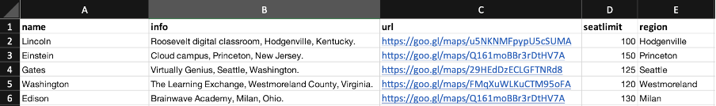

# Instellingen

Leer meer over de instellingen van de Learning Manager-account die u als beheerder kunt configureren.

U kunt de profielinstellingen van uw beheerder wijzigen en uw accountinstellingen bijwerken. Uw profielgegevens bekijken, profielfoto toevoegen/wijzigen en wijzigen **[!UICONTROL Over mij]** inhoud. Werk uw bedrijfsinfo bij, stel aanmeldingsmethoden voor gebruikers in en stel integratie via accountinstellingen in.

## Accountinstellingen {#accountsettings}

Klik op **[!UICONTROL Instellingen]** in het linkerdeelvenster.

**Basisinformatie (Bedrijfsinformatie)**

Klikken **[!UICONTROL Wijzigen]** op de pagina en de instellingen voor land, tijdzone, landinstelling en boekjaar bewerken.

**Contact opnemen met beheerder configureren**

Als u de e-mailadressen van de ondersteuningsbeheerders voor uw organisatie wilt toevoegen of wijzigen, kunt u deze configureren door op **[!UICONTROL Algemeen]** in het linkerdeelvenster. Klikken **[!UICONTROL Wijzigen]** grenzend aan **[!UICONTROL E-mailadres voor ondersteuning]** en voeg de e-mail-ID toe. E-mail wordt naar deze beheerders verzonden wanneer de student klikt **[!UICONTROL Contact opnemen met beheerder]** in de voettekst van de pagina.

Voeg extra e-mail-ID&#39;s toe met een puntkomma als scheidingsteken.

**Aanmeldingsmethoden** - Beheerders kunnen de modus kiezen waarmee uw interne of externe gebruikers toegang hebben tot het account.

* **Interne gebruikers:** Voor interne gebruikers kunt u Adobe ID of Single Sign-On instellen als aanmeldingsmodus.
* **Externe gebruikers:** Voor externe gebruikers kunt u Adobe ID, Single Sign-On of Learning Manager ID instellen.

Indien u dat wenst, kunnen externe gebruikers zich bij dit account aanmelden nadat ze hun gebruikersnaam en wachtwoord voor de Learning Manager hebben gemaakt.

>[!NOTE]
>
>Als er meerdere externe profielen zijn ingesteld, kunnen alle profielen elk type aanmelding hebben. Als het aanmeldingstype bijvoorbeeld Adobe ID is, moeten alle profielen zich alleen aanmelden met Adobe ID. Elk profiel kan niet zijn eigen aanmeldingstype hebben.

U kunt de toepassing Learning Manager openen met Adobe ID of door Single Sign-On te gebruiken. Single Sign-On is een mechanisme waarmee een gebruiker zich eenmaal kan verifiëren en meerdere keren toegang krijgt tot meerdere toepassingen. Deze configuratie is niet verplicht voor de organisatie. Als uw organisatie een op SAML 2.0 gebaseerde SSO-provider heeft, kunt u deze gebruiken om de toepassing van Learning Manager te configureren. De configuratie is vereist op organisatieniveau en in de toepassing Learning Manager. Als u SSO gebruikt, neemt u contact op met de ondersteuning van de Adobe voor configuratie-instructies

**Feedback**

Klikken **[!UICONTROL Feedback]** in het linkerdeelvenster om de vragenlijst in te stellen om na het afronden van een cursus feedback van studenten te krijgen. Raadpleeg [cursusfunctie Help-inhoud](courses.md) over het maken van L1- en L3-feedback.

**Meerdere pogingen**

Selecteren **[!UICONTROL Instellingen]** > **[!UICONTROL Algemeen]** > **[!UICONTROL Meerdere pogingen]**.

Als u het selectievakje Meerdere pogingen inschakelt, kunnen auteurs Meerdere pogingen instellen voor interactieve e-learningcursussen of -modules. Als u het tweede selectievakje inschakelt, kunnen beheerders de optie Oneindige pogingen standaard instellen voor nieuwe interactieve e-learningcursussen.

*Schakel het selectievakje Meerdere pogingen in*

**Cursusmoderatie**

Klikken **[!UICONTROL Algemeen]** in het linkerdeelvenster en selecteer de optie Cursusmoderatie om de functie Cursusmoderatie in te schakelen. Ga voor meer informatie over deze functie naar [Cursusmoderatie](courses.md#main-pars_header_1879001177).

**Discussieboard**

Als u het selectievakje Discussieboard inschakelt, kunnen de studenten en docenten opmerkingen voor cursussen plaatsen via het tabblad Discussie op de pagina Cursussen in de Learner-app. Als de instellingen op cursusniveau echter aangeven dat deze functie niet is geselecteerd, hebben de instellingen op cursusniveau voorrang op de beheerdersinstellingen.

**Studentendashboard**

Klik in het linkerdeelvenster op Studentendashboard. Op deze pagina kunt u de widgets kiezen die u op de pagina Studenten wilt weergeven. Selecteer de widgets die u op de studentenpagina wilt inschakelen. De widgets die niet zijn geselecteerd, worden niet weergegeven op de pagina Studenten.

**Adobe Connect**

Klikken **[!UICONTROL Adobe Connect]** in het linkerdeelvenster om Adobe Connect-account te configureren voor het hosten van virtuele klassikale sessies. Raadpleeg voor meer informatie  [Adobe Connect](adobeconnect-integration.md) Help.

## Algemene instellingen {#general}

Schakel de volgende instellingen in of uit:

<table>
 <tbody>
  <tr>
   <th>
    
<b>Naam</b>

    </th>
   <th>
    
<b>Beschrijving</b>

   </th>
  </tr>
  <tr>
   <td>Cursuseffectiviteit tonen</td>
   <td>Indien ingeschakeld kunnen studenten de huidige cursuseffectiviteit zien op de cursustegel. Deze functie is alleen beschikbaar voor cursussen. Sterrenclassificatie wordt niet ondersteund voor leerprogramma's of certificaten. Het is beschikbaar voor cursussen en leerprogramma's, maar niet voor certificeringen.</td>
  </tr>
  <tr>
   <td>Cursusmoderatie</td>
   <td>Indien ingeschakeld moeten alle wijzigingen in cursussen worden goedgekeurd door de beheerder voordat de cursussen zichtbaar zijn voor de studenten.</td>
  </tr>
  <tr>
   <td>Discussieboard</td>
   <td>Als u het selectievakje Discussieboard inschakelt, kunnen de studenten en docenten opmerkingen voor cursussen plaatsen via het tabblad Discussie op de pagina Cursussen in de Learner-app. Als de instellingen op cursusniveau echter aangeven dat deze functie niet is geselecteerd, hebben de instellingen op cursusniveau voorrang op de beheerdersinstellingen.</td>
  </tr>
  <tr>
   <td>Meerdere pogingen</td>
   <td>Indien ingeschakeld kan de auteur meerdere pogingen configureren voor cursusmodules.</td>
  </tr>
  <tr>
   <td>Optie Vaardigheden verkennen</td>
   <td>Indien ingeschakeld kunnen studenten de vaardigheden van collega's en leidinggevenden verkennen en zich abonneren op de vaardigheden van hun keuze.</td>
  </tr>
  <tr>
   <td>Zichtbaarheid van vaardigheden/tags</td>
   <td>Geef alle vaardigheden en tags weer aan studenten. U kunt alle vaardigheden en tags weergeven of vaardigheden en tags weergeven die zijn toegewezen of die deel uitmaken van de catalogi die zichtbaar zijn voor de student.</td>
  </tr>
  <tr>
   <td>Unieke ID's voor leerobjecten</td>
   <td>Indien ingeschakeld kan een beheerder of auteur een unieke ID toevoegen voor elk leerobject.</td>
  </tr>
  <tr>
   <td>Filterdeelvensters tonen</td>
   <td>
    
Bepaal welke filterdeelvensters beschikbaar zijn voor gebruikers in de Learner-toepassing om hun zoekresultaten te verfijnen. De volgende opties zijn beschikbaar:

    <ul>
     <li>Catalogi</li>
     <li>Type</li>
     <li>Indeling</li>
     <li>Duur</li>
     <li>Vaardigheden</li>
     <li>Vaardigheidsniveaus</li>
     <li>Labels</li>
    </ul>
    
Wanneer de student de Learner-app start, kan de student in de secties Mijn leerervaring en Catalogus de filters in hun respectievelijke deelvensters zien.

    
<b>Opmerking: </b>De filters <b>Indeling </b>en <b>Duur </b>worden standaard uitgeschakeld en worden niet onmiddellijk na de release aan de studenten getoond. De beheerder moet ze inschakelen.  
</td>
  </tr>
  <tr>
   <td>Cataloguslijst tonen</td>
   <td>Indien ingeschakeld kunnen studenten een lijst met alle beschikbare catalogi zien. Studenten kunnen hiermee de weergave van de leerobjecten verfijnen.</td>
  </tr>
  <tr>
   <td>Productterminologie</td>
   <td>Learning Manager heeft een standaardterminologie die in het hele product wordt gebruikt. Pas de terminologie aan de behoeften van uw organisatie aan.</td>
  </tr>
  <tr>
   <td>Versie-update van module</td>
   <td>Configureer de standaardinstelling om inhoud bij te werken. De instellingen kunnen voor elke inhoud van de cursuspagina worden gewijzigd.</td>
  </tr>
  <tr>
   <td>Gebruikers automatisch registreren</td>
   <td>Indien ingeschakeld worden nieuwe geïmporteerde gebruikers automatisch geregistreerd. Gebruikers moeten standaard handmatig worden geregistreerd voordat ze Leerbeheer kunnen gaan gebruiken.</td>
  </tr>
  <tr>
   <td>Interne gebruikers automatisch verwijderen</td>
   <td>Indien ingeschakeld worden interne gebruikers automatisch verwijderd als ze het systeem gedurende een opgegeven aantal dagen niet openen. Deze functie is van toepassing op gebruikers die alleen de rol hebben <b>Student</b>. Om de toegang te herstellen, moeten gebruikers contact opnemen met de beheerder. </td>
  </tr>
  <tr>
   <td>Cataloguslabels tonen</td>
   <td>Indien ingeschakeld kunnen beheerders en auteurs cataloguslabels en waarden instellen en koppelen aan leerobjecten.</td>
  </tr>
  <tr>
   <td>Studenten kunnen hun scores bekijken</td>
   <td>Indien ingeschakeld kunnen de studenten hun scores in het studenttranscript bekijken.</td>
  </tr>
  <tr>
   <td>E-mail overzicht</td>
   <td>
    
Een beheerder kan het verzenden van een e-mail naar studenten in- of uitschakelen. De beheerder kan ook de frequentie van de verzonden e-mails bepalen.

    <ul>
     <li>Voor <b>actieve accounts</b>, worden digest-e-mails standaard uitgeschakeld, zodat de beheerder deze handmatig kan inschakelen.</li>
     <li>Voor <b>proefaccounts</b>, blijft de optie voor digest-e-mails uitgeschakeld en kan de beheerder deze optie niet inschakelen.</li>
    </ul>
    
Als de functie is uitgeschakeld, geldt het volgende:

    <ul>
     <li>De optie <b>E-mail overzicht</b> wordt uitgeschakeld.</li>
     <li>Een student kan de gebruikersinstelling voor het digest-e-mailabonnement niet zien.</li>
    </ul>
    
 Als de functie is ingeschakeld, dan:

    <ul>
     <li>De beheerder kan de optie Samenvatting-e-mail inschakelen en wijzigen.</li>
     <li>Van de <b>Profielinstellingen </b>in de Learber-app kan een student (niet in de DND-lijst) ervoor kiezen om zich in of uit te schrijven voor de digest-e-mail.</li>
    </ul></td>
  </tr>
  <tr>
   <td>Pictogrammen voor trainingskaart inschakelen </td>
   <td>Indien ingeschakeld worden pictogrammen weergegeven op trainingskaarten in de Learner-app. </td>
  </tr>
  <tr>
   <td>Voettekstkoppelingen</td>
   <td>
    
Voeg koppelingen of e-mail-ID's toe die als voetteksten worden weergegeven. U kunt maximaal drie voettekstkoppelingen toevoegen.

    
Voer de volgende stappen uit om de koppelingen in de voettekst aan te passen:

    <ol>
     <li>Klikken <b>Meer toevoegen</b>, voert u de naam en de URL of e-mail-ID in de opgegeven velden in. Geef een voorvoegsel voor de URL op met http:// of https://.</li>
     <li>Als u de wijziging voor alle landinstellingen wilt trapsgewijs wilt doorvoeren, klikt u op <b>Repliceren</b>. Dit zorgt ervoor dat alle talen de naam en de URL krijgen.</li>
     <li>Klik op <b>Opslaan</b>. U kunt een pop-upbericht zien waarin de wijziging wordt bevestigd. Nadat u op OK hebt geklikt, wordt de voettekst gevuld met de zojuist toegevoegde koppelingen.</li>
    </ol>
    
Bovendien kunt u:

    <ul>
     <li>Klik op de knop <b>Herstellen</b> pictogram om de standaardwaarden in het deelvenster <b>Help</b> en <b>Contact opnemen met beheerder</b> velden.</li>
     <li>Pas de koppeling in de voettekst aan voor alle talen. Klik op de knop <b>Taal</b> de taal selecteert en voegt de <b>Naam</b> en <b>URL</b> in de opgegeven velden. Nadat u de wijzigingen hebt opgeslagen, worden de bijgewerkte koppelingen weergegeven in de voettekst. </li>
    </ul></td>
  </tr>
  <tr>
   <td>Tijdzone rapport </td>
   <td>
    
Stel een voorkeur op accountniveau in om het leertranscript te exporteren in de volgende tijdzones:

    <ul>
     <li>UTC (Standaardgedrag)</li>
     <li>Tijdzonevoorkeur op accountniveau</li>
    </ul>
    
Het Studenttranscript dat met de Jobs API is gedownload, downloadt ook de gegevens in de geselecteerde tijdzone.

    
<b>Opmerking: </b>Onmiddellijk na de release wordt standaard geen wijziging verwacht in het Studenttranscript. Beheerders kunnen deze instelling configureren via Beheer &gt; Instellingen &gt; Algemeen &gt; Tijdzone rapporteren.
</td>
  </tr>
 </tbody>
</table>

<table border="0" cellpadding="0" cellspacing="0" width="1709">
 <tbody>
  <tr>
   <td height="20" width="147">Naam</td>
   <td>Beschrijving</td>
  </tr>
  <tr>
   <td height="20">Cursuseffectiviteit tonen</td>
   <td>Indien ingeschakeld kunnen studenten de huidige cursuseffectiviteit zien op de cursustegel.</td>
  </tr>
  <tr>
   <td height="20">Cursusmoderatie</td>
   <td>Indien ingeschakeld moeten alle wijzigingen in cursussen worden goedgekeurd door de beheerder voordat de cursussen zichtbaar zijn voor de studenten.</td>
  </tr>
  <tr>
   <td height="20">Discussieboard</td>
   <td>Als u het selectievakje Discussieboard inschakelt, kunnen de studenten en docenten opmerkingen voor cursussen plaatsen via het tabblad Discussie op de pagina Cursussen in de Learner-app. Als de instellingen op cursusniveau echter aangeven dat deze functie niet is geselecteerd, hebben de instellingen op cursusniveau voorrang op de beheerdersinstellingen.</td>
  </tr>
  <tr>
   <td height="20">Meerdere pogingen</td>
   <td>Indien ingeschakeld kan de auteur meerdere pogingen configureren voor cursusmodules.</td>
  </tr>
  <tr>
   <td height="20">Optie Vaardigheden verkennen</td>
   <td>Indien ingeschakeld kunnen studenten de vaardigheden van collega's en leidinggevenden verkennen en zich abonneren op de vaardigheden van hun keuze.</td>
  </tr>
  <tr>
   <td height="20">Zichtbaarheid van vaardigheden/tags</td>
   <td>Geef alle vaardigheden en tags weer aan studenten. U kunt alle vaardigheden en tags weergeven of vaardigheden en tags weergeven die zijn toegewezen of die deel uitmaken van de catalogi die zichtbaar zijn voor de student.</td>
  </tr>
  <tr>
   <td height="20">Unieke ID's voor leerobjecten</td>
   <td>Indien ingeschakeld kan een beheerder of auteur een unieke ID toevoegen voor elk leerobject.</td>
  </tr>
  <tr>
   <td rowspan="10" height="191">Filterdeelvensters tonen</td>
   <td>Bepaal welke filterdeelvensters beschikbaar zijn voor gebruikers in de Learner-toepassing om hun zoekresultaten te verfijnen. De volgende opties zijn beschikbaar:</td>
  </tr>
  <tr>
   <td height="19">Catalogi</td>
  </tr>
  <tr>
   <td height="19">Type</td>
  </tr>
  <tr>
   <td height="19">Indeling</td>
  </tr>
  <tr>
   <td height="19">Duur</td>
  </tr>
  <tr>
   <td height="19">Vaardigheden</td>
  </tr>
  <tr>
   <td height="19">Vaardigheidsniveaus</td>
  </tr>
  <tr>
   <td height="19">Labels</td>
  </tr>
  <tr>
   <td height="19">Wanneer de student de Learner-app start, kan de student in de secties Mijn leerervaring en Catalogus de filters in hun respectievelijke deelvensters zien.</td>
  </tr>
  <tr>
   <td height="20">Opmerking: Filterindeling en Duur zijn standaard uitgeschakeld en worden niet onmiddellijk na de release weergegeven. De beheerder moet ze inschakelen. </td>
  </tr>
  <tr>
   <td height="20">Cataloguslijst tonen</td>
   <td>Indien ingeschakeld kunnen studenten een lijst met alle beschikbare catalogi zien. Studenten kunnen hiermee de weergave van de leerobjecten verfijnen.</td>
  </tr>
  <tr>
   <td height="20">Productterminologie</td>
   <td>Learning Manager heeft een standaardterminologie die in het hele product wordt gebruikt. Pas de terminologie aan de behoeften van uw organisatie aan.</td>
  </tr>
  <tr>
   <td height="20">Versie-update van module</td>
   <td>Configureer de standaardinstelling om inhoud bij te werken. De instellingen kunnen voor elke inhoud van de cursuspagina worden gewijzigd.</td>
  </tr>
  <tr>
   <td height="20">Gebruikers automatisch registreren</td>
   <td>Indien ingeschakeld worden nieuwe geïmporteerde gebruikers automatisch geregistreerd. Gebruikers moeten standaard handmatig worden geregistreerd voordat ze Leerbeheer kunnen gaan gebruiken.</td>
  </tr>
  <tr>
   <td height="20">Interne gebruikers automatisch verwijderen</td>
   <td>Indien ingeschakeld worden interne gebruikers automatisch verwijderd als ze het systeem gedurende een opgegeven aantal dagen niet openen. Deze functie is van toepassing op gebruikers die alleen de rol Student hebben. Om de toegang te herstellen, moeten gebruikers contact opnemen met de beheerder.</td>
  </tr>
  <tr>
   <td height="20">Cataloguslabels tonen</td>
   <td>Indien ingeschakeld kunnen beheerders en auteurs cataloguslabels en waarden instellen en koppelen aan leerobjecten.</td>
  </tr>
  <tr>
   <td height="20">Studenten kunnen hun scores bekijken</td>
   <td>Indien ingeschakeld kunnen de studenten hun scores in het studenttranscript bekijken.</td>
  </tr>
  <tr>
   <td rowspan="9" height="172">E-mail overzicht</td>
   <td>Een beheerder kan het verzenden van een e-mail naar studenten in- of uitschakelen. De beheerder kan ook de frequentie van de verzonden e-mails bepalen.</td>
  </tr>
  <tr>
   <td height="19">Voor actieve accounts worden digest-e-mails standaard uitgeschakeld, zodat de beheerder deze handmatig kan inschakelen.</td>
  </tr>
  <tr>
   <td height="19">Voor proefaccounts blijft de optie voor digest-e-mails uitgeschakeld en kan de beheerder deze optie niet inschakelen.</td>
  </tr>
  <tr>
   <td height="19">Als de functie is uitgeschakeld, geldt het volgende:</td>
  </tr>
  <tr>
   <td height="19">De optie E-mail overzicht wordt uitgeschakeld.</td>
  </tr>
  <tr>
   <td height="19">Een student kan de gebruikersinstelling voor het digest-e-mailabonnement niet zien.</td>
  </tr>
  <tr>
   <td height="19"> Als de functie is ingeschakeld, dan:</td>
  </tr>
  <tr>
   <td height="19">De beheerder kan de optie Samenvatting-e-mail inschakelen en wijzigen.</td>
  </tr>
  <tr>
   <td height="20">Vanuit de profielinstellingen in de Learber-app kan een student (niet in de DND-lijst) ervoor kiezen om zich in of uit te schrijven voor de digest-e-mail.</td>
  </tr>
  <tr>
   <td height="20">Pictogrammen voor trainingskaart inschakelen</td>
   <td>Indien ingeschakeld worden pictogrammen weergegeven op trainingskaarten in de Learner-app.</td>
  </tr>
  <tr>
   <td rowspan="8" height="153">Voettekstkoppelingen</td>
   <td>Voeg koppelingen of e-mail-ID's toe die als voetteksten worden weergegeven. U kunt maximaal drie voettekstkoppelingen toevoegen.</td>
  </tr>
  <tr>
   <td height="19">Voer de volgende stappen uit om de koppelingen in de voettekst aan te passen:</td>
  </tr>
  <tr>
   <td height="19">1. Klik op Meer toevoegen, voer de naam en de URL- of e-mail-ID in de opgegeven velden in. Geef een voorvoegsel voor de URL op met http:// of https://.</td>
  </tr>
  <tr>
   <td height="19">2. Klik op Repliceren om de wijziging voor alle landinstellingen te trapsgewijs door te voeren. Dit zorgt ervoor dat alle talen de naam en de URL krijgen.</td>
  </tr>
  <tr>
   <td height="19">3. Klik op Opslaan om de wijzigingen op te slaan. U kunt een pop-upbericht zien waarin de wijziging wordt bevestigd. Nadat u op OK hebt geklikt, wordt de voettekst gevuld met de zojuist toegevoegde koppelingen.</td>
  </tr>
  <tr>
   <td height="19">Bovendien kunt u:</td>
  </tr>
  <tr>
   <td height="19">Klik op het pictogram Opnieuw instellen om de standaardwaarden in de velden Help en Contact opnemen met beheerder opnieuw in te stellen.</td>
  </tr>
  <tr>
   <td height="20">Pas de koppeling in de voettekst aan voor alle talen. Klik op de vervolgkeuzelijst Taal, selecteer de taal en voeg de Naam en URL toe in de opgegeven velden. Nadat u de wijzigingen hebt opgeslagen, worden de bijgewerkte koppelingen weergegeven in de voettekst.</td>
  </tr>
  <tr>
   <td rowspan="5" height="96">Tijdzone rapport</td>
   <td> Stel een voorkeur op accountniveau in om het leertranscript te exporteren in de volgende tijdzones:</td>
  </tr>
  <tr>
   <td height="19">UTC (Standaardgedrag)</td>
  </tr>
  <tr>
   <td height="19">Tijdzonevoorkeur op accountniveau</td>
  </tr>
  <tr>
   <td height="19">Het Studenttranscript dat met de Jobs API is gedownload, downloadt ook de gegevens in de geselecteerde tijdzone.</td>
  </tr>
  <tr>
   <td height="20">Opmerking: er wordt geen wijziging verwacht in het Studenttranscript direct na de release. Beheerders kunnen deze instelling configureren via Beheer &gt; Instellingen &gt; Algemeen &gt; Tijdzone rapporteren.</td>
  </tr>
  <tr>
   <td height="19">Badgr-integratie</td>
   <td>Als deze optie is ingeschakeld, kunnen de studenten hun badges uploaden naar de Badgr-website. In klanteducatiescenario's willen organisaties hun klanten kunnen "certificeren" en hen de kans geven die aanmeldgegevens via sociale media weer te geven. Hiermee wordt de student gemotiveerd een training te volgen en zijn/haar prestaties met anderen te delen. </td>
  </tr>
  <tr>
   <td height="135">
    
Classificatie tonen
</td>
   <td>
    <ul>
     <li>Als de optie <b>Cursuseffectiviteit</b> is ingeschakeld, kunnen studenten alleen de waarde van de cursuseffectiviteit zien.</li>
     <li>Als de optie <b>Sterrenclassificatie</b> is ingeschakeld, kunnen studenten alleen de gemiddelde sterwaardering en het aantal studenten dat de cursus heeft beoordeeld, bekijken. </li>
    </ul>
    
Deze functie is alleen beschikbaar voor cursussen. Sterrenclassificatie wordt niet ondersteund voor leerprogramma's of certificaten.  <b>Opmerking: </b>Deze wijziging is alleen van invloed op de Learner-app. 

    
In alle andere apps (beheerder, auteur, manager, aangepaste beheerder, aangepaste auteur) hebben wijzigingen in de instellingen (sterrenclassificatie/cursuseffectiviteit/uitschakelen van classificatie weergeven) geen invloed op. 

    
Voor nieuwe accounts worden de <b>Classificaties tonen</b> sectie heeft de optie <b>Sterrenclassificatie</b> standaard ingeschakeld.

    
Voor bestaande accounts, als het account voorheen de optie <b>Cursuseffectiviteit</b> ingeschakeld, dan de <b>Classificaties tonen</b> sectie wordt ingeschakeld met de optie Cursuseffectiviteit geselecteerd. Als de optie <b>Cursuseffecten</b>s is uitgeschakeld, dan wordt de <b>Classificaties tonen</b> wordt ook uitgeschakeld. Wanneer u <b>Classificaties tonen</b> -sectie is ingeschakeld, de optie <b>Sterrenclassificatie</b> wordt standaard ingeschakeld.
</td>
  </tr>
 </tbody>
</table>

<table>
 <tbody>
  <tr>
   <td>
    
Leerpaden
</td>
   <td>
    
Als de optie <b>Uitgebreide functies van leerpad inschakelen</b> is ingeschakeld, kunnen beheerders leerpaden opnemen in leerpaden en deze leerpaden combineren met cursussen. De optie is onomkeerbaar. 
</td>
  </tr>
  <tr>
   <td>
    
Beheer van docenten 
</td>
   <td>
    
Schakel deze instelling in om de lijst met docenten te beperken die kunnen worden geselecteerd tijdens het maken van klassikale/virtuele klassikale sessies. Alle gebruikers die de geprivilegieerde docent hebben kunnen slechts als docent aan om het even welke zitting worden toegewezen. Deze beperking is niet van toepassing op migratieworkflows. 
</td>
  </tr>
 </tbody>
</table>

## Op AI gebaseerde aanbeveling

Learning Manager bevat een gloednieuwe startpagina voor studenten, die modern is, meer contentgestuurd en gepersonaliseerd volgens de voorkeuren van de student. AI-gebaseerde leeraanbevelingen hebben tot doel de betrokkenheid van studenten te vergroten en lacunes in het leerproces te identificeren en aan te pakken.

Het aanbevelingsalgoritme is ontworpen om meerdere invoerbronnen in te nemen, waaronder branchegegevens over taakrollen, titels en beschrijvingen die de Adobe van haar partners heeft verkregen. Deze gegevens worden vervolgens gebruikt om AI-algoritmen van de Adobe op te leiden, zodat Learning Manager een kaart kan maken die branchespecifieke vaardigheden koppelt aan taaktitels en/of aanwijzingen. Dit wordt vervolgens een invoer voor het aanbevelingsalgoritme

Leermanager gebruikt vervolgens algoritmen voor onderwerpmodellering om de trainingsinhoud binnen een account te analyseren en deze toe te wijzen aan de vaardigheden.

Learning Manager gebruikt peer-activiteitsgegevens als een ander signaal om het aanbevelingsalgoritme op een gepersonaliseerde manier te sturen. Activiteiten zoals inschrijving, voltooiing en eventuele expliciete feedback van studenten worden hier gebruikt.

Bovendien gebruikt de leermanager expliciete en impliciete informatie die van individuele studenten wordt verzameld om aanbevelingen verder te personaliseren. Een leerling kan zijn of haar aandachtsgebieden expliciet aangeven via inschrijvingen. De leermanager ontvangt deze informatie impliciet op basis van de manier waarop de leerling de trainingen volgt.

Tot slot kan de beheerder ook het aanbevelingsalgoritme beïnvloeden met behulp van studentkenmerken die Leermanager moet bekijken bij het definiëren van peer-groepen, en ook door trainingen voor specifieke gebruikersgroepen te markeren.

## Naam van leerobjecten wijzigen {#renaminglearningobjects}

Deze functie is alleen beschikbaar in het Engels.

Beheerders kunnen de naam van leerobjecten nu wijzigen in Leerbeheer. Hieronder vindt u de terminologieën die u kunt hernoemen.

Module\
Cursus\
Leerprogramma\
Certificering\
Leerplan\
Taakhulp\
Catalogus\
Vaardigheid\
Badge\
Aankondiging\
Mijn leerervaring\
Leaderboard\
Doeltreffendheid\
Vereiste\
Voorwerk\
Kerninhoud\
Testout\
Zelf geplaatst\
Overvloeid\
Klaslokaal\
Virtuele lesruimte\
Activiteit

Voer de volgende stappen uit om de naam van de terminologie te wijzigen.

1. Als beheerder klikt u op **[!UICONTROL Instellingen]** > **[!UICONTROL Algemeen]** > **[!UICONTROL Productterminologie]**. De optie voor productterminologie wordt geopend.

   

   *Productterminologie hernoemen*

1. U kunt wijzigingen aanbrengen door een aangepaste sjabloon voor productterminologie te uploaden door het CSV-voorbeeldbestand te downloaden. Als u het voorbeeld-CSV-bestand wilt downloaden, klikt u op de knop **[!UICONTROL Hier downloaden]** gebruiken.
1. Het gedownloade CSV-bestand bevat de naam van de objecten in kolom A. Kies in kolom B de naam die u aan het desbetreffende object wilt toewijzen. U moet de enkelvoud- en meervoudsvorm van de naam bijwerken, gescheiden door een (|).
1. U kunt ervoor kiezen een of meer rijen te wijzigen. U kunt de ongewijzigde rijen behouden of verwijderen uit het CSV-bestand voordat u ze uploadt.
1. Upload het gewijzigde CSV-bestand en klik op **[!UICONTROL Opslaan]**. Leerbeheer wordt vernieuwd en weerspiegelt uw wijzigingen.
1. Als u de standaardterminologie wilt herstellen, klikt u op **[!UICONTROL Productterminologie herstellen]**.

   

   *Productterminologie herstellen*

## Profielinstellingen {#profilesettings}

1. Klik op de vervolgkeuzepijl in de rechterbovenhoek naast uw foto/account en kies **[!UICONTROL Profielinstellingen]**.
1. In het pop-upvenster kunt u een foto toevoegen/wijzigen door de muis erop te plaatsen en op **[!UICONTROL Bewerken]** in het profielfotogebied.
1. Toevoegen/wijzigen **[!UICONTROL Info]** inhoud door te klikken **[!UICONTROL Bewerken]** naast de afbeelding.
1. Klikken **[!UICONTROL Opslaan].**

## Map Inhoud {#content-folder}

Learning Manager ondersteunt mappen met persoonlijke inhoud. Een beheerder kan mappen met persoonlijke inhoud configureren en specifieke aangepaste auteurs toegang bieden met behulp van Aangepaste rollen. Standaardauteurs (ook wel Full Authors genoemd) hebben nog steeds toegang tot alle inhoud in het account. Volledige auteurs hebben daarom toegang tot alle mappen en alle inhoud.

Inhoudsmappen kunnen worden geconfigureerd door beheerders. Slechts eenmaal geconfigureerd worden inhoudsmappen zichtbaar voor auteurs en kunnen ze de inhoud in een of meerdere mappen plaatsen.

Als u een inhoudsmap wilt toevoegen, klikt u in de beheerdersapp op **[!UICONTROL Instellingen]** > **[!UICONTROL Map Inhoud]**.

*Instellingen voor inhoudsmappen wijzigen*

### Map

Een map is een opslagplaats van inhoud, die een subset is van de gehele inhoudsbibliotheek die beschikbaar is in een account met de volgende eigenschappen:

* Alleen een beheerder kan een map maken, bewerken of verwijderen.
* Een beheerder kan de toegang tot mappen beheren als onderdeel van het definiëren van rollen alleen voor aangepaste beheerders.
* Inhoud **moet te allen tijde aan ten minste één map zijn gekoppeld**. Om te beginnen wordt alle inhoud gekoppeld aan de openbare map, die later kan worden gewijzigd.
* Inhoud kan tijdens het maken aan meerdere mappen worden gekoppeld, wat ook mogelijk is door een kopieerbewerking
* Alle mapnamen moeten uniek zijn binnen het account, anders treedt er een fout op bij de mapnaamgeving.

Mappen bepalen alleen de zichtbaarheid van inhoud en maken geen kopieën van inhoud. Daarom wordt het bewerken van inhoud weerspiegeld in alle bijbehorende mappen.

### Openbare map

Een openbare map is altijd aanwezig in een account en in eerste instantie zal alle inhoud deel uitmaken van deze map. Later kunnen auteurs inhoud uit deze map naar andere mappen verplaatsen. Een openbare map heeft de volgende eigenschappen:

* Alle inhoud die aan deze map is gekoppeld, is standaard toegankelijk voor alle typen auteurs.
* Inhoud die deel uitmaakt van een openbare map, kan geen deel uitmaken van een andere map. Het omgekeerde geldt ook.

Deze map kan geen deel uitmaken van een configureerbare roldefinitie. Daarom beperkt het niet hebben van een openbare map in een configureerbare roldefinitie de toegang tot een openbare map niet.

### Persoonlijke map

* Elke map die door een beheerder wordt gemaakt, is een privémap.

### Mapbewerkingen

**Een map toevoegen**

Klik op **[!UICONTROL Toevoegen]** rechtsboven in het venster.

**Een map verwijderen**

U kunt ook een map verwijderen. Selecteer de map die u wilt verwijderen, klik op het menu Acties en klik op **[!UICONTROL Map verwijderen]**.

>[!NOTE]
>
>Mappen kunnen worden verwijderd wanneer alle bijbehorende inhoud ook aan andere mappen is gekoppeld. Als er inhoud is die alleen is gekoppeld aan de map die wordt verwijderd, verplaatst u de inhoud eerst naar een andere map en verwijdert u de map.

## Locatie van lesruimte

Beheerders kunnen deze instelling gebruiken om een bibliotheek van klaslokaallocaties te maken en te configureren. Auteurs kunnen een vooraf geconfigureerde locatie selecteren om hun klassikale gebeurtenis in te stellen. Selecteer een locatie in de bibliotheek om automatisch de locatie-informatie, de URL en de licentielimiet in te vullen.

Als beheerder kunt u:

### CSV-importlocaties

Voeg locaties in uw account toe door een CSV-bestand met locaties te importeren. Het CSV-bestand moet de kolom Stad bevatten.

### Een locatie toevoegen

Voeg het volgende toe:

1. Locatienaam: voer de naam in van de lesruimte.
2. Locatie-informatie: voer de informatie over de locatie in.
3. Locatiegebied: de ingevoerde waarde wordt weergegeven als het filter Trainingslocaties voor studenten.
4. Locatie-URL: voer de URL van de locatie in.
5. Plaatslimiet: voer de capaciteit van de ruimte in.

*Locaties voor lesruimten toevoegen*

U kunt de locatie ook toevoegen met behulp van een CSV. De CSV moet de velden bevatten:

* name
* info
* url
* zeegrens
* regio

<!---->

## Veelgestelde vragen {#frequentlyaskedquestions}

+++Hoe maak ik verschillende mappen voor de inhoudsbibliotheek?

Klikken **[!UICONTROL Instellingen]** > **[!UICONTROL Map Inhoud]**. Klik op **[!UICONTROL Toevoegen]** in de rechterbovenhoek en in het dialoogvenster voert u de naam en beschrijving van de map in.

Inhoudsmappen kunnen worden geconfigureerd door beheerders. Slechts eenmaal geconfigureerd worden inhoudsmappen zichtbaar voor auteurs en kunnen ze de inhoud in een of meerdere mappen plaatsen.

Zie de sectie over [Map Inhoud](settings.md#content-folder).
+++

+++Hoe voeg ik een financieel jaar voor de account toe?

In **[!UICONTROL Instellingen]** > **[!UICONTROL Basisinformatie]**, klik op **[!UICONTROL Wijzigen]**. Van de **[!UICONTROL Het boekjaar begint bij]** de maand selecteren.
+++
