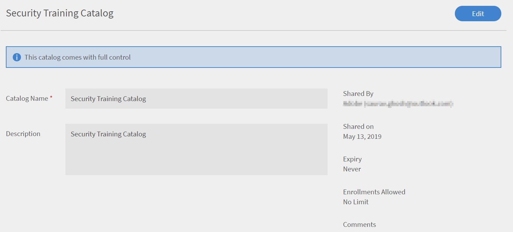

# Volledig beheer van gedeelde catalogus inschakelen

## Catalogus maken {#createcatalog}

Als beheerder kunt u een catalogus met cursussen, leerprogramma&#39;s, taakhulpen en certificeringen maken.

Zie voor meer informatie [Catalogi](/help/migrated/administrators/feature-summary/catalogs.md).

## Catalogus delen {#sharecatalog}

U kunt de catalogi delen met interne gebruikers van een organisatie of met externe gebruikers. Het delen is echter exclusief. Met andere woorden, een intern gedeelde catalogus kan niet worden gedeeld met externe groepen en vice versa.

Cursussen, leerprogramma&#39;s, taakhulpen en certificeringen zijn de ondersteunde leerobjecten voor een gedeelde catalogus.

Zie voor meer informatie [Catalogi delen](/help/migrated/administrators/feature-summary/catalogs.md).

## Volledig beheer van gedeelde catalogus inschakelen {#fullcontrol}

U kunt externe accounts volledige toegang tot uw catalogus geven. De beheerder van het account kan vervolgens de catalogus accepteren en dienovereenkomstig leermateriaal of modules toevoegen of verwijderen.

Volledige controle verlenen aan een externe rekening,

1. Nadat u leermateriaal aan een catalogus hebt toegevoegd, moet u de catalogus met externe gebruikers delen.
1. Voeg in het dialoogvenster Externe account het subdomein en de e-mail-ID van de beheerder van de externe organisatie toe.
1. Schakel in de optie Catalogusbeheer de knop in om de volledige controle van de catalogus aan externe gebruikers toe te staan.

   

   *Volledig beheer van gedeelde catalogus toestaan*

   Wanneer u volledige cataloguscontrole toestaat, accepteert de beheerder van de externe organisatie het verzoek om wijzigingen in de catalogus toe te staan. De auteur van de externe organisatie kan de cursussen dan bewerken of modules toevoegen.

   Zie de onderstaande secties voor meer informatie.

## Beheerder van externe organisatie {#administratorofexternalorganization}

Zodra de beheerder van de vorige organisatie volledige controle over de catalogus heeft ingeschakeld, accepteert de beheerder van de externe organisatie de catalogus en bekijkt deze deze.

1. Klik op het meldingspictogram om de melding te bekijken om de catalogus te accepteren.

   <!---->

1. Klik op Accepteren om de uitnodiging voor de catalogus te accepteren.
1. Als u in de lijst met catalogi de catalogus start die met u is gedeeld, ziet u een bericht dat de catalogus nu volledige controle heeft.

   

   *Catalogusdetails weergeven*

1. U kunt de naam van de catalogus en de beschrijving wijzigen.

## Catalogus delen voor leerprogramma, certificering en taakhulpen {#sharecatalogforlearningprogramcertificationandjobaids}

Net als het verlenen van volledige cataloguscontrole voor cursussen, kan de beheerder ook volledige cataloguscontrole toekennen voor het volgende:

* Leerprogramma&#39;s
* Certificeringen
* Taakhulpen

## Cursus opnieuw instellen {#resetcourse}

1. Klik op de cataloguskaart met een verbroken koppeling op **[!UICONTROL Cursus opnieuw instellen]**.

<!-- -->

1. U ziet een waarschuwingsbericht nadat u op de knop Herstellen hebt geklikt. De cursus opnieuw instellen:

   * Hiermee verwijdert u alle nieuw toegevoegde inhoud uit de catalogus.
   * Werkt de catalogus synchroon met de oorspronkelijke gedeelde catalogus bij.
   * Hiermee wordt de relatie met het bovenliggende leerobject hersteld.

   Het opnieuw instellen van de catalogus is onomkeerbaar. U kunt de wijzigingen die u in de catalogus hebt aangebracht, niet ongedaan maken.

1. Klik op Ja om de wijzigingen te accepteren.
1. In de cursuscatalogus ziet u dat er geen bericht in de catalogus staat *Koppeling verbroken* meer.

   Wanneer u de catalogusdetails bekijkt, ziet u dat de catalogus nu weer in de oorspronkelijke staat is.

## Een leerobject opnieuw toevoegen {#readdalearningobject}

Als u een cursus, leerprogramma, certificering of taakhulp per ongeluk hebt verwijderd, kunt u deze herstellen.

Klik op Opnieuw toevoegen om een verwijderd leerobject te herstellen.

Met deze actie wordt de actie omgekeerd en wordt het leerobject in de catalogusweergave hersteld.

*Een leerobject opnieuw toevoegen*

Nadat u op de knop Opnieuw toevoegen hebt geklikt, verschijnt een bevestigingsbericht dat het leerobject aan de catalogus is toegevoegd.

## Externe organisatie {#externalorganization}

Nadat de beheerder van het externe account de catalogus heeft geaccepteerd, kan de auteur nu cursussen en leerprogramma&#39;s toevoegen.

1. Als gebruiker ontvangt u een melding dat de catalogus nu beschikbaar is in uw account.
1. Klik op **[!UICONTROL Cursussen]** in het linkernavigatievenster. U kunt alle cursussen zien die door u zijn gemaakt en met u zijn gedeeld.
1. Klik op **[!UICONTROL Cursus weergeven]** op de cursuskaart.

   <!---->

1. Op de pagina met cursusdetails ziet u informatie over de cursus en de gedeelde modules. Klik op Modules toevoegen om een module toe te voegen. Wanneer u modules aan de bestaande modules toevoegt, verschijnen de nieuwe modules aan het einde van de bestaande modules. U kunt de modules altijd opnieuw rangschikken.
1. Klik op Opnieuw publiceren nadat u de modules hebt toegevoegd.

   Nadat u de modules opnieuw hebt gepubliceerd, ziet u op de cataloguskaart een bericht *Koppeling verbroken*.

   Aangezien u de oorspronkelijke catalogus met nieuwe modules hebt bijgewerkt, bestaat de bestaande relatie met de verworven cursus niet meer.

   Het leerobject loopt niet meer synchroon met het bronaccount omdat de inhoud van het leerobject is gewijzigd.

   <!---->

Nadat u de module hebt toegevoegd en opnieuw hebt gepubliceerd, kunt u, als u het gevoel hebt dat u een cursus eerder per ongeluk hebt toegevoegd of verwijderd in de catalogus, de module herstellen en terugkeren naar de oorspronkelijke toestand toen deze voor het eerst met volledige controle werd gedeeld.
