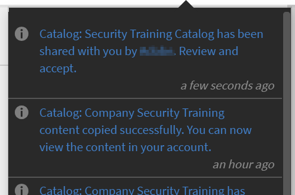
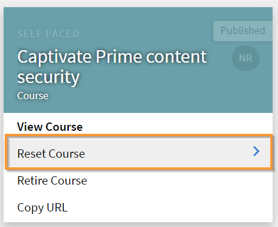

# Volledig beheer van gedeelde catalogus inschakelen

## Catalogus maken {#createcatalog}

Als beheerder kunt u een catalogus met cursussen, leerprogramma&#39;s, taakhulpen en certificeringen maken.

Zie [Catalogi](/help/migrated/administrators/feature-summary/catalogs.md) voor meer informatie.

## Catalogus delen {#sharecatalog}

U kunt de catalogi delen met interne gebruikers van een organisatie of met externe gebruikers. Het delen is echter exclusief. Met andere woorden, een intern gedeelde catalogus kan niet met externe groepen worden gedeeld en vice versa.

Cursussen, Leerprogramma&#39;s, taakhulpen en certificeringen zijn de ondersteunde leerobjecten voor een gedeelde catalogus.

Zie [Catalogi delen](/help/migrated/administrators/feature-summary/catalogs.md) voor meer informatie.

## Volledig beheer van gedeelde catalogus inschakelen {#fullcontrol}

U kunt externe accounts volledige toegang tot uw catalogus geven. De beheerder van het account kan de catalogus dan accepteren en naar wens leermateriaal of modules toevoegen of verwijderen.

Volledig beheer verlenen aan een extern account,

1. Nadat u leermateriaal aan een catalogus hebt toegevoegd, moet u de catalogus met externe gebruikers delen.
1. In het dialoogvenster Extern account voegt u het subdomein en de e-mail-ID van de beheerder van de externe organisatie toe.
1. In de optie Catalogusbeheer, schakelt u de knop in om volledig beheer van de catalogus aan externe gebruikers te verlenen.

   

   *Volledig beheer van gedeelde catalogus toestaan*

   Wanneer u volledig beheer van de catalogus toestaat, aanvaardt de beheerder van de externe organisatie het verzoek om wijzigingen in de catalogus toe te staan. De auteur van de externe organisatie kan de cursussen dan bewerken of modules toevoegen.

   Zie de onderstaande secties voor meer informatie.

## Beheerder van externe organisatie {#administratorofexternalorganization}

Nadat de beheerder van de vorige organisatie volledig beheer van de catalogus heeft ingeschakeld, aanvaardt de beheerder van de externe organisatie de catalogus en bekijkt deze de catalogus.

1. Klik op het meldingenpictogram om de notificatie te bekijken en de catalogus te accepteren.

   <!---->

1. Klik op Accepteren om de uitnodiging voor de catalogus te accepteren.
1. Als u in de lijst met catalogi de catalogus start die met u is gedeeld, kunt u een bericht zien dat de catalogus nu volledig beheer heeft.

   

   *Catalogusdetails weergeven*

1. U kunt de naam van de catalogus en de beschrijving wijzigen.

## Aandelencatalogus voor leerprogramma, certificering en taakhulpen {#sharecatalogforlearningprogramcertificationandjobaids}

De beheerder kan niet alleen volledig beheer van catalogi voor cursussen verlenen, maar ook voor het volgende:

* Leerprogramma&#39;s
* Certificeringen
* Taakhulpen

## Cursus opnieuw instellen {#resetcourse}

1. Klik op de cataloguskaart met een verbroken koppeling op **[!UICONTROL Cursus opnieuw instellen]**.

<!-- -->

1. U ziet een waarschuwing nadat u op de knop Opnieuw instellen hebt geklikt. De cursus opnieuw instellen:

   * Verwijdert alle nieuw toegevoegde inhoud uit de catalogus.
   * Werkt de catalogus synchroon met de oorspronkelijk gedeelde catalogus bij.
   * Herstelt de relatie met het bovenliggende leerobject.

   Het resetten van de catalogus kan niet ongedaan worden gemaakt. U kunt de wijzigingen die u in de catalogus heeft aangebracht niet ongedaan maken.

1. Klik op Ja om de wijzigingen te accepteren.
1. De melding *Koppeling defect* verdwijnt van de Cursuscatalogus.

   Wanneer u de catalogusgegevens bekijkt, ziet u dat de oorspronkelijke staat van de catalogus nu is hersteld.

## Een leerobject opnieuw toevoegen {#readdalearningobject}

Als u cursussen, leerprogramma&#39;s, certificeringen of taakhulpen per ongeluk hebt verwijderd, kunt u deze herstellen.

Klik op Opnieuw toevoegen om een verwijderd leerobject te herstellen.

Met deze handeling wordt de actie omgekeerd en het leerobject in de catalogusweergave herstelt.

*Een leerobject opnieuw toevoegen*

Nadat u op de knop Opnieuw toevoegen hebt geklikt, verschijnt een bevestigingsbericht dat het leerobject aan de catalogus is toegevoegd.

## Externe organisatie {#externalorganization}

Nadat de beheerder van het externe account de catalogus heeft geaccepteerd, kan de auteur cursussen en leerprogramma&#39;s toevoegen.

1. Als gebruiker ontvangt u een melding dat de catalogus nu beschikbaar is in uw account.
1. Klik op **[!UICONTROL Cursussen]** in het linkerdeelvenster om de lijst met cursussen te bekijken. U kunt alle door u gemaakte en met u gedeelde cursussen bekijken.
1. Klik op **[!UICONTROL Cursus weergeven]** op de cursuskaart om de details van de cursus te bekijken.

   <!---->

1. Op de pagina met cursusdetails ziet u informatie over de cursus en de gedeelde modules. Klik op Modules toevoegen om dit te doen. Wanneer u modules aan de bestaande modules toevoegt, verschijnen de nieuwe modules aan het einde van de bestaande modules. U kunt de modules altijd opnieuw indelen.
1. Klik op Opnieuw publiceren nadat u de modules hebt toegevoegd.

   Nadat u de modules opnieuw hebt gepubliceerd ziet u op de cataloguskaart het bericht *Koppeling defect*.

   Aangezien u de oorspronkelijke catalogus met nieuwe modules hebt bijgewerkt, is de bestaande relatie met de verworven cursus verbroken.

   Het leerobject loopt niet meer synchroon met het bronaccount, omdat de inhoud van het leerobject is gewijzigd.

   <!---->

Nadat u de module hebt toegevoegd en opnieuw hebt gepubliceerd, kunt u, als u het gevoel hebt dat u een cursus eerder per ongeluk hebt toegevoegd of verwijderd in de catalogus, de module herstellen en terugkeren naar de oorspronkelijke toestand toen deze voor het eerst met volledige controle werd gedeeld.
