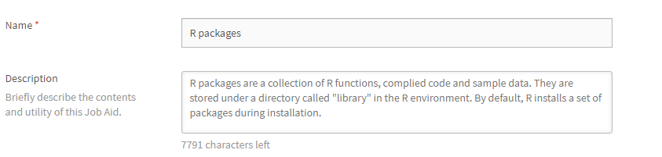
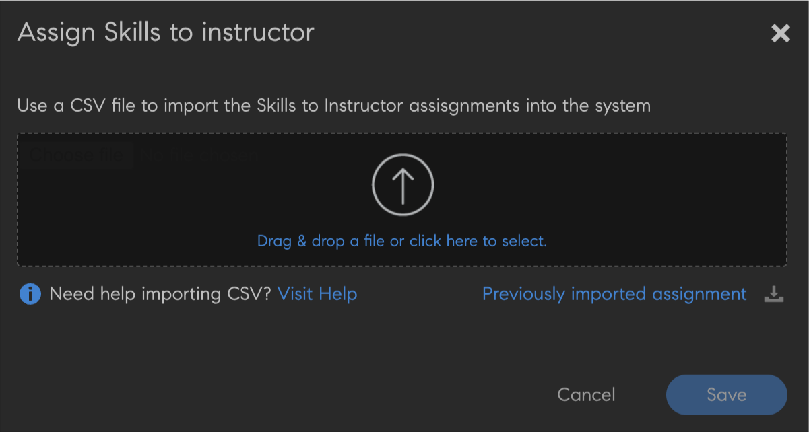

# Vaardigheden en niveaus maken en wijzigen

Maak vaardigheden, wijs ze toe en wijzig ze.

De vaardighedenkaart bundelt sets vaardigheden, kennis en eigenschappen van een werknemer in een organisatie. Deze vaardighedenkaarten helpen bedrijven en organisaties om de prestatieverwachtingen van hun werknemers vast te stellen of te verhogen. Met Vaardigheden kunnen werknemers hun gedrag afstemmen op de verwachtingen van de organisatie.

Met Adobe Learning Manager kunt u met de vaardighedenkaart op basis van hun vaardigheden de prestaties van studenten in kaart brengen. Wanneer studenten het volgen van bepaalde cursussen voltooien, kunnen ze hun status tegenover elke vaardigheid zien door de vaardighedenkaarten te bekijken.

Het voornaamste doel van Vaardigheden in de Learning Manager LMS is om de Beheerder te voorzien van een tool waarmee deze trainings- en bedrijfsdoelen op elkaar kan afstemmen.

## Vaardigheid toevoegen {#addaskill}

Als beheerder kunt u de volgende acties uitvoeren:

* Een domein aan een vaardigheid toewijzen.
* Meerdere niveaus aan een vaardigheid toevoegen.
* Een badge aan een niveau toevoegen.

Volg de onderstaande stappen om een vaardigheid toe te voegen:

1. Voor de linkerruit, uitgezochte **[!UICONTROL Vaardigheden]** > **[!UICONTROL voeg]** toe > **[!UICONTROL voeg SKills]** toe. Geef de vaardigheid een naam en beschrijving.

   

   *voeg naam en beschrijving van een vaardigheid toe*

1. Wijs een domein aan de vaardigheid toe. Tijdens het maken van een vaardigheid kunt u deze toewijzen aan de meest relevante vaardigheidsdomeinen die door Learning Manager worden ondersteund. Zie [***Vaardigheid toewijzen aan domeinen***](/help/migrated/administrators/feature-summary/curation-skills.md) voor meer informatie.

   Typ het domein in het veld om de aanbevelingen weer te geven. Kies de relevante optie of opties voor de vaardigheid.

   

   *voeg een domein* toe

1. Wijs de niveaus aan de vaardigheid toe. Klik op **[!UICONTROL Toevoegen]** om een niveau toe te voegen.

   U kunt Vaardigheden maken en aan werknemers toewijzen. Vaardigheden hebben verschillende niveaus en op elk niveau moet een bepaald aantal punten worden verdiend.

   U kunt maximaal drie niveaus aan één vaardigheid toewijzen. Het leerpad bestaat uit het inschrijven van studenten voor verschillende leerobjecten. Deze worden vervolgens vertaald in een bepaald aantal studiepunten waarmee aan de eisen voor de verschillende niveaus van een vaardigheid wordt voldaan.

   Wanneer deze leerobjecten en niveaus zijn bereikt, heeft de student de kennis om productiever te werken dan voorheen.

   

   *voeg vaardigheidsniveaus* toe

   Wanneer u een vaardigheid toevoegt, kunt u ook decimalen aan punten toewijzen. De punten worden tot op twee decimalen weergegeven.

   Decimale ondersteuning is alleen beschikbaar in het Engels.

1. Kies een badge voor het niveau. Selecteer in de vervolgkeuzelijst **[!UICONTROL Badge]** de afbeelding die als badge voor dat niveau moet worden gebruikt.
1. Klik op **[!UICONTROL Opslaan]** om de wijzigingen op te slaan.

   Zodra de vaardigheid is gemaakt, kunt u de nieuwe vaardigheid op de pagina **[!UICONTROL Vaardigheid]** vinden. U kunt ook de domeinen en de korte beschrijving van de vaardigheid zien. U kunt ook de niveaus en punten bekijken die aan elk niveau zijn toegewezen.

   

   *lijst van de Mening van vaardigheden*

## Een vaardigheid aan studenten toewijzen {#assigntheskilltolearners}

Beheerders kunnen de vaardigheden aan studenten toewijzen.

Nadat u uw vaardigheden hebt gemaakt en opgeslagen, worden deze op de vaardighedenpagina weergegeven. U wijst deze vaardigheden nu als volgt aan studenten toe:

1. Klik op de pagina **[!UICONTROL Vaardigheid]** op de hyperlink met het aantal studenten dat voor de vaardigheid is ingeschreven. Voor een nieuw gemaakte vaardigheid is het aantal studenten voor alle niveaus nul.

   

   *de studenten van de mening die aan een vaardigheid* worden toegewezen

   In dit voorbeeld voegt u studenten toe voor Niveau 1. Klik op de hyperlink naast Niveau 1.

1. Klik in het dialoogvenster Studenten op **[!UICONTROL Studenten toevoegen]**.

   

   *Studenten toevoegen*

1. Zoek naar studenten en voeg deze toe. U kunt ook gebruikersgroepen toevoegen.

   

   *Onderzoek en voeg studenten* toe

1. Klik op **[!UICONTROL Opslaan]** om de wijzigingen op te slaan.

   Nadat u de studenten hebt toegewezen, worden alle studenten in een gebruikersgroep, indien aanwezig, standaard automatisch ingeschreven voor de vaardigheid. U kunt ervoor zorgen dat studenten zich niet automatisch inschrijven door op de knop **[!UICONTROL Automatisch inschrijven]** te klikken.

   

   *maak auto-inschrijving* onbruikbaar

   Individuele studenten kunnen zichzelf automatisch inschrijven of kunnen door de beheerder worden ingeschreven voor een leerprogramma.

1. Nadat u op **[!UICONTROL Sluiten]** hebt geklikt, ziet u het totale aantal deelnemers dat aan de gemaakte vaardigheid is toegewezen.

   In dit voorbeeld zijn er twee individuele studenten en drie studenten in een gebruikersgroep.

   

   *Aantal studenten die aan een vaardigheid* worden toegewezen

## De vaardigheid aan een cursus toewijzen {#assignskilltocourse}

Nadat u de vaardigheid hebt gemaakt, kan een auteur een cursus maken en de vaardigheid aan de cursus toewijzen.

*wijs vaardigheden aan een cursus* toe

Nadat de auteur de cursus op de pagina **[!UICONTROL Vaardigheid]** heeft gepubliceerd, ziet u het aantal cursussen dat aan een vaardigheidsniveau is gekoppeld. Dit wordt verhoogd wanneer u de vaardigheid aan een nieuwe cursus toewijst.

*Aantal cursussen verbonden aan een vaardigheidsniveau*

## Een taakhulp aan de vaardigheid toewijzen {#assignajobaidtotheskill}

Taakhulpen zijn trainingsinhoud waartoe student toegang hebben zonder dat zij zich moeten inschrijven voor een specifiek leerobject zoals een cursus of leerprogramma.

Wanneer een auteur een taakhulp maakt, kan hij/zij hier een vaardigheidsniveau aan koppelen Wanneer u een taakhulp zonder vaardigheid maakt en deze aan een cursus met een vaardigheid koppelt, wordt de vaardigheid niet aan de taakhulp gekoppeld.

*creeer een Hulp van de Baan*

Op de pagina **[!UICONTROL Vaardigheid]** ziet u het aantal taakhulpen dat aan dat vaardigheidsniveau is gekoppeld.

*Aantal Hulp van de Baan van een vaardigheid*

## Vaardigheid zoeken {#searchskill}

Zoek vaardigheden door de naam van de vaardigheid in te voeren en de vaardigheid uit de aanwezige opties te kiezen. Automatisch aangevulde zoeksuggesties zijn hier ook van toepassing.

U kunt op de pagina Vaardigheden zowel in de secties **[!UICONTROL Actief]** als **[!UICONTROL Gearchiveerd]** zoeken naar vaardigheden.

## Vaardigheid bewerken {#editaskill}

Klik op de pagina **[!UICONTROL Vaardigheid]** op de vaardigheid die u wilt wijzigen. In de **[!UICONTROL Edit dialoog van de Vaardigheid]**, breng de vereiste veranderingen aan, bijvoorbeeld:

* Een vaardigheidsdomein toevoegen of verwijderen.
* De naam en beschrijving van de vaardigheid opgeven.
* Een vaardigheidsniveau toevoegen of een bestaand niveau wijzigen.
* Een badge voor een vaardigheid toevoegen of verwijderen.

Klik op **[!UICONTROL Opslaan]** nadat u de wijzigingen hebt aangebracht.

## Vaardigheid archiveren {#retireaskill}

Selecteer op de pagina **[!UICONTROL Vaardigheid]** de vaardigheid die u wilt archiveren om dit te doen.

Klik in de rechterbovenhoek van de pagina in het menu **[!UICONTROL Acties]** op **[!UICONTROL Archiveren]**.

Wanneer u een vaardigheid archiveert, ziet u deze niet meer bij de cursus.

Wanneer een vaardigheid wordt gearchiveerd, kunt u deze niet meer aan cursussen of taakhulpen koppelen of aan studenten toewijzen totdat deze opnieuw wordt gepubliceerd. Het archiveren van de vaardigheid heeft geen invloed op bestaande koppelingen en toewijzingen.

## Vaardigheid opnieuw publiceren {#republishaskill}

Nadat u een vaardigheid hebt gearchiveerd, verschijnt deze op het tabblad **[!UICONTROL Gearchiveerd]**. Op het tabblad wordt een lijst met alle gearchiveerde vaardigheden weergegeven.

Kies de vaardigheid en klik in het menu **[!UICONTROL Acties]** op **[!UICONTROL Opnieuw publiceren]** om een gearchiveerde vaardigheid opnieuw te publiceren.

De vaardigheid wordt hersteld en weer op het tabblad **[!UICONTROL Actief]** weergegeven.

## Vaardigheid verwijderen {#deleteaskill}

U kunt alleen een vaardigheid verwijderen die eerder is gearchiveerd.

Selecteer de vaardigheid die u wilt verwijderen op het tabblad **[!UICONTROL Gearchiveerd]** en klik in het menu **[!UICONTROL Acties]** op **[!UICONTROL Verwijderen]**.

U kunt een vaardigheid alleen verwijderen als deze niet aan studenten of cursussen is gekoppeld.

## Vaardigheden toewijzen aan docenten

Voeg een CSV-bestand toe dat bestaat uit de vaardigheden van docenten. Deze vaardigheden worden vervolgens toegevoegd aan de lijst met vaardigheden.

1. Op de hoger-juiste hoek van het scherm, uitgezocht **[!UICONTROL voeg]** toe > **[!UICONTROL wijs vaardigheden aan instructeur]** toe.
1. Een CSV uploaden. De kolommen in CSV zijn:

   * Vaardigheidsnaam
   * Vaardigheidsniveau
   * E-mail van docent of UUID van docent

   Voor UUID-accounts vervangt u de kolom E-mail voor docenten door UUID voor docenten.

   Klik op Opslaan.

    toe

   *voeg instructeursvaardigheden van een CSV* toe

1. Er verschijnt een bevestigingspop-upbericht.

   Opmerking: het volgende foutbericht verschijnt als de CSV onjuiste velden heeft.

    heeft

   *bericht van de Fout voor onjuiste gebieden*

### Pagina Vaardigheden

Op de pagina Vaardigheden is er een kolom met de naam Docenten, die het aantal docenten aangeeft dat aan een vaardigheid is toegewezen. Als u op het aantal docenten klikt, wordt er een pop-up weergegeven met daarin de docenten die aan de vaardigheid zijn toegewezen.

 worden toegewezen

*pagina van Vaardigheden*

### CSV downloaden voor vaardigheidstoewijzing

1. Op de pagina van Vaardigheden, voeg **[!UICONTROL toe]** > **[!UICONTROL wijs Vaardigheden aan instructeur]** toe.
1. Voor de dialoog, klik **[!UICONTROL eerder Toevoeging]** toevoegde.
1. De CSV die u het laatst hebt geüpload, wordt gedownload.

>[!NOTE]
>
>We raden u aan eerst het CSV-bestand voor het toewijzen van vaardigheden te downloaden, te bewerken en vervolgens te uploaden.

## Veelgestelde vragen {#frequentlyaskedquestions}

+++Hoe kan ik een student uit een vaardigheid verwijderen?

U kunt een student niet uit een vaardigheid verwijderen. U kunt wel nieuwe studenten of gebruikersgroepen aan de vaardigheid toevoegen.
+++

+++Hoe kan ik studenten automatisch inschrijven voor een vaardigheid?

De functie Automatische inschrijving is alleen beschikbaar voor gebruikersgroepen. Automatische inschrijving is standaard ingeschakeld wanneer u een gebruikersgroep, bijvoorbeeld Alle auteurs, inschrijft voor een vaardigheid. Alle toevoegingen aan de gebruikersgroep Alle auteurs krijgen de vaardigheid ook toegewezen.

Als u de automatische inschrijving voor dat vaardigheidsniveau voor Alle auteurs stopt, wordt de vaardigheid niet toegewezen aan nieuwe gebruikers die aan de gebruikersgroep worden toegevoegd.
+++

+++Hoe kan ik automatische inschrijving opnieuw starten?

Schrijf dezelfde gebruikersgroep opnieuw in voor het vaardigheidsniveau waarvoor Automatische inschrijving was stopgezet.

Hierdoor start Automatische inschrijving opnieuw. De studenten die aan de groep zijn toegevoegd toen deze functie was uitgeschakeld, krijgen de vaardigheid nu toegewezen.

Dat wil zeggen, telkens wanneer u Automatische inschrijving opnieuw instelt voor een gebruikersgroep, worden de leden van de gebruikersgroep vernieuwd en wordt de vaardigheid aan alle huidige leden toegewezen.
+++

+++Hoe kan ik een vaardigheid aan een cursus toewijzen?

Zie de sectie [Vaardigheden aan een cursus toewijzen](skills-levels.md#assignskilltocourse) voor meer informatie over de procedure.
+++

+++Hoe wijzig ik een vaardigheidsniveau?

Bewerk de vaardigheid en wijzig de eigenschappen van de bestaande niveaus om een of meer niveaus in een vaardigheid te wijzigen.
+++

+++Hoe schakel ik badges en vaardigheden in zodat ze aan voltooiing van een cursus zijn gekoppeld?

Vaardigheden kunnen aan voltooiing van een cursus worden gekoppeld wanneer u als auteur een cursus maakt. In de sectie Instellingen kunt u de criteria voor het afronden van een cursus instellen.

Als u badges voor voltooiing van een cursus wilt instellen, schakelt u in de sectie **[!UICONTROL Instanties]** van de auteurstoepassing de vereiste badge in.
+++

+++Kan een beheerder een badge als voltooid markeren, zelfs als de badge &quot;In uitvoering&quot; weergeeft?

Een beheerder kan een leerobject als voltooid markeren. Vaardigheden en badges zijn aan het leerobject gekoppeld en kunnen niet afzonderlijk als **[!UICONTROL Voltooid]** worden gemarkeerd.

Met andere woorden, om de badge te behalen, **moet de student het bijbehorende Leerobject voltooien**.
+++

### Verwante informatie

* [&#x200B; Vaardigheden en Adobe Learning Manager &#x200B;](https://elearning.adobe.com/2018/11/skills-captivate-prime/)
