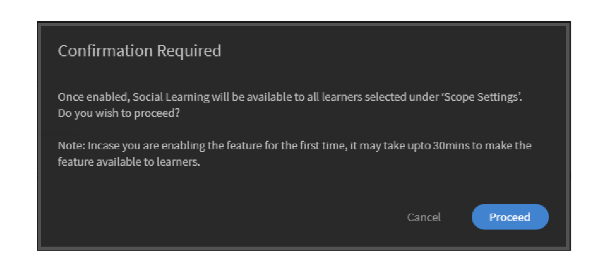
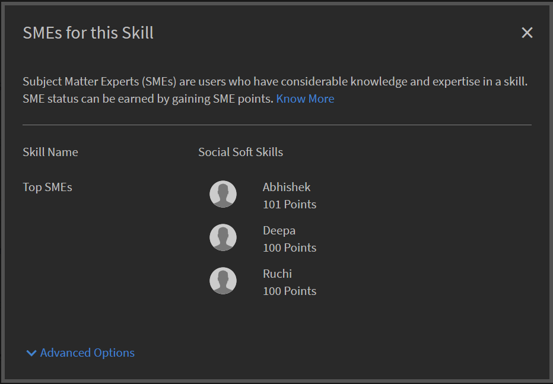

# Sociaal leren bewaken en modereren als beheerder

Als beheerder kunt u activiteiten die worden uitgevoerd in Sociaal leren inschakelen, uitschakelen en controleren. Als de functie Sociaal leren is ingeschakeld, kunnen studenten deze weergeven en deelnemen aan Sociaal leren.

## Instellingen in Sociaal leren inschakelen en configureren {#enableandconfiguresettingsinsociallearning}

Ga als volgt te werk om de functie Sociaal leren in te schakelen en te configureren:

1. Klikken **[!UICONTROL Sociaal leren]** in het linkernavigatievenster. U wordt omgeleid naar de activiteitenpagina.
1. Inschakelen **[!UICONTROL Sociaal leren]** met de **[!UICONTROL Inschakelen]** op de pagina Activiteit als u deze voor het eerst inschakelt. Anders kunt u deze vanuit de **[!UICONTROL Instellingen]** pagina.

   Er verschijnt een pop-updialoogvenster zoals het onderstaande screenshot.

    

   *Sociaal leren inschakelen*

<!--  -->

De beheerder kan instellingen voor Sociaal leren configureren. De instellingen omvatten typen inhoudsbeheerprogramma&#39;s zoals **[!UICONTROL Uitsluitend handmatig beheer]** en **[!UICONTROL Geen beheer]**. Bereik-instellingen kunnen op een ander bereik worden ingesteld, zoals het gebruikerstype (intern/extern) of andere actieve velden in het account. De beheerder kan het URL-pad instellen vanaf waar studenten de bureaubladtoepassing van de Adobe Learning Manager kunnen downloaden.

## Inhoud beheren {#contentcuration}

Aangezien Sociaal leren een informeel leerproces is, is de functionaliteit ervan vergelijkbaar met die van andere social-mediaplatforms. Mensen vinden sociale media vaak storend omdat ze vaak irrelevante content consumeren die hun productiviteit beïnvloedt. Deze gedachte kan worden aangepakt door contentmoderatie en -beheer.

**[!UICONTROL Uitsluitend handmatig beheer]** en **[!UICONTROL Geen beheer]** Dit zijn twee beheeropties die door de beheerder kunnen worden geselecteerd.

**[!UICONTROL Handmatig beheer met automatische hulp]:** Learning Manager beschikt over een engine voor automatisch beheer op basis van kunstmatige intelligentie die op intelligente wijze de essentie van de inhoud van elke indeling kan achterhalen die later aan de gewenste studenten kan worden aangeboden. Het kan ook goedkeuren of weigeren dat inhoud wordt gepost op basis van de gegeven vertrouwensscore.

Adarsh is bijvoorbeeld een student en vond een blog interessant, zodat hij het op het platform Sociaal leren van Adobe Learning Manager plaatst. Het bericht wordt vervolgens doorgegeven aan de AI-gestuurde Content Curation Engine, die de vaardigheden in de inhoud voorspelt en deze vaardigheden vergelijkt met de bijbehorende boardvaardigheden. Als een van de vaardigheden overeenkomt, wordt de inhoud gepost, anders wordt deze verzonden voor alleen handmatig beheer.

De minimaal vereiste vertrouwensscore voor het posten is 50%.

**[!UICONTROL Uitsluitend handmatig beheer]:** Om de authenticiteit van de inhoud te controleren voordat deze live gaat, kan de beheerder de instelling Uitsluitend handmatig beheer inschakelen. Als de instelling Uitsluitend handmatig beheer is ingeschakeld, gaat deze naar de beste SME&#39;s (maximaal 3) voor beheer. Op basis van de gemiddelde respons wordt het bericht goedgekeurd/afgewezen. Als de respons groter is dan 50 procent, gaat het bericht live en wordt het afgewezen. Voor meer informatie over het MKB: [hier klikken](social-learning-configurations-as-an-admin.md#SubjectMatterExpertsSMEs).

## Automatisch beheer van inhoud {#autocuration}

Het handmatig modereren van inhoud is vaak vatbaar voor fouten en vergt veel tijd. Bovendien is het proces niet schaalbaar en ongeschikt voor grote hoeveelheden sociale activiteiten. Daarom wordt het automatisch beheren van content van essentieel belang wanneer je veel gebruikers aanbiedt die sociaal actief zijn.

In Leerbeheer is er een optie om inhoud automatisch te beheren. Het beheer wordt aangestuurd door een engine met kunstmatige intelligentie, die werk toewijst aan de vooraf gedefinieerde vaardigheden, nadat de beheerder de vooraf gedefinieerde vaardigheden heeft toegewezen aan een vaardigheid. Zie voor meer informatie [Vaardigheidsdomeintoewijzing](curation-skills.md).

Bij automatisch beheer zijn de volgende typen inhoud toegestaan:

* PDF
* Audio- en videobestanden
* Presentations- PPT of PPTX
* Documenten - .doc, .docx

Een beheerder kan de optie inschakelen om inhoud automatisch te beheren vanuit de beheerdersapp.

1. Klik in het linkerdeelvenster van de Admin-app op **[!UICONTROL Sociaal leren]**.
1. Klik op het tabblad op de pagina **[!UICONTROL Instellingen]**.
1. De optie inschakelen **[!UICONTROL Handmatig beheer met automatische hulp]**.

   

   *Selecteer de optie Automatisch ondersteund handmatig beheer*

Wanneer een gebruiker inhoud op een board uploadt, wordt de tekst door een op AI gebaseerd algoritme van de inhoud verwijderd en wordt de tekst vervolgens doorgegeven aan de curation engine. De curation engine probeert de vaardigheden te vinden die aanwezig zijn in de inhoud.

De voorspelde vaardigheden uit de geüploade inhoud komen overeen met die van het board waarin de inhoud is geüpload.  Als een vaardigheid overeenkomt met een vertrouwensscore van meer dan 50% van de boardvaardigheid, wordt de inhoud op het board geplaatst. Als de vertrouwensscore minder dan 50% is, wordt de inhoud verzonden voor handmatig beheer.

Wanneer inhoud automatisch wordt beheerd, krijgt de gebruiker een melding dat de inhoud beschikbaar is op het board waar deze eerder is geüpload.

*Stroomschema van beheerinstellingen*

Het wordt aanbevolen dat de beheerder SME&#39;s toevoegt voor vaardigheden als Alleen handmatig beheer is ingeschakeld. De beheerder kan SME&#39;s toevoegen door SME-punten vooraf te verstrekken aan gebruikers met expertise in een vaardigheid. Meer informatie over het verschaffen van punten aan KMO&#39;s  [hier klikken](social-learning-configurations-as-an-admin.md#SubjectMatterExpertsSMEs).

**Geen beheer:** Alle berichten van de student worden automatisch geplaatst zonder moderatie van de inhoud.

<!---->

## Veelgestelde vragen over automatisch beheer van inhoud {#faq-auto-curation}

+++Hoeveel tijd krijgt een SME om een bericht te beheren?

Een SME krijgt minimaal 24 uur om een post te beheren. Vanwege tijdzoneverschillen kan de duur tot 47 uur worden verhoogd.

+++

+++Gaat het naar de volgende reeks van drie KMOs als alle drie beschikbaar zijn? Worden er altijd drie KMO&#39;s bij betrokken?

Het verzoek om beheer gaat de eerste dag naar de top van het MKB. Als ze niet reageren, gaat het verzoek de volgende dag naar de volgende drie SME&#39;s.

Als de drie nieuwe KMO&#39;s niet reageren, gaat het verzoek naar de moderators van de raad van bestuur.

Als de boardmoderators niet reageren, wordt het verzoek automatisch goedgekeurd.

+++

+++Als twee KMO&#39;s beheren en één niet, gaat het verzoek dan naar de vierde KMO of wordt in het verzoek het gemiddelde genomen van wat de eerste KMO-ronde de post beoordeelt?

Voor het goedkeuren van het bericht is een beoordeling van 50% vereist. Zo wordt ook een afwijzingsscore van 50% gebruikt om het bericht af te wijzen. Bij elke goedkeuring door een KMO wordt beoordeeld of deze 50% heeft bereikt.

Als het na één dag niet 50% bereikt, wordt het verzonden naar de volgende reeks kmo&#39;s die de vorige niet-beantwoorde beheersverzoeken verlopen.

Bijvoorbeeld, op de eerste dag, wordt het beheersverzoek verzonden naar drie KMO&#39;s; en één van hen keurt het goed, twee van hen antwoordden niet. Volgende dag gaat het verzoek om beheer naar de volgende reeks van drie KMO&#39;s; op dit niveau zijn er nu in totaal vier actieve KMO&#39;s. Minstens twee SEM&#39;s moeten het goedkeuren om de curatie te laten goedkeuren.(Als 2 goedkeurt en 2 afwijst, wordt alles wat de eerste 50% bereikt, uitgevoerd.)

+++

+++Van wat ik een &#39;moderator&#39; zie, wordt alleen toegewezen (en het is niet verplicht) wanneer iemand een nieuw board maakt. Wat is het nut voor een student om een &#39;moderator&#39; toe te wijzen aan een board als SME&#39;s worden toegewezen aan de vaardigheid waaraan een board is gekoppeld?

De volgende taken vallen onder de verantwoordelijkheid van een moderator van de sociale raad:

* Mogelijkheid om de boardnaam, beschrijving, zichtbaarheidsinstellingen van het board en andere configuratie te bewerken.
* Mogelijkheid om een bericht op het board te verwijderen als het bericht niet geschikt is voor het publiek.
* Moderator ontvangt meldingen van &#39;Misbruik rapporteren&#39; voor het board.
* Moderator ontvangt beheerverzoeken als er geen SME voor het board aanwezig is.

+++

+++Ons trainingsteam zal de vaardigheden toevoegen/controleren die zijn gekoppeld aan het vaardigheidsniveau en de SME&#39;s die zijn toegewezen aan de vaardigheden.

SME&#39;s worden toegevoegd/toegewezen op basis van vaardigheid, niet op basis van vaardigheidsniveau. Dit is zoals ontworpen.

+++

+++Wat is het verschil tussen een &#39;moderator&#39; van Sociaal leren en een &#39;SME&#39; van Sociaal leren?

**Moderatoren:** Secundaire eigenaars van het board. Ze worden toegevoegd door de makers terwijl het board wordt gemaakt, zodat ze het board kunnen besturen zonder dat er een maker is. Standaard is de maker van het board de moderator.

**SME:** SME&#39;s (Subject Matter Experts, vakexperts) zijn experts in specifieke vaardigheden. Beheerders kunnen SME&#39;s toewijzen aan een bepaalde vaardigheid om de inhoud van die vaardigheid te beheren. KMO&#39;s ontvangen de verzoeken om besturing voor boards die zijn gekoppeld aan hun vaardigheden. Studenten kunnen ook SME&#39;s worden door SME-punten op te halen.

+++

+++Als er twee of drie SME&#39;s zijn toegewezen aan een vaardigheid - Is een Sociaal leerprogramma na goedkeuring of afwijzing afhankelijk van het beheer van alle SME&#39;s of van wie dan ook als eerste cureert?

Voor het goedkeuren van het bericht is een beoordeling van 50% vereist. Zo wordt ook een afwijzingsscore van 50% gebruikt om het bericht af te wijzen. Bij elke goedkeuring door een KMO wordt beoordeeld of deze 50% heeft bereikt.

Als het na één dag niet 50% bereikt, wordt het verzonden naar de volgende reeks kmo&#39;s die de vorige niet-beantwoorde beheersverzoeken verlopen.

+++

## Bereik-instellingen {#scopesettings}

In Sociaal leren bepaalt een bereik de boards die u ziet, wat de zichtbaarheid van de inhoud bepaalt. Als een gebruiker een bereik heeft, bijvoorbeeld ***Leverancier_A***, kan hij/zij alleen boards en bijbehorende posten zien die zijn gecreëerd door anderen die tot hetzelfde bereik behoren ***Leverancier_A***.

Dit staat de Beheerders toe om een cohort van gebruikers, bijvoorbeeld, verkopers, partners of afdelingen in een afzonderlijke organisatie te handhaven.

Schakel Sociaal leren en leaderboard in voor zowel interne als externe gebruikers.

Er zijn afzonderlijke secties om interne en externe gebruikers in te schakelen.

**Inschakelen voor interne studenten**

In deze sectie kunt u de gebruikerskenmerken kiezen om het bereik van Sociaal leren voor interne gebruikers te definiëren. Gebruikers met dezelfde kenmerken **value** deel dezelfde ruimte voor Sociaal leren.

Van de **Gebruikerskenmerk** de gewenste optie te kiezen.

*Selecteer de gebruikerskenmerken om het bereik te definiëren*

Standaard kunt u de optie **[!UICONTROL Alle interne gebruikers]** in de vervolgkeuzelijst Gebruikerseigenschappen is altijd geselecteerd.

U kunt het bereik van interne gebruikers bepalen op basis van hun actieve velden.

**Inschakelen voor externe studenten**

Gebruik een extern profiel om het leerbereik voor externe gebruikers te definiëren. Studenten met hetzelfde externe profiel delen een gemeenschappelijke ruimte voor Sociaal leren.

*Reikwijdte voor externe studenten inschakelen*

Het bereik van externe gebruikers wordt bepaald op basis van hun externe profielen.

Als u bijvoorbeeld in de bovenstaande lijst **[!UICONTROL Acme Corp]** Alle studenten die tot Acme Corp behoren, kunnen de boards zien die ze hebben gemaakt. Als u de optie uitschakelt **Henry Cavill**, kunnen de studenten geen boards zien die door Henry Cavill zijn gemaakt.

De beheerder kan de zichtbaarheid van de inhoud uitbreiden op basis van het actieve veld dat wordt weergegeven in het dialoogvenster **[!UICONTROL Gebruikerskenmerk]** veld.

De beheerder kan bijvoorbeeld het bereik instellen op **[!UICONTROL Gebruikerstype (intern/extern)]** gebruikers. Wanneer u het bereik instelt op gebruikerstype, is de inhoud die door een interne student op het platform Sociaal leren wordt gedeeld, alleen zichtbaar voor andere interne studenten in de organisatie, niet voor externe gebruikers en omgekeerd.

Nadat een gebruikerskenmerk door de beheerder is geselecteerd, kan hij of zij de functie Sociaal leren beperken tot studenten en studentengroepen door het selectievakje onder het veld Gebruikerskenmerk in te schakelen. Klik op het waardeveld om de student of studentengroepen te selecteren waarvoor u de functie Sociaal leren wilt inschakelen.

Standaard wordt het bereik ingesteld door de **[!UICONTROL Gebruikerstype]** Dit zijn interne of externe studenten.

Als het actieve veld geen waarde bevat, wordt de opdracht **[!UICONTROL Waarde]** vervolgkeuzelijst met velden is niet zichtbaar voor de beheerder.

<!-- -->

Gebruikers kunnen hun inhoud ook plaatsen met de Adobe Learning Manager-bureaubladtoepassing. Afhankelijk van of u een Mac- of Windows-gebruiker bent, klikt u op de opgegeven koppelingen om de bureaubladtoepassing te downloaden en volgt u de stappen om deze op uw systeem te installeren. Als u problemen ondervindt bij de installatie, [hier klikken](../../kb/troubleshooting-issues-with-adobe-learning-manager-desktop-app.md).

## Machtigingen voor maken van board {#permission}

Om het maken van boards door alle studenten te beperken en de boards effectief te modereren, kan een beheerder een bepaalde groep gebruikers machtigingen verlenen om boards te maken.

*Machtigingen instellen om een board te maken*

Standaard kunt u de optie **[!UICONTROL Alle studenten]** is ingeschakeld.

**[!UICONTROL Alle studenten]:** Als u deze optie kiest, kunnen alle interne en externe gebruikers boards maken.

**Een groep studenten:** Als u deze optie kiest, zien alleen gebruikers met machtigingen voor het maken van een board de **[!UICONTROL Nieuw board maken]** link in Sociaal leren. Kies de gebruikersgroep waarvoor u toestemming moet krijgen om een board te maken. U kunt ook automatisch gegenereerde en aangepaste gebruikersgroepen toevoegen.

<!---->

Gebruikers die hetzelfde bereik hebben, kunnen alleen het board zien. Voor gebruikers die geen machtigingen hebben, wordt de **[!UICONTROL Nieuw board maken]** koppeling blijft onzichtbaar.

Wacht 60 minuten voordat de wijzigingen van kracht worden.

## Speciale gebruikers {#privilege}

Een beheerder kan een gebruikersgroep speciale bevoegdheden geven op basis waarvan leden van de groep aan alle boards kunnen deelnemen. Eventuele beperkingen die zijn ingesteld in de sectie Omvanginstellingen worden omzeild door de speciale gebruikersgroep.

De gebruikersgroep kan automatisch worden gegenereerd of aangepast.

Een gebruiker aan wie dit recht is verleend, heeft toegang tot alle boards, behalve **privéboards**.

*Speciale rechten verlenen*

Wanneer de beheerder een gebruikersgroep selecteert, hebben standaard alle gebruikers in de groep toegang tot alle boards, ongeacht het bereik van de gebruiker. Elke gebruiker met deze verhoogde rechten kan alle interne en externe boards bekijken en eraan deelnemen.

Speciale gebruikers ontvangen beheerverzoeken voor alle bereiken als gebruikers over voldoende SME-punten voor die vaardigheid beschikken.

Als de gebruiker niet over de vereiste SME-punten beschikt, worden de beheerbevoegdheden doorgegeven aan de top drie SME&#39;s van die vaardigheid.

In het nieuwe bereik krijgt hij/zij punten voor activiteiten op verschillende boards.

Op de secties van het Sociaal leaderboard kan een gebruiker alle gebruikers van zijn/haar bereik zien, samen met speciale gebruikers.

Als u speciale gebruikersrechten hebt gekregen, kunt u alle gebruikers in het account op uw leaderboard zien, ongeacht het bereik van de gebruikers.

Als speciale gebruikers SME&#39;s worden door voldoende punten te behalen, worden ze weergegeven in de **[!UICONTROL Toonaangevende vakexperts]** op het board van de sociale leider.

Wacht 60 minuten voordat de wijzigingen van kracht worden.

## De sociale banner aanpassen {#customize-social-banner}

De beheerder kan de titel en de subtitel aanpassen die worden weergegeven in de koptekstafbeelding op de startpagina voor Sociaal leren. Wat de beheerder ook als titel en subtitel besluit in te voeren, dezelfde functies op de startpagina voor sociaal leren van de student.

1. Klik in de Admin-app op **[!UICONTROL Sociaal leren]** > **[!UICONTROL Instellingen]**.
1. Klikken **[!UICONTROL Aanpassen]**.
1. Wijzig de bannerafbeelding. De afmetingen van de afbeelding moeten ten minste **1600 px X 240 px**.
1. Schakel de optie in om de **[!UICONTROL Meer informatie]** koppeling op de banner.
1. Voer de titel en de subtitel in de onderstaande velden in:

   

   *De sociale banner aanpassen*

U hebt nog een paar andere opties:

* **[!UICONTROL Taal]:** Kies in de vervolgkeuzelijst de taal waarin u de titel en de ondertitel wilt vertalen. U kunt ook aangepaste tekst voor verschillende talen toevoegen.
* **[!UICONTROL Repliceren]:** Klik op deze knop om de titel en de subtitel in alle talen te repliceren.
* **[!UICONTROL Herstellen]:** Klik op deze knop om terug te keren naar de oorspronkelijke titel en subtitel.

Op de startpagina Sociaal leren wordt de door de beheerder verschafte informatie weergegeven als de paginakop.

<!---->

## Trends {#trends}

De trends in de sociale activiteit van studenten kunnen worden bekeken en bijgehouden op het tabblad Activiteit in de trendssectie. Deze gegevens kunnen worden bekeken voor verschillende tijdsperioden, zoals afgelopen zeven dagen, vorige maand, afgelopen drie maanden en altijd.

De laatste zeven dagen is de standaardwaarde in het datumfilter.

>[!NOTE]
>
>De laatste zeven dagen is de standaardwaarde in het datumfilter.

De beheerder krijgt de volgende informatie te zien voor de periode die is geselecteerd met het datumfilter:

1. **[!UICONTROL Nieuwe berichten]**: Hiermee geeft u het aantal nieuwe berichten weer dat binnen de datumperiode is gemaakt. Ook wordt het totale aantal berichten voor de hele periode weergegeven.
1. **[!UICONTROL Percentage actieve gebruikers]**: Geeft het totale percentage actieve gebruikers in Sociaal leren weer in verhouding tot het totale aantal gebruikers dat beschikbaar is in het account.
1. **[!UICONTROL Nieuwe boards]**: Hiermee geeft u het aantal nieuwe boards weer dat is gemaakt. Ook wordt het totale aantal boards voor de volledige periode weergegeven.

De tweede visuele weergave is een lijngrafiek die de trend weergeeft van het aantal boards of berichten dat is gemaakt op basis van de periode die is geselecteerd met het datumfilter. Klik op het filter om de verschillende tijdopties weer te geven, zoals afgelopen zeven dagen, vorige maand, afgelopen drie maanden en altijd.

*LIngrafiek met de trend*

## Vaardigheden {#skills}

In deze sectie kunt u alle vaardigheden bekijken die zijn gebruikt op het platform voor sociale activiteit. De beheerder kan het zoekveld gebruiken om te zoeken naar een vaardigheid die nog niet wordt gebruikt tijdens het maken van een board en om SME&#39;s hieraan toe te wijzen. Hierdoor krijgen SME&#39;s een melding wanneer een board wordt gemaakt met behulp van deze vaardigheid en kunnen ze het bericht bekijken als onderdeel van de workflow voor handmatig beheer.

Als Sociaal leren is uitgeschakeld voor een account, worden er geen vaardigheden weergegeven. De zoekbalk is ook beschikbaar voor dergelijke accounts, zodat de beheerder de functionaliteit heeft om een vaardigheid te zoeken en SME&#39;s aan de vaardigheid toe te voegen.

De beheerder kan de activiteitsscore, het aantal berichten, boards, gebruikers en de naam van SME&#39;s bekijken voor elke vaardigheid die tijdens het maken van een board of bericht is gebruikt.

<!---->

<table>
 <tbody>
  <tr>
   <td>
    
<b>Sl. Nee.</b>
</td>
   <td>
    
<b>Kolomnaam</b>
</td>
   <td>
    
<b>Uitleg</b>
</td>
  </tr>
  <tr>
   <td>
    
1
</td>
   <td>
    
Naam vaardigheid
</td>
   <td>
    
Hiermee geeft u namen weer van vaardigheden die worden gebruikt in Sociaal leren.
</td>
  </tr>
  <tr>
   <td>
    
2
</td>
   <td>
    
Activiteitsscore
</td>
   <td>
    
Geeft de som van de activiteitspunten weer van alle boards die bij de vaardigheid horen.
</td>
  </tr>
  <tr>
   <td>
    
3
</td>
   <td>
    
Berichten
</td>
   <td>
    
Geeft het totale aantal berichten weer dat met een vaardigheid is gemaakt.
</td>
  </tr>
  <tr>
   <td>
    
4
</td>
   <td>
    
Boards
</td>
   <td>
    
Geeft het totale aantal boards weer dat met een vaardigheid is gemaakt.
</td>
  </tr>
  <tr>
   <td>
    
5
</td>
   <td>
    
Gebruikers
</td>
   <td>
    
Geeft het totale aantal studenten weer dat die vaardigheid heeft gebruikt.
</td>
  </tr>
  <tr>
   <td>
    
6
</td>
   <td>
    
KMO's
</td>
   <td>
    
Geeft de huidige top 3 van SME's voor die vaardigheid weer. Beheerders kunnen SME's toevoegen of wijzigen door op de koppeling te klikken.
</td>
  </tr>
 </tbody>
</table>

## Vaardigheidsdomein {#skilldomain}

Op basis van de vaardigheden die vooral worden gebruikt door eindgebruikers van Learning Manager, heeft Adobe Learning Manager een lijst van 25 vaardigheidsdomeinen gecategoriseerd die het systeem voor automatisch beheer gebruikt om inhoud te beheren. De beheerder moet de geconfigureerde bedrijfsvaardigheden toewijzen aan de vaardigheidsdomeinen die Prime verschaft. U kunt vaardigheden toewijzen vanaf de beheerpagina tijdens het maken van een vaardigheid of door een bestaande vaardigheid te wijzigen. Voor meer informatie over het toewijzen of toevoegen van een vaardigheid: [hier klikken](skills-levels.md#Createaskillandalevel).

+++Lijst van vaardigheidsdomeinen die door het het beheerssysteem van de Leermanager worden gebruikt

1. Accounting
1. Analytics
1. Zakelijke ethiek
1. Bedrijfsrecht
1. Bedrijfsproces
1. Computerbeveiliging
1. Customer Relationship Management
1. Ontwerp
1. Financiën
1. Personeelsbeheer
1. Informatietechnologie
1. Leren
1. Management
1. Marketing
1. Geneesmiddel
1. Productie en fabricage
1. Kwaliteitsbeheer
1. Verkoop
1. Wetenschappelijk onderzoek en engineering
1. Sociale media
1. Zachte vaardigheden
1. Strategisch beheer
1. Beheer van de toeleveringsketen
1. Technische communicatie
1. Werkplekveiligheid

+++

## SME&#39;s (Subject Matter Experts) {#subjectmatterexpertssmes}

**Expert aan het onderwerp** zijn mensen die een aanzienlijke kennis en deskundigheid in een vaardigheid hebben. An **MKB** speelt een belangrijke rol in Sociaal leren wanneer de beheerder de beheerinstellingen als handmatig heeft ingesteld of wanneer de methode voor automatisch beheer geen beheer van de inhoud biedt. Alleen de bovenste drie SME&#39;s worden weergegeven in de kolom SME&#39;s.

## Vereisten om een KMO te zijn {#requirementstobeansme}

SME-status kan alleen worden verkregen door SME-punten te verdienen via activiteiten in Sociaal leren. De beheerder kan punten toewijzen aan een SME op basis van zijn expertise op vaardigheidsniveau.

## SME&#39;s aan een vaardigheid toevoegen {#addingsmestoaskill}

Voer de volgende stappen uit om SME&#39;s aan een vaardigheid toe te voegen:

1. Klikken **[!UICONTROL SME&#39;s toevoegen]** of **[!UICONTROL SME&#39;s wijzigen]**.

   

   *SME toevoegen of wijzigen*

1. Klikken **[!UICONTROL Geavanceerde opties]** in het pop-updialoogvenster.

   

   *Dialoogvenster Geavanceerde opties weergeven*

1. Zoek naar de gebruiker met expertise in de vaardigheid. Wanneer de gebruiker is gevonden, typt u het aantal punten dat u hem of haar wilt geven in het dialoogvenster **Punten toevoegen** invoervak.

   Als de gebruiker al punten heeft, wordt het aantal nieuwe punten dat aan de gebruiker wordt gegeven, opgeteld bij het huidige aantal punten.

   Standaard is het huidige punt 0 voor elke nieuwe gebruiker in Sociaal leren.

   

   *Punten toevoegen voor een gebruiker*

1. Als u **[!UICONTROL Minimaal aantal SME-punten inschakelen]** kunt u een limiet instellen voor het minimumaantal punten dat een gebruiker nodig heeft om als SME te worden weergegeven in de lijst met Top SME&#39;s. Als de drempelwaarde eenmaal is ingesteld, worden SME&#39;s met punten die kleiner zijn dan of gelijk zijn aan de vereiste minimumpuntwaarde niet vermeld in de SME-lijsten.

   Als de **[!UICONTROL Minimaal aantal SME-punten inschakelen]** niet is geselecteerd, worden de drie hoogste gebruikers met de hoogste punten beschouwd als SME&#39;s voor die specifieke vaardigheid.

1. Klikken **[!UICONTROL Opslaan]** om de aangebrachte wijzigingen weer te geven.

## SME-puntsysteem {#smepointsystem}

**SME&#39;s krijgen een aantal punten toegewezen op basis van het volgende:**

* Een gebruiker krijgt 2 punten telkens wanneer een andere gebruiker een door hem/haar gemaakt bericht uploadt.
* Een gebruiker krijgt 2 punten telkens wanneer een andere gebruiker zijn of haar opmerking uploadt.
* Een student krijgt 5 punten voor het beantwoorden van een vraag.
* Telkens wanneer het gegeven antwoord een upvote krijgt, krijgen de studenten nog 2 punten.

## SME-statuspunten gebaseerd op beheeractiviteiten {#smestatuspointsbasedoncurationactivity}

**SME&#39;s krijgen ook punten toegewezen op basis van beheeractiviteiten voor:**

* Wanneer een bericht wordt verzonden voor handmatig beheer omdat de automatische curatie niet zeker is of de inhoud relevant is of niet, krijgt de SME 5 punten bij het indienen van moderatie.

## Configuraties downloaden {#downloadconfigurations}

<!---->

Voor Enterprise Servers kan de beheerder de locatie wijzigen waar studenten de bureaubladtoepassing voor zowel Windows als Mac kunnen downloaden.

*De downloadlocatie wijzigen*

De Enterprise Server URL moet openbaar worden gehost.

## Sociale activiteiten voor maandelijkse factureringsplannen voor actieve gebruikers {#socialactivitiesformonthlyactiveusersbillingplan}

Telkens wanneer een gebruiker een nieuw sociaal board, een sociaal bericht of een opmerking op een sociaal niveau maakt, telt dit mee als geldige activiteit die in mindering moet worden gebracht op het **Maandelijkse activeringsgebruiker**(MAU) als het account het MAU-factureringsmodel volgt. Raadpleeg voor meer informatie [factureringsbeheer](billing-management.md).

## Veelgestelde vragen {#frequentlyaskedquestions}

+++Hoe kan ik Sociaal leren inschakelen voor externe studenten?

In **[!UICONTROL Sociaal leren]** > **[!UICONTROL Instellingen]** Schakel in de sectie Omvanginstellingen de optie **[!UICONTROL Inschakelen voor externe studenten]**. Kies een extern profiel in de vervolgkeuzelijst en definieer het leerbereik voor dat profiel.

*Selecteer de optie Inschakelen voor externe studenten*
+++
