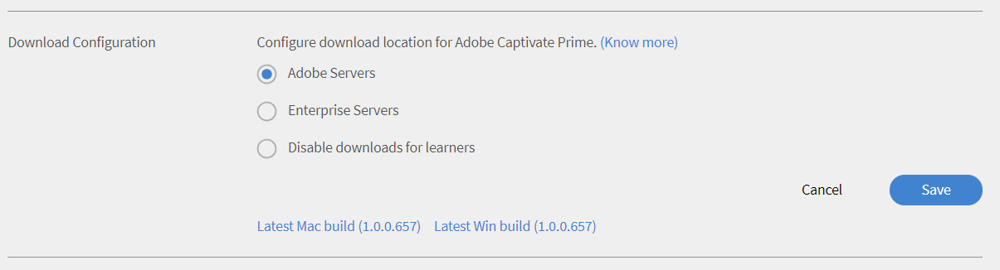
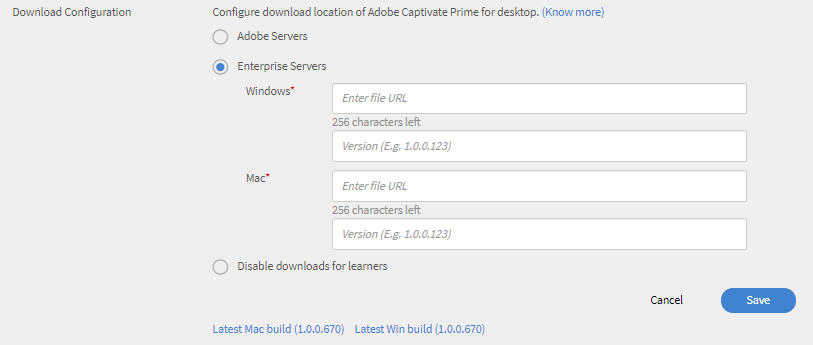
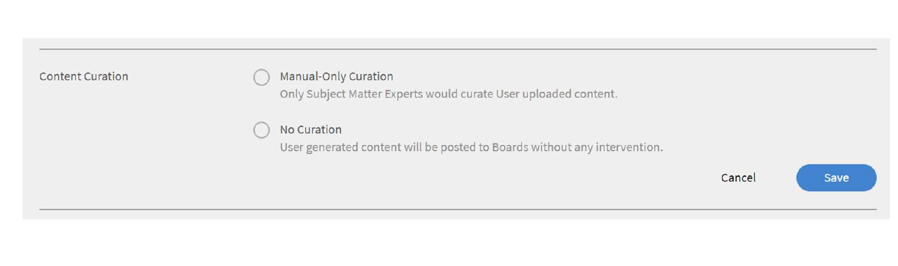

# Als beheerder Sociaal leren bewaken en modereren

U kunt als beheerder de activiteiten die zijn uitgevoerd in Sociaal leren inschakelen, uitschakelen en bewaken. Wanneer de functie Sociaal leren is ingeschakeld, kunnen studenten dit weergeven en gaan deelnemen aan Sociaal leren.

Met Sociaal leren kunnen studenten overal studeren en inhoud delen met hun collega&#39;s. Met deze functie kunnen studenten communiceren, ideeën uitwisselen en samenwerken om hun algemene leerervaring te verbeteren.

## Instellingen in Sociaal leren inschakelen en configureren {#enableandconfiguresettingsinsociallearning}

U kunt als volgt de functie Sociaal leren inschakelen en configureren:

1. Klik op **[!UICONTROL Sociaal leren]** in het linker navigatiepaneel. U wordt omgeleid naar de activiteitenpagina.
1. Inschakelen **[!UICONTROL Sociaal leren]** met de **[!UICONTROL Inschakelen]** op de pagina Activiteit als u deze voor het eerst inschakelt. Anders kunt u deze vanuit de **[!UICONTROL Instellingen]** pagina.

   Er verschijnt een pop-upvenster zoals de onderstaande schermafdruk.

    

   *Sociaal leren inschakelen*

<!--  -->

De beheerder kan instellingen voor Sociaal leren configureren. De instellingen omvatten typen inhoudsbeheerprogramma&#39;s zoals **[!UICONTROL Uitsluitend handmatig beheer]** en **[!UICONTROL Geen beheer]**. Bereik-instellingen kunnen op een ander bereik worden ingesteld, zoals het gebruikerstype (intern/extern) of andere actieve velden in het account. Een beheerder kan het URL-pad instellen via welke studenten de Adobe Learning Manager-desktopapp kunnen downloaden.

### Inhoudsbeheer {#contentcuration}

Aangezien Sociaal leren een informele manier van leren is, is de functionaliteit vergelijkbaar met alle social media. Mensen vinden sociale media vaak storend omdat ze vaak irrelevante content consumeren die hun productiviteit beïnvloedt. Dit kan worden verholpen door inhoud te modereren en te beheren.

**[!UICONTROL Uitsluitend handmatig beheer]** en **[!UICONTROL Geen beheer]** Dit zijn twee beheeropties die door de beheerder kunnen worden geselecteerd.

**[!UICONTROL Handmatig beheer met automatische hulp]:** Learning Manager beschikt over een engine voor automatisch beheer op basis van kunstmatige intelligentie die op intelligente wijze de essentie van de inhoud van elke indeling kan achterhalen die later aan de gewenste studenten kan worden aangeboden. Het kan ook goedkeuren of weigeren dat inhoud wordt gepost op basis van de gegeven vertrouwensscore.

Adarsh is bijvoorbeeld een student en heeft een blog interessant gevonden, zodat hij het op het platform voor Sociaal leren van Adobe Learning Manager plaatst. Het bericht wordt vervolgens doorgegeven aan de AI-gestuurde Content Curation Engine, die de vaardigheden in de inhoud voorspelt en deze vaardigheden vergelijkt met de bijbehorende boardvaardigheden. Als een van de vaardigheden overeenkomt, wordt de inhoud gepost, anders wordt deze verzonden voor alleen handmatig beheer.

De minimaal vereiste vertrouwensscore voor het posten is 50%.

**[!UICONTROL Uitsluitend handmatig beheer]:** Om de authenticiteit van de inhoud te controleren voordat deze live gaat, kan de beheerder de instelling Uitsluitend handmatig beheer inschakelen. Wanneer de instelling Uitsluitend handmatig beheer eenmaal is ingeschakeld, gaat de inhoud naar de beste SME&#39;s (maximaal drie) voor beheer. Op basis van de gemiddelde respons wordt het bericht goedgekeurd/afgewezen. Als de respons groter is dan of gelijk is aan 50 procent, gaat het bericht live. Anders wordt het afgewezen. [Klik hier](social-learning-configurations-as-an-admin.md#SubjectMatterExpertsSMEs) voor meer informatie over SME&#39;s.

In het nieuwe bereik krijgt hij/zij punten voor activiteiten op boards.

In de secties voor sociaal leaderboard ziet een gebruiker alle gebruikers in zijn/haar bereik, samen met speciale gebruikers.

Als u speciale gebruikersbevoegdheden hebt gekregen, kunt u alle gebruikers in het account op uw leaderboard zien, ongeacht het bereik van de gebruikers.

Als speciale gebruikers SME&#39;s worden door voldoende punten te behalen, worden ze weergegeven in de **[!UICONTROL Toonaangevende vakexperts]** op het board van de sociale leider.

Wacht 60 minuten totdat de wijzigingen worden doorgevoerd.

### Omvanginstellingen {#scopesettings}

In Sociaal leren bepaalt een bereik de boards die u kunt zien, wat bepalend is voor de zichtbaarheid van de inhoud.  Als een gebruiker een bereik heeft, bijvoorbeeld ***Leverancier_A***, kan hij/zij alleen boards en bijbehorende posten zien die zijn gecreëerd door anderen die tot hetzelfde bereik behoren ***Leverancier_A***.

Met deze functie kunnen beheerders gebruikersgroepen apart beheren, zoals leveranciers, partners of afdelingen van een organisatie.

Schakel Sociaal leren en leaderboards in voor zowel interne als externe gebruikers.

Er zijn apart secties om dit voor interne en externe gebruikers in te schakelen.

**Inschakelen voor interne studenten**

In deze sectie kunt u de gebruikerskenmerken kiezen om het bereik van Sociaal leren voor interne gebruikers te definiëren. Gebruikers met dezelfde kenmerken **value** deel dezelfde ruimte voor Sociaal leren.

Van de **Gebruikerskenmerk** de gewenste optie te kiezen.

*Selecteer de gebruikerskenmerken om het bereik te definiëren*

Standaard kunt u de optie **[!UICONTROL Alle interne gebruikers]** in de vervolgkeuzelijst Gebruikerseigenschappen is altijd geselecteerd.

U kunt het bereik van interne gebruikers bepalen op basis van hun actieve velden.

**Inschakelen voor externe studenten**

Gebruik een extern profiel om het bereik van leermateriaal voor externe gebruikers te bepalen.  Studenten met hetzelfde externe profiel delen een gemeenschappelijke ruimte in Sociaal leren.

*Reikwijdte voor externe studenten inschakelen*

Het bereik van externe gebruikers wordt bepaald op basis van hun externe profiel.

Als u bijvoorbeeld in de bovenstaande lijst **[!UICONTROL Acme Corp]** inschakelt, zien alle studenten die tot Acme Corp behoren de boards die ze hebben gemaakt.  Als u de optie **Henry Cavill** uitschakelt, kunnen studenten geen boards zien die door Henry Cavill zijn gemaakt.

Een beheerder kan de omvang van de zichtbaarheid van inhoud bepalen op basis van het actieve veld dat wordt vermeld in het veld **[!UICONTROL Gebruikerskenmerk]**.

De beheerder kan de omvang bijvoorbeeld instellen op **[!UICONTROL Gebruikerstype (intern/extern)]**. Wanneer u het bereik instelt op gebruikerstype, is de inhoud die door een interne student op het platform Sociaal leren wordt gedeeld, alleen zichtbaar voor andere interne studenten in de organisatie, niet voor externe gebruikers en omgekeerd.

Nadat een gebruikerskenmerk door de beheerder is geselecteerd, kan hij of zij de functie Sociaal leren beperken tot studenten en studentgroepen door het vakje onder het veld Gebruikerskenmerk aan te vinken. Klik op het waardeveld om de student of studentgroepen te selecteren waarvoor u de functie Sociaal leren wilt inschakelen.

Standaard wordt het bereik ingesteld door de **[!UICONTROL Gebruikerstype]** Dit zijn interne of externe studenten.

Als het actieve veld geen waarde bevat, is de vervolgkeuzelijst van het veld **[!UICONTROL Waarde]** niet zichtbaar voor de beheerder.

<!-- -->

Gebruikers kunnen hun inhoud ook plaatsen met de Adobe Learning Manager-bureaubladtoepassing. Afhankelijk van of u een Mac- of Windows-gebruiker bent, klikt u op de link voor het downloaden van uw desktopapp en volgt u de stappen om de app op uw systeem te installeren. [Klik hier](../../kb/troubleshooting-issues-with-adobe-learning-manager-desktop-app.md) als u problemen ondervindt bij de installatie.

### Configuraties downloaden {#downloadconfigurations}

<!---->

Voor Enterprise-servers kan de beheerder de locatie wijzigen waar studenten de desktopapp voor Windows en Mac kunnen downloaden.

*De downloadlocatie wijzigen*

De URL van de Enterprise-server moet openbaar worden gehost.

### Machtigingen voor het maken van boards {#permission}

Om het maken van boards door alle studenten te beperken en de boards op een efficiënte manier te modereren, kan een beheerder aan een selecte gebruikersgroep toestemming geven om boards te maken.

*Machtigingen instellen om een board te maken*

Standaard is de optie **[!UICONTROL Alle studenten]** ingeschakeld.

**[!UICONTROL Alle studenten]:** Als u deze optie kiest, kunnen alle interne en externe gebruikers boards maken.

**Een groep studenten:** als u deze optie kiest, zien alleen gebruikers met de machtiging om boards te maken de link **[!UICONTROL Nieuw board maken]** in Sociaal leren.  Kies de gebruikersgroep waarvoor u toestemming moet krijgen om een board te maken. U kunt ook automatisch gegenereerde en aangepaste gebruikersgroepen toevoegen.

<!---->

Het board is alleen zichtbaar voor gebruikers met hetzelfde bereik.  Voor gebruikers die geen toestemming hebben, is de link **[!UICONTROL Nieuw board maken]** niet zichtbaar.

Wacht 60 minuten totdat de wijzigingen worden doorgevoerd.

## Speciale gebruikers {#privilege}

Een beheerder kan een gebruikersgroep speciale bevoegdheden geven op basis van welke groepsleden aan alle boards kunnen deelnemen. Beperkingen die zijn ingesteld in het gedeelte Omvanginstellingen worden omzeild door de speciale gebruikersgroep.

De gebruikersgroep kan automatisch gegenereerd of aangepast zijn.

Een gebruiker aan wie deze bevoegdheid is verleend, heeft toegang tot alle boards, behalve **privéboards**.

*Speciale rechten verlenen*

Wanneer de beheerder een gebruikersgroep selecteert, krijgen standaard alle gebruikers in de groep toegang tot alle boards, ongeacht het bereik van de gebruiker. Elke gebruiker met deze extra bevoegdheden kan alle interne en externe boards bekijken en eraan deelnemen.

Speciale gebruikers ontvangen verzoeken voor inhoudsbeheer in alle bereiken als gebruikers voldoende SME-punten hebben voor die vaardigheid.

Als de gebruiker niet over de vereiste SME-punten beschikt, worden de bevoegdheden voor inhoudsbeheer doorgegeven aan de top drie vakexperts voor die vaardigheid.

In het nieuwe bereik krijgt hij/zij punten voor activiteiten op boards.

In de secties voor sociaal leaderboard ziet een gebruiker alle gebruikers in zijn/haar bereik, samen met speciale gebruikers.

Als u speciale gebruikersbevoegdheden hebt gekregen, kunt u alle gebruikers in het account op uw leaderboard zien, ongeacht het bereik van de gebruikers.

Als speciale gebruikers SME&#39;s worden door voldoende punten te behalen, worden ze weergegeven in de **[!UICONTROL Toonaangevende vakexperts]** op het board van de sociale leider.

Wacht 60 minuten totdat de wijzigingen worden doorgevoerd.

### De social-banner aanpassen {#customize-social-banner}

De beheerder kan de titel en de subtitel aanpassen die worden weergegeven in de koptekstafbeelding op de startpagina voor Sociaal leren. Wat de beheerder ook als titel en subtitel besluit in te voeren, dezelfde functies op de startpagina voor sociaal leren van de student.

1. Klik in de Admin-app op **[!UICONTROL Sociaal leren]** > **[!UICONTROL Instellingen]**.
1. Klikken **[!UICONTROL Aanpassen]**.
1. Wijzig de bannerafbeelding. De afmetingen van de afbeelding moeten ten minste **1600 px X 240 px**.
1. Schakel de optie in om de **[!UICONTROL Meer informatie]** koppeling op de banner.
1. Voer de titel en de subtitel in de onderstaande velden in:

   

   *De sociale banner aanpassen*

U hebt een paar andere opties:

* **[!UICONTROL Taal]:** Kies in de vervolgkeuzelijst de taal waarin u de titel en de ondertitel wilt vertalen. U kunt ook aangepaste tekst voor verschillende talen toevoegen.
* **[!UICONTROL Repliceren]:** Klik op deze knop om de titel en de subtitel in alle talen te repliceren.
* **[!UICONTROL Herstellen]:** Klik op deze knop om terug te keren naar de oorspronkelijke titel en subtitel.

  De informatie van de beheerder wordt op de startpagina Sociaal leren als de paginakoptekst weergegeven.

  <!---->

### Weergave Sociaal leren

Een beheerder kan de weergave Sociaal leren selecteren uit de volgende instellingen:

* Weergave na - Als u deze optie selecteert, worden de afzonderlijke berichten van alle boards weergegeven.
* Boardweergave - Als u deze optie selecteert, worden alle beschikbare boards weergegeven.

## Automatisch beheer van inhoud {#autocuration}

Het handmatig modereren van inhoud is vaak onderhevig aan fouten en neemt veel tijd in beslag. Bovendien is het proces niet schaalbaar en niet geschikt voor hoge volumes van sociale activiteiten. Daarom wordt het automatisch beheren van inhoud belangrijk wanneer er sprake is van veel gebruikers die sociaal actief zijn.

Learning Manager bevat een optie voor het automatisch beheren van inhoud. Het beheer is gebaseerd op een engine met AI-capaciteiten, die werk toewijst aan vooraf gedefinieerde vaardigheden nadat de beheerder de vooraf gedefinieerde vaardigheden heeft toegewezen aan een vaardigheid. Zie [Toewijzing van vaardigheden aan domeinen](curation-skills.md) voor meer informatie.

Bij automatisch beheer zijn de volgende typen inhoud toegestaan:

* PDF
* Audio- en videobestanden
* Presentaties: PPT of PPTX
* Documenten: .doc, .docx

Een beheerder kan de optie inschakelen om inhoud automatisch te beheren vanuit de Administrator-app.

1. Klik op **[!UICONTROL Sociaal leren]** in het linkerdeelvenster van de Admin-app.
1. Klik op het tabblad **[!UICONTROL Instellingen]** op de pagina.
1. Schakel de optie **[!UICONTROL Handmatig inhoudsbeheer met automatische hulp]** in.

   

   *Selecteer de optie Automatisch ondersteund handmatig beheer*

Wanneer een gebruiker inhoud op een bord uploadt, schraapt een op AI gebaseerd algoritme de tekst als het ware uit de inhoud en wordt de tekst vervolgens doorgegeven aan de curation engine. De curation engine probeert de vaardigheden te vinden die aanwezig zijn in de inhoud.

De voorspelde vaardigheden uit de geüploade inhoud komen overeen met die van het board waarin de inhoud is geüpload.  Als een vaardigheid overeenkomt met een vertrouwensscore van meer dan 50% van de boardvaardigheid, wordt de inhoud op het board geplaatst. Als de vertrouwensscore minder dan 50% is, wordt de inhoud verzonden voor handmatig beheer.

Wanneer inhoud automatisch wordt beheerd, ontvangt de gebruiker een melding dat de inhoud beschikbaar is op het board waarnaar het eerder is geüpload.

*Stroomschema van beheerinstellingen*

Het wordt aanbevolen dat de beheerder SME&#39;s toevoegt voor vaardigheden als Alleen handmatig beheer is ingeschakeld. Een beheerder kan SME&#39;s toevoegen door gebruikers met een expertise in de vaardigheid vooraf te voorzien van SME-punten. Meer informatie over het verschaffen van punten aan KMO&#39;s  [hier klikken](social-learning-configurations-as-an-admin.md#SubjectMatterExpertsSMEs).

**Geen beheer:** Alle berichten van de student worden automatisch geplaatst zonder moderatie van de inhoud.

<!---->

## Veelgestelde vragen over automatisch beheer van inhoud {#faq-auto-curation}

+++Hoeveel tijd krijgt een SME om een bericht te beheren?

Een SME heeft ongeveer 24 uur om een bericht te beheren. Vanwege tijdzoneverschillen kan de duur tot 47 uur worden verhoogd.

+++

+++Gaat het naar de volgende reeks van drie KMOs als alle drie beschikbaar zijn? Zijn er altijd drie SME&#39;s betrokken?

Het verzoek om beheer gaat op de eerste dag naar de eerste drie SME&#39;s. Als zij niet reageren, gaat het verzoek de volgende dag naar de volgende drie SME&#39;s.

Als deze drie ook niet reageren, gaat het verzoek richting de moderators van het board.

Als de boardmoderators niet reageren, wordt het verzoek automatisch goedgekeurd.

+++

+++Als twee KMO&#39;s beheren en één niet, gaat het verzoek dan naar de vierde KMO of wordt in het verzoek het gemiddelde genomen van wat de eerste KMO-ronde de post beoordeelt?

Er is een goedkeuringsscore van 50% nodig om een bericht goed te keuren. Een afwijzingsscore van 50% betekent echter ook dat een bericht wordt afgewezen. Elke goedkeuring van een SME wordt geëvalueerd als deze een score van 50% heeft behaald.

Als deze op de eerste dag geen 50% heeft behaald, wordt de goedkeuring naar de volgende groep SME&#39;s gestuurd en verlopen de vorige verzoeken tot beheer die onbeantwoord zijn gebleven.

Bijvoorbeeld: een verzoek tot beheer wordt op de eerste dag naar drie SME&#39;s gestuurd. Eén van hen keurt deze goed en twee reageren niet. De volgende dag gaat het verzoek richting de volgende groep van drie SME&#39;s. Op dit moment zijn er in totaal vier actieve SME&#39;s betrokken. Dat betekent dat minstens twee SME&#39;s het verzoek moeten goedkeuren om het beheer goed te keuren.(In het geval er twee goedkeuringen en twee afwijzingen zijn, telt de score van 50% voor de SME&#39;s die het eerst reageren.)

+++

+++Van wat ik een &#39;moderator&#39; zie, wordt alleen toegewezen (en het is niet verplicht) wanneer iemand een nieuw board maakt. Wat is het nut voor een student om een &#39;moderator&#39; toe te wijzen aan een board als SME&#39;s worden toegewezen aan de vaardigheid waaraan een board is gekoppeld?

Een moderator van een sociaal board heeft de volgende verantwoordelijkheden:

* De mogelijkheid om de boardnaam, beschrijving, zichtbaarheidsinstellingen van het board en andere instellingen te bewerken.
* De mogelijkheid om een bericht op het board te verwijderen indien deze niet gepast is voor de doelgroep.
* Moderator ontvangt meldingen van &#39;Misbruik rapporteren&#39; voor het board.
* Moderators ontvangen verzoeken tot beheer van het board in het geval er geen SME beschikbaar is.

+++

+++Ons trainingsteam zal de vaardigheden toevoegen/controleren die zijn gekoppeld aan het vaardigheidsniveau en de SME&#39;s die zijn toegewezen aan de vaardigheden.

SME&#39;s worden toegevoegd/toegewezen op basis van vaardigheden, niet op vaardigheidsniveau. Dit is zoals ontworpen.

+++

+++Wat is het verschil tussen een &#39;moderator&#39; van Sociaal leren en een &#39;SME&#39; van Sociaal leren?

**Moderators:** tweede laag eigenaars van het board. Ze worden toegevoegd door de makers bij het maken van een board, zodat ze het board in de gaten kunnen houden als er geen maker aanwezig is. De maker van het board is standaard ook de moderator.

**SME:** SME&#39;s (Subject Matter Experts, vakexperts) zijn experts in specifieke vaardigheden. Beheerders kunnen SME&#39;s toewijzen aan een bepaalde vaardigheid om inhoud van die vaardigheid te beheren. SME&#39;s ontvangen verzoeken tot beheer voor boards die aan hun vaardigheden zijn gekoppeld. Studenten kunnen ook SME&#39;s worden door SME-punten te verdienen.

+++

+++Als er twee of drie SME&#39;s zijn toegewezen aan een vaardigheid - Is een Sociaal leerprogramma na goedkeuring of afwijzing afhankelijk van het beheer van alle SME&#39;s of van wie dan ook als eerste cureert?

Er is een goedkeuringsscore van 50% nodig om een bericht goed te keuren. Een afwijzingsscore van 50% betekent echter ook dat een bericht wordt afgewezen. Elke goedkeuring van een SME wordt geëvalueerd als deze een score van 50% heeft behaald.

Als deze op de eerste dag geen 50% heeft behaald, wordt de goedkeuring naar de volgende groep SME&#39;s gestuurd en verlopen de vorige verzoeken tot beheer die onbeantwoord zijn gebleven.

+++

## Trends {#trends}

De trends in de sociale activiteit van studenten kunnen worden bekeken en bijgehouden op het tabblad Activiteit in de trendssectie. Deze gegevens kunnen worden bekeken voor verschillende perioden, zoals de afgelopen zeven dagen, vorige maand, de afgelopen drie maanden of altijd.

De afgelopen zeven dagen is de standaardwaarde van het datumfilter.

>[!NOTE]
>
>De afgelopen zeven dagen is de standaardwaarde van het datumfilter.

De beheerder krijgt eerst de volgende informatie te zien voor de periode die is geselecteerd met het datumfilter:

1. **[!UICONTROL Nieuwe berichten]**: geeft het aantal berichten weer dat tijdens de periode is gemaakt. Ook wordt het totale aantal berichten voor de volledige periode weergegeven.
1. **[!UICONTROL Percentage actieve gebruikers]**: geeft het percentage van actieve gebruikers in sociaal leren weer, vergeleken met het totale aantal gebruikers dat beschikbaar is in het account.
1. **[!UICONTROL Nieuwe boards]**: Hiermee geeft u het aantal nieuwe boards weer dat is gemaakt. Ook wordt het totale aantal boards voor de volledige periode weergegeven.

Als tweede wordt een lijndiagram weergegeven met de trend van aantal boards of berichten dat is gemaakt op basis van de periode die is geselecteerd met het datumfilter. Klik op het filter om verschillende opties voor de periode te zien, zoals de afgelopen zeven dagen, vorige maand, de afgelopen drie maanden of altijd.

*LIngrafiek met de trend*

## Vaardigheden {#skills}

U kunt in deze sectie alle vaardigheden weergeven die op het platform voor sociale activiteit zijn gebruikt. De beheerder kan het zoekveld gebruiken om een vaardigheid te zoeken die niet is gebruikt tijdens het maken van een board en het toewijzen van SME&#39;s. Hierdoor krijgen SME&#39;s een melding wanneer een board wordt gemaakt met gebruikmaking van deze vaardigheid en kunnen ze het bericht bekijken als onderdeel van de workflow voor handmatig beheer.

Wanneer Sociaal leren voor een account is uitgeschakeld, worden er geen vaardigheden weergegeven. De zoekbalk is voor dergelijke accounts wel beschikbaar, zodat de beheerder de mogelijkheid heeft om een vaardigheid te zoeken en SME&#39;s hieraan toe te voegen.

De beheerder kan de activiteitsscore, het aantal berichten, de boards en de gebruikers bekijken, evenals de naam van SME&#39;s voor elke vaardigheid die is gemaakt bij het maken van een board of bericht.

<!---->

<table>
 <tbody>
  <tr>
   <td>
    
<b>Sl. Aantal</b>
</td>
   <td>
    
<b>Kolomnaam</b>
</td>
   <td>
    
<b>Uitleg</b>
</td>
  </tr>
  <tr>
   <td>
    
1
</td>
   <td>
    
Vaardigheidsnaam
</td>
   <td>
    
Geeft het aantal vaardigheden weer dat is gebruikt in sociaal leren.
</td>
  </tr>
  <tr>
   <td>
    
2
</td>
   <td>
    
Activiteitsscore
</td>
   <td>
    
Toont de som van de activiteitspunten van alle boards die bij de vaardigheid horen.
</td>
  </tr>
  <tr>
   <td>
    
3
</td>
   <td>
    
Berichten
</td>
   <td>
    
Geeft het aantal berichten weer dat is gemaakt met gebruikmaking van een vaardigheid.
</td>
  </tr>
  <tr>
   <td>
    
4
</td>
   <td>
    
Boards
</td>
   <td>
    
Geeft het aantal boards weer dat is gemaakt met gebruikmaking van een vaardigheid.
</td>
  </tr>
  <tr>
   <td>
    
5
</td>
   <td>
    
Gebruikers
</td>
   <td>
    
Geeft het aantal studenten weer dat gebruik heeft gemaakt van die vaardigheid.
</td>
  </tr>
  <tr>
   <td>
    
6
</td>
   <td>
    
SME's
</td>
   <td>
    
Geeft de huidige top 3 van SME's voor die vaardigheid weer. Beheerders kunnen SME's toevoegen of aanpassen door op de link te klikken.
</td>
  </tr>
 </tbody>
</table>

## Vaardigheidsdomein {#skilldomain}

Op basis van de vaardigheden die vooral worden gebruikt door eindgebruikers van Learning Manager, heeft Adobe Learning Manager een lijst met 25 vaardigheidsdomeinen gecategoriseerd die het systeem voor automatisch beheer gebruikt om inhoud te beheren. De beheerder moet de geconfigureerde bedrijfsvaardigheden toewijzen aan de vaardigheidsdomeinen die Prime verschaft. U kunt vaardigheden toewijzen vanaf de beheerpagina tijdens het maken van een vaardigheid of door een bestaande vaardigheid te wijzigen. Voor meer informatie over het toewijzen of toevoegen van een vaardigheid: [hier klikken](skills-levels.md#Createaskillandalevel).

+++Lijst van vaardigheidsdomeinen die door het het beheerssysteem van de Leermanager worden gebruikt

1. Accounting
1. Analyses
1. Bedrijfsethiek
1. Bedrijfsrecht
1. Bedrijfsproces
1. Computerbeveiliging
1. Customer Relationship Management
1. Design
1. Financiën
1. Human Resource Management
1. Informatietechnologie
1. Leermateriaal
1. Management
1. Marketing
1. Geneeskunde
1. Productie en fabricage
1. Kwaliteitsbeheer
1. Verkoop
1. Wetenschappelijk onderzoek en engineering
1. Social media
1. Sociale vaardigheden
1. Strategisch management
1. Beheer van leveringsketen
1. Technische communicatie
1. Veiligheid op de werkplek

+++

## SME&#39;s (Subject Matter Experts ofwel vakexperts) {#subjectmatterexpertssmes}

**Expert aan het onderwerp** zijn mensen die een aanzienlijke kennis en deskundigheid in een vaardigheid hebben. An **MKB** speelt een belangrijke rol in Sociaal leren wanneer de beheerder de beheerinstellingen als handmatig heeft ingesteld of wanneer de methode voor automatisch beheer geen beheer van de inhoud biedt. Alleen de top drie SME&#39;s worden vermeld in de kolom SME&#39;s.

## Vereisten om SME te worden {#requirementstobeansme}

De SME-status kan alleen worden verkregen door SME-punten te verdienen via activiteiten in Sociaal leren. De beheerder kan punten toewijzen aan een SME op basis van zijn expertise op vaardigheidsniveau.

## SME&#39;s aan een vaardigheid toevoegen {#addingsmestoaskill}

Volg deze stappen om SME&#39;s aan een vaardigheid toe te voegen:

1. Klikken **[!UICONTROL SME&#39;s toevoegen]** of **[!UICONTROL SME&#39;s wijzigen]**.

   

   *SME toevoegen of wijzigen*

1. Klikken **[!UICONTROL Geavanceerde opties]** in het pop-updialoogvenster.

   

   *Dialoogvenster Geavanceerde opties weergeven*

1. Zoek naar de gebruiker met expertise in de vaardigheid. Wanneer de gebruiker is gevonden, typt u het aantal punten dat u hem of haar wilt geven in het dialoogvenster **Punten toevoegen** invoervak.

   Als de gebruiker al punten heeft, worden de nieuwe punten hierbij opgeteld.

   Elke nieuwe gebruiker in Sociaal leren heeft standaard 0 punten als huidig aantal punten.

   

   *Punten toevoegen voor een gebruiker*

1. Wanneer u het selectievakje **[!UICONTROL Minimaal aantal SME-punten inschakelen]** aanvinkt, kunt u een limiet instellen voor het minimumaantal punten dat een gebruiker nodig heeft om als SME te worden weergegeven in de lijst met Top SME&#39;s. Wanneer de drempelwaarde is ingesteld, worden SME&#39;s met het minimumaantal punten of minder niet vermeld op de SME-lijsten.

   Als de **[!UICONTROL Minimaal aantal SME-punten inschakelen]** niet is geselecteerd, worden de drie hoogste gebruikers met de hoogste punten beschouwd als SME&#39;s voor die specifieke vaardigheid.

1. Klikken **[!UICONTROL Opslaan]** om de aangebrachte wijzigingen weer te geven.

## SME-puntensysteem {#smepointsystem}

**SME&#39;s krijgen punten toegewezen op basis van het volgende:**

* Een gebruiker krijgt 2 punten telkens wanneer een andere gebruiker een bericht dat door hem/haar is gemaakt voorziet van een upvote.
* Een gebruiker krijgt 2 punten telkens wanneer een andere gebruiker een opmerking van hem of haar voorziet van een upvote.
* Een student krijgt 5 punten voor het beantwoorden van een vraag.
* De student krijgt nog eens 2 punten telkens wanneer het gegeven antwoord een upvote krijgt.

## SME-statuspunten gebaseerd op beheeractiviteiten {#smestatuspointsbasedoncurationactivity}

**SME&#39;s krijgen ook punten toegewezen op basis van beheeractiviteiten voor het volgende:**

* Wanneer een bericht worden verzonden voor handmatig beheer omdat bij automatisch beheer niet kan worden vastgesteld of de inhoud wel of niet relevant is, krijgt de SME 5 punten voor het modereren van de inhoud.

## Sociale activiteiten voor MAU-factureringsplan (Monthly Active Users) {#socialactivitiesformonthlyactiveusersbillingplan}

Telkens wanneer een gebruiker een nieuw sociaal board, een sociaal bericht of een opmerking op een sociaal niveau maakt, telt dit mee als geldige activiteit die in mindering moet worden gebracht op het **Maandelijkse activeringsgebruiker**(MAU) als het account het MAU-factureringsmodel volgt. Raadpleeg [Factureringsbeheer](billing-management.md) voor meer informatie.

## Veelgestelde vragen {#frequentlyaskedquestions}

+++Hoe kan ik Sociaal leren inschakelen voor externe studenten?

In **[!UICONTROL Sociaal leren]** > **[!UICONTROL Instellingen]** Schakel in de sectie Omvanginstellingen de optie **[!UICONTROL Inschakelen voor externe studenten]**. Kies een extern profiel en definieer de omvang van leren voor dat profiel uit de vervolgkeuzelijst.

*Selecteer de optie Inschakelen voor externe studenten*
+++
