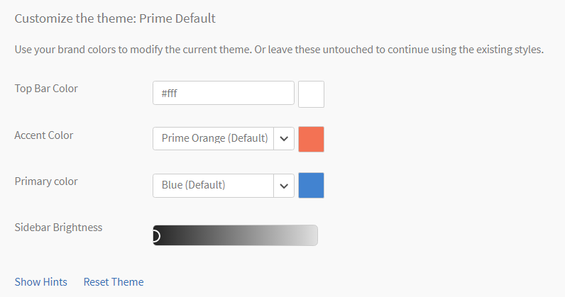

# Kleurthema&#39;s

Kleurthema&#39;s en branding in Leerbeheer

Met Learning Manager kunt u de weergave van de toepassing aanpassen aan de brandvereisten van uw organisatie.

## Branding {#branding}

Klikken **[!UICONTROL Branding]** in het linkerdeelvenster om de naam van uw organisatie bij te werken, wijzigt u het subdomein, de logstijlen en de thema&#39;s. Klikken **[!UICONTROL Bewerken]** naast elk van deze onderwerpen om de inhoud te wijzigen.

## Logostijlen {#logostyling}

Klikken **[!UICONTROL Bewerken]** om de weergave van uw logo en bedrijfsnaam in te stellen in de toepassing Learning Manager.

Klikken **[!UICONTROL Nieuw logo uploaden]** en kies het logo van uw computer dat u wilt uploaden. U kunt hieronder een voorvertoning van het logo en de naam van uw organisatie bekijken. Kies de koptekststijl naar keuze en klik op **[!UICONTROL Opslaan]**.

## Thema&#39;s {#themes}

Er zijn vijf representatieve afbeeldingen beschikbaar om een voorvertoning te bekijken van de wijzigingen in uw kleurthema voordat u deze toepast op uw toepassing. Blader door deze afbeeldingen door op de symbolen &lt; en > links en rechts van de afbeeldingen te klikken om een voorvertoning weer te geven. U kunt ook op de navigatiecirkels onder aan deze afbeeldingen klikken om door de set voorvertoningsmomentopnamen te bladeren.

**Kies een thema**

Klik op de knop **[!UICONTROL Hints weergeven]** onder deze sectie om de hints op de afbeelding weer te geven, zoals hieronder wordt weergegeven.

*Hints weergeven op een thema*

De toepassing Learning Manager biedt gebruikers vijf opties voor kleurthema&#39;s:

* Prime-standaard
* Kiezels
* Carnaval
* Herfst
* Winter lucht
* Levendig

*Kleuren van een thema aanpassen*

U kunt de kleur van de bovenste balk, de Accentkleur (bijvoorbeeld de kleur van de pictogrammen in het linkerdeelvenster), de primaire kleur en de helderheid van de zijbalk aanpassen voor thema&#39;s, behalve voor het Prime-standaardthema.

In het dialoogvenster **[!UICONTROL Primaire kleur]** kiezer, kunt u de kleur kiezen die wordt gebruikt voor de Immersive UI.

Kies het thematype in het linkerdeelvenster en klik op de vierkantjes naast de merkkleur en de pictogramkleuren op de zijbalk. Klik op de zijbalk in de helderheid van de zijbalk, sleep voor- of achteruit om de helderheid aan te passen. Bekijk de voorvertoning in de bovenstaande afbeeldingen terwijl u deze opties wijzigt.

Klikken **[!UICONTROL Thema opnieuw instellen]** om de oorspronkelijke instellingen van het thema te herstellen. Klikken **[!UICONTROL Opslaan]** nadat de wijzigingen zijn voltooid.

**Live voorvertoning**

Klikken **[!UICONTROL Live voorvertoning]** linksonder in de sectie Thema&#39;s. Er verschijnt een pop-up zoals hieronder weergegeven:

*Het pop-upvenster Live voorvertoning*

Kies het gewenste thema in de vervolgkeuzelijst, pas de instellingen aan en klik op **[!UICONTROL Voorvertoning]** om de wijzigingen live in uw toepassing weer te geven. U kunt nu alle functies van de toepassing bekijken en de wijzigingen bekijken. U kunt uw rollen ook wijzigen tijdens het live voorvertonen. Als u tevreden bent met de wijzigingen, kunt u teruggaan naar de pop-upfunctie Voorvertoning livethema en op **[!UICONTROL Thema toepassen]**.

Terwijl u een voorvertoning van de wijzigingen Live bekijkt, verschijnt het pop-upvenster Voorvertoning van livethema nog steeds onder aan het scherm. U kunt ervoor kiezen om de pop-up te minimaliseren.

## Uw account aanpassen {#customize}

Met Adobe Learning Manager kunt u uw account aanpassen voor een betere gebruikerservaring.

In de onderstaande lijst staan de onderdelen die kunnen worden aangepast. Neem contact op met Leermanager om het account aan te passen  [ondersteuning](mailto:captivateprimesupport@adobe.com).

<table>
 <tbody>
  <tr>
   <td>
    
<b>Aanpassen</b>
</td>
   <td>
    
<b>Wat wordt aanbevolen</b>
</td>
  </tr>
  <tr>
   <td>
    
De kleuren van trainingskaarten aanpassen
</td>
   <td>
    
 

    <ul>
     <li>Slechts maximaal 12 aangepaste kleuren. </li>
     <li>Kleuren worden toegepast op alle leerobjecten. De kleuren worden opeenvolgend toegepast op alle leerobjecten (trainingen) en de hexadecimale kleurcode is de vereiste indeling voor alle kleuren, bijvoorbeeld #ffffff.</li>
     <li>Als er slechts één kleur beschikbaar is, wordt die kleur toegepast op alle leerobjecten.</li>
    </ul>
    
 
</td>
  </tr>
  <tr>
   <td>
    
Cursoraanwijzerafbeelding
</td>
   <td>
    
De aangepaste afbeelding wordt weergegeven wanneer een gebruiker een leerobject aanwijst. 

    <ul>
     <li>Aangepaste afbeelding die is toegepast, wordt weergegeven nadat de gebruiker de muis op de webpagina van Learning Manager heeft geplaatst. </li>
     <li>Aanbevolen grootte - 16 x 16 of 24 x 24 px</li>
     <li>Aanbevolen afbeeldingsindeling - PNG, JPG</li>
    </ul></td>
  </tr>
  <tr>
   <td>
    
Afbeelding van Voortgangspictogram
</td>
   <td>Weergegeven tijdens navigeren tussen pagina's. Presenteer op plaatsen waar je de '4-kwadraat'-voortgangstoename ziet. 
    <ul>
     <li>Aanbevolen grootte - kleiner dan of gelijk aan 32x32 px</li>
     <li>Aanbevolen afbeeldingsindeling - GIF, PNG, JPG</li>
    </ul>
    
 
</td>
  </tr>
  <tr>
   <td>
    
Lettertypen
</td>
   <td>
    
Voor het toepassen van de lettertypen is een CDN vereist. U moet ook de lettertypefamilie delen die u wilt toepassen.

    
<b>Opmerking:</b> De lettertypefamilie moet in alle browsers worden ondersteund.
</td>
  </tr>
  <tr>
   <td>
    
Achtergrondafbeelding
</td>
   <td>
    
Een achtergrondafbeelding is alleen zichtbaar in een studentrol. 

    
U moet de afbeelding hebben die u op de achtergrond van de student moet toepassen.

    <ul>
     <li><b>Aanbevolen afbeeldingsindeling:</b> PNG, JPG, JPEG</li>
     <li><b>Aanbevolen grootte: </b>1400x908 px</li>
    </ul></td>
  </tr>
 </tbody>
</table>

## Aanbevelingsinstellingen configureren {#configurerecommendationsettings}

Aan **Branding** > **Algemeen** kunt u aanbevelingsbereiken voor interne en externe studenten configureren en studenten in staat stellen vaardigheden te kiezen op de startpagina van de student.

Op de **Algemeen** hebt u de volgende opties:

<table>
 <tbody>
  <tr>
   <td>
    
Studentenstartpagina
</td>
   <td>
    
Kies <strong>Klassiek </strong>of <strong>Immersive</strong>. Als u Immersive (Immersief) kiest, worden er andere opties weergegeven.
</td>
  </tr>
  <tr>
   <td>
    
Type training 
</td>
   <td>
    
Kies <strong>Aangepast </strong>of <strong>Branches uitgelijnd</strong>. Als er minder dan 1000 studenten zijn, wordt het gehele account beschouwd als één bereik. De aanbeveling is gebaseerd op alle studenten. 
</td>
  </tr>
  <tr>
   <td>
    
Omvanginstelling aanbeveling 
</td>
   <td>
    
Kies een of meer actieve velden. Voor <strong>Aangepast</strong>kunt u maximaal één actief veld kiezen. Voor <strong>Branches uitgelijnd</strong>kunt u maximaal vijf actieve velden kiezen. 
</td>
  </tr>
  <tr>
   <td>
    
Studenten in staat stellen interessegebieden te verkennen
</td>
   <td>
    
Alleen voor Klassieke ervaring. Kies <strong>Ja </strong>of <strong>Nee</strong>. 
</td>
  </tr>
  <tr>
   <td>
    
Vraag gebruikers om interessegebieden te selecteren (vaardigheden)  
</td>
   <td>
    
Alleen voor meeslepende ervaringen. Kies <strong>Ja</strong> of <strong>Nee</strong>. 
</td>
  </tr>
 </tbody>
</table>
