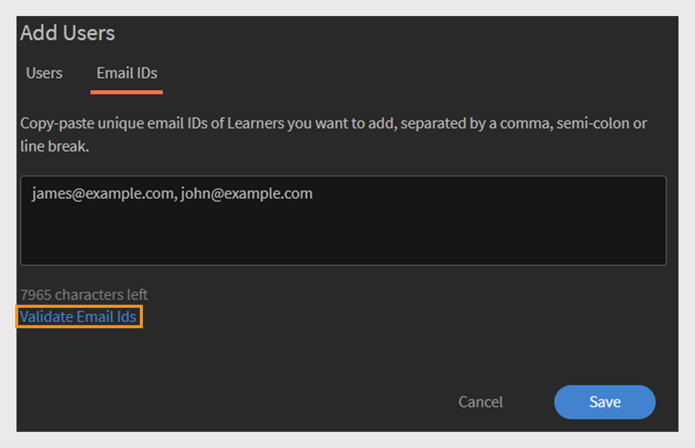
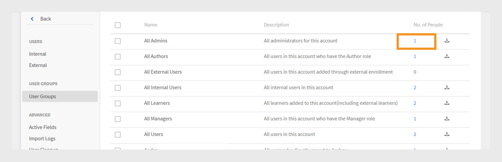

# Gebruikersgroepen in Adobe Learning Manager

Met gebruikersgroepen in Adobe Learning Manager kunt u studenten ordenen op basis van gemeenschappelijke kenmerken zoals afdeling, locatie of rol. Door gebruikers te groeperen, kunt u gemakkelijker cursussen toewijzen, machtigingen beheren en de voortgang van het leerproces voor meerdere gebruikers tegelijk bijhouden.

>[!INFO]
>
>Bekijk deze opleiding van de Academie ALM om te leren hoe te om een gebruikersgroep door namen te creëren, e-mail IDs, en het combineren van veelvoudige auto-geproduceerde gebruikersgroepen.    

## Typen gebruikersgroepen

Adobe Learning Manager ondersteunt de volgende gebruikersgroepen:

1. **auto-geproduceerde gebruikersgroepen:** in Adobe Learning Manager, leidt het systeem automatisch sommige gebruikersgroepen die op gebruikersrollen en attributen worden gebaseerd. Tot deze door het systeem gedefinieerde groepen behoren Alle auteurs, Alle beheerders, Alle studenten en Alle managers. Adobe Learning Manager genereert deze groepen om gebruikers op rol te ordenen. U kunt deze door het systeem gedefinieerde groepen niet hernoemen of verwijderen.

2. **de gebruikersgroepen van de Douane:** in Adobe Learning Manager, kunnen de beheerders douanegroepen tot stand brengen om studenten te organiseren die op specifieke criteria worden gebaseerd. Deze groepen zijn dynamisch en voegen automatisch gebruikers toe die aan de gedefinieerde voorwaarden voldoen. Met aangepaste groepen kun je gerichte leerpaden toewijzen, aangepaste branding toepassen en gerichte rapporten genereren. Ze zijn een flexibele tool voor het beheren en personaliseren van de leerervaring.

## Een aangepaste gebruikersgroep maken

Beheerders maken handmatig gebruikersgroepen om gebruikers te ordenen op basis van gedefinieerde kenmerken. Deze groepen kunnen dynamisch zijn en automatisch gebruikers toevoegen die aan de opgegeven criteria voldoen. Gebruikersgroepen vereenvoudigen taken zoals het toewijzen van leerpaden, het toepassen van aangepaste branding en het genereren van gerichte rapporten.

Een aangepaste gebruikersgroep maken:

1. Selecteer **Gebruikers** op de beheerderhomepage.
2. Selecteer **de Groepen van de Gebruiker** en selecteer dan **toevoegen**.

   
   _Knoop om een nieuwe gebruikersgroep in de pagina van de Groepen van de Gebruiker toe te voegen_

3. Typ de groepsnaam en -beschrijving.

   
   _de gebieden van de Input om groepsnaam en facultatieve beschrijving in te gaan_

## Gebruikers toevoegen aan de gebruikersgroep

Beheerders kunnen op twee manieren gebruikers aan een gebruikersgroep toevoegen:

### Gebruikerssectie

Beheerders kunnen de opname- en uitsluitingssets gebruiken om gebruikers of gebruikersgroepen toe te voegen of te verwijderen in de sectie Gebruikers.

* **Reeksen van de Opname** voegt gebruikers aan een douanegroep toe. U kunt een of meer gebruikersgroepen opnemen en Adobe Learning Manager gebruikt logica (AND/OR) om te bepalen welke gebruiker moet worden opgenomen. Verwijs naar deze [ sectie ](#_Inclusion_and_exclusion) om meer over logica te leren AND/OR.
* **Reeksen van de Uitsluiting** verwijderen gebruikers uit de groep, zelfs als zij deel van de opnemingsreeks uitmaakten. Hiermee verfijnt u de gebruikerslijst van de groep.

Gebruikers aan de groep toevoegen:

1. Het onderzoek en selecteert gebruikers of bestaande gebruikersgroep in het **omvat het gebied van Studenten**.

_de montages van de Opname om specifieke gebruikers of groepen aan een douanegroep toe te voegen_

### Sectie E-mail-id&#39;s

1. Typ de e-mailadressen van de gebruiker in een komma, puntkomma of regeleinde indeling om de gebruikers aan de groep toe te voegen.

2. Selecteer **bevestigen e-mail IDs**.

   
   _selecteer bevestigen E-mail ID&#39;s om ingevoerde e-mail IDs_ te bevestigen

   Er wordt een fout weergegeven als Adobe Learning Manager niet over de e-mail-ID beschikt of als de e-mail-ID onjuist is.

   
   _Gebied om veelvoudige e-mailadressen manueel in te gaan voor het toevoegen van gebruikers aan een groep_

3. Selecteer **sparen** om de groep tot stand te brengen.

## Gebruikers uitsluiten van de groep

Beheerders kunnen specifieke gebruikers van een gebruikersgroep uitsluiten, zelfs als ze aan de criteria van de groep voldoen. Dit is handig wanneer u uitzonderingen wilt maken, zoals voorkomen dat bepaalde gebruikers toegewezen cursussen ontvangen of verschijnen in rapporten die aan die groep zijn gekoppeld.

Specifieke gebruikers of volledige gebruikersgroepen uitsluiten bij het maken van een aangepaste gebruikersgroep:

1. Selecteer om het even welke **Groepen van de Gebruiker** en selecteer dan **toevoegen**.
2. Navigeer aan de **Uitsluiten Studenten** sectie.
3. Selecteer de gebruikers of groepen die u wilt uitsluiten.

_montages van de Uitsluiting om gebruikers of groepen uit een douanegroep te verwijderen_

## Groepsleden weergeven

Beheerders kunnen een lijst weergeven met gebruikers in een gebruikersgroep, inclusief gegevens zoals naam, e-mail-ID en status. De lijst met gebruikers weergeven:

1. Selecteer **Gebruikers** en selecteer dan **de Groepen van de Gebruiker**.
2. Selecteer een groep en selecteer dan de waarde in **Nr. van Personen** kolom.

_Lijst van gebruikers momenteel inbegrepen in een geselecteerde gebruikersgroep_

_Lijst van gebruikers beschikbaar op de geselecteerde gebruikersgroep_

## Groepsleden downloaden

Beheerders kunnen een lijst met groepsleden downloaden om gebruikersgegevens te bekijken, zoals naam, e-mail, status, toegevoegde datum (UTC-tijdzone), verwijderingsdatum (UTC-tijdzone) en laatste aanmeldingsdatum (UTC-tijdzone). Dit helpt bij het bijhouden, rapporteren en controleren van groepslidmaatschap.

1. Selecteer **Gebruikers** en selecteer dan **de Groepen van de Gebruiker**.
2. Selecteer het downloadpictogram naast een groep om het rapport als een CSV-bestand te exporteren.

_pictogram van de Download om de gegevens van het groepslid als Csv- dossier uit te voeren_

De kolommen van het groepslidrapport zijn als volgt:

* **Naam**: Naam van de gebruiker
* **E-mail**: E-mail identiteitskaart van het gebruik
* **Status**: Status van de gebruiker (Geregistreerd of niet Geregistreerd).
* **Toegevoegde Datum (UTC TimeZone)**: Datum de gebruiker werd toegevoegd in UTC tijdzone.
* **Datum van de Schrapping (UTC TimeZone)**: Datum de gebruiker werd geschrapt in UTC tijdzone.
* **Laatste Login Datum (UTC TimeZone)**: Datum de gebruiker het laatst het programma opende UTC tijdzone.

_Steekproef CSV bevat de gebruikersdetails_

## Een gebruikersgroep bewerken

Beheerders kunnen een groep bewerken om de naam, beschrijving of andere details ervan te wijzigen.

Een gebruikersgroep bewerken:

1. Selecteer **Gebruikers** op de beheerderhomepage.
2. Selecteer **Gebruikersgroepen**.
3. Selecteer de gebruikersgroep die u wilt bewerken.
4. Breng de benodigde wijzigingen aan, zoals het bijwerken van de naam, beschrijving of andere details.
5. Selecteer **sparen** om de veranderingen toe te passen. De wijzigingen worden toegepast op de gebruikersgroep.

_Gebieden om de naam, beschrijving, of lidmaatschapsregels van de gebruikersgroep te wijzigen_

## Een gebruikersgroep verwijderen

Beheerders kunnen gebruikersgroepen verwijderen die niet meer nodig zijn om de lijst met groepen overzichtelijk en up-to-date te houden.

Een gebruikersgroep verwijderen:

1. Selecteer **Gebruikers** en selecteer dan **de Groepen van de Gebruiker**.
2. Selecteer de groep die u wilt verwijderen.
3. Selecteer **Acties** en selecteer dan **Schrapping**.

   
   _optie van de Schrapping in het menu van Acties om een gebruikersgroep_ te verwijderen

4. Bevestig de verwijdering wanneer hierom wordt gevraagd. De gebruikersgroep wordt verwijderd.

## Rapport voor gebruikersgroep downloaden

De gebruikersgroeprapporten van Adobe Learning Manager bieden beheerders en managers inzichten in de prestaties van verschillende gebruikersgroepen, zoals afdelingen, rollen of externe partners. Deze rapporten maken vergelijkingen tussen groepen mogelijk om de voortgang van het leerproces, de voltooiingspercentages van de cursus en de betrokkenheidsniveaus te evalueren.

Het rapport downloaden:

1. Selecteer **Gebruikers** en selecteer dan **de Groepen van de Gebruiker**.
2. Selecteer **Acties** en selecteer dan **Rapport van de Groep van de Gebruiker van de Download**.

_Optie om groep-vlakke informatie en meta-gegevens van het menu van Acties_ te downloaden

Dit rapport bevat:

| Kolom | Beschrijving |
|---|---|
| Type gebruikersgroep | De categorie van de gebruikersgroep, zoals automatisch gegenereerde of aangepaste groep. |
| Naam | De naam die aan de gebruikersgroep is toegewezen. |
| Beschrijving | Een korte uitleg van het doel of het bereik van de gebruikersgroep. |
| Gemaakt door (naam) | De volledige naam van de beheerder die de groep heeft gemaakt. |
| Gemaakt door (e-mail) | Het e-mailadres van de beheerder die de groep heeft gemaakt. |
| Gemaakt op (UTC-tijdzone) | De datum en tijd waarop de groep is gemaakt, weergegeven in UTC (Coordinated Universal Time). |
| Aantal gebruikers | Het totale aantal gebruikers dat momenteel in de groep is opgenomen. |

_het groepsrapport van de Gebruiker bevat alle gebieden_

## Regels voor het opnemen en uitsluiten van aangepaste gebruikersgroepen

Wanneer het creëren van a **douanegroep** door auto-geproduceerde of bestaande gebruikersgroepen toe te voegen, past Adobe Learning Manager specifieke **opneming en uitsluitingsregels** toe die op **EN/OF logica** worden gebaseerd. Deze regels zijn afhankelijk van de manier waarop gebruikersgroepen worden gecombineerd in de opname- en uitsluitingssets.

U kunt een of meer automatisch gegenereerde gebruikersgroepen toevoegen aan de opnameset. De toegepaste logica is afhankelijk van de manier waarop u deze groepen selecteert:

### Gebruik en logica in gebruikersgroepen

Als u meerdere gebruikersgroepen binnen dezelfde opnameset selecteert, moeten gebruikers aan alle voorwaarden voldoen om te worden opgenomen.

Bijvoorbeeld:

* Groep van verkoopteams: 120 gebruikers
* Locatie (Bangalore) groep: 80 gebruikers
* Gemeenschappelijke gebruikers in **beide** groepen: 40 gebruikers

Adobe Learning Manager gebruikt AND Logic om een groep met slechts 40 gebruikers te maken. Deze gebruikers maken deel uit van het Sales Team en zijn ook gevestigd in Bangalore, dat aan beide voorwaarden voldoet.

_Voorbeeld dat veelvoudige groepen toont gecombineerd gebruikend EN logica_

### OR-logica gebruiken in gebruikersgroepen

Als u gebruikersgroepen toevoegt in afzonderlijke opnamesets, worden gebruikers die aan een bepaalde voorwaarde voldoen, opgenomen. Bijvoorbeeld:

* Groep van verkoopteams: 120 gebruikers
* Locatie (Bangalore) groep: 80 gebruikers
* Totaal aantal gebruikers in een van beide groepen: 160 gebruikers (sommige gebruikers kunnen in beide groepen zijn)

Als u OR-logica gebruikt, voegt Adobe Learning Manager gebruikers toe die zich in het Sales Team of in Bangalore bevinden. Dit betekent dat het ook gebruikers omvat die aan een van de twee voorwaarden voldoen. Het resultaat is dat de groep 160 gebruikers bevat na het verwijderen van duplicaten.

_Voorbeeld dat veelvoudige groepen toont gecombineerd gebruikend OF logica_

