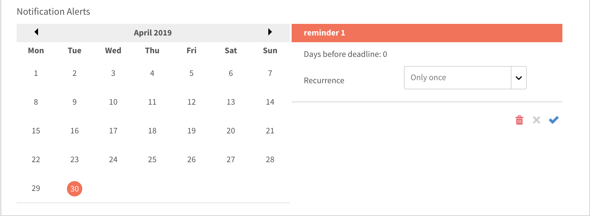

# Meldingen

De meldingsfunctie is van toepassing op alle gebruikers van Adobe Learning Manager. Maar elke gebruiker krijgt verschillende soorten meldingen in verschillende scenario&#39;s op basis van zijn of haar rol. Alle waarschuwingen en meldingen voor gebruikers worden weergegeven via het pop-upvenster met meldingen.

## Toegangsmeldingen {#accessnotifications}

Gebruikers kunnen meldingen zien door rechtsboven in het venster op het meldingenpictogram te klikken. Dit pop-upvenster toont de hoogtepunten van alle meldingen samen met het tijdstip waarop deze verschenen en een schuifbalk. Als u meer informatie over alle meldingen wilt weergeven, klikt u op Alle meldingen weergeven onder aan het pop-upvenster. De pagina Meldingen verschijnt.

Het aantal nieuwe meldingen staat in het gemarkeerde getal boven het meldingenpictogram. Als er bijvoorbeeld vijf nieuwe meldingen zijn na uw vorige aanmelding, ziet u het getal 5 boven het meldingenpictogram. Deze getallen verdwijnen als u alle laatste meldingen hebt gelezen.

## Typen meldingen voor beheerders {#typesofnotificationsforadministrators}

Beheerders krijgen meldingen in de volgende gevallen:

* Wanneer een CSV-lijst met gebruikers is geüpload.
* Telkens wanneer het uploaden van een CSV-lijst met gebruikers mislukt. De beheerder krijgt een bericht met de reden voor de fout.
* De beheerder kan ook meldingen op instantieniveau instellen voor cursussen en leerprogramma&#39;s. In dit geval krijgt de beheerder de meldingen op basis van de frequentie die op instantieniveau is geselecteerd.

>[!NOTE]
>
>Als een beheerder naast zijn rol ook auteur- of beheerdersrechten heeft, krijgt de beheerder meldingen met betrekking tot elke rol.

In het volgende screenshot ziet u een voorbeeld van een meldingsvenster voor de beheerdersrol:

*Beheermeldingen weergeven*

Dit pop-upvenster toont de hooglichten van alle meldingen, het tijdstip waarop deze verschenen en een schuifbalk. Het aantal nieuwe meldingen is gebaseerd op het gemarkeerde aantal boven op het meldingenpictogram. Als er bijvoorbeeld vijf nieuwe meldingen zijn na uw vorige aanmelding, ziet u het getal 5 boven het meldingenpictogram. Deze getallen verdwijnen als u alle laatste meldingen hebt gelezen.

Klikken **[!UICONTROL Alle meldingen tonen]** onder aan het meldingsvenster om alle meldingen op een aparte pagina weer te geven.

## escalatiemeldingen op meerdere niveaus instellen {#setupmultilevelescalationnotifications}

Escalatiemails over het missen van deadlines van studenten kunnen naar de manager en een skip-manager worden gestuurd. U kunt escalatiemeldingen op meerdere niveaus instellen voor het niet voltooien van de cursus tijdens het maken van een cursus of zelfs nadat deze is gemaakt. U kunt instellen dat escalatiemeldingen met een ingestelde frequentie worden verzonden naar een manager of een skip-manager.

1. Meld u aan als beheerder of auteur en klik op Cursussen.
1. Selecteer de cursus waarvoor u de escalatiemeldingen wilt wijzigen en klik op **[!UICONTROL Cursus weergeven]**.

   

   *Selecteer de optie Cursus weergeven*

1. Klik op **[!UICONTROL Instanties]** > **[!UICONTROL Meldingswaarschuwingen]**.

   

   *Selecteer de optie Meldingswaarschuwingen*

1. Er wordt een kalender geopend met de in rood gemarkeerde deadline voor de cursus. Klik op de gemarkeerde datum om te zien hoe de herinneringen zijn ingesteld voor de student.

   

   *Herinneringen voor deadline weergeven*

1. Stel herinneringen in door datums vóór de deadline te selecteren. Zo kunt u herinneringen instellen voor de student over de naderende deadline.

   

   *Stel een deadline voor een herinneringsdatum in*

1. Selecteer een datum na de deadline om een herinneringsschema voor de student en escalatiemeldingen voor de manager in te stellen.

   

   *Herinneringen en escalatiedatums instellen*

1. Als de student de cursus nog steeds niet voltooit, zelfs na escalatie naar de manager, kunt u met de instellingen naar de skip-manager van de student escaleren. Klik op een datum na de verlengde deadline, selecteer de herhaling van herinneringen, het aantal dagen voor het schema en selecteer **Manager &amp; Niveaubeheer overslaan** in de **Escalatie** vervolgkeuzelijst. Klik op het blauwe vinkje om de meldingsinstellingen op te slaan.

   

   *Meldingsinstellingen opslaan*

## Veelgestelde vragen {#frequentlyaskedquestions}

+++Hoe kunt u herinneringsmeldingen voor de instantie instellen?

Klik op Meldingswaarschuwingen voor een instantie. Er wordt een kalender geopend met de in rood gemarkeerde deadline voor de cursus. Klik op de gemarkeerde datum om te zien hoe de herinneringen zijn ingesteld voor de student. Stel de herinneringen in, zoals uitgelegd in dit [sectie](user-notifications.md#Setupmultilevelescalationnotifications).
+++
